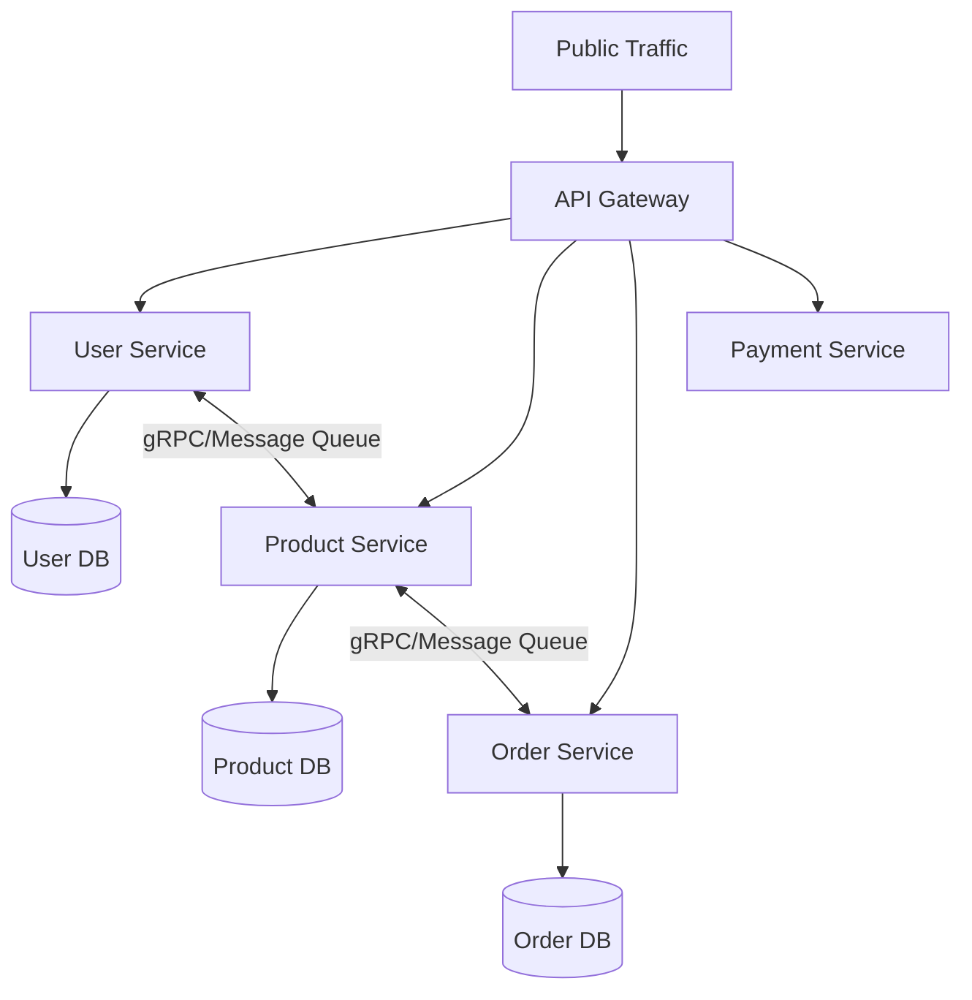

# TASK-00067: Kiến trúc Phân tán: Hệ thống Microservices (Distributed Systems: Microservices Architecture)

## 📋 Metadata

- **Task ID**: TASK-00067
- **Độ ưu tiên**: 🟡 THẤP (Future Scaling)
- **Phụ thuộc**: TASK-00065 (Docker/K8s), TASK-00049 (Event Handling)
- **Trạng thái**: ✅ Done

---

## 🎯 CHIẾN LƯỢC PHÂN TÁN (Distribution Strategy)

### 💡 Tại sao Microservices quan trọng?
Khi ứng dụng trở nên quá lớn (Monolith), việc bảo trì và triển khai các thay đổi nhỏ trở nên chậm chạp và rủi ro. Kiến trúc Microservices chia nhỏ ứng dụng thành các dịch vụ độc lập (User, Product, Order, Payment), mỗi dịch vụ có thể được phát triển, triển khai và mở rộng quy mô một cách riêng biệt. Điều này cực kỳ quan trọng đối với các doanh nghiệp có hàng triệu người dùng và hàng trăm kỹ sư làm việc cùng lúc.
- **Independent Scaling**: Có thể tăng số lượng server cho dịch vụ Order mà không cần tăng cho dịch vụ Product.
- **Fault Isolation**: Nếu dịch vụ Notification bị lỗi, khách hàng vẫn có thể tìm kiếm và đặt hàng bình thường.
- **Technology Agnostic**: Cho phép sử dụng các ngôn ngữ lập trình khác nhau cho các dịch vụ khác nhau tùy theo ưu điểm (ví dụ: Python cho AI, NestJS cho API).

---

## 🏗️ MÔ HÌNH HỆ THỐNG PHÂN TÁN (Distributed Model)

---

## 📄 QUY TẮC QUẢN TRỊ (Operational Rules)

### 1. Phân tách Cơ sở dữ liệu (Database per Service)
- Mỗi Microservice phải sở hữu và quản lý cơ sở dữ liệu riêng của mình. Tuyệt đối không có chuyện hai dịch vụ khác nhau cùng truy cập trực tiếp vào một bảng dữ liệu. Điều này đảm bảo tính độc lập hoàn toàn và tránh "hiệu ứng domino" khi có lỗi DB.

### 2. Giao tiếp Liên dịch vụ (Inter-service Communication)
- Sử dụng **Request-Response (gRPC/HTTP)** cho các tác vụ cần kết quả ngay lập tức.
- Sử dụng **Event-driven (Message Queue)** cho các tác vụ không đồng bộ để giảm sự phụ thuộc lẫn nhau (Loose Coupling).

### 3. Khám phá Dịch vụ (Service Discovery)
- Trong môi trường đám mây, các địa chỉ IP của dịch vụ thay đổi liên tục. Hệ thống phải sử dụng một công cụ trung gian (Service Registry) để các dịch vụ tự động tìm thấy nhau mà không cần cấu hình IP thủ công.

---

## ✅ TIÊU CHUẨN THÀNH CÔNG (Definition of Success)

- [x] **Fault Resilience**: Một dịch vụ chết không làm sập toàn bộ hệ thống (Cascading failure prevention).
- [x] **Zero-Downtime Deployment**: Triển khai phiên bản mới cho một dịch vụ mà không ảnh hưởng đến các dịch vụ khác.
- [x] **Efficient Scaling**: Tiết kiệm 40-50% chi phí hạ tầng bằng cách chỉ scale những dịch vụ đang chịu tải cao.

---

## 🧪 TDD PLANNING (Distributed Scenarios)

| Kịch bản | Mong đợi |
| :--- | :--- |
| **Service Outage** | Dịch vụ Gợi ý sản phẩm bị dừng -> Trang chủ vẫn hiện danh sách sản phẩm nhưng ẩn phần gợi ý -> Người dùng vẫn mua hàng được. |
| **Data Synchronization** | User đổi tên ở User Service -> Product Service tự động cập nhật tên tác giả trong các đánh giá (via Events). |
| **Independent Scale** | Flash Sale diễn ra -> Số lượng Pod của Order Service tự động tăng lên 20, trong khi User Service vẫn giữ nguyên 2 Pod. |
