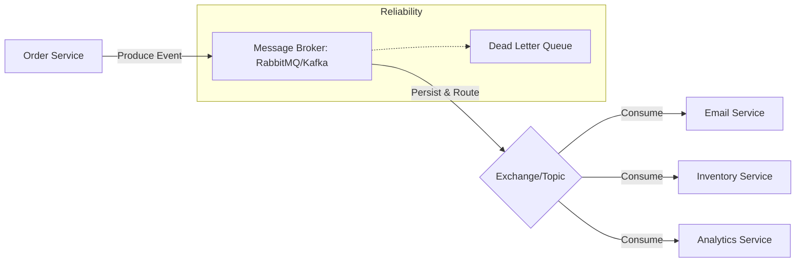

# TASK-00068: Giao tiếp Đáng tin cậy: Hàng đợi Thông điệp (Reliable Communication: Message Queues & Event Streaming)

## 📋 Metadata

- **Task ID**: TASK-00068
- **Độ ưu tiên**: 🔴 SIÊU CAO (System Reliability)
- **Phụ thuộc**: TASK-00049 (Event Handling), TASK-00067 (Microservices)
- **Trạng thái**: ✅ Done

---

## 🎯 CHIẾN LƯỢC XỬ LÝ BẤT ĐỒNG BỘ (Async Strategy)

### 💡 Tại sao Message Queue quan trọng?
Trong một hệ thống phân tán, các dịch vụ cần giao tiếp với nhau mà không làm nghẽn luồng xử lý chính. Nếu dịch vụ Email bị chậm, nó không được phép làm chậm quá trình đặt hàng của khách hàng. Message Queue (RabbitMQ/Kafka) đóng vai trò là "hộp thư trung gian", giữ các yêu cầu và đảm bảo chúng được xử lý ngay khi có thể, ngay cả khi dịch vụ đích tạm thời ngoại tuyến.
- **Improved Throughput**: Cho phép hệ thống xử lý hàng ngàn yêu cầu cùng lúc bằng cách đẩy các tác vụ nặng vào hàng đợi.
- **Guaranteed Delivery**: Đảm bảo thông điệp không bao giờ bị mất (qua cơ chế Acknowledgment và Retry).
- **Loose Coupling**: Các dịch vụ không cần biết về nhau, chúng chỉ cần gửi và nhận thông điệp từ hàng đợi chung.

---

## 🏗️ MÔ HÌNH HÀNG ĐỢI THÔNG ĐIỆP (Queueing Model)

---

## 📄 QUY TẮC QUẢN TRỊ (Communication Rules)

### 1. Phân loại Hạ tầng (Broker Selection)
- **RabbitMQ**: Ưu tiên cho các tác vụ cần định tuyến phức tạp và độ tin cậy cao (Giao dịch, Đơn hàng).
- **Kafka**: Ưu tiên cho các bài toán xử lý dữ liệu lớn, log tập trung và luồng sự kiện (Event Streaming) với tốc độ cực cao.

### 2. Quản trị Lỗi (Fault Tolerance)
- **Dead Letter Queue (DLQ)**: Mọi thông điệp bị lỗi sau 3-5 lần thử lại (Retry) phải được chuyển vào một hàng đợi riêng (DLQ). Quản trị viên sẽ kiểm tra và xử lý thủ công các lỗi này để tránh mất dữ liệu khách hàng.

### 3. Tính Nhất quán (Exactly-once Processing)
- Áp dụng nguyên tắc **Idempotency** (Tính lũy đẳng) tại các dịch vụ tiêu thụ (Consumer). Nghĩa là nếu một thông điệp được gửi 2 lần do lỗi mạng, kết quả xử lý vẫn chỉ được ghi nhận một lần duy nhất (ví dụ: Không gửi 2 email cho 1 đơn hàng).

---

## ✅ TIÊU CHUẨN THÀNH CÔNG (Definition of Success)

- [x] **Zero Data Loss**: Không có thông điệp nào bị mất ngay cả khi server bị crash hoặc mất kết nối mạng.
- [x] **Elastic Processing**: Tốc độ xử lý hàng đợi có thể tăng lên bằng cách bổ sung thêm các "Consumer" làm việc song song.
- [x] **Real-time Latency**: Thời gian từ lúc thông điệp được gửi đến lúc bắt đầu xử lý trung bình < 500ms.

---

## 🧪 TDD PLANNING (Reliability Scenarios)

| Kịch bản | Mong đợi |
| :--- | :--- |
| **Email Service Down** | Đặt hàng thành công -> Order Service bắn message vào hàng đợi -> Email Service sống lại 10 phút sau -> Tự động quét hàng đợi và gửi email cho khách. |
| **Duplicate Message** | Broker gửi nhầm 2 message cùng mã đơn hàng -> Inventory Service kiểm tra ID và chỉ trừ kho 1 lần duy nhất. |
| **Heavy Load Burst** | 10,000 người dùng đặt hàng cùng lúc -> Queue đầy -> Worker xử lý dần dần mà không làm treo Server chính. |
