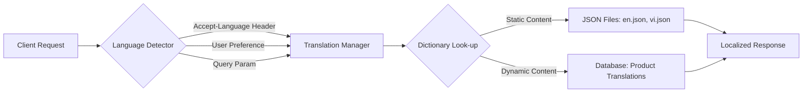

# TASK-00069: Tầm nhìn Toàn cầu: Đa ngôn ngữ & Nội địa hóa (Global Reach: Multi-language & Localization)

## 📋 Metadata

- **Task ID**: TASK-00069
- **Độ ưu tiên**: 🔵 TRUNG BÌNH (Scalability)
- **Phụ thuộc**: TASK-00008 (Product Entity)
- **Trạng thái**: ✅ Done

---

## 🎯 CHIẾN LƯỢC NỘI ĐỊA HÓA (Localization Strategy)

### 💡 Tại sao Đa ngôn ngữ (i18n) quan trọng?
Để trở thành một nền tảng thương mại điện tử tầm cỡ quốc tế, hệ thống không thể chỉ bó hẹp trong một ngôn ngữ duy nhất. i18n cho phép ứng dụng tự động điều chỉnh ngôn ngữ, định dạng ngày tháng và đơn vị đo lường theo vùng miền của người dùng. Điều này không chỉ giúp mở rộng thị trường mà còn mang lại trải nghiệm thân thiện, gần gũi nhất cho khách hàng ở bất cứ đâu.
- **Market Expansion**: Tiếp cận tập khách hàng đa quốc gia một cách dễ dàng.
- **Personalized Experience**: Chăm sóc khách hàng bằng ngôn ngữ mẹ đẻ của họ, tăng tỷ lệ chuyển đổi và lòng trung thành.
- **Consistent Communication**: Đảm bảo mọi email, thông báo và tài liệu đều được dịch chuẩn xác và chuyên nghiệp.

---

## 🏗️ LUỒNG XỬ LÝ ĐA NGÔN NGỮ (Localization Workflow)

---

## 📄 QUY TẮC QUẢN TRỊ (Localization Rules)

### 1. Phân loại Nội dung Dịch (Content Scopes)
- **Static Strings**: Các nhãn, tiêu đề, thông báo lỗi cố định (Lưu trong tệp JSON).
- **Dynamic Content**: Tên sản phẩm, mô tả danh mục (Lưu trong Database bằng bảng phụ hoặc cấu trúc JSONB).
- **Media Assets**: Hình ảnh chứa chữ, video demo (Sử dụng URL khác nhau tùy theo ngôn ngữ).

### 2. Định danh Ngôn ngữ (Standardization)
- Sử dụng chuẩn **ISO 639-1** để đặt tên các tệp ngôn ngữ (Ví dụ: `en`, `vi`, `ja`). Hệ thống mặc định sẽ fall-back về tiếng Anh (`en`) nếu một từ khóa không tìm thấy bản dịch ở ngôn ngữ hiện tại.

### 3. Quy trình Biên dịch (Translation Governance)
- Tuyệt đối không hard-code chữ vào mã nguồn (Code). Mọi thông tin hiển thị phải được gọi qua hàm `translate()`. Điều này đảm bảo khi cần bổ sung ngôn ngữ mới, chúng ta chỉ cần thêm tệp dịch mà không cần chạm vào logic của ứng dụng.

---

## ✅ TIÊU CHUẨN THÀNH CÔNG (Definition of Success)

- [x] **Zero Hard-coded Strings**: Toàn bộ UI có thể chuyển đổi ngôn ngữ chỉ bằng một cú click.
- [x] **Dynamic Scalability**: Bổ sung ngôn ngữ mới (ví dụ: Tiếng Pháp) hoàn tất trong < 1 giờ bằng cách nạp tệp dịch.
- [x] **Correct Formatting**: Ngày tháng, tiền tệ và các định dạng vùng miền (RTL - Right to Left nếu cần) hiển thị chính xác theo quốc gia.

---

## 🧪 TDD PLANNING (Localization Scenarios)

| Kịch bản | Mong đợi |
| :--- | :--- |
| **Header Detection** | Request có `Accept-Language: vi` -> API trả về thông báo lỗi bằng tiếng Việt. |
| **Missing Key** | Ngôn ngữ hiện tại không có bản dịch cho phím `PROMO_BANNER` -> Hệ thống tự động hiển thị bản dịch tiếng Anh (Mặc định). |
| **Product Translation** | Xem sản phẩm ở phiên bản Tiếng Việt -> Tên và mô tả hiện tiếng Việt. Chuyển sang Tiếng Anh -> Nội dung tự động cập nhật sang Tiếng Anh. |
