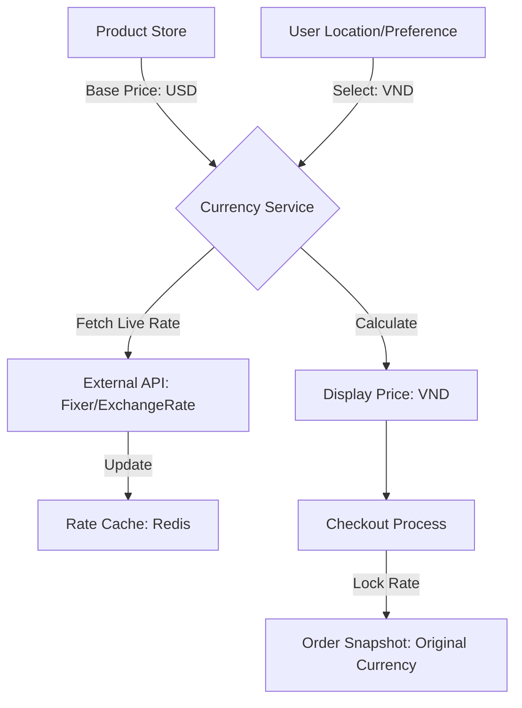

# TASK-00070: Thương mại Toàn cầu: Đa tiền tệ & Giá động (Global Commerce: Multi-currency & Dynamic Pricing)

## 📋 Metadata

- **Task ID**: TASK-00070
- **Độ ưu tiên**: 🔵 TRUNG BÌNH (Scalability)
- **Phụ thuộc**: TASK-00069 (i18n), TASK-00027 (Order Management)
- **Trạng thái**: ✅ Done

---

## 🎯 CHIẾN LƯỢC KINH DOANH QUỐC TẾ (Global Business Strategy)

### 💡 Tại sao Đa tiền tệ quan trọng?
Để khách hàng quốc tế cảm thấy tự tin khi mua sắm, giá cả phải được hiển thị bằng đơn vị tiền tệ mà họ quen thuộc. Việc tự động chuyển đổi tỷ giá và hiển thị giá nội địa giúp loại bỏ rào cản tâm lý về chi phí, từ đó tăng đáng kể tỷ lệ hoàn tất đơn hàng (Checkout rate).
- **Price Transparency**: Khách hàng biết chính xác họ phải trả bao nhiêu mà không cần tự tính toán tỷ giá.
- **Localization Trust**: Tạo cảm giác hệ thống chuyên nghiệp và được tối ưu hóa cho thị trường địa phương.
- **Financial Flexibility**: Cho phép doanh nghiệp quản lý doanh thu theo nhiều loại tiền tệ khác nhau để tối ưu hóa lợi nhuận.

---

## 🏗️ MÔ HÌNH CHUYỂN ĐỔI TIỀN TỆ (Currency Conversion Model)

---

## 📄 QUY TẮC QUẢN TRỊ (Commerce Rules)

### 1. Quản trị Tỷ giá (Rate Management)
- Hệ thống hỗ trợ hai cơ chế: **Tự động (Auto)** - cập nhật từ API quốc tế mỗi 12-24 giờ, và **Thủ công (Manual Override)** - dành cho các trường hợp doanh nghiệp muốn cố định tỷ giá để bảo vệ lợi nhuận trước biến động thị trường.

### 2. Giá trị Snapshot (Financial Integrity)
- Khi một đơn hàng được tạo, hệ thống phải lưu lại "Snapshot" của tỷ giá tại thời điểm đó. Điều này đảm bảo rằng nếu tỷ giá có thay đổi trong tương lai, tổng giá trị đơn hàng của khách hàng vẫn được giữ nguyên và không gây tranh chấp tài chính.

### 3. Hiển thị vs Thanh toán (Display vs Payment)
- Mặc dù giá có thể hiển thị bằng nhiều loại tiền tệ, nhưng quá trình thanh toán thực tế (Transaction) có thể được cấu hình để luôn diễn ra bằng đồng tiền cơ sở (Base Currency) để đơn giản hóa việc đối soát kế toán.

---

## ✅ TIÊU CHUẨN THÀNH CÔNG (Definition of Success)

- [x] **Real-time Accuracy**: Giá hiển thị dựa trên tỷ giá mới nhất với sai số < 0.1%.
- [x] **Seamless UX**: Người dùng có thể chuyển đổi loại tiền tệ ngay lập tức trên trang danh sách sản phẩm.
- [x] **Multi-currency Reports**: Admin có thể xem báo cáo doanh thu theo cả đồng tiền cơ sở và đồng tiền địa phương.

---

## 🧪 TDD PLANNING (Commerce Scenarios)

| Kịch bản | Mong đợi |
| :--- | :--- |
| **User Change Currency** | Product giá 100 USD -> User chọn VND -> UI hiển thị ~2.500.000 VND ngay lập tức. |
| **Order Consistency** | Tỷ giá USD/VND thay đổi từ 24k lên 25k -> Đơn hàng cũ đã đặt lúc 24k vẫn giữ nguyên giá trị thanh toán cũ. |
| **API Rate Failure** | API tỷ giá bên thứ ba bị sập -> Hệ thống tự động sử dụng tỷ giá cũ gần nhất lưu trong Cache để đảm bảo việc mua bán không bị gián đoạn. |
