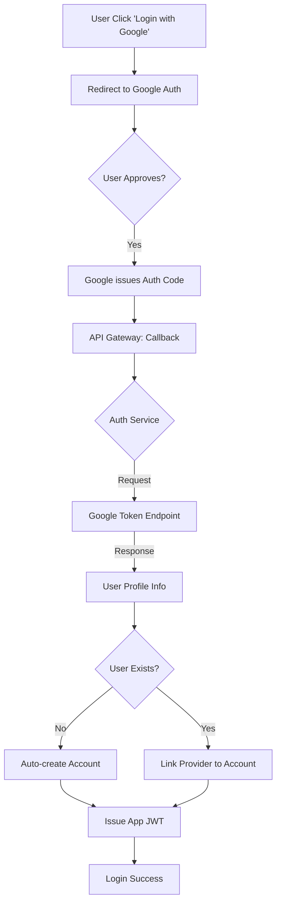

# TASK-00071: Định danh Không ma sát: Đăng nhập Mạng xã hội & OAuth (Frictionless Identity: Social Login & OAuth Integration)

## 📋 Metadata

- **Task ID**: TASK-00071
- **Độ ưu tiên**: 🔴 SIÊU CAO (User Friction Reduction)
- **Phụ thuộc**: TASK-00012 (JWT Auth), TASK-00014 (Implem Register/Login)
- **Trạng thái**: ✅ Done

---

## 🎯 CHIẾN LƯỢC ĐỊNH DANH NGƯỜI DÙNG (Identity Strategy)

### 💡 Tại sao Đăng nhập Mạng xã hội (Social Login) quan trọng?
Việc bắt người dùng phải điền một biểu mẫu đăng ký dài dằng dặc là nguyên nhân hàng đầu khiến họ rời bỏ ứng dụng trước khi mua hàng. Đăng nhập bằng Google, Facebook hoặc Apple cho phép người dùng tạo tài khoản chỉ bằng một cú nhấp chuột. Điều này không chỉ giúp tăng tỷ lệ chuyển đổi mà còn giúp hệ thống thu thập được thông tin người dùng đã được xác thực từ các nguồn uy tín.
- **Improved Conversion Rate**: Giảm thiểu rào cản đăng ký, giúp khách hàng bắt đầu mua sắm ngay lập tức.
- **Accurate User Data**: Lấy được Email và Tên thật đã được xác minh từ các nền tảng lớn.
- **Security Trust**: Người dùng không cần phải ghi nhớ thêm một mật khẩu mới, giảm rủi ro bị mất tài khoản hoặc quên mật khẩu.

---

## 🏗️ LUỒNG XÁC THỰC BÊN THỨ BA (OAuth 2.0 Flow)

---

## 📄 QUY TẮC QUẢN TRỊ (Identity Rules)

### 1. Hợp nhất Tài khoản (Account Merging)
- Nếu người dùng đăng ký bằng Email thủ công, sau đó đăng nhập bằng Google sử dụng cùng một Email đó, hệ thống phải tự động nhận diện và liên kết (Link) chúng lại với nhau thay vì tạo hai tài khoản riêng biệt. Điều này đảm bảo một trải nghiệm duy nhất và nhất quán cho khách hàng.

### 2. Quản trị Dữ liệu (Privacy & Scope)
- Chỉ yêu cầu những thông tin thực sự cần thiết (Email, Name, Avatar). Tuyệt đối không yêu cầu các quyền hạn nhạy cảm (truy cập danh bạ, bài viết) trừ khi có lý do nghiệp vụ cực kỳ rõ ràng. Điều này giúp tăng niềm tin từ phía người dùng.

### 3. Đồng bộ Trạng thái (Profile Sync)
- Trong lần đăng nhập đầu tiên qua mạng xã hội, hệ thống sẽ tự động cập nhật ảnh đại diện (Avatar) và Tên hiển thị từ nhà cung cấp. Tuy nhiên, sau đó người dùng có quyền tùy chỉnh thông tin này trong trang cá nhân của mình.

---

## ✅ TIÊU CHUẨN THÀNH CÔNG (Definition of Success)

- [x] **One-Click Onboarding**: Người dùng mới có thể đăng nhập thành công trong < 10 giây mà không cần điền bất cứ thông tin nào.
- [x] **Secure Token Exchange**: Toàn bộ quá trình trao đổi Token tuân thủ nghiêm ngặt tiêu chuẩn **OAuth 2.0 / OpenID Connect**.
- [x] **Provider Flexibility**: Dễ dàng bổ sung các nhà cung cấp khác (Facebook, Apple, GitHub) trong tương lai nhờ kiến trúc Strategy linh hoạt.

---

## 🧪 TDD PLANNING (Identity Scenarios)

| Kịch bản | Mong đợi |
| :--- | :--- |
| **New Social User** | Người dùng chưa có tài khoản click Google Login -> Hệ thống tự tạo User mới trong DB và trả về JWT. |
| **Email Collision** | Email `thanh@example.com` đã tồn tại -> User click Google Login với mail đó -> Hệ thống liên kết tài khoản Google vào User hiện tại. |
| **Login Cancel** | User đóng cửa sổ đăng nhập Google giữa chừng -> Hệ thống quay lại trang Login và hiển thị thông báo "Đã hủy đăng nhập". |
