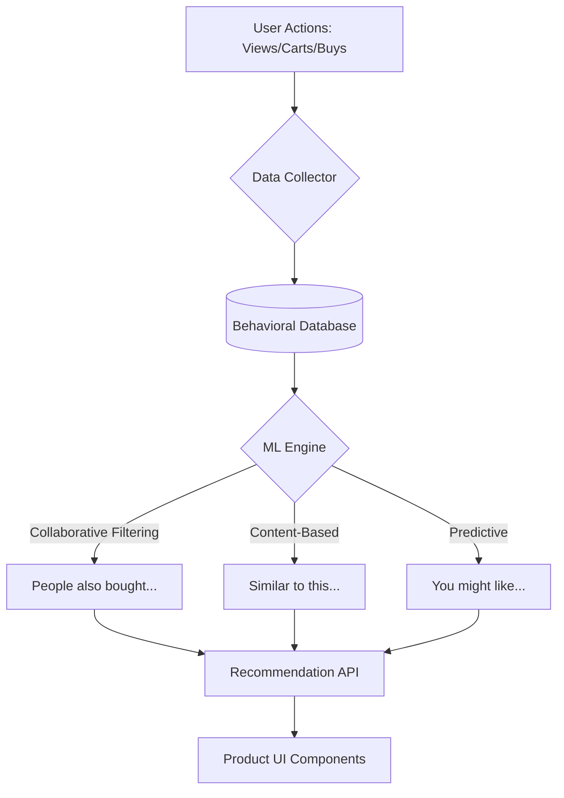

# TASK-00072: Thương mại Thông minh: Gợi ý Sản phẩm bằng AI/ML (Intelligent Commerce: AI-Powered Product Recommendations)

## 📋 Metadata

- **Task ID**: TASK-00072
- **Độ ưu tiên**: 🔵 TRUNG BÌNH (Business Intelligence)
- **Phụ thuộc**: TASK-00060 (Elasticsearch), TASK-00021 (Product CRUD)
- **Trạng thái**: ✅ Done

---

## 🎯 CHIẾN LƯỢC TĂNG TRƯỞNG THÔNG MINH (AI Expansion Strategy)

### 💡 Tại sao Gợi ý Sản phẩm (Recommendations) quan trọng?
Trong một cửa hàng có hàng ngàn sản phẩm, khách hàng rất dễ bị "ngợp" và không tìm thấy thứ họ thực sự muốn. Hệ thống gợi ý thông minh đóng vai trò như một "người tư vấn bán hàng" ảo, phân tích hành vi người dùng để đưa ra những sản phẩm phù hợp nhất. Điều này không chỉ cải thiện trải nghiệm mua sắm mà còn tăng mạnh giá trị đơn hàng trung bình (AOV) thông qua các kỹ thuật Up-selling và Cross-selling.
- **Improved Customer Retention**: Giữ chân khách hàng lâu hơn trên ứng dụng bằng những nội dung hấp dẫn và cá nhân hóa.
- **Optimized Discovery**: Giúp các sản phẩm mới hoặc các sản phẩm "ngách" dễ dàng tiếp cận đúng khách hàng mục tiêu.
- **Data-Driven Revenue**: Chuyển đổi từ việc bán hàng bị động sang chủ động gợi ý nhu cầu cho khách hàng.

---

## 🏗️ MÔ HÌNH TRÍ TUỆ NHÂN TẠO (Intelligence Model)

---

## 📄 QUY TẮC QUẢN TRỊ (Intelligence Rules)

### 1. Phân loại Chiến lược (Recommendation Tiers)
- **Sản phẩm Tương tự (Similar Items)**: Dựa trên thuộc tính (Màu sắc, Chất liệu, Thương hiệu).
- **Mua kèm thường xuyên (Frequently Bought Together)**: Dựa trên lịch sử giỏ hàng của hàng triệu người dùng khác.
- **Cá nhân hóa (Personalized for You)**: Dựa trên lịch sử xem và tìm kiếm gần đây của chính người dùng đó.

### 2. Quản trị Hiệu năng (Performance Guardrails)
- Tuyệt đối không tính toán các mô hình ML phức tạp (Matrix Factorization) trực tiếp mỗi khi người dùng tải trang. Toàn bộ kết quả gợi ý phải được tính toán bất đồng bộ (Offline/Batch Processing) và lưu vào Cache (Redis/Elasticsearch) để trả về kết quả trong < 100ms.

### 3. Đánh giá Hiệu quả (Effectiveness Tracking)
- Mọi khối gợi ý trên UI phải được gắn mã theo dõi (Tracking ID). Hệ thống sẽ đo lường tỷ lệ Click (CTR) và tỷ lệ Chuyển đổi (Conversion) từ các sản phẩm gợi ý để liên tục tinh chỉnh thuật toán.

---

## ✅ TIÊU CHUẨN THÀNH CÔNG (Definition of Success)

- [x] **Actionable Insights**: Tăng tỷ lệ thêm vào giỏ hàng từ trang chi tiết sản phẩm thêm ít nhất 15-20% nhờ mục "Sản phẩm tương tự".
- [x] **Sub-second Response**: API gợi ý phản hồi ngay lập tức, không gây trễ cho trải nghiệm lướt web của khách hàng.
- [x] **Dynamic Updating**: Danh sách gợi ý được cập nhật ít nhất 1 lần mỗi ngày để phản ánh đúng xu hướng mua sắm mới nhất.

---

## 🧪 TDD PLANNING (Intelligence Scenarios)

| Kịch bản | Mong đợi |
| :--- | :--- |
| **New User** | Người dùng mới hoàn toàn (chưa có dữ liệu) -> Hệ thống gợi ý các sản phẩm "Bán chạy nhất" (Trending) thay vì để trống. |
| **Similar Product** | Đang xem iPhone 15 -> Mục gợi ý hiện ra Ốp lưng, Kính cường lực hoặc các dòng điện thoại Samsung cùng tầm giá. |
| **Cross-sell Success** | User vừa thêm Giày chạy bộ vào giỏ -> Pop-up hiện gợi ý "Tất thể thao" hoặc "Bình nước" thường được mua kèm. |
