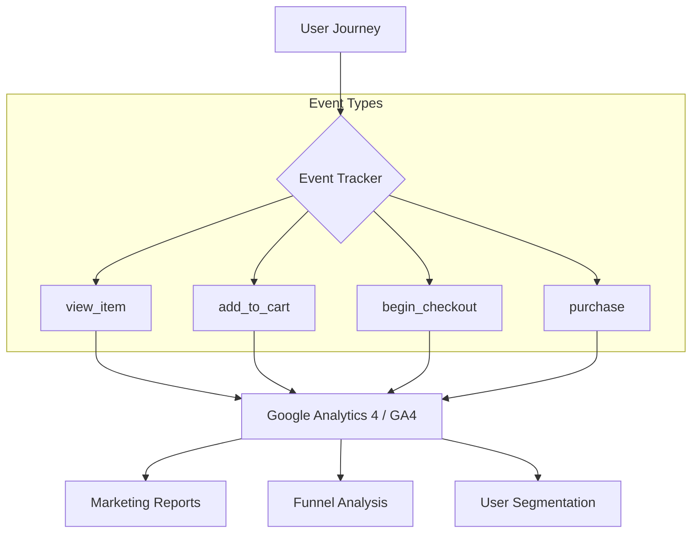

# TASK-00073: Tăng trưởng bằng Dữ liệu: Phân tích Hành vi & Google Analytics (Data-Driven Growth: Advanced Marketing Analytics)

## 📋 Metadata

- **Task ID**: TASK-00073
- **Độ ưu tiên**: 🔵 TRUNG BÌNH (Marketing Intelligence)
- **Phụ thuộc**: TASK-00061 (Admin Dashboard), TASK-00026 (Order Creation)
- **Trạng thái**: ✅ Done

---

## 🎯 CHIẾN LƯỢC PHÂN TÍCH TĂNG TRƯỞNG (Analytics Strategy)

### 💡 Tại sao Phân tích hành vi (Analytics) quan trọng?
Để phát triển bền vững, doanh nghiệp không thể chỉ dựa vào may mắn. Google Analytics và các công cụ phân tích cung cấp một cái nhìn sâu sắc về cách người dùng tương tác với hệ thống. Việc biết được khách hàng thường rời bỏ giỏ hàng ở bước nào, hoặc sản phẩm nào được quan tâm nhiều nhất nhưng ít người mua, giúp doanh nghiệp tối ưu hóa quy trình bán hàng và các chiến dịch marketing một cách chính xác.
- **Conversion Funnel Optimization**: Xác định các "điểm nghẽn" trong hành trình mua hàng để cải thiện tỷ lệ chuyển đổi.
- **Improved ROI**: Đo lường hiệu quả của từng chiến dịch quảng cáo để phân bổ ngân sách marketing hợp lý.
- **User Insight**: Hiểu rõ chân dung khách hàng (vị trí địa lý, thiết bị, sở thích) để cá nhân hóa nội dung.

---

## 🏗️ MÔ HÌNH PHÂN TÍCH DỮ LIỆU (Analytics Data Model)

---

## 📄 QUY TẮC QUẢN TRỊ (Analytics Rules)

### 1. Theo dõi Thương mại Điện tử Nâng cao (Enhanced E-commerce)
- Mọi sự kiện liên quan đến doanh thu phải được theo dõi chặt chẽ với các thuộc tính bắt buộc (Mã đơn hàng, Tổng tiền, Danh sách sản phẩm, Thuế, Phí vận chuyển). Điều này giúp Google Analytics tính toán được ROI (Tỷ suất lợi nhuận) một cách tự động.

### 2. Quyền Riêng tư & Tuân thủ (Privacy Compliance)
- Tuân thủ nghiêm ngặt các tiêu chuẩn bảo vệ dữ liệu (GDPR/APEC Privacy). Hệ thống phải hỗ trợ cơ chế **IP Anonymization** và chỉ bắt đầu theo dõi khi người dùng đã chấp nhận chính sách Cookie (Consent). Tuyệt đối không gửi các thông tin định danh cá nhân (PII) như Email hoặc Số điện thoại lên Google Analytics.

### 3. Đồng bộ Dữ liệu Offline (Server-side Tracking)
- Ngoài việc theo dõi trên trình duyệt (Frontend), các sự kiện quan trọng như "Hoàn tất thanh toán" nên được gửi từ phía Server (Server-to-Server) để đảm bảo dữ liệu luôn chính xác 100%, kể cả khi người dùng sử dụng các công cụ chặn quảng cáo (Ad-blockers).

---

## ✅ TIÊU CHUẨN THÀNH CÔNG (Definition of Success)

- [x] **Unbroken Funnel**: Có được báo cáo phễu chuyển đổi từ Trang chủ đến trang Cảm ơn mà không bị đứt đoạn dữ liệu.
- [x] **Marketing Insight**: Biết rõ nguồn khách hàng (Facebook, Google, Direct) mang lại doanh thu cao nhất.
- [x] **Data Integrity**: Sai lệch về số lượng đơn hàng giữa Google Analytics và Database nội bộ không quá 5%.

---

## 🧪 TDD PLANNING (Marketing Scenarios)

| Kịch bản | Mong đợi |
| :--- | :--- |
| **Abandonment Tracking** | User thêm hàng vào giỏ nhưng không thanh toán -> GA4 ghi nhận sự kiện `cart_abandonment` kèm giá trị giỏ hàng. |
| **Source Attribution** | User click link từ Facebook để mua hàng -> GA4 ghi nhận doanh thu đó thuộc về chiến dịch "Facebook Ads Spring". |
| **Refund Tracking** | Admin thực hiện hoàn tiền cho một đơn hàng -> Hệ thống tự động đẩy sự kiện `refund` lên GA để khấu trừ doanh thu trong báo cáo. |
