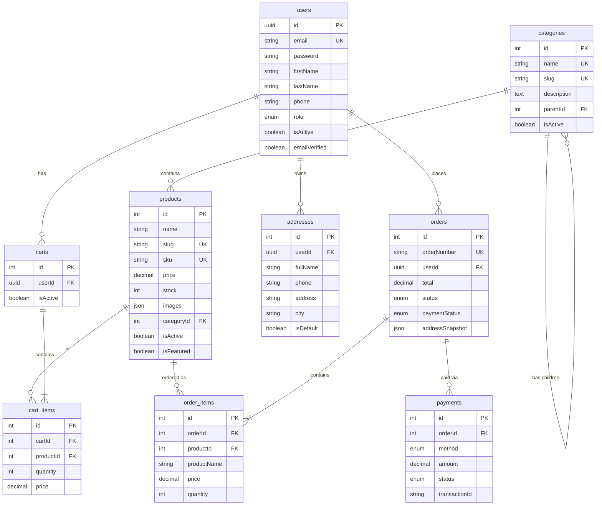

# Database Schema Visualization

## Entity Relationship Diagram



## Table Size Estimates (1 year projection)

| Table       | Est. Records | Growth Rate | Notes                      |
| ----------- | ------------ | ----------- | -------------------------- |
| users       | 10,000       | Slow        | B2C typical                |
| categories  | 200          | Very Slow   | Relatively stable          |
| products    | 5,000        | Medium      | New products added monthly |
| addresses   | 15,000       | Slow        | 1.5 addresses per user     |
| carts       | 10,000       | Slow        | 1 active cart per user     |
| cart_items  | 30,000       | Medium      | ~3 items per cart          |
| orders      | 50,000       | Fast        | ~5 orders per user/year    |
| order_items | 150,000      | Fast        | ~3 items per order         |
| payments    | 50,000       | Fast        | 1 payment per order        |

**Total estimated records after 1 year**: ~320,000 rows

## Index Strategy

### Primary Indexes (automatically created)

- All `id` columns (PK)
- All `UNIQUE` constraints

### Performance Indexes (manually added)

#### users table

```sql
CREATE INDEX idx_users_email ON users(email);
CREATE INDEX idx_users_isActive ON users(isActive);
```

#### categories table

```sql
CREATE INDEX idx_categories_slug ON categories(slug);
CREATE INDEX idx_categories_parentId ON categories(parentId);
CREATE INDEX idx_categories_isActive ON categories(isActive);
```

#### products table

```sql
CREATE INDEX idx_products_slug ON products(slug);
CREATE INDEX idx_products_sku ON products(sku);
CREATE INDEX idx_products_categoryId ON products(categoryId);
CREATE INDEX idx_products_price ON products(price);
CREATE INDEX idx_products_isActive ON products(isActive);
CREATE INDEX idx_products_isFeatured ON products(isFeatured);
-- Composite indexes
CREATE INDEX idx_products_category_active ON products(categoryId, isActive);
CREATE INDEX idx_products_featured_active ON products(isFeatured, isActive);
```

#### orders table

```sql
CREATE INDEX idx_orders_orderNumber ON orders(orderNumber);
CREATE INDEX idx_orders_userId ON orders(userId);
CREATE INDEX idx_orders_status ON orders(status);
CREATE INDEX idx_orders_paymentStatus ON orders(paymentStatus);
CREATE INDEX idx_orders_createdAt ON orders(createdAt);
```

#### carts table

```sql
CREATE UNIQUE INDEX idx_carts_userId_isActive ON carts(userId, isActive);
```

#### cart_items table

```sql
CREATE UNIQUE INDEX idx_cart_items_cart_product ON cart_items(cartId, productId);
```

#### payments table

```sql
CREATE INDEX idx_payments_orderId ON payments(orderId);
CREATE INDEX idx_payments_transactionId ON payments(transactionId);
CREATE INDEX idx_payments_status ON payments(status);
```

## Common Query Patterns

### 1. User Login

```sql
SELECT * FROM users
WHERE email = ? AND isActive = true;
-- Uses: idx_users_email
```

### 2. Get Active Products by Category

```sql
SELECT * FROM products
WHERE categoryId = ? AND isActive = true
ORDER BY isFeatured DESC, createdAt DESC;
-- Uses: idx_products_category_active
```

### 3. Get User's Active Cart

```sql
SELECT c.*, ci.* FROM carts c
LEFT JOIN cart_items ci ON c.id = ci.cartId
WHERE c.userId = ? AND c.isActive = true;
-- Uses: idx_carts_userId_isActive
```

### 4. Get Order with Items

```sql
SELECT o.*, oi.*, p.name FROM orders o
LEFT JOIN order_items oi ON o.id = oi.orderId
LEFT JOIN products p ON oi.productId = p.id
WHERE o.orderNumber = ?;
-- Uses: idx_orders_orderNumber
```

### 5. Get User's Orders

```sql
SELECT * FROM orders
WHERE userId = ?
ORDER BY createdAt DESC;
-- Uses: idx_orders_userId
```

## Data Flow Diagrams

### Shopping Cart Flow

```
User → Add to Cart
  ↓
Check if cart exists (userId + isActive)
  ↓
If not exists → Create cart
  ↓
Check if product in cart_items
  ↓
If exists → Update quantity
If not → Insert cart_item with price snapshot
  ↓
Return cart with items
```

### Order Creation Flow

```
User → Checkout
  ↓
Get active cart with items
  ↓
Validate stock availability
  ↓
Create order with address snapshot
  ↓
Create order_items with price snapshots
  ↓
Create payment record
  ↓
Deduct stock from products
  ↓
Clear cart (set isActive = false)
  ↓
Return order number
```

### Payment Confirmation Flow

```
Payment Provider → Webhook
  ↓
Verify signature/authenticity
  ↓
Update payment status
  ↓
Update order.paymentStatus
  ↓
If paid → Update order.status to 'confirmed'
  ↓
Send confirmation email
```

## Storage Estimates

### Per Record Size (approximate)

| Table       | Avg Size  | Notes                    |
| ----------- | --------- | ------------------------ |
| users       | 500 bytes | Includes indexes         |
| categories  | 300 bytes | Small, mostly text       |
| products    | 2 KB      | Large due to JSON fields |
| addresses   | 400 bytes | Text heavy               |
| carts       | 100 bytes | Minimal fields           |
| cart_items  | 200 bytes | Price + FK               |
| orders      | 800 bytes | JSON snapshot included   |
| order_items | 300 bytes | Snapshots                |
| payments    | 600 bytes | JSON response            |

### 1 Year Projection

- Total records: ~320,000
- Average size: ~800 bytes
- **Estimated DB size**: ~250 MB (data only)
- With indexes: ~500 MB
- With WAL/logs: ~1 GB total

## Optimization Tips

### 1. Pagination

Always use LIMIT/OFFSET for large datasets:

```sql
SELECT * FROM products
WHERE isActive = true
ORDER BY id DESC
LIMIT 20 OFFSET 0;
```

### 2. Eager Loading

Use TypeORM relations wisely:

```typescript
// Good - only load what you need
findOne({ where: { id }, relations: ['category'] });

// Bad - loads everything
findOne({ where: { id }, relations: ['category', 'cartItems', 'orderItems'] });
```

### 3. Selective Fields

Don't SELECT \*:

```typescript
createQueryBuilder('product')
  .select(['product.id', 'product.name', 'product.price'])
  .where('product.isActive = :active', { active: true });
```

### 4. Use Indexes

Always filter on indexed columns:

```sql
-- Good (uses index)
WHERE slug = 'iphone-15-pro'

-- Bad (full table scan)
WHERE LOWER(name) LIKE '%iphone%'
```

## Backup Strategy

### Development

```bash
# Daily backup
docker exec -t ecommerce-api-postgres-1 \
  pg_dump -U postgres ecommerce_db > backup_$(date +%Y%m%d).sql
```

### Production

1. **Automated Daily Backups**: Use pg_dump with cron
2. **Point-in-Time Recovery**: Enable WAL archiving
3. **Replication**: Setup streaming replication
4. **Cloud Backups**: Upload to S3/GCS

## Monitoring Queries

### Slow Queries

```sql
-- Find slow queries (PostgreSQL)
SELECT query, mean_exec_time, calls
FROM pg_stat_statements
ORDER BY mean_exec_time DESC
LIMIT 10;
```

### Table Sizes

```sql
SELECT
  tablename,
  pg_size_pretty(pg_total_relation_size(schemaname||'.'||tablename)) AS size
FROM pg_tables
WHERE schemaname = 'public'
ORDER BY pg_total_relation_size(schemaname||'.'||tablename) DESC;
```

### Index Usage

```sql
SELECT
  schemaname, tablename, indexname,
  idx_scan, idx_tup_read, idx_tup_fetch
FROM pg_stat_user_indexes
ORDER BY idx_scan DESC;
```

## See Also

- [DATABASE_SETUP.md](DATABASE_SETUP.md) - Setup instructions
- [IMPLEMENTATION_SUMMARY.md](IMPLEMENTATION_SUMMARY.md) - What was built
- [TASK-00005](../ecommerce-api-doc/tasks/TASK-00005-Thiết-kế-Database-Schema.md) - Detailed design document
