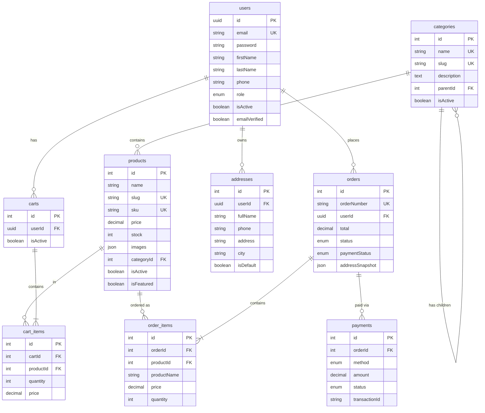

# Database Conceptual Diagram & Projections

> [!NOTE]
> This document visualizes the relational architecture of the E-commerce API database and projects the scaling requirements over a 1-year operational horizon.

---

## Executive Summary
A robust E-commerce platform requires a highly normalized, relational foundation capable of handling complex associations between customers, products, and financial transactions. This architecture utilizes 9 core entities mapped via TypeORM, structured to prioritize ACID compliance during order creation while maintaining high read throughput for the product catalog.

---

## Entity Relationship Diagram

The following Mermaid diagram outlines the foundational relationships, Cardinalities, and Foreign Key (FK) constraints.


```mermaid
erDiagram
    users ||--o{ carts : has
    users ||--o{ orders : places
    users ||--o{ addresses : owns

    categories ||--o{ categories : "has children"
    categories ||--o{ products : contains

    products ||--o{ cart_items : "in"
    products ||--o{ order_items : "ordered as"

    carts ||--|{ cart_items : contains

    orders ||--|{ order_items : contains
    orders ||--o{ payments : "paid via"

    users {
        uuid id PK
        string email UK
        string password
        string firstName
        string lastName
        string phone
        enum role
        boolean isActive
        boolean emailVerified
    }

    categories {
        int id PK
        string name UK
        string slug UK
        text description
        int parentId FK
        boolean isActive
    }

    products {
        int id PK
        string name
        string slug UK
        string sku UK
        decimal price
        int stock
        json images
        int categoryId FK
        boolean isActive
        boolean isFeatured
    }

    addresses {
        int id PK
        uuid userId FK
        string fullName
        string phone
        string address
        string city
        boolean isDefault
    }

    carts {
        int id PK
        uuid userId FK
        boolean isActive
    }

    cart_items {
        int id PK
        int cartId FK
        int productId FK
        int quantity
        decimal price
    }

    orders {
        int id PK
        string orderNumber UK
        uuid userId FK
        decimal total
        enum status
        enum paymentStatus
        json addressSnapshot
    }

    order_items {
        int id PK
        int orderId FK
        int productId FK
        string productName
        decimal price
        int quantity
    }

    payments {
        int id PK
        int orderId FK
        enum method
        decimal amount
        enum status
        string transactionId
    }
```

---

## Design Decisions

- **Audit & Historical Integrity**: Price points and shipping addresses must never mutate retroactively. `cart_items` and `order_items` capture localized snapshots of the product prices. The `orders` table captures a static `addressSnapshot` JSON payload at the moment of checkout.
- **Hierarchical Categories**: The `categories` table uses Adjacency List modeling (a `parentId` pointing to itself) to construct infinite-depth category trees (e.g., Electronics > Phones > Smartphones).

---

## Capacity Projections (1-Year Horizon)

> [!TIP]
> Storage overhead is calculated assuming an average payload size coupled with B-Tree index bloating.

| Entity | Growth Velocity | 1-Year Est. Rows | Storage Profile |
|--------|-----------------|------------------|-----------------|
| `users` | Slow | 10,000 | ~5MB (Includes heavy UUID indexes) |
| `categories` | Static | 200 | < 1MB |
| `products` | Medium | 5,000 | ~10MB (Heavy due to JSON payload arrays) |
| `carts` | Slow | 10,000 | ~1MB (1 active cart per user limit) |
| `cart_items`| Medium | 30,000 | ~6MB (High churn/update rate) |
| `orders` | Fast | 50,000 | ~40MB (Contains JSON address snapshots) |
| `order_items`| Very Fast | 150,000 | ~45MB (~3 items per order avg.) |
| `payments` | Fast | 50,000 | ~30MB (Records remote PSP JSON responses) |

**Total Estimated Database Size (Data):** ~250 MB  
**Total Estimated Database Size (Including Indices & WAL):** ~1.0 GB  

---

## Security & Performance Notes

### High-Value Indices
PostgreSQL automatically creates indices on Primary Keys and Unique Constraints. To guarantee read performance, specific composite indices must be manually defined.

> [!WARNING]
> Do not over-index the `cart_items` table, as it experiences exceptionally high write/update churn. Only index foreign keys.

```sql
-- Catalog Search Acceleration
CREATE INDEX idx_products_category_active ON products(categoryId, isActive);
CREATE INDEX idx_products_featured_active ON products(isFeatured, isActive);

-- User Retrieval
CREATE INDEX idx_users_email_active ON users(email, isActive);

-- Active Cart Resolution
CREATE UNIQUE INDEX idx_carts_userId_active ON carts(userId, isActive);
```

### Query Optimization Strategies
1. **Deny `SELECT *`**: Always restrict payloads. Use TypeORM's `.select(['product.id', 'product.name', 'product.price'])`. Pulling massive JSON columns (`images`) during list queries will cripple RAM.
2. **Eager vs. Lazy Loading**: Never eager load `orderItems` on the root `Product` entity. Always paginate historical relationship queries defensively.
3. **Pagination Engine**: Utilize Keyset Pagination (Cursor-based) over traditional `LIMIT/OFFSET` for the `orders` list, as high offsets require the database engine to perform expensive table scans.
