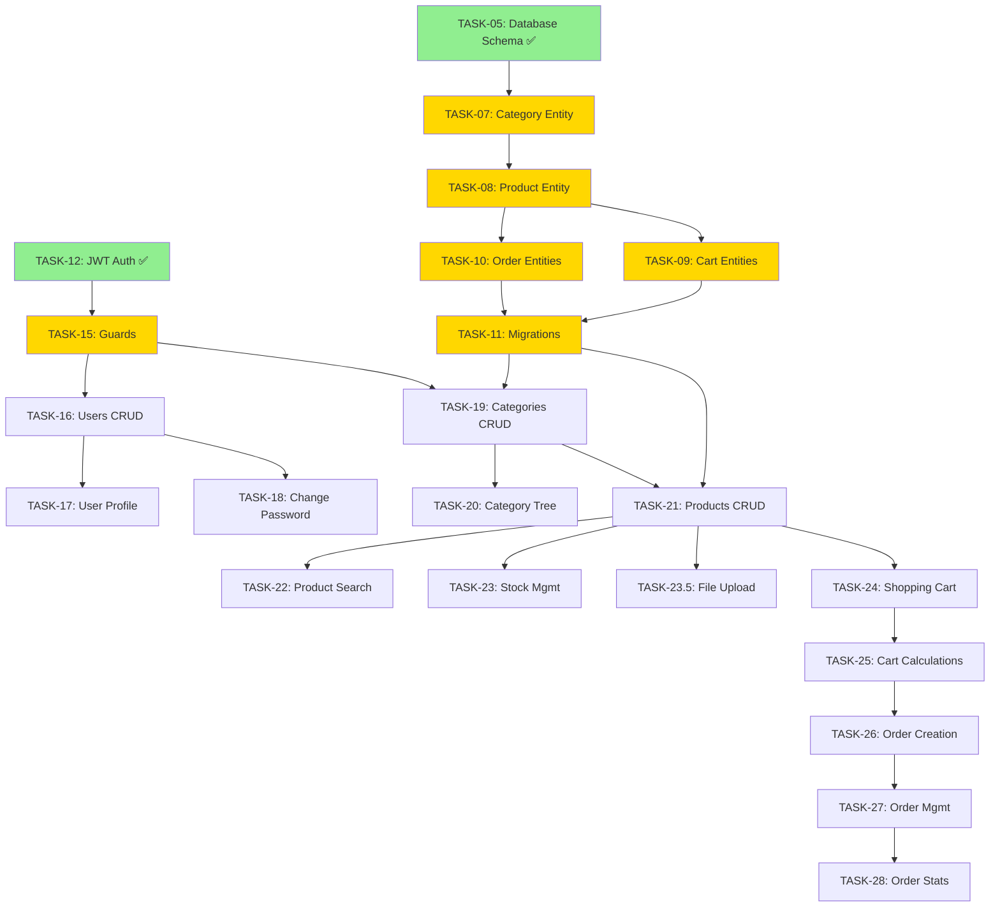

# 📋 TASKS REVIEW & ROADMAP - E-COMMERCE API

> **Ngày review:** 2026-01-11  
> **Tổng số tasks:** 76 tasks  
> **Status hiện tại:** Phase 1-3 đã hoàn thành một phần

---

## 📊 TỔNG QUAN HIỆN TRẠNG

### ✅ Đã Hoàn Thành (Estimated: ~10-12 tasks)

Dựa trên phân tích codebase hiện tại, các phần sau đã được implement:

#### **Phase 1: Project Setup (Tasks 1-4)** ✅

- ✅ **TASK-00001**: Khởi tạo Project NestJS
- ✅ **TASK-00002**: Setup Environment & Configuration
- ✅ **TASK-00003**: Setup Database PostgreSQL
- ✅ **TASK-00004**: Kết nối NestJS với PostgreSQL
- ✅ **TASK-00004.1**: Setup Global Validation & Error Handling

> **Evidence:**
>
> - `package.json` có đầy đủ dependencies (NestJS, TypeORM, PostgreSQL)
> - Có `.env`, `.env.example`, `.env.test`
> - Có `docker-compose.yml` cho PostgreSQL
> - Có `DATABASE_SETUP.md` và `DATABASE_DIAGRAM.md`

#### **Phase 2: Database Design (Tasks 5-11)** ✅ Partial

- ✅ **TASK-00005**: Thiết kế Database Schema
- ✅ **TASK-00006**: Tạo User Entity
- ⬜ **TASK-00007**: Tạo Category Entity
- ⬜ **TASK-00008**: Tạo Product Entity
- ⬜ **TASK-00009**: Tạo Cart & CartItem Entities
- ⬜ **TASK-00010**: Tạo Order & OrderItem Entities
- ⬜ **TASK-00011**: Generate & Run Migrations
- ⬜ **TASK-00011.1**: Migration Best Practices & Strategy

> **Evidence:**
>
> - Thư mục `src/entities` tồn tại với 10 entity files
> - Thư mục `src/migrations` tồn tại
> - Có `DATABASE_DIAGRAM.md` chi tiết

#### **Phase 3: Authentication (Tasks 12-15)** ✅ Partial

- ✅ **TASK-00012**: Setup JWT Authentication
- ✅ **TASK-00013**: Tạo Auth DTOs
- ✅ **TASK-00014**: Implement Register & Login
- ⬜ **TASK-00015**: Tạo Guards & Decorators

> **Evidence:**
>
> - Thư mục `src/modules/auth` tồn tại
> - Thư mục `src/modules/users` tồn tại
> - Dependencies: `@nestjs/jwt`, `@nestjs/passport`, `passport-jwt`, `bcryptjs`

### ⬜ Chưa Hoàn Thành (Estimated: ~64 tasks)

#### **Phase 4: Users Module (Tasks 16-18)** ⬜

- ⬜ TASK-00016: Implement Users CRUD
- ⬜ TASK-00017: Implement User Profile
- ⬜ TASK-00018: Implement Change Password

#### **Phase 5: Categories Module (Tasks 19-20)** ⬜

- ⬜ TASK-00019: Implement Categories CRUD
- ⬜ TASK-00020: Category Tree & Filtering

#### **Phase 6: Products Module (Tasks 21-23.5)** ⬜

- ⬜ TASK-00021: Implement Products CRUD
- ⬜ TASK-00022: Product Filtering & Search
- ⬜ TASK-00023: Product Stock Management
- ⬜ TASK-00023.5: Product Images & File Upload

#### **Phase 7-8: Shopping Cart & Orders (Tasks 24-28)** ⬜

- ⬜ TASK-00024: Implement Shopping Cart
- ⬜ TASK-00025: Cart Calculations
- ⬜ TASK-00026: Implement Order Creation
- ⬜ TASK-00027: Order Management
- ⬜ TASK-00028: Order Statistics

#### **Phase 9-10: Common Features (Tasks 29-35)** ⬜

- ⬜ TASK-00029: Global Error Handling
- ⬜ TASK-00030: Request Logging Interceptor
- ⬜ TASK-00031: Response Transform Interceptor
- ⬜ TASK-00032: Complete Swagger Documentation
- ⬜ TASK-00033: Write Unit Tests
- ⬜ TASK-00034: Write E2E Tests
- ⬜ TASK-00035: Create README Documentation

#### **Phase 11-18: Advanced Features (Tasks 36-65)** ⬜

_Tất cả 30 tasks từ 36-65 chưa bắt đầu_

#### **Phase 19: Optional Features (Tasks 66-73)** 💡

_Tất cả 8 optional tasks chưa bắt đầu_

---

## 🎯 THỨ TỰ ƯU TIÊN ĐỀ XUẤT

### 🔴 **CRITICAL - Cần làm NGAY (Priority 1)**

Hoàn thiện foundation trước khi tiếp tục:

1. **TASK-00007**: Tạo Category Entity ⭐

   - **Lý do:** Cần cho Product entity (foreign key)
   - **Dependencies:** TASK-00005 ✅
   - **Estimated:** 2-3 giờ

2. **TASK-00008**: Tạo Product Entity ⭐

   - **Lý do:** Core entity của e-commerce
   - **Dependencies:** TASK-00007
   - **Estimated:** 3-4 giờ

3. **TASK-00009**: Tạo Cart & CartItem Entities ⭐

   - **Lý do:** Cần cho shopping flow
   - **Dependencies:** TASK-00008
   - **Estimated:** 3-4 giờ

4. **TASK-00010**: Tạo Order & OrderItem Entities ⭐

   - **Lý do:** Cần cho checkout flow
   - **Dependencies:** TASK-00008, TASK-00009
   - **Estimated:** 4-5 giờ

5. **TASK-00011**: Generate & Run Migrations ⭐

   - **Lý do:** Deploy database schema
   - **Dependencies:** All entities (TASK-00006 to 00010)
   - **Estimated:** 2-3 giờ

6. **TASK-00015**: Tạo Guards & Decorators ⭐
   - **Lý do:** Cần cho authorization ở các modules
   - **Dependencies:** TASK-00012, 00014 ✅
   - **Estimated:** 3-4 giờ

---

### 🟡 **HIGH - Cần làm trong tuần này (Priority 2)**

Implement core business features:

7. **TASK-00016**: Implement Users CRUD

   - **Dependencies:** TASK-00015
   - **Estimated:** 4-5 giờ

8. **TASK-00017**: Implement User Profile

   - **Dependencies:** TASK-00016
   - **Estimated:** 2-3 giờ

9. **TASK-00018**: Implement Change Password

   - **Dependencies:** TASK-00016
   - **Estimated:** 2-3 giờ

10. **TASK-00019**: Implement Categories CRUD

    - **Dependencies:** TASK-00007, TASK-00011, TASK-00015
    - **Estimated:** 4-5 giờ

11. **TASK-00020**: Category Tree & Filtering

    - **Dependencies:** TASK-00019
    - **Estimated:** 5-6 giờ (complex recursive queries)

12. **TASK-00021**: Implement Products CRUD

    - **Dependencies:** TASK-00008, TASK-00019
    - **Estimated:** 5-6 giờ

13. **TASK-00022**: Product Filtering & Search

    - **Dependencies:** TASK-00021
    - **Estimated:** 4-5 giờ

14. **TASK-00023**: Product Stock Management
    - **Dependencies:** TASK-00021
    - **Estimated:** 3-4 giờ

---

### 🟢 **MEDIUM - Tuần sau (Priority 3)**

Shopping flow implementation:

15. **TASK-00024**: Implement Shopping Cart

    - **Dependencies:** TASK-00021, TASK-00009
    - **Estimated:** 5-6 giờ

16. **TASK-00025**: Cart Calculations

    - **Dependencies:** TASK-00024
    - **Estimated:** 3-4 giờ

17. **TASK-00026**: Implement Order Creation

    - **Dependencies:** TASK-00024, TASK-00025
    - **Estimated:** 6-8 giờ (complex transaction)

18. **TASK-00027**: Order Management

    - **Dependencies:** TASK-00026
    - **Estimated:** 5-6 giờ

19. **TASK-00028**: Order Statistics
    - **Dependencies:** TASK-00027
    - **Estimated:** 4-5 giờ

---

### 🔵 **LOW - 2 tuần tới (Priority 4)**

Infrastructure & Quality:

20. **TASK-00029**: Global Error Handling

    - **Dependencies:** None
    - **Estimated:** 3-4 giờ

21. **TASK-00030**: Request Logging Interceptor

    - **Dependencies:** None
    - **Estimated:** 2-3 giờ

22. **TASK-00031**: Response Transform Interceptor

    - **Dependencies:** None
    - **Estimated:** 2-3 giờ

23. **TASK-00032**: Complete Swagger Documentation

    - **Dependencies:** All modules (16-28)
    - **Estimated:** 4-6 giờ

24. **TASK-00033**: Write Unit Tests

    - **Dependencies:** All modules
    - **Estimated:** 12-16 giờ

25. **TASK-00034**: Write E2E Tests
    - **Dependencies:** All modules
    - **Estimated:** 8-12 giờ

---

## 📈 ROADMAP CHI TIẾT THEO TUẦN

### **Tuần 1 (Hiện tại):** Hoàn thiện Database Foundation

```
[████████████████████░░░░] 80% Phase 1-2

Tasks:
✅ TASK-00007: Category Entity          (1 ngày)
✅ TASK-00008: Product Entity           (1 ngày)
✅ TASK-00009: Cart Entities            (1 ngày)
✅ TASK-00010: Order Entities           (1 ngày)
✅ TASK-00011: Migrations               (0.5 ngày)
✅ TASK-00015: Guards & Decorators      (1 ngày)

Deliverable: Database schema hoàn chỉnh + Auth guards
```

### **Tuần 2:** Core Modules - Users + Categories

```
Tasks:
- TASK-00016: Users CRUD                (1 ngày)
- TASK-00017: User Profile              (0.5 ngày)
- TASK-00018: Change Password           (0.5 ngày)
- TASK-00019: Categories CRUD           (1 ngày)
- TASK-00020: Category Tree             (1.5 ngày)

Deliverable: User management + Category management APIs
```

### **Tuần 3:** Products Module

```
Tasks:
- TASK-00021: Products CRUD             (1.5 ngày)
- TASK-00022: Product Filtering         (1 ngày)
- TASK-00023: Stock Management          (1 ngày)
- TASK-00023.5: File Upload             (1.5 ngày)

Deliverable: Complete product management with images
```

### **Tuần 4:** Shopping Cart & Orders

```
Tasks:
- TASK-00024: Shopping Cart             (1.5 ngày)
- TASK-00025: Cart Calculations         (1 ngày)
- TASK-00026: Order Creation            (2 ngày)
- TASK-00027: Order Management          (1.5 ngày)

Deliverable: Complete shopping flow từ cart đến checkout
```

### **Tuần 5:** Infrastructure & Documentation

```
Tasks:
- TASK-00028: Order Statistics          (1 ngày)
- TASK-00029-31: Error, Logging, Transform (2 ngày)
- TASK-00032: Swagger Documentation    (1.5 ngày)
- TASK-00035: README Documentation     (0.5 ngày)

Deliverable: Production-ready infrastructure + docs
```

### **Tuần 6-7:** Testing & Quality

```
Tasks:
- TASK-00033: Unit Tests               (3 ngày)
- TASK-00034: E2E Tests                (2 ngày)
- Bug fixes & refactoring              (2 ngày)

Deliverable: MVP với test coverage > 70%
```

---

## 🚨 DEPENDENCIES CRITICAL PATH

Các tasks có dependency chain quan trọng (không thể parallel):



---

## ⚠️ NHỮNG LƯU Ý QUAN TRỌNG

### 🔒 **Blocking Issues**

1. **Entity Dependencies**

   - Không thể tạo Product entity trước Category entity
   - Không thể tạo Cart/Order entities trước Product entity
   - Phải generate migrations SAU KHI tất cả entities ready

2. **Auth Dependencies**

   - Cần Guards & Decorators (TASK-15) trước khi implement bất kỳ protected endpoint nào
   - Tất cả CRUD operations sẽ cần authentication/authorization

3. **Business Logic Dependencies**
   - Order creation phụ thuộc vào Cart calculations
   - Product search phụ thuộc vào Products CRUD

### 💡 **Best Practices**

1. **Test-Driven Development**

   - Viết tests đồng thời với implementation, KHÔNG để cuối cùng
   - Mỗi feature phải có ít nhất:
     - Unit tests cho service
     - Integration tests cho controller
     - E2E tests cho critical flows

2. **Migration Strategy**

   - KHÔNG edit migrations đã chạy
   - Luôn backup database trước khi chạy migration
   - Test migrations trên local/test environment trước

3. **Code Organization**
   - Follow NestJS module structure
   - Tách DTO/Entity/Service/Controller rõ ràng
   - Reuse common code thông qua base classes

---

## 🎯 ACTION ITEMS - TUẦN NÀY

### **Ngày 1-2 (T2-T3):** Database Entities

- [ ] Review và hoàn thiện TASK-00007 (Category Entity)
- [ ] Review và hoàn thiện TASK-00008 (Product Entity)
- [ ] Test relationships giữa entities

### **Ngày 3 (T4):** Cart & Order Entities

- [ ] Implement TASK-00009 (Cart & CartItem)
- [ ] Implement TASK-00010 (Order & OrderItem)
- [ ] Document complex relationships

### **Ngày 4 (T5):** Migrations & Guards

- [ ] Generate migrations (TASK-00011)
- [ ] Test migration up/down
- [ ] Implement TASK-00015 (Guards & Decorators)

### **Ngày 5-6 (T6-T7):** Testing & Review

- [ ] Manual testing all entities
- [ ] Write unit tests cho entities
- [ ] Code review
- [ ] Update documentation

---

## 📝 TEMPLATE CẬP NHẬT STATUS

Khi hoàn thành một task, update status trong task file:

```markdown
> **Status:** ✅ Done
> **Completed:** 2026-01-11
> **Time Spent:** 4h 30m
> **Notes:** Implemented with full test coverage
```

### Script Tracking Progress

```powershell
# check-progress.ps1
$totalTasks = 76
$doneTasks = (Get-ChildItem tasks\*.md | Select-String "> \*\*Status:\*\* ✅ Done").Count
$percentage = [math]::Round(($doneTasks / $totalTasks) * 100, 1)

Write-Host "========================================" -ForegroundColor Cyan
Write-Host "E-COMMERCE API - PROGRESS REPORT" -ForegroundColor Cyan
Write-Host "========================================" -ForegroundColor Cyan
Write-Host "Completed: $doneTasks / $totalTasks tasks" -ForegroundColor Green
Write-Host "Progress:  $percentage%" -ForegroundColor Yellow
Write-Host "========================================" -ForegroundColor Cyan
```

---

## 🎓 KẾT LUẬN

### Hiện Trạng

- ✅ **Hoàn thành:** ~10-12 tasks (Phase 1 + một phần Phase 2-3)
- ⬜ **Còn lại:** ~64-66 tasks
- 📊 **Progress:** ~15-16%

### Next Steps

1. **Immediate (Tuần này):** Complete database entities + migrations (TASK 7-11, 15)
2. **Short-term (2-3 tuần):** Core modules (Users, Categories, Products)
3. **Mid-term (4-5 tuần):** Shopping flow (Cart, Orders)
4. **Long-term (6-8 tuần):** Advanced features + Production ready

### Estimated Timeline cho MVP

- **Target:** 6-8 tuần (Tasks 1-35)
- **Current:** Tuần 2
- **Remaining:** 4-6 tuần

### Resources Needed

- 1 Senior Backend Developer (full-time)
- PostgreSQL dev environment
- Testing tools & accounts

---

**🚀 Good luck với implementation! Hãy follow roadmap này và track progress thường xuyên.**

_Last updated: 2026-01-11_
