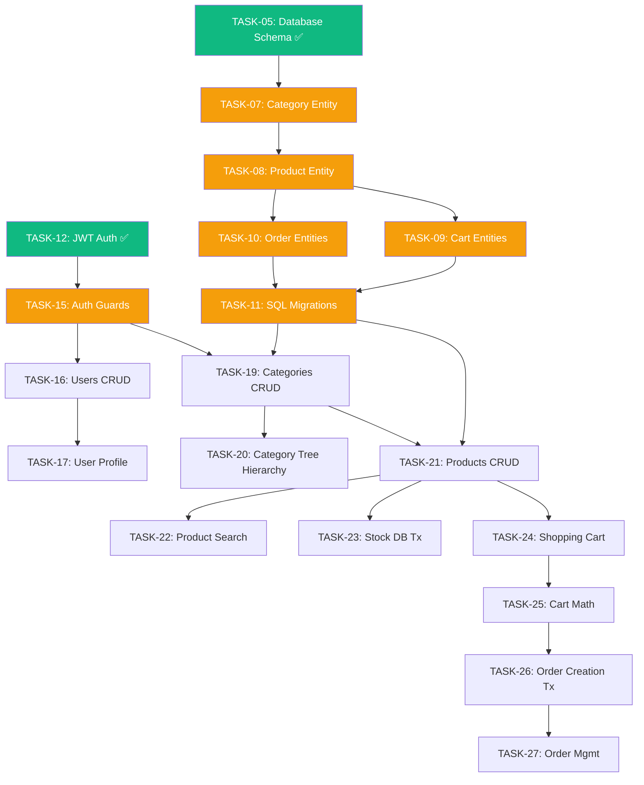

# Project Roadmap & Code Implementation Review

> [!NOTE]
> This document tracks the **actual codebase implementation status**, charting dependencies, critical paths, and technical debt. While all 76 *documentation plans* are complete, the *coding phase* is currently ~15% complete.

---

## Executive Summary
The foundational layers of the E-commerce API (NestJS scaffolding, PostgreSQL connection, TypeORM configuration, and basic JWT Auth) are successfully deployed into the codebase. The project is currently blocked at the structural entity layer (Phase 2), preventing higher-order business logic (Routing, Carts, Checkout) from proceeding.

---

## Codebase Status Report

### ✅ Completed Implementation (Tasks 01-14)
The following infrastructure is actively running in the repository:
- Project scaffolding (`package.json`, generic NestJS modules).
- Dockerized PostgreSQL infrastructure (`docker-compose.yml`).
- Early Database definitions (`User` Entity).
- Base JWT Authentication mechanism (Login/Register pipelines).

### 🚧 Critical Path Blockers (High Priority)
The following modules must be coded immediately. **Do not attempt to build UI or controllers until the TypeORM models are thoroughly defined and migrated.**

1. **Module: Categories (`TASK-00007`)**
   - *Dependency*: Required by Products.
2. **Module: Products (`TASK-00008`)**
   - *Dependency*: Required by Carts and Orders.
3. **Module: Carts & Orders (`TASK-00009`, `TASK-00010`)**
   - *Dependency*: Finalizes the core relational schema.
4. **Module: Migrations (`TASK-00011`)**
   - *Action*: Generating the SQL schema from the entities above.
5. **Infrastructure: Guards (`TASK-00015`)**
   - *Action*: Securing endpoints using the previously built JWT framework.

---

## Dependency Graph (Critical Path)

The Mermaid diagram below visualizes the strict linear dependencies of the implementation phase. A node cannot be coded until its parents are completed and merged.

```mermaid
graph TD
    T5[TASK-05: Database Schema ✅] --> T7[TASK-07: Category Entity]
    T7 --> T8[TASK-08: Product Entity]
    T8 --> T9[TASK-09: Cart Entities]
    T8 --> T10[TASK-10: Order Entities]

    T9 --> T11[TASK-11: SQL Migrations]
    T10 --> T11

    T12[TASK-12: JWT Auth ✅] --> T15[TASK-15: Auth Guards]
    T15 --> T16[TASK-16: Users CRUD]
    T16 --> T17[TASK-17: User Profile]

    T11 --> T19[TASK-19: Categories CRUD]
    T15 --> T19
    T19 --> T20[TASK-20: Category Tree Hierarchy]

    T11 --> T21[TASK-21: Products CRUD]
    T19 --> T21
    T21 --> T22[TASK-22: Product Search]
    T21 --> T23[TASK-23: Stock DB Tx]

    T21 --> T24[TASK-24: Shopping Cart]
    T24 --> T25[TASK-25: Cart Math]
    T25 --> T26[TASK-26: Order Creation Tx]
    T26 --> T27[TASK-27: Order Mgmt]

    style T5 fill:#10b981,color:#fff
    style T12 fill:#10b981,color:#fff
    style T7 fill:#f59e0b,color:#fff
    style T8 fill:#f59e0b,color:#fff
    style T9 fill:#f59e0b,color:#fff
    style T10 fill:#f59e0b,color:#fff
    style T11 fill:#f59e0b,color:#fff
    style T15 fill:#f59e0b,color:#fff
```

---

## Development Constraints & Best Practices

> [!WARNING]
> Deviating from these practices will introduce insurmountable technical debt in Phase 5.

### TypeORM Migration Strategy
- **Immutability**: NEVER edit a migration file that has already been executed (`migration:run`). If a mistake was made, run `migration:revert` or generate a new migration to adjust the schema.
- **Data vs. Schema**: Do not mix structural `ALTER TABLE` operations with complex `INSERT`/`UPDATE` data migrations in the same file.

### Test-Driven Development (TDD)
- **Simultaneous Testing**: Write unit tests alongside the service implementation. Do not save testing for "Phase 6".
- **Coverage**: Every critical financial calculation (e.g., Cart Math, Order Totals) demands 100% branch test coverage.

### Operational Routine
When beginning a work session:
1. Pull the latest code.
2. Spin up Docker: `docker-compose up -d`.
3. Check progress: `.\check-progress.ps1`.
4. Select the next unblocked task from the Dependency Graph.
