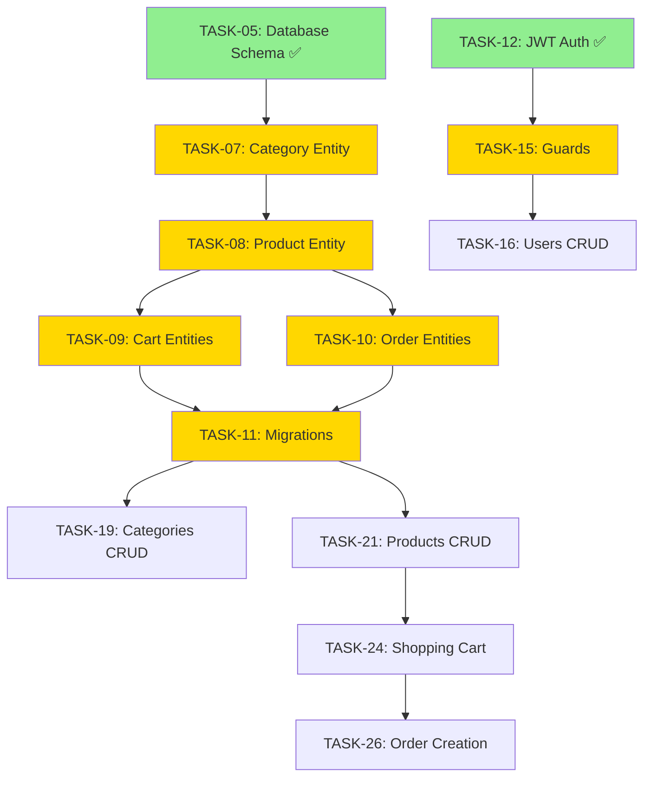

# 📊 PROJECT STATUS & ROADMAP

> **Last updated:** 2026-01-11  
> **Total tasks:** 76 tasks  
> **Progress:** 15% (12/76)

---

## ✅ Hiện Trạng Project

```
Phase 1: Project Setup               [████████████████████] 100% (5/5)
Phase 2: Database Design             [████████░░░░░░░░░░░░]  40% (1/7)
Phase 3: Authentication              [████████████░░░░░░░░]  60% (3/4)
─────────────────────────────────────────────────────────────
TỔNG CỘNG:                           [███░░░░░░░░░░░░░░░░░]  15% (12/76)
```

### Đã Hoàn Thành (12/76 tasks)

#### **Phase 1: Project Setup** ✅
- ✅ TASK-00001: Khởi tạo Project NestJS
- ✅ TASK-00002: Setup Environment & Configuration
- ✅ TASK-00003: Setup Database PostgreSQL
- ✅ TASK-00004: Kết nối NestJS với PostgreSQL
- ✅ TASK-00004.1: Setup Global Validation & Error Handling

#### **Phase 2: Database Design** ✅ Partial (1/7)
- ✅ TASK-00005: Thiết kế Database Schema
- ✅ TASK-00006: Tạo User Entity
- ⬜ TASK-00007: Tạo Category Entity
- ⬜ TASK-00008: Tạo Product Entity
- ⬜ TASK-00009: Tạo Cart & CartItem Entities
- ⬜ TASK-00010: Tạo Order & OrderItem Entities
- ⬜ TASK-00011: Generate & Run Migrations

#### **Phase 3: Authentication** ✅ Partial (3/4)
- ✅ TASK-00012: Setup JWT Authentication
- ✅ TASK-00013: Tạo Auth DTOs
- ✅ TASK-00014: Implement Register & Login
- ⬜ TASK-00015: Tạo Guards & Decorators

### ⬜ Chưa Hoàn Thành (64/76 tasks)

- **Phase 4:** Users Module (Tasks 16-18)
- **Phase 5:** Categories Module (Tasks 19-20)
- **Phase 6:** Products Module (Tasks 21-23.5)
- **Phase 7-8:** Shopping Cart & Orders (Tasks 24-28)
- **Phase 9-10:** Common Features (Tasks 29-35)
- **Phase 11-18:** Advanced Features (Tasks 36-65)
- **Phase 19:** Optional Features (Tasks 66-73)

---

## 🎯 Ưu Tiên Tuần Này (6 tasks - ~23 giờ)

| #   | Task                            | Priority    | Time | Dependencies |
| --- | ------------------------------- | ----------- | ---- | ------------ |
| 1   | ⭐ TASK-07: Category Entity     | 🔴 Critical | 3h   | TASK-05 ✅    |
| 2   | ⭐ TASK-08: Product Entity       | 🔴 Critical | 4h   | TASK-07       |
| 3   | ⭐ TASK-09: Cart Entities        | 🔴 Critical | 4h   | TASK-08       |
| 4   | ⭐ TASK-10: Order Entities      | 🔴 Critical | 5h   | TASK-08, 09   |
| 5   | ⭐ TASK-11: Migrations           | 🔴 Critical | 3h   | All entities  |
| 6   | ⭐ TASK-15: Guards & Decorators | 🔴 Critical | 4h   | TASK-12, 14 ✅ |

### 🟡 **HIGH - Tuần này**
- TASK-00016 đến TASK-00023: Users CRUD, Categories CRUD, Products CRUD, Stock Management

### 🟢 **MEDIUM - Tuần sau**
- TASK-00024 đến TASK-00028: Shopping Cart, Orders

### 🔵 **LOW - 2 tuần tới**
- TASK-00029 đến TASK-00034: Infrastructure, Testing

---

## 📈 Roadmap 6 Tuần Tới

### **Tuần 1 (Hiện tại):** Database Foundation
- TASK-00007: Category Entity
- TASK-00008: Product Entity
- TASK-00009: Cart Entities
- TASK-00010: Order Entities
- TASK-00011: Migrations
- TASK-00015: Guards & Decorators

**Deliverable:** Database schema hoàn chỉnh + Auth guards

### **Tuần 2:** Users + Categories
- TASK-00016-00018: Users CRUD, Profile, Change Password
- TASK-00019-00020: Categories CRUD, Category Tree

**Deliverable:** User management + Category management APIs

### **Tuần 3:** Products Module
- TASK-00021-00023.5: Products CRUD, Filtering, Stock, File Upload

**Deliverable:** Complete product management with images

### **Tuần 4:** Shopping Cart & Orders
- TASK-00024-00027: Shopping Cart, Order Creation, Management

**Deliverable:** Complete shopping flow từ cart đến checkout

### **Tuần 5:** Infrastructure
- TASK-00028-00032: Order Statistics, Error Handling, Logging, Swagger

**Deliverable:** Production-ready infrastructure + docs

### **Tuần 6-7:** Testing & Quality
- TASK-00033-00034: Unit Tests, E2E Tests
- Bug fixes & refactoring → **MVP READY** 🚀

**Deliverable:** MVP với test coverage > 70%

---

## 🚨 Dependencies Critical Path



---

## ⚠️ Những Lưu Ý Quan Trọng

### 🔒 **Blocking Issues**

1. **Entity Dependencies**
   - Không thể tạo Product entity trước Category entity
   - Không thể tạo Cart/Order entities trước Product entity
   - Phải generate migrations SAU KHI tất cả entities ready

2. **Auth Dependencies**
   - Cần Guards & Decorators (TASK-15) trước khi implement bất kỳ protected endpoint nào
   - Tất cả CRUD operations sẽ cần authentication/authorization

3. **Business Logic Dependencies**
   - Order creation phụ thuộc vào Cart calculations
   - Product search phụ thuộc vào Products CRUD

### 💡 **Best Practices**

1. **Test-Driven Development**
   - Viết tests đồng thời với implementation
   - Mỗi feature phải có: Unit tests, Integration tests, E2E tests

2. **Migration Strategy**
   - KHÔNG edit migrations đã chạy
   - Luôn backup database trước khi chạy migration
   - Test migrations trên local/test environment trước

3. **Code Organization**
   - Follow NestJS module structure
   - Tách DTO/Entity/Service/Controller rõ ràng
   - Reuse common code thông qua base classes

---

## 🎯 Action Items - Tuần Này

### **Ngày 1-2:** Database Entities
- [ ] TASK-00007: Category Entity
- [ ] TASK-00008: Product Entity
- [ ] Test relationships giữa entities

### **Ngày 3:** Cart & Order Entities
- [ ] TASK-00009: Cart & CartItem
- [ ] TASK-00010: Order & OrderItem

### **Ngày 4:** Migrations & Guards
- [ ] TASK-00011: Generate migrations
- [ ] TASK-00015: Guards & Decorators

### **Ngày 5-6:** Testing & Review
- [ ] Manual testing all entities
- [ ] Write unit tests
- [ ] Code review & documentation

---

## 📝 Template Cập Nhật Status

Khi hoàn thành một task, update status trong task file:

```markdown
> **Status:** ✅ Done
> **Completed:** 2026-01-11
> **Time Spent:** 4h 30m
> **Notes:** Implemented with full test coverage
```

---

## 📁 Cấu Trúc Tasks

```
tasks/
├── README.md
├── TASK-00001-Khởi-tạo-Project-NestJS.md
├── TASK-00002-Setup-Environment-Configuration.md
├── ... (68 core tasks)
├── TASK-004.5-Setup-Global-Validation-Error-Handling.md
├── TASK-011.5-Migration-Best-Practices-Strategy.md
├── TASK-023.5-Product-Images-File-Upload.md
├── TASK-00066-GraphQL-API-Alternative-to-REST.md (Optional)
├── ... (7 more optional tasks)
└── TASK-00073-Analytics-Dashboard-Google-Analytics.md
```

### Thống Kê Tasks

| Loại               | Số lượng | Mô tả                                |
| ------------------ | -------- | ------------------------------------ |
| **Core Tasks**     | 65       | Tasks 01-65 (bắt buộc)               |
| **New Tasks**      | 3        | Tasks 4.5, 11.5, 23.5 (improvements) |
| **Optional Tasks** | 8        | Tasks 66-73 (advanced features)      |
| **TỔNG CỘNG**      | **76**   | Tất cả tasks                         |

---

## 🎯 Mục Tiêu

Sau khi hoàn thành 76 tasks này, bạn sẽ có:

✅ **Production-ready E-commerce API**
- Full authentication & authorization
- Complete product catalog management
- Shopping cart & checkout
- Order management
- Payment integration
- Admin dashboard

✅ **Advanced Features**
- File upload (S3/Cloudinary)
- Coupons & discounts
- Product reviews & ratings
- Elasticsearch search
- 2FA & RBAC

✅ **Enterprise-Level**
- Docker & Kubernetes ready
- CI/CD pipeline
- Comprehensive testing
- Security best practices
- Complete documentation

---

## 📝 Tips

1. **Làm tuần tự** - Đừng skip tasks
2. **Test từng bước** - Đừng để tests cho cuối
3. **Commit thường xuyên** - Small, focused commits
4. **Document** - Ghi chú các quyết định quan trọng
5. **Review progress** - Chạy `check-progress.ps1` mỗi tuần

---

## 📞 Resources

- **Plan gốc:** [plan.md](./plan.md)
- **Tasks:** [tasks/](./tasks/)
- **Task Guide:** [tasks/README.md](./tasks/README.md)
- **Progress Checker:** [check-progress.ps1](./check-progress.ps1)

---

**🚀 Good luck với implementation!**

_Last updated: 2026-01-11_
