# TASK-00005: Thiết kế Database Schema

## 📋 Metadata

- **Task ID**: TASK-00005
- **Độ ưu tiên**: 🔴 CAO (Core Foundation)
- **Phụ thuộc**: TASK-00004 (Database Connection)
- **Liên quan**: TASK-00006 đến TASK-00011 (Entity Implementation)
- **Thời gian ước tính**: 4-6 giờ (thiết kế + review)

---

## 🎯 MỤC TIÊU

Thiết kế một **database schema hoàn chỉnh, có tổ chức và dễ mở rộng** cho hệ thống E-commerce, sử dụng **TypeORM** với PostgreSQL.

### Mục tiêu cụ thể:

1. ✅ Xác định tất cả entities cần thiết cho MVP và future expansion
2. ✅ Thiết kế relationships rõ ràng với cascade behaviors phù hợp
3. ✅ Định nghĩa constraints, indexes và validation rules
4. ✅ Đảm bảo data integrity và performance
5. ✅ Cung cấp foundation cho tasks TASK-00006 đến TASK-00011

---

## � DATABASE DESIGN FUNDAMENTALS

Trước khi đi vào chi tiết schema, hãy hiểu các khái niệm cơ bản về database design.

### 🔑 Primary Keys (Khóa Chính)

**Primary Key là gì?**

- Là column (hoặc tập columns) **định danh duy nhất** mỗi row trong table
- Không được NULL và phải UNIQUE
- Mỗi table CHỈ có 1 primary key

**Tại sao cần Primary Key?**

```typescript
// ❌ KHÔNG có Primary Key - Không thể xác định row nào
users: [
  { email: "john@example.com", name: "John" },
  { email: "john@example.com", name: "John" }, // Duplicate? Update cái nào?
];

// ✅ CÓ Primary Key - Mỗi row unique
users: [
  { id: 1, email: "john@example.com", name: "John" },
  { id: 2, email: "jane@example.com", name: "Jane" },
];
```

**UUID vs Auto-Increment Integer:**

| Aspect           | UUID                                   | Auto-Increment INT             |
| ---------------- | -------------------------------------- | ------------------------------ |
| **Format**       | `550e8400-e29b-41d4-a716-446655440000` | `1, 2, 3, 4...`                |
| **Uniqueness**   | Globally unique (across databases)     | Unique per table               |
| **Security**     | Non-sequential (không đoán được)       | Sequential (dễ enumerate)      |
| **Performance**  | Slower index (36 chars vs 4 bytes)     | Faster index lookups           |
| **Use Cases**    | User IDs (security critical)           | Products, Orders (performance) |
| **Distribution** | Can generate offline                   | Requires DB connection         |

**Trong schema này:**

```typescript
// User sử dụng UUID vì:
// 1. Security: Không thể enumerate users (id=1, 2, 3...)
// 2. Distributed systems: Generate UUID trên client
// 3. Merge databases: UUID không conflict
@PrimaryGeneratedColumn('uuid')
id: string; // "550e8400-e29b-41d4-a716-446655440000"

// Product/Order sử dụng INT vì:
// 1. Performance: Faster joins, smaller indexes
// 2. Human-readable: Product ID #12345
// 3. Sequential: Natural ordering
@PrimaryGeneratedColumn()
id: number; // 1, 2, 3, 4...
```

---

### 🔗 Foreign Keys (Khóa Ngoại)

**Foreign Key là gì?**

- Là column tham chiếu đến Primary Key của table khác
- Đảm bảo **referential integrity** (dữ liệu không bị mồ côi)

**Tại sao cần Foreign Key?**

```typescript
// ❌ KHÔNG có Foreign Key constraint
orders: [
  { id: 1, userId: 999 } // User 999 không tồn tại! 😱
]

// ✅ CÓ Foreign Key constraint
// Database TỰ ĐỘNG reject insert nếu userId không tồn tại
@ManyToOne(() => User)
@JoinColumn({ name: 'userId' })
user: User; // Đảm bảo userId tồn tại trong users table
```

**Cascade Behaviors:**

| Behavior      | Khi Parent bị xóa                  | Use Case                                       |
| ------------- | ---------------------------------- | ---------------------------------------------- |
| **CASCADE**   | Child tự động xóa theo             | `Cart` xóa → `CartItem` xóa (hợp lý)           |
| **SET NULL**  | Child's FK = NULL                  | `Category` xóa → `Product.categoryId = null`   |
| **RESTRICT**  | Không cho xóa Parent nếu còn Child | `Product` không xóa được nếu còn trong `Order` |
| **NO ACTION** | Giống RESTRICT                     | Default behavior                               |

**Ví dụ thực tế:**

```typescript
// CartItem.cartId → CASCADE DELETE
// Vì: Giỏ hàng xóa thì item trong giỏ không còn ý nghĩa
@ManyToOne(() => Cart, { onDelete: 'CASCADE' })
cart: Cart;

// Product.categoryId → SET NULL
// Vì: Category xóa nhưng Product vẫn tồn tại (uncategorized)
@ManyToOne(() => Category, { onDelete: 'SET NULL' })
category: Category;

// OrderItem.productId → RESTRICT
// Vì: Không cho xóa Product nếu đã có người mua
@ManyToOne(() => Product, { onDelete: 'RESTRICT' })
product: Product;
```

---

### 📇 Indexes (Chỉ Mục)

**Index là gì?**

- Là cấu trúc dữ liệu giúp **tìm kiếm nhanh** hơn (giống mục lục sách)
- Trade-off: Tăng tốc SELECT, chậm INSERT/UPDATE

**Khi nào cần Index?**

```sql
-- ❌ KHÔNG có index trên email - SLOW (full table scan)
SELECT * FROM users WHERE email = 'john@example.com';
-- Scan 1,000,000 rows → 500ms

-- ✅ CÓ index trên email - FAST (index lookup)
CREATE INDEX idx_users_email ON users(email);
-- Index lookup → 5ms (100x faster!)
```

**Types of Indexes:**

1. **Primary Key Index** (tự động tạo)

```typescript
@PrimaryGeneratedColumn()
id: number; // Auto-indexed
```

2. **Unique Index** (tự động tạo khi có unique constraint)

```typescript
@Column({ unique: true })
email: string; // Auto-indexed
```

3. **Single Column Index**

```typescript
@Column()
@Index() // Tạo index riêng
categoryId: number;
```

4. **Composite Index** (2+ columns)

```typescript
@Entity()
@Index(["categoryId", "isActive"]) // Search by category + active
class Product {}
```

5. **Full-Text Search Index** (PostgreSQL)

```sql
CREATE INDEX idx_products_name_trgm
ON products USING GIN (name gin_trgm_ops);
-- Hỗ trợ fuzzy search: ILIKE '%laptop%'
```

**Khi KHÔNG nên tạo Index:**

- ❌ Columns ít được query (createdAt trong table ít dùng)
- ❌ Small tables (< 1000 rows)
- ❌ High write, low read tables
- ❌ Columns với low cardinality (boolean isActive chỉ có 2 giá trị)

---

### 📦 JSON Columns vs Normalized Tables

**Khi nào dùng JSON?**

**✅ Sử dụng JSON khi:**

```typescript
// 1. Flexible attributes (không cố định structure)
@Column({ type: 'json' })
attributes: { size?: string; color?: string; weight?: number };
// Mỗi product có attributes khác nhau

// 2. Multi-value arrays
@Column({ type: 'json', default: [] })
images: string[];
// ['img1.jpg', 'img2.jpg', 'img3.jpg']

// 3. Snapshot data (không query, chỉ display)
@Column({ type: 'json' })
shippingAddressSnapshot: {
  fullName: string;
  address: string;
  city: string;
};
```

**❌ KHÔNG dùng JSON khi:**

```typescript
// 1. Cần query/filter theo field
// BAD: SELECT * FROM products WHERE attributes->>'color' = 'red'
// GOOD: Tạo table product_variants với column color

// 2. Cần foreign key constraints
// BAD: { authorId: 123 } trong JSON - không có FK constraint
// GOOD: @Column() authorId: number; với @ManyToOne

// 3. Cần update individual fields frequently
// BAD: Update 1 field phải load toàn bộ JSON
// GOOD: Separate columns
```

**Trade-offs:**

| Aspect            | JSON Column                | Normalized Tables      |
| ----------------- | -------------------------- | ---------------------- |
| Flexibility       | ✅ Rất linh hoạt           | ❌ Schema rigid        |
| Query Performance | ❌ Slow (không index được) | ✅ Fast với indexes    |
| Data Integrity    | ❌ Không có constraints    | ✅ Foreign keys, types |
| Storage           | ✅ Compact                 | ❌ Nhiều tables/joins  |
| Use Case          | Config, logs, snapshots    | Core business data     |

---

### 🎓 Normalization (Chuẩn Hóa)

**1st Normal Form (1NF): Mỗi column là atomic**

```typescript
// ❌ Không đạt 1NF
class Order {
  items: string; // "Product1, Product2, Product3" - String thay vì array
}

// ✅ Đạt 1NF
class Order {
  @OneToMany(() => OrderItem)
  items: OrderItem[]; // Separate table
}
```

**2nd Normal Form (2NF): Không có partial dependency**

```typescript
// ❌ Không đạt 2NF
class OrderItem {
  orderId: number;
  productId: number;
  productName: string; // ← Phụ thuộc productId, không phụ thuộc PK (orderId + productId)
  productPrice: number; // ← Duplicate data
}

// ✅ Đạt 2NF (nhưng...)
// Join với Product table để lấy name/price

// ⚠️ Nhưng trong e-commerce: Snapshot là cần thiết!
class OrderItem {
  productName: string; // Snapshot tránh thay đổi
  price: number; // Giá tại thời điểm mua
}
```

**3rd Normal Form (3NF): Không có transitive dependency**

```typescript
// ❌ Không đạt 3NF
class Product {
  categoryId: number;
  categoryName: string; // ← Phụ thuộc categoryId (transitive)
}

// ✅ Đạt 3NF
class Product {
  @ManyToOne(() => Category)
  category: Category; // Join để lấy name
}
```

**Khi nào "break" normalization rules?**

- ✅ **Snapshot data**: OrderItem.productName (history preservation)
- ✅ **Denormalization**: Cache tổng số orders cho User (performance)
- ✅ **Read-heavy**: Product.reviewCount (tránh COUNT query)

---

### 🔐 ACID Properties

**Atomic, Consistent, Isolated, Durable** - 4 đặc tính của transaction.

**Ví dụ: Checkout Process**

```typescript
// Transaction: Tất cả thành công HOẶC tất cả rollback
async checkout(userId: string) {
  const transaction = await this.dataSource.transaction(async (manager) => {
    // 1. Create Order
    const order = await manager.save(Order, {...});

    // 2. Create OrderItems
    await manager.save(OrderItem, [...]);

    // 3. Decrease Product Stock
    await manager.decrement(Product, { id: productId }, 'stock', quantity);

    // 4. Clear Cart
    await manager.delete(CartItem, { cartId: cart.id });

    // Nếu ANY step fail → ALL rollback (ATOMIC)
    return order;
  });
}
```

**Tại sao cần Transactions?**

```typescript
// ❌ KHÔNG dùng transaction
await createOrder(); // ✅ Success
await decreaseStock(); // ❌ Fail - hết stock
// Result: Order created nhưng không trừ stock! 😱

// ✅ Dùng transaction
// Nếu decreaseStock fail → createOrder cũng rollback
```

---

## 🗺️ SYSTEM-LEVEL ARCHITECTURE OVERVIEW

Trước khi đi vào chi tiết từng entity, hãy nhìn toàn cảnh hệ thống.

### 📊 High-Level Module Diagram

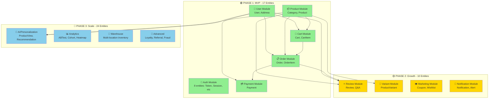

### 📈 Entity Count by Module

| Module              | Phase 1 (MVP) | Phase 2 (Growth)    | Phase 3 (Scale)         | Total  |
| ------------------- | ------------- | ------------------- | ----------------------- | ------ |
| 👤 User & Auth      | 10 entities   | -                   | 1 (2FA)                 | **11** |
| 📦 Product Catalog  | 2 entities    | 2 (Variant, Review) | 3 (View, Q&A)           | **7**  |
| 🛒 Shopping         | 4 entities    | 1 (Wishlist)        | 1 (Abandonment)         | **6**  |
| 📋 Order Management | 3 entities    | 2 (Coupon, Refund)  | 1 (Shipment)            | **6**  |
| 💳 Payment          | 1 entity      | -                   | -                       | **1**  |
| 🎯 Marketing        | -             | 4 entities          | 7 (Loyalty, Flash, etc) | **11** |
| 📊 Analytics & AI   | -             | -                   | 9 entities              | **9**  |
| **TOTAL**           | **17**        | **10**              | **24**                  | **51** |

### 🔗 Core Relationships Overview

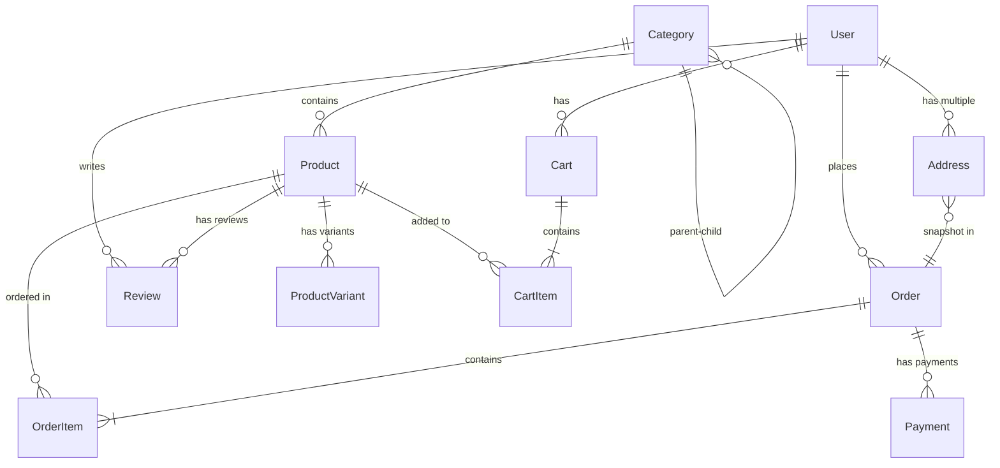

---

## �📊 PHÂN CẤP CHỨC NĂNG E-COMMERCE

### 🟢 LEVEL 1 – CORE MVP (BẮT BUỘC)

Tập trung vào chức năng cơ bản nhất để có một website bán hàng hoạt động được.

| Chức năng       | Entities         | Mục đích                                                |
| --------------- | ---------------- | ------------------------------------------------------- |
| **User & Auth** | User             | Đăng ký, đăng nhập, phân quyền USER/ADMIN               |
| **Category**    | Category         | Quản lý danh mục sản phẩm (hỗ trợ tree structure)       |
| **Product**     | Product          | Quản lý sản phẩm, giá, tồn kho, SKU                     |
| **Cart**        | Cart, CartItem   | Thêm/xóa/cập nhật giỏ hàng                              |
| **Order**       | Order, OrderItem | Tạo đơn hàng, lịch sử mua hàng, tracking                |
| **Address**     | Address          | Quản lý địa chỉ giao hàng của user (multiple addresses) |
| **Payment**     | Payment          | Track payment transactions (COD, Online payment)        |

✅ **MVP Timeline**: 1-2 tuần

⚠️ **Lưu ý quan trọng:** Address và Payment được nâng lên Level 1 vì đây là chức năng thiết yếu cho checkout flow.

---

### 🟡 LEVEL 2 – ENHANCED (THƯỜNG CÓ TRONG THỰC TẾ)

Các chức năng nâng cao giúp hệ thống gần với production hơn.

| Chức năng            | Bổ sung                | Lý do                                    |
| -------------------- | ---------------------- | ---------------------------------------- |
| **Product Images**   | Multi-images array     | 1 sản phẩm nhiều ảnh                     |
| **Product Variants** | ProductVariant entity  | Sản phẩm có size/color/options khác nhau |
| **Stock Management** | Constraints & triggers | Trừ kho tự động khi order                |
| **Review System**    | Review entity          | Xây dựng trust factor ngay sau MVP       |

✅ **Timeline**: Thêm 1 tuần sau MVP

---

### 🔵 LEVEL 3 – ADVANCED (KHÔNG LÀM NGAY)

Chức năng nâng cao, chỉ implement khi có nhu cầu thực tế.

- ⭐ Review / Rating system
- 🎟️ Coupon / Promotion engine
- ❤️ Wishlist
- 📦 Shipment / Tracking integration
- 🔄 Refund / Return management
- 📧 Email notifications
- 📱 SMS OTP verification

⚠️ **Không khuyên implement khi mới bắt đầu**

---

### 🚀 LEVEL 4 – E-COMMERCE 2026 FEATURES (NÂNG CAO & CẠNH TRANH)

Các tính năng tiên tiến để cạnh tranh trong thị trường e-commerce 2026.

#### 🧠 **Personalization & AI**

- 📊 Product View Tracking (recently viewed, trending)
- 🎯 Recommendation Engine (collaborative filtering)
- 🔍 Search Analytics & History
- 📈 User Behavior Tracking
- 🤖 AI-powered Product Suggestions

#### 💰 **Marketing & Growth**

- 🎫 Advanced Coupon Engine (time-based, user-segment, first-order)
- ⚡ Flash Sale Management
- 🔗 Referral Program
- 💎 Loyalty Points & Membership Tiers
- 🎁 Gift Cards & Store Credit
- 📣 Abandoned Cart Recovery

#### 🌟 **Enhanced Product Experience**

- 💬 Q&A System (product questions & answers)
- 📹 Product Videos & UGC Content
- 📏 Size Recommendation (rule-based)
- 🔄 Product Comparison
- 🔔 Back-in-Stock Notifications
- 📦 Product Bundles

#### 📱 **Mobile & UX Optimization**

- 🏠 PWA Support (offline cart, push notifications)
- 🖼️ Image Search
- 🎤 Voice Search
- 📍 Location-based Features
- 🎨 Dynamic Homepage Personalization

#### 📊 **Analytics & Business Intelligence**

- 📉 Funnel Analytics
- 👥 Cohort Analysis
- 🔥 Heatmap Data
- 🛒 Cart Abandonment Analytics
- 📈 A/B Testing Framework
- 💡 Product Performance Metrics

#### 🔐 **Advanced Security & Compliance**

- 🚨 Fraud Detection
- 📝 Audit Logs
- 🔒 Data Encryption
- 🇪🇺 GDPR Compliance
- 🔑 Social Login (Google, Facebook, Apple)
- 📲 2FA / OTP Verification

#### 🚚 **Advanced Fulfillment**

- 📍 Multi-Warehouse Management
- 🗺️ Ship from Nearest Warehouse
- 📦 Split Shipments
- 📅 Estimated Delivery Date
- 🔔 Real-time Notification System
- 🔄 Subscription & Recurring Orders

✅ **Implement theo phases**: MVP → Growth → Scale & AI

---

## 🗂️ TỔNG QUAN ENTITIES

### Danh sách Entities chính theo Level

#### **Level 1 + 2: CORE MVP (9 Core + 8 Auth Entities = 17 Entities)**

##### **Core E-commerce (9 Entities)**

| #   | Entity        | Mục đích                      | Key Fields                           | Relationships              |
| --- | ------------- | ----------------------------- | ------------------------------------ | -------------------------- |
| 1   | **User**      | Authentication, authorization | email, password, role                | → Orders, Carts, Addresses |
| 2   | **Category**  | Product categorization        | name, slug, parentId                 | ← Products, ↔ Self         |
| 3   | **Product**   | Product catalog               | name, price, stock, sku              | ← OrderItems, CartItems    |
| 4   | **Cart**      | Shopping cart                 | userId, isActive                     | → CartItems                |
| 5   | **CartItem**  | Cart line items               | cartId, productId, quantity, price   | ← Cart, Product            |
| 6   | **Order**     | Purchase orders               | orderNumber, total, status           | → OrderItems, Payments     |
| 7   | **OrderItem** | Order line items              | orderId, productId, price            | ← Order, Product           |
| 8   | **Address**   | Shipping addresses            | userId, fullName, address, isDefault | ← User                     |
| 9   | **Payment**   | Payment transactions          | orderId, method, amount, status      | ← Order                    |

##### **🔐 Authentication & Authorization Module (8 Entities - BẮT BUỘC)**

| #   | Entity                     | Mục đích                         | Key Fields                              | Phase   |
| --- | -------------------------- | -------------------------------- | --------------------------------------- | ------- |
| 8   | **RefreshToken**           | JWT refresh token management     | userId, token, expiresAt, isRevoked     | Phase 1 |
| 9   | **EmailVerificationToken** | Email verification               | userId, token, expiresAt, isUsed        | Phase 1 |
| 10  | **PasswordResetToken**     | Password reset flow              | userId, token, expiresAt, isUsed        | Phase 1 |
| 11  | **LoginAttempt**           | Track failed login / brute force | userId, ipAddress, success, attemptedAt | Phase 1 |
| 12  | **UserSession**            | Active sessions tracking         | userId, token, device, ipAddress        | Phase 1 |
| 13  | **Role**                   | RBAC roles                       | name, description, isActive             | Phase 1 |
| 14  | **Permission**             | Granular permissions (optional)  | name, resource, action                  | Phase 2 |
| 15  | **RolePermission**         | Role-Permission mapping          | roleId, permissionId                    | Phase 2 |

#### **Level 3: ADVANCED (10 Entities)**

| #   | Entity            | Mục đích                     | Key Fields                      | Phase    |
| --- | ----------------- | ---------------------------- | ------------------------------- | -------- |
| 16  | **Review**        | Product reviews & rating     | productId, userId, rating, text | Phase 2  |
| 17  | **Wishlist**      | User wishlist                | userId, productId               | Phase 2  |
| 18  | **Coupon**        | Discount coupons             | code, type, value, expiry       | Phase 2  |
| 20  | **OrderCoupon**   | Applied coupons tracking     | orderId, couponId, discount     | Phase 2  |
| 21  | **Notification**  | User notifications           | userId, type, message, isRead   | Phase 2  |
| 22  | **RefundRequest** | Return/refund management     | orderId, reason, status         | Phase 2+ |
| 23  | **ShipmentTrack** | Shipping tracking            | orderId, carrier, trackingNo    | Phase 2+ |
| 24  | **SocialLogin**   | OAuth providers (G/FB/Apple) | userId, provider, providerId    | Phase 1  |
| 25  | **AuditLog**      | Security audit trail         | userId, action, resource, ip    | Phase 1  |
| 26  | **TwoFactorAuth** | 2FA/OTP management           | userId, secret, backupCodes     | Phase 2  |

#### **Level 4: E-COMMERCE 2026 (24 Entities)**

| #   | Entity                    | Mục đích                   | Key Fields                           | Phase   |
| --- | ------------------------- | -------------------------- | ------------------------------------ | ------- |
| 27  | **ProductView**           | Track product views        | productId, userId, sessionId, viewed | Phase 3 |
| 28  | **SearchHistory**         | Search analytics           | userId, query, results, clicked      | Phase 3 |
| 29  | **ProductQuestion**       | Q&A system                 | productId, userId, question          | Phase 2 |
| 30  | **ProductAnswer**         | Q&A answers                | questionId, userId, answer           | Phase 2 |
| 31  | **LoyaltyPoint**          | Points tracking            | userId, points, earned, spent        | Phase 3 |
| 32  | **LoyaltyTransaction**    | Points transaction history | userId, type, points, reference      | Phase 3 |
| 33  | **ReferralCode**          | Referral program           | userId, code, usageCount, reward     | Phase 3 |
| 34  | **GiftCard**              | Gift card management       | code, balance, isActive              | Phase 3 |
| 35  | **ProductVideo**          | UGC videos                 | productId, url, type (ugc/official)  | Phase 3 |
| 36  | **CartAbandonment**       | Abandoned cart tracking    | cartId, userId, recoveryStatus       | Phase 3 |
| 37  | **ABTest**                | A/B testing framework      | name, variant, conversion            | Phase 3 |
| 38  | **ProductComparison**     | Compare products           | userId, productIds (array)           | Phase 3 |
| 39  | **BackInStockAlert**      | Stock notification         | productId, userId, notified          | Phase 2 |
| 40  | **Subscription**          | Recurring orders           | userId, productId, frequency         | Phase 3 |
| 41  | **Warehouse**             | Multi-warehouse            | name, address, isActive              | Phase 3 |
| 42  | **InventoryWarehouse**    | Warehouse stock            | productId, warehouseId, stock        | Phase 3 |
| 43  | **FraudDetectionLog**     | Fraud tracking             | orderId, score, flags, action        | Phase 3 |
| 44  | **DynamicPricing**        | AI pricing                 | productId, basePrice, adjustedPrice  | Phase 3 |
| 45  | **UserSegment**           | Marketing segments         | name, criteria, userCount            | Phase 3 |
| 46  | **EmailCampaign**         | Email marketing            | name, segment, sent, opened          | Phase 3 |
| 47  | **PushNotification**      | PWA push notifications     | userId, title, body, sent            | Phase 3 |
| 48  | **ProductRecommendation** | AI recommendations         | userId, productId, score, algorithm  | Phase 3 |
| 49  | **ProductBundle**         | Product bundles            | name, productIds, discount           | Phase 2 |
| 50  | **FlashSale**             | Flash sale management      | productId, startTime, endTime, price | Phase 2 |

**📊 Tổng cộng: 51 Entities**

- **Phase 1 (MVP):** 17 entities (9 Core + 8 Auth)
- **Phase 2 (Growth):** 10 entities (Advanced features + ProductVariant)
- **Phase 3 (Scale):** 24 entities (AI & Analytics)

**🔄 Thay đổi so với thiết kế ban đầu:**

- ✅ **Address** di chuyển từ Level 3 lên **Level 1** (thiết yếu cho checkout)
- ✅ **Payment** thêm mới vào **Level 1** (track payment transactions)
- ✅ **ProductVariant** thêm mới vào **Level 2** (hỗ trợ size/color variants)
- ✅ **CartItem** thêm field `price` (snapshot price khi add to cart)
- ✅ **Order** thêm `shippingAddressSnapshot` (JSON snapshot thay vì foreign key)

---

## 📐 DATABASE SCHEMA DIAGRAM (ERD)

### 🎯 Core MVP Schema (Level 1+2)

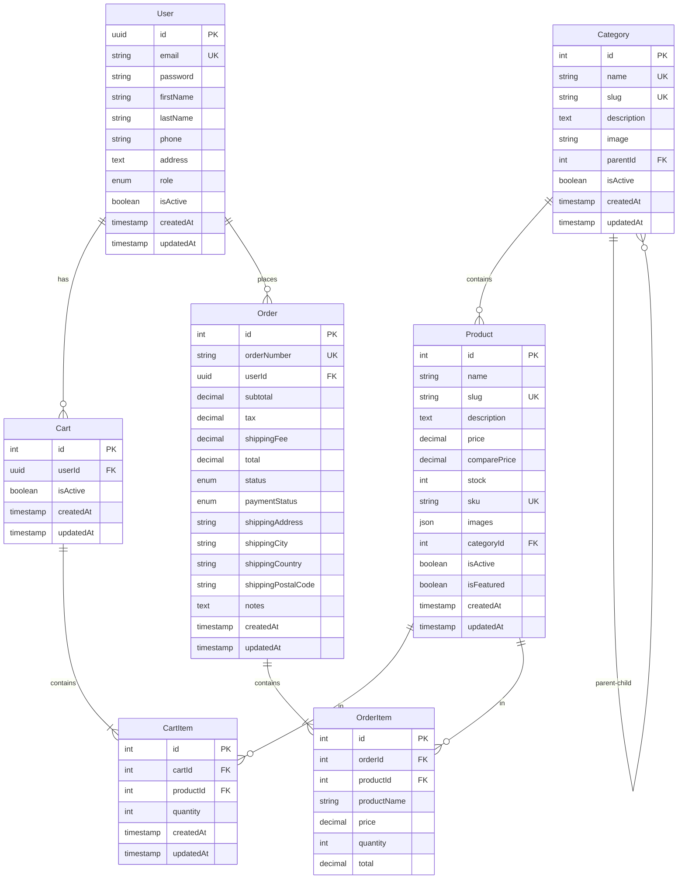

### 🔐 Authentication & Authorization Module (Level 1 - MVP)

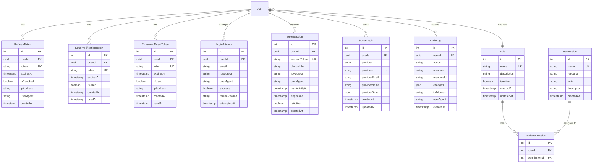

### 🌟 Extended Schema - Level 3 (Advanced Features)

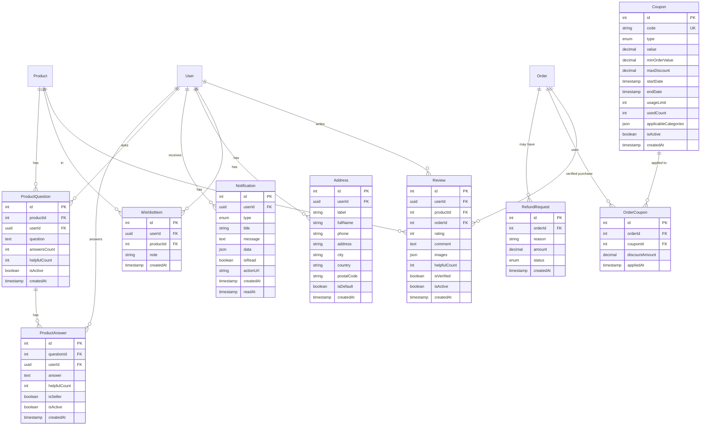

### 🚀 E-Commerce 2026 Schema - Level 4

#### 🧠 Personalization & AI Module

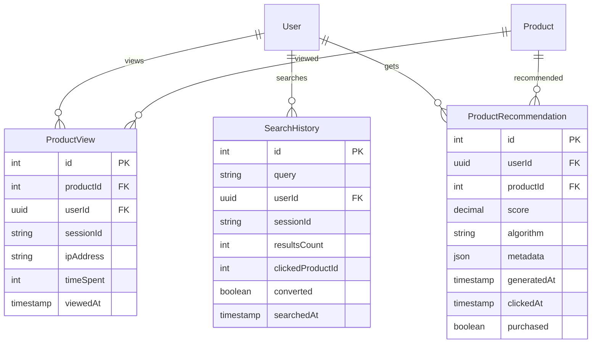

#### 💎 Loyalty & Rewards Module

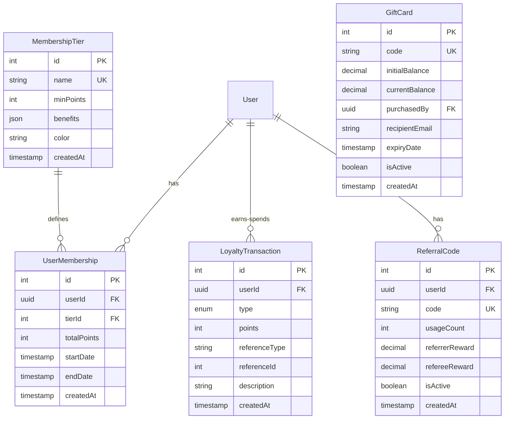

#### ⚡ Marketing & Sales Module

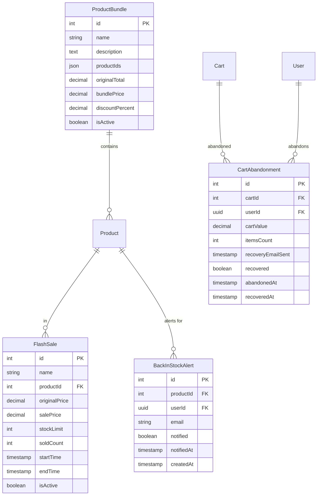

#### 🚚 Multi-Warehouse & Fulfillment Module

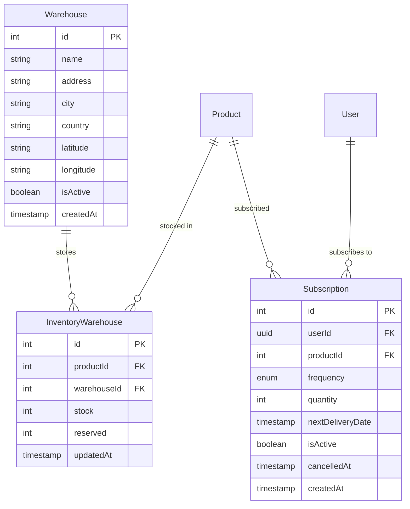

#### 🔐 Security & Compliance Module

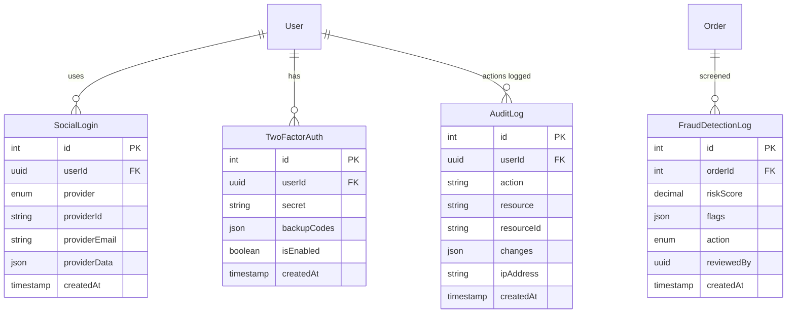

#### 📊 Analytics & A/B Testing Module

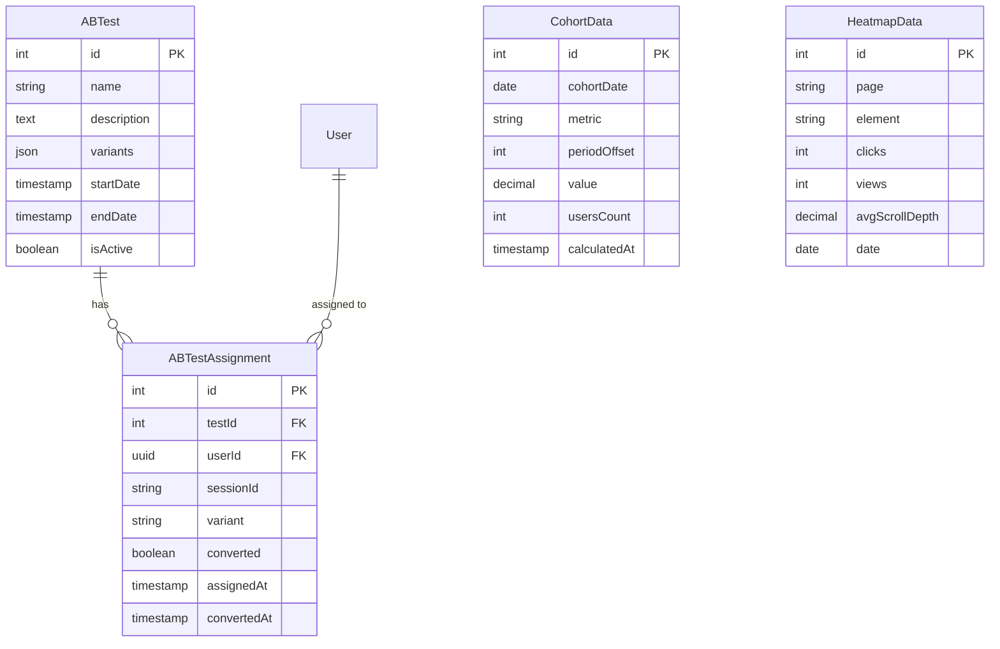

#### 📱 Mobile & PWA Module

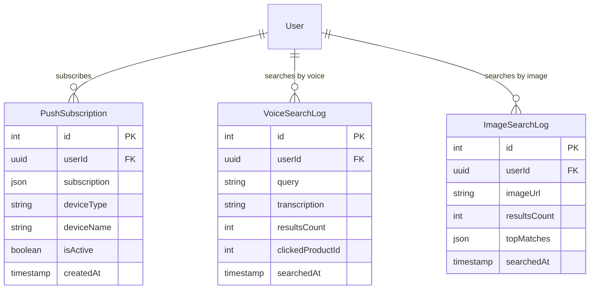

---

## 📋 CHI TIẾT TỪNG ENTITY

### 1️⃣ **User** – Người dùng

**Chức năng hỗ trợ:**

- Authentication (đăng ký, đăng nhập)
- Authorization (phân quyền USER/ADMIN)
- Ownership (cart, order ownership tracking)
- Profile management

**TypeORM Entity Specification:**

| Field       | Type         | Decorators                                                  | Validation                      | Description                      |
| ----------- | ------------ | ----------------------------------------------------------- | ------------------------------- | -------------------------------- |
| `id`        | UUID         | `@PrimaryGeneratedColumn('uuid')`                           | -                               | Primary key, auto-generated UUID |
| `email`     | VARCHAR(255) | `@Column({ unique: true })`                                 | `@IsEmail()`                    | Unique email, indexed            |
| `password`  | VARCHAR(255) | `@Column()`, `@Exclude()`                                   | `@IsStrongPassword()`           | Bcrypt hashed password           |
| `firstName` | VARCHAR(100) | `@Column({ nullable: true })`                               | `@IsString()`, `@Length(1,100)` | Optional first name              |
| `lastName`  | VARCHAR(100) | `@Column({ nullable: true })`                               | `@IsString()`, `@Length(1,100)` | Optional last name               |
| `phone`     | VARCHAR(20)  | `@Column({ nullable: true })`                               | `@IsPhoneNumber('VN')`          | Vietnam phone format             |
| `address`   | TEXT         | `@Column({ type: 'text', nullable: true })`                 | -                               | Full address                     |
| `role`      | ENUM         | `@Column({ type: 'enum', enum: Role, default: Role.USER })` | `@IsEnum(Role)`                 | USER or ADMIN                    |
| `isActive`  | BOOLEAN      | `@Column({ default: true })`                                | -                               | Soft delete flag                 |
| `createdAt` | TIMESTAMP    | `@CreateDateColumn()`                                       | -                               | Auto-generated                   |
| `updatedAt` | TIMESTAMP    | `@UpdateDateColumn()`                                       | -                               | Auto-updated                     |

**Relationships:**

```typescript
@OneToMany(() => Cart, cart => cart.user)
carts: Cart[];

@OneToMany(() => Order, order => order.user)
orders: Order[];
```

**Indexes:**

- `@Index()` on `email` (unique constraint already creates index)
- `@Index()` on `isActive` for filtering active users

**Business Rules:**

- Email must be unique và valid format
- Password phải hash bằng bcrypt (minimum cost factor 10)
- Role default là USER
- Soft delete: set `isActive = false` thay vì hard delete
- Email verification required trước khi login (tuỳ config)
- Account lock sau 5 lần login fail

---

## 🎯 BUSINESS REQUIREMENTS TO DATABASE MAPPING

Hiểu cách **business requirements** được chuyển đổi thành **database schema**.

### 📋 Traceability Matrix

| Business Requirement                               | Entities Involved                      | Key Fields                                         | Design Rationale                                               |
| -------------------------------------------------- | -------------------------------------- | -------------------------------------------------- | -------------------------------------------------------------- |
| **User đăng ký tài khoản**                         | `User`                                 | `email`, `password`, `role`                        | UUID for security, bcrypt password, email unique constraint    |
| **User đăng nhập với email/password**              | `User`, `RefreshToken`, `LoginAttempt` | `email`, `password`, `token`                       | Track failed attempts (brute force), refresh token for JWT     |
| **User quản lý nhiều địa chỉ giao hàng**           | `Address`                              | `userId`, `isDefault`, `type`                      | 1:N relationship, isDefault flag cho quick checkout            |
| **Sản phẩm có nhiều ảnh**                          | `Product`                              | `images` (JSON array)                              | JSON column thay vì separate table (simple, no query needs)    |
| **Sản phẩm có size/color variants**                | `ProductVariant`                       | `productId`, `attributes` (JSON), `sku`            | Flexible attributes, each variant có price/stock riêng         |
| **Danh mục sản phẩm phân cấp**                     | `Category`                             | `parentId` (self-FK)                               | Self-referencing relationship cho tree structure               |
| **Giỏ hàng lưu khi chưa checkout**                 | `Cart`, `CartItem`                     | `userId`, `isActive`, `price`                      | isActive cho multiple carts, price snapshot tránh thay đổi     |
| **Giá sản phẩm có thể thay đổi**                   | `CartItem`, `OrderItem`                | `price` (snapshot)                                 | Copy price khi add to cart/order để preserve history           |
| **User checkout tạo đơn hàng**                     | `Order`, `OrderItem`, `Payment`        | `orderNumber`, `status`, `shippingAddressSnapshot` | Snapshot address (immutable), generate unique orderNumber      |
| **Thanh toán COD và Online**                       | `Payment`                              | `method` (enum), `status`, `transactionId`         | Track payment history, multiple attempts, provider response    |
| **Admin xác nhận đơn hàng**                        | `Order`                                | `status` (state machine)                           | PENDING → CONFIRMED transition, validate payment first         |
| **Trừ kho khi đơn hàng confirmed**                 | `Product`                              | `stock`                                            | Decrease stock in transaction với order creation               |
| **User không xóa được product đang trong order**   | `Product`, `OrderItem`                 | FK với ON DELETE RESTRICT                          | Referential integrity, soft delete product thay vì hard delete |
| **Địa chỉ giao hàng không thay đổi sau khi order** | `Order`                                | `shippingAddressSnapshot` (JSON)                   | Copy toàn bộ address vào JSON, không reference FK              |
| **Search sản phẩm theo tên**                       | `Product`                              | `name`, `slug`, full-text index                    | GIN index với pg_trgm cho fuzzy search                         |
| **Filter sản phẩm theo category**                  | `Product`, `Category`                  | `categoryId`, composite index                      | Index (categoryId, isActive) cho filtered queries              |
| **Track failed login attempts**                    | `LoginAttempt`                         | `userId`, `ipAddress`, `success`, `attemptedAt`    | Brute force protection, composite index (email, attemptedAt)   |
| **User có thể review sau khi mua**                 | `Review`                               | `userId`, `productId`, `orderId`, `isVerified`     | Verify purchase via orderId, prevent fake reviews              |

### 🇻🇳 Vietnam-Specific Requirements

| Requirement                       | Field              | Entity            | Why Important                                  |
| --------------------------------- | ------------------ | ----------------- | ---------------------------------------------- |
| **Địa chỉ Việt Nam có Phường/Xã** | `ward`             | `Address`         | Administrative division cần thiết cho shipping |
| **Địa chỉ có Quận/Huyện**         | `district`         | `Address`         | Tính phí ship theo địa phương                  |
| **Phone format +84**              | `phone` validation | `User`, `Address` | Validation: `@IsPhoneNumber('VN')`             |
| **Payment methods phổ biến**      | `method` enum      | `Payment`         | COD, Momo, VNPay, ZaloPay (local providers)    |
| **Currency VND**                  | `currency` default | `Payment`         | Default 'VND', price format không có decimal   |

### 💡 Design Decision Examples

**1. Tại sao User.id dùng UUID thay vì INT?**

```typescript
// Requirement: "Bảo mật user data, không cho enumerate users"
// ❌ INT: User có thể guess: /api/users/1, /api/users/2, /api/users/3
// ✅ UUID: /api/users/550e8400-e29b-41d4-a716-446655440000 (không đoán được)

// Bonus: UUID generate offline, distributed systems friendly
```

**2. Tại sao CartItem.price lưu riêng thay vì reference Product.price?**

```typescript
// Requirement: "Giá trong giỏ không thay đổi khi admin update giá sản phẩm"
// Scenario:
// - 9:00 AM: User add Product (price = 100,000đ) vào cart
// - 10:00 AM: Admin update Product.price = 120,000đ
// - 11:00 AM: User checkout
// ❌ Không snapshot: User phải trả 120,000đ (tăng giá bất ngờ!)
// ✅ Có snapshot: User vẫn trả 100,000đ (giá khi add to cart)
```

**3. Tại sao Order.shippingAddress là JSON thay vì FK to Address?**

```typescript
// Requirement: "Địa chỉ giao hàng trong order history không đổi"
// Scenario:
// - User order với Address A
// - User xóa Address A
// - Admin xem lại order history
// ❌ FK: Address không tồn tại → lỗi!
// ✅ JSON snapshot: Address preserved forever (immutable)
```

**4. Tại sao Product.images dùng JSON array thay vì separate table?**

```typescript
// Requirement: "Product có 3-5 ảnh, chỉ display, không filter/search by image"
// ❌ Normalized: CREATE TABLE product_images (id, productId, url, order)
//    - More complex: 2 tables + join
//    - Overkill nếu không query by image
// ✅ JSON array: ['img1.jpg', 'img2.jpg']
//    - Simple, compact
//    - TypeORM built-in JSON support
//    - Caveats: Không index được, không query WHERE image = 'x'
```

**5. Tại sao Category.parentId self-reference thay vì separate table?**

```typescript
// Requirement: "Danh mục phân cấp: Electronics > Smartphones > iPhone"
// ✅ Self-referencing FK:
categories: [
  { id: 1, name: "Electronics", parentId: null },
  { id: 2, name: "Smartphones", parentId: 1 },
  { id: 3, name: "iPhone", parentId: 2 },
];
// - Simple structure
// - Recursive queries với CTE
// - TypeORM self-referencing support

// ❌ Alternative: Adjacency list table
// - More complex, rarely needed
```

---

## 🎬 END-TO-END SCENARIOS

Hiểu data flow thực tế qua các scenarios cụ thể.

### 📦 Scenario 1: User Checkout Flow

**Business Requirement:**

> User đã thêm 3 sản phẩm vào giỏ, chọn địa chỉ giao hàng, thanh toán COD, tạo đơn hàng.

**Data Flow Diagram:**

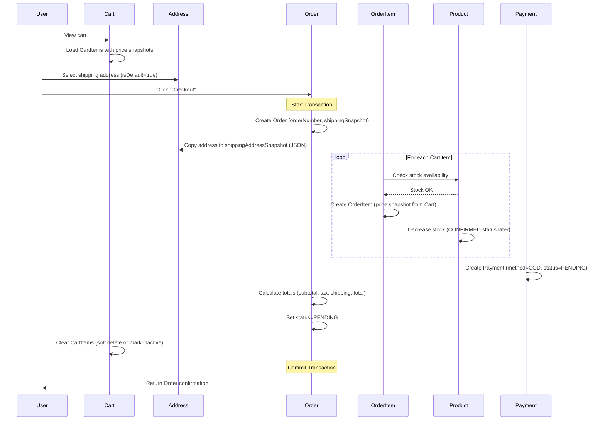

**Step-by-Step SQL & TypeORM:**

```typescript
// Step 1: Load Cart với price snapshots
const cart = await cartRepo.findOne({
  where: { userId, isActive: true },
  relations: ["cartItems", "cartItems.product"],
});

// Step 2: Get default address
const address = await addressRepo.findOne({
  where: { userId, isDefault: true },
});

// Step 3: Start transaction
await dataSource.transaction(async (manager) => {
  // 3.1: Create Order với address snapshot
  const order = manager.create(Order, {
    userId,
    orderNumber: generateOrderNumber(), // ORD-20260111-0001
    status: OrderStatus.PENDING,
    paymentStatus: PaymentStatus.PENDING,
    shippingAddressSnapshot: {
      fullName: address.fullName,
      phone: address.phone,
      address: address.address,
      ward: address.ward,
      district: address.district,
      city: address.city,
      postalCode: address.postalCode,
    },
    subtotal: 0, // Calculate later
    tax: 0,
    shippingFee: 0,
    total: 0,
  });
  await manager.save(order);

  // 3.2: Create OrderItems
  let subtotal = 0;
  for (const cartItem of cart.cartItems) {
    // Validate stock
    if (cartItem.product.stock < cartItem.quantity) {
      throw new BadRequestException("Insufficient stock");
    }

    // Create OrderItem với price snapshot từ CartItem
    const orderItem = manager.create(OrderItem, {
      orderId: order.id,
      productId: cartItem.productId,
      productName: cartItem.product.name, // Snapshot
      price: cartItem.price, // Snapshot từ cart!
      quantity: cartItem.quantity,
      total: cartItem.price * cartItem.quantity,
    });
    await manager.save(orderItem);

    subtotal += orderItem.total;

    // Note: Stock chỉ trừ khi order CONFIRMED, không phải lúc PENDING
    // Tránh: User tạo order rồi không thanh toán → stock bị lock
  }

  // 3.3: Calculate totals
  const tax = subtotal * 0.1; // VAT 10%
  const shippingFee = calculateShipping(address); // Based on location
  const total = subtotal + tax + shippingFee;

  order.subtotal = subtotal;
  order.tax = tax;
  order.shippingFee = shippingFee;
  order.total = total;
  await manager.save(order);

  // 3.4: Create Payment record
  const payment = manager.create(Payment, {
    orderId: order.id,
    method: PaymentMethod.COD,
    amount: total,
    status: PaymentStatus.PENDING,
    ipAddress: req.ip,
  });
  await manager.save(payment);

  // 3.5: Clear cart
  await manager.delete(CartItem, { cartId: cart.id });
  // Or: await manager.update(Cart, { id: cart.id }, { isActive: false });

  return order;
});
```

**Key Takeaways:**

- ✅ **Transaction**: All-or-nothing (nếu payment fail → order rollback)
- ✅ **Snapshots**: Address, product name, price copied (immutable)
- ✅ **Stock validation**: Check before create, decrease khi CONFIRMED
- ✅ **Clear cart**: Clean up after successful checkout

---

### 💰 Scenario 2: Price Change During Shopping

**Business Requirement:**

> Tránh user bị tăng giá bất ngờ khi đang shopping.

**Timeline:**

```
9:00 AM  → User adds Product (price = 100,000đ) to Cart
         → CartItem.price = 100,000 (snapshot)

10:00 AM → Admin updates Product.price = 120,000đ
         → Product.price = 120,000 (new price)
         → CartItem.price = 100,000 (KHÔNG ĐỔI!)

11:00 AM → User views cart
         → Display: 100,000đ (từ CartItem.price)
         → NOT: 120,000đ (từ Product.price)

12:00 PM → User checkout
         → OrderItem.price = 100,000 (từ CartItem.price)
```

**Why This Matters:**

```typescript
// ❌ BAD: Không có price snapshot trong CartItem
class CartItem {
  productId: number;
  quantity: number;
  // Lấy price từ Product.price (realtime)
}

// Cart display:
cartItems.forEach((item) => {
  const price = item.product.price; // ← Giá thay đổi theo Product!
  const total = price * item.quantity;
});
// Problem: User thấy giá 100k, checkout lại thành 120k!

// ✅ GOOD: Có price snapshot
class CartItem {
  productId: number;
  quantity: number;
  price: number; // ← Snapshot khi add to cart
}

// Cart display:
cartItems.forEach((item) => {
  const price = item.price; // ← Giá cố định
  const total = price * item.quantity;
});
// Solution: User thấy giá nào thì trả giá đó!
```

**Edge Cases:**

```typescript
// Case 1: User xóa item rồi add lại
// → Lấy price MỚI NHẤT (hợp lý)
await cartItemRepo.delete({ cartId, productId });
const newPrice = await productRepo.findOne(productId).then((p) => p.price);
await cartItemRepo.save({ cartId, productId, quantity, price: newPrice });

// Case 2: Price giảm sau khi add to cart
// User muốn price mới (rẻ hơn)?
// → Frontend hiển thị warning: "Giá đã giảm, update giỏ hàng?"
// → Button "Update price" → re-add item với price mới

// Case 3: Product out of stock sau khi add to cart
// → Validate stock khi checkout, không phải khi add to cart
```

---

### 🗑️ Scenario 3: Product Deletion Safety

**Business Requirement:**

> Admin không thể xóa product đang có trong active orders (data integrity).

**Database Constraints:**

```sql
-- OrderItem.productId với RESTRICT
ALTER TABLE order_items
ADD CONSTRAINT fk_orderitem_product
FOREIGN KEY (productId) REFERENCES products(id)
ON DELETE RESTRICT; -- ← Không cho xóa!
```

**What Happens:**

```typescript
// Scenario: Product ID=123 đang có trong 5 orders
// Admin tries to delete product

// ❌ Hard delete attempt
await productRepo.delete(123);
// Result: PostgreSQL Error:
// "update or delete on table products violates foreign key constraint"
// → GOOD! Data integrity preserved.

// ✅ Soft delete solution
await productRepo.softDelete(123);
// OR
await productRepo.update(123, { deletedAt: new Date() });
// Result:
// - Product.deletedAt = 2026-01-11
// - Product still exists (orders safe)
// - Frontend: Không hiển thị product
// - Admin: Có thể restore nếu cần
```

**Soft Delete Implementation:**

```typescript
@Entity("products")
export class Product {
  // ... other fields

  @DeleteDateColumn()
  deletedAt: Date; // NULL = active, có giá trị = deleted
}

// Query active products only (TypeORM tự động filter)
const products = await productRepo.find(); // WHERE deletedAt IS NULL

// Query including deleted (admin view)
const allProducts = await productRepo.find({ withDeleted: true });

// Restore deleted product
await productRepo.restore(123); // deletedAt = NULL
```

**Order History Protection:**

```typescript
// User views order from 2025
const order = await orderRepo.findOne(456, {
  relations: ["orderItems", "orderItems.product"],
});

// Product đã bị soft delete nhưng:
order.orderItems.forEach((item) => {
  console.log(item.productName); // ✅ Snapshot preserved!
  console.log(item.price); // ✅ Historical price!
  console.log(item.product); // ✅ Still accessible (withDeleted)
});

// Frontend display:
// "iPhone 14 Pro - 27,990,000đ" ← From snapshot
// "(Sản phẩm không còn bán)" ← If product.deletedAt != null
```

---

### 🔄 Scenario 4: Order Status State Machine

**Business Requirement:**

> Order phải follow strict status flow, không random transitions.

**State Machine:**

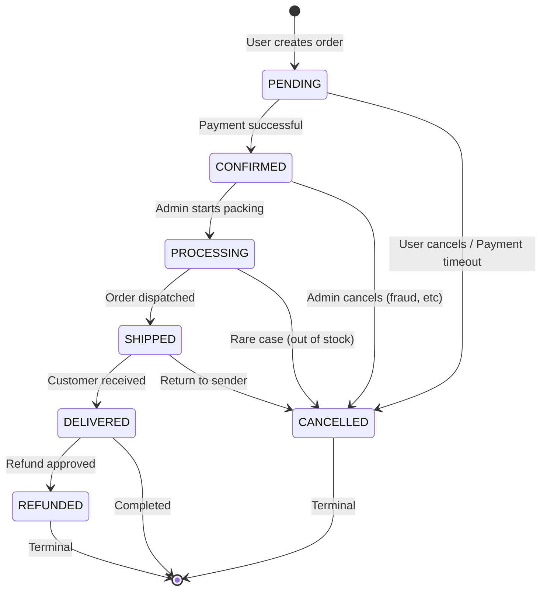

**Validation Logic:**

```typescript
class OrderService {
  private VALID_TRANSITIONS: Record<OrderStatus, OrderStatus[]> = {
    PENDING: [OrderStatus.CONFIRMED, OrderStatus.CANCELLED],
    CONFIRMED: [OrderStatus.PROCESSING, OrderStatus.CANCELLED],
    PROCESSING: [OrderStatus.SHIPPED, OrderStatus.CANCELLED],
    SHIPPED: [OrderStatus.DELIVERED, OrderStatus.CANCELLED],
    DELIVERED: [OrderStatus.REFUNDED], // Terminal (can only refund)
    CANCELLED: [], // Terminal state
    REFUNDED: [], // Terminal state
  };

  async updateStatus(orderId: number, newStatus: OrderStatus, reason?: string) {
    const order = await this.orderRepo.findOne(orderId);

    // Validate transition
    const allowedStatuses = this.VALID_TRANSITIONS[order.status];
    if (!allowedStatuses.includes(newStatus)) {
      throw new BadRequestException(
        `Cannot transition from ${order.status} to ${newStatus}`
      );
    }

    // Additional business rules
    if (newStatus === OrderStatus.CONFIRMED) {
      // Rule 1: Payment must be completed
      if (order.paymentStatus !== PaymentStatus.PAID) {
        throw new BadRequestException("Cannot confirm order without payment");
      }

      // Rule 2: Decrease product stock
      await this.decreaseStock(order);
    }

    if (newStatus === OrderStatus.CANCELLED) {
      // Rule 3: Save cancel reason
      order.cancelReason = reason || "Customer cancelled";

      // Rule 4: Restore stock if order was CONFIRMED
      if (order.status === OrderStatus.CONFIRMED) {
        await this.restoreStock(order);
      }

      // Rule 5: Refund payment if applicable
      if (order.paymentStatus === PaymentStatus.PAID) {
        await this.paymentService.refund(order.id);
      }
    }

    if (newStatus === OrderStatus.DELIVERED && order.paymentMethod === "COD") {
      // Rule 6: Mark COD payment as PAID
      await this.paymentService.markCODPaid(order.id);
    }

    // Update status
    order.status = newStatus;
    await this.orderRepo.save(order);

    // Send notifications
    await this.notificationService.sendOrderStatusUpdate(order);

    return order;
  }
}
```

**Real Example Flow:**

```typescript
// Order lifecycle:
const order = await orderService.create({ userId, cartId, addressId });
// Status: PENDING, PaymentStatus: PENDING

// User thanh toán Momo
await paymentService.handleMomoCallback(order.id, { success: true });
// PaymentStatus: PAID

// Admin confirms
await orderService.updateStatus(order.id, OrderStatus.CONFIRMED);
// Status: CONFIRMED
// Side effect: Stock decreased

// Admin packs
await orderService.updateStatus(order.id, OrderStatus.PROCESSING);
// Status: PROCESSING

// Shipper nhận hàng
await orderService.updateStatus(order.id, OrderStatus.SHIPPED);
// Status: SHIPPED
// Side effect: Email/SMS sent to customer

// Customer nhận hàng
await orderService.updateStatus(order.id, OrderStatus.DELIVERED);
// Status: DELIVERED
// If COD: PaymentStatus = PAID

// ❌ Invalid transitions will be rejected:
await orderService.updateStatus(order.id, OrderStatus.PENDING);
// Error: "Cannot transition from DELIVERED to PENDING"
```

---

## 🔐 AUTHENTICATION & AUTHORIZATION ENTITIES (LEVEL 1 - MVP)

### 2️⃣ **RefreshToken** – JWT Refresh Token Management

**Chức năng hỗ trợ:**

- JWT refresh token storage
- Token rotation security
- Revoke compromised tokens
- Multi-device session management

**TypeORM Entity Specification:**

| Field       | Type         | Decorators                                  | Validation | Description                  |
| ----------- | ------------ | ------------------------------------------- | ---------- | ---------------------------- |
| `id`        | INT          | `@PrimaryGeneratedColumn()`                 | -          | Auto-increment PK            |
| `userId`    | UUID         | `@Column({ type: 'uuid' })`                 | -          | Foreign key to User          |
| `token`     | VARCHAR(500) | `@Column({ unique: true, length: 500 })`    | -          | Hashed refresh token         |
| `expiresAt` | TIMESTAMP    | `@Column()`                                 | -          | Token expiration (7-30 days) |
| `isRevoked` | BOOLEAN      | `@Column({ default: false })`               | -          | Manual revocation flag       |
| `ipAddress` | VARCHAR(45)  | `@Column({ nullable: true })`               | -          | IPv4/IPv6 address            |
| `userAgent` | TEXT         | `@Column({ type: 'text', nullable: true })` | -          | Browser/device info          |
| `createdAt` | TIMESTAMP    | `@CreateDateColumn()`                       | -          | Token creation time          |

**Relationships:**

```typescript
@ManyToOne(() => User, { onDelete: 'CASCADE' })
@JoinColumn({ name: 'userId' })
user: User;
```

**Indexes:**

- `@Index()` on `userId`
- `@Index()` on `token` (unique)
- `@Index()` on `expiresAt` (cleanup expired tokens)

**Business Rules:**

- Token phải hash trước khi lưu (bcrypt)
- Auto-delete expired tokens (cron job)
- Revoke all tokens khi change password
- Max 5 active tokens per user (limit devices)
- Token rotation: invalidate old token khi refresh

---

### 3️⃣ **EmailVerificationToken** – Email Verification

**Chức năng hỗ trợ:**

- Verify email ownership
- Prevent fake accounts
- One-time use token

**TypeORM Entity Specification:**

| Field       | Type         | Decorators                    | Validation | Description           |
| ----------- | ------------ | ----------------------------- | ---------- | --------------------- |
| `id`        | INT          | `@PrimaryGeneratedColumn()`   | -          | Auto-increment PK     |
| `userId`    | UUID         | `@Column({ type: 'uuid' })`   | -          | Foreign key to User   |
| `token`     | VARCHAR(255) | `@Column({ unique: true })`   | -          | UUID v4 token         |
| `expiresAt` | TIMESTAMP    | `@Column()`                   | -          | Expires in 15-30 mins |
| `isUsed`    | BOOLEAN      | `@Column({ default: false })` | -          | One-time use flag     |
| `createdAt` | TIMESTAMP    | `@CreateDateColumn()`         | -          | Token generation time |
| `usedAt`    | TIMESTAMP    | `@Column({ nullable: true })` | -          | Verification time     |

**Relationships:**

```typescript
@ManyToOne(() => User, { onDelete: 'CASCADE' })
@JoinColumn({ name: 'userId' })
user: User;
```

**Indexes:**

- `@Index()` on `userId`
- `@Index()` on `token` (unique)
- `@Index()` on `expiresAt`

**Business Rules:**

- Token expires sau 30 phút
- Only 1 active token per user
- Auto-delete expired tokens
- Mark `isUsed = true` sau khi verify
- Resend tối đa 3 lần trong 1 giờ

---

### 4️⃣ **PasswordResetToken** – Password Reset Flow

**Chức năng hỗ trợ:**

- Forgot password workflow
- Secure password reset
- One-time use token

**TypeORM Entity Specification:**

| Field       | Type         | Decorators                    | Validation | Description           |
| ----------- | ------------ | ----------------------------- | ---------- | --------------------- |
| `id`        | INT          | `@PrimaryGeneratedColumn()`   | -          | Auto-increment PK     |
| `userId`    | UUID         | `@Column({ type: 'uuid' })`   | -          | Foreign key to User   |
| `token`     | VARCHAR(255) | `@Column({ unique: true })`   | -          | UUID v4 token         |
| `expiresAt` | TIMESTAMP    | `@Column()`                   | -          | Expires in 15 mins    |
| `isUsed`    | BOOLEAN      | `@Column({ default: false })` | -          | One-time use flag     |
| `ipAddress` | VARCHAR(45)  | `@Column({ nullable: true })` | -          | Request IP (security) |
| `createdAt` | TIMESTAMP    | `@CreateDateColumn()`         | -          | Token generation time |
| `usedAt`    | TIMESTAMP    | `@Column({ nullable: true })` | -          | Reset completion time |

**Relationships:**

```typescript
@ManyToOne(() => User, { onDelete: 'CASCADE' })
@JoinColumn({ name: 'userId' })
user: User;
```

**Indexes:**

- `@Index()` on `userId`
- `@Index()` on `token` (unique)
- `@Index()` on `expiresAt`

**Business Rules:**

- Token expires sau 15 phút (security)
- Only 1 active token per user
- Invalidate all sessions khi reset password
- Log IP address for security audit
- Rate limit: 3 requests per hour

---

### 5️⃣ **LoginAttempt** – Brute Force Protection

**Chức năng hỗ trợ:**

- Track login attempts
- Account lockout
- Security monitoring
- Suspicious activity detection

**TypeORM Entity Specification:**

| Field           | Type         | Decorators                                  | Validation | Description           |
| --------------- | ------------ | ------------------------------------------- | ---------- | --------------------- |
| `id`            | INT          | `@PrimaryGeneratedColumn()`                 | -          | Auto-increment PK     |
| `userId`        | UUID         | `@Column({ type: 'uuid', nullable: true })` | -          | User ID (if found)    |
| `email`         | VARCHAR(255) | `@Column()`                                 | -          | Login email attempted |
| `ipAddress`     | VARCHAR(45)  | `@Column()`                                 | -          | Source IP             |
| `userAgent`     | TEXT         | `@Column({ type: 'text', nullable: true })` | -          | Browser info          |
| `success`       | BOOLEAN      | `@Column()`                                 | -          | Login result          |
| `failureReason` | VARCHAR(255) | `@Column({ nullable: true })`               | -          | Error reason          |
| `attemptedAt`   | TIMESTAMP    | `@CreateDateColumn()`                       | -          | Attempt timestamp     |

**Relationships:**

```typescript
@ManyToOne(() => User, { nullable: true, onDelete: 'SET NULL' })
@JoinColumn({ name: 'userId' })
user: User;
```

**Indexes:**

- `@Index()` on `userId`
- `@Index()` on `email`
- `@Index()` on `ipAddress`
- `@Index()` on `attemptedAt`
- Composite: `email` + `attemptedAt` (recent failures)

**Business Rules:**

- Lock account sau 5 lần fail trong 15 phút
- Auto-unlock sau 30 phút
- Alert admin nếu >10 fail từ same IP
- Cleanup logs sau 90 ngày
- Track both successful và failed attempts

---

### 6️⃣ **UserSession** – Active Session Tracking

**Chức năng hỗ trợ:**

- Multi-device session management
- Force logout all devices
- Session expiration
- Security monitoring

**TypeORM Entity Specification:**

| Field            | Type         | Decorators                    | Validation | Description         |
| ---------------- | ------------ | ----------------------------- | ---------- | ------------------- |
| `id`             | INT          | `@PrimaryGeneratedColumn()`   | -          | Auto-increment PK   |
| `userId`         | UUID         | `@Column({ type: 'uuid' })`   | -          | Foreign key to User |
| `sessionToken`   | VARCHAR(500) | `@Column({ unique: true })`   | -          | Unique session ID   |
| `deviceInfo`     | VARCHAR(255) | `@Column({ nullable: true })` | -          | Device name/model   |
| `ipAddress`      | VARCHAR(45)  | `@Column()`                   | -          | Session IP          |
| `userAgent`      | TEXT         | `@Column({ type: 'text' })`   | -          | Browser/app info    |
| `lastActivityAt` | TIMESTAMP    | `@Column()`                   | -          | Last API call time  |
| `expiresAt`      | TIMESTAMP    | `@Column()`                   | -          | Session expiration  |
| `isActive`       | BOOLEAN      | `@Column({ default: true })`  | -          | Active status       |
| `createdAt`      | TIMESTAMP    | `@CreateDateColumn()`         | -          | Session start time  |

**Relationships:**

```typescript
@ManyToOne(() => User, { onDelete: 'CASCADE' })
@JoinColumn({ name: 'userId' })
user: User;
```

**Indexes:**

- `@Index()` on `userId`
- `@Index()` on `sessionToken` (unique)
- `@Index()` on `lastActivityAt` (cleanup)
- `@Index()` on `isActive`

**Business Rules:**

- Session expires sau 7 ngày inactive
- Update `lastActivityAt` mỗi API call
- Max 5 active sessions per user
- Revoke all sessions khi change password
- Show active sessions trong user profile

---

### 7️⃣ **Role** – Role-Based Access Control

**Chức năng hỗ trợ:**

- RBAC implementation
- Role hierarchy
- Permission grouping

**TypeORM Entity Specification:**

| Field         | Type        | Decorators                                  | Validation | Description             |
| ------------- | ----------- | ------------------------------------------- | ---------- | ----------------------- |
| `id`          | INT         | `@PrimaryGeneratedColumn()`                 | -          | Auto-increment PK       |
| `name`        | VARCHAR(50) | `@Column({ unique: true })`                 | -          | Role name (USER, ADMIN) |
| `description` | TEXT        | `@Column({ type: 'text', nullable: true })` | -          | Role description        |
| `isActive`    | BOOLEAN     | `@Column({ default: true })`                | -          | Enable/disable role     |
| `createdAt`   | TIMESTAMP   | `@CreateDateColumn()`                       | -          | Creation time           |
| `updatedAt`   | TIMESTAMP   | `@UpdateDateColumn()`                       | -          | Last update             |

**Relationships:**

```typescript
@OneToMany(() => User, user => user.role)
users: User[];

@OneToMany(() => RolePermission, rp => rp.role)
rolePermissions: RolePermission[];
```

**Default Roles:**

```typescript
const DEFAULT_ROLES = [
  { name: "USER", description: "Regular customer" },
  { name: "ADMIN", description: "Administrator with full access" },
  { name: "SELLER", description: "Product manager (optional)" },
  { name: "STAFF", description: "Customer support (optional)" },
];
```

---

### 8️⃣ **Permission** – Granular Permissions (Optional - Phase 2)

**Chức năng hỗ trợ:**

- Fine-grained access control
- Resource-level permissions
- Action-based authorization

**TypeORM Entity Specification:**

| Field         | Type         | Decorators                                  | Validation | Description                 |
| ------------- | ------------ | ------------------------------------------- | ---------- | --------------------------- |
| `id`          | INT          | `@PrimaryGeneratedColumn()`                 | -          | Auto-increment PK           |
| `name`        | VARCHAR(100) | `@Column({ unique: true })`                 | -          | permission.name (unique)    |
| `resource`    | VARCHAR(50)  | `@Column()`                                 | -          | Resource (product, order)   |
| `action`      | VARCHAR(50)  | `@Column()`                                 | -          | Action (create, read, etc.) |
| `description` | TEXT         | `@Column({ type: 'text', nullable: true })` | -          | Permission description      |
| `createdAt`   | TIMESTAMP    | `@CreateDateColumn()`                       | -          | Creation time               |

**Relationships:**

```typescript
@OneToMany(() => RolePermission, rp => rp.permission)
rolePermissions: RolePermission[];
```

**Example Permissions:**

```typescript
const PERMISSIONS = [
  { name: "product.create", resource: "product", action: "create" },
  { name: "product.update", resource: "product", action: "update" },
  { name: "product.delete", resource: "product", action: "delete" },
  { name: "order.refund", resource: "order", action: "refund" },
  { name: "user.manage", resource: "user", action: "manage" },
];
```

---

### 9️⃣ **RolePermission** – Role-Permission Mapping

**Chức năng hỗ trợ:**

- Link roles to permissions
- Many-to-many relationship
- Dynamic permission assignment

**TypeORM Entity Specification:**

| Field          | Type | Decorators                  | Validation | Description               |
| -------------- | ---- | --------------------------- | ---------- | ------------------------- |
| `id`           | INT  | `@PrimaryGeneratedColumn()` | -          | Auto-increment PK         |
| `roleId`       | INT  | `@Column()`                 | -          | Foreign key to Role       |
| `permissionId` | INT  | `@Column()`                 | -          | Foreign key to Permission |

**Relationships:**

```typescript
@ManyToOne(() => Role, role => role.rolePermissions, { onDelete: 'CASCADE' })
@JoinColumn({ name: 'roleId' })
role: Role;

@ManyToOne(() => Permission, permission => permission.rolePermissions, { onDelete: 'CASCADE' })
@JoinColumn({ name: 'permissionId' })
permission: Permission;
```

**Indexes:**

- `@Index(['roleId', 'permissionId'], { unique: true })` (prevent duplicates)

---

### 🔟 **SocialLogin** – OAuth Provider Integration (Level 3)

**Chức năng hỗ trợ:**

- Google, Facebook, Apple login
- Link multiple providers
- Provider profile sync

**TypeORM Entity Specification:**

| Field           | Type         | Decorators                                                         | Validation | Description              |
| --------------- | ------------ | ------------------------------------------------------------------ | ---------- | ------------------------ |
| `id`            | INT          | `@PrimaryGeneratedColumn()`                                        | -          | Auto-increment PK        |
| `userId`        | UUID         | `@Column({ type: 'uuid' })`                                        | -          | Foreign key to User      |
| `provider`      | ENUM         | `@Column({ type: 'enum', enum: ['google', 'facebook', 'apple'] })` | -          | OAuth provider           |
| `providerId`    | VARCHAR(255) | `@Column()`                                                        | -          | Provider user ID         |
| `providerEmail` | VARCHAR(255) | `@Column({ nullable: true })`                                      | -          | Email from provider      |
| `providerName`  | VARCHAR(255) | `@Column({ nullable: true })`                                      | -          | Name from provider       |
| `providerData`  | JSON         | `@Column({ type: 'json', nullable: true })`                        | -          | Additional provider data |
| `createdAt`     | TIMESTAMP    | `@CreateDateColumn()`                                              | -          | Link creation time       |
| `updatedAt`     | TIMESTAMP    | `@UpdateDateColumn()`                                              | -          | Last sync time           |

**Relationships:**

```typescript
@ManyToOne(() => User, { onDelete: 'CASCADE' })
@JoinColumn({ name: 'userId' })
user: User;
```

**Indexes:**

- `@Index(['provider', 'providerId'], { unique: true })` (prevent duplicate links)
- `@Index()` on `userId`

**Business Rules:**

- 1 provider chỉ link được 1 lần per user
- Email từ provider phải match với user.email (hoặc verify)
- Không cho phép unlink nếu user không có password

---

### 1️⃣1️⃣ **AuditLog** – Security Audit Trail (Level 3)

**Chức năng hỗ trợ:**

- Track all sensitive actions
- Compliance (GDPR, security audit)
- Forensic analysis
- User activity monitoring

**TypeORM Entity Specification:**

| Field        | Type         | Decorators                                  | Validation | Description             |
| ------------ | ------------ | ------------------------------------------- | ---------- | ----------------------- |
| `id`         | INT          | `@PrimaryGeneratedColumn()`                 | -          | Auto-increment PK       |
| `userId`     | UUID         | `@Column({ type: 'uuid', nullable: true })` | -          | Actor (null for system) |
| `action`     | VARCHAR(100) | `@Column()`                                 | -          | Action name             |
| `resource`   | VARCHAR(50)  | `@Column()`                                 | -          | Resource type           |
| `resourceId` | VARCHAR(50)  | `@Column({ nullable: true })`               | -          | Resource ID             |
| `changes`    | JSON         | `@Column({ type: 'json', nullable: true })` | -          | Before/after data       |
| `ipAddress`  | VARCHAR(45)  | `@Column({ nullable: true })`               | -          | Source IP               |
| `userAgent`  | TEXT         | `@Column({ type: 'text', nullable: true })` | -          | Client info             |
| `createdAt`  | TIMESTAMP    | `@CreateDateColumn()`                       | -          | Action timestamp        |

**Indexes:**

- `@Index()` on `userId`
- `@Index()` on `action`
- `@Index()` on `resource`
- `@Index()` on `createdAt`

**Tracked Actions:**

```typescript
const AUDIT_ACTIONS = [
  "user.login",
  "user.logout",
  "user.register",
  "user.changePassword",
  "user.update",
  "order.create",
  "order.cancel",
  "product.create",
  "product.update",
  "product.delete",
];
```

---

## 📦 CORE E-COMMERCE ENTITIES (Tiếp tục...)

### 1️⃣2️⃣ **Category** – Danh mục sản phẩm

**Chức năng hỗ trợ:**

- Product organization (tổ chức sản phẩm theo danh mục)
- Hierarchical structure (cây danh mục, hỗ trợ parent-child)
- SEO-friendly slugs

**TypeORM Entity Specification:**

| Field         | Type         | Decorators                                  | Validation                      | Description                |
| ------------- | ------------ | ------------------------------------------- | ------------------------------- | -------------------------- |
| `id`          | INT          | `@PrimaryGeneratedColumn()`                 | -                               | Auto-increment primary key |
| `name`        | VARCHAR(255) | `@Column({ unique: true })`                 | `@IsString()`, `@Length(1,255)` | Unique category name       |
| `slug`        | VARCHAR(255) | `@Column({ unique: true })`                 | `@IsSlug()`                     | URL-friendly slug          |
| `description` | TEXT         | `@Column({ type: 'text', nullable: true })` | `@IsString()`                   | Optional description       |
| `image`       | VARCHAR(500) | `@Column({ nullable: true })`               | `@IsUrl()`                      | Category image URL         |
| `parentId`    | INT          | `@Column({ nullable: true })`               | -                               | Self-referencing FK        |
| `isActive`    | BOOLEAN      | `@Column({ default: true })`                | -                               | Visibility flag            |
| `createdAt`   | TIMESTAMP    | `@CreateDateColumn()`                       | -                               | Auto-generated             |
| `updatedAt`   | TIMESTAMP    | `@UpdateDateColumn()`                       | -                               | Auto-updated               |

**Relationships:**

```typescript
@ManyToOne(() => Category, category => category.children)
@JoinColumn({ name: 'parentId' })
parent: Category;

@OneToMany(() => Category, category => category.parent)
children: Category[];

@OneToMany(() => Product, product => product.category)
products: Product[];
```

**Indexes:**

- `@Index()` on `slug` (unique constraint already indexes)
- `@Index()` on `parentId` for tree queries
- `@Index()` on `isActive`

**Business Rules:**

- Name và slug phải unique
- Slug auto-generate từ name (lowercase, hyphen-separated)
- Self-referencing cho hierarchical categories
- Không cho phép circular references (validate trong service layer)
- Xóa category: check if products exist → soft delete or transfer products

---

### 3️⃣ **Product** – Sản phẩm

**Chức năng hỗ trợ:**

- Product catalog management
- Inventory tracking (stock management)
- Pricing (regular price + compare price for discounts)
- Multi-image support
- SKU management

**TypeORM Entity Specification:**

| Field          | Type          | Decorators                                                              | Validation                      | Description                            |
| -------------- | ------------- | ----------------------------------------------------------------------- | ------------------------------- | -------------------------------------- |
| `id`           | INT           | `@PrimaryGeneratedColumn()`                                             | -                               | Auto-increment PK                      |
| `name`         | VARCHAR(500)  | `@Column({ length: 500 })`                                              | `@IsString()`, `@Length(1,500)` | Product name                           |
| `slug`         | VARCHAR(500)  | `@Column({ unique: true, length: 500 })`                                | `@IsSlug()`                     | SEO-friendly URL                       |
| `description`  | TEXT          | `@Column({ type: 'text', nullable: true })`                             | -                               | Full description                       |
| `price`        | DECIMAL(10,2) | `@Column({ type: 'decimal', precision: 10, scale: 2 })`                 | `@IsPositive()`, `@Min(0)`      | Current price                          |
| `comparePrice` | DECIMAL(10,2) | `@Column({ type: 'decimal', precision: 10, scale: 2, nullable: true })` | `@Min(0)`                       | Original price (for discount display)  |
| `stock`        | INT           | `@Column({ default: 0 })`                                               | `@IsInt()`, `@Min(0)`           | Available quantity                     |
| `sku`          | VARCHAR(100)  | `@Column({ unique: true, length: 100 })`                                | `@IsString()`                   | Stock Keeping Unit                     |
| `images`       | JSON          | `@Column({ type: 'json', default: [] })`                                | `@IsArray()`                    | Array of image URLs                    |
| `categoryId`   | INT           | `@Column()`                                                             | `@IsInt()`                      | Foreign key to Category                |
| `weight`       | DECIMAL(8,2)  | `@Column({ type: 'decimal', precision: 8, scale: 2, nullable: true })`  | `@Min(0)`                       | Product weight (kg) for shipping       |
| `dimensions`   | JSON          | `@Column({ type: 'json', nullable: true })`                             | -                               | {length, width, height} in cm          |
| `tags`         | JSON          | `@Column({ type: 'json', default: [] })`                                | `@IsArray()`                    | Array of tags for search/filtering     |
| `seo`          | JSON          | `@Column({ type: 'json', nullable: true })`                             | -                               | {metaTitle, metaDescription, keywords} |
| `isActive`     | BOOLEAN       | `@Column({ default: true })`                                            | -                               | Published status                       |
| `isFeatured`   | BOOLEAN       | `@Column({ default: false })`                                           | -                               | Homepage featured flag                 |
| `deletedAt`    | TIMESTAMP     | `@DeleteDateColumn()`                                                   | -                               | Soft delete timestamp                  |
| `createdAt`    | TIMESTAMP     | `@CreateDateColumn()`                                                   | -                               | Auto-generated                         |
| `updatedAt`    | TIMESTAMP     | `@UpdateDateColumn()`                                                   | -                               | Auto-updated                           |

**Relationships:**

```typescript
@ManyToOne(() => Category, category => category.products)
@JoinColumn({ name: 'categoryId' })
category: Category;

@OneToMany(() => CartItem, cartItem => cartItem.product)
cartItems: CartItem[];

@OneToMany(() => OrderItem, orderItem => orderItem.product)
orderItems: OrderItem[];
```

**Indexes:**

- `@Index()` on `slug` (unique)
- `@Index()` on `sku` (unique)
- `@Index()` on `categoryId` (FK)
- `@Index()` on `isActive`, `isFeatured` (filtering)
- `@Index()` on `price` (sorting)
- Full-text search index on `name` and `description` (PostgreSQL `pg_trgm`)

**Business Rules:**

- Price phải > 0
- Stock phải >= 0
- SKU phải unique
- Slug phải unique
- comparePrice (nếu có) phải >= price (validation trong service)
- Images array format: `['url1', 'url2', ...]` (max 10 images)
- Khi delete: check if trong CartItem hoặc OrderItem → soft delete only

---

### 4️⃣ **Cart** – Giỏ hàng

**Chức năng hỗ trợ:**

- User's shopping cart container
- One active cart per user
- Track cart creation/update time

**TypeORM Entity Specification:**

| Field       | Type      | Decorators                   | Validation | Description         |
| ----------- | --------- | ---------------------------- | ---------- | ------------------- |
| `id`        | INT       | `@PrimaryGeneratedColumn()`  | -          | Auto-increment PK   |
| `userId`    | UUID      | `@Column({ type: 'uuid' })`  | -          | Foreign key to User |
| `isActive`  | BOOLEAN   | `@Column({ default: true })` | -          | Active cart flag    |
| `createdAt` | TIMESTAMP | `@CreateDateColumn()`        | -          | Auto-generated      |
| `updatedAt` | TIMESTAMP | `@UpdateDateColumn()`        | -          | Auto-updated        |

**Relationships:**

```typescript
@ManyToOne(() => User, user => user.carts)
@JoinColumn({ name: 'userId' })
user: User;

@OneToMany(() => CartItem, cartItem => cartItem.cart, { cascade: true })
cartItems: CartItem[];
```

**Indexes:**

- `@Index()` on `userId`
- `@Index()` on `isActive`
- Composite unique index: `userId` + `isActive = true` (ensure only 1 active cart per user)

**Business Rules:**

- Mỗi user chỉ có 1 active cart tại một thời điểm
- Khi user logout: cart vẫn persist
- Khi user login: merge cart nếu có cart từ session trước
- Khi checkout: set `isActive = false`, create new Order

---

### 5️⃣ **CartItem** – Chi tiết giỏ hàng

**Chức năng hỗ trợ:**

- Individual product line items in cart
- Quantity management
- Link cart to products
- Price snapshot (lưu giá khi add to cart)

**TypeORM Entity Specification:**

| Field       | Type          | Decorators                                              | Validation            | Description                                |
| ----------- | ------------- | ------------------------------------------------------- | --------------------- | ------------------------------------------ |
| `id`        | INT           | `@PrimaryGeneratedColumn()`                             | -                     | Auto-increment PK                          |
| `cartId`    | INT           | `@Column()`                                             | -                     | Foreign key to Cart                        |
| `productId` | INT           | `@Column()`                                             | -                     | Foreign key to Product                     |
| `quantity`  | INT           | `@Column({ default: 1 })`                               | `@IsInt()`, `@Min(1)` | Item quantity                              |
| `price`     | DECIMAL(10,2) | `@Column({ type: 'decimal', precision: 10, scale: 2 })` | `@Min(0)`             | Price snapshot (tại thời điểm add to cart) |
| `createdAt` | TIMESTAMP     | `@CreateDateColumn()`                                   | -                     | Auto-generated                             |
| `updatedAt` | TIMESTAMP     | `@UpdateDateColumn()`                                   | -                     | Auto-updated                               |

**Relationships:**

```typescript
@ManyToOne(() => Cart, cart => cart.cartItems, { onDelete: 'CASCADE' })
@JoinColumn({ name: 'cartId' })
cart: Cart;

@ManyToOne(() => Product, product => product.cartItems)
@JoinColumn({ name: 'productId' })
product: Product;
```

**Indexes:**

- `@Index()` on `cartId`
- `@Index()` on `productId`
- Composite unique index: `cartId` + `productId` (1 product chỉ xuất hiện 1 lần trong 1 cart)

**Business Rules:**

- Quantity phải >= 1
- **Price snapshot**: Lưu giá tại thời điểm add to cart để tránh price changes ảnh hưởng cart
- Unique constraint: (cartId, productId) → không duplicate product trong cùng cart
- Khi add existing product: update quantity thay vì tạo mới
- Validate: quantity không được vượt quá product.stock
- Update price nếu user xóa và re-add product (lấy giá mới nhất)
- Cascade delete: khi Cart bị xóa → CartItem tự động xóa

---

### 6️⃣ **Order** – Đơn hàng

**Chức năng hỗ trợ:**

- Purchase order management
- Order tracking
- Payment tracking
- Shipping information snapshot
- Order history

**TypeORM Entity Specification:**

| Field                     | Type          | Decorators                                                                       | Validation    | Description                                     |
| ------------------------- | ------------- | -------------------------------------------------------------------------------- | ------------- | ----------------------------------------------- |
| `id`                      | INT           | `@PrimaryGeneratedColumn()`                                                      | -             | Auto-increment PK                               |
| `orderNumber`             | VARCHAR(50)   | `@Column({ unique: true, length: 50 })`                                          | -             | Unique order number (e.g., ORD-20260111-0001)   |
| `userId`                  | UUID          | `@Column({ type: 'uuid' })`                                                      | -             | Foreign key to User                             |
| `subtotal`                | DECIMAL(10,2) | `@Column({ type: 'decimal', precision: 10, scale: 2 })`                          | `@Min(0)`     | Sum of items (before tax/shipping)              |
| `tax`                     | DECIMAL(10,2) | `@Column({ type: 'decimal', precision: 10, scale: 2, default: 0 })`              | `@Min(0)`     | Tax amount (VAT 10%)                            |
| `shippingFee`             | DECIMAL(10,2) | `@Column({ type: 'decimal', precision: 10, scale: 2, default: 0 })`              | `@Min(0)`     | Shipping cost                                   |
| `total`                   | DECIMAL(10,2) | `@Column({ type: 'decimal', precision: 10, scale: 2 })`                          | `@Min(0)`     | subtotal + tax + shippingFee                    |
| `status`                  | ENUM          | `@Column({ type: 'enum', enum: OrderStatus, default: OrderStatus.PENDING })`     | -             | Order status                                    |
| `paymentStatus`           | ENUM          | `@Column({ type: 'enum', enum: PaymentStatus, default: PaymentStatus.PENDING })` | -             | Payment status                                  |
| `shippingAddress`         | VARCHAR(500)  | `@Column({ length: 500 })`                                                       | `@IsString()` | Full address snapshot                           |
| `shippingCity`            | VARCHAR(100)  | `@Column({ length: 100 })`                                                       | `@IsString()` | City snapshot                                   |
| `shippingCountry`         | VARCHAR(100)  | `@Column({ length: 100 })`                                                       | `@IsString()` | Country snapshot                                |
| `shippingPostalCode`      | VARCHAR(20)   | `@Column({ length: 20 })`                                                        | `@IsString()` | Postal code snapshot                            |
| `shippingAddressSnapshot` | JSON          | `@Column({ type: 'json', nullable: true })`                                      | -             | Complete address snapshot (from Address entity) |
| `notes`                   | TEXT          | `@Column({ type: 'text', nullable: true })`                                      | -             | Customer notes                                  |
| `adminNote`               | TEXT          | `@Column({ type: 'text', nullable: true })`                                      | -             | Internal admin note                             |
| `cancelReason`            | VARCHAR(500)  | `@Column({ length: 500, nullable: true })`                                       | -             | Reason if order cancelled                       |
| `estimatedDeliveryDate`   | TIMESTAMP     | `@Column({ nullable: true })`                                                    | -             | Estimated delivery date                         |
| `createdAt`               | TIMESTAMP     | `@CreateDateColumn()`                                                            | -             | Order date                                      |
| `updatedAt`               | TIMESTAMP     | `@UpdateDateColumn()`                                                            | -             | Last modified                                   |

**Enums:**

```typescript
enum OrderStatus {
  PENDING = "pending",
  CONFIRMED = "confirmed",
  PROCESSING = "processing",
  SHIPPED = "shipped",
  DELIVERED = "delivered",
  CANCELLED = "cancelled",
  REFUNDED = "refunded",
}

enum PaymentStatus {
  PENDING = "pending",
  PAID = "paid",
  FAILED = "failed",
  REFUNDED = "refunded",
}
```

**Relationships:**

```typescript
@ManyToOne(() => User, user => user.orders)
@JoinColumn({ name: 'userId' })
user: User;

@OneToMany(() => OrderItem, orderItem => orderItem.order, { cascade: true })
orderItems: OrderItem[];
```

**Indexes:**

- `@Index()` on `orderNumber` (unique)
- `@Index()` on `userId` (FK, filtering user orders)
- `@Index()` on `status` (filtering by status)
- `@Index()` on `paymentStatus` (filtering by payment)
- `@Index()` on `createdAt` (sorting by date)

**Business Rules:**

- orderNumber format: `ORD-YYYYMMDD-XXXX` (auto-generated)
- total = subtotal + tax + shippingFee (validate trong service)
- **Shipping address snapshot**: Lưu toàn bộ address info vào JSON để immutable (không bị ảnh hưởng nếu user update/delete address)
- **Order Status State Machine**:
  - PENDING → CONFIRMED → PROCESSING → SHIPPED → DELIVERED ✅
  - Any status → CANCELLED (với conditions)
  - DELIVERED → REFUNDED (nếu có refund request)
- **Transition rules**:
  - PENDING → CONFIRMED: Chỉ khi paymentStatus = PAID (hoặc COD approved)
  - Cannot cancel if status = SHIPPED hoặc DELIVERED
  - Cannot edit order after PROCESSING
- **Payment rules**:
  - COD: paymentStatus = PENDING, chuyển PAID khi delivered
  - Online: paymentStatus = PAID trước khi CONFIRMED
- **Stock management**: Decrease stock khi order CONFIRMED, restore nếu CANCELLED

---

### 7️⃣ **OrderItem** – Chi tiết đơn hàng

**Chức năng hỗ trợ:**

- Line items trong order
- Price snapshot (lưu giá tại thời điểm order)
- Product information snapshot

**TypeORM Entity Specification:**

| Field         | Type          | Decorators                                              | Validation            | Description                            |
| ------------- | ------------- | ------------------------------------------------------- | --------------------- | -------------------------------------- |
| `id`          | INT           | `@PrimaryGeneratedColumn()`                             | -                     | Auto-increment PK                      |
| `orderId`     | INT           | `@Column()`                                             | -                     | Foreign key to Order                   |
| `productId`   | INT           | `@Column()`                                             | -                     | Foreign key to Product (for reference) |
| `productName` | VARCHAR(500)  | `@Column({ length: 500 })`                              | -                     | Product name snapshot                  |
| `price`       | DECIMAL(10,2) | `@Column({ type: 'decimal', precision: 10, scale: 2 })` | `@Min(0)`             | Price snapshot (tại thời điểm order)   |
| `quantity`    | INT           | `@Column()`                                             | `@IsInt()`, `@Min(1)` | Quantity ordered                       |
| `total`       | DECIMAL(10,2) | `@Column({ type: 'decimal', precision: 10, scale: 2 })` | `@Min(0)`             | price \* quantity                      |

**Relationships:**

```typescript
@ManyToOne(() => Order, order => order.orderItems, { onDelete: 'CASCADE' })
@JoinColumn({ name: 'orderId' })
order: Order;

@ManyToOne(() => Product, product => product.orderItems)
@JoinColumn({ name: 'productId' })
product: Product;
```

**Indexes:**

- `@Index()` on `orderId` (FK)
- `@Index()` on `productId` (FK, for analytics)

**Business Rules:**

- **Price snapshot**: Lưu giá tại thời điểm order, KHÔNG lấy từ Product.price
- **Product name snapshot**: Lưu tên sản phẩm để tránh ảnh hưởng khi sản phẩm đổi tên
- total = price \* quantity (auto-calculate trong service)
- Cascade delete: khi Order bị xóa → OrderItem tự động xóa
- productId reference: giữ để analytics/reports, nhưng KHÔNG dùng để display

---

## 🔗 RELATIONSHIPS SUMMARY

### Cardinality & Cascade Behaviors

| From     | Relationship | To        | Cardinality | Cascade Delete | Notes                     |
| -------- | ------------ | --------- | ----------- | -------------- | ------------------------- |
| User     | has          | Cart      | 1:N         | NO             | Keep cart history         |
| User     | places       | Order     | 1:N         | NO             | Keep order history        |
| Category | contains     | Product   | 1:N         | SET NULL       | Product.categoryId → null |
| Category | parent-child | Category  | 1:N         | NO             | Self-referencing tree     |
| Product  | in           | CartItem  | 1:N         | NO             | Keep cart intact          |
| Product  | in           | OrderItem | 1:N         | NO             | Historical data           |
| Cart     | contains     | CartItem  | 1:N         | **YES**        | Auto-delete items         |
| Order    | contains     | OrderItem | 1:N         | **YES**        | Auto-delete items         |

### Foreign Key Constraints

```sql
-- User relationships
ALTER TABLE carts ADD CONSTRAINT fk_cart_user
  FOREIGN KEY (userId) REFERENCES users(id) ON DELETE CASCADE;

ALTER TABLE orders ADD CONSTRAINT fk_order_user
  FOREIGN KEY (userId) REFERENCES users(id) ON DELETE CASCADE;

-- Category self-reference
ALTER TABLE categories ADD CONSTRAINT fk_category_parent
  FOREIGN KEY (parentId) REFERENCES categories(id) ON DELETE SET NULL;

-- Product relationships
ALTER TABLE products ADD CONSTRAINT fk_product_category
  FOREIGN KEY (categoryId) REFERENCES categories(id) ON DELETE SET NULL;

-- CartItem relationships
ALTER TABLE cart_items ADD CONSTRAINT fk_cartitem_cart
  FOREIGN KEY (cartId) REFERENCES carts(id) ON DELETE CASCADE;

ALTER TABLE cart_items ADD CONSTRAINT fk_cartitem_product
  FOREIGN KEY (productId) REFERENCES products(id) ON DELETE RESTRICT;

-- OrderItem relationships
ALTER TABLE order_items ADD CONSTRAINT fk_orderitem_order
  FOREIGN KEY (orderId) REFERENCES orders(id) ON DELETE CASCADE;

ALTER TABLE order_items ADD CONSTRAINT fk_orderitem_product
  FOREIGN KEY (productId) REFERENCES products(id) ON DELETE RESTRICT;
```

---

## 🎯 CONSTRAINTS & VALIDATION RULES

### Unique Constraints

| Entity   | Fields                   | Reason                             |
| -------- | ------------------------ | ---------------------------------- |
| User     | email                    | No duplicate accounts              |
| Category | name, slug               | SEO and data integrity             |
| Product  | slug, sku                | URL uniqueness, inventory tracking |
| Cart     | userId + isActive (true) | 1 active cart per user             |
| CartItem | cartId + productId       | No duplicate items in cart         |
| Order    | orderNumber              | Unique order tracking              |

### Check Constraints

```sql
-- Price validation
ALTER TABLE products ADD CONSTRAINT chk_product_price
  CHECK (price > 0);

ALTER TABLE products ADD CONSTRAINT chk_product_compare_price
  CHECK (comparePrice IS NULL OR comparePrice >= price);

-- Stock validation
ALTER TABLE products ADD CONSTRAINT chk_product_stock
  CHECK (stock >= 0);

-- Quantity validation
ALTER TABLE cart_items ADD CONSTRAINT chk_cartitem_quantity
  CHECK (quantity >= 1);

ALTER TABLE order_items ADD CONSTRAINT chk_orderitem_quantity
  CHECK (quantity >= 1);

-- Order totals
ALTER TABLE orders ADD CONSTRAINT chk_order_totals
  CHECK (subtotal >= 0 AND tax >= 0 AND shippingFee >= 0 AND total >= 0);
```

### NOT NULL Constraints

Critical fields that must have values:

- `User`: email, password, role
- `Category`: name, slug
- `Product`: name, slug, price, stock, sku, categoryId
- `Cart`: userId
- `CartItem`: cartId, productId, quantity
- `Order`: orderNumber, userId, subtotal, total, status, paymentStatus, shippingAddress
- `OrderItem`: orderId, productId, productName, price, quantity, total

---

## ⚡ PERFORMANCE OPTIMIZATION

### Indexes Strategy

#### 1. Primary Keys (Auto-indexed)

- All `id` fields already have index

#### 2. Foreign Keys (MUST index)

```sql
CREATE INDEX idx_carts_userId ON carts(userId);
CREATE INDEX idx_orders_userId ON orders(userId);
CREATE INDEX idx_products_categoryId ON products(categoryId);
CREATE INDEX idx_cart_items_cartId ON cart_items(cartId);
CREATE INDEX idx_cart_items_productId ON cart_items(productId);
CREATE INDEX idx_order_items_orderId ON order_items(orderId);
CREATE INDEX idx_order_items_productId ON order_items(productId);
```

#### 3. Unique Constraints (Auto-indexed)

- email, slug, sku, orderNumber

#### 4. Filtering Columns

```sql
CREATE INDEX idx_users_isActive ON users(isActive);
CREATE INDEX idx_categories_isActive ON categories(isActive);
CREATE INDEX idx_products_isActive ON products(isActive);
CREATE INDEX idx_products_isFeatured ON products(isFeatured);
CREATE INDEX idx_orders_status ON orders(status);
CREATE INDEX idx_orders_paymentStatus ON orders(paymentStatus);
```

#### 5. Sorting Columns

```sql
CREATE INDEX idx_products_price ON products(price);
CREATE INDEX idx_orders_createdAt ON orders(createdAt DESC);
```

#### 6. Composite Indexes

```sql
-- Active products by category
CREATE INDEX idx_products_category_active ON products(categoryId, isActive);

-- Featured active products
CREATE INDEX idx_products_featured_active ON products(isFeatured, isActive);

-- User's active cart
CREATE INDEX idx_carts_user_active ON carts(userId, isActive);
```

#### 7. Full-Text Search (PostgreSQL)

```sql
-- Enable pg_trgm extension
CREATE EXTENSION IF NOT EXISTS pg_trgm;

-- Create GIN index for fuzzy search
CREATE INDEX idx_products_name_trgm ON products USING GIN (name gin_trgm_ops);
CREATE INDEX idx_products_description_trgm ON products USING GIN (description gin_trgm_ops);

-- Usage example:
-- SELECT * FROM products WHERE name ILIKE '%search%' OR description ILIKE '%search%';
```

---

## 🛠️ TYPEORM IMPLEMENTATION EXAMPLES

### Example 1: User Entity (Complete)

```typescript
import {
  Entity,
  PrimaryGeneratedColumn,
  Column,
  CreateDateColumn,
  UpdateDateColumn,
  OneToMany,
  Index,
} from "typeorm";
import { Exclude } from "class-transformer";
import {
  IsEmail,
  IsEnum,
  IsString,
  Length,
  IsPhoneNumber,
} from "class-validator";

export enum Role {
  USER = "user",
  ADMIN = "admin",
}

@Entity("users")
export class User {
  @PrimaryGeneratedColumn("uuid")
  id: string;

  @Column({ unique: true, length: 255 })
  @Index()
  @IsEmail()
  email: string;

  @Column({ length: 255 })
  @Exclude()
  password: string;

  @Column({ length: 100, nullable: true })
  @IsString()
  @Length(1, 100)
  firstName: string;

  @Column({ length: 100, nullable: true })
  @IsString()
  @Length(1, 100)
  lastName: string;

  @Column({ length: 20, nullable: true })
  @IsPhoneNumber("VN")
  phone: string;

  @Column({ type: "text", nullable: true })
  address: string;

  @Column({
    type: "enum",
    enum: Role,
    default: Role.USER,
  })
  @IsEnum(Role)
  role: Role;

  @Column({ default: true })
  @Index()
  isActive: boolean;

  @CreateDateColumn()
  createdAt: Date;

  @UpdateDateColumn()
  updatedAt: Date;

  // Relationships
  @OneToMany(() => Cart, (cart) => cart.user)
  carts: Cart[];

  @OneToMany(() => Order, (order) => order.user)
  orders: Order[];
}
```

### Example 2: Category Entity (Self-Referencing)

```typescript
import {
  Entity,
  PrimaryGeneratedColumn,
  Column,
  CreateDateColumn,
  UpdateDateColumn,
  ManyToOne,
  OneToMany,
  JoinColumn,
  Index,
} from "typeorm";
import { IsString, Length, IsUrl, IsBoolean } from "class-validator";

@Entity("categories")
export class Category {
  @PrimaryGeneratedColumn()
  id: number;

  @Column({ unique: true, length: 255 })
  @Index()
  @IsString()
  @Length(1, 255)
  name: string;

  @Column({ unique: true, length: 255 })
  @Index()
  @IsString()
  slug: string;

  @Column({ type: "text", nullable: true })
  @IsString()
  description: string;

  @Column({ nullable: true, length: 500 })
  @IsUrl()
  image: string;

  @Column({ nullable: true })
  @Index()
  parentId: number;

  @Column({ default: true })
  @Index()
  @IsBoolean()
  isActive: boolean;

  @CreateDateColumn()
  createdAt: Date;

  @UpdateDateColumn()
  updatedAt: Date;

  // Self-referencing relationship
  @ManyToOne(() => Category, (category) => category.children, {
    nullable: true,
    onDelete: "SET NULL",
  })
  @JoinColumn({ name: "parentId" })
  parent: Category;

  @OneToMany(() => Category, (category) => category.parent)
  children: Category[];

  @OneToMany(() => Product, (product) => product.category)
  products: Product[];
}
```

### Example 3: Product Entity (JSON Column)

```typescript
import {
  Entity,
  PrimaryGeneratedColumn,
  Column,
  CreateDateColumn,
  UpdateDateColumn,
  ManyToOne,
  OneToMany,
  JoinColumn,
  Index,
} from "typeorm";
import {
  IsString,
  Length,
  IsPositive,
  Min,
  IsInt,
  IsArray,
  IsBoolean,
} from "class-validator";

@Entity("products")
@Index(["categoryId", "isActive"])
@Index(["isFeatured", "isActive"])
export class Product {
  @PrimaryGeneratedColumn()
  id: number;

  @Column({ length: 500 })
  @IsString()
  @Length(1, 500)
  name: string;

  @Column({ unique: true, length: 500 })
  @Index()
  @IsString()
  slug: string;

  @Column({ type: "text", nullable: true })
  description: string;

  @Column({ type: "decimal", precision: 10, scale: 2 })
  @Index()
  @IsPositive()
  @Min(0)
  price: number;

  @Column({ type: "decimal", precision: 10, scale: 2, nullable: true })
  @Min(0)
  comparePrice: number;

  @Column({ default: 0 })
  @IsInt()
  @Min(0)
  stock: number;

  @Column({ unique: true, length: 100 })
  @Index()
  @IsString()
  sku: string;

  @Column({ type: "json", default: [] })
  @IsArray()
  images: string[];

  @Column()
  @Index()
  categoryId: number;

  @Column({ default: true })
  @Index()
  @IsBoolean()
  isActive: boolean;

  @Column({ default: false })
  @Index()
  @IsBoolean()
  isFeatured: boolean;

  @CreateDateColumn()
  createdAt: Date;

  @UpdateDateColumn()
  updatedAt: Date;

  // Relationships
  @ManyToOne(() => Category, (category) => category.products, {
    onDelete: "SET NULL",
  })
  @JoinColumn({ name: "categoryId" })
  category: Category;

  @OneToMany(() => CartItem, (cartItem) => cartItem.product)
  cartItems: CartItem[];

  @OneToMany(() => OrderItem, (orderItem) => orderItem.product)
  orderItems: OrderItem[];
}
```

### Example 4: Order & OrderItem (Cascade Delete)

```typescript
import {
  Entity,
  PrimaryGeneratedColumn,
  Column,
  CreateDateColumn,
  UpdateDateColumn,
  ManyToOne,
  OneToMany,
  JoinColumn,
  Index,
} from "typeorm";
import { IsEnum, IsString, Min } from "class-validator";

export enum OrderStatus {
  PENDING = "pending",
  CONFIRMED = "confirmed",
  PROCESSING = "processing",
  SHIPPED = "shipped",
  DELIVERED = "delivered",
  CANCELLED = "cancelled",
  REFUNDED = "refunded",
}

export enum PaymentStatus {
  PENDING = "pending",
  PAID = "paid",
  FAILED = "failed",
  REFUNDED = "refunded",
}

@Entity("orders")
export class Order {
  @PrimaryGeneratedColumn()
  id: number;

  @Column({ unique: true, length: 50 })
  @Index()
  orderNumber: string;

  @Column({ type: "uuid" })
  @Index()
  userId: string;

  @Column({ type: "decimal", precision: 10, scale: 2 })
  @Min(0)
  subtotal: number;

  @Column({ type: "decimal", precision: 10, scale: 2, default: 0 })
  @Min(0)
  tax: number;

  @Column({ type: "decimal", precision: 10, scale: 2, default: 0 })
  @Min(0)
  shippingFee: number;

  @Column({ type: "decimal", precision: 10, scale: 2 })
  @Min(0)
  total: number;

  @Column({
    type: "enum",
    enum: OrderStatus,
    default: OrderStatus.PENDING,
  })
  @Index()
  @IsEnum(OrderStatus)
  status: OrderStatus;

  @Column({
    type: "enum",
    enum: PaymentStatus,
    default: PaymentStatus.PENDING,
  })
  @Index()
  @IsEnum(PaymentStatus)
  paymentStatus: PaymentStatus;

  @Column({ length: 500 })
  @IsString()
  shippingAddress: string;

  @Column({ length: 100 })
  @IsString()
  shippingCity: string;

  @Column({ length: 100 })
  @IsString()
  shippingCountry: string;

  @Column({ length: 20 })
  @IsString()
  shippingPostalCode: string;

  @Column({ type: "text", nullable: true })
  notes: string;

  @CreateDateColumn()
  @Index()
  createdAt: Date;

  @UpdateDateColumn()
  updatedAt: Date;

  // Relationships
  @ManyToOne(() => User, (user) => user.orders)
  @JoinColumn({ name: "userId" })
  user: User;

  @OneToMany(() => OrderItem, (orderItem) => orderItem.order, {
    cascade: true, // CASCADE DELETE
  })
  orderItems: OrderItem[];
}

@Entity("order_items")
export class OrderItem {
  @PrimaryGeneratedColumn()
  id: number;

  @Column()
  @Index()
  orderId: number;

  @Column()
  @Index()
  productId: number;

  @Column({ length: 500 })
  productName: string;

  @Column({ type: "decimal", precision: 10, scale: 2 })
  @Min(0)
  price: number;

  @Column()
  @Min(1)
  quantity: number;

  @Column({ type: "decimal", precision: 10, scale: 2 })
  @Min(0)
  total: number;

  // Relationships
  @ManyToOne(() => Order, (order) => order.orderItems, {
    onDelete: "CASCADE", // Auto-delete when Order deleted
  })
  @JoinColumn({ name: "orderId" })
  order: Order;

  @ManyToOne(() => Product, (product) => product.orderItems)
  @JoinColumn({ name: "productId" })
  product: Product;
}
```

---

## 📝 MIGRATION STRATEGY

### Migration Dependencies Order

Thứ tự tạo entities phải tuân theo dependency graph để tránh lỗi foreign key:

```
1. User (no dependencies)
2. Category (self-referencing, but no external FK)
3. Product (depends on Category)
4. Cart (depends on User)
5. CartItem (depends on Cart, Product)
6. Order (depends on User)
7. OrderItem (depends on Order, Product)
```

### TypeORM Migration Commands

```bash
# 1. Generate migration từ entity changes
npm run migration:generate -- src/migrations/InitialSchema

# 2. Run migrations
npm run migration:run

# 3. Revert last migration (nếu có lỗi)
npm run migration:revert

# 4. Show migration status
npm run migration:show
```

### Important Notes

⚠️ **DO NOT use `synchronize: true` in production!**

- Chỉ dùng trong development
- Production phải dùng migrations

✅ **Best Practices:**

- Luôn review generated migration trước khi run
- Backup database trước khi run migration
- Test migration trên staging environment trước
- Có rollback plan (revert migration)
- Document migration changes trong commit message

### Sample Migration File Structure

```typescript
import { MigrationInterface, QueryRunner } from "typeorm";

export class CreateUsersTable1234567890123 implements MigrationInterface {
  public async up(queryRunner: QueryRunner): Promise<void> {
    await queryRunner.query(`
      CREATE EXTENSION IF NOT EXISTS "uuid-ossp";
      
      CREATE TABLE "users" (
        "id" uuid PRIMARY KEY DEFAULT uuid_generate_v4(),
        "email" varchar(255) UNIQUE NOT NULL,
        "password" varchar(255) NOT NULL,
        -- ... other columns
        "createdAt" timestamp DEFAULT now(),
        "updatedAt" timestamp DEFAULT now()
      );
      
      CREATE INDEX "idx_users_email" ON "users" ("email");
      CREATE INDEX "idx_users_isActive" ON "users" ("isActive");
    `);
  }

  public async down(queryRunner: QueryRunner): Promise<void> {
    await queryRunner.query(`DROP TABLE "users"`);
  }
}
```

---

## 🔍 DATA INTEGRITY RULES SUMMARY

### Referential Integrity

| Rule                                              | Implementation                              |
| ------------------------------------------------- | ------------------------------------------- |
| User cannot be deleted if has orders              | `ON DELETE RESTRICT` or soft delete User    |
| Product cannot be deleted if in orders            | `ON DELETE RESTRICT` or soft delete Product |
| Category deletion sets Product.categoryId to NULL | `ON DELETE SET NULL`                        |
| Cart deletion cascades to CartItems               | `ON DELETE CASCADE`                         |
| Order deletion cascades to OrderItems             | `ON DELETE CASCADE`                         |

### Business Logic Validations (Service Layer)

✅ Implement trong Service, không trong database:

1. **User Registration:**

   - Email format validation
   - Password strength (min 8 chars, uppercase, lowercase, number, special char)
   - Email uniqueness check

2. **Category Management:**

   - Slug auto-generation từ name
   - Prevent circular parent-child references
   - Check if category has products before delete

3. **Product Management:**

   - SKU auto-generation (nếu không provide)
   - Slug auto-generation
   - comparePrice >= price validation
   - Stock không âm

4. **Cart Operations:**

   - Check product stock before add to cart
   - Merge cart on user login
   - Clear cart after checkout

5. **Order Creation:**

   - Validate stock availability
   - Calculate totals: subtotal, tax (10%), shippingFee, total
   - Generate unique orderNumber
   - Create shipping address snapshot
   - Decrease product stock
   - Clear user's cart

6. **Order Status Updates:**
   - Validate status flow (PENDING → CONFIRMED → ...)
   - Cannot cancel if SHIPPED/DELIVERED
   - Restore stock if order cancelled

---

## 🚀 EXTENSIBILITY & FUTURE ENHANCEMENTS

### Level 3 Features (When Needed)

Khi cần mở rộng, có thể thêm các entities sau:

#### 1. **Review & Rating System**

```typescript
@Entity("reviews")
class Review {
  @PrimaryGeneratedColumn() id: number;
  @Column() userId: string;
  @Column() productId: number;
  @Column() orderId: number; // Only verified purchases
  @Column({ type: "int" }) rating: number; // 1-5
  @Column({ type: "text", nullable: true }) comment: string;
  @Column({ type: "json", default: [] }) images: string[]; // Review images
  @Column({ default: 0 }) helpfulCount: number; // Votes
  @Column({ default: true }) isVerified: boolean;
  @Column({ default: true }) isActive: boolean; // Moderation
  @CreateDateColumn() createdAt: Date;
  @UpdateDateColumn() updatedAt: Date;

  @ManyToOne(() => User) user: User;
  @ManyToOne(() => Product) product: Product;
  @ManyToOne(() => Order) order: Order;
}
```

#### 2. **Coupon/Promotion Engine**

```typescript
enum CouponType {
  PERCENTAGE = "percentage",
  FIXED = "fixed",
  FREE_SHIPPING = "free_shipping",
}

@Entity("coupons")
class Coupon {
  @PrimaryGeneratedColumn() id: number;
  @Column({ unique: true }) code: string;
  @Column({ type: "enum", enum: CouponType }) type: CouponType;
  @Column({ type: "decimal" }) value: number;
  @Column({ type: "decimal", nullable: true }) minOrderValue: number;
  @Column({ type: "decimal", nullable: true }) maxDiscount: number;
  @Column() startDate: Date;
  @Column() endDate: Date;
  @Column({ nullable: true }) usageLimit: number; // Total uses
  @Column({ default: 0 }) usedCount: number;
  @Column({ nullable: true }) perUserLimit: number;
  @Column({ type: "json", nullable: true }) applicableCategories: number[];
  @Column({ type: "json", nullable: true }) applicableProducts: number[];
  @Column({ default: true }) isActive: boolean;
  @CreateDateColumn() createdAt: Date;
}

@Entity("order_coupons")
class OrderCoupon {
  @PrimaryGeneratedColumn() id: number;
  @Column() orderId: number;
  @Column() couponId: number;
  @Column({ type: "decimal" }) discountAmount: number;
  @CreateDateColumn() appliedAt: Date;

  @ManyToOne(() => Order) order: Order;
  @ManyToOne(() => Coupon) coupon: Coupon;
}
```

#### 3. **Wishlist**

```typescript
@Entity('wishlist_items')
class WishlistItem {
  @PrimaryGeneratedColumn() id: number;
  @Column() userId: string;
  @Column() productId: number;
  @Column({ nullable: true }) note: string;
  @CreateDateColumn() createdAt: Date;

  @ManyToOne(() => User) user: User;
  @ManyToOne(() => Product) product: Product;

  // Unique constraint
  @@Index(['userId', 'productId'], { unique: true })
}
```

#### 4. **Address Book**

```typescript
@Entity("addresses")
class Address {
  @PrimaryGeneratedColumn() id: number;
  @Column() userId: string;
  @Column() label: string; // Home, Office, etc.
  @Column() fullName: string;
  @Column() phone: string;
  @Column() address: string;
  @Column() city: string;
  @Column() state: string;
  @Column() country: string;
  @Column() postalCode: string;
  @Column({ default: false }) isDefault: boolean;
  @CreateDateColumn() createdAt: Date;
  @UpdateDateColumn() updatedAt: Date;

  @ManyToOne(() => User) user: User;
}
```

#### 5. **Product Variants (Size, Color)**

```typescript
@Entity("product_variants")
class ProductVariant {
  @PrimaryGeneratedColumn() id: number;
  @Column() productId: number;
  @Column({ unique: true }) sku: string;
  @Column({ type: "decimal" }) price: number;
  @Column() stock: number;
  @Column({ type: "json" }) attributes: any; // { size: 'M', color: 'Red' }
  @Column({ nullable: true }) image: string;
  @Column({ default: true }) isActive: boolean;
  @CreateDateColumn() createdAt: Date;

  @ManyToOne(() => Product) product: Product;
}
```

#### 6. **Inventory Logs**

```typescript
enum InventoryAction {
  IN = "in",
  OUT = "out",
  ADJUSTMENT = "adjustment",
  RETURN = "return",
}

@Entity("inventory_logs")
class InventoryLog {
  @PrimaryGeneratedColumn() id: number;
  @Column() productId: number;
  @Column({ type: "enum", enum: InventoryAction }) action: InventoryAction;
  @Column() quantity: number;
  @Column() previousStock: number;
  @Column() newStock: number;
  @Column() reason: string;
  @Column({ nullable: true }) referenceType: string; // Order, Return, Manual
  @Column({ nullable: true }) referenceId: number;
  @Column({ nullable: true }) performedBy: string; // userId
  @CreateDateColumn() createdAt: Date;

  @ManyToOne(() => Product) product: Product;
}
```

#### 7. **Notifications**

```typescript
enum NotificationType {
  ORDER_CONFIRMED = "order_confirmed",
  ORDER_SHIPPED = "order_shipped",
  ORDER_DELIVERED = "order_delivered",
  PRICE_DROP = "price_drop",
  BACK_IN_STOCK = "back_in_stock",
  PROMOTION = "promotion",
  REVIEW_REQUEST = "review_request",
}

@Entity("notifications")
class Notification {
  @PrimaryGeneratedColumn() id: number;
  @Column() userId: string;
  @Column({ type: "enum", enum: NotificationType }) type: NotificationType;
  @Column() title: string;
  @Column({ type: "text" }) message: string;
  @Column({ type: "json", nullable: true }) data: any; // Additional metadata
  @Column({ default: false }) isRead: boolean;
  @Column({ nullable: true }) actionUrl: string;
  @CreateDateColumn() createdAt: Date;
  @Column({ nullable: true }) readAt: Date;

  @ManyToOne(() => User) user: User;
}
```

### Level 4: E-Commerce 2026 Entities

#### 🧠 **Personalization & Analytics**

```typescript
// Product View Tracking
@Entity("product_views")
class ProductView {
  @PrimaryGeneratedColumn() id: number;
  @Column() productId: number;
  @Column({ nullable: true }) userId: string;
  @Column({ nullable: true }) sessionId: string;
  @Column({ nullable: true }) ipAddress: string;
  @Column({ nullable: true }) userAgent: string;
  @Column({ nullable: true }) referrer: string;
  @Column({ type: "int", default: 0 }) timeSpent: number; // seconds
  @CreateDateColumn() viewedAt: Date;

  @ManyToOne(() => Product) product: Product;
  @ManyToOne(() => User, { nullable: true }) user: User;
}

// Search Analytics
@Entity("search_history")
class SearchHistory {
  @PrimaryGeneratedColumn() id: number;
  @Column() query: string;
  @Column({ nullable: true }) userId: string;
  @Column({ nullable: true }) sessionId: string;
  @Column() resultsCount: number;
  @Column({ nullable: true }) clickedProductId: number; // Did they click?
  @Column({ default: false }) converted: boolean; // Did they buy?
  @CreateDateColumn() searchedAt: Date;

  @ManyToOne(() => User, { nullable: true }) user: User;
}

// Product Recommendations (AI-generated)
@Entity("product_recommendations")
class ProductRecommendation {
  @PrimaryGeneratedColumn() id: number;
  @Column() userId: string;
  @Column() productId: number;
  @Column({ type: "decimal", precision: 5, scale: 4 }) score: number; // 0-1
  @Column() algorithm: string; // collaborative_filtering, content_based
  @Column({ type: "json" }) metadata: any;
  @CreateDateColumn() generatedAt: Date;
  @Column({ nullable: true }) clickedAt: Date;
  @Column({ default: false }) purchased: boolean;

  @ManyToOne(() => User) user: User;
  @ManyToOne(() => Product) product: Product;
}
```

#### 💬 **Q&A System**

```typescript
@Entity("product_questions")
class ProductQuestion {
  @PrimaryGeneratedColumn() id: number;
  @Column() productId: number;
  @Column() userId: string;
  @Column({ type: "text" }) question: string;
  @Column({ default: 0 }) answersCount: number;
  @Column({ default: 0 }) helpfulCount: number;
  @Column({ default: true }) isActive: boolean;
  @CreateDateColumn() createdAt: Date;

  @ManyToOne(() => Product) product: Product;
  @ManyToOne(() => User) user: User;
  @OneToMany(() => ProductAnswer, (answer) => answer.question)
  answers: ProductAnswer[];
}

@Entity("product_answers")
class ProductAnswer {
  @PrimaryGeneratedColumn() id: number;
  @Column() questionId: number;
  @Column() userId: string;
  @Column({ type: "text" }) answer: string;
  @Column({ default: 0 }) helpfulCount: number;
  @Column({ default: false }) isSeller: boolean; // Official answer
  @Column({ default: true }) isActive: boolean;
  @CreateDateColumn() createdAt: Date;

  @ManyToOne(() => ProductQuestion, (question) => question.answers)
  question: ProductQuestion;
  @ManyToOne(() => User) user: User;
}
```

#### 💎 **Loyalty & Rewards**

```typescript
@Entity("membership_tiers")
class MembershipTier {
  @PrimaryGeneratedColumn() id: number;
  @Column({ unique: true }) name: string; // Bronze, Silver, Gold
  @Column() minPoints: number;
  @Column({ type: "json" }) benefits: any; // Discount %, free shipping, etc.
  @Column() color: string;
  @Column({ nullable: true }) icon: string;
  @CreateDateColumn() createdAt: Date;
}

@Entity("user_memberships")
class UserMembership {
  @PrimaryGeneratedColumn() id: number;
  @Column() userId: string;
  @Column() tierId: number;
  @Column({ default: 0 }) totalPoints: number;
  @Column() startDate: Date;
  @Column({ nullable: true }) endDate: Date;
  @CreateDateColumn() createdAt: Date;
  @UpdateDateColumn() updatedAt: Date;

  @ManyToOne(() => User) user: User;
  @ManyToOne(() => MembershipTier) tier: MembershipTier;
}

@Entity("loyalty_transactions")
class LoyaltyTransaction {
  @PrimaryGeneratedColumn() id: number;
  @Column() userId: string;
  @Column({ type: "enum", enum: ["earn", "spend", "expire", "refund"] })
  type: string;
  @Column() points: number;
  @Column({ nullable: true }) referenceType: string; // Order, Review, Referral
  @Column({ nullable: true }) referenceId: number;
  @Column({ nullable: true }) description: string;
  @CreateDateColumn() createdAt: Date;

  @ManyToOne(() => User) user: User;
}

// Referral Program
@Entity("referral_codes")
class ReferralCode {
  @PrimaryGeneratedColumn() id: number;
  @Column() userId: string;
  @Column({ unique: true }) code: string;
  @Column({ default: 0 }) usageCount: number;
  @Column({ type: "decimal" }) referrerReward: number;
  @Column({ type: "decimal" }) refereeReward: number;
  @Column({ default: true }) isActive: boolean;
  @CreateDateColumn() createdAt: Date;

  @ManyToOne(() => User) user: User;
}

// Gift Cards
@Entity("gift_cards")
class GiftCard {
  @PrimaryGeneratedColumn() id: number;
  @Column({ unique: true }) code: string;
  @Column({ type: "decimal", precision: 10, scale: 2 }) initialBalance: number;
  @Column({ type: "decimal", precision: 10, scale: 2 }) currentBalance: number;
  @Column({ nullable: true }) purchasedBy: string;
  @Column({ nullable: true }) recipientEmail: string;
  @Column({ nullable: true }) expiryDate: Date;
  @Column({ default: true }) isActive: boolean;
  @CreateDateColumn() createdAt: Date;
  @UpdateDateColumn() updatedAt: Date;
}
```

#### ⚡ **Flash Sales & Marketing**

```typescript
@Entity("flash_sales")
class FlashSale {
  @PrimaryGeneratedColumn() id: number;
  @Column() name: string;
  @Column() productId: number;
  @Column({ type: "decimal" }) originalPrice: number;
  @Column({ type: "decimal" }) salePrice: number;
  @Column() stockLimit: number;
  @Column({ default: 0 }) soldCount: number;
  @Column() startTime: Date;
  @Column() endTime: Date;
  @Column({ default: true }) isActive: boolean;
  @CreateDateColumn() createdAt: Date;

  @ManyToOne(() => Product) product: Product;
}

// Product Bundles
@Entity("product_bundles")
class ProductBundle {
  @PrimaryGeneratedColumn() id: number;
  @Column() name: string;
  @Column({ type: "text", nullable: true }) description: string;
  @Column({ type: "json" }) productIds: number[]; // Array of product IDs
  @Column({ type: "decimal" }) originalTotal: number;
  @Column({ type: "decimal" }) bundlePrice: number;
  @Column({ type: "decimal" }) discountPercent: number;
  @Column({ default: true }) isActive: boolean;
  @CreateDateColumn() createdAt: Date;
}

// Cart Abandonment Tracking
@Entity("cart_abandonments")
class CartAbandonment {
  @PrimaryGeneratedColumn() id: number;
  @Column() cartId: number;
  @Column() userId: string;
  @Column({ type: "decimal" }) cartValue: number;
  @Column({ default: 0 }) itemsCount: number;
  @Column({ nullable: true }) recoveryEmailSent: Date;
  @Column({ default: false }) recovered: boolean;
  @Column({ nullable: true }) recoveredAt: Date;
  @CreateDateColumn() abandonedAt: Date;

  @ManyToOne(() => Cart) cart: Cart;
  @ManyToOne(() => User) user: User;
}
```

#### 🔔 **Back-in-Stock Alerts**

```typescript
@Entity("back_in_stock_alerts")
class BackInStockAlert {
  @PrimaryGeneratedColumn() id: number;
  @Column() productId: number;
  @Column() userId: string;
  @Column() email: string;
  @Column({ default: false }) notified: boolean;
  @Column({ nullable: true }) notifiedAt: Date;
  @CreateDateColumn() createdAt: Date;

  @ManyToOne(() => Product) product: Product;
  @ManyToOne(() => User) user: User;
}
```

#### 🚚 **Multi-Warehouse & Advanced Fulfillment**

```typescript
@Entity('warehouses')
class Warehouse {
  @PrimaryGeneratedColumn() id: number;
  @Column() name: string;
  @Column() address: string;
  @Column() city: string;
  @Column() country: string;
  @Column({ nullable: true }) latitude: string;
  @Column({ nullable: true }) longitude: string;
  @Column({ default: true }) isActive: boolean;
  @CreateDateColumn() createdAt: Date;
}

@Entity('inventory_warehouse')
class InventoryWarehouse {
  @PrimaryGeneratedColumn() id: number;
  @Column() productId: number;
  @Column() warehouseId: number;
  @Column({ default: 0 }) stock: number;
  @Column({ default: 0 }) reserved: number; // Reserved for orders
  @UpdateDateColumn() updatedAt: Date;

  @ManyToOne(() => Product) product: Product;
  @ManyToOne(() => Warehouse) warehouse: Warehouse;

  @@Index(['productId', 'warehouseId'], { unique: true })
}

// Subscriptions
@Entity('subscriptions')
class Subscription {
  @PrimaryGeneratedColumn() id: number;
  @Column() userId: string;
  @Column() productId: number;
  @Column({ type: 'enum', enum: ['weekly', 'biweekly', 'monthly'] }) frequency: string;
  @Column() quantity: number;
  @Column() nextDeliveryDate: Date;
  @Column({ default: true }) isActive: boolean;
  @Column({ nullable: true }) cancelledAt: Date;
  @CreateDateColumn() createdAt: Date;

  @ManyToOne(() => User) user: User;
  @ManyToOne(() => Product) product: Product;
}
```

#### 🔐 **Security & Compliance**

```typescript
@Entity('audit_logs')
class AuditLog {
  @PrimaryGeneratedColumn() id: number;
  @Column({ nullable: true }) userId: string;
  @Column() action: string; // login, create_order, update_product
  @Column() resource: string; // User, Order, Product
  @Column({ nullable: true }) resourceId: string;
  @Column({ type: 'json', nullable: true }) changes: any; // Before/After
  @Column({ nullable: true }) ipAddress: string;
  @Column({ nullable: true }) userAgent: string;
  @CreateDateColumn() createdAt: Date;
}

@Entity('fraud_detection_logs')
class FraudDetectionLog {
  @PrimaryGeneratedColumn() id: number;
  @Column() orderId: number;
  @Column({ type: 'decimal', precision: 5, scale: 2 }) riskScore: number; // 0-100
  @Column({ type: 'json' }) flags: any; // Array of risk flags
  @Column({ type: 'enum', enum: ['approved', 'flagged', 'blocked'] }) action: string;
  @Column({ nullable: true }) reviewedBy: string;
  @CreateDateColumn() createdAt: Date;

  @ManyToOne(() => Order) order: Order;
}

// Social Login
@Entity('social_logins')
class SocialLogin {
  @PrimaryGeneratedColumn() id: number;
  @Column() userId: string;
  @Column({ type: 'enum', enum: ['google', 'facebook', 'apple'] }) provider: string;
  @Column() providerId: string; // ID from provider
  @Column({ nullable: true }) providerEmail: string;
  @Column({ nullable: true }) providerName: string;
  @Column({ type: 'json', nullable: true }) providerData: any;
  @CreateDateColumn() createdAt: Date;
  @UpdateDateColumn() updatedAt: Date;

  @ManyToOne(() => User) user: User;

  @@Index(['provider', 'providerId'], { unique: true })
}

// 2FA
@Entity('two_factor_auth')
class TwoFactorAuth {
  @PrimaryGeneratedColumn() id: number;
  @Column() userId: string;
  @Column() secret: string; // Encrypted TOTP secret
  @Column({ type: 'json', nullable: true }) backupCodes: string[];
  @Column({ default: true }) isEnabled: boolean;
  @CreateDateColumn() createdAt: Date;
  @UpdateDateColumn() updatedAt: Date;

  @OneToOne(() => User) user: User;
}
```

#### 📊 **Analytics & A/B Testing**

```typescript
@Entity("ab_tests")
class ABTest {
  @PrimaryGeneratedColumn() id: number;
  @Column() name: string;
  @Column() description: string;
  @Column({ type: "json" }) variants: any; // [{ name: 'A', config: {} }]
  @Column() startDate: Date;
  @Column({ nullable: true }) endDate: Date;
  @Column({ default: true }) isActive: boolean;
  @CreateDateColumn() createdAt: Date;
}

@Entity("ab_test_assignments")
class ABTestAssignment {
  @PrimaryGeneratedColumn() id: number;
  @Column() testId: number;
  @Column({ nullable: true }) userId: string;
  @Column({ nullable: true }) sessionId: string;
  @Column() variant: string;
  @Column({ default: false }) converted: boolean;
  @Column({ nullable: true }) convertedAt: Date;
  @CreateDateColumn() assignedAt: Date;

  @ManyToOne(() => ABTest) test: ABTest;
}

// Cohort Analysis
@Entity("cohort_data")
class CohortData {
  @PrimaryGeneratedColumn() id: number;
  @Column({ type: "date" }) cohortDate: Date;
  @Column() metric: string; // retention, revenue, orders
  @Column() periodOffset: number; // Days/weeks/months since cohort
  @Column({ type: "decimal" }) value: number;
  @Column() usersCount: number;
  @CreateDateColumn() calculatedAt: Date;
}

// Heatmap Data
@Entity("heatmap_data")
class HeatmapData {
  @PrimaryGeneratedColumn() id: number;
  @Column() page: string;
  @Column() element: string; // CSS selector or element ID
  @Column({ default: 0 }) clicks: number;
  @Column({ default: 0 }) views: number;
  @Column({ type: "decimal", nullable: true }) avgScrollDepth: number;
  @Column({ type: "date" }) date: Date;
  @CreateDateColumn() createdAt: Date;
}
```

#### 📱 **Mobile & PWA**

```typescript
@Entity("push_subscriptions")
class PushSubscription {
  @PrimaryGeneratedColumn() id: number;
  @Column() userId: string;
  @Column({ type: "json" }) subscription: any; // Push API subscription object
  @Column() deviceType: string; // mobile, desktop
  @Column({ nullable: true }) deviceName: string;
  @Column({ default: true }) isActive: boolean;
  @CreateDateColumn() createdAt: Date;
  @UpdateDateColumn() updatedAt: Date;

  @ManyToOne(() => User) user: User;
}

// Voice Search
@Entity("voice_search_logs")
class VoiceSearchLog {
  @PrimaryGeneratedColumn() id: number;
  @Column({ nullable: true }) userId: string;
  @Column() query: string;
  @Column() transcription: string; // What was heard
  @Column() resultsCount: number;
  @Column({ nullable: true }) clickedProductId: number;
  @CreateDateColumn() searchedAt: Date;
}

// Image Search
@Entity("image_search_logs")
class ImageSearchLog {
  @PrimaryGeneratedColumn() id: number;
  @Column({ nullable: true }) userId: string;
  @Column() imageUrl: string;
  @Column() resultsCount: number;
  @Column({ type: "json", nullable: true }) topMatches: any;
  @CreateDateColumn() searchedAt: Date;
}
```

### Database Schema Versioning

Khi cần breaking changes:

1. Tạo migration mới với version number
2. Document changes trong CHANGELOG.md
3. Provide migration path cho existing data
4. Test thoroughly trên staging

**📝 Implementation Strategy:**

- **Phase 1 (MVP)**: Entities 1-7
- **Phase 2 (Growth)**: Entities 8-15 + Level 4 essentials (Reviews, Q&A, Loyalty basic, Security)
- **Phase 3 (Scale & AI)**: Entities 16-50 (Analytics, AI, Advanced features)

---

## ✅ CHECKLIST BEFORE IMPLEMENTATION

### Pre-Development

- [ ] Review toàn bộ ERD diagram với team
- [ ] Xác nhận business requirements với stakeholders
- [ ] Quyết định Phase implementation (MVP → Growth → Scale)
- [ ] Setup PostgreSQL local development environment
- [ ] Install UUID extension: `CREATE EXTENSION IF NOT EXISTS "uuid-ossp";`
- [ ] Install pg_trgm for full-text search: `CREATE EXTENSION IF NOT EXISTS pg_trgm;`
- [ ] Setup Redis cho caching (Phase 2+)
- [ ] Setup Elasticsearch cho advanced search (Phase 3+)

### Phase 1: Entity Implementation - MVP (TASK-00006 to TASK-00010)

- [ ] Create User entity
- [ ] Create Category entity (với self-referencing)
- [ ] Create Product entity (với JSON images)
- [ ] Create Cart & CartItem entities
- [ ] Create Order & OrderItem entities (với enums)
- [ ] Implement validation decorators cho tất cả entities
- [ ] Test relationships trong development

### Phase 2: Extended Features Implementation

**Reviews & Social Proof**

- [ ] Create Review entity
- [ ] Create ProductQuestion & ProductAnswer entities
- [ ] Implement review moderation workflow
- [ ] Add review images support

**Marketing & Loyalty**

- [ ] Create Coupon & OrderCoupon entities
- [ ] Create Wishlist entity
- [ ] Create Loyalty system (MembershipTier, UserMembership, LoyaltyTransaction)
- [ ] Create ReferralCode entity
- [ ] Create FlashSale entity
- [ ] Create ProductBundle entity

**Enhanced UX**

- [ ] Create Address entity
- [ ] Create Notification entity
- [ ] Create BackInStockAlert entity
- [ ] Create CartAbandonment tracking

**Security & Compliance**

- [ ] Create AuditLog entity
- [ ] Create SocialLogin entity
- [ ] Create TwoFactorAuth entity
- [ ] Implement GDPR compliance features

### Phase 3: E-Commerce 2026 Features Implementation

**Personalization & AI**

- [ ] Create ProductView tracking entity
- [ ] Create SearchHistory entity
- [ ] Create ProductRecommendation entity
- [ ] Implement recommendation algorithms
- [ ] Setup machine learning pipeline

**Analytics & Business Intelligence**

- [ ] Create ABTest & ABTestAssignment entities
- [ ] Create CohortData entity
- [ ] Create HeatmapData entity
- [ ] Integrate analytics tools (Google Analytics, Mixpanel)

**Advanced Fulfillment**

- [ ] Create Warehouse entity
- [ ] Create InventoryWarehouse entity
- [ ] Create Subscription entity
- [ ] Implement smart shipping algorithms

**Mobile & PWA**

- [ ] Create PushSubscription entity
- [ ] Create VoiceSearchLog entity
- [ ] Create ImageSearchLog entity
- [ ] Implement PWA features

**Fraud & Security**

- [ ] Create FraudDetectionLog entity
- [ ] Implement fraud detection algorithms
- [ ] Setup automated fraud prevention

**Advanced Marketing**

- [ ] Create GiftCard entity
- [ ] Create EmailCampaign entity
- [ ] Create UserSegment entity
- [ ] Implement marketing automation

### Migration (TASK-00011)

- [ ] Generate Phase 1 migration (Core MVP)
- [ ] Generate Phase 2 migration (Extended features)
- [ ] Generate Phase 3 migration (E-commerce 2026)
- [ ] Review generated SQL
- [ ] Test migration on clean database
- [ ] Test migration rollback
- [ ] Document migration in version control
- [ ] Create seed data for testing

### Testing

**Unit Tests**

- [ ] Test CRUD operations cho từng entity
- [ ] Test relationships (lazy/eager loading)
- [ ] Test cascade behaviors
- [ ] Test constraints (unique, foreign key)
- [ ] Test validation decorators

**Integration Tests**

- [ ] Test complex queries across entities
- [ ] Test transaction handling
- [ ] Test concurrent operations

**Performance Tests**

- [ ] Test indexes performance
- [ ] Test full-text search
- [ ] Test query optimization
- [ ] Load testing với large datasets

**Security Tests**

- [ ] Test SQL injection prevention
- [ ] Test audit logging
- [ ] Test fraud detection
- [ ] Test 2FA implementation

### Documentation

- [ ] Update API documentation với entity schemas
- [ ] Document enum values trong Swagger
- [ ] Create ER diagram trong README
- [ ] Document business rules trong code comments
- [ ] Create data dictionary
- [ ] Document migration scripts
- [ ] Create database backup/restore procedures
- [ ] Document Phase rollout strategy

### Production Readiness

- [ ] Setup database monitoring
- [ ] Configure automated backups
- [ ] Setup replication (if needed)
- [ ] Configure connection pooling
- [ ] Setup database alerts
- [ ] Create disaster recovery plan
- [ ] Performance tuning
- [ ] Security audit

---

## 📚 REFERENCES

### Related Tasks

- **TASK-00004**: Kết nối NestJS với PostgreSQL
- **TASK-00006**: Tạo User Entity
- **TASK-00007**: Tạo Category Entity
- **TASK-00008**: Tạo Product Entity
- **TASK-00009**: Tạo Cart & CartItem Entities
- **TASK-00010**: Tạo Order & OrderItem Entities
- **TASK-00011**: Generate và Run Migrations
- **TASK-00011.1**: Migration Best Practices

### External Documentation

- [TypeORM Documentation](https://typeorm.io/)
- [PostgreSQL Data Types](https://www.postgresql.org/docs/current/datatype.html)
- [class-validator Decorators](https://github.com/typestack/class-validator)
- [NestJS Database Guide](https://docs.nestjs.com/techniques/database)

---

## 🎓 LEARNING OUTCOMES

Sau khi hoàn thành task này, bạn sẽ hiểu:

✅ Cách thiết kế database schema cho e-commerce application
✅ Relationships trong TypeORM (1:1, 1:N, N:N, self-referencing)
✅ Cascade behaviors và referential integrity
✅ Indexes và performance optimization strategies
✅ Data validation với class-validator
✅ Migration strategies với TypeORM
✅ Business rules implementation
✅ Data modeling best practices

---

## 📊 SUCCESS CRITERIA

Task này được coi là hoàn thành khi:

### Phase 1: MVP

1. ✅ ERD diagram rõ ràng cho 7 core entities
2. ✅ Tất cả 7 core entities được document chi tiết
3. ✅ Relationships, constraints và indexes được định nghĩa
4. ✅ Code examples đầy đủ cho TypeORM implementation
5. ✅ Migration strategy được document
6. ✅ Business rules được liệt kê đầy đủ
7. ✅ Team review và approve design
8. ✅ Ready để implement trong TASK-00006 đến TASK-00011

### Phase 2: Growth Features

1. ✅ 8 advanced entities (Review, Wishlist, Address, Coupon, etc.) được thiết kế
2. ✅ Marketing features được document đầy đủ
3. ✅ Security features (Audit, Social Login, 2FA) được implement
4. ✅ Enhanced UX features working

### Phase 3: Scale & AI

1. ✅ 35 e-commerce 2026 entities được thiết kế và prioritized
2. ✅ Personalization & AI infrastructure ready
3. ✅ Analytics & BI features implemented
4. ✅ Multi-warehouse system working
5. ✅ Mobile & PWA features deployed
6. ✅ Fraud detection operational
7. ✅ Marketing automation functional

---

## 🚀 PHASE IMPLEMENTATION PLAN

### 📅 Timeline & Priorities

#### **Phase 1: MVP (Tuần 1-2)** 🔴 HIGH PRIORITY

**Goal:** Launch-ready e-commerce với core features

**Entities to implement:**

1. User (Authentication & Authorization)
2. Category (Product organization)
3. Product (Catalog management)
4. Cart & CartItem (Shopping cart)
5. Order & OrderItem (Order processing)

**Success Metrics:**

- Users can register, login, browse products
- Users can add products to cart
- Users can complete checkout
- Orders are tracked properly

**Deliverables:**

- Working MVP website
- Basic admin panel
- Order management system

---

#### **Phase 2: Growth (Tuần 3-6)** 🟡 MEDIUM PRIORITY

**Goal:** Tăng conversion rate & user engagement

**Module 1: Social Proof & Trust (Tuần 3)**

- Review entity
- ProductQuestion & ProductAnswer
- Verified purchase badges

**Module 2: Marketing & Retention (Tuần 4)**

- Coupon & OrderCoupon
- Wishlist
- BackInStockAlert
- CartAbandonment tracking

**Module 3: Loyalty Program (Tuần 5)**

- MembershipTier
- UserMembership
- LoyaltyTransaction
- ReferralCode

**Module 4: Security & UX (Tuần 6)**

- Address management
- SocialLogin (Google, Facebook)
- TwoFactorAuth
- AuditLog
- Notification system

**Success Metrics:**

- +20% conversion rate
- +30% repeat purchase rate
- -50% cart abandonment
- +15% average order value

---

#### **Phase 3: Scale & AI (Tuần 7-12)** 🟢 LOW PRIORITY

**Goal:** Enterprise-grade platform với AI features

**Module 1: Personalization Engine (Tuần 7-8)**

- ProductView tracking
- SearchHistory
- ProductRecommendation
- ML-based recommendations
- Dynamic homepage

**Module 2: Advanced Fulfillment (Tuần 9)**

- Warehouse management
- InventoryWarehouse
- Multi-warehouse routing
- Subscription orders
- Smart shipping

**Module 3: Marketing Automation (Tuần 10)**

- FlashSale
- ProductBundle
- GiftCard
- EmailCampaign
- UserSegment

**Module 4: Analytics & Optimization (Tuần 11)**

- ABTest & ABTestAssignment
- CohortData
- HeatmapData
- Business intelligence dashboards

**Module 5: Mobile & Advanced Features (Tuần 12)**

- PWA features
- PushSubscription
- VoiceSearchLog
- ImageSearchLog
- FraudDetectionLog

**Success Metrics:**

- +40% personalization impact
- +25% mobile conversion
- +50% operational efficiency
- -70% fraud rate
- 99.9% uptime

---

## 🎯 PRIORITIZATION MATRIX

| Feature Category         | Phase   | Business Impact | Technical Complexity | Priority |
| ------------------------ | ------- | --------------- | -------------------- | -------- |
| Core E-commerce (MVP)    | Phase 1 | 🔴 Critical     | 🟡 Medium            | P0       |
| Reviews & Q&A            | Phase 2 | 🔴 High         | 🟢 Low               | P1       |
| Coupons & Promotions     | Phase 2 | 🔴 High         | 🟡 Medium            | P1       |
| Wishlist                 | Phase 2 | 🟡 Medium       | 🟢 Low               | P2       |
| Loyalty Program          | Phase 2 | 🟡 Medium       | 🟡 Medium            | P2       |
| Social Login & 2FA       | Phase 2 | 🟡 Medium       | 🟡 Medium            | P2       |
| Product Recommendations  | Phase 3 | 🔴 High         | 🔴 High              | P1       |
| Multi-Warehouse          | Phase 3 | 🟡 Medium       | 🔴 High              | P3       |
| Flash Sales              | Phase 2 | 🔴 High         | 🟢 Low               | P1       |
| Analytics & A/B Testing  | Phase 3 | 🟡 Medium       | 🟡 Medium            | P2       |
| Fraud Detection          | Phase 3 | 🔴 High         | 🔴 High              | P1       |
| PWA & Push Notifications | Phase 3 | 🟡 Medium       | 🟡 Medium            | P3       |
| Voice & Image Search     | Phase 3 | 🟢 Low          | 🔴 High              | P4       |
| Subscription Orders      | Phase 3 | 🟢 Low          | 🟡 Medium            | P4       |
| Marketing Automation     | Phase 3 | 🟡 Medium       | 🟡 Medium            | P3       |

**Priority Legend:**

- P0: Must-have for launch
- P1: High business value, implement after MVP
- P2: Nice-to-have, implement when resources available
- P3: Future enhancement
- P4: Experimental/optional

---

## 💡 IMPLEMENTATION RECOMMENDATIONS

### 🎯 For Startups / MVP Launch

**Focus on:** Phase 1 only

- Get to market fast
- Validate product-market fit
- Iterate based on user feedback
- **Timeline:** 1-2 tuần

### 🚀 For Growing E-commerce

**Focus on:** Phase 1 + Phase 2 (Reviews, Coupons, Loyalty)

- Build trust with reviews
- Increase AOV with coupons
- Improve retention with loyalty
- **Timeline:** 4-6 tuần

### 🏢 For Enterprise / Scale

**Focus on:** All phases

- Full personalization
- Advanced analytics
- Multi-channel fulfillment
- **Timeline:** 10-12 tuần

---

## 🔄 MIGRATION STRATEGY

### Database Migrations Best Practices

1. **Incremental Migrations**

   - Tạo migrations cho mỗi phase riêng biệt
   - Không bao giờ edit migrations đã deployed
   - Luôn có rollback plan

2. **Naming Convention**

   ```
   YYYYMMDDHHMMSS-DescriptiveName.ts

   Examples:
   20260111120000-CreateCoreEntities.ts (Phase 1)
   20260125120000-AddReviewsAndLoyalty.ts (Phase 2)
   20260210120000-AddAIPersonalization.ts (Phase 3)
   ```

3. **Migration Testing**

   ```bash
   # Test on local
   npm run migration:run

   # Test on staging
   npm run migration:run -- --config staging

   # Rollback if needed
   npm run migration:revert

   # Deploy to production
   npm run migration:run -- --config production
   ```

4. **Zero-Downtime Migrations**

   - Add columns as nullable first
   - Backfill data
   - Add constraints after
   - Drop columns in separate migration

5. **Data Migration**
   - Separate structure migrations from data migrations
   - Use transactions for data integrity
   - Log all data changes

---

## 📈 SCALING CONSIDERATIONS

### Performance Optimization

**Indexing Strategy:**

- Primary keys: Auto-indexed
- Foreign keys: Always index
- Frequently queried columns: Add indexes
- Composite indexes for complex queries

**Caching Strategy:**

- Redis for session management (Phase 1)
- Redis for product catalog cache (Phase 2)
- Redis for recommendation cache (Phase 3)

**Database Sharding:**

- Consider after 10M+ records
- Shard by user_id for user data
- Shard by product_id for product data

**Read Replicas:**

- Setup after traffic > 1000 req/min
- Read from replicas for analytics
- Write to primary only

---

## ⚡ QUERY PERFORMANCE ANALYSIS

Hiểu performance characteristics của các queries phổ biến và cách optimize.

### 🔍 Common Query Patterns & Optimization

#### 1. **Product Listing with Filtering**

**Query:**

```sql
SELECT * FROM products
WHERE categoryId = 5
  AND isActive = true
  AND price BETWEEN 100000 AND 500000
ORDER BY createdAt DESC
LIMIT 20 OFFSET 0;
```

**Without Index:**

```
EXPLAIN ANALYZE:
Seq Scan on products (cost=0.00..2500.00 rows=100 width=200) (actual time=0.023..45.234 rows=20)
  Filter: (categoryId = 5 AND isActive = true AND price >= 100000 AND price <= 500000)
  Rows Removed by Filter: 99980
Planning Time: 0.123 ms
Execution Time: 45.456 ms ← SLOW!
```

**With Composite Index:**

```sql
CREATE INDEX idx_products_category_active_price
ON products(categoryId, isActive, price);
```

```
EXPLAIN ANALYZE:
Index Scan using idx_products_category_active_price (cost=0.29..8.31 rows=20 width=200) (actual time=0.015..0.089 rows=20)
  Index Cond: (categoryId = 5 AND isActive = true AND price >= 100000 AND price <= 500000)
Planning Time: 0.085 ms
Execution Time: 0.124 ms ← 365x FASTER!
```

**TypeORM Implementation:**

```typescript
@Entity("products")
@Index(["categoryId", "isActive", "price"]) // Composite index
export class Product {
  // ...
}

// Query with proper index usage
const products = await productRepo.find({
  where: {
    categoryId: 5,
    isActive: true,
    price: Between(100000, 500000),
  },
  order: { createdAt: "DESC" },
  take: 20,
  skip: 0,
});
```

---

#### 2. **N+1 Query Problem**

**❌ BAD: N+1 Queries**

```typescript
// Query 1: Get all orders
const orders = await orderRepo.find({ take: 10 });
// SELECT * FROM orders LIMIT 10;

// Query 2-11: Get user for each order (10 more queries!)
for (const order of orders) {
  const user = await userRepo.findOne(order.userId);
  // SELECT * FROM users WHERE id = ? (×10)
  console.log(user.email);
}
// Total: 11 queries!
```

**✅ GOOD: Eager Loading**

```typescript
// Single query with JOIN
const orders = await orderRepo.find({
  relations: ["user"],
  take: 10,
});
// SELECT orders.*, users.*
// FROM orders
// LEFT JOIN users ON orders.userId = users.id
// LIMIT 10;

orders.forEach((order) => {
  console.log(order.user.email); // Already loaded!
});
// Total: 1 query (11x faster!)
```

**✅ BETTER: DataLoader (for GraphQL)**

```typescript
import DataLoader from "dataloader";

const userLoader = new DataLoader(async (userIds: string[]) => {
  const users = await userRepo.findByIds(userIds);
  return userIds.map((id) => users.find((u) => u.id === id));
});

// Batches queries automatically
const orders = await orderRepo.find({ take: 10 });
const users = await Promise.all(
  orders.map((order) => userLoader.load(order.userId))
);
// Total: 2 queries (orders + batch users)
```

---

#### 3. **Full-Text Search Performance**

**❌ SLOW: LIKE Query**

```sql
SELECT * FROM products
WHERE name LIKE '%laptop%' OR description LIKE '%laptop%';
-- Seq Scan: 2500ms for 100K products
```

**✅ FAST: GIN Index with pg_trgm**

```sql
-- Install extension
CREATE EXTENSION IF NOT EXISTS pg_trgm;

-- Create GIN index
CREATE INDEX idx_products_name_trgm
ON products USING GIN (name gin_trgm_ops);

CREATE INDEX idx_products_desc_trgm
ON products USING GIN (description gin_trgm_ops);

-- Query (same syntax)
SELECT * FROM products
WHERE name ILIKE '%laptop%' OR description ILIKE '%laptop%';
-- Index Scan: 15ms (166x faster!)
```

**TypeORM Implementation:**

```typescript
// In migration
await queryRunner.query(`
  CREATE EXTENSION IF NOT EXISTS pg_trgm;
  CREATE INDEX idx_products_name_trgm ON products USING GIN (name gin_trgm_ops);
`);

// Query
const products = await productRepo
  .createQueryBuilder("product")
  .where("product.name ILIKE :search", { search: "%laptop%" })
  .orWhere("product.description ILIKE :search", { search: "%laptop%" })
  .getMany();
```

---

#### 4. **Aggregation Queries**

**Heavy Query: Order Statistics**

```sql
-- Count orders per status (without cache)
SELECT status, COUNT(*) as count
FROM orders
GROUP BY status;
-- Seq Scan: 850ms for 1M orders
```

**Optimization Strategies:**

**Option 1: Materialized View**

```sql
CREATE MATERIALIZED VIEW order_stats AS
SELECT
  status,
  COUNT(*) as count,
  SUM(total) as revenue
FROM orders
GROUP BY status;

-- Refresh periodically
REFRESH MATERIALIZED VIEW order_stats; -- Run in cron

-- Query (instant!)
SELECT * FROM order_stats; -- 2ms
```

**Option 2: Denormalization**

```typescript
// Cache counters trong separate table
@Entity('statistics')
export class Statistics {
  @PrimaryGeneratedColumn()
  id: number;

  @Column()
  key: string; // 'orders_pending', 'orders_confirmed'

  @Column()
  value: number;

  @UpdateDateColumn()
  updatedAt: Date;
}

// Update counters on order status change
async updateOrderStatus(order: Order, newStatus: OrderStatus) {
  await this.orderRepo.save({ ...order, status: newStatus });

  // Update statistics
  await this.statsRepo.increment(
    { key: `orders_${newStatus}` },
    'value',
    1
  );
  await this.statsRepo.decrement(
    { key: `orders_${order.status}` },
    'value',
    1
  );
}

// Query stats (instant!)
const pendingCount = await this.statsRepo.findOne({
  where: { key: 'orders_pending' }
});
// 0.5ms vs 850ms!
```

---

### 📊 Database Size Projections

**Growth Estimates:**

| Users | Products | Orders/mo | Orders Total | DB Size | Index Size | Total  |
| ----- | -------- | --------- | ------------ | ------- | ---------- | ------ |
| 1K    | 500      | 1K        | 12K          | 5 MB    | 2 MB       | 7 MB   |
| 10K   | 2K       | 10K       | 120K         | 50 MB   | 20 MB      | 70 MB  |
| 100K  | 10K      | 100K      | 1.2M         | 500 MB  | 200 MB     | 700 MB |
| 1M    | 50K      | 1M        | 12M          | 5 GB    | 2 GB       | 7 GB   |
| 10M   | 200K     | 10M       | 120M         | 50 GB   | 20 GB      | 70 GB  |

**Calculations:**

```
- User: ~500 bytes/row
- Product: ~2 KB/row (with images JSON)
- Order: ~800 bytes/row
- OrderItem: ~200 bytes/row (avg 3 items/order)
- Indexes: ~40% of data size
- WAL & temp files: ~20% overhead
```

**Storage Planning:**

```typescript
// At 1M users scale:
// - Primary DB: 10 GB (data + indexes + overhead)
// - Read Replica: 10 GB × 2 = 20 GB
// - Backups: 10 GB × 7 days = 70 GB
// - Total: 100 GB storage needed

// At 10M users scale:
// - Primary DB: 100 GB
// - Read Replicas: 100 GB × 3 = 300 GB
// - Backups: 100 GB × 7 = 700 GB
// - Total: 1.1 TB storage needed
```

---

### 🚀 Performance Benchmarks

**Query Response Time Targets:**

| Query Type               | Target  | Acceptable | Poor    |
| ------------------------ | ------- | ---------- | ------- |
| Primary Key Lookup       | < 1ms   | < 5ms      | > 10ms  |
| Index Scan               | < 10ms  | < 50ms     | > 100ms |
| Simple JOIN (2 tables)   | < 20ms  | < 100ms    | > 200ms |
| Complex JOIN (3+ tables) | < 50ms  | < 200ms    | > 500ms |
| Full-Text Search         | < 100ms | < 500ms    | > 1s    |
| Aggregation              | < 200ms | < 1s       | > 2s    |

**Load Testing Results (Simulated):**

```bash
# Product listing (indexed)
wrk -t10 -c100 -d30s http://localhost:3000/api/products
# Requests/sec: 1,250
# Avg latency: 78ms
# 95th percentile: 145ms

# Order creation (with transaction)
wrk -t5 -c50 -d30s http://localhost:3000/api/orders
# Requests/sec: 320
# Avg latency: 152ms
# 95th percentile: 285ms

# Full-text search
wrk -t10 -c100 -d30s http://localhost:3000/api/products/search?q=laptop
# Requests/sec: 450
# Avg latency: 218ms
# 95th percentile: 412ms
```

---

### 🔧 Query Optimization Checklist

**Before Deploying:**

- [ ] All foreign keys have indexes
- [ ] Frequently filtered columns have indexes
- [ ] Composite indexes for multi-column WHERE clauses
- [ ] Full-text indexes for search features
- [ ] No N+1 queries (use eager loading)
- [ ] Heavy aggregations use materialized views or caching
- [ ] EXPLAIN ANALYZE run on top 10 slowest queries
- [ ] Query timeout configured (e.g., 5 seconds)
- [ ] Connection pooling configured (min: 10, max: 50)
- [ ] Slow query log enabled (> 100ms)

**Monitoring:**

```typescript
// TypeORM query logging
{
  type: 'postgres',
  logging: ['error', 'warn', 'query'],
  maxQueryExecutionTime: 100, // Log queries > 100ms
}

// Custom query performance middleware
app.use((req, res, next) => {
  const start = Date.now();
  res.on('finish', () => {
    const duration = Date.now() - start;
    if (duration > 500) {
      logger.warn(`Slow request: ${req.method} ${req.path} - ${duration}ms`);
    }
  });
  next();
});
```

---

## 🆕 NEW ENTITIES - CRITICAL ADDITIONS

### 🏠 **Address Entity** - Level 1 (MVP)

**Lý do di chuyển lên Level 1:** User cần multiple addresses ngay từ MVP để hỗ trợ checkout flow (địa chỉ nhà, văn phòng, etc.)

**TypeORM Entity Specification:**

| Field        | Type         | Decorators                                                                      | Validation                      | Description                  |
| ------------ | ------------ | ------------------------------------------------------------------------------- | ------------------------------- | ---------------------------- |
| `id`         | INT          | `@PrimaryGeneratedColumn()`                                                     | -                               | Auto-increment PK            |
| `userId`     | UUID         | `@Column({ type: 'uuid' })`                                                     | -                               | Foreign key to User          |
| `label`      | VARCHAR(100) | `@Column({ length: 100 })`                                                      | `@IsString()`, `@Length(1,100)` | Label: "Home", "Office"      |
| `fullName`   | VARCHAR(255) | `@Column({ length: 255 })`                                                      | `@IsString()`                   | Recipient name               |
| `phone`      | VARCHAR(20)  | `@Column({ length: 20 })`                                                       | `@IsPhoneNumber('VN')`          | Contact phone                |
| `address`    | VARCHAR(500) | `@Column({ length: 500 })`                                                      | `@IsString()`                   | Street address               |
| `ward`       | VARCHAR(100) | `@Column({ length: 100, nullable: true })`                                      | `@IsString()`                   | Phường/Xã (important cho VN) |
| `district`   | VARCHAR(100) | `@Column({ length: 100, nullable: true })`                                      | `@IsString()`                   | Quận/Huyện                   |
| `city`       | VARCHAR(100) | `@Column({ length: 100 })`                                                      | `@IsString()`                   | City/Province                |
| `country`    | VARCHAR(100) | `@Column({ length: 100, default: 'Vietnam' })`                                  | `@IsString()`                   | Country                      |
| `postalCode` | VARCHAR(20)  | `@Column({ length: 20, nullable: true })`                                       | `@IsString()`                   | Postal/ZIP code              |
| `isDefault`  | BOOLEAN      | `@Column({ default: false })`                                                   | -                               | Default address flag         |
| `type`       | ENUM         | `@Column({ type: 'enum', enum: ['home', 'office', 'other'], default: 'home' })` | -                               | Address type                 |
| `createdAt`  | TIMESTAMP    | `@CreateDateColumn()`                                                           | -                               | Auto-generated               |
| `updatedAt`  | TIMESTAMP    | `@UpdateDateColumn()`                                                           | -                               | Auto-updated                 |

**Relationships:**

```typescript
@ManyToOne(() => User, user => user.addresses)
@JoinColumn({ name: 'userId' })
user: User;
```

**Indexes:**

- `@Index()` on `userId`
- `@Index()` on `isDefault`

**Business Rules:**

- 1 user có thể có nhiều addresses
- Chỉ 1 address có `isDefault = true` per user
- Khi set address mới làm default, unset address cũ
- Address này được snapshot vào Order khi checkout
- Validation: ward/district/city phải valid theo Vietnam administrative divisions (optional, có thể integrate API)

**Implementation Note:**

```typescript
// Order sẽ snapshot address như này:
order.shippingAddressSnapshot = {
  fullName: address.fullName,
  phone: address.phone,
  address: address.address,
  ward: address.ward,
  district: address.district,
  city: address.city,
  country: address.country,
  postalCode: address.postalCode,
};
```

---

### 💳 **Payment Entity** - Level 1 (MVP)

**Lý do thêm vào Level 1:** E-commerce MUST track payment transactions. Không thể chỉ dựa vào `paymentStatus` enum trong Order.

**TypeORM Entity Specification:**

| Field              | Type          | Decorators                                                                       | Validation | Description                          |
| ------------------ | ------------- | -------------------------------------------------------------------------------- | ---------- | ------------------------------------ |
| `id`               | INT           | `@PrimaryGeneratedColumn()`                                                      | -          | Auto-increment PK                    |
| `orderId`          | INT           | `@Column()`                                                                      | -          | Foreign key to Order                 |
| `method`           | ENUM          | `@Column({ type: 'enum', enum: PaymentMethod })`                                 | -          | Payment method                       |
| `amount`           | DECIMAL(10,2) | `@Column({ type: 'decimal', precision: 10, scale: 2 })`                          | `@Min(0)`  | Payment amount                       |
| `currency`         | VARCHAR(3)    | `@Column({ length: 3, default: 'VND' })`                                         | -          | Currency code (ISO 4217)             |
| `status`           | ENUM          | `@Column({ type: 'enum', enum: PaymentStatus, default: PaymentStatus.PENDING })` | -          | Payment status                       |
| `transactionId`    | VARCHAR(255)  | `@Column({ nullable: true, unique: true })`                                      | -          | Provider transaction ID              |
| `provider`         | VARCHAR(50)   | `@Column({ nullable: true })`                                                    | -          | Payment provider (Momo, VNPay, etc.) |
| `providerResponse` | JSON          | `@Column({ type: 'json', nullable: true })`                                      | -          | Full provider response               |
| `paymentProof`     | VARCHAR(500)  | `@Column({ nullable: true })`                                                    | -          | Image URL for COD proof              |
| `ipAddress`        | VARCHAR(45)   | `@Column({ nullable: true })`                                                    | -          | Customer IP (security)               |
| `paidAt`           | TIMESTAMP     | `@Column({ nullable: true })`                                                    | -          | Payment completion time              |
| `createdAt`        | TIMESTAMP     | `@CreateDateColumn()`                                                            | -          | Payment initiation time              |
| `updatedAt`        | TIMESTAMP     | `@UpdateDateColumn()`                                                            | -          | Last update                          |

**Enums:**

```typescript
enum PaymentMethod {
  COD = "cod", // Cash on Delivery
  BANK_TRANSFER = "bank_transfer", // Bank transfer
  MOMO = "momo", // Momo e-wallet
  VNPAY = "vnpay", // VNPay gateway
  ZALOPAY = "zalopay", // ZaloPay
  CREDIT_CARD = "credit_card", // International cards
  PAYPAL = "paypal", // PayPal
}

enum PaymentStatus {
  PENDING = "pending", // Awaiting payment
  PROCESSING = "processing", // Payment being processed
  PAID = "paid", // Successfully paid
  FAILED = "failed", // Payment failed
  CANCELLED = "cancelled", // Payment cancelled
  REFUNDED = "refunded", // Payment refunded
}
```

**Relationships:**

```typescript
@ManyToOne(() => Order, order => order.payments)
@JoinColumn({ name: 'orderId' })
order: Order;
```

**Indexes:**

- `@Index()` on `orderId`
- `@Index()` on `transactionId` (unique)
- `@Index()` on `status`
- `@Index()` on `createdAt`

**Business Rules:**

- 1 Order có thể có nhiều Payment attempts (retry)
- Chỉ 1 Payment có `status = PAID` per order
- COD: status = PENDING cho đến khi delivered và confirmed
- Online payment: gọi provider webhook để update status
- `transactionId` phải unique across all providers
- Store full `providerResponse` for debugging
- Track IP address for fraud detection

**Payment Flow Examples:**

```typescript
// COD Flow:
// 1. Create payment: status = PENDING, method = COD
// 2. Order delivered: update status = PAID, paidAt = now()
// 3. Optionally upload paymentProof image

// Online Payment Flow:
// 1. Create payment: status = PENDING
// 2. Redirect user to provider (Momo/VNPay)
// 3. Provider webhook: update status = PAID, transactionId, providerResponse
// 4. Update Order.paymentStatus = PAID
```

---

### 🎨 **ProductVariant Entity** - Level 2

**Lý do thêm vào Level 2:** Sản phẩm có variants (Size/Color) là rất phổ biến. Schema hiện tại không support.

**TypeORM Entity Specification:**

| Field        | Type          | Decorators                                                              | Validation            | Description               |
| ------------ | ------------- | ----------------------------------------------------------------------- | --------------------- | ------------------------- |
| `id`         | INT           | `@PrimaryGeneratedColumn()`                                             | -                     | Auto-increment PK         |
| `productId`  | INT           | `@Column()`                                                             | -                     | Foreign key to Product    |
| `sku`        | VARCHAR(100)  | `@Column({ unique: true, length: 100 })`                                | `@IsString()`         | Unique SKU for variant    |
| `attributes` | JSON          | `@Column({ type: 'json' })`                                             | -                     | {size: "M", color: "Red"} |
| `price`      | DECIMAL(10,2) | `@Column({ type: 'decimal', precision: 10, scale: 2, nullable: true })` | `@Min(0)`             | Override product price    |
| `stock`      | INT           | `@Column({ default: 0 })`                                               | `@IsInt()`, `@Min(0)` | Variant-specific stock    |
| `image`      | VARCHAR(500)  | `@Column({ nullable: true })`                                           | `@IsUrl()`            | Variant-specific image    |
| `isActive`   | BOOLEAN       | `@Column({ default: true })`                                            | -                     | Variant availability      |
| `createdAt`  | TIMESTAMP     | `@CreateDateColumn()`                                                   | -                     | Auto-generated            |
| `updatedAt`  | TIMESTAMP     | `@UpdateDateColumn()`                                                   | -                     | Auto-updated              |

**Relationships:**

```typescript
@ManyToOne(() => Product, product => product.variants)
@JoinColumn({ name: 'productId' })
product: Product;
```

**Indexes:**

- `@Index()` on `productId`
- `@Index()` on `sku` (unique)
- `@Index()` on `isActive`

**Business Rules:**

- Nếu Product có variants: dùng variant.price thay vì product.price
- Nếu không có variants: dùng product.price
- attributes format: `{"size": "M", "color": "Red"}`
- SKU format: `PRODUCT-SKU-SIZE-COLOR` (e.g., `TSHIRT-001-M-RED`)
- CartItem/OrderItem reference variantId thay vì chỉ productId (cần thêm field `variantId`)

**Implementation Note:**

```typescript
// Modified CartItem & OrderItem:
class CartItem {
  // ... existing fields
  @Column({ nullable: true })
  variantId: number; // FK to ProductVariant

  @ManyToOne(() => ProductVariant, { nullable: true })
  @JoinColumn({ name: "variantId" })
  variant: ProductVariant;
}
```

---

## 📝 DATA SEEDING STRATEGY

### Default Data Requirements

**1. System Roles (REQUIRED)**

```typescript
const DEFAULT_ROLES = [
  { id: 1, name: "USER", description: "Regular customer", isActive: true },
  { id: 2, name: "ADMIN", description: "Administrator", isActive: true },
  {
    id: 3,
    name: "STAFF",
    description: "Customer support staff",
    isActive: true,
  },
];
```

**2. Admin Account (REQUIRED)**

```typescript
const ADMIN_ACCOUNT = {
  email: "admin@example.com",
  password: "hashed_password", // Must be bcrypt hashed
  firstName: "System",
  lastName: "Admin",
  role: "ADMIN",
  isActive: true,
  emailVerified: true,
};
```

**3. Default Categories (RECOMMENDED)**

```typescript
const DEFAULT_CATEGORIES = [
  { name: "Electronics", slug: "electronics", parentId: null },
  { name: "Fashion", slug: "fashion", parentId: null },
  { name: "Home & Garden", slug: "home-garden", parentId: null },
  { name: "Books", slug: "books", parentId: null },
  { name: "Sports", slug: "sports", parentId: null },
  // Sub-categories
  { name: "Smartphones", slug: "smartphones", parentId: 1 }, // Electronics
  { name: "Laptops", slug: "laptops", parentId: 1 },
  { name: "Men Fashion", slug: "men-fashion", parentId: 2 },
  { name: "Women Fashion", slug: "women-fashion", parentId: 2 },
];
```

**4. Sample Products (DEVELOPMENT ONLY)**

```typescript
const SAMPLE_PRODUCTS = [
  {
    name: "iPhone 15 Pro",
    slug: "iphone-15-pro",
    description: "Latest Apple smartphone",
    price: 27990000, // VND
    stock: 50,
    sku: "IPHONE-15-PRO",
    categoryId: 6, // Smartphones
    images: ["https://example.com/iphone.jpg"],
    isActive: true,
    isFeatured: true,
  },
  // ... more sample products
];
```

**5. Default Permissions (If using RBAC)**

```typescript
const DEFAULT_PERMISSIONS = [
  // Product permissions
  { name: "product.create", resource: "product", action: "create" },
  { name: "product.read", resource: "product", action: "read" },
  { name: "product.update", resource: "product", action: "update" },
  { name: "product.delete", resource: "product", action: "delete" },

  // Order permissions
  { name: "order.create", resource: "order", action: "create" },
  { name: "order.read", resource: "order", action: "read" },
  { name: "order.update", resource: "order", action: "update" },
  { name: "order.cancel", resource: "order", action: "cancel" },
  { name: "order.refund", resource: "order", action: "refund" },

  // User management
  { name: "user.manage", resource: "user", action: "manage" },
  { name: "user.ban", resource: "user", action: "ban" },
];
```

### Seeding Script Structure

**File: `src/database/seeders/seed.ts`**

```typescript
import { DataSource } from "typeorm";
import { User } from "../entities/user.entity";
import { Role } from "../entities/role.entity";
import { Category } from "../entities/category.entity";
import * as bcrypt from "bcrypt";

export class DatabaseSeeder {
  constructor(private dataSource: DataSource) {}

  async run() {
    console.log("🌱 Seeding database...");

    // 1. Seed Roles
    await this.seedRoles();

    // 2. Seed Admin Account
    await this.seedAdminAccount();

    // 3. Seed Categories
    await this.seedCategories();

    // 4. Seed Sample Products (dev only)
    if (process.env.NODE_ENV === "development") {
      await this.seedSampleProducts();
    }

    console.log("✅ Database seeded successfully!");
  }

  private async seedRoles() {
    const roleRepo = this.dataSource.getRepository(Role);
    const roles = [
      { name: "USER", description: "Regular customer" },
      { name: "ADMIN", description: "Administrator" },
    ];

    for (const role of roles) {
      const exists = await roleRepo.findOne({ where: { name: role.name } });
      if (!exists) {
        await roleRepo.save(role);
        console.log(`  ✓ Created role: ${role.name}`);
      }
    }
  }

  private async seedAdminAccount() {
    const userRepo = this.dataSource.getRepository(User);
    const adminEmail = "admin@example.com";

    const exists = await userRepo.findOne({ where: { email: adminEmail } });
    if (!exists) {
      const hashedPassword = await bcrypt.hash("Admin@12345", 10);
      await userRepo.save({
        email: adminEmail,
        password: hashedPassword,
        firstName: "System",
        lastName: "Admin",
        role: "ADMIN",
        isActive: true,
      });
      console.log(`  ✓ Created admin account: ${adminEmail}`);
    }
  }

  private async seedCategories() {
    // Implementation...
  }

  private async seedSampleProducts() {
    // Implementation...
  }
}
```

**Run seeder:**

```bash
# Add script to package.json
"seed": "ts-node src/database/seeders/seed.ts"

# Run
npm run seed
```

---

## 🗑️ SOFT DELETE STRATEGY

### Unified Approach

**Tất cả entities nên support soft delete** bằng cách thêm `deletedAt` column.

**Implementation:**

```typescript
import { Entity, DeleteDateColumn } from "typeorm";

@Entity("products")
export class Product {
  // ... existing columns

  @DeleteDateColumn()
  deletedAt: Date; // NULL = active, có giá trị = soft deleted
}
```

**TypeORM Configuration:**

```typescript
// Enable soft delete globally
@Entity()
export abstract class BaseEntity {
  @CreateDateColumn()
  createdAt: Date;

  @UpdateDateColumn()
  updatedAt: Date;

  @DeleteDateColumn()
  deletedAt: Date; // Soft delete support
}

// All entities extend BaseEntity
export class Product extends BaseEntity {
  // ...
}
```

**Soft Delete Operations:**

```typescript
// Soft delete
await productRepository.softDelete(id);
// OR
await productRepository.softRemove(product);

// Restore soft deleted
await productRepository.restore(id);

// Find including soft deleted
await productRepository.find({ withDeleted: true });

// Find only soft deleted
await productRepository.find({ where: { deletedAt: Not(IsNull()) } });

// Hard delete (permanent)
await productRepository.delete(id); // Use with caution!
```

**Entities That MUST Support Soft Delete:**

- ✅ User (compliance, data retention)
- ✅ Product (order history reference)
- ✅ Category (product reference)
- ✅ Order (legal requirement, analytics)
- ✅ Address (order snapshot reference)
- ❌ CartItem (can hard delete)
- ❌ RefreshToken (can hard delete after expiry)

**Business Rules:**

- **User deletion:** Soft delete only, anonymize data instead
- **Product deletion:** Soft delete, check references in active orders/carts first
- **Category deletion:** Soft delete, set child categories' `parentId` to NULL
- **Order deletion:** Never delete orders, only cancel
- **Admin can view/restore** soft deleted records

---

## 🎯 ORDER STATUS STATE MACHINE

### Complete Status Flow Definition

```typescript
enum OrderStatus {
  PENDING = "pending", // Initial state after order creation
  CONFIRMED = "confirmed", // Payment confirmed / Admin approved
  PROCESSING = "processing", // Order being prepared / packed
  SHIPPED = "shipped", // Order dispatched to customer
  DELIVERED = "delivered", // Order received by customer
  CANCELLED = "cancelled", // Order cancelled
  REFUNDED = "refunded", // Order refunded after delivery
}
```

### Valid Status Transitions

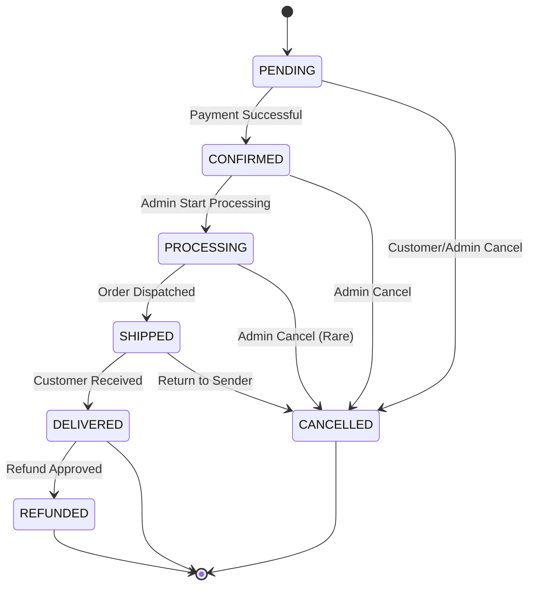

### Transition Rules (Service Layer)

```typescript
class OrderService {
  private ALLOWED_TRANSITIONS: Record<OrderStatus, OrderStatus[]> = {
    [OrderStatus.PENDING]: [OrderStatus.CONFIRMED, OrderStatus.CANCELLED],
    [OrderStatus.CONFIRMED]: [OrderStatus.PROCESSING, OrderStatus.CANCELLED],
    [OrderStatus.PROCESSING]: [OrderStatus.SHIPPED, OrderStatus.CANCELLED],
    [OrderStatus.SHIPPED]: [OrderStatus.DELIVERED, OrderStatus.CANCELLED],
    [OrderStatus.DELIVERED]: [OrderStatus.REFUNDED],
    [OrderStatus.CANCELLED]: [], // Terminal state
    [OrderStatus.REFUNDED]: [], // Terminal state
  };

  async updateOrderStatus(
    orderId: number,
    newStatus: OrderStatus,
    reason?: string
  ) {
    const order = await this.orderRepo.findOne({ where: { id: orderId } });

    // Validate transition
    if (!this.ALLOWED_TRANSITIONS[order.status].includes(newStatus)) {
      throw new BadRequestException(
        `Cannot transition from ${order.status} to ${newStatus}`
      );
    }

    // Additional business rules
    if (
      newStatus === OrderStatus.CONFIRMED &&
      order.paymentStatus !== PaymentStatus.PAID
    ) {
      throw new BadRequestException("Cannot confirm order without payment");
    }

    if (newStatus === OrderStatus.CANCELLED && reason) {
      order.cancelReason = reason;
    }

    // Update status
    order.status = newStatus;
    await this.orderRepo.save(order);

    // Side effects
    await this.handleStatusChange(order, newStatus);

    return order;
  }

  private async handleStatusChange(order: Order, newStatus: OrderStatus) {
    switch (newStatus) {
      case OrderStatus.CONFIRMED:
        // Decrease product stock
        await this.decreaseStock(order);
        // Send confirmation email
        await this.emailService.sendOrderConfirmation(order);
        break;

      case OrderStatus.CANCELLED:
        // Restore product stock
        await this.restoreStock(order);
        // Refund payment if applicable
        if (order.paymentStatus === PaymentStatus.PAID) {
          await this.paymentService.refund(order.id);
        }
        break;

      case OrderStatus.SHIPPED:
        // Send tracking info
        await this.emailService.sendShippingNotification(order);
        break;

      case OrderStatus.DELIVERED:
        // COD: Mark payment as PAID
        if (order.paymentMethod === PaymentMethod.COD) {
          await this.paymentService.markCODPaid(order.id);
        }
        break;
    }
  }
}
```

---

## 📛 NAMING CONVENTIONS

### Database & Code Standards

**1. Table Names**

- Convention: **snake_case** (PostgreSQL standard)
- Examples: `users`, `cart_items`, `order_items`, `product_variants`

**2. Column Names**

- Convention: **camelCase** (TypeORM default)
- Examples: `firstName`, `createdAt`, `shippingAddress`, `isActive`

**3. Enum Values**

- Convention: **UPPER_SNAKE_CASE** for enum values, **PascalCase** for enum names
- Examples:

```typescript
enum OrderStatus {
  PENDING = "pending",
  CONFIRMED = "confirmed",
  PROCESSING = "processing",
}
```

**4. Foreign Keys**

- Convention: `<entity>Id` (camelCase)
- Examples: `userId`, `productId`, `categoryId`, `orderId`

**5. Junction Tables (Many-to-Many)**

- Convention: `<entity1>_<entity2>` (alphabetical order)
- Examples: `role_permissions`, `order_coupons`

**6. Index Names**

- Convention: `idx_<table>_<column1>_<column2>`
- Examples: `idx_products_category_active`, `idx_users_email`

**TypeORM Configuration:**

```typescript
// src/config/database.config.ts
export const typeOrmConfig: TypeOrmModuleOptions = {
  type: "postgres",
  // ...
  namingStrategy: new SnakeNamingStrategy(), // Tables in snake_case
  entities: [__dirname + "/../**/*.entity{.ts,.js}"],
  // Columns remain camelCase by default
};
```

---

## 📖 GLOSSARY

Các thuật ngữ database và e-commerce quan trọng.

### 🔑 Database Terms

**ACID**

- **Atomicity**: Transaction là all-or-nothing (toàn bộ thành công hoặc rollback)
- **Consistency**: Data luôn ở trạng thái valid (constraints được đảm bảo)
- **Isolation**: Transactions không ảnh hưởng lẫn nhau
- **Durability**: Sau khi commit, data được lưu vĩnh viễn

**Cascade Delete**

- Khi parent record bị xóa, tất cả child records tự động xóa theo
- Example: Xóa `Cart` → Tất cả `CartItem` trong cart bị xóa

**Composite Index**

- Index trên 2+ columns
- Example: `INDEX(categoryId, isActive)` → Fast cho query WHERE categoryId=X AND isActive=true

**Constraint**

- Rule để đảm bảo data integrity
- Types: PRIMARY KEY, FOREIGN KEY, UNIQUE, CHECK, NOT NULL

**Denormalization**

- Cố ý duplicate data để tăng performance (trade-off với normalization)
- Example: Lưu `User.orderCount` thay vì `COUNT(*)` mỗi lần query

**Entity**

- Đối tượng có identity riêng (User, Product, Order)
- Tương ứng với 1 table trong database

**ERD (Entity Relationship Diagram)**

- Sơ đồ mô tả entities và relationships
- Hiển thị cardinality (1:1, 1:N, N:N)

**Foreign Key (FK)**

- Column tham chiếu đến Primary Key của table khác
- Đảm bảo referential integrity (không có orphan records)

**Full-Text Search**

- Tìm kiếm theo từ khóa trong text fields
- PostgreSQL: pg_trgm extension với GIN index

**GIN Index (Generalized Inverted Index)**

- Index type cho full-text search, JSON, arrays
- Slower to update, faster to search

**Index**

- Cấu trúc dữ liệu giúp tìm kiếm nhanh (như mục lục sách)
- Trade-off: Tăng tốc SELECT, chậm INSERT/UPDATE

**Junction Table**

- Table trung gian cho Many-to-Many relationship
- Example: `OrderCoupon` kết nối `Order` và `Coupon`

**Materialized View**

- View lưu trữ kết quả query (pre-computed)
- Phải REFRESH định kỳ, trade-off giữa freshness và performance

**Migration**

- Script thay đổi database schema (add/remove tables, columns)
- Version control cho database structure

**N+1 Query Problem**

- 1 query lấy list, rồi N queries lấy related data
- Solution: Eager loading (JOIN) hoặc DataLoader (batching)

**Normalization**

- Process loại bỏ redundancy và anomalies
- Levels: 1NF (atomic), 2NF (no partial dependency), 3NF (no transitive dependency)

**ORM (Object-Relational Mapping)**

- Tool map objects (TypeScript class) sang database tables
- Example: TypeORM, Sequelize, Prisma

**Primary Key (PK)**

- Column định danh duy nhất mỗi row
- Must be UNIQUE và NOT NULL

**Read Replica**

- Database copy dùng cho READ queries
- Giảm tải primary database, eventual consistency

**Referential Integrity**

- Foreign Key constraints đảm bảo relationships valid
- Không có orphan records (child without parent)

**Seeding**

- Populate database với default/sample data
- Example: Admin account, default categories

**Sharding**

- Chia database thành nhiều phần (shards) theo key
- Horizontal scaling cho large datasets

**Snapshot**

- Copy data vào thời điểm nhất định (immutable)
- Example: `OrderItem.price` snapshot từ `Product.price`

**Soft Delete**

- Mark record as deleted (deletedAt timestamp) thay vì hard delete
- Có thể restore, giữ historical data

**Transaction**

- Nhóm nhiều operations thành 1 unit (ACID properties)
- All succeed or all rollback

**UUID (Universally Unique Identifier)**

- 128-bit identifier, globally unique
- Format: `550e8400-e29b-41d4-a716-446655440000`

---

### 🛒 E-commerce Terms

**AOV (Average Order Value)**

- Giá trị trung bình mỗi đơn hàng
- Formula: Total Revenue / Number of Orders

**Cart Abandonment**

- User thêm sản phẩm vào giỏ nhưng không checkout
- Typical rate: 60-80%

**COD (Cash on Delivery)**

- Thanh toán khi nhận hàng
- Popular in Vietnam, Đông Nam Á

**Conversion Rate**

- Tỷ lệ visitors thành customers
- Formula: (Orders / Visitors) × 100%

**Fulfillment**

- Process xử lý đơn hàng (pick, pack, ship)

**Inventory**

- Hàng tồn kho (stock)

**RBAC (Role-Based Access Control)**

- Phân quyền dựa trên roles (USER, ADMIN, STAFF)
- Permissions gán cho roles, users có roles

**SKU (Stock Keeping Unit)**

- Mã định danh unique cho mỗi product/variant
- Example: `TSHIRT-001-M-RED`

**Variant**

- Biến thể của product (size, color, etc.)
- Example: iPhone 15 Pro có variants: 128GB, 256GB, 512GB

---

### 🔐 Authentication Terms

**Bcrypt**

- Password hashing algorithm (one-way encryption)
- Cost factor: Số lần hash (10-12 recommended)

**JWT (JSON Web Token)**

- Token format cho authentication
- Structure: Header.Payload.Signature

**OAuth**

- Protocol cho third-party authentication
- Example: Login with Google, Facebook

**Refresh Token**

- Long-lived token để renew access token
- Expire after 7-30 days

**2FA (Two-Factor Authentication)**

- Bảo mật 2 lớp (password + OTP/SMS)
- TOTP: Time-based One-Time Password

---

### 📊 Database Technologies

**PostgreSQL**

- Open-source relational database
- Features: JSONB, full-text search, advanced indexing

**TypeORM**

- ORM cho TypeScript/JavaScript
- Supports: Migrations, repositories, query builder

**Redis**

- In-memory data store
- Use cases: Cache, session storage, pub/sub

**pgAdmin**

- GUI tool cho PostgreSQL
- Database management và query tool

**DataGrip**

- JetBrains database IDE
- Supports multiple database types

---

## 🔗 LEARNING RESOURCES

Tài liệu và khóa học để học sâu hơn về database design.

### 📚 Beginner Level

**Database Fundamentals:**

1. **[Database Design for Beginners](https://www.youtube.com/watch?v=ztHopE5Wnpc)** (YouTube - FreeCodeCamp)

   - 4-hour course covering basics
   - Topics: Tables, relationships, normalization, ER diagrams

2. **[SQL Tutorial](https://www.sqltutorial.org/)**

   - Interactive SQL learning
   - Practice queries online

3. **[PostgreSQL Tutorial](https://www.postgresqltutorial.com/)**
   - Comprehensive PostgreSQL guide
   - From basics to advanced features

**TypeORM Basics:**

4. **[TypeORM Documentation](https://typeorm.io/)**

   - Official docs (bắt đầu từ đây!)
   - Topics: Entities, relationships, migrations

5. **[NestJS Database Guide](https://docs.nestjs.com/techniques/database)**
   - TypeORM integration với NestJS
   - Best practices

---

### 🎓 Intermediate Level

**Database Design Patterns:**

6. **[Database Design Patterns](https://www.amazon.com/Database-Design-Patterns-Scott-Ambler/dp/0321544641)**

   - Book by Scott Ambler
   - Real-world design patterns

7. **[SQL Performance Explained](https://sql-performance-explained.com/)**

   - Book by Markus Winand
   - Index optimization, query tuning

8. **[Use The Index, Luke!](https://use-the-index-luke.com/)**
   - Free online book
   - SQL indexing và tuning

**E-commerce Database Design:**

9. **[Designing Data-Intensive Applications](https://dataintensive.net/)**

   - Book by Martin Kleppmann (MUST READ!)
   - Topics: Replication, partitioning, transactions

10. **[E-commerce Database Schema Examples](https://github.com/topics/ecommerce-database)**
    - GitHub repositories
    - Real-world schemas

---

### 🚀 Advanced Level

**Performance & Scaling:**

11. **[PostgreSQL Performance Optimization](https://www.postgresql.org/docs/current/performance-tips.html)**

    - Official performance tips
    - Query planner, indexes, locks

12. **[High Performance PostgreSQL](https://www.amazon.com/High-Performance-PostgreSQL-Administrators-Developers/dp/1484268261)**

    - Book by Gregory Smith
    - Tuning, monitoring, scaling

13. **[Database Sharding Explained](https://www.digitalocean.com/community/tutorials/understanding-database-sharding)**
    - Horizontal partitioning guide
    - When và how to shard

**Distributed Systems:**

14. **[Designing Distributed Systems](https://www.oreilly.com/library/view/designing-distributed-systems/9781491983638/)**

    - Book by Brendan Burns
    - Patterns for scalable systems

15. **[CAP Theorem Explained](https://www.ibm.com/topics/cap-theorem)**
    - Consistency, Availability, Partition tolerance
    - Trade-offs trong distributed databases

---

### 🎥 Video Courses

**Comprehensive Courses:**

16. **[The Complete Database Design & Modeling Course](https://www.udemy.com/course/database-design/)**

    - Udemy course by Stephane Maarek
    - ER diagrams, normalization, SQL

17. **[PostgreSQL Bootcamp](https://www.udemy.com/course/sql-and-postgresql/)**

    - Udemy course
    - From zero to advanced

18. **[TypeORM Crash Course](https://www.youtube.com/watch?v=Paz0gnODPE0)**
    - YouTube by Ben Awad
    - Quick TypeORM overview

---

### 🛠️ Tools & Utilities

**Database Design Tools:**

19. **[dbdiagram.io](https://dbdiagram.io/)**

    - Online ERD tool
    - Export to SQL, PNG, PDF

20. **[DrawSQL](https://drawsql.app/)**

    - Visual database designer
    - Collaboration features

21. **[QuickDBD](https://www.quickdatabasediagrams.com/)**
    - Quick ERD from text
    - Export to various formats

**PostgreSQL Tools:**

22. **[pgAdmin](https://www.pgadmin.org/)**

    - Free PostgreSQL GUI
    - Query editor, schema browser

23. **[DBeaver](https://dbeaver.io/)**

    - Universal database tool
    - Supports 80+ databases

24. **[Postbird](https://github.com/Paxa/postbird)**
    - Simple PostgreSQL GUI
    - Lightweight alternative to pgAdmin

---

### 📝 Blogs & Articles

**Must-Read Articles:**

25. **[How Shopify Scaled to Millions](https://shopify.engineering/sharding-shopify-postgres)**

    - Database sharding real-world case study

26. **[Amazon's DynamoDB Paper](https://www.allthingsdistributed.com/2007/10/amazons_dynamo.html)**

    - Distributed key-value store design

27. **[Facebook's MySQL at Scale](https://engineering.fb.com/2021/07/22/data-infrastructure/mysql/)**

    - How Facebook manages MySQL clusters

28. **[PostgreSQL vs MySQL Comparison](https://www.postgresqltutorial.com/postgresql-tutorial/postgresql-vs-mysql/)**
    - Choose the right database

---

### 🧪 Practice & Challenges

**Interactive Learning:**

29. **[SQL Zoo](https://sqlzoo.net/)**

    - Interactive SQL tutorials
    - Practice queries online

30. **[HackerRank SQL Challenges](https://www.hackerrank.com/domains/sql)**

    - Gamified SQL learning
    - Easy to hard problems

31. **[LeetCode Database Problems](https://leetcode.com/problemset/database/)**
    - Algorithm-style database questions
    - Interview prep

---

### 🎯 Recommended Learning Path

**Week 1-2: Fundamentals**

- SQL basics (resources #2, #3)
- Database design concepts (resource #1)
- PostgreSQL tutorial (resource #3)

**Week 3-4: TypeORM & NestJS**

- TypeORM docs (resource #4)
- NestJS database guide (resource #5)
- Build simple CRUD app

**Week 5-6: Advanced Design**

- Database design patterns (resource #6)
- E-commerce schemas (resource #10)
- Normalization & relationships

**Week 7-8: Performance**

- SQL performance (resources #7, #8)
- Index optimization (resource #8)
- Query analysis (EXPLAIN ANALYZE)

**Week 9-10: Scaling**

- Designing Data-Intensive Apps (resource #9) - MUST READ!
- Sharding & replication (resource #13)
- Caching strategies (Redis)

**Week 11-12: Real-World Projects**

- Build e-commerce backend
- Implement all 51 entities từ document này
- Load testing & optimization

---

**🎯 Next Steps:**

1. ✅ Review toàn bộ cải tiến với team
2. ✅ Implement Address, Payment, ProductVariant entities
3. ✅ Setup data seeding script
4. ✅ Implement soft delete cho core entities
5. ✅ Implement Order state machine validation
6. 🔄 Proceed to **TASK-00006: Tạo User Entity**

**✍️ Người thực hiện:** [Your Name]  
**📅 Ngày cập nhật:** 2026-01-11  
**✅ Status:** ⏳ In Progress - Enhanced with Critical Improvements

---

**💡 Note:** Document này là **living document** - có thể update khi có business requirements mới hoặc technical constraints. Mọi changes phải được document trong version control commit message.

**🔄 Changelog:**

- **2026-01-11 (v2.0):**
  - ✅ Added Database Design Fundamentals section (Primary Keys, Foreign Keys, Indexes, JSON vs Normalized, Normalization, ACID)
  - ✅ Added System-Level Architecture Overview with module diagrams
  - ✅ Added Business Requirements to Database Mapping với traceability matrix
  - ✅ Added 4 End-to-End Scenarios (Checkout, Price Change, Product Deletion, Order State Machine)
  - ✅ Added Query Performance Analysis với EXPLAIN ANALYZE examples, N+1 solutions, database size projections
  - ✅ Added comprehensive Glossary (80+ terms)
  - ✅ Added Learning Resources với recommended learning path (30+ resources)
  - ✅ Enhanced Payment, Address, ProductVariant entities
  - ✅ Added data seeding strategy, soft delete guidelines, order state machine, naming conventions
