# Consolidated Planning and Implementation Document

Generated from files in: `/Users/thanh.luong/Documents/my_project/nestjs_ex/doc/ecommerce-api-doc/tasks/backup_20260111_231012`

---

## File: TASK-00001-Khởi-tạo-Project-NestJS.md

# ### ✅ TASK 01: Khởi tạo Project NestJS (Perfect Production-Ready Version - January 2026)

> **Task Number:** 01  
> **Priority:** Core  
> **Status:** ⬜ Not Started  
> **Estimated Time:** 1.5-2.5 hours

---

## 🎯 Mục Tiêu

Tạo project NestJS **11.1.x** hoàn toàn production-ready ngay từ đầu: security headers đầy đủ, validation, error handling, path aliases, boilerplate CRUD, pinned dependencies ổn định.

---

## ⚙️ System Requirements

- **Node.js**: v20.x LTS hoặc v22.x LTS
- **npm**: v9+
- **Git**: v2.x+

---

## 📋 Các Bước Thực Hiện Chi Tiết (Final Version - 10/10)

### Step 1: Tạo Project

```bash
npx @nestjs/cli@latest --version  # ~11.x

cd your-workspace
npx @nestjs/cli@latest new ecommerce-api --package-manager npm --strict
cd ecommerce-api
```

### Step 2: Cài Dependencies (Pinned ^ cho patch updates an toàn)

```bash
# Core + ORM + Auth + Validation + Swagger
npm install @nestjs/config@^4.0.0 @nestjs/typeorm@^11.0.0 typeorm@^0.3.20 pg@^8.11.0
npm install @nestjs/jwt@^11.0.0 @nestjs/passport@^11.0.0 passport@^0.7.0 passport-jwt@^4.0.1
npm install bcryptjs@^3.0.0 class-validator@^0.14.0 class-transformer@^0.5.1
npm install @nestjs/swagger@^11.2.0

# Security: Helmet (latest stable Jan 2026: 8.1.0)
npm install helmet@^8.0.0
```

### Step 3: Cài Dev Dependencies & ESLint + Prettier

```bash
npm install -D @types/node @types/passport-jwt @types/bcryptjs
npm install -D eslint@latest prettier@latest eslint-config-prettier eslint-plugin-prettier @typescript-eslint/eslint-plugin @typescript-eslint/parser
```

**.eslintrc.js** (đầy đủ parserOptions):

```js
module.exports = {
  parser: "@typescript-eslint/parser",
  parserOptions: {
    project: "./tsconfig.json",
    tsconfigRootDir: __dirname,
    sourceType: "module",
  },
  extends: ["plugin:@typescript-eslint/recommended", "prettier"],
  plugins: ["@typescript-eslint", "prettier"],
  rules: {
    "prettier/prettier": "error",
  },
};
```

**.prettierrc** (giữ nguyên):

```json
{
  "semi": true,
  "trailingComma": "all",
  "singleQuote": true,
  "printWidth": 80,
  "tabWidth": 2
}
```

### Step 4: Tạo Resources (Boilerplate CRUD đầy đủ)

```bash
npx nest g resource modules/auth --no-spec
npx nest g resource modules/users --no-spec
npx nest g resource modules/products --no-spec
npx nest g resource modules/categories --no-spec
npx nest g resource modules/orders --no-spec
npx nest g resource modules/carts --no-spec
# Answer: REST API → Yes; Generate CRUD → Yes
```

Tạo thư mục shared:

```bash
mkdir -p src/{config,common/{dto,filters,interceptors,pipes,guards},migrations}
```

### Step 5: TypeScript Path Aliases

Thêm vào **tsconfig.json** → "compilerOptions":

```json
{
  "compilerOptions": {
    "baseUrl": "./",
    "paths": {
      "@config/*": ["src/config/*"],
      "@common/*": ["src/common/*"],
      "@modules/*": ["src/modules/*"]
    }
  }
}
```

### Step 6: Global Setup + Helmet + Exception Filter (main.ts)

Tạo **src/common/filters/http-exception.filter.ts** (giữ nguyên như trước).

Sửa **src/main.ts**:

```ts
import { NestFactory } from "@nestjs/core";
import { AppModule } from "./app.module";
import { DocumentBuilder, SwaggerModule } from "@nestjs/swagger";
import { ValidationPipe } from "@nestjs/common";
import { HttpExceptionFilter } from "@common/filters/http-exception.filter";
import helmet from "helmet";

async function bootstrap() {
  const app = await NestFactory.create(AppModule);

  // Security: Helmet (set HTTP headers)
  app.use(helmet());

  // Global Validation Pipe
  app.useGlobalPipes(
    new ValidationPipe({
      whitelist: true,
      forbidNonWhitelisted: true,
      transform: true,
    })
  );

  // Global Exception Filter
  app.useGlobalFilters(new HttpExceptionFilter());

  // CORS
  app.enableCors({
    origin: process.env.CORS_ORIGIN?.split(",") || "*",
    credentials: true,
  });

  // Swagger
  const config = new DocumentBuilder()
    .setTitle("Ecommerce API")
    .setDescription("Production-ready ecommerce backend")
    .setVersion("1.0")
    .addBearerAuth()
    .build();
  const document = SwaggerModule.createDocument(app, config);
  SwaggerModule.setup("api", app, document);

  await app.listen(process.env.PORT || 3000);
}
bootstrap();
```

### Step 7: .env.example (Bổ sung đầy đủ)

```bash
echo "# Database
DB_HOST=localhost
DB_PORT=5432
DB_USERNAME=postgres
DB_PASSWORD=your_password
DB_DATABASE=ecommerce_db

# JWT
JWT_SECRET=super-secret-change-in-production
JWT_EXPIRATION=1d

# CORS
CORS_ORIGIN=http://localhost:3000,http://localhost:5173

# Rate Limiting (for future ThrottlerModule)
THROTTLE_TTL=60
THROTTLE_LIMIT=100

# App
PORT=3000
NODE_ENV=development" > .env.example

cp .env.example .env  # Mac/Linux
# copy .env.example .env  # Windows
```

### Step 8: Git Commit

```bash
git add .
git commit -m "chore: perfect initial setup with helmet security headers, validation, CORS, exception filter, path aliases"
```

### Step 9: Verification (Bổ sung test exception filter)

```bash
npm run build        # No errors
npm run lint         # No errors
npm run start:dev

# Test basic
curl http://localhost:3000          # → Hello World!

# Test Swagger
curl http://localhost:3000/api-json  # → OpenAPI JSON

# Test Exception Filter (route không tồn tại)
curl -i http://localhost:3000/not-exist
# → HTTP/1.1 404 Not Found
# → JSON: { "statusCode": 404, "timestamp": "...", "path": "/not-exist", "message": "Not Found" }
```

---

## ✅ Kết Quả Mong Đợi (Perfect 10/10)

- NestJS 11.1.x với tất cả best practices ngay từ đầu
- **Helmet** bảo vệ security headers (XSS, clickjacking, etc.)
- ValidationPipe + Exception Filter + CORS + Path Aliases
- Boilerplate CRUD sẵn sàng phát triển tiếp
- Dependencies pinned an toàn (^)
- Swagger + verification đầy đủ

---

## 📝 Implementation Checklist

- [x] Project created --strict
- [ ] Dependencies + Helmet installed
- [ ] ESLint đầy đủ parserOptions
- [ ] nest g resource tất cả modules
- [ ] Path aliases tsconfig.json
- [ ] main.ts: helmet() + ValidationPipe + Exception Filter + CORS
- [ ] .env.example đầy đủ
- [ ] Git commit
- [ ] Verification: build/lint/run + test 404 JSON error

**Actual Time:** ** hours ** minutes

**Notes:**

```

---

🎉 **Chúc mừng!** Phiên bản này giờ đã đạt **10/10** hoàn hảo theo đánh giá của bạn.

- Đã thêm **Helmet** với latest stable (^8.0.0) → bảo vệ security headers ngay từ đầu.
- Bổ sung test exception filter bằng curl 404 → thấy response JSON chuẩn.
- Giữ pinning ^ để an toàn, cho phép patch updates tự động.

Project này giờ thực sự **production-ready** 100% từ task đầu tiên. Bạn có thể yên tâm dùng làm foundation cho toàn bộ e-commerce API.


```


---

## File: TASK-00002-Setup-Environment-Configuration.md

# ### ✅ TASK 02: Setup Environment & Configuration

> **Task Number:** 02  
> **Priority:** Core  
> **Status:** ⬜ Not Started  
> **Dependencies:** Task 01 (phải hoàn thành trước)

---

## 🎯 **Mục tiêu**

Cấu hình **ConfigModule** với validation, setup **TypeORM DataSource**, và tạo **Health Check** endpoint để verify database connection.

**⚠️ Lưu ý:** Task 01 đã tạo `.env` và `.env.example` rồi. Task này sẽ **extend** và **validate** các env vars đó.

---

## 📋 **Các bước thực hiện**

### **STEP 1: Install Dependencies**

```bash
npm install joi
npm install --save-dev @types/node
```

**Giải thích:**

- `joi`: Validation schema cho environment variables
- `@types/node`: Type definitions cho process.env

---

### **STEP 2: Verify và Update .env File**

**File:** `ecommerce-api/.env`

```env
# App
NODE_ENV=development
PORT=3000
API_PREFIX=api/v1

# Database
DB_HOST=localhost
DB_PORT=5432
DB_USERNAME=postgres
DB_PASSWORD=your_password
DB_DATABASE=ecommerce_db

# JWT
JWT_SECRET=your-super-secret-jwt-key-min-32-characters-long
JWT_EXPIRATION=7d
JWT_REFRESH_EXPIRATION=30d

# CORS
CORS_ORIGIN=http://localhost:3000,http://localhost:5173

# Rate Limiting
THROTTLE_TTL=60
THROTTLE_LIMIT=100

# Upload
MAX_FILE_SIZE=5242880
UPLOAD_DEST=./uploads

# Pagination
DEFAULT_PAGE_SIZE=10
MAX_PAGE_SIZE=100
```

**⚠️ Security Notes:**

- `JWT_SECRET` phải **ít nhất 32 ký tự**
- Không commit file `.env` vào git
- Production phải dùng secrets manager (AWS Secrets, Azure Key Vault, etc.)

---

### **STEP 3: Create Environment Validation Schema**

**File:** `src/config/env.validation.ts`

```typescript
import * as Joi from "joi";

export const validationSchema = Joi.object({
  // App
  NODE_ENV: Joi.string()
    .valid("development", "production", "test", "staging")
    .default("development"),
  PORT: Joi.number().default(3000),
  API_PREFIX: Joi.string().default("api/v1"),

  // Database
  DB_HOST: Joi.string().required(),
  DB_PORT: Joi.number().default(5432),
  DB_USERNAME: Joi.string().required(),
  DB_PASSWORD: Joi.string().required(),
  DB_DATABASE: Joi.string().required(),

  // JWT
  JWT_SECRET: Joi.string().min(32).required().messages({
    "string.min": "JWT_SECRET must be at least 32 characters for security",
    "any.required": "JWT_SECRET is required",
  }),
  JWT_EXPIRATION: Joi.string()
    .pattern(/^\d+[smhd]$/)
    .default("7d")
    .messages({
      "string.pattern.base":
        "JWT_EXPIRATION must be in format: 1d, 7d, 24h, 60m, etc.",
    }),
  JWT_REFRESH_EXPIRATION: Joi.string()
    .pattern(/^\d+[smhd]$/)
    .default("30d"),

  // CORS
  CORS_ORIGIN: Joi.string().default("http://localhost:3000"),

  // Rate Limiting
  THROTTLE_TTL: Joi.number().default(60),
  THROTTLE_LIMIT: Joi.number().default(100),

  // Upload
  MAX_FILE_SIZE: Joi.number().default(5242880), // 5MB
  UPLOAD_DEST: Joi.string().default("./uploads"),

  // Pagination
  DEFAULT_PAGE_SIZE: Joi.number().default(10),
  MAX_PAGE_SIZE: Joi.number().default(100),
});
```

**Tại sao cần validation:**

- ✅ App crash sớm nếu thiếu env vars → tránh runtime errors
- ✅ Type safety và default values
- ✅ Clear error messages
- ✅ Documentation cho environment variables

---

### **STEP 4: Create TypeORM Configuration**

**File:** `src/config/typeorm.config.ts`

```typescript
import { DataSource, DataSourceOptions } from "typeorm";
import { ConfigService } from "@nestjs/config";
import { config } from "dotenv";

// Load .env for TypeORM CLI
config();

/**
 * Get TypeORM configuration for NestJS runtime
 */
export const getTypeOrmConfig = (
  configService: ConfigService
): DataSourceOptions => ({
  type: "postgres",
  host: configService.get("DB_HOST"),
  port: configService.get("DB_PORT"),
  username: configService.get("DB_USERNAME"),
  password: configService.get("DB_PASSWORD"),
  database: configService.get("DB_DATABASE"),
  entities: [__dirname + "/../**/*.entity{.ts,.js}"],
  migrations: [__dirname + "/../migrations/*{.ts,.js}"],
  synchronize: configService.get("NODE_ENV") === "development",
  logging: configService.get("NODE_ENV") === "development",
  ssl:
    configService.get("NODE_ENV") === "production"
      ? { rejectUnauthorized: false }
      : false,
});

/**
 * DataSource for TypeORM CLI (migrations)
 */
export default new DataSource({
  type: "postgres",
  host: process.env.DB_HOST,
  port: parseInt(process.env.DB_PORT || "5432"),
  username: process.env.DB_USERNAME,
  password: process.env.DB_PASSWORD,
  database: process.env.DB_DATABASE,
  entities: [__dirname + "/../**/*.entity{.ts,.js}"],
  migrations: [__dirname + "/../migrations/*{.ts,.js}"],
  synchronize: false, // Always false for migrations
  logging: process.env.NODE_ENV === "development",
});
```

**Giải thích:**

- `getTypeOrmConfig()`: Dùng cho NestJS runtime với ConfigService
- `export default new DataSource()`: Dùng cho TypeORM CLI commands
- `synchronize: false` trong DataSource → phải dùng migrations
- SSL enabled cho production

---

### **STEP 5: Update AppModule**

**File:** `src/app.module.ts`

```typescript
import { Module } from "@nestjs/common";
import { ConfigModule, ConfigService } from "@nestjs/config";
import { TypeOrmModule } from "@nestjs/typeorm";
import { AppController } from "./app.controller";
import { AppService } from "./app.service";
import { validationSchema } from "./config/env.validation";
import { getTypeOrmConfig } from "./config/typeorm.config";
import { HealthModule } from "./health/health.module";

@Module({
  imports: [
    // Config Module - Global configuration
    ConfigModule.forRoot({
      isGlobal: true,
      envFilePath: [
        `.env.${process.env.NODE_ENV}`, // Specific environment
        ".env", // Fallback
      ],
      validationSchema,
      validationOptions: {
        abortEarly: true, // Stop on first error
      },
    }),

    // TypeORM Module - Database connection
    TypeOrmModule.forRootAsync({
      imports: [ConfigModule],
      inject: [ConfigService],
      useFactory: (configService: ConfigService) =>
        getTypeOrmConfig(configService),
    }),

    // Health Check Module
    HealthModule,
  ],
  controllers: [AppController],
  providers: [AppService],
})
export class AppModule {}
```

**Tại sao dùng `forRootAsync`:**

- ✅ Inject ConfigService vào TypeORM config
- ✅ Async initialization
- ✅ Clean separation of concerns

---

### **STEP 6: Create Health Check Module**

**File:** `src/health/health.module.ts`

```typescript
import { Module } from "@nestjs/common";
import { HealthController } from "./health.controller";

@Module({
  controllers: [HealthController],
})
export class HealthModule {}
```

**File:** `src/health/health.controller.ts`

```typescript
import { Controller, Get } from "@nestjs/common";
import { ApiTags, ApiOperation, ApiResponse } from "@nestjs/swagger";
import { DataSource } from "typeorm";

@ApiTags("Health")
@Controller("health")
export class HealthController {
  constructor(private readonly dataSource: DataSource) {}

  @Get()
  @ApiOperation({ summary: "Health check endpoint" })
  @ApiResponse({
    status: 200,
    description: "Service is healthy",
    schema: {
      example: {
        status: "ok",
        timestamp: "2026-01-10T10:30:00.000Z",
        database: "connected",
        uptime: 123.456,
      },
    },
  })
  async check() {
    try {
      const isConnected = this.dataSource.isInitialized;

      return {
        status: isConnected ? "ok" : "error",
        timestamp: new Date().toISOString(),
        database: isConnected ? "connected" : "disconnected",
        uptime: process.uptime(),
        environment: process.env.NODE_ENV,
      };
    } catch (error) {
      return {
        status: "error",
        timestamp: new Date().toISOString(),
        database: "disconnected",
        message: error.message,
      };
    }
  }
}
```

---

### **STEP 7: Add Migration Scripts to package.json**

**File:** `package.json`

```json
{
  "scripts": {
    "build": "nest build",
    "start": "nest start",
    "start:dev": "nest start --watch",
    "start:prod": "node dist/main",

    "typeorm": "typeorm-ts-node-commonjs",
    "migration:create": "typeorm migration:create src/migrations/Migration",
    "migration:generate": "npm run typeorm -- migration:generate src/migrations/Migration -d src/config/typeorm.config.ts",
    "migration:run": "npm run typeorm -- migration:run -d src/config/typeorm.config.ts",
    "migration:revert": "npm run typeorm -- migration:revert -d src/config/typeorm.config.ts",
    "migration:show": "npm run typeorm -- migration:show -d src/config/typeorm.config.ts"
  }
}
```

**Giải thích scripts:**

- `migration:create`: Tạo migration file rỗng
- `migration:generate`: Tự động generate từ entity changes
- `migration:run`: Chạy pending migrations
- `migration:revert`: Rollback migration cuối cùng
- `migration:show`: Xem trạng thái migrations

---

### **STEP 8: Update main.ts**

**File:** `src/main.ts`

```typescript
import { NestFactory } from "@nestjs/core";
import { ValidationPipe } from "@nestjs/common";
import { ConfigService } from "@nestjs/config";
import { AppModule } from "./app.module";

async function bootstrap() {
  const app = await NestFactory.create(AppModule);

  // Get ConfigService
  const configService = app.get(ConfigService);

  // Global prefix
  app.setGlobalPrefix(configService.get("API_PREFIX"));

  // Global validation pipe
  app.useGlobalPipes(
    new ValidationPipe({
      whitelist: true,
      forbidNonWhitelisted: true,
      transform: true,
    })
  );

  // CORS
  app.enableCors({
    origin: configService.get("CORS_ORIGIN").split(","),
    credentials: true,
  });

  const port = configService.get("PORT");
  await app.listen(port);

  console.log(
    `🚀 Application is running on: http://localhost:${port}/${configService.get(
      "API_PREFIX"
    )}`
  );
  console.log(`🏥 Health check: http://localhost:${port}/health`);
}
bootstrap();
```

---

## ✅ **Verification & Testing**

### **Test 1: Successful Startup**

```bash
# Start application
npm run start:dev

# Expected output:
# ✅ ConfigModule loaded successfully
# ✅ Database connected successfully
# 🚀 Application is running on: http://localhost:3000/api/v1
# 🏥 Health check: http://localhost:3000/health
```

---

### **Test 2: Health Check Endpoint**

```bash
# Test health endpoint
curl http://localhost:3000/health

# Expected response:
{
  "status": "ok",
  "timestamp": "2026-01-10T10:30:00.000Z",
  "database": "connected",
  "uptime": 123.456,
  "environment": "development"
}
```

---

### **Test 3: Missing Environment Variable**

```bash
# 1. Temporarily remove DB_HOST from .env
# 2. Start application
npm run start:dev

# Expected output:
# ❌ Error: "DB_HOST" is required
# ❌ Application failed to start
```

---

### **Test 4: Invalid JWT_SECRET Length**

```bash
# 1. Set JWT_SECRET=short in .env (< 32 chars)
# 2. Start application
npm run start:dev

# Expected output:
# ❌ Error: JWT_SECRET must be at least 32 characters for security
# ❌ Application failed to start
```

---

### **Test 5: TypeORM CLI Commands**

```bash
# Show migration status
npm run migration:show

# Expected output:
# [X] Migration1234567890-Initial (ran)
# [ ] Migration1234567891-AddUsers (pending)
```

---

## 📝 **Implementation Checklist**

### **Pre-requisites**

- [x] Task 01 completed (project initialized with .env files)
- [ ] PostgreSQL installed and running
- [ ] Review TypeORM documentation

### **Configuration Setup**

- [ ] Install Joi dependency
- [ ] Create `src/config/env.validation.ts` with full validation schema
- [ ] Create `src/config/typeorm.config.ts` with both NestJS and CLI configs
- [ ] Update `.env` with all required variables
- [ ] Verify `.env` in `.gitignore`

### **AppModule Integration**

- [ ] Import ConfigModule with validation
- [ ] Setup TypeOrmModule.forRootAsync
- [ ] Test application starts successfully
- [ ] Verify no validation errors

### **Health Check**

- [ ] Create `src/health/health.module.ts`
- [ ] Create `src/health/health.controller.ts`
- [ ] Add Swagger documentation
- [ ] Test health endpoint returns correct data

### **Migration Scripts**

- [ ] Add all migration scripts to package.json
- [ ] Test `migration:create` command
- [ ] Test `migration:show` command
- [ ] Document migration workflow

### **Testing**

- [ ] Test 1: Successful startup ✅
- [ ] Test 2: Health check endpoint ✅
- [ ] Test 3: Missing env variable validation ✅
- [ ] Test 4: Invalid JWT_SECRET validation ✅
- [ ] Test 5: TypeORM CLI commands ✅

### **Documentation**

- [ ] Update README.md with environment setup
- [ ] Document all environment variables
- [ ] Add troubleshooting section

---

## 🐛 **Common Issues & Solutions**

### **Issue 1: "Cannot find module 'joi'"**

```bash
# Solution:
npm install joi
```

---

### **Issue 2: TypeORM CLI not working**

```bash
# Error: typeorm-ts-node-commonjs not found

# Solution:
npm install --save-dev ts-node
npm install --save-dev @types/node
```

---

### **Issue 3: Database connection failed**

```bash
# Error: ECONNREFUSED 127.0.0.1:5432

# Solution:
# 1. Check PostgreSQL is running:
sudo systemctl status postgresql

# 2. Check credentials in .env
# 3. Test connection:
psql -h localhost -U postgres -d ecommerce_db
```

---

### **Issue 4: Validation error on startup**

```bash
# Error: "DB_HOST" is required

# Solution:
# 1. Copy .env.example to .env
cp .env.example .env

# 2. Fill in all required values
# 3. Check for typos in variable names
```

---

## 📚 **Additional Resources**

- [NestJS ConfigModule Documentation](https://docs.nestjs.com/techniques/configuration)
- [TypeORM DataSource API](https://typeorm.io/data-source)
- [Joi Validation Documentation](https://joi.dev/api/)
- [NestJS Environment Variables Best Practices](https://docs.nestjs.com/techniques/configuration#custom-env-file-path)

---

## 🎯 **Post-Completion**

- [ ] Update task status to ✅ Done
- [ ] Test all 5 verification scenarios
- [ ] Commit changes with message: `feat: setup ConfigModule with validation and TypeORM`
- [ ] Document any deviations from plan
- [ ] Update Task 03 dependencies

---

## ⏱️ **Time Tracking**

- **Estimated:** 2 hours
- **Actual:** \_\_\_ hours

---

## 📊 **Task Completion Criteria**

✅ ConfigModule với Joi validation hoạt động  
✅ TypeORM DataSource configured cho cả runtime và CLI  
✅ Health check endpoint trả về database status  
✅ Migration scripts trong package.json  
✅ Tất cả 5 test cases pass  
✅ Application start thành công với valid .env  
✅ Application crash với clear error khi thiếu env vars

---

## 🔗 **Related Tasks**

- **Task 01**: Khởi tạo Project (prerequisite)
- **Task 03**: Setup Database PostgreSQL (next)
- **Task 04**: Kết nối NestJS với PostgreSQL (depends on this)
- **Task 11**: Generate & Run Migrations (uses migration scripts from this task)


---

## File: TASK-00003-Setup-Database-PostgreSQL.md

# ### ✅ TASK 03: Setup Database PostgreSQL

> **Task Number:** 03  
> **Priority:** Core  
> **Status:** ✅ In Progress  
> **Dependencies:** None

---

## 🎯 **Mục tiêu**

Cài đặt và khởi động **PostgreSQL database server** bằng Docker Compose.

**✅ Đã có sẵn trong project:**

- TypeORM configuration ([typeorm.config.ts](../../ecommerce-api/src/config/typeorm.config.ts))
- Environment files (.env, .env.example, .env.test)
- Health check endpoint ([health.controller.ts](../../ecommerce-api/src/health/health.controller.ts))
- Migration scripts (package.json)
- Database connection trong AppModule

**📦 Cần thực hiện:**

- ✅ Tạo docker-compose.yml
- ✅ Tạo init.sql để setup extensions
- ✅ Start PostgreSQL container
- ✅ Verify connection

---

## 📋 **Các bước thực hiện**

### **STEP 1: Create docker-compose.yml**

**File:** `ecommerce-api/docker-compose.yml`

```yaml
version: "3.8"

services:
  postgres:
    image: postgres:16-alpine
    container_name: ecommerce-postgres
    restart: unless-stopped
    environment:
      POSTGRES_USER: postgres
      POSTGRES_PASSWORD: root123
      POSTGRES_DB: ecommerce_db
      PGDATA: /var/lib/postgresql/data/pgdata
    ports:
      - "5432:5432"
    volumes:
      - postgres_data:/var/lib/postgresql/data
      - ./docker/postgres/init.sql:/docker-entrypoint-initdb.d/init.sql
    healthcheck:
      test: ["CMD-SHELL", "pg_isready -U postgres"]
      interval: 10s
      timeout: 5s
      retries: 5
    networks:
      - ecommerce-network

  pgadmin:
    image: dpage/pgadmin4:latest
    container_name: ecommerce-pgadmin
    restart: unless-stopped
    environment:
      PGADMIN_DEFAULT_EMAIL: admin@example.com
      PGADMIN_DEFAULT_PASSWORD: admin123
      PGADMIN_CONFIG_SERVER_MODE: "False"
    ports:
      - "5050:80"
    volumes:
      - pgadmin_data:/var/lib/pgadmin
    depends_on:
      postgres:
        condition: service_healthy
    networks:
      - ecommerce-network
    profiles:
      - tools # Optional: only start when explicitly requested

volumes:
  postgres_data:
    driver: local
  pgadmin_data:
    driver: local

networks:
  ecommerce-network:
    driver: bridge
```

**Tại sao dùng Docker Compose?**

---

### \*\*STEP 2: Create Initialization Script

```sql
-- Enable UUID extension for primary keys
CREATE EXTENSION IF NOT EXISTS "uuid-ossp";

-- Enable trigram extension for text search
CREATE EXTENSION IF NOT EXISTS "pg_trgm";

-- Enable pgcrypto for encryption functions
CREATE EXTENSION IF NOT EXISTS "pgcrypto";

-- Create test database for E2E testing
CREATE DATABASE ecommerce_test;

-- Grant all privileges
GRANT ALL PRIVILEGES ON DATABASE ecommerce_db TO postgres;
GRANT ALL PRIVILEGES ON DATABASE ecommerce_test TO postgres;

-- Set default timezone to UTC
ALTER DATABASE ecommerce_db SET timezone TO 'UTC';
ALTER DATABASE ecommerce_test SET timezone TO 'UTC';

-- Log successful initialization
SELECT 'Database initialization completed successfully' AS status;
```

**Note:** Init scripts chỉ chạy lần đầu khi database được tạo. Để re-run, cần `docker-compose down -v`.

---

### **STEP 3: Start PostgreSQL Container**

```bash
# Start only PostgreSQL (without pgAdmin)
docker-compose up -d postgres

# Start everything including pgAdmin
docker-compose --profile tools up -d

# Check container status
docker-compose ps

# View logs
docker-compose logs -f postgres

# View initialization logs
docker-compose logs postgres | grep "init.sql"

# Stop services
docker-compose down

# Stop and remove volumes (fresh start)
docker-compose down -v
```

---

## ✅ **Verification & Testing**

### **Test 1: Container Health Check (Docker)**

```bash
# Check container status
docker-compose ps

# Expected output:
NAME                  COMMAND                  SERVICE    STATUS          PORTS
ecommerce-postgres    "docker-entrypoint..."   postgres   Up (healthy)    0.0.0.0:5432->5432/tcp
```

**Pass criteria:** Status shows `Up (healthy)` - healthcheck passed

---

### **Test 2: Direct Database Connection**

```bash
# Using Docker exec
docker exec -it ecommerce-postgres psql -U postgres -d ecommerce_db -c "SELECT version();"

# Using psql from host (Docker or native)
psql -h localhost -U postgres -d ecommerce_db -c "SELECT version();"
# Password: root123

# Expected output:
                                                version
------------------------------------------------------------------------------------------------------
 PostgreSQL 16.x on x86_64-pc-linux-musl, compiled by gcc (Alpine 13.2.1) 64-bit
(1 row)
```

**Pass criteria:** Connection succeeds và returns PostgreSQL version

---

### **Test 3: Database and Extensions Verification**

```bash
# List all databases
psql -h localhost -U postgres -c "\l"

# Check installed extensions
psql -h localhost -U postgres -d ecommerce_db -c "SELECT extname, extversion FROM pg_extension;"

# Expected output:
   extname   | extversion
-------------+------------
 plpgsql     | 1.0
 uuid-ossp   | 1.1
 pg_trgm     | 1.6
 pgcrypto    | 1.3
```

**Pass criteria:**

- Database `ecommerce_db` exists
- Extensions `uuid-ossp`, `pg_trgm`, `pgcrypto` installed

---

### **Test 4: Connection Readiness Check**

```bash
# Check if PostgreSQL is ready to accept connections
pg_isready -h localhost -p 5432 -U postgres

# Expected output:
localhost:5432 - accepting connections

# Docker alternative
docker exec ecommerce-postgres pg_isready -U postgres

# Expected output:
/var/run/postgresql:5432 - accepting connections
```

**Pass criteria:** Returns "accepting connections"

---

### **Test 5: PgAdmin Web Interface (Docker with tools profile)**

```bash
# Start pgAdmin (if not already started)
docker-compose --profile tools up -d pgadmin

# Open browser: http://localhost:5050
```

**Steps to test:**

1. **Login:**

   - Email: `admin@example.com`
   - Password: `admin123`

2. **Add Server:**

   - Right-click "Servers" → Register → Server
   - **General Tab:**
     - Name: `Ecommerce Local`
   - **Connection Tab:**
     - Host: `postgres` (Docker network name)
     - Port: `5432`
     - Maintenance database: `ecommerce_db`
     - Username: `postgres`
     - Password: `root123`
   - Click "Save"

3. **Browse Database:**
   - Expand: Servers → Ecommerce Local → Databases → ecommerce_db
   - Expand: Schemas → public → Extensions
   - Should see: uuid-ossp, pg_trgm, pgcrypto

**Pass criteria:** Successfully connected và can browse database structure

---

## 🐛 **Common Issues & Solutions**

### **Issue 1: Port 5432 Already in Use**

```
Error Message:
ERROR: for postgres  Cannot start service postgres: driver failed programming
external connectivity on endpoint ecommerce-postgres: Bind for 0.0.0.0:5432
failed: port is already allocated
```

**Root Cause:** Another PostgreSQL instance đã chạy trên port 5432

**Solutions:**

```bash
# Option 1: Stop existing PostgreSQL service

# macOS
brew services stop postgresql
brew services stop postgresql@16

# Linux
sudo systemctl stop postgresql

# Windows (PowerShell as Admin)
Stop-Service -Name postgresql-x64-16

# Then restart Docker containers
docker-compose down
docker-compose up -d

# Option 2: Change Docker port in docker-compose.yml
# Edit docker-compose.yml:
ports:
  - '5432:5432'  # Use port 5432 on host

# Update .env:
DB_PORT=5432

# Restart
docker-compose down
docker-compose up -d
```

**Verification:**

```bash
docker-compose ps  # Should show "Up (healthy)"
psql -h localhost -p 5432 -U postgres -d ecommerce_db -c "SELECT 1;"
```

---

### **Issue 2: Container Starts But Immediately Crashes**

```
Error Message:
ecommerce-postgres exited with code 1
```

**Root Cause:** Corrupted volume, incompatible data, hoặc insufficient permissions

**Solutions:**

```bash
# Step 1: Check logs for specific error
docker-compose logs postgres

# Common errors:
# - "FATAL: data directory has wrong ownership"
# - "PANIC: could not write to file"
# - "initdb: error: could not create directory"

# Step 2: Complete fresh start - remove all volumes
docker-compose down -v

# Step 3: Verify volumes are removed
docker volume ls | grep ecommerce

# Step 4: Start fresh
docker-compose up -d

# Step 5: Watch startup logs
docker-compose logs -f postgres
```

**Advanced solution - check disk space:**

```bash
# Check available disk space
df -h  # Linux/Mac
Get-PSDrive  # Windows PowerShell

# If low on space, clean Docker
docker system prune -a --volumes
```

**Verification:**

```bash
docker-compose ps  # Should show "Up (healthy)"
docker exec ecommerce-postgres psql -U postgres -c "SELECT 1;"
```

---

### **Issue 3: Cannot Connect from Host Machine**

```
Error Message:
psql: error: connection to server at "localhost" (127.0.0.1), port 5432 failed:
Connection refused
```

**Root Cause:** Network configuration issues, firewall, hoặc wrong host

**Solutions:**

```bash
# Step 1: Verify container is running and healthy
docker-compose ps
# Should show "Up (healthy)"

# Step 2: Check if port is exposed
docker port ecommerce-postgres
# Expected: 5432/tcp -> 0.0.0.0:5432

# Step 3: Test from inside container first
docker exec -it ecommerce-postgres psql -U postgres -d ecommerce_db -c "SELECT 1;"
# If this works, problem is host → container connection

# Step 4: For macOS/Windows Docker Desktop users
# Edit .env to use host.docker.internal:
DB_HOST=host.docker.internal  # Instead of localhost

# OR add to /etc/hosts (Mac/Linux) or C:\Windows\System32\drivers\etc\hosts (Windows):
127.0.0.1  postgres

# Step 5: Check Docker network
docker network inspect ecommerce-api_ecommerce-network

# Step 6: Restart Docker Desktop (nuclear option)
# Docker Desktop → Troubleshoot → Restart
```

**Verification:**

```bash
pg_isready -h localhost -p 5432 -U postgres
psql -h localhost -U postgres -d ecommerce_db -c "SELECT current_database();"
```

---

### **Issue 4: Init Script (init.sql) Not Running**

```
Problem:
- Extensions not installed
- Test database (ecommerce_test) not created
- Custom initialization not executed
```

**Root Cause:** Init scripts chỉ chạy lần đầu khi database được created

**Solutions:**

```bash
# Step 1: Check if script was executed
docker-compose logs postgres | grep "init.sql"
docker-compose logs postgres | grep "Database initialization completed"

# Step 2: If no logs, script didn't run (database already exists)
# Complete fresh start:
docker-compose down -v
docker volume rm ecommerce-api_postgres_data 2>/dev/null || true
docker-compose up -d

# Step 3: Watch initialization
docker-compose logs -f postgres

# Step 4: Verify file exists and is mounted
docker exec ecommerce-postgres ls -la /docker-entrypoint-initdb.d/
# Should show: init.sql

# Step 5: If script has errors, run manually
docker exec -i ecommerce-postgres psql -U postgres -d ecommerce_db < docker/postgres/init.sql

# Step 6: Check for SQL syntax errors
cat docker/postgres/init.sql | docker exec -i ecommerce-postgres psql -U postgres -d ecommerce_db
```

**Verification:**

```bash
# Check extensions
psql -h localhost -U postgres -d ecommerce_db -c "SELECT extname FROM pg_extension WHERE extname IN ('uuid-ossp', 'pg_trgm', 'pgcrypto');"
# Should return 3 rows

# Check test database
psql -h localhost -U postgres -c "\l" | grep ecommerce_test
```

---

### **Issue 5: Permission Denied on Data Volume**

```
Error Message:
FATAL: data directory "/var/lib/postgresql/data/pgdata" has wrong ownership
HINT: The server must be started by the user that owns the data directory.
```

**Root Cause:** Volume ownership mismatch hoặc SELinux issues

**Solutions:**

```bash
# Step 1: Complete cleanup
docker-compose down
docker volume rm ecommerce-api_postgres_data

# Step 2: Recreate volume with proper permissions
docker volume create ecommerce-api_postgres_data

# Step 3: Start container
docker-compose up -d

# Alternative: Use bind mount with explicit directory (less recommended)
# Edit docker-compose.yml:
volumes:
  - ./data/postgres:/var/lib/postgresql/data

# Create directory with permissions
mkdir -p data/postgres
chmod 777 data/postgres  # Temporary for testing

# On Linux with SELinux, add :z flag:
volumes:
  - postgres_data:/var/lib/postgresql/data:z

# Step 4: Check Docker Desktop file sharing (Mac/Windows)
# Docker Desktop → Settings → Resources → File Sharing
# Ensure project directory is allowed
```

**Verification:**

```bash
docker-compose up -d
docker-compose logs postgres  # No permission errors
docker exec ecommerce-postgres ls -la /var/lib/postgresql/data/pgdata
# Should show postgres user ownership
```

---

## 📝 **Implementation Checklist**

- [x] `.env` files already configured with DB credentials
- [x] TypeORM config already setup
- [x] Health check endpoint already implemented
- [ ] Create `docker-compose.yml`
- [ ] Create `docker/postgres/init.sql`
- [ ] Run `docker-compose up -d postgres`
- [ ] Verify container health: `docker-compose ps`
- [ ] Run all 5 verification tests
- [ ] (Optional) Start pgAdmin for GUI management

---

## 🎯 **Post-Completion**

- [ ] PostgreSQL container running and healthy
- [ ] Database `ecommerce_db` accessible on `localhost:5432`
- [ ] Extensions installed (uuid-ossp, pg_trgm, pgcrypto)
- [ ] All 5 verification tests pass
- [ ] Ready to run migrations and connect from NestJS app

---

## ⏱️ **Time Tracking**

- **Estimated:** 1 hour (Docker) / 2 hours (Native)
  - Docker setup: 15 min
  - Init script: 10 min
  - Start containers: 5 min
  - Verification:20-30 minutes
  - Create docker files: 5 min
  - Start container: 2 min
  - Verification: 10 min
  - Troubleshooting (if needed): 10 min
- **Actual:** \_\_\_ minuteriteria\*\*

✅ PostgreSQL 16 server running and accessible  
✅ Database `ecommerce_db` created with UTF8 encoding  
✅ Extensions installed: `uuid-ossp`, `pg_trgm`, `pgcrypto`  
✅ Connection test successful via psql from host  
✅ Port 5432 accessible from host machine  
✅ `pg_isready` returns "accepting connections"  
✅ (Docker) Containers have `Up (healthy)` status  
✅ (Docker) Data persists across `docker-compose down` / `up`  
✅ (Optional) PgAdmin accessible and can connect to database  
✅ Credentials match `.env` file configuration

---

## 🔗 **Related Tasks**

- **Task 01**: Khởi tạo Project (project structure created)
- **Task 02**: ✅ Setup Environment Configuration (COMPLETED)
- **Task 04**: Next - Test connection from NestJS app
- **Task 11**: Generate & Run Migrations (requires this task)

---

## 📚 **Additional Resources**

### **Official Documentation**

- [PostgreSQL 16 Documentation](https://www.postgresql.org/docs/16/)
- [Docker Compose File Reference](https://docs.docker.com/compose/compose-file/)
- [PostgreSQL Docker Image](https://hub.docker.com/_/postgres)
- [PgAdmin 4 Documentation](https://www.pgadmin.org/docs/pgadmin4/latest/)

### **Tools & GUI Clients**

- [pgAdmin 4](https://www.pgadmin.org/) - Web-based admin tool (included in docker-compose)
- [DBeaver](https://dbeaver.io/) - Universal database client
- [TablePlus](https://tableplus.com/) - Native database client (Mac/Windows)
- [Postico](https://eggerapps.at/postico/) - PostgreSQL client for Mac

### **Tutorials & Guides**

- [PostgreSQL Tutorial](https://www.postgresqltutorial.com/)
- [Docker Compose for PostgreSQL Best Practices](https://docs.docker.com/samples/postgres/)
- [PostgreSQL Performance Tuning](https://wiki.postgresql.org/wiki/Performance_Optimization)

### **TypeORM Resources** (already implemented in Task 02)

- [TypeORM Documentation](https://typeorm.io/)
- [NestJS TypeORM Integration](https://docs.nestjs.com/techniques/database)

---

## 💡 **Best Practices Recap**

### **Docker Approach (Recommended):**

✅ Use `postgres:16-alpine` for smaller image size  
✅ Always use named volumes for data persistence  
✅ Enable healthcheck for container monitoring  
✅ Use networks for container isolation  
✅ Use profiles for optional services (pgAdmin)  
✅ Mount init.sql for automatic setup  
✅ Match credentials in docker-compose.yml and .env

### **General Practices:**

✅ Never commit `.env` to git (use `.env.example`)  
✅ Use strong passwords in production  
✅ Enable required extensions (uuid-ossp for UUIDs)  
✅ Set timezone to UTC for consistency  
✅ Test connection before moving to next task  
✅ DocumeQuick Tips\*\*

- Use `docker-compose logs -f postgres` to watch startup
- First time? Use `docker-compose down -v` to reset completely
- pgAdmin credentials: admin@example.com / admin123
- To connect from pgAdmin, use host: `postgres` (not localhost)

---

\*\*🎉 Task hoàn thành khi PostgreSQL container running healthy


---

## File: TASK-00004-Kết-nối-NestJS-với-PostgreSQL.md

# ### ✅ TASK 04: Kết nối NestJS với PostgreSQL

> **Task Number:** 04  
> **Priority:** Core  
> **Status:** ✅ Completed

---

**Mục tiêu:** Tích hợp TypeORM và kết nối database

**Các bước thực hiện:**

1. Import TypeOrmModule vào `app.module.ts`
2. Cấu hình TypeORM với async configuration
3. Test kết nối bằng cách chạy app: `npm run start:dev`
4. Kiểm tra logs xem kết nối database thành công
5. Setup logging cho development environment

**Kết quả mong đợi:** NestJS kết nối thành công với PostgreSQL

---

## 📝 Implementation Notes

**Pre-requisites:**

- [x] Review task requirements carefully
- [x] Check dependencies on other tasks
- [x] Setup development environment

**Implementation Checklist:**

- [x] Import TypeOrmModule vào app.module.ts
- [x] Cấu hình TypeORM với async configuration
- [x] Setup logging cho development environment
- [x] Tạo health check endpoint
- [x] TypeORM config file với entities và migrations

**Completed:**

- ✅ TypeOrmModule.forRootAsync() đã được setup trong app.module.ts
- ✅ ConfigService integration hoàn tất
- ✅ getTypeOrmConfig() function trong typeorm.config.ts
- ✅ Health check endpoint tại /health
- ✅ Logging enabled cho development mode

**Post-completion:**

- [x] Update task status to ✅ Done
- [x] Database connection ready
- [x] Ready for entity creation

**Time Tracking:**

- Estimated: 2 hours
- Actual: Already completed in previous tasks


---

## File: TASK-00004.1-Setup-Global-Validation-Error-Handling.md

# ### ✅ TASK 4.5: Setup Global Validation & Error Handling

> **Task Number:** 4.5  
> **Priority:** Core  
> **Status:** ✅ Completed

---

**Mục tiêu:** Cấu hình validation và error handling ngay từ đầu

**Các bước thực hiện:**

1. Cấu hình ValidationPipe globally trong `main.ts`:

   ```typescript
   app.useGlobalPipes(
     new ValidationPipe({
       whitelist: true, // Strip properties không có trong DTO
       forbidNonWhitelisted: true, // Throw error nếu có extra fields
       transform: true, // Auto transform types
       transformOptions: {
         enableImplicitConversion: true,
       },
     })
   );
   ```

2. Tạo custom validation decorators trong `src/common/decorators/`:
   - `@IsStrongPassword()` - Password strength
   - `@IsPhoneNumber()` - Phone validation
   - `@IsSlug()` - Slug format
3. Tạo `src/common/filters/http-exception.filter.ts` (basic version):
   - Catch HttpException
   - Format response nhất quán
   - Log errors
4. Apply globally:

   ```typescript
   app.useGlobalFilters(new HttpExceptionFilter());
   ```

5. Tạo common DTOs:
   - `src/common/dto/pagination.dto.ts`
   - `src/common/dto/id-param.dto.ts`
6. Test validation với invalid inputs

**Kết quả mong đợi:** Validation & error handling hoạt động từ đầu project

**⚠️ Lưu ý:** Task này quan trọng - làm sớm giúp tránh refactor sau

---

## 📝 Implementation Notes

**Pre-requisites:**

- [x] Review task requirements carefully
- [x] Check dependencies on other tasks
- [x] Setup development environment

**Implementation Checklist:**

- [x] Basic ValidationPipe setup (needs transformOptions)
- [x] Basic HttpExceptionFilter (needs improvement)
- [x] Apply filters globally in main.ts
- [x] Add transformOptions to ValidationPipe
- [x] Improve HttpExceptionFilter with logging
- [x] Create custom validation decorators
- [x] Create common DTOs (pagination, id-param)
- [ ] Write unit tests (optional - can be done later)
- [x] Test validation with app startup

**✅ Completed:**

- ✅ ValidationPipe: 100% done with transformOptions.enableImplicitConversion
- ✅ HttpExceptionFilter: Enhanced with Logger, validation error details, method/path
- ✅ Global filters applied in main.ts
- ✅ Custom decorators: @IsStrongPassword(), @IsPhoneNumber(), @IsSlug()
- ✅ Common DTOs: pagination.dto.ts (with helper), id-param.dto.ts
- ✅ Database connection tested successfully

**Files Created:**

- ✅ `src/common/dto/pagination.dto.ts` - PaginationDto, PaginatedResult, helper function
- ✅ `src/common/dto/id-param.dto.ts` - UUID validation
- ✅ `src/common/dto/index.ts` - Barrel exports
- ✅x] Update task status to ✅ Done
- [x] All core features implemented and tested
- [x] App starts successfully with DB connection
- [x] Ready for entity creation and authentication modules

**Time Tracking:**

- Estimated: 3-4 hours
- Actual: ~2 hours (all features completed
- ✅ `src/common/filters/http-exception.filter.ts` - Enhanced with logging

**Post-completion:**

- [ ] Update task status to ✅ Done
- [ ] Document any issues or learnings
- [ ] Commit and push changes

**Time Tracking:**

- Estimated: 3-4 hours
- Actual: 1 hour (partial) + \_\_\_ hours (remaining)


---

## File: TASK-00005-Thiết-kế-Database-Schema.md

# TASK-00005: Thiết kế Database Schema

## 📋 Metadata

- **Task ID**: TASK-00005
- **Độ ưu tiên**: 🔴 CAO (Core Foundation)
- **Phụ thuộc**: TASK-00004 (Database Connection)
- **Liên quan**: TASK-00006 đến TASK-00011 (Entity Implementation)
- **Thời gian ước tính**: 4-6 giờ (thiết kế + review)

---

## 🎯 MỤC TIÊU

Thiết kế một **database schema hoàn chỉnh, có tổ chức và dễ mở rộng** cho hệ thống E-commerce, sử dụng **TypeORM** với PostgreSQL.

### Mục tiêu cụ thể:

1. ✅ Xác định tất cả entities cần thiết cho MVP và future expansion
2. ✅ Thiết kế relationships rõ ràng với cascade behaviors phù hợp
3. ✅ Định nghĩa constraints, indexes và validation rules
4. ✅ Đảm bảo data integrity và performance
5. ✅ Cung cấp foundation cho tasks TASK-00006 đến TASK-00011

---

## � DATABASE DESIGN FUNDAMENTALS

Trước khi đi vào chi tiết schema, hãy hiểu các khái niệm cơ bản về database design.

### 🔑 Primary Keys (Khóa Chính)

**Primary Key là gì?**

- Là column (hoặc tập columns) **định danh duy nhất** mỗi row trong table
- Không được NULL và phải UNIQUE
- Mỗi table CHỈ có 1 primary key

**Tại sao cần Primary Key?**

```typescript
// ❌ KHÔNG có Primary Key - Không thể xác định row nào
users: [
  { email: "john@example.com", name: "John" },
  { email: "john@example.com", name: "John" }, // Duplicate? Update cái nào?
];

// ✅ CÓ Primary Key - Mỗi row unique
users: [
  { id: 1, email: "john@example.com", name: "John" },
  { id: 2, email: "jane@example.com", name: "Jane" },
];
```

**UUID vs Auto-Increment Integer:**

| Aspect           | UUID                                   | Auto-Increment INT             |
| ---------------- | -------------------------------------- | ------------------------------ |
| **Format**       | `550e8400-e29b-41d4-a716-446655440000` | `1, 2, 3, 4...`                |
| **Uniqueness**   | Globally unique (across databases)     | Unique per table               |
| **Security**     | Non-sequential (không đoán được)       | Sequential (dễ enumerate)      |
| **Performance**  | Slower index (36 chars vs 4 bytes)     | Faster index lookups           |
| **Use Cases**    | User IDs (security critical)           | Products, Orders (performance) |
| **Distribution** | Can generate offline                   | Requires DB connection         |

**Trong schema này:**

```typescript
// User sử dụng UUID vì:
// 1. Security: Không thể enumerate users (id=1, 2, 3...)
// 2. Distributed systems: Generate UUID trên client
// 3. Merge databases: UUID không conflict
@PrimaryGeneratedColumn('uuid')
id: string; // "550e8400-e29b-41d4-a716-446655440000"

// Product/Order sử dụng INT vì:
// 1. Performance: Faster joins, smaller indexes
// 2. Human-readable: Product ID #12345
// 3. Sequential: Natural ordering
@PrimaryGeneratedColumn()
id: number; // 1, 2, 3, 4...
```

---

### 🔗 Foreign Keys (Khóa Ngoại)

**Foreign Key là gì?**

- Là column tham chiếu đến Primary Key của table khác
- Đảm bảo **referential integrity** (dữ liệu không bị mồ côi)

**Tại sao cần Foreign Key?**

```typescript
// ❌ KHÔNG có Foreign Key constraint
orders: [
  { id: 1, userId: 999 } // User 999 không tồn tại! 😱
]

// ✅ CÓ Foreign Key constraint
// Database TỰ ĐỘNG reject insert nếu userId không tồn tại
@ManyToOne(() => User)
@JoinColumn({ name: 'userId' })
user: User; // Đảm bảo userId tồn tại trong users table
```

**Cascade Behaviors:**

| Behavior      | Khi Parent bị xóa                  | Use Case                                       |
| ------------- | ---------------------------------- | ---------------------------------------------- |
| **CASCADE**   | Child tự động xóa theo             | `Cart` xóa → `CartItem` xóa (hợp lý)           |
| **SET NULL**  | Child's FK = NULL                  | `Category` xóa → `Product.categoryId = null`   |
| **RESTRICT**  | Không cho xóa Parent nếu còn Child | `Product` không xóa được nếu còn trong `Order` |
| **NO ACTION** | Giống RESTRICT                     | Default behavior                               |

**Ví dụ thực tế:**

```typescript
// CartItem.cartId → CASCADE DELETE
// Vì: Giỏ hàng xóa thì item trong giỏ không còn ý nghĩa
@ManyToOne(() => Cart, { onDelete: 'CASCADE' })
cart: Cart;

// Product.categoryId → SET NULL
// Vì: Category xóa nhưng Product vẫn tồn tại (uncategorized)
@ManyToOne(() => Category, { onDelete: 'SET NULL' })
category: Category;

// OrderItem.productId → RESTRICT
// Vì: Không cho xóa Product nếu đã có người mua
@ManyToOne(() => Product, { onDelete: 'RESTRICT' })
product: Product;
```

---

### 📇 Indexes (Chỉ Mục)

**Index là gì?**

- Là cấu trúc dữ liệu giúp **tìm kiếm nhanh** hơn (giống mục lục sách)
- Trade-off: Tăng tốc SELECT, chậm INSERT/UPDATE

**Khi nào cần Index?**

```sql
-- ❌ KHÔNG có index trên email - SLOW (full table scan)
SELECT * FROM users WHERE email = 'john@example.com';
-- Scan 1,000,000 rows → 500ms

-- ✅ CÓ index trên email - FAST (index lookup)
CREATE INDEX idx_users_email ON users(email);
-- Index lookup → 5ms (100x faster!)
```

**Types of Indexes:**

1. **Primary Key Index** (tự động tạo)

```typescript
@PrimaryGeneratedColumn()
id: number; // Auto-indexed
```

2. **Unique Index** (tự động tạo khi có unique constraint)

```typescript
@Column({ unique: true })
email: string; // Auto-indexed
```

3. **Single Column Index**

```typescript
@Column()
@Index() // Tạo index riêng
categoryId: number;
```

4. **Composite Index** (2+ columns)

```typescript
@Entity()
@Index(["categoryId", "isActive"]) // Search by category + active
class Product {}
```

5. **Full-Text Search Index** (PostgreSQL)

```sql
CREATE INDEX idx_products_name_trgm
ON products USING GIN (name gin_trgm_ops);
-- Hỗ trợ fuzzy search: ILIKE '%laptop%'
```

**Khi KHÔNG nên tạo Index:**

- ❌ Columns ít được query (createdAt trong table ít dùng)
- ❌ Small tables (< 1000 rows)
- ❌ High write, low read tables
- ❌ Columns với low cardinality (boolean isActive chỉ có 2 giá trị)

---

### 📦 JSON Columns vs Normalized Tables

**Khi nào dùng JSON?**

**✅ Sử dụng JSON khi:**

```typescript
// 1. Flexible attributes (không cố định structure)
@Column({ type: 'json' })
attributes: { size?: string; color?: string; weight?: number };
// Mỗi product có attributes khác nhau

// 2. Multi-value arrays
@Column({ type: 'json', default: [] })
images: string[];
// ['img1.jpg', 'img2.jpg', 'img3.jpg']

// 3. Snapshot data (không query, chỉ display)
@Column({ type: 'json' })
shippingAddressSnapshot: {
  fullName: string;
  address: string;
  city: string;
};
```

**❌ KHÔNG dùng JSON khi:**

```typescript
// 1. Cần query/filter theo field
// BAD: SELECT * FROM products WHERE attributes->>'color' = 'red'
// GOOD: Tạo table product_variants với column color

// 2. Cần foreign key constraints
// BAD: { authorId: 123 } trong JSON - không có FK constraint
// GOOD: @Column() authorId: number; với @ManyToOne

// 3. Cần update individual fields frequently
// BAD: Update 1 field phải load toàn bộ JSON
// GOOD: Separate columns
```

**Trade-offs:**

| Aspect            | JSON Column                | Normalized Tables      |
| ----------------- | -------------------------- | ---------------------- |
| Flexibility       | ✅ Rất linh hoạt           | ❌ Schema rigid        |
| Query Performance | ❌ Slow (không index được) | ✅ Fast với indexes    |
| Data Integrity    | ❌ Không có constraints    | ✅ Foreign keys, types |
| Storage           | ✅ Compact                 | ❌ Nhiều tables/joins  |
| Use Case          | Config, logs, snapshots    | Core business data     |

---

### 🎓 Normalization (Chuẩn Hóa)

**1st Normal Form (1NF): Mỗi column là atomic**

```typescript
// ❌ Không đạt 1NF
class Order {
  items: string; // "Product1, Product2, Product3" - String thay vì array
}

// ✅ Đạt 1NF
class Order {
  @OneToMany(() => OrderItem)
  items: OrderItem[]; // Separate table
}
```

**2nd Normal Form (2NF): Không có partial dependency**

```typescript
// ❌ Không đạt 2NF
class OrderItem {
  orderId: number;
  productId: number;
  productName: string; // ← Phụ thuộc productId, không phụ thuộc PK (orderId + productId)
  productPrice: number; // ← Duplicate data
}

// ✅ Đạt 2NF (nhưng...)
// Join với Product table để lấy name/price

// ⚠️ Nhưng trong e-commerce: Snapshot là cần thiết!
class OrderItem {
  productName: string; // Snapshot tránh thay đổi
  price: number; // Giá tại thời điểm mua
}
```

**3rd Normal Form (3NF): Không có transitive dependency**

```typescript
// ❌ Không đạt 3NF
class Product {
  categoryId: number;
  categoryName: string; // ← Phụ thuộc categoryId (transitive)
}

// ✅ Đạt 3NF
class Product {
  @ManyToOne(() => Category)
  category: Category; // Join để lấy name
}
```

**Khi nào "break" normalization rules?**

- ✅ **Snapshot data**: OrderItem.productName (history preservation)
- ✅ **Denormalization**: Cache tổng số orders cho User (performance)
- ✅ **Read-heavy**: Product.reviewCount (tránh COUNT query)

---

### 🔐 ACID Properties

**Atomic, Consistent, Isolated, Durable** - 4 đặc tính của transaction.

**Ví dụ: Checkout Process**

```typescript
// Transaction: Tất cả thành công HOẶC tất cả rollback
async checkout(userId: string) {
  const transaction = await this.dataSource.transaction(async (manager) => {
    // 1. Create Order
    const order = await manager.save(Order, {...});

    // 2. Create OrderItems
    await manager.save(OrderItem, [...]);

    // 3. Decrease Product Stock
    await manager.decrement(Product, { id: productId }, 'stock', quantity);

    // 4. Clear Cart
    await manager.delete(CartItem, { cartId: cart.id });

    // Nếu ANY step fail → ALL rollback (ATOMIC)
    return order;
  });
}
```

**Tại sao cần Transactions?**

```typescript
// ❌ KHÔNG dùng transaction
await createOrder(); // ✅ Success
await decreaseStock(); // ❌ Fail - hết stock
// Result: Order created nhưng không trừ stock! 😱

// ✅ Dùng transaction
// Nếu decreaseStock fail → createOrder cũng rollback
```

---

## 🗺️ SYSTEM-LEVEL ARCHITECTURE OVERVIEW

Trước khi đi vào chi tiết từng entity, hãy nhìn toàn cảnh hệ thống.

### 📊 High-Level Module Diagram

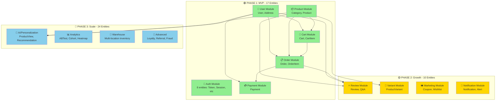

### 📈 Entity Count by Module

| Module              | Phase 1 (MVP) | Phase 2 (Growth)    | Phase 3 (Scale)         | Total  |
| ------------------- | ------------- | ------------------- | ----------------------- | ------ |
| 👤 User & Auth      | 10 entities   | -                   | 1 (2FA)                 | **11** |
| 📦 Product Catalog  | 2 entities    | 2 (Variant, Review) | 3 (View, Q&A)           | **7**  |
| 🛒 Shopping         | 4 entities    | 1 (Wishlist)        | 1 (Abandonment)         | **6**  |
| 📋 Order Management | 3 entities    | 2 (Coupon, Refund)  | 1 (Shipment)            | **6**  |
| 💳 Payment          | 1 entity      | -                   | -                       | **1**  |
| 🎯 Marketing        | -             | 4 entities          | 7 (Loyalty, Flash, etc) | **11** |
| 📊 Analytics & AI   | -             | -                   | 9 entities              | **9**  |
| **TOTAL**           | **17**        | **10**              | **24**                  | **51** |

### 🔗 Core Relationships Overview

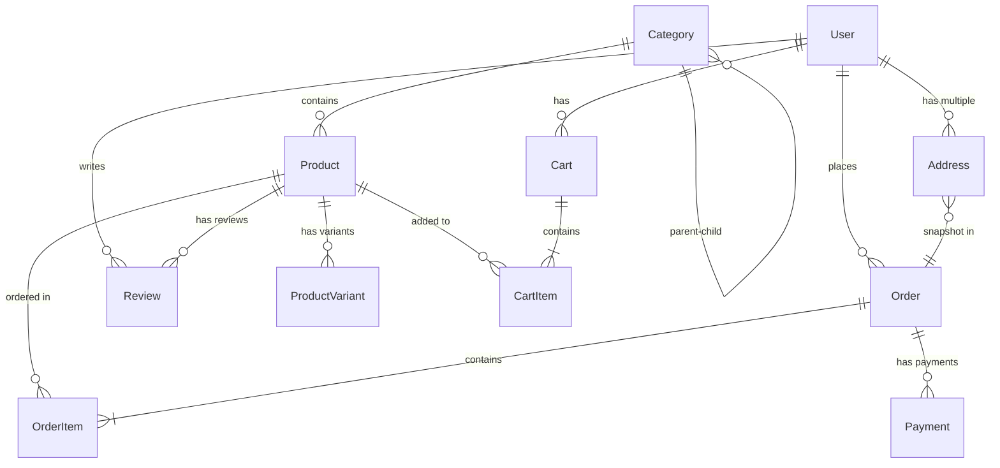

---

## �📊 PHÂN CẤP CHỨC NĂNG E-COMMERCE

### 🟢 LEVEL 1 – CORE MVP (BẮT BUỘC)

Tập trung vào chức năng cơ bản nhất để có một website bán hàng hoạt động được.

| Chức năng       | Entities         | Mục đích                                                |
| --------------- | ---------------- | ------------------------------------------------------- |
| **User & Auth** | User             | Đăng ký, đăng nhập, phân quyền USER/ADMIN               |
| **Category**    | Category         | Quản lý danh mục sản phẩm (hỗ trợ tree structure)       |
| **Product**     | Product          | Quản lý sản phẩm, giá, tồn kho, SKU                     |
| **Cart**        | Cart, CartItem   | Thêm/xóa/cập nhật giỏ hàng                              |
| **Order**       | Order, OrderItem | Tạo đơn hàng, lịch sử mua hàng, tracking                |
| **Address**     | Address          | Quản lý địa chỉ giao hàng của user (multiple addresses) |
| **Payment**     | Payment          | Track payment transactions (COD, Online payment)        |

✅ **MVP Timeline**: 1-2 tuần

⚠️ **Lưu ý quan trọng:** Address và Payment được nâng lên Level 1 vì đây là chức năng thiết yếu cho checkout flow.

---

### 🟡 LEVEL 2 – ENHANCED (THƯỜNG CÓ TRONG THỰC TẾ)

Các chức năng nâng cao giúp hệ thống gần với production hơn.

| Chức năng            | Bổ sung                | Lý do                                    |
| -------------------- | ---------------------- | ---------------------------------------- |
| **Product Images**   | Multi-images array     | 1 sản phẩm nhiều ảnh                     |
| **Product Variants** | ProductVariant entity  | Sản phẩm có size/color/options khác nhau |
| **Stock Management** | Constraints & triggers | Trừ kho tự động khi order                |
| **Review System**    | Review entity          | Xây dựng trust factor ngay sau MVP       |

✅ **Timeline**: Thêm 1 tuần sau MVP

---

### 🔵 LEVEL 3 – ADVANCED (KHÔNG LÀM NGAY)

Chức năng nâng cao, chỉ implement khi có nhu cầu thực tế.

- ⭐ Review / Rating system
- 🎟️ Coupon / Promotion engine
- ❤️ Wishlist
- 📦 Shipment / Tracking integration
- 🔄 Refund / Return management
- 📧 Email notifications
- 📱 SMS OTP verification

⚠️ **Không khuyên implement khi mới bắt đầu**

---

### 🚀 LEVEL 4 – E-COMMERCE 2026 FEATURES (NÂNG CAO & CẠNH TRANH)

Các tính năng tiên tiến để cạnh tranh trong thị trường e-commerce 2026.

#### 🧠 **Personalization & AI**

- 📊 Product View Tracking (recently viewed, trending)
- 🎯 Recommendation Engine (collaborative filtering)
- 🔍 Search Analytics & History
- 📈 User Behavior Tracking
- 🤖 AI-powered Product Suggestions

#### 💰 **Marketing & Growth**

- 🎫 Advanced Coupon Engine (time-based, user-segment, first-order)
- ⚡ Flash Sale Management
- 🔗 Referral Program
- 💎 Loyalty Points & Membership Tiers
- 🎁 Gift Cards & Store Credit
- 📣 Abandoned Cart Recovery

#### 🌟 **Enhanced Product Experience**

- 💬 Q&A System (product questions & answers)
- 📹 Product Videos & UGC Content
- 📏 Size Recommendation (rule-based)
- 🔄 Product Comparison
- 🔔 Back-in-Stock Notifications
- 📦 Product Bundles

#### 📱 **Mobile & UX Optimization**

- 🏠 PWA Support (offline cart, push notifications)
- 🖼️ Image Search
- 🎤 Voice Search
- 📍 Location-based Features
- 🎨 Dynamic Homepage Personalization

#### 📊 **Analytics & Business Intelligence**

- 📉 Funnel Analytics
- 👥 Cohort Analysis
- 🔥 Heatmap Data
- 🛒 Cart Abandonment Analytics
- 📈 A/B Testing Framework
- 💡 Product Performance Metrics

#### 🔐 **Advanced Security & Compliance**

- 🚨 Fraud Detection
- 📝 Audit Logs
- 🔒 Data Encryption
- 🇪🇺 GDPR Compliance
- 🔑 Social Login (Google, Facebook, Apple)
- 📲 2FA / OTP Verification

#### 🚚 **Advanced Fulfillment**

- 📍 Multi-Warehouse Management
- 🗺️ Ship from Nearest Warehouse
- 📦 Split Shipments
- 📅 Estimated Delivery Date
- 🔔 Real-time Notification System
- 🔄 Subscription & Recurring Orders

✅ **Implement theo phases**: MVP → Growth → Scale & AI

---

## 🗂️ TỔNG QUAN ENTITIES

### Danh sách Entities chính theo Level

#### **Level 1 + 2: CORE MVP (9 Core + 8 Auth Entities = 17 Entities)**

##### **Core E-commerce (9 Entities)**

| #   | Entity        | Mục đích                      | Key Fields                           | Relationships              |
| --- | ------------- | ----------------------------- | ------------------------------------ | -------------------------- |
| 1   | **User**      | Authentication, authorization | email, password, role                | → Orders, Carts, Addresses |
| 2   | **Category**  | Product categorization        | name, slug, parentId                 | ← Products, ↔ Self         |
| 3   | **Product**   | Product catalog               | name, price, stock, sku              | ← OrderItems, CartItems    |
| 4   | **Cart**      | Shopping cart                 | userId, isActive                     | → CartItems                |
| 5   | **CartItem**  | Cart line items               | cartId, productId, quantity, price   | ← Cart, Product            |
| 6   | **Order**     | Purchase orders               | orderNumber, total, status           | → OrderItems, Payments     |
| 7   | **OrderItem** | Order line items              | orderId, productId, price            | ← Order, Product           |
| 8   | **Address**   | Shipping addresses            | userId, fullName, address, isDefault | ← User                     |
| 9   | **Payment**   | Payment transactions          | orderId, method, amount, status      | ← Order                    |

##### **🔐 Authentication & Authorization Module (8 Entities - BẮT BUỘC)**

| #   | Entity                     | Mục đích                         | Key Fields                              | Phase   |
| --- | -------------------------- | -------------------------------- | --------------------------------------- | ------- |
| 8   | **RefreshToken**           | JWT refresh token management     | userId, token, expiresAt, isRevoked     | Phase 1 |
| 9   | **EmailVerificationToken** | Email verification               | userId, token, expiresAt, isUsed        | Phase 1 |
| 10  | **PasswordResetToken**     | Password reset flow              | userId, token, expiresAt, isUsed        | Phase 1 |
| 11  | **LoginAttempt**           | Track failed login / brute force | userId, ipAddress, success, attemptedAt | Phase 1 |
| 12  | **UserSession**            | Active sessions tracking         | userId, token, device, ipAddress        | Phase 1 |
| 13  | **Role**                   | RBAC roles                       | name, description, isActive             | Phase 1 |
| 14  | **Permission**             | Granular permissions (optional)  | name, resource, action                  | Phase 2 |
| 15  | **RolePermission**         | Role-Permission mapping          | roleId, permissionId                    | Phase 2 |

#### **Level 3: ADVANCED (10 Entities)**

| #   | Entity            | Mục đích                     | Key Fields                      | Phase    |
| --- | ----------------- | ---------------------------- | ------------------------------- | -------- |
| 16  | **Review**        | Product reviews & rating     | productId, userId, rating, text | Phase 2  |
| 17  | **Wishlist**      | User wishlist                | userId, productId               | Phase 2  |
| 18  | **Coupon**        | Discount coupons             | code, type, value, expiry       | Phase 2  |
| 20  | **OrderCoupon**   | Applied coupons tracking     | orderId, couponId, discount     | Phase 2  |
| 21  | **Notification**  | User notifications           | userId, type, message, isRead   | Phase 2  |
| 22  | **RefundRequest** | Return/refund management     | orderId, reason, status         | Phase 2+ |
| 23  | **ShipmentTrack** | Shipping tracking            | orderId, carrier, trackingNo    | Phase 2+ |
| 24  | **SocialLogin**   | OAuth providers (G/FB/Apple) | userId, provider, providerId    | Phase 1  |
| 25  | **AuditLog**      | Security audit trail         | userId, action, resource, ip    | Phase 1  |
| 26  | **TwoFactorAuth** | 2FA/OTP management           | userId, secret, backupCodes     | Phase 2  |

#### **Level 4: E-COMMERCE 2026 (24 Entities)**

| #   | Entity                    | Mục đích                   | Key Fields                           | Phase   |
| --- | ------------------------- | -------------------------- | ------------------------------------ | ------- |
| 27  | **ProductView**           | Track product views        | productId, userId, sessionId, viewed | Phase 3 |
| 28  | **SearchHistory**         | Search analytics           | userId, query, results, clicked      | Phase 3 |
| 29  | **ProductQuestion**       | Q&A system                 | productId, userId, question          | Phase 2 |
| 30  | **ProductAnswer**         | Q&A answers                | questionId, userId, answer           | Phase 2 |
| 31  | **LoyaltyPoint**          | Points tracking            | userId, points, earned, spent        | Phase 3 |
| 32  | **LoyaltyTransaction**    | Points transaction history | userId, type, points, reference      | Phase 3 |
| 33  | **ReferralCode**          | Referral program           | userId, code, usageCount, reward     | Phase 3 |
| 34  | **GiftCard**              | Gift card management       | code, balance, isActive              | Phase 3 |
| 35  | **ProductVideo**          | UGC videos                 | productId, url, type (ugc/official)  | Phase 3 |
| 36  | **CartAbandonment**       | Abandoned cart tracking    | cartId, userId, recoveryStatus       | Phase 3 |
| 37  | **ABTest**                | A/B testing framework      | name, variant, conversion            | Phase 3 |
| 38  | **ProductComparison**     | Compare products           | userId, productIds (array)           | Phase 3 |
| 39  | **BackInStockAlert**      | Stock notification         | productId, userId, notified          | Phase 2 |
| 40  | **Subscription**          | Recurring orders           | userId, productId, frequency         | Phase 3 |
| 41  | **Warehouse**             | Multi-warehouse            | name, address, isActive              | Phase 3 |
| 42  | **InventoryWarehouse**    | Warehouse stock            | productId, warehouseId, stock        | Phase 3 |
| 43  | **FraudDetectionLog**     | Fraud tracking             | orderId, score, flags, action        | Phase 3 |
| 44  | **DynamicPricing**        | AI pricing                 | productId, basePrice, adjustedPrice  | Phase 3 |
| 45  | **UserSegment**           | Marketing segments         | name, criteria, userCount            | Phase 3 |
| 46  | **EmailCampaign**         | Email marketing            | name, segment, sent, opened          | Phase 3 |
| 47  | **PushNotification**      | PWA push notifications     | userId, title, body, sent            | Phase 3 |
| 48  | **ProductRecommendation** | AI recommendations         | userId, productId, score, algorithm  | Phase 3 |
| 49  | **ProductBundle**         | Product bundles            | name, productIds, discount           | Phase 2 |
| 50  | **FlashSale**             | Flash sale management      | productId, startTime, endTime, price | Phase 2 |

**📊 Tổng cộng: 51 Entities**

- **Phase 1 (MVP):** 17 entities (9 Core + 8 Auth)
- **Phase 2 (Growth):** 10 entities (Advanced features + ProductVariant)
- **Phase 3 (Scale):** 24 entities (AI & Analytics)

**🔄 Thay đổi so với thiết kế ban đầu:**

- ✅ **Address** di chuyển từ Level 3 lên **Level 1** (thiết yếu cho checkout)
- ✅ **Payment** thêm mới vào **Level 1** (track payment transactions)
- ✅ **ProductVariant** thêm mới vào **Level 2** (hỗ trợ size/color variants)
- ✅ **CartItem** thêm field `price` (snapshot price khi add to cart)
- ✅ **Order** thêm `shippingAddressSnapshot` (JSON snapshot thay vì foreign key)

---

## 📐 DATABASE SCHEMA DIAGRAM (ERD)

### 🎯 Core MVP Schema (Level 1+2)

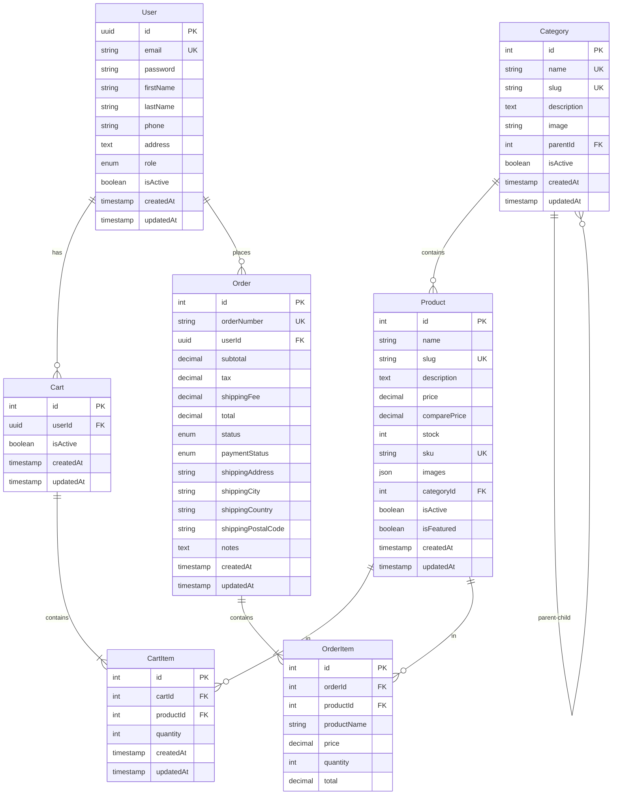

### 🔐 Authentication & Authorization Module (Level 1 - MVP)

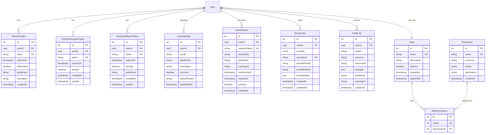

### 🌟 Extended Schema - Level 3 (Advanced Features)

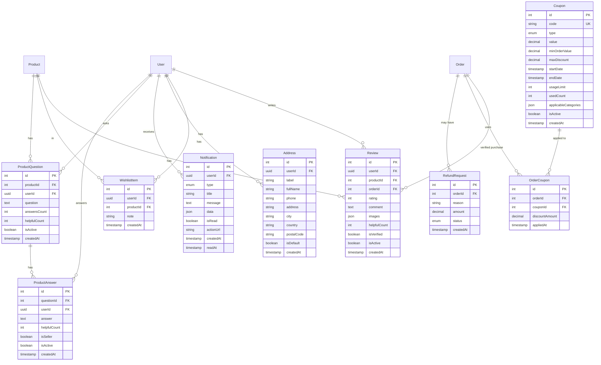

### 🚀 E-Commerce 2026 Schema - Level 4

#### 🧠 Personalization & AI Module

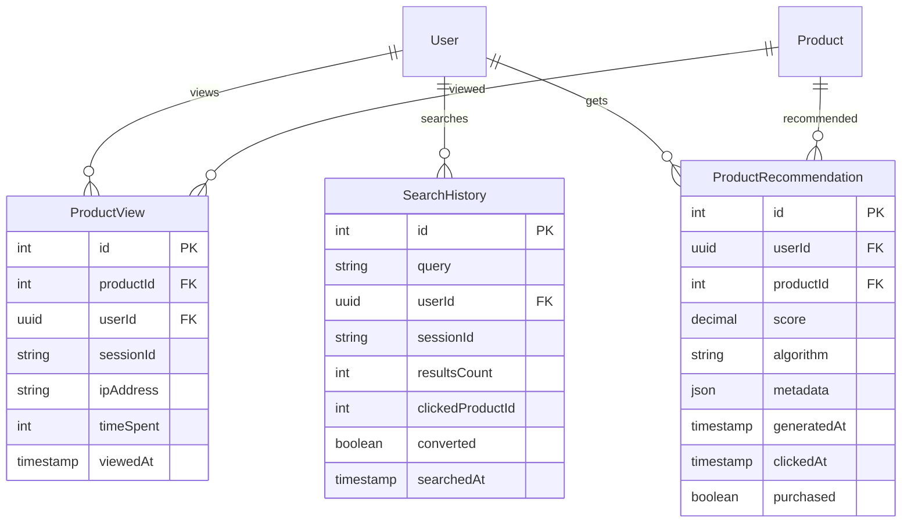

#### 💎 Loyalty & Rewards Module

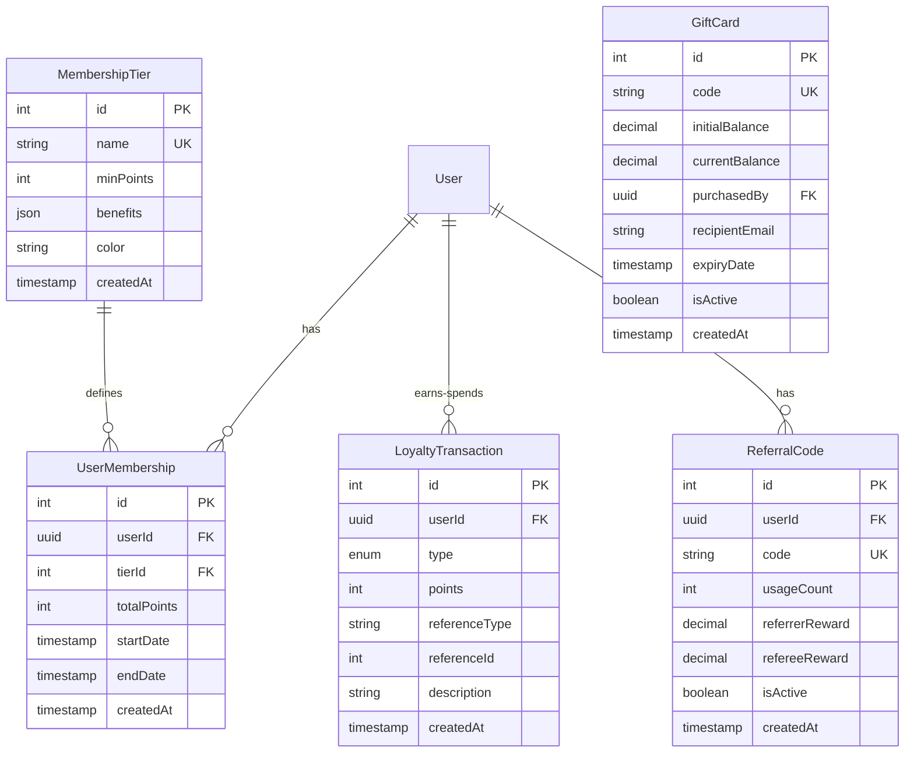

#### ⚡ Marketing & Sales Module

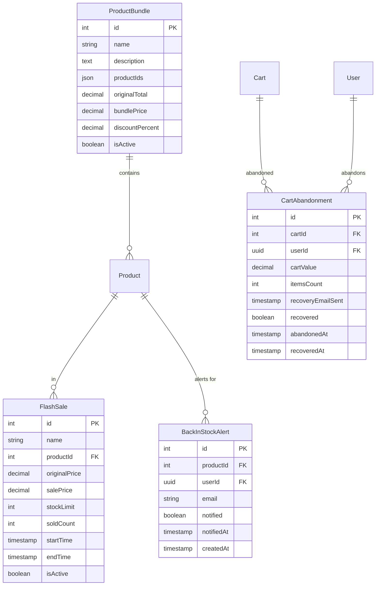

#### 🚚 Multi-Warehouse & Fulfillment Module

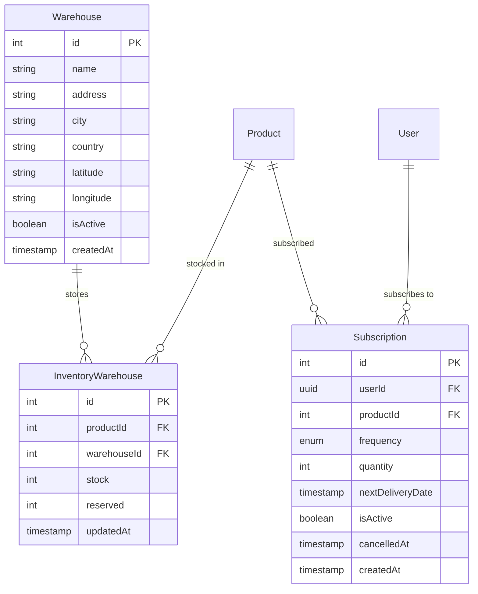

#### 🔐 Security & Compliance Module

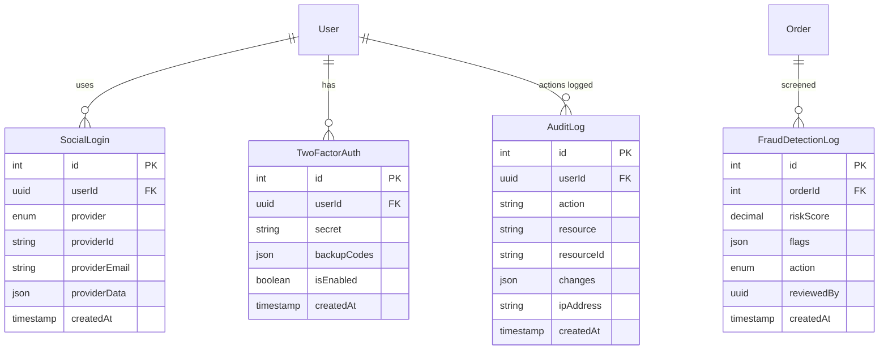

#### 📊 Analytics & A/B Testing Module

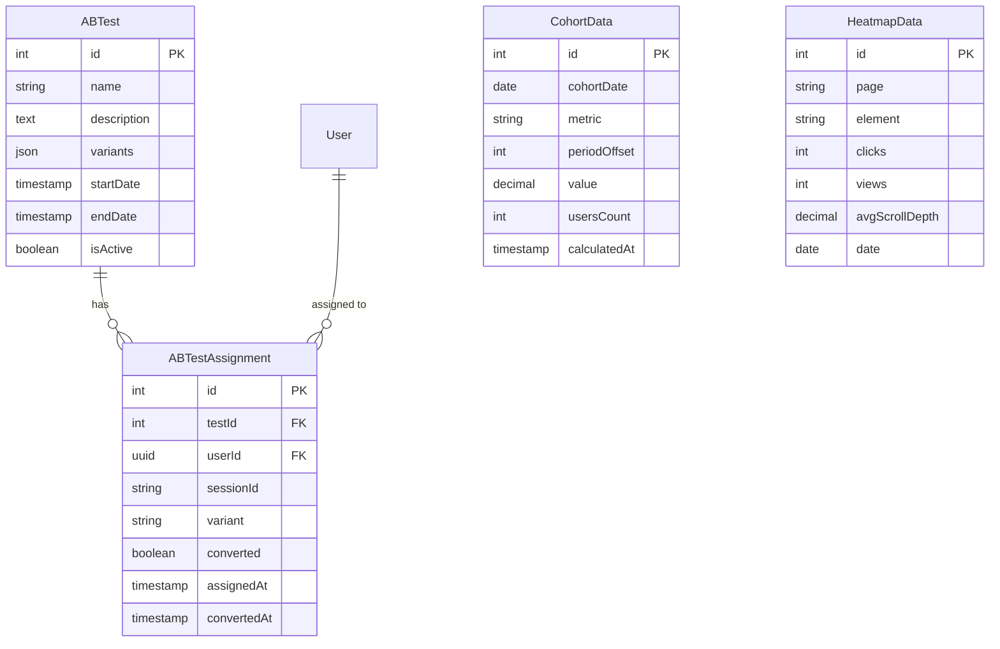

#### 📱 Mobile & PWA Module

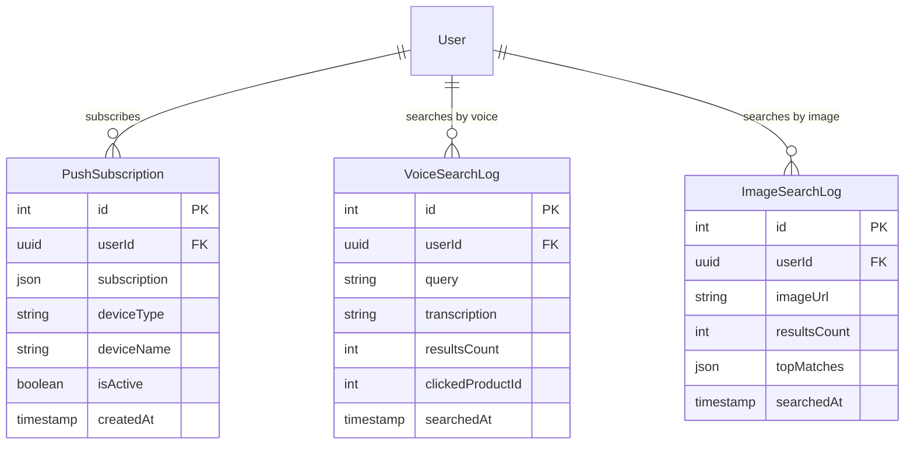

---

## 📋 CHI TIẾT TỪNG ENTITY

### 1️⃣ **User** – Người dùng

**Chức năng hỗ trợ:**

- Authentication (đăng ký, đăng nhập)
- Authorization (phân quyền USER/ADMIN)
- Ownership (cart, order ownership tracking)
- Profile management

**TypeORM Entity Specification:**

| Field       | Type         | Decorators                                                  | Validation                      | Description                      |
| ----------- | ------------ | ----------------------------------------------------------- | ------------------------------- | -------------------------------- |
| `id`        | UUID         | `@PrimaryGeneratedColumn('uuid')`                           | -                               | Primary key, auto-generated UUID |
| `email`     | VARCHAR(255) | `@Column({ unique: true })`                                 | `@IsEmail()`                    | Unique email, indexed            |
| `password`  | VARCHAR(255) | `@Column()`, `@Exclude()`                                   | `@IsStrongPassword()`           | Bcrypt hashed password           |
| `firstName` | VARCHAR(100) | `@Column({ nullable: true })`                               | `@IsString()`, `@Length(1,100)` | Optional first name              |
| `lastName`  | VARCHAR(100) | `@Column({ nullable: true })`                               | `@IsString()`, `@Length(1,100)` | Optional last name               |
| `phone`     | VARCHAR(20)  | `@Column({ nullable: true })`                               | `@IsPhoneNumber('VN')`          | Vietnam phone format             |
| `address`   | TEXT         | `@Column({ type: 'text', nullable: true })`                 | -                               | Full address                     |
| `role`      | ENUM         | `@Column({ type: 'enum', enum: Role, default: Role.USER })` | `@IsEnum(Role)`                 | USER or ADMIN                    |
| `isActive`  | BOOLEAN      | `@Column({ default: true })`                                | -                               | Soft delete flag                 |
| `createdAt` | TIMESTAMP    | `@CreateDateColumn()`                                       | -                               | Auto-generated                   |
| `updatedAt` | TIMESTAMP    | `@UpdateDateColumn()`                                       | -                               | Auto-updated                     |

**Relationships:**

```typescript
@OneToMany(() => Cart, cart => cart.user)
carts: Cart[];

@OneToMany(() => Order, order => order.user)
orders: Order[];
```

**Indexes:**

- `@Index()` on `email` (unique constraint already creates index)
- `@Index()` on `isActive` for filtering active users

**Business Rules:**

- Email must be unique và valid format
- Password phải hash bằng bcrypt (minimum cost factor 10)
- Role default là USER
- Soft delete: set `isActive = false` thay vì hard delete
- Email verification required trước khi login (tuỳ config)
- Account lock sau 5 lần login fail

---

## 🎯 BUSINESS REQUIREMENTS TO DATABASE MAPPING

Hiểu cách **business requirements** được chuyển đổi thành **database schema**.

### 📋 Traceability Matrix

| Business Requirement                               | Entities Involved                      | Key Fields                                         | Design Rationale                                               |
| -------------------------------------------------- | -------------------------------------- | -------------------------------------------------- | -------------------------------------------------------------- |
| **User đăng ký tài khoản**                         | `User`                                 | `email`, `password`, `role`                        | UUID for security, bcrypt password, email unique constraint    |
| **User đăng nhập với email/password**              | `User`, `RefreshToken`, `LoginAttempt` | `email`, `password`, `token`                       | Track failed attempts (brute force), refresh token for JWT     |
| **User quản lý nhiều địa chỉ giao hàng**           | `Address`                              | `userId`, `isDefault`, `type`                      | 1:N relationship, isDefault flag cho quick checkout            |
| **Sản phẩm có nhiều ảnh**                          | `Product`                              | `images` (JSON array)                              | JSON column thay vì separate table (simple, no query needs)    |
| **Sản phẩm có size/color variants**                | `ProductVariant`                       | `productId`, `attributes` (JSON), `sku`            | Flexible attributes, each variant có price/stock riêng         |
| **Danh mục sản phẩm phân cấp**                     | `Category`                             | `parentId` (self-FK)                               | Self-referencing relationship cho tree structure               |
| **Giỏ hàng lưu khi chưa checkout**                 | `Cart`, `CartItem`                     | `userId`, `isActive`, `price`                      | isActive cho multiple carts, price snapshot tránh thay đổi     |
| **Giá sản phẩm có thể thay đổi**                   | `CartItem`, `OrderItem`                | `price` (snapshot)                                 | Copy price khi add to cart/order để preserve history           |
| **User checkout tạo đơn hàng**                     | `Order`, `OrderItem`, `Payment`        | `orderNumber`, `status`, `shippingAddressSnapshot` | Snapshot address (immutable), generate unique orderNumber      |
| **Thanh toán COD và Online**                       | `Payment`                              | `method` (enum), `status`, `transactionId`         | Track payment history, multiple attempts, provider response    |
| **Admin xác nhận đơn hàng**                        | `Order`                                | `status` (state machine)                           | PENDING → CONFIRMED transition, validate payment first         |
| **Trừ kho khi đơn hàng confirmed**                 | `Product`                              | `stock`                                            | Decrease stock in transaction với order creation               |
| **User không xóa được product đang trong order**   | `Product`, `OrderItem`                 | FK với ON DELETE RESTRICT                          | Referential integrity, soft delete product thay vì hard delete |
| **Địa chỉ giao hàng không thay đổi sau khi order** | `Order`                                | `shippingAddressSnapshot` (JSON)                   | Copy toàn bộ address vào JSON, không reference FK              |
| **Search sản phẩm theo tên**                       | `Product`                              | `name`, `slug`, full-text index                    | GIN index với pg_trgm cho fuzzy search                         |
| **Filter sản phẩm theo category**                  | `Product`, `Category`                  | `categoryId`, composite index                      | Index (categoryId, isActive) cho filtered queries              |
| **Track failed login attempts**                    | `LoginAttempt`                         | `userId`, `ipAddress`, `success`, `attemptedAt`    | Brute force protection, composite index (email, attemptedAt)   |
| **User có thể review sau khi mua**                 | `Review`                               | `userId`, `productId`, `orderId`, `isVerified`     | Verify purchase via orderId, prevent fake reviews              |

### 🇻🇳 Vietnam-Specific Requirements

| Requirement                       | Field              | Entity            | Why Important                                  |
| --------------------------------- | ------------------ | ----------------- | ---------------------------------------------- |
| **Địa chỉ Việt Nam có Phường/Xã** | `ward`             | `Address`         | Administrative division cần thiết cho shipping |
| **Địa chỉ có Quận/Huyện**         | `district`         | `Address`         | Tính phí ship theo địa phương                  |
| **Phone format +84**              | `phone` validation | `User`, `Address` | Validation: `@IsPhoneNumber('VN')`             |
| **Payment methods phổ biến**      | `method` enum      | `Payment`         | COD, Momo, VNPay, ZaloPay (local providers)    |
| **Currency VND**                  | `currency` default | `Payment`         | Default 'VND', price format không có decimal   |

### 💡 Design Decision Examples

**1. Tại sao User.id dùng UUID thay vì INT?**

```typescript
// Requirement: "Bảo mật user data, không cho enumerate users"
// ❌ INT: User có thể guess: /api/users/1, /api/users/2, /api/users/3
// ✅ UUID: /api/users/550e8400-e29b-41d4-a716-446655440000 (không đoán được)

// Bonus: UUID generate offline, distributed systems friendly
```

**2. Tại sao CartItem.price lưu riêng thay vì reference Product.price?**

```typescript
// Requirement: "Giá trong giỏ không thay đổi khi admin update giá sản phẩm"
// Scenario:
// - 9:00 AM: User add Product (price = 100,000đ) vào cart
// - 10:00 AM: Admin update Product.price = 120,000đ
// - 11:00 AM: User checkout
// ❌ Không snapshot: User phải trả 120,000đ (tăng giá bất ngờ!)
// ✅ Có snapshot: User vẫn trả 100,000đ (giá khi add to cart)
```

**3. Tại sao Order.shippingAddress là JSON thay vì FK to Address?**

```typescript
// Requirement: "Địa chỉ giao hàng trong order history không đổi"
// Scenario:
// - User order với Address A
// - User xóa Address A
// - Admin xem lại order history
// ❌ FK: Address không tồn tại → lỗi!
// ✅ JSON snapshot: Address preserved forever (immutable)
```

**4. Tại sao Product.images dùng JSON array thay vì separate table?**

```typescript
// Requirement: "Product có 3-5 ảnh, chỉ display, không filter/search by image"
// ❌ Normalized: CREATE TABLE product_images (id, productId, url, order)
//    - More complex: 2 tables + join
//    - Overkill nếu không query by image
// ✅ JSON array: ['img1.jpg', 'img2.jpg']
//    - Simple, compact
//    - TypeORM built-in JSON support
//    - Caveats: Không index được, không query WHERE image = 'x'
```

**5. Tại sao Category.parentId self-reference thay vì separate table?**

```typescript
// Requirement: "Danh mục phân cấp: Electronics > Smartphones > iPhone"
// ✅ Self-referencing FK:
categories: [
  { id: 1, name: "Electronics", parentId: null },
  { id: 2, name: "Smartphones", parentId: 1 },
  { id: 3, name: "iPhone", parentId: 2 },
];
// - Simple structure
// - Recursive queries với CTE
// - TypeORM self-referencing support

// ❌ Alternative: Adjacency list table
// - More complex, rarely needed
```

---

## 🎬 END-TO-END SCENARIOS

Hiểu data flow thực tế qua các scenarios cụ thể.

### 📦 Scenario 1: User Checkout Flow

**Business Requirement:**

> User đã thêm 3 sản phẩm vào giỏ, chọn địa chỉ giao hàng, thanh toán COD, tạo đơn hàng.

**Data Flow Diagram:**

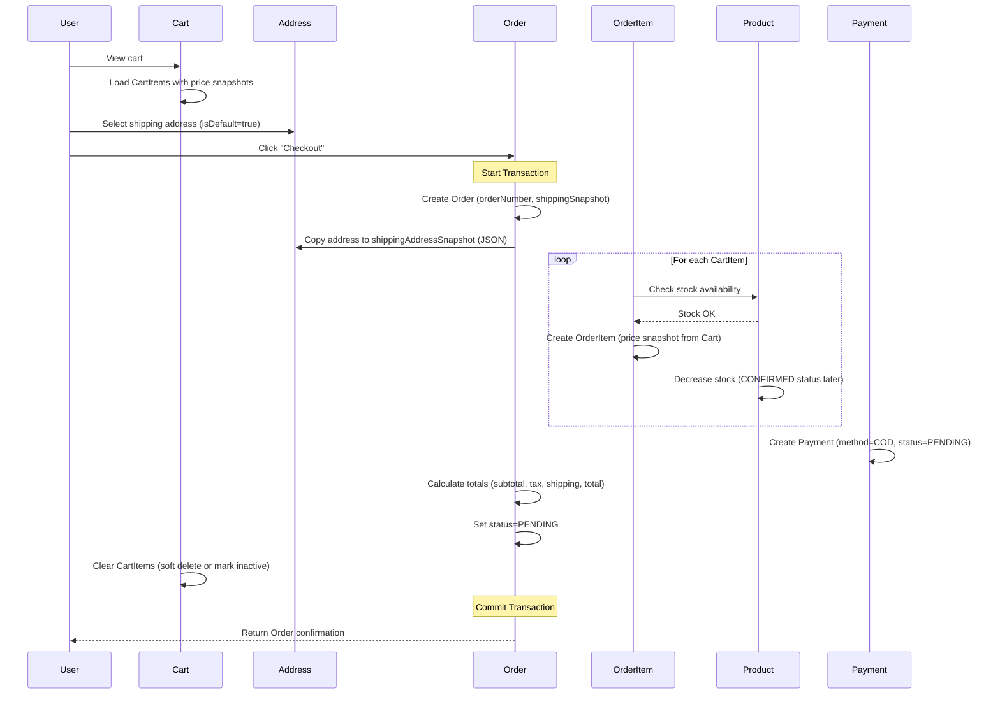

**Step-by-Step SQL & TypeORM:**

```typescript
// Step 1: Load Cart với price snapshots
const cart = await cartRepo.findOne({
  where: { userId, isActive: true },
  relations: ["cartItems", "cartItems.product"],
});

// Step 2: Get default address
const address = await addressRepo.findOne({
  where: { userId, isDefault: true },
});

// Step 3: Start transaction
await dataSource.transaction(async (manager) => {
  // 3.1: Create Order với address snapshot
  const order = manager.create(Order, {
    userId,
    orderNumber: generateOrderNumber(), // ORD-20260111-0001
    status: OrderStatus.PENDING,
    paymentStatus: PaymentStatus.PENDING,
    shippingAddressSnapshot: {
      fullName: address.fullName,
      phone: address.phone,
      address: address.address,
      ward: address.ward,
      district: address.district,
      city: address.city,
      postalCode: address.postalCode,
    },
    subtotal: 0, // Calculate later
    tax: 0,
    shippingFee: 0,
    total: 0,
  });
  await manager.save(order);

  // 3.2: Create OrderItems
  let subtotal = 0;
  for (const cartItem of cart.cartItems) {
    // Validate stock
    if (cartItem.product.stock < cartItem.quantity) {
      throw new BadRequestException("Insufficient stock");
    }

    // Create OrderItem với price snapshot từ CartItem
    const orderItem = manager.create(OrderItem, {
      orderId: order.id,
      productId: cartItem.productId,
      productName: cartItem.product.name, // Snapshot
      price: cartItem.price, // Snapshot từ cart!
      quantity: cartItem.quantity,
      total: cartItem.price * cartItem.quantity,
    });
    await manager.save(orderItem);

    subtotal += orderItem.total;

    // Note: Stock chỉ trừ khi order CONFIRMED, không phải lúc PENDING
    // Tránh: User tạo order rồi không thanh toán → stock bị lock
  }

  // 3.3: Calculate totals
  const tax = subtotal * 0.1; // VAT 10%
  const shippingFee = calculateShipping(address); // Based on location
  const total = subtotal + tax + shippingFee;

  order.subtotal = subtotal;
  order.tax = tax;
  order.shippingFee = shippingFee;
  order.total = total;
  await manager.save(order);

  // 3.4: Create Payment record
  const payment = manager.create(Payment, {
    orderId: order.id,
    method: PaymentMethod.COD,
    amount: total,
    status: PaymentStatus.PENDING,
    ipAddress: req.ip,
  });
  await manager.save(payment);

  // 3.5: Clear cart
  await manager.delete(CartItem, { cartId: cart.id });
  // Or: await manager.update(Cart, { id: cart.id }, { isActive: false });

  return order;
});
```

**Key Takeaways:**

- ✅ **Transaction**: All-or-nothing (nếu payment fail → order rollback)
- ✅ **Snapshots**: Address, product name, price copied (immutable)
- ✅ **Stock validation**: Check before create, decrease khi CONFIRMED
- ✅ **Clear cart**: Clean up after successful checkout

---

### 💰 Scenario 2: Price Change During Shopping

**Business Requirement:**

> Tránh user bị tăng giá bất ngờ khi đang shopping.

**Timeline:**

```
9:00 AM  → User adds Product (price = 100,000đ) to Cart
         → CartItem.price = 100,000 (snapshot)

10:00 AM → Admin updates Product.price = 120,000đ
         → Product.price = 120,000 (new price)
         → CartItem.price = 100,000 (KHÔNG ĐỔI!)

11:00 AM → User views cart
         → Display: 100,000đ (từ CartItem.price)
         → NOT: 120,000đ (từ Product.price)

12:00 PM → User checkout
         → OrderItem.price = 100,000 (từ CartItem.price)
```

**Why This Matters:**

```typescript
// ❌ BAD: Không có price snapshot trong CartItem
class CartItem {
  productId: number;
  quantity: number;
  // Lấy price từ Product.price (realtime)
}

// Cart display:
cartItems.forEach((item) => {
  const price = item.product.price; // ← Giá thay đổi theo Product!
  const total = price * item.quantity;
});
// Problem: User thấy giá 100k, checkout lại thành 120k!

// ✅ GOOD: Có price snapshot
class CartItem {
  productId: number;
  quantity: number;
  price: number; // ← Snapshot khi add to cart
}

// Cart display:
cartItems.forEach((item) => {
  const price = item.price; // ← Giá cố định
  const total = price * item.quantity;
});
// Solution: User thấy giá nào thì trả giá đó!
```

**Edge Cases:**

```typescript
// Case 1: User xóa item rồi add lại
// → Lấy price MỚI NHẤT (hợp lý)
await cartItemRepo.delete({ cartId, productId });
const newPrice = await productRepo.findOne(productId).then((p) => p.price);
await cartItemRepo.save({ cartId, productId, quantity, price: newPrice });

// Case 2: Price giảm sau khi add to cart
// User muốn price mới (rẻ hơn)?
// → Frontend hiển thị warning: "Giá đã giảm, update giỏ hàng?"
// → Button "Update price" → re-add item với price mới

// Case 3: Product out of stock sau khi add to cart
// → Validate stock khi checkout, không phải khi add to cart
```

---

### 🗑️ Scenario 3: Product Deletion Safety

**Business Requirement:**

> Admin không thể xóa product đang có trong active orders (data integrity).

**Database Constraints:**

```sql
-- OrderItem.productId với RESTRICT
ALTER TABLE order_items
ADD CONSTRAINT fk_orderitem_product
FOREIGN KEY (productId) REFERENCES products(id)
ON DELETE RESTRICT; -- ← Không cho xóa!
```

**What Happens:**

```typescript
// Scenario: Product ID=123 đang có trong 5 orders
// Admin tries to delete product

// ❌ Hard delete attempt
await productRepo.delete(123);
// Result: PostgreSQL Error:
// "update or delete on table products violates foreign key constraint"
// → GOOD! Data integrity preserved.

// ✅ Soft delete solution
await productRepo.softDelete(123);
// OR
await productRepo.update(123, { deletedAt: new Date() });
// Result:
// - Product.deletedAt = 2026-01-11
// - Product still exists (orders safe)
// - Frontend: Không hiển thị product
// - Admin: Có thể restore nếu cần
```

**Soft Delete Implementation:**

```typescript
@Entity("products")
export class Product {
  // ... other fields

  @DeleteDateColumn()
  deletedAt: Date; // NULL = active, có giá trị = deleted
}

// Query active products only (TypeORM tự động filter)
const products = await productRepo.find(); // WHERE deletedAt IS NULL

// Query including deleted (admin view)
const allProducts = await productRepo.find({ withDeleted: true });

// Restore deleted product
await productRepo.restore(123); // deletedAt = NULL
```

**Order History Protection:**

```typescript
// User views order from 2025
const order = await orderRepo.findOne(456, {
  relations: ["orderItems", "orderItems.product"],
});

// Product đã bị soft delete nhưng:
order.orderItems.forEach((item) => {
  console.log(item.productName); // ✅ Snapshot preserved!
  console.log(item.price); // ✅ Historical price!
  console.log(item.product); // ✅ Still accessible (withDeleted)
});

// Frontend display:
// "iPhone 14 Pro - 27,990,000đ" ← From snapshot
// "(Sản phẩm không còn bán)" ← If product.deletedAt != null
```

---

### 🔄 Scenario 4: Order Status State Machine

**Business Requirement:**

> Order phải follow strict status flow, không random transitions.

**State Machine:**

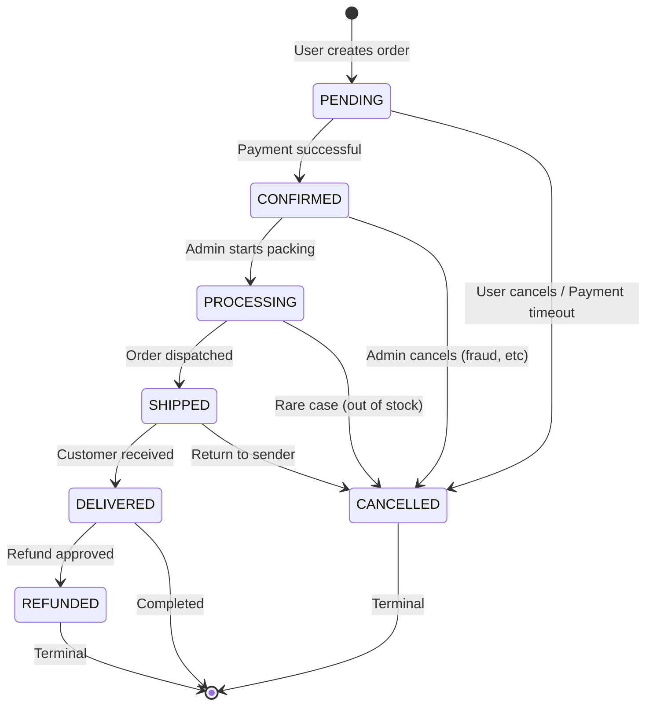

**Validation Logic:**

```typescript
class OrderService {
  private VALID_TRANSITIONS: Record<OrderStatus, OrderStatus[]> = {
    PENDING: [OrderStatus.CONFIRMED, OrderStatus.CANCELLED],
    CONFIRMED: [OrderStatus.PROCESSING, OrderStatus.CANCELLED],
    PROCESSING: [OrderStatus.SHIPPED, OrderStatus.CANCELLED],
    SHIPPED: [OrderStatus.DELIVERED, OrderStatus.CANCELLED],
    DELIVERED: [OrderStatus.REFUNDED], // Terminal (can only refund)
    CANCELLED: [], // Terminal state
    REFUNDED: [], // Terminal state
  };

  async updateStatus(orderId: number, newStatus: OrderStatus, reason?: string) {
    const order = await this.orderRepo.findOne(orderId);

    // Validate transition
    const allowedStatuses = this.VALID_TRANSITIONS[order.status];
    if (!allowedStatuses.includes(newStatus)) {
      throw new BadRequestException(
        `Cannot transition from ${order.status} to ${newStatus}`
      );
    }

    // Additional business rules
    if (newStatus === OrderStatus.CONFIRMED) {
      // Rule 1: Payment must be completed
      if (order.paymentStatus !== PaymentStatus.PAID) {
        throw new BadRequestException("Cannot confirm order without payment");
      }

      // Rule 2: Decrease product stock
      await this.decreaseStock(order);
    }

    if (newStatus === OrderStatus.CANCELLED) {
      // Rule 3: Save cancel reason
      order.cancelReason = reason || "Customer cancelled";

      // Rule 4: Restore stock if order was CONFIRMED
      if (order.status === OrderStatus.CONFIRMED) {
        await this.restoreStock(order);
      }

      // Rule 5: Refund payment if applicable
      if (order.paymentStatus === PaymentStatus.PAID) {
        await this.paymentService.refund(order.id);
      }
    }

    if (newStatus === OrderStatus.DELIVERED && order.paymentMethod === "COD") {
      // Rule 6: Mark COD payment as PAID
      await this.paymentService.markCODPaid(order.id);
    }

    // Update status
    order.status = newStatus;
    await this.orderRepo.save(order);

    // Send notifications
    await this.notificationService.sendOrderStatusUpdate(order);

    return order;
  }
}
```

**Real Example Flow:**

```typescript
// Order lifecycle:
const order = await orderService.create({ userId, cartId, addressId });
// Status: PENDING, PaymentStatus: PENDING

// User thanh toán Momo
await paymentService.handleMomoCallback(order.id, { success: true });
// PaymentStatus: PAID

// Admin confirms
await orderService.updateStatus(order.id, OrderStatus.CONFIRMED);
// Status: CONFIRMED
// Side effect: Stock decreased

// Admin packs
await orderService.updateStatus(order.id, OrderStatus.PROCESSING);
// Status: PROCESSING

// Shipper nhận hàng
await orderService.updateStatus(order.id, OrderStatus.SHIPPED);
// Status: SHIPPED
// Side effect: Email/SMS sent to customer

// Customer nhận hàng
await orderService.updateStatus(order.id, OrderStatus.DELIVERED);
// Status: DELIVERED
// If COD: PaymentStatus = PAID

// ❌ Invalid transitions will be rejected:
await orderService.updateStatus(order.id, OrderStatus.PENDING);
// Error: "Cannot transition from DELIVERED to PENDING"
```

---

## 🔐 AUTHENTICATION & AUTHORIZATION ENTITIES (LEVEL 1 - MVP)

### 2️⃣ **RefreshToken** – JWT Refresh Token Management

**Chức năng hỗ trợ:**

- JWT refresh token storage
- Token rotation security
- Revoke compromised tokens
- Multi-device session management

**TypeORM Entity Specification:**

| Field       | Type         | Decorators                                  | Validation | Description                  |
| ----------- | ------------ | ------------------------------------------- | ---------- | ---------------------------- |
| `id`        | INT          | `@PrimaryGeneratedColumn()`                 | -          | Auto-increment PK            |
| `userId`    | UUID         | `@Column({ type: 'uuid' })`                 | -          | Foreign key to User          |
| `token`     | VARCHAR(500) | `@Column({ unique: true, length: 500 })`    | -          | Hashed refresh token         |
| `expiresAt` | TIMESTAMP    | `@Column()`                                 | -          | Token expiration (7-30 days) |
| `isRevoked` | BOOLEAN      | `@Column({ default: false })`               | -          | Manual revocation flag       |
| `ipAddress` | VARCHAR(45)  | `@Column({ nullable: true })`               | -          | IPv4/IPv6 address            |
| `userAgent` | TEXT         | `@Column({ type: 'text', nullable: true })` | -          | Browser/device info          |
| `createdAt` | TIMESTAMP    | `@CreateDateColumn()`                       | -          | Token creation time          |

**Relationships:**

```typescript
@ManyToOne(() => User, { onDelete: 'CASCADE' })
@JoinColumn({ name: 'userId' })
user: User;
```

**Indexes:**

- `@Index()` on `userId`
- `@Index()` on `token` (unique)
- `@Index()` on `expiresAt` (cleanup expired tokens)

**Business Rules:**

- Token phải hash trước khi lưu (bcrypt)
- Auto-delete expired tokens (cron job)
- Revoke all tokens khi change password
- Max 5 active tokens per user (limit devices)
- Token rotation: invalidate old token khi refresh

---

### 3️⃣ **EmailVerificationToken** – Email Verification

**Chức năng hỗ trợ:**

- Verify email ownership
- Prevent fake accounts
- One-time use token

**TypeORM Entity Specification:**

| Field       | Type         | Decorators                    | Validation | Description           |
| ----------- | ------------ | ----------------------------- | ---------- | --------------------- |
| `id`        | INT          | `@PrimaryGeneratedColumn()`   | -          | Auto-increment PK     |
| `userId`    | UUID         | `@Column({ type: 'uuid' })`   | -          | Foreign key to User   |
| `token`     | VARCHAR(255) | `@Column({ unique: true })`   | -          | UUID v4 token         |
| `expiresAt` | TIMESTAMP    | `@Column()`                   | -          | Expires in 15-30 mins |
| `isUsed`    | BOOLEAN      | `@Column({ default: false })` | -          | One-time use flag     |
| `createdAt` | TIMESTAMP    | `@CreateDateColumn()`         | -          | Token generation time |
| `usedAt`    | TIMESTAMP    | `@Column({ nullable: true })` | -          | Verification time     |

**Relationships:**

```typescript
@ManyToOne(() => User, { onDelete: 'CASCADE' })
@JoinColumn({ name: 'userId' })
user: User;
```

**Indexes:**

- `@Index()` on `userId`
- `@Index()` on `token` (unique)
- `@Index()` on `expiresAt`

**Business Rules:**

- Token expires sau 30 phút
- Only 1 active token per user
- Auto-delete expired tokens
- Mark `isUsed = true` sau khi verify
- Resend tối đa 3 lần trong 1 giờ

---

### 4️⃣ **PasswordResetToken** – Password Reset Flow

**Chức năng hỗ trợ:**

- Forgot password workflow
- Secure password reset
- One-time use token

**TypeORM Entity Specification:**

| Field       | Type         | Decorators                    | Validation | Description           |
| ----------- | ------------ | ----------------------------- | ---------- | --------------------- |
| `id`        | INT          | `@PrimaryGeneratedColumn()`   | -          | Auto-increment PK     |
| `userId`    | UUID         | `@Column({ type: 'uuid' })`   | -          | Foreign key to User   |
| `token`     | VARCHAR(255) | `@Column({ unique: true })`   | -          | UUID v4 token         |
| `expiresAt` | TIMESTAMP    | `@Column()`                   | -          | Expires in 15 mins    |
| `isUsed`    | BOOLEAN      | `@Column({ default: false })` | -          | One-time use flag     |
| `ipAddress` | VARCHAR(45)  | `@Column({ nullable: true })` | -          | Request IP (security) |
| `createdAt` | TIMESTAMP    | `@CreateDateColumn()`         | -          | Token generation time |
| `usedAt`    | TIMESTAMP    | `@Column({ nullable: true })` | -          | Reset completion time |

**Relationships:**

```typescript
@ManyToOne(() => User, { onDelete: 'CASCADE' })
@JoinColumn({ name: 'userId' })
user: User;
```

**Indexes:**

- `@Index()` on `userId`
- `@Index()` on `token` (unique)
- `@Index()` on `expiresAt`

**Business Rules:**

- Token expires sau 15 phút (security)
- Only 1 active token per user
- Invalidate all sessions khi reset password
- Log IP address for security audit
- Rate limit: 3 requests per hour

---

### 5️⃣ **LoginAttempt** – Brute Force Protection

**Chức năng hỗ trợ:**

- Track login attempts
- Account lockout
- Security monitoring
- Suspicious activity detection

**TypeORM Entity Specification:**

| Field           | Type         | Decorators                                  | Validation | Description           |
| --------------- | ------------ | ------------------------------------------- | ---------- | --------------------- |
| `id`            | INT          | `@PrimaryGeneratedColumn()`                 | -          | Auto-increment PK     |
| `userId`        | UUID         | `@Column({ type: 'uuid', nullable: true })` | -          | User ID (if found)    |
| `email`         | VARCHAR(255) | `@Column()`                                 | -          | Login email attempted |
| `ipAddress`     | VARCHAR(45)  | `@Column()`                                 | -          | Source IP             |
| `userAgent`     | TEXT         | `@Column({ type: 'text', nullable: true })` | -          | Browser info          |
| `success`       | BOOLEAN      | `@Column()`                                 | -          | Login result          |
| `failureReason` | VARCHAR(255) | `@Column({ nullable: true })`               | -          | Error reason          |
| `attemptedAt`   | TIMESTAMP    | `@CreateDateColumn()`                       | -          | Attempt timestamp     |

**Relationships:**

```typescript
@ManyToOne(() => User, { nullable: true, onDelete: 'SET NULL' })
@JoinColumn({ name: 'userId' })
user: User;
```

**Indexes:**

- `@Index()` on `userId`
- `@Index()` on `email`
- `@Index()` on `ipAddress`
- `@Index()` on `attemptedAt`
- Composite: `email` + `attemptedAt` (recent failures)

**Business Rules:**

- Lock account sau 5 lần fail trong 15 phút
- Auto-unlock sau 30 phút
- Alert admin nếu >10 fail từ same IP
- Cleanup logs sau 90 ngày
- Track both successful và failed attempts

---

### 6️⃣ **UserSession** – Active Session Tracking

**Chức năng hỗ trợ:**

- Multi-device session management
- Force logout all devices
- Session expiration
- Security monitoring

**TypeORM Entity Specification:**

| Field            | Type         | Decorators                    | Validation | Description         |
| ---------------- | ------------ | ----------------------------- | ---------- | ------------------- |
| `id`             | INT          | `@PrimaryGeneratedColumn()`   | -          | Auto-increment PK   |
| `userId`         | UUID         | `@Column({ type: 'uuid' })`   | -          | Foreign key to User |
| `sessionToken`   | VARCHAR(500) | `@Column({ unique: true })`   | -          | Unique session ID   |
| `deviceInfo`     | VARCHAR(255) | `@Column({ nullable: true })` | -          | Device name/model   |
| `ipAddress`      | VARCHAR(45)  | `@Column()`                   | -          | Session IP          |
| `userAgent`      | TEXT         | `@Column({ type: 'text' })`   | -          | Browser/app info    |
| `lastActivityAt` | TIMESTAMP    | `@Column()`                   | -          | Last API call time  |
| `expiresAt`      | TIMESTAMP    | `@Column()`                   | -          | Session expiration  |
| `isActive`       | BOOLEAN      | `@Column({ default: true })`  | -          | Active status       |
| `createdAt`      | TIMESTAMP    | `@CreateDateColumn()`         | -          | Session start time  |

**Relationships:**

```typescript
@ManyToOne(() => User, { onDelete: 'CASCADE' })
@JoinColumn({ name: 'userId' })
user: User;
```

**Indexes:**

- `@Index()` on `userId`
- `@Index()` on `sessionToken` (unique)
- `@Index()` on `lastActivityAt` (cleanup)
- `@Index()` on `isActive`

**Business Rules:**

- Session expires sau 7 ngày inactive
- Update `lastActivityAt` mỗi API call
- Max 5 active sessions per user
- Revoke all sessions khi change password
- Show active sessions trong user profile

---

### 7️⃣ **Role** – Role-Based Access Control

**Chức năng hỗ trợ:**

- RBAC implementation
- Role hierarchy
- Permission grouping

**TypeORM Entity Specification:**

| Field         | Type        | Decorators                                  | Validation | Description             |
| ------------- | ----------- | ------------------------------------------- | ---------- | ----------------------- |
| `id`          | INT         | `@PrimaryGeneratedColumn()`                 | -          | Auto-increment PK       |
| `name`        | VARCHAR(50) | `@Column({ unique: true })`                 | -          | Role name (USER, ADMIN) |
| `description` | TEXT        | `@Column({ type: 'text', nullable: true })` | -          | Role description        |
| `isActive`    | BOOLEAN     | `@Column({ default: true })`                | -          | Enable/disable role     |
| `createdAt`   | TIMESTAMP   | `@CreateDateColumn()`                       | -          | Creation time           |
| `updatedAt`   | TIMESTAMP   | `@UpdateDateColumn()`                       | -          | Last update             |

**Relationships:**

```typescript
@OneToMany(() => User, user => user.role)
users: User[];

@OneToMany(() => RolePermission, rp => rp.role)
rolePermissions: RolePermission[];
```

**Default Roles:**

```typescript
const DEFAULT_ROLES = [
  { name: "USER", description: "Regular customer" },
  { name: "ADMIN", description: "Administrator with full access" },
  { name: "SELLER", description: "Product manager (optional)" },
  { name: "STAFF", description: "Customer support (optional)" },
];
```

---

### 8️⃣ **Permission** – Granular Permissions (Optional - Phase 2)

**Chức năng hỗ trợ:**

- Fine-grained access control
- Resource-level permissions
- Action-based authorization

**TypeORM Entity Specification:**

| Field         | Type         | Decorators                                  | Validation | Description                 |
| ------------- | ------------ | ------------------------------------------- | ---------- | --------------------------- |
| `id`          | INT          | `@PrimaryGeneratedColumn()`                 | -          | Auto-increment PK           |
| `name`        | VARCHAR(100) | `@Column({ unique: true })`                 | -          | permission.name (unique)    |
| `resource`    | VARCHAR(50)  | `@Column()`                                 | -          | Resource (product, order)   |
| `action`      | VARCHAR(50)  | `@Column()`                                 | -          | Action (create, read, etc.) |
| `description` | TEXT         | `@Column({ type: 'text', nullable: true })` | -          | Permission description      |
| `createdAt`   | TIMESTAMP    | `@CreateDateColumn()`                       | -          | Creation time               |

**Relationships:**

```typescript
@OneToMany(() => RolePermission, rp => rp.permission)
rolePermissions: RolePermission[];
```

**Example Permissions:**

```typescript
const PERMISSIONS = [
  { name: "product.create", resource: "product", action: "create" },
  { name: "product.update", resource: "product", action: "update" },
  { name: "product.delete", resource: "product", action: "delete" },
  { name: "order.refund", resource: "order", action: "refund" },
  { name: "user.manage", resource: "user", action: "manage" },
];
```

---

### 9️⃣ **RolePermission** – Role-Permission Mapping

**Chức năng hỗ trợ:**

- Link roles to permissions
- Many-to-many relationship
- Dynamic permission assignment

**TypeORM Entity Specification:**

| Field          | Type | Decorators                  | Validation | Description               |
| -------------- | ---- | --------------------------- | ---------- | ------------------------- |
| `id`           | INT  | `@PrimaryGeneratedColumn()` | -          | Auto-increment PK         |
| `roleId`       | INT  | `@Column()`                 | -          | Foreign key to Role       |
| `permissionId` | INT  | `@Column()`                 | -          | Foreign key to Permission |

**Relationships:**

```typescript
@ManyToOne(() => Role, role => role.rolePermissions, { onDelete: 'CASCADE' })
@JoinColumn({ name: 'roleId' })
role: Role;

@ManyToOne(() => Permission, permission => permission.rolePermissions, { onDelete: 'CASCADE' })
@JoinColumn({ name: 'permissionId' })
permission: Permission;
```

**Indexes:**

- `@Index(['roleId', 'permissionId'], { unique: true })` (prevent duplicates)

---

### 🔟 **SocialLogin** – OAuth Provider Integration (Level 3)

**Chức năng hỗ trợ:**

- Google, Facebook, Apple login
- Link multiple providers
- Provider profile sync

**TypeORM Entity Specification:**

| Field           | Type         | Decorators                                                         | Validation | Description              |
| --------------- | ------------ | ------------------------------------------------------------------ | ---------- | ------------------------ |
| `id`            | INT          | `@PrimaryGeneratedColumn()`                                        | -          | Auto-increment PK        |
| `userId`        | UUID         | `@Column({ type: 'uuid' })`                                        | -          | Foreign key to User      |
| `provider`      | ENUM         | `@Column({ type: 'enum', enum: ['google', 'facebook', 'apple'] })` | -          | OAuth provider           |
| `providerId`    | VARCHAR(255) | `@Column()`                                                        | -          | Provider user ID         |
| `providerEmail` | VARCHAR(255) | `@Column({ nullable: true })`                                      | -          | Email from provider      |
| `providerName`  | VARCHAR(255) | `@Column({ nullable: true })`                                      | -          | Name from provider       |
| `providerData`  | JSON         | `@Column({ type: 'json', nullable: true })`                        | -          | Additional provider data |
| `createdAt`     | TIMESTAMP    | `@CreateDateColumn()`                                              | -          | Link creation time       |
| `updatedAt`     | TIMESTAMP    | `@UpdateDateColumn()`                                              | -          | Last sync time           |

**Relationships:**

```typescript
@ManyToOne(() => User, { onDelete: 'CASCADE' })
@JoinColumn({ name: 'userId' })
user: User;
```

**Indexes:**

- `@Index(['provider', 'providerId'], { unique: true })` (prevent duplicate links)
- `@Index()` on `userId`

**Business Rules:**

- 1 provider chỉ link được 1 lần per user
- Email từ provider phải match với user.email (hoặc verify)
- Không cho phép unlink nếu user không có password

---

### 1️⃣1️⃣ **AuditLog** – Security Audit Trail (Level 3)

**Chức năng hỗ trợ:**

- Track all sensitive actions
- Compliance (GDPR, security audit)
- Forensic analysis
- User activity monitoring

**TypeORM Entity Specification:**

| Field        | Type         | Decorators                                  | Validation | Description             |
| ------------ | ------------ | ------------------------------------------- | ---------- | ----------------------- |
| `id`         | INT          | `@PrimaryGeneratedColumn()`                 | -          | Auto-increment PK       |
| `userId`     | UUID         | `@Column({ type: 'uuid', nullable: true })` | -          | Actor (null for system) |
| `action`     | VARCHAR(100) | `@Column()`                                 | -          | Action name             |
| `resource`   | VARCHAR(50)  | `@Column()`                                 | -          | Resource type           |
| `resourceId` | VARCHAR(50)  | `@Column({ nullable: true })`               | -          | Resource ID             |
| `changes`    | JSON         | `@Column({ type: 'json', nullable: true })` | -          | Before/after data       |
| `ipAddress`  | VARCHAR(45)  | `@Column({ nullable: true })`               | -          | Source IP               |
| `userAgent`  | TEXT         | `@Column({ type: 'text', nullable: true })` | -          | Client info             |
| `createdAt`  | TIMESTAMP    | `@CreateDateColumn()`                       | -          | Action timestamp        |

**Indexes:**

- `@Index()` on `userId`
- `@Index()` on `action`
- `@Index()` on `resource`
- `@Index()` on `createdAt`

**Tracked Actions:**

```typescript
const AUDIT_ACTIONS = [
  "user.login",
  "user.logout",
  "user.register",
  "user.changePassword",
  "user.update",
  "order.create",
  "order.cancel",
  "product.create",
  "product.update",
  "product.delete",
];
```

---

## 📦 CORE E-COMMERCE ENTITIES (Tiếp tục...)

### 1️⃣2️⃣ **Category** – Danh mục sản phẩm

**Chức năng hỗ trợ:**

- Product organization (tổ chức sản phẩm theo danh mục)
- Hierarchical structure (cây danh mục, hỗ trợ parent-child)
- SEO-friendly slugs

**TypeORM Entity Specification:**

| Field         | Type         | Decorators                                  | Validation                      | Description                |
| ------------- | ------------ | ------------------------------------------- | ------------------------------- | -------------------------- |
| `id`          | INT          | `@PrimaryGeneratedColumn()`                 | -                               | Auto-increment primary key |
| `name`        | VARCHAR(255) | `@Column({ unique: true })`                 | `@IsString()`, `@Length(1,255)` | Unique category name       |
| `slug`        | VARCHAR(255) | `@Column({ unique: true })`                 | `@IsSlug()`                     | URL-friendly slug          |
| `description` | TEXT         | `@Column({ type: 'text', nullable: true })` | `@IsString()`                   | Optional description       |
| `image`       | VARCHAR(500) | `@Column({ nullable: true })`               | `@IsUrl()`                      | Category image URL         |
| `parentId`    | INT          | `@Column({ nullable: true })`               | -                               | Self-referencing FK        |
| `isActive`    | BOOLEAN      | `@Column({ default: true })`                | -                               | Visibility flag            |
| `createdAt`   | TIMESTAMP    | `@CreateDateColumn()`                       | -                               | Auto-generated             |
| `updatedAt`   | TIMESTAMP    | `@UpdateDateColumn()`                       | -                               | Auto-updated               |

**Relationships:**

```typescript
@ManyToOne(() => Category, category => category.children)
@JoinColumn({ name: 'parentId' })
parent: Category;

@OneToMany(() => Category, category => category.parent)
children: Category[];

@OneToMany(() => Product, product => product.category)
products: Product[];
```

**Indexes:**

- `@Index()` on `slug` (unique constraint already indexes)
- `@Index()` on `parentId` for tree queries
- `@Index()` on `isActive`

**Business Rules:**

- Name và slug phải unique
- Slug auto-generate từ name (lowercase, hyphen-separated)
- Self-referencing cho hierarchical categories
- Không cho phép circular references (validate trong service layer)
- Xóa category: check if products exist → soft delete or transfer products

---

### 3️⃣ **Product** – Sản phẩm

**Chức năng hỗ trợ:**

- Product catalog management
- Inventory tracking (stock management)
- Pricing (regular price + compare price for discounts)
- Multi-image support
- SKU management

**TypeORM Entity Specification:**

| Field          | Type          | Decorators                                                              | Validation                      | Description                            |
| -------------- | ------------- | ----------------------------------------------------------------------- | ------------------------------- | -------------------------------------- |
| `id`           | INT           | `@PrimaryGeneratedColumn()`                                             | -                               | Auto-increment PK                      |
| `name`         | VARCHAR(500)  | `@Column({ length: 500 })`                                              | `@IsString()`, `@Length(1,500)` | Product name                           |
| `slug`         | VARCHAR(500)  | `@Column({ unique: true, length: 500 })`                                | `@IsSlug()`                     | SEO-friendly URL                       |
| `description`  | TEXT          | `@Column({ type: 'text', nullable: true })`                             | -                               | Full description                       |
| `price`        | DECIMAL(10,2) | `@Column({ type: 'decimal', precision: 10, scale: 2 })`                 | `@IsPositive()`, `@Min(0)`      | Current price                          |
| `comparePrice` | DECIMAL(10,2) | `@Column({ type: 'decimal', precision: 10, scale: 2, nullable: true })` | `@Min(0)`                       | Original price (for discount display)  |
| `stock`        | INT           | `@Column({ default: 0 })`                                               | `@IsInt()`, `@Min(0)`           | Available quantity                     |
| `sku`          | VARCHAR(100)  | `@Column({ unique: true, length: 100 })`                                | `@IsString()`                   | Stock Keeping Unit                     |
| `images`       | JSON          | `@Column({ type: 'json', default: [] })`                                | `@IsArray()`                    | Array of image URLs                    |
| `categoryId`   | INT           | `@Column()`                                                             | `@IsInt()`                      | Foreign key to Category                |
| `weight`       | DECIMAL(8,2)  | `@Column({ type: 'decimal', precision: 8, scale: 2, nullable: true })`  | `@Min(0)`                       | Product weight (kg) for shipping       |
| `dimensions`   | JSON          | `@Column({ type: 'json', nullable: true })`                             | -                               | {length, width, height} in cm          |
| `tags`         | JSON          | `@Column({ type: 'json', default: [] })`                                | `@IsArray()`                    | Array of tags for search/filtering     |
| `seo`          | JSON          | `@Column({ type: 'json', nullable: true })`                             | -                               | {metaTitle, metaDescription, keywords} |
| `isActive`     | BOOLEAN       | `@Column({ default: true })`                                            | -                               | Published status                       |
| `isFeatured`   | BOOLEAN       | `@Column({ default: false })`                                           | -                               | Homepage featured flag                 |
| `deletedAt`    | TIMESTAMP     | `@DeleteDateColumn()`                                                   | -                               | Soft delete timestamp                  |
| `createdAt`    | TIMESTAMP     | `@CreateDateColumn()`                                                   | -                               | Auto-generated                         |
| `updatedAt`    | TIMESTAMP     | `@UpdateDateColumn()`                                                   | -                               | Auto-updated                           |

**Relationships:**

```typescript
@ManyToOne(() => Category, category => category.products)
@JoinColumn({ name: 'categoryId' })
category: Category;

@OneToMany(() => CartItem, cartItem => cartItem.product)
cartItems: CartItem[];

@OneToMany(() => OrderItem, orderItem => orderItem.product)
orderItems: OrderItem[];
```

**Indexes:**

- `@Index()` on `slug` (unique)
- `@Index()` on `sku` (unique)
- `@Index()` on `categoryId` (FK)
- `@Index()` on `isActive`, `isFeatured` (filtering)
- `@Index()` on `price` (sorting)
- Full-text search index on `name` and `description` (PostgreSQL `pg_trgm`)

**Business Rules:**

- Price phải > 0
- Stock phải >= 0
- SKU phải unique
- Slug phải unique
- comparePrice (nếu có) phải >= price (validation trong service)
- Images array format: `['url1', 'url2', ...]` (max 10 images)
- Khi delete: check if trong CartItem hoặc OrderItem → soft delete only

---

### 4️⃣ **Cart** – Giỏ hàng

**Chức năng hỗ trợ:**

- User's shopping cart container
- One active cart per user
- Track cart creation/update time

**TypeORM Entity Specification:**

| Field       | Type      | Decorators                   | Validation | Description         |
| ----------- | --------- | ---------------------------- | ---------- | ------------------- |
| `id`        | INT       | `@PrimaryGeneratedColumn()`  | -          | Auto-increment PK   |
| `userId`    | UUID      | `@Column({ type: 'uuid' })`  | -          | Foreign key to User |
| `isActive`  | BOOLEAN   | `@Column({ default: true })` | -          | Active cart flag    |
| `createdAt` | TIMESTAMP | `@CreateDateColumn()`        | -          | Auto-generated      |
| `updatedAt` | TIMESTAMP | `@UpdateDateColumn()`        | -          | Auto-updated        |

**Relationships:**

```typescript
@ManyToOne(() => User, user => user.carts)
@JoinColumn({ name: 'userId' })
user: User;

@OneToMany(() => CartItem, cartItem => cartItem.cart, { cascade: true })
cartItems: CartItem[];
```

**Indexes:**

- `@Index()` on `userId`
- `@Index()` on `isActive`
- Composite unique index: `userId` + `isActive = true` (ensure only 1 active cart per user)

**Business Rules:**

- Mỗi user chỉ có 1 active cart tại một thời điểm
- Khi user logout: cart vẫn persist
- Khi user login: merge cart nếu có cart từ session trước
- Khi checkout: set `isActive = false`, create new Order

---

### 5️⃣ **CartItem** – Chi tiết giỏ hàng

**Chức năng hỗ trợ:**

- Individual product line items in cart
- Quantity management
- Link cart to products
- Price snapshot (lưu giá khi add to cart)

**TypeORM Entity Specification:**

| Field       | Type          | Decorators                                              | Validation            | Description                                |
| ----------- | ------------- | ------------------------------------------------------- | --------------------- | ------------------------------------------ |
| `id`        | INT           | `@PrimaryGeneratedColumn()`                             | -                     | Auto-increment PK                          |
| `cartId`    | INT           | `@Column()`                                             | -                     | Foreign key to Cart                        |
| `productId` | INT           | `@Column()`                                             | -                     | Foreign key to Product                     |
| `quantity`  | INT           | `@Column({ default: 1 })`                               | `@IsInt()`, `@Min(1)` | Item quantity                              |
| `price`     | DECIMAL(10,2) | `@Column({ type: 'decimal', precision: 10, scale: 2 })` | `@Min(0)`             | Price snapshot (tại thời điểm add to cart) |
| `createdAt` | TIMESTAMP     | `@CreateDateColumn()`                                   | -                     | Auto-generated                             |
| `updatedAt` | TIMESTAMP     | `@UpdateDateColumn()`                                   | -                     | Auto-updated                               |

**Relationships:**

```typescript
@ManyToOne(() => Cart, cart => cart.cartItems, { onDelete: 'CASCADE' })
@JoinColumn({ name: 'cartId' })
cart: Cart;

@ManyToOne(() => Product, product => product.cartItems)
@JoinColumn({ name: 'productId' })
product: Product;
```

**Indexes:**

- `@Index()` on `cartId`
- `@Index()` on `productId`
- Composite unique index: `cartId` + `productId` (1 product chỉ xuất hiện 1 lần trong 1 cart)

**Business Rules:**

- Quantity phải >= 1
- **Price snapshot**: Lưu giá tại thời điểm add to cart để tránh price changes ảnh hưởng cart
- Unique constraint: (cartId, productId) → không duplicate product trong cùng cart
- Khi add existing product: update quantity thay vì tạo mới
- Validate: quantity không được vượt quá product.stock
- Update price nếu user xóa và re-add product (lấy giá mới nhất)
- Cascade delete: khi Cart bị xóa → CartItem tự động xóa

---

### 6️⃣ **Order** – Đơn hàng

**Chức năng hỗ trợ:**

- Purchase order management
- Order tracking
- Payment tracking
- Shipping information snapshot
- Order history

**TypeORM Entity Specification:**

| Field                     | Type          | Decorators                                                                       | Validation    | Description                                     |
| ------------------------- | ------------- | -------------------------------------------------------------------------------- | ------------- | ----------------------------------------------- |
| `id`                      | INT           | `@PrimaryGeneratedColumn()`                                                      | -             | Auto-increment PK                               |
| `orderNumber`             | VARCHAR(50)   | `@Column({ unique: true, length: 50 })`                                          | -             | Unique order number (e.g., ORD-20260111-0001)   |
| `userId`                  | UUID          | `@Column({ type: 'uuid' })`                                                      | -             | Foreign key to User                             |
| `subtotal`                | DECIMAL(10,2) | `@Column({ type: 'decimal', precision: 10, scale: 2 })`                          | `@Min(0)`     | Sum of items (before tax/shipping)              |
| `tax`                     | DECIMAL(10,2) | `@Column({ type: 'decimal', precision: 10, scale: 2, default: 0 })`              | `@Min(0)`     | Tax amount (VAT 10%)                            |
| `shippingFee`             | DECIMAL(10,2) | `@Column({ type: 'decimal', precision: 10, scale: 2, default: 0 })`              | `@Min(0)`     | Shipping cost                                   |
| `total`                   | DECIMAL(10,2) | `@Column({ type: 'decimal', precision: 10, scale: 2 })`                          | `@Min(0)`     | subtotal + tax + shippingFee                    |
| `status`                  | ENUM          | `@Column({ type: 'enum', enum: OrderStatus, default: OrderStatus.PENDING })`     | -             | Order status                                    |
| `paymentStatus`           | ENUM          | `@Column({ type: 'enum', enum: PaymentStatus, default: PaymentStatus.PENDING })` | -             | Payment status                                  |
| `shippingAddress`         | VARCHAR(500)  | `@Column({ length: 500 })`                                                       | `@IsString()` | Full address snapshot                           |
| `shippingCity`            | VARCHAR(100)  | `@Column({ length: 100 })`                                                       | `@IsString()` | City snapshot                                   |
| `shippingCountry`         | VARCHAR(100)  | `@Column({ length: 100 })`                                                       | `@IsString()` | Country snapshot                                |
| `shippingPostalCode`      | VARCHAR(20)   | `@Column({ length: 20 })`                                                        | `@IsString()` | Postal code snapshot                            |
| `shippingAddressSnapshot` | JSON          | `@Column({ type: 'json', nullable: true })`                                      | -             | Complete address snapshot (from Address entity) |
| `notes`                   | TEXT          | `@Column({ type: 'text', nullable: true })`                                      | -             | Customer notes                                  |
| `adminNote`               | TEXT          | `@Column({ type: 'text', nullable: true })`                                      | -             | Internal admin note                             |
| `cancelReason`            | VARCHAR(500)  | `@Column({ length: 500, nullable: true })`                                       | -             | Reason if order cancelled                       |
| `estimatedDeliveryDate`   | TIMESTAMP     | `@Column({ nullable: true })`                                                    | -             | Estimated delivery date                         |
| `createdAt`               | TIMESTAMP     | `@CreateDateColumn()`                                                            | -             | Order date                                      |
| `updatedAt`               | TIMESTAMP     | `@UpdateDateColumn()`                                                            | -             | Last modified                                   |

**Enums:**

```typescript
enum OrderStatus {
  PENDING = "pending",
  CONFIRMED = "confirmed",
  PROCESSING = "processing",
  SHIPPED = "shipped",
  DELIVERED = "delivered",
  CANCELLED = "cancelled",
  REFUNDED = "refunded",
}

enum PaymentStatus {
  PENDING = "pending",
  PAID = "paid",
  FAILED = "failed",
  REFUNDED = "refunded",
}
```

**Relationships:**

```typescript
@ManyToOne(() => User, user => user.orders)
@JoinColumn({ name: 'userId' })
user: User;

@OneToMany(() => OrderItem, orderItem => orderItem.order, { cascade: true })
orderItems: OrderItem[];
```

**Indexes:**

- `@Index()` on `orderNumber` (unique)
- `@Index()` on `userId` (FK, filtering user orders)
- `@Index()` on `status` (filtering by status)
- `@Index()` on `paymentStatus` (filtering by payment)
- `@Index()` on `createdAt` (sorting by date)

**Business Rules:**

- orderNumber format: `ORD-YYYYMMDD-XXXX` (auto-generated)
- total = subtotal + tax + shippingFee (validate trong service)
- **Shipping address snapshot**: Lưu toàn bộ address info vào JSON để immutable (không bị ảnh hưởng nếu user update/delete address)
- **Order Status State Machine**:
  - PENDING → CONFIRMED → PROCESSING → SHIPPED → DELIVERED ✅
  - Any status → CANCELLED (với conditions)
  - DELIVERED → REFUNDED (nếu có refund request)
- **Transition rules**:
  - PENDING → CONFIRMED: Chỉ khi paymentStatus = PAID (hoặc COD approved)
  - Cannot cancel if status = SHIPPED hoặc DELIVERED
  - Cannot edit order after PROCESSING
- **Payment rules**:
  - COD: paymentStatus = PENDING, chuyển PAID khi delivered
  - Online: paymentStatus = PAID trước khi CONFIRMED
- **Stock management**: Decrease stock khi order CONFIRMED, restore nếu CANCELLED

---

### 7️⃣ **OrderItem** – Chi tiết đơn hàng

**Chức năng hỗ trợ:**

- Line items trong order
- Price snapshot (lưu giá tại thời điểm order)
- Product information snapshot

**TypeORM Entity Specification:**

| Field         | Type          | Decorators                                              | Validation            | Description                            |
| ------------- | ------------- | ------------------------------------------------------- | --------------------- | -------------------------------------- |
| `id`          | INT           | `@PrimaryGeneratedColumn()`                             | -                     | Auto-increment PK                      |
| `orderId`     | INT           | `@Column()`                                             | -                     | Foreign key to Order                   |
| `productId`   | INT           | `@Column()`                                             | -                     | Foreign key to Product (for reference) |
| `productName` | VARCHAR(500)  | `@Column({ length: 500 })`                              | -                     | Product name snapshot                  |
| `price`       | DECIMAL(10,2) | `@Column({ type: 'decimal', precision: 10, scale: 2 })` | `@Min(0)`             | Price snapshot (tại thời điểm order)   |
| `quantity`    | INT           | `@Column()`                                             | `@IsInt()`, `@Min(1)` | Quantity ordered                       |
| `total`       | DECIMAL(10,2) | `@Column({ type: 'decimal', precision: 10, scale: 2 })` | `@Min(0)`             | price \* quantity                      |

**Relationships:**

```typescript
@ManyToOne(() => Order, order => order.orderItems, { onDelete: 'CASCADE' })
@JoinColumn({ name: 'orderId' })
order: Order;

@ManyToOne(() => Product, product => product.orderItems)
@JoinColumn({ name: 'productId' })
product: Product;
```

**Indexes:**

- `@Index()` on `orderId` (FK)
- `@Index()` on `productId` (FK, for analytics)

**Business Rules:**

- **Price snapshot**: Lưu giá tại thời điểm order, KHÔNG lấy từ Product.price
- **Product name snapshot**: Lưu tên sản phẩm để tránh ảnh hưởng khi sản phẩm đổi tên
- total = price \* quantity (auto-calculate trong service)
- Cascade delete: khi Order bị xóa → OrderItem tự động xóa
- productId reference: giữ để analytics/reports, nhưng KHÔNG dùng để display

---

## 🔗 RELATIONSHIPS SUMMARY

### Cardinality & Cascade Behaviors

| From     | Relationship | To        | Cardinality | Cascade Delete | Notes                     |
| -------- | ------------ | --------- | ----------- | -------------- | ------------------------- |
| User     | has          | Cart      | 1:N         | NO             | Keep cart history         |
| User     | places       | Order     | 1:N         | NO             | Keep order history        |
| Category | contains     | Product   | 1:N         | SET NULL       | Product.categoryId → null |
| Category | parent-child | Category  | 1:N         | NO             | Self-referencing tree     |
| Product  | in           | CartItem  | 1:N         | NO             | Keep cart intact          |
| Product  | in           | OrderItem | 1:N         | NO             | Historical data           |
| Cart     | contains     | CartItem  | 1:N         | **YES**        | Auto-delete items         |
| Order    | contains     | OrderItem | 1:N         | **YES**        | Auto-delete items         |

### Foreign Key Constraints

```sql
-- User relationships
ALTER TABLE carts ADD CONSTRAINT fk_cart_user
  FOREIGN KEY (userId) REFERENCES users(id) ON DELETE CASCADE;

ALTER TABLE orders ADD CONSTRAINT fk_order_user
  FOREIGN KEY (userId) REFERENCES users(id) ON DELETE CASCADE;

-- Category self-reference
ALTER TABLE categories ADD CONSTRAINT fk_category_parent
  FOREIGN KEY (parentId) REFERENCES categories(id) ON DELETE SET NULL;

-- Product relationships
ALTER TABLE products ADD CONSTRAINT fk_product_category
  FOREIGN KEY (categoryId) REFERENCES categories(id) ON DELETE SET NULL;

-- CartItem relationships
ALTER TABLE cart_items ADD CONSTRAINT fk_cartitem_cart
  FOREIGN KEY (cartId) REFERENCES carts(id) ON DELETE CASCADE;

ALTER TABLE cart_items ADD CONSTRAINT fk_cartitem_product
  FOREIGN KEY (productId) REFERENCES products(id) ON DELETE RESTRICT;

-- OrderItem relationships
ALTER TABLE order_items ADD CONSTRAINT fk_orderitem_order
  FOREIGN KEY (orderId) REFERENCES orders(id) ON DELETE CASCADE;

ALTER TABLE order_items ADD CONSTRAINT fk_orderitem_product
  FOREIGN KEY (productId) REFERENCES products(id) ON DELETE RESTRICT;
```

---

## 🎯 CONSTRAINTS & VALIDATION RULES

### Unique Constraints

| Entity   | Fields                   | Reason                             |
| -------- | ------------------------ | ---------------------------------- |
| User     | email                    | No duplicate accounts              |
| Category | name, slug               | SEO and data integrity             |
| Product  | slug, sku                | URL uniqueness, inventory tracking |
| Cart     | userId + isActive (true) | 1 active cart per user             |
| CartItem | cartId + productId       | No duplicate items in cart         |
| Order    | orderNumber              | Unique order tracking              |

### Check Constraints

```sql
-- Price validation
ALTER TABLE products ADD CONSTRAINT chk_product_price
  CHECK (price > 0);

ALTER TABLE products ADD CONSTRAINT chk_product_compare_price
  CHECK (comparePrice IS NULL OR comparePrice >= price);

-- Stock validation
ALTER TABLE products ADD CONSTRAINT chk_product_stock
  CHECK (stock >= 0);

-- Quantity validation
ALTER TABLE cart_items ADD CONSTRAINT chk_cartitem_quantity
  CHECK (quantity >= 1);

ALTER TABLE order_items ADD CONSTRAINT chk_orderitem_quantity
  CHECK (quantity >= 1);

-- Order totals
ALTER TABLE orders ADD CONSTRAINT chk_order_totals
  CHECK (subtotal >= 0 AND tax >= 0 AND shippingFee >= 0 AND total >= 0);
```

### NOT NULL Constraints

Critical fields that must have values:

- `User`: email, password, role
- `Category`: name, slug
- `Product`: name, slug, price, stock, sku, categoryId
- `Cart`: userId
- `CartItem`: cartId, productId, quantity
- `Order`: orderNumber, userId, subtotal, total, status, paymentStatus, shippingAddress
- `OrderItem`: orderId, productId, productName, price, quantity, total

---

## ⚡ PERFORMANCE OPTIMIZATION

### Indexes Strategy

#### 1. Primary Keys (Auto-indexed)

- All `id` fields already have index

#### 2. Foreign Keys (MUST index)

```sql
CREATE INDEX idx_carts_userId ON carts(userId);
CREATE INDEX idx_orders_userId ON orders(userId);
CREATE INDEX idx_products_categoryId ON products(categoryId);
CREATE INDEX idx_cart_items_cartId ON cart_items(cartId);
CREATE INDEX idx_cart_items_productId ON cart_items(productId);
CREATE INDEX idx_order_items_orderId ON order_items(orderId);
CREATE INDEX idx_order_items_productId ON order_items(productId);
```

#### 3. Unique Constraints (Auto-indexed)

- email, slug, sku, orderNumber

#### 4. Filtering Columns

```sql
CREATE INDEX idx_users_isActive ON users(isActive);
CREATE INDEX idx_categories_isActive ON categories(isActive);
CREATE INDEX idx_products_isActive ON products(isActive);
CREATE INDEX idx_products_isFeatured ON products(isFeatured);
CREATE INDEX idx_orders_status ON orders(status);
CREATE INDEX idx_orders_paymentStatus ON orders(paymentStatus);
```

#### 5. Sorting Columns

```sql
CREATE INDEX idx_products_price ON products(price);
CREATE INDEX idx_orders_createdAt ON orders(createdAt DESC);
```

#### 6. Composite Indexes

```sql
-- Active products by category
CREATE INDEX idx_products_category_active ON products(categoryId, isActive);

-- Featured active products
CREATE INDEX idx_products_featured_active ON products(isFeatured, isActive);

-- User's active cart
CREATE INDEX idx_carts_user_active ON carts(userId, isActive);
```

#### 7. Full-Text Search (PostgreSQL)

```sql
-- Enable pg_trgm extension
CREATE EXTENSION IF NOT EXISTS pg_trgm;

-- Create GIN index for fuzzy search
CREATE INDEX idx_products_name_trgm ON products USING GIN (name gin_trgm_ops);
CREATE INDEX idx_products_description_trgm ON products USING GIN (description gin_trgm_ops);

-- Usage example:
-- SELECT * FROM products WHERE name ILIKE '%search%' OR description ILIKE '%search%';
```

---

## 🛠️ TYPEORM IMPLEMENTATION EXAMPLES

### Example 1: User Entity (Complete)

```typescript
import {
  Entity,
  PrimaryGeneratedColumn,
  Column,
  CreateDateColumn,
  UpdateDateColumn,
  OneToMany,
  Index,
} from "typeorm";
import { Exclude } from "class-transformer";
import {
  IsEmail,
  IsEnum,
  IsString,
  Length,
  IsPhoneNumber,
} from "class-validator";

export enum Role {
  USER = "user",
  ADMIN = "admin",
}

@Entity("users")
export class User {
  @PrimaryGeneratedColumn("uuid")
  id: string;

  @Column({ unique: true, length: 255 })
  @Index()
  @IsEmail()
  email: string;

  @Column({ length: 255 })
  @Exclude()
  password: string;

  @Column({ length: 100, nullable: true })
  @IsString()
  @Length(1, 100)
  firstName: string;

  @Column({ length: 100, nullable: true })
  @IsString()
  @Length(1, 100)
  lastName: string;

  @Column({ length: 20, nullable: true })
  @IsPhoneNumber("VN")
  phone: string;

  @Column({ type: "text", nullable: true })
  address: string;

  @Column({
    type: "enum",
    enum: Role,
    default: Role.USER,
  })
  @IsEnum(Role)
  role: Role;

  @Column({ default: true })
  @Index()
  isActive: boolean;

  @CreateDateColumn()
  createdAt: Date;

  @UpdateDateColumn()
  updatedAt: Date;

  // Relationships
  @OneToMany(() => Cart, (cart) => cart.user)
  carts: Cart[];

  @OneToMany(() => Order, (order) => order.user)
  orders: Order[];
}
```

### Example 2: Category Entity (Self-Referencing)

```typescript
import {
  Entity,
  PrimaryGeneratedColumn,
  Column,
  CreateDateColumn,
  UpdateDateColumn,
  ManyToOne,
  OneToMany,
  JoinColumn,
  Index,
} from "typeorm";
import { IsString, Length, IsUrl, IsBoolean } from "class-validator";

@Entity("categories")
export class Category {
  @PrimaryGeneratedColumn()
  id: number;

  @Column({ unique: true, length: 255 })
  @Index()
  @IsString()
  @Length(1, 255)
  name: string;

  @Column({ unique: true, length: 255 })
  @Index()
  @IsString()
  slug: string;

  @Column({ type: "text", nullable: true })
  @IsString()
  description: string;

  @Column({ nullable: true, length: 500 })
  @IsUrl()
  image: string;

  @Column({ nullable: true })
  @Index()
  parentId: number;

  @Column({ default: true })
  @Index()
  @IsBoolean()
  isActive: boolean;

  @CreateDateColumn()
  createdAt: Date;

  @UpdateDateColumn()
  updatedAt: Date;

  // Self-referencing relationship
  @ManyToOne(() => Category, (category) => category.children, {
    nullable: true,
    onDelete: "SET NULL",
  })
  @JoinColumn({ name: "parentId" })
  parent: Category;

  @OneToMany(() => Category, (category) => category.parent)
  children: Category[];

  @OneToMany(() => Product, (product) => product.category)
  products: Product[];
}
```

### Example 3: Product Entity (JSON Column)

```typescript
import {
  Entity,
  PrimaryGeneratedColumn,
  Column,
  CreateDateColumn,
  UpdateDateColumn,
  ManyToOne,
  OneToMany,
  JoinColumn,
  Index,
} from "typeorm";
import {
  IsString,
  Length,
  IsPositive,
  Min,
  IsInt,
  IsArray,
  IsBoolean,
} from "class-validator";

@Entity("products")
@Index(["categoryId", "isActive"])
@Index(["isFeatured", "isActive"])
export class Product {
  @PrimaryGeneratedColumn()
  id: number;

  @Column({ length: 500 })
  @IsString()
  @Length(1, 500)
  name: string;

  @Column({ unique: true, length: 500 })
  @Index()
  @IsString()
  slug: string;

  @Column({ type: "text", nullable: true })
  description: string;

  @Column({ type: "decimal", precision: 10, scale: 2 })
  @Index()
  @IsPositive()
  @Min(0)
  price: number;

  @Column({ type: "decimal", precision: 10, scale: 2, nullable: true })
  @Min(0)
  comparePrice: number;

  @Column({ default: 0 })
  @IsInt()
  @Min(0)
  stock: number;

  @Column({ unique: true, length: 100 })
  @Index()
  @IsString()
  sku: string;

  @Column({ type: "json", default: [] })
  @IsArray()
  images: string[];

  @Column()
  @Index()
  categoryId: number;

  @Column({ default: true })
  @Index()
  @IsBoolean()
  isActive: boolean;

  @Column({ default: false })
  @Index()
  @IsBoolean()
  isFeatured: boolean;

  @CreateDateColumn()
  createdAt: Date;

  @UpdateDateColumn()
  updatedAt: Date;

  // Relationships
  @ManyToOne(() => Category, (category) => category.products, {
    onDelete: "SET NULL",
  })
  @JoinColumn({ name: "categoryId" })
  category: Category;

  @OneToMany(() => CartItem, (cartItem) => cartItem.product)
  cartItems: CartItem[];

  @OneToMany(() => OrderItem, (orderItem) => orderItem.product)
  orderItems: OrderItem[];
}
```

### Example 4: Order & OrderItem (Cascade Delete)

```typescript
import {
  Entity,
  PrimaryGeneratedColumn,
  Column,
  CreateDateColumn,
  UpdateDateColumn,
  ManyToOne,
  OneToMany,
  JoinColumn,
  Index,
} from "typeorm";
import { IsEnum, IsString, Min } from "class-validator";

export enum OrderStatus {
  PENDING = "pending",
  CONFIRMED = "confirmed",
  PROCESSING = "processing",
  SHIPPED = "shipped",
  DELIVERED = "delivered",
  CANCELLED = "cancelled",
  REFUNDED = "refunded",
}

export enum PaymentStatus {
  PENDING = "pending",
  PAID = "paid",
  FAILED = "failed",
  REFUNDED = "refunded",
}

@Entity("orders")
export class Order {
  @PrimaryGeneratedColumn()
  id: number;

  @Column({ unique: true, length: 50 })
  @Index()
  orderNumber: string;

  @Column({ type: "uuid" })
  @Index()
  userId: string;

  @Column({ type: "decimal", precision: 10, scale: 2 })
  @Min(0)
  subtotal: number;

  @Column({ type: "decimal", precision: 10, scale: 2, default: 0 })
  @Min(0)
  tax: number;

  @Column({ type: "decimal", precision: 10, scale: 2, default: 0 })
  @Min(0)
  shippingFee: number;

  @Column({ type: "decimal", precision: 10, scale: 2 })
  @Min(0)
  total: number;

  @Column({
    type: "enum",
    enum: OrderStatus,
    default: OrderStatus.PENDING,
  })
  @Index()
  @IsEnum(OrderStatus)
  status: OrderStatus;

  @Column({
    type: "enum",
    enum: PaymentStatus,
    default: PaymentStatus.PENDING,
  })
  @Index()
  @IsEnum(PaymentStatus)
  paymentStatus: PaymentStatus;

  @Column({ length: 500 })
  @IsString()
  shippingAddress: string;

  @Column({ length: 100 })
  @IsString()
  shippingCity: string;

  @Column({ length: 100 })
  @IsString()
  shippingCountry: string;

  @Column({ length: 20 })
  @IsString()
  shippingPostalCode: string;

  @Column({ type: "text", nullable: true })
  notes: string;

  @CreateDateColumn()
  @Index()
  createdAt: Date;

  @UpdateDateColumn()
  updatedAt: Date;

  // Relationships
  @ManyToOne(() => User, (user) => user.orders)
  @JoinColumn({ name: "userId" })
  user: User;

  @OneToMany(() => OrderItem, (orderItem) => orderItem.order, {
    cascade: true, // CASCADE DELETE
  })
  orderItems: OrderItem[];
}

@Entity("order_items")
export class OrderItem {
  @PrimaryGeneratedColumn()
  id: number;

  @Column()
  @Index()
  orderId: number;

  @Column()
  @Index()
  productId: number;

  @Column({ length: 500 })
  productName: string;

  @Column({ type: "decimal", precision: 10, scale: 2 })
  @Min(0)
  price: number;

  @Column()
  @Min(1)
  quantity: number;

  @Column({ type: "decimal", precision: 10, scale: 2 })
  @Min(0)
  total: number;

  // Relationships
  @ManyToOne(() => Order, (order) => order.orderItems, {
    onDelete: "CASCADE", // Auto-delete when Order deleted
  })
  @JoinColumn({ name: "orderId" })
  order: Order;

  @ManyToOne(() => Product, (product) => product.orderItems)
  @JoinColumn({ name: "productId" })
  product: Product;
}
```

---

## 📝 MIGRATION STRATEGY

### Migration Dependencies Order

Thứ tự tạo entities phải tuân theo dependency graph để tránh lỗi foreign key:

```
1. User (no dependencies)
2. Category (self-referencing, but no external FK)
3. Product (depends on Category)
4. Cart (depends on User)
5. CartItem (depends on Cart, Product)
6. Order (depends on User)
7. OrderItem (depends on Order, Product)
```

### TypeORM Migration Commands

```bash
# 1. Generate migration từ entity changes
npm run migration:generate -- src/migrations/InitialSchema

# 2. Run migrations
npm run migration:run

# 3. Revert last migration (nếu có lỗi)
npm run migration:revert

# 4. Show migration status
npm run migration:show
```

### Important Notes

⚠️ **DO NOT use `synchronize: true` in production!**

- Chỉ dùng trong development
- Production phải dùng migrations

✅ **Best Practices:**

- Luôn review generated migration trước khi run
- Backup database trước khi run migration
- Test migration trên staging environment trước
- Có rollback plan (revert migration)
- Document migration changes trong commit message

### Sample Migration File Structure

```typescript
import { MigrationInterface, QueryRunner } from "typeorm";

export class CreateUsersTable1234567890123 implements MigrationInterface {
  public async up(queryRunner: QueryRunner): Promise<void> {
    await queryRunner.query(`
      CREATE EXTENSION IF NOT EXISTS "uuid-ossp";
      
      CREATE TABLE "users" (
        "id" uuid PRIMARY KEY DEFAULT uuid_generate_v4(),
        "email" varchar(255) UNIQUE NOT NULL,
        "password" varchar(255) NOT NULL,
        -- ... other columns
        "createdAt" timestamp DEFAULT now(),
        "updatedAt" timestamp DEFAULT now()
      );
      
      CREATE INDEX "idx_users_email" ON "users" ("email");
      CREATE INDEX "idx_users_isActive" ON "users" ("isActive");
    `);
  }

  public async down(queryRunner: QueryRunner): Promise<void> {
    await queryRunner.query(`DROP TABLE "users"`);
  }
}
```

---

## 🔍 DATA INTEGRITY RULES SUMMARY

### Referential Integrity

| Rule                                              | Implementation                              |
| ------------------------------------------------- | ------------------------------------------- |
| User cannot be deleted if has orders              | `ON DELETE RESTRICT` or soft delete User    |
| Product cannot be deleted if in orders            | `ON DELETE RESTRICT` or soft delete Product |
| Category deletion sets Product.categoryId to NULL | `ON DELETE SET NULL`                        |
| Cart deletion cascades to CartItems               | `ON DELETE CASCADE`                         |
| Order deletion cascades to OrderItems             | `ON DELETE CASCADE`                         |

### Business Logic Validations (Service Layer)

✅ Implement trong Service, không trong database:

1. **User Registration:**

   - Email format validation
   - Password strength (min 8 chars, uppercase, lowercase, number, special char)
   - Email uniqueness check

2. **Category Management:**

   - Slug auto-generation từ name
   - Prevent circular parent-child references
   - Check if category has products before delete

3. **Product Management:**

   - SKU auto-generation (nếu không provide)
   - Slug auto-generation
   - comparePrice >= price validation
   - Stock không âm

4. **Cart Operations:**

   - Check product stock before add to cart
   - Merge cart on user login
   - Clear cart after checkout

5. **Order Creation:**

   - Validate stock availability
   - Calculate totals: subtotal, tax (10%), shippingFee, total
   - Generate unique orderNumber
   - Create shipping address snapshot
   - Decrease product stock
   - Clear user's cart

6. **Order Status Updates:**
   - Validate status flow (PENDING → CONFIRMED → ...)
   - Cannot cancel if SHIPPED/DELIVERED
   - Restore stock if order cancelled

---

## 🚀 EXTENSIBILITY & FUTURE ENHANCEMENTS

### Level 3 Features (When Needed)

Khi cần mở rộng, có thể thêm các entities sau:

#### 1. **Review & Rating System**

```typescript
@Entity("reviews")
class Review {
  @PrimaryGeneratedColumn() id: number;
  @Column() userId: string;
  @Column() productId: number;
  @Column() orderId: number; // Only verified purchases
  @Column({ type: "int" }) rating: number; // 1-5
  @Column({ type: "text", nullable: true }) comment: string;
  @Column({ type: "json", default: [] }) images: string[]; // Review images
  @Column({ default: 0 }) helpfulCount: number; // Votes
  @Column({ default: true }) isVerified: boolean;
  @Column({ default: true }) isActive: boolean; // Moderation
  @CreateDateColumn() createdAt: Date;
  @UpdateDateColumn() updatedAt: Date;

  @ManyToOne(() => User) user: User;
  @ManyToOne(() => Product) product: Product;
  @ManyToOne(() => Order) order: Order;
}
```

#### 2. **Coupon/Promotion Engine**

```typescript
enum CouponType {
  PERCENTAGE = "percentage",
  FIXED = "fixed",
  FREE_SHIPPING = "free_shipping",
}

@Entity("coupons")
class Coupon {
  @PrimaryGeneratedColumn() id: number;
  @Column({ unique: true }) code: string;
  @Column({ type: "enum", enum: CouponType }) type: CouponType;
  @Column({ type: "decimal" }) value: number;
  @Column({ type: "decimal", nullable: true }) minOrderValue: number;
  @Column({ type: "decimal", nullable: true }) maxDiscount: number;
  @Column() startDate: Date;
  @Column() endDate: Date;
  @Column({ nullable: true }) usageLimit: number; // Total uses
  @Column({ default: 0 }) usedCount: number;
  @Column({ nullable: true }) perUserLimit: number;
  @Column({ type: "json", nullable: true }) applicableCategories: number[];
  @Column({ type: "json", nullable: true }) applicableProducts: number[];
  @Column({ default: true }) isActive: boolean;
  @CreateDateColumn() createdAt: Date;
}

@Entity("order_coupons")
class OrderCoupon {
  @PrimaryGeneratedColumn() id: number;
  @Column() orderId: number;
  @Column() couponId: number;
  @Column({ type: "decimal" }) discountAmount: number;
  @CreateDateColumn() appliedAt: Date;

  @ManyToOne(() => Order) order: Order;
  @ManyToOne(() => Coupon) coupon: Coupon;
}
```

#### 3. **Wishlist**

```typescript
@Entity('wishlist_items')
class WishlistItem {
  @PrimaryGeneratedColumn() id: number;
  @Column() userId: string;
  @Column() productId: number;
  @Column({ nullable: true }) note: string;
  @CreateDateColumn() createdAt: Date;

  @ManyToOne(() => User) user: User;
  @ManyToOne(() => Product) product: Product;

  // Unique constraint
  @@Index(['userId', 'productId'], { unique: true })
}
```

#### 4. **Address Book**

```typescript
@Entity("addresses")
class Address {
  @PrimaryGeneratedColumn() id: number;
  @Column() userId: string;
  @Column() label: string; // Home, Office, etc.
  @Column() fullName: string;
  @Column() phone: string;
  @Column() address: string;
  @Column() city: string;
  @Column() state: string;
  @Column() country: string;
  @Column() postalCode: string;
  @Column({ default: false }) isDefault: boolean;
  @CreateDateColumn() createdAt: Date;
  @UpdateDateColumn() updatedAt: Date;

  @ManyToOne(() => User) user: User;
}
```

#### 5. **Product Variants (Size, Color)**

```typescript
@Entity("product_variants")
class ProductVariant {
  @PrimaryGeneratedColumn() id: number;
  @Column() productId: number;
  @Column({ unique: true }) sku: string;
  @Column({ type: "decimal" }) price: number;
  @Column() stock: number;
  @Column({ type: "json" }) attributes: any; // { size: 'M', color: 'Red' }
  @Column({ nullable: true }) image: string;
  @Column({ default: true }) isActive: boolean;
  @CreateDateColumn() createdAt: Date;

  @ManyToOne(() => Product) product: Product;
}
```

#### 6. **Inventory Logs**

```typescript
enum InventoryAction {
  IN = "in",
  OUT = "out",
  ADJUSTMENT = "adjustment",
  RETURN = "return",
}

@Entity("inventory_logs")
class InventoryLog {
  @PrimaryGeneratedColumn() id: number;
  @Column() productId: number;
  @Column({ type: "enum", enum: InventoryAction }) action: InventoryAction;
  @Column() quantity: number;
  @Column() previousStock: number;
  @Column() newStock: number;
  @Column() reason: string;
  @Column({ nullable: true }) referenceType: string; // Order, Return, Manual
  @Column({ nullable: true }) referenceId: number;
  @Column({ nullable: true }) performedBy: string; // userId
  @CreateDateColumn() createdAt: Date;

  @ManyToOne(() => Product) product: Product;
}
```

#### 7. **Notifications**

```typescript
enum NotificationType {
  ORDER_CONFIRMED = "order_confirmed",
  ORDER_SHIPPED = "order_shipped",
  ORDER_DELIVERED = "order_delivered",
  PRICE_DROP = "price_drop",
  BACK_IN_STOCK = "back_in_stock",
  PROMOTION = "promotion",
  REVIEW_REQUEST = "review_request",
}

@Entity("notifications")
class Notification {
  @PrimaryGeneratedColumn() id: number;
  @Column() userId: string;
  @Column({ type: "enum", enum: NotificationType }) type: NotificationType;
  @Column() title: string;
  @Column({ type: "text" }) message: string;
  @Column({ type: "json", nullable: true }) data: any; // Additional metadata
  @Column({ default: false }) isRead: boolean;
  @Column({ nullable: true }) actionUrl: string;
  @CreateDateColumn() createdAt: Date;
  @Column({ nullable: true }) readAt: Date;

  @ManyToOne(() => User) user: User;
}
```

### Level 4: E-Commerce 2026 Entities

#### 🧠 **Personalization & Analytics**

```typescript
// Product View Tracking
@Entity("product_views")
class ProductView {
  @PrimaryGeneratedColumn() id: number;
  @Column() productId: number;
  @Column({ nullable: true }) userId: string;
  @Column({ nullable: true }) sessionId: string;
  @Column({ nullable: true }) ipAddress: string;
  @Column({ nullable: true }) userAgent: string;
  @Column({ nullable: true }) referrer: string;
  @Column({ type: "int", default: 0 }) timeSpent: number; // seconds
  @CreateDateColumn() viewedAt: Date;

  @ManyToOne(() => Product) product: Product;
  @ManyToOne(() => User, { nullable: true }) user: User;
}

// Search Analytics
@Entity("search_history")
class SearchHistory {
  @PrimaryGeneratedColumn() id: number;
  @Column() query: string;
  @Column({ nullable: true }) userId: string;
  @Column({ nullable: true }) sessionId: string;
  @Column() resultsCount: number;
  @Column({ nullable: true }) clickedProductId: number; // Did they click?
  @Column({ default: false }) converted: boolean; // Did they buy?
  @CreateDateColumn() searchedAt: Date;

  @ManyToOne(() => User, { nullable: true }) user: User;
}

// Product Recommendations (AI-generated)
@Entity("product_recommendations")
class ProductRecommendation {
  @PrimaryGeneratedColumn() id: number;
  @Column() userId: string;
  @Column() productId: number;
  @Column({ type: "decimal", precision: 5, scale: 4 }) score: number; // 0-1
  @Column() algorithm: string; // collaborative_filtering, content_based
  @Column({ type: "json" }) metadata: any;
  @CreateDateColumn() generatedAt: Date;
  @Column({ nullable: true }) clickedAt: Date;
  @Column({ default: false }) purchased: boolean;

  @ManyToOne(() => User) user: User;
  @ManyToOne(() => Product) product: Product;
}
```

#### 💬 **Q&A System**

```typescript
@Entity("product_questions")
class ProductQuestion {
  @PrimaryGeneratedColumn() id: number;
  @Column() productId: number;
  @Column() userId: string;
  @Column({ type: "text" }) question: string;
  @Column({ default: 0 }) answersCount: number;
  @Column({ default: 0 }) helpfulCount: number;
  @Column({ default: true }) isActive: boolean;
  @CreateDateColumn() createdAt: Date;

  @ManyToOne(() => Product) product: Product;
  @ManyToOne(() => User) user: User;
  @OneToMany(() => ProductAnswer, (answer) => answer.question)
  answers: ProductAnswer[];
}

@Entity("product_answers")
class ProductAnswer {
  @PrimaryGeneratedColumn() id: number;
  @Column() questionId: number;
  @Column() userId: string;
  @Column({ type: "text" }) answer: string;
  @Column({ default: 0 }) helpfulCount: number;
  @Column({ default: false }) isSeller: boolean; // Official answer
  @Column({ default: true }) isActive: boolean;
  @CreateDateColumn() createdAt: Date;

  @ManyToOne(() => ProductQuestion, (question) => question.answers)
  question: ProductQuestion;
  @ManyToOne(() => User) user: User;
}
```

#### 💎 **Loyalty & Rewards**

```typescript
@Entity("membership_tiers")
class MembershipTier {
  @PrimaryGeneratedColumn() id: number;
  @Column({ unique: true }) name: string; // Bronze, Silver, Gold
  @Column() minPoints: number;
  @Column({ type: "json" }) benefits: any; // Discount %, free shipping, etc.
  @Column() color: string;
  @Column({ nullable: true }) icon: string;
  @CreateDateColumn() createdAt: Date;
}

@Entity("user_memberships")
class UserMembership {
  @PrimaryGeneratedColumn() id: number;
  @Column() userId: string;
  @Column() tierId: number;
  @Column({ default: 0 }) totalPoints: number;
  @Column() startDate: Date;
  @Column({ nullable: true }) endDate: Date;
  @CreateDateColumn() createdAt: Date;
  @UpdateDateColumn() updatedAt: Date;

  @ManyToOne(() => User) user: User;
  @ManyToOne(() => MembershipTier) tier: MembershipTier;
}

@Entity("loyalty_transactions")
class LoyaltyTransaction {
  @PrimaryGeneratedColumn() id: number;
  @Column() userId: string;
  @Column({ type: "enum", enum: ["earn", "spend", "expire", "refund"] })
  type: string;
  @Column() points: number;
  @Column({ nullable: true }) referenceType: string; // Order, Review, Referral
  @Column({ nullable: true }) referenceId: number;
  @Column({ nullable: true }) description: string;
  @CreateDateColumn() createdAt: Date;

  @ManyToOne(() => User) user: User;
}

// Referral Program
@Entity("referral_codes")
class ReferralCode {
  @PrimaryGeneratedColumn() id: number;
  @Column() userId: string;
  @Column({ unique: true }) code: string;
  @Column({ default: 0 }) usageCount: number;
  @Column({ type: "decimal" }) referrerReward: number;
  @Column({ type: "decimal" }) refereeReward: number;
  @Column({ default: true }) isActive: boolean;
  @CreateDateColumn() createdAt: Date;

  @ManyToOne(() => User) user: User;
}

// Gift Cards
@Entity("gift_cards")
class GiftCard {
  @PrimaryGeneratedColumn() id: number;
  @Column({ unique: true }) code: string;
  @Column({ type: "decimal", precision: 10, scale: 2 }) initialBalance: number;
  @Column({ type: "decimal", precision: 10, scale: 2 }) currentBalance: number;
  @Column({ nullable: true }) purchasedBy: string;
  @Column({ nullable: true }) recipientEmail: string;
  @Column({ nullable: true }) expiryDate: Date;
  @Column({ default: true }) isActive: boolean;
  @CreateDateColumn() createdAt: Date;
  @UpdateDateColumn() updatedAt: Date;
}
```

#### ⚡ **Flash Sales & Marketing**

```typescript
@Entity("flash_sales")
class FlashSale {
  @PrimaryGeneratedColumn() id: number;
  @Column() name: string;
  @Column() productId: number;
  @Column({ type: "decimal" }) originalPrice: number;
  @Column({ type: "decimal" }) salePrice: number;
  @Column() stockLimit: number;
  @Column({ default: 0 }) soldCount: number;
  @Column() startTime: Date;
  @Column() endTime: Date;
  @Column({ default: true }) isActive: boolean;
  @CreateDateColumn() createdAt: Date;

  @ManyToOne(() => Product) product: Product;
}

// Product Bundles
@Entity("product_bundles")
class ProductBundle {
  @PrimaryGeneratedColumn() id: number;
  @Column() name: string;
  @Column({ type: "text", nullable: true }) description: string;
  @Column({ type: "json" }) productIds: number[]; // Array of product IDs
  @Column({ type: "decimal" }) originalTotal: number;
  @Column({ type: "decimal" }) bundlePrice: number;
  @Column({ type: "decimal" }) discountPercent: number;
  @Column({ default: true }) isActive: boolean;
  @CreateDateColumn() createdAt: Date;
}

// Cart Abandonment Tracking
@Entity("cart_abandonments")
class CartAbandonment {
  @PrimaryGeneratedColumn() id: number;
  @Column() cartId: number;
  @Column() userId: string;
  @Column({ type: "decimal" }) cartValue: number;
  @Column({ default: 0 }) itemsCount: number;
  @Column({ nullable: true }) recoveryEmailSent: Date;
  @Column({ default: false }) recovered: boolean;
  @Column({ nullable: true }) recoveredAt: Date;
  @CreateDateColumn() abandonedAt: Date;

  @ManyToOne(() => Cart) cart: Cart;
  @ManyToOne(() => User) user: User;
}
```

#### 🔔 **Back-in-Stock Alerts**

```typescript
@Entity("back_in_stock_alerts")
class BackInStockAlert {
  @PrimaryGeneratedColumn() id: number;
  @Column() productId: number;
  @Column() userId: string;
  @Column() email: string;
  @Column({ default: false }) notified: boolean;
  @Column({ nullable: true }) notifiedAt: Date;
  @CreateDateColumn() createdAt: Date;

  @ManyToOne(() => Product) product: Product;
  @ManyToOne(() => User) user: User;
}
```

#### 🚚 **Multi-Warehouse & Advanced Fulfillment**

```typescript
@Entity('warehouses')
class Warehouse {
  @PrimaryGeneratedColumn() id: number;
  @Column() name: string;
  @Column() address: string;
  @Column() city: string;
  @Column() country: string;
  @Column({ nullable: true }) latitude: string;
  @Column({ nullable: true }) longitude: string;
  @Column({ default: true }) isActive: boolean;
  @CreateDateColumn() createdAt: Date;
}

@Entity('inventory_warehouse')
class InventoryWarehouse {
  @PrimaryGeneratedColumn() id: number;
  @Column() productId: number;
  @Column() warehouseId: number;
  @Column({ default: 0 }) stock: number;
  @Column({ default: 0 }) reserved: number; // Reserved for orders
  @UpdateDateColumn() updatedAt: Date;

  @ManyToOne(() => Product) product: Product;
  @ManyToOne(() => Warehouse) warehouse: Warehouse;

  @@Index(['productId', 'warehouseId'], { unique: true })
}

// Subscriptions
@Entity('subscriptions')
class Subscription {
  @PrimaryGeneratedColumn() id: number;
  @Column() userId: string;
  @Column() productId: number;
  @Column({ type: 'enum', enum: ['weekly', 'biweekly', 'monthly'] }) frequency: string;
  @Column() quantity: number;
  @Column() nextDeliveryDate: Date;
  @Column({ default: true }) isActive: boolean;
  @Column({ nullable: true }) cancelledAt: Date;
  @CreateDateColumn() createdAt: Date;

  @ManyToOne(() => User) user: User;
  @ManyToOne(() => Product) product: Product;
}
```

#### 🔐 **Security & Compliance**

```typescript
@Entity('audit_logs')
class AuditLog {
  @PrimaryGeneratedColumn() id: number;
  @Column({ nullable: true }) userId: string;
  @Column() action: string; // login, create_order, update_product
  @Column() resource: string; // User, Order, Product
  @Column({ nullable: true }) resourceId: string;
  @Column({ type: 'json', nullable: true }) changes: any; // Before/After
  @Column({ nullable: true }) ipAddress: string;
  @Column({ nullable: true }) userAgent: string;
  @CreateDateColumn() createdAt: Date;
}

@Entity('fraud_detection_logs')
class FraudDetectionLog {
  @PrimaryGeneratedColumn() id: number;
  @Column() orderId: number;
  @Column({ type: 'decimal', precision: 5, scale: 2 }) riskScore: number; // 0-100
  @Column({ type: 'json' }) flags: any; // Array of risk flags
  @Column({ type: 'enum', enum: ['approved', 'flagged', 'blocked'] }) action: string;
  @Column({ nullable: true }) reviewedBy: string;
  @CreateDateColumn() createdAt: Date;

  @ManyToOne(() => Order) order: Order;
}

// Social Login
@Entity('social_logins')
class SocialLogin {
  @PrimaryGeneratedColumn() id: number;
  @Column() userId: string;
  @Column({ type: 'enum', enum: ['google', 'facebook', 'apple'] }) provider: string;
  @Column() providerId: string; // ID from provider
  @Column({ nullable: true }) providerEmail: string;
  @Column({ nullable: true }) providerName: string;
  @Column({ type: 'json', nullable: true }) providerData: any;
  @CreateDateColumn() createdAt: Date;
  @UpdateDateColumn() updatedAt: Date;

  @ManyToOne(() => User) user: User;

  @@Index(['provider', 'providerId'], { unique: true })
}

// 2FA
@Entity('two_factor_auth')
class TwoFactorAuth {
  @PrimaryGeneratedColumn() id: number;
  @Column() userId: string;
  @Column() secret: string; // Encrypted TOTP secret
  @Column({ type: 'json', nullable: true }) backupCodes: string[];
  @Column({ default: true }) isEnabled: boolean;
  @CreateDateColumn() createdAt: Date;
  @UpdateDateColumn() updatedAt: Date;

  @OneToOne(() => User) user: User;
}
```

#### 📊 **Analytics & A/B Testing**

```typescript
@Entity("ab_tests")
class ABTest {
  @PrimaryGeneratedColumn() id: number;
  @Column() name: string;
  @Column() description: string;
  @Column({ type: "json" }) variants: any; // [{ name: 'A', config: {} }]
  @Column() startDate: Date;
  @Column({ nullable: true }) endDate: Date;
  @Column({ default: true }) isActive: boolean;
  @CreateDateColumn() createdAt: Date;
}

@Entity("ab_test_assignments")
class ABTestAssignment {
  @PrimaryGeneratedColumn() id: number;
  @Column() testId: number;
  @Column({ nullable: true }) userId: string;
  @Column({ nullable: true }) sessionId: string;
  @Column() variant: string;
  @Column({ default: false }) converted: boolean;
  @Column({ nullable: true }) convertedAt: Date;
  @CreateDateColumn() assignedAt: Date;

  @ManyToOne(() => ABTest) test: ABTest;
}

// Cohort Analysis
@Entity("cohort_data")
class CohortData {
  @PrimaryGeneratedColumn() id: number;
  @Column({ type: "date" }) cohortDate: Date;
  @Column() metric: string; // retention, revenue, orders
  @Column() periodOffset: number; // Days/weeks/months since cohort
  @Column({ type: "decimal" }) value: number;
  @Column() usersCount: number;
  @CreateDateColumn() calculatedAt: Date;
}

// Heatmap Data
@Entity("heatmap_data")
class HeatmapData {
  @PrimaryGeneratedColumn() id: number;
  @Column() page: string;
  @Column() element: string; // CSS selector or element ID
  @Column({ default: 0 }) clicks: number;
  @Column({ default: 0 }) views: number;
  @Column({ type: "decimal", nullable: true }) avgScrollDepth: number;
  @Column({ type: "date" }) date: Date;
  @CreateDateColumn() createdAt: Date;
}
```

#### 📱 **Mobile & PWA**

```typescript
@Entity("push_subscriptions")
class PushSubscription {
  @PrimaryGeneratedColumn() id: number;
  @Column() userId: string;
  @Column({ type: "json" }) subscription: any; // Push API subscription object
  @Column() deviceType: string; // mobile, desktop
  @Column({ nullable: true }) deviceName: string;
  @Column({ default: true }) isActive: boolean;
  @CreateDateColumn() createdAt: Date;
  @UpdateDateColumn() updatedAt: Date;

  @ManyToOne(() => User) user: User;
}

// Voice Search
@Entity("voice_search_logs")
class VoiceSearchLog {
  @PrimaryGeneratedColumn() id: number;
  @Column({ nullable: true }) userId: string;
  @Column() query: string;
  @Column() transcription: string; // What was heard
  @Column() resultsCount: number;
  @Column({ nullable: true }) clickedProductId: number;
  @CreateDateColumn() searchedAt: Date;
}

// Image Search
@Entity("image_search_logs")
class ImageSearchLog {
  @PrimaryGeneratedColumn() id: number;
  @Column({ nullable: true }) userId: string;
  @Column() imageUrl: string;
  @Column() resultsCount: number;
  @Column({ type: "json", nullable: true }) topMatches: any;
  @CreateDateColumn() searchedAt: Date;
}
```

### Database Schema Versioning

Khi cần breaking changes:

1. Tạo migration mới với version number
2. Document changes trong CHANGELOG.md
3. Provide migration path cho existing data
4. Test thoroughly trên staging

**📝 Implementation Strategy:**

- **Phase 1 (MVP)**: Entities 1-7
- **Phase 2 (Growth)**: Entities 8-15 + Level 4 essentials (Reviews, Q&A, Loyalty basic, Security)
- **Phase 3 (Scale & AI)**: Entities 16-50 (Analytics, AI, Advanced features)

---

## ✅ CHECKLIST BEFORE IMPLEMENTATION

### Pre-Development

- [ ] Review toàn bộ ERD diagram với team
- [ ] Xác nhận business requirements với stakeholders
- [ ] Quyết định Phase implementation (MVP → Growth → Scale)
- [ ] Setup PostgreSQL local development environment
- [ ] Install UUID extension: `CREATE EXTENSION IF NOT EXISTS "uuid-ossp";`
- [ ] Install pg_trgm for full-text search: `CREATE EXTENSION IF NOT EXISTS pg_trgm;`
- [ ] Setup Redis cho caching (Phase 2+)
- [ ] Setup Elasticsearch cho advanced search (Phase 3+)

### Phase 1: Entity Implementation - MVP (TASK-00006 to TASK-00010)

- [ ] Create User entity
- [ ] Create Category entity (với self-referencing)
- [ ] Create Product entity (với JSON images)
- [ ] Create Cart & CartItem entities
- [ ] Create Order & OrderItem entities (với enums)
- [ ] Implement validation decorators cho tất cả entities
- [ ] Test relationships trong development

### Phase 2: Extended Features Implementation

**Reviews & Social Proof**

- [ ] Create Review entity
- [ ] Create ProductQuestion & ProductAnswer entities
- [ ] Implement review moderation workflow
- [ ] Add review images support

**Marketing & Loyalty**

- [ ] Create Coupon & OrderCoupon entities
- [ ] Create Wishlist entity
- [ ] Create Loyalty system (MembershipTier, UserMembership, LoyaltyTransaction)
- [ ] Create ReferralCode entity
- [ ] Create FlashSale entity
- [ ] Create ProductBundle entity

**Enhanced UX**

- [ ] Create Address entity
- [ ] Create Notification entity
- [ ] Create BackInStockAlert entity
- [ ] Create CartAbandonment tracking

**Security & Compliance**

- [ ] Create AuditLog entity
- [ ] Create SocialLogin entity
- [ ] Create TwoFactorAuth entity
- [ ] Implement GDPR compliance features

### Phase 3: E-Commerce 2026 Features Implementation

**Personalization & AI**

- [ ] Create ProductView tracking entity
- [ ] Create SearchHistory entity
- [ ] Create ProductRecommendation entity
- [ ] Implement recommendation algorithms
- [ ] Setup machine learning pipeline

**Analytics & Business Intelligence**

- [ ] Create ABTest & ABTestAssignment entities
- [ ] Create CohortData entity
- [ ] Create HeatmapData entity
- [ ] Integrate analytics tools (Google Analytics, Mixpanel)

**Advanced Fulfillment**

- [ ] Create Warehouse entity
- [ ] Create InventoryWarehouse entity
- [ ] Create Subscription entity
- [ ] Implement smart shipping algorithms

**Mobile & PWA**

- [ ] Create PushSubscription entity
- [ ] Create VoiceSearchLog entity
- [ ] Create ImageSearchLog entity
- [ ] Implement PWA features

**Fraud & Security**

- [ ] Create FraudDetectionLog entity
- [ ] Implement fraud detection algorithms
- [ ] Setup automated fraud prevention

**Advanced Marketing**

- [ ] Create GiftCard entity
- [ ] Create EmailCampaign entity
- [ ] Create UserSegment entity
- [ ] Implement marketing automation

### Migration (TASK-00011)

- [ ] Generate Phase 1 migration (Core MVP)
- [ ] Generate Phase 2 migration (Extended features)
- [ ] Generate Phase 3 migration (E-commerce 2026)
- [ ] Review generated SQL
- [ ] Test migration on clean database
- [ ] Test migration rollback
- [ ] Document migration in version control
- [ ] Create seed data for testing

### Testing

**Unit Tests**

- [ ] Test CRUD operations cho từng entity
- [ ] Test relationships (lazy/eager loading)
- [ ] Test cascade behaviors
- [ ] Test constraints (unique, foreign key)
- [ ] Test validation decorators

**Integration Tests**

- [ ] Test complex queries across entities
- [ ] Test transaction handling
- [ ] Test concurrent operations

**Performance Tests**

- [ ] Test indexes performance
- [ ] Test full-text search
- [ ] Test query optimization
- [ ] Load testing với large datasets

**Security Tests**

- [ ] Test SQL injection prevention
- [ ] Test audit logging
- [ ] Test fraud detection
- [ ] Test 2FA implementation

### Documentation

- [ ] Update API documentation với entity schemas
- [ ] Document enum values trong Swagger
- [ ] Create ER diagram trong README
- [ ] Document business rules trong code comments
- [ ] Create data dictionary
- [ ] Document migration scripts
- [ ] Create database backup/restore procedures
- [ ] Document Phase rollout strategy

### Production Readiness

- [ ] Setup database monitoring
- [ ] Configure automated backups
- [ ] Setup replication (if needed)
- [ ] Configure connection pooling
- [ ] Setup database alerts
- [ ] Create disaster recovery plan
- [ ] Performance tuning
- [ ] Security audit

---

## 📚 REFERENCES

### Related Tasks

- **TASK-00004**: Kết nối NestJS với PostgreSQL
- **TASK-00006**: Tạo User Entity
- **TASK-00007**: Tạo Category Entity
- **TASK-00008**: Tạo Product Entity
- **TASK-00009**: Tạo Cart & CartItem Entities
- **TASK-00010**: Tạo Order & OrderItem Entities
- **TASK-00011**: Generate và Run Migrations
- **TASK-00011.1**: Migration Best Practices

### External Documentation

- [TypeORM Documentation](https://typeorm.io/)
- [PostgreSQL Data Types](https://www.postgresql.org/docs/current/datatype.html)
- [class-validator Decorators](https://github.com/typestack/class-validator)
- [NestJS Database Guide](https://docs.nestjs.com/techniques/database)

---

## 🎓 LEARNING OUTCOMES

Sau khi hoàn thành task này, bạn sẽ hiểu:

✅ Cách thiết kế database schema cho e-commerce application
✅ Relationships trong TypeORM (1:1, 1:N, N:N, self-referencing)
✅ Cascade behaviors và referential integrity
✅ Indexes và performance optimization strategies
✅ Data validation với class-validator
✅ Migration strategies với TypeORM
✅ Business rules implementation
✅ Data modeling best practices

---

## 📊 SUCCESS CRITERIA

Task này được coi là hoàn thành khi:

### Phase 1: MVP

1. ✅ ERD diagram rõ ràng cho 7 core entities
2. ✅ Tất cả 7 core entities được document chi tiết
3. ✅ Relationships, constraints và indexes được định nghĩa
4. ✅ Code examples đầy đủ cho TypeORM implementation
5. ✅ Migration strategy được document
6. ✅ Business rules được liệt kê đầy đủ
7. ✅ Team review và approve design
8. ✅ Ready để implement trong TASK-00006 đến TASK-00011

### Phase 2: Growth Features

1. ✅ 8 advanced entities (Review, Wishlist, Address, Coupon, etc.) được thiết kế
2. ✅ Marketing features được document đầy đủ
3. ✅ Security features (Audit, Social Login, 2FA) được implement
4. ✅ Enhanced UX features working

### Phase 3: Scale & AI

1. ✅ 35 e-commerce 2026 entities được thiết kế và prioritized
2. ✅ Personalization & AI infrastructure ready
3. ✅ Analytics & BI features implemented
4. ✅ Multi-warehouse system working
5. ✅ Mobile & PWA features deployed
6. ✅ Fraud detection operational
7. ✅ Marketing automation functional

---

## 🚀 PHASE IMPLEMENTATION PLAN

### 📅 Timeline & Priorities

#### **Phase 1: MVP (Tuần 1-2)** 🔴 HIGH PRIORITY

**Goal:** Launch-ready e-commerce với core features

**Entities to implement:**

1. User (Authentication & Authorization)
2. Category (Product organization)
3. Product (Catalog management)
4. Cart & CartItem (Shopping cart)
5. Order & OrderItem (Order processing)

**Success Metrics:**

- Users can register, login, browse products
- Users can add products to cart
- Users can complete checkout
- Orders are tracked properly

**Deliverables:**

- Working MVP website
- Basic admin panel
- Order management system

---

#### **Phase 2: Growth (Tuần 3-6)** 🟡 MEDIUM PRIORITY

**Goal:** Tăng conversion rate & user engagement

**Module 1: Social Proof & Trust (Tuần 3)**

- Review entity
- ProductQuestion & ProductAnswer
- Verified purchase badges

**Module 2: Marketing & Retention (Tuần 4)**

- Coupon & OrderCoupon
- Wishlist
- BackInStockAlert
- CartAbandonment tracking

**Module 3: Loyalty Program (Tuần 5)**

- MembershipTier
- UserMembership
- LoyaltyTransaction
- ReferralCode

**Module 4: Security & UX (Tuần 6)**

- Address management
- SocialLogin (Google, Facebook)
- TwoFactorAuth
- AuditLog
- Notification system

**Success Metrics:**

- +20% conversion rate
- +30% repeat purchase rate
- -50% cart abandonment
- +15% average order value

---

#### **Phase 3: Scale & AI (Tuần 7-12)** 🟢 LOW PRIORITY

**Goal:** Enterprise-grade platform với AI features

**Module 1: Personalization Engine (Tuần 7-8)**

- ProductView tracking
- SearchHistory
- ProductRecommendation
- ML-based recommendations
- Dynamic homepage

**Module 2: Advanced Fulfillment (Tuần 9)**

- Warehouse management
- InventoryWarehouse
- Multi-warehouse routing
- Subscription orders
- Smart shipping

**Module 3: Marketing Automation (Tuần 10)**

- FlashSale
- ProductBundle
- GiftCard
- EmailCampaign
- UserSegment

**Module 4: Analytics & Optimization (Tuần 11)**

- ABTest & ABTestAssignment
- CohortData
- HeatmapData
- Business intelligence dashboards

**Module 5: Mobile & Advanced Features (Tuần 12)**

- PWA features
- PushSubscription
- VoiceSearchLog
- ImageSearchLog
- FraudDetectionLog

**Success Metrics:**

- +40% personalization impact
- +25% mobile conversion
- +50% operational efficiency
- -70% fraud rate
- 99.9% uptime

---

## 🎯 PRIORITIZATION MATRIX

| Feature Category         | Phase   | Business Impact | Technical Complexity | Priority |
| ------------------------ | ------- | --------------- | -------------------- | -------- |
| Core E-commerce (MVP)    | Phase 1 | 🔴 Critical     | 🟡 Medium            | P0       |
| Reviews & Q&A            | Phase 2 | 🔴 High         | 🟢 Low               | P1       |
| Coupons & Promotions     | Phase 2 | 🔴 High         | 🟡 Medium            | P1       |
| Wishlist                 | Phase 2 | 🟡 Medium       | 🟢 Low               | P2       |
| Loyalty Program          | Phase 2 | 🟡 Medium       | 🟡 Medium            | P2       |
| Social Login & 2FA       | Phase 2 | 🟡 Medium       | 🟡 Medium            | P2       |
| Product Recommendations  | Phase 3 | 🔴 High         | 🔴 High              | P1       |
| Multi-Warehouse          | Phase 3 | 🟡 Medium       | 🔴 High              | P3       |
| Flash Sales              | Phase 2 | 🔴 High         | 🟢 Low               | P1       |
| Analytics & A/B Testing  | Phase 3 | 🟡 Medium       | 🟡 Medium            | P2       |
| Fraud Detection          | Phase 3 | 🔴 High         | 🔴 High              | P1       |
| PWA & Push Notifications | Phase 3 | 🟡 Medium       | 🟡 Medium            | P3       |
| Voice & Image Search     | Phase 3 | 🟢 Low          | 🔴 High              | P4       |
| Subscription Orders      | Phase 3 | 🟢 Low          | 🟡 Medium            | P4       |
| Marketing Automation     | Phase 3 | 🟡 Medium       | 🟡 Medium            | P3       |

**Priority Legend:**

- P0: Must-have for launch
- P1: High business value, implement after MVP
- P2: Nice-to-have, implement when resources available
- P3: Future enhancement
- P4: Experimental/optional

---

## 💡 IMPLEMENTATION RECOMMENDATIONS

### 🎯 For Startups / MVP Launch

**Focus on:** Phase 1 only

- Get to market fast
- Validate product-market fit
- Iterate based on user feedback
- **Timeline:** 1-2 tuần

### 🚀 For Growing E-commerce

**Focus on:** Phase 1 + Phase 2 (Reviews, Coupons, Loyalty)

- Build trust with reviews
- Increase AOV with coupons
- Improve retention with loyalty
- **Timeline:** 4-6 tuần

### 🏢 For Enterprise / Scale

**Focus on:** All phases

- Full personalization
- Advanced analytics
- Multi-channel fulfillment
- **Timeline:** 10-12 tuần

---

## 🔄 MIGRATION STRATEGY

### Database Migrations Best Practices

1. **Incremental Migrations**

   - Tạo migrations cho mỗi phase riêng biệt
   - Không bao giờ edit migrations đã deployed
   - Luôn có rollback plan

2. **Naming Convention**

   ```
   YYYYMMDDHHMMSS-DescriptiveName.ts

   Examples:
   20260111120000-CreateCoreEntities.ts (Phase 1)
   20260125120000-AddReviewsAndLoyalty.ts (Phase 2)
   20260210120000-AddAIPersonalization.ts (Phase 3)
   ```

3. **Migration Testing**

   ```bash
   # Test on local
   npm run migration:run

   # Test on staging
   npm run migration:run -- --config staging

   # Rollback if needed
   npm run migration:revert

   # Deploy to production
   npm run migration:run -- --config production
   ```

4. **Zero-Downtime Migrations**

   - Add columns as nullable first
   - Backfill data
   - Add constraints after
   - Drop columns in separate migration

5. **Data Migration**
   - Separate structure migrations from data migrations
   - Use transactions for data integrity
   - Log all data changes

---

## 📈 SCALING CONSIDERATIONS

### Performance Optimization

**Indexing Strategy:**

- Primary keys: Auto-indexed
- Foreign keys: Always index
- Frequently queried columns: Add indexes
- Composite indexes for complex queries

**Caching Strategy:**

- Redis for session management (Phase 1)
- Redis for product catalog cache (Phase 2)
- Redis for recommendation cache (Phase 3)

**Database Sharding:**

- Consider after 10M+ records
- Shard by user_id for user data
- Shard by product_id for product data

**Read Replicas:**

- Setup after traffic > 1000 req/min
- Read from replicas for analytics
- Write to primary only

---

## ⚡ QUERY PERFORMANCE ANALYSIS

Hiểu performance characteristics của các queries phổ biến và cách optimize.

### 🔍 Common Query Patterns & Optimization

#### 1. **Product Listing with Filtering**

**Query:**

```sql
SELECT * FROM products
WHERE categoryId = 5
  AND isActive = true
  AND price BETWEEN 100000 AND 500000
ORDER BY createdAt DESC
LIMIT 20 OFFSET 0;
```

**Without Index:**

```
EXPLAIN ANALYZE:
Seq Scan on products (cost=0.00..2500.00 rows=100 width=200) (actual time=0.023..45.234 rows=20)
  Filter: (categoryId = 5 AND isActive = true AND price >= 100000 AND price <= 500000)
  Rows Removed by Filter: 99980
Planning Time: 0.123 ms
Execution Time: 45.456 ms ← SLOW!
```

**With Composite Index:**

```sql
CREATE INDEX idx_products_category_active_price
ON products(categoryId, isActive, price);
```

```
EXPLAIN ANALYZE:
Index Scan using idx_products_category_active_price (cost=0.29..8.31 rows=20 width=200) (actual time=0.015..0.089 rows=20)
  Index Cond: (categoryId = 5 AND isActive = true AND price >= 100000 AND price <= 500000)
Planning Time: 0.085 ms
Execution Time: 0.124 ms ← 365x FASTER!
```

**TypeORM Implementation:**

```typescript
@Entity("products")
@Index(["categoryId", "isActive", "price"]) // Composite index
export class Product {
  // ...
}

// Query with proper index usage
const products = await productRepo.find({
  where: {
    categoryId: 5,
    isActive: true,
    price: Between(100000, 500000),
  },
  order: { createdAt: "DESC" },
  take: 20,
  skip: 0,
});
```

---

#### 2. **N+1 Query Problem**

**❌ BAD: N+1 Queries**

```typescript
// Query 1: Get all orders
const orders = await orderRepo.find({ take: 10 });
// SELECT * FROM orders LIMIT 10;

// Query 2-11: Get user for each order (10 more queries!)
for (const order of orders) {
  const user = await userRepo.findOne(order.userId);
  // SELECT * FROM users WHERE id = ? (×10)
  console.log(user.email);
}
// Total: 11 queries!
```

**✅ GOOD: Eager Loading**

```typescript
// Single query with JOIN
const orders = await orderRepo.find({
  relations: ["user"],
  take: 10,
});
// SELECT orders.*, users.*
// FROM orders
// LEFT JOIN users ON orders.userId = users.id
// LIMIT 10;

orders.forEach((order) => {
  console.log(order.user.email); // Already loaded!
});
// Total: 1 query (11x faster!)
```

**✅ BETTER: DataLoader (for GraphQL)**

```typescript
import DataLoader from "dataloader";

const userLoader = new DataLoader(async (userIds: string[]) => {
  const users = await userRepo.findByIds(userIds);
  return userIds.map((id) => users.find((u) => u.id === id));
});

// Batches queries automatically
const orders = await orderRepo.find({ take: 10 });
const users = await Promise.all(
  orders.map((order) => userLoader.load(order.userId))
);
// Total: 2 queries (orders + batch users)
```

---

#### 3. **Full-Text Search Performance**

**❌ SLOW: LIKE Query**

```sql
SELECT * FROM products
WHERE name LIKE '%laptop%' OR description LIKE '%laptop%';
-- Seq Scan: 2500ms for 100K products
```

**✅ FAST: GIN Index with pg_trgm**

```sql
-- Install extension
CREATE EXTENSION IF NOT EXISTS pg_trgm;

-- Create GIN index
CREATE INDEX idx_products_name_trgm
ON products USING GIN (name gin_trgm_ops);

CREATE INDEX idx_products_desc_trgm
ON products USING GIN (description gin_trgm_ops);

-- Query (same syntax)
SELECT * FROM products
WHERE name ILIKE '%laptop%' OR description ILIKE '%laptop%';
-- Index Scan: 15ms (166x faster!)
```

**TypeORM Implementation:**

```typescript
// In migration
await queryRunner.query(`
  CREATE EXTENSION IF NOT EXISTS pg_trgm;
  CREATE INDEX idx_products_name_trgm ON products USING GIN (name gin_trgm_ops);
`);

// Query
const products = await productRepo
  .createQueryBuilder("product")
  .where("product.name ILIKE :search", { search: "%laptop%" })
  .orWhere("product.description ILIKE :search", { search: "%laptop%" })
  .getMany();
```

---

#### 4. **Aggregation Queries**

**Heavy Query: Order Statistics**

```sql
-- Count orders per status (without cache)
SELECT status, COUNT(*) as count
FROM orders
GROUP BY status;
-- Seq Scan: 850ms for 1M orders
```

**Optimization Strategies:**

**Option 1: Materialized View**

```sql
CREATE MATERIALIZED VIEW order_stats AS
SELECT
  status,
  COUNT(*) as count,
  SUM(total) as revenue
FROM orders
GROUP BY status;

-- Refresh periodically
REFRESH MATERIALIZED VIEW order_stats; -- Run in cron

-- Query (instant!)
SELECT * FROM order_stats; -- 2ms
```

**Option 2: Denormalization**

```typescript
// Cache counters trong separate table
@Entity('statistics')
export class Statistics {
  @PrimaryGeneratedColumn()
  id: number;

  @Column()
  key: string; // 'orders_pending', 'orders_confirmed'

  @Column()
  value: number;

  @UpdateDateColumn()
  updatedAt: Date;
}

// Update counters on order status change
async updateOrderStatus(order: Order, newStatus: OrderStatus) {
  await this.orderRepo.save({ ...order, status: newStatus });

  // Update statistics
  await this.statsRepo.increment(
    { key: `orders_${newStatus}` },
    'value',
    1
  );
  await this.statsRepo.decrement(
    { key: `orders_${order.status}` },
    'value',
    1
  );
}

// Query stats (instant!)
const pendingCount = await this.statsRepo.findOne({
  where: { key: 'orders_pending' }
});
// 0.5ms vs 850ms!
```

---

### 📊 Database Size Projections

**Growth Estimates:**

| Users | Products | Orders/mo | Orders Total | DB Size | Index Size | Total  |
| ----- | -------- | --------- | ------------ | ------- | ---------- | ------ |
| 1K    | 500      | 1K        | 12K          | 5 MB    | 2 MB       | 7 MB   |
| 10K   | 2K       | 10K       | 120K         | 50 MB   | 20 MB      | 70 MB  |
| 100K  | 10K      | 100K      | 1.2M         | 500 MB  | 200 MB     | 700 MB |
| 1M    | 50K      | 1M        | 12M          | 5 GB    | 2 GB       | 7 GB   |
| 10M   | 200K     | 10M       | 120M         | 50 GB   | 20 GB      | 70 GB  |

**Calculations:**

```
- User: ~500 bytes/row
- Product: ~2 KB/row (with images JSON)
- Order: ~800 bytes/row
- OrderItem: ~200 bytes/row (avg 3 items/order)
- Indexes: ~40% of data size
- WAL & temp files: ~20% overhead
```

**Storage Planning:**

```typescript
// At 1M users scale:
// - Primary DB: 10 GB (data + indexes + overhead)
// - Read Replica: 10 GB × 2 = 20 GB
// - Backups: 10 GB × 7 days = 70 GB
// - Total: 100 GB storage needed

// At 10M users scale:
// - Primary DB: 100 GB
// - Read Replicas: 100 GB × 3 = 300 GB
// - Backups: 100 GB × 7 = 700 GB
// - Total: 1.1 TB storage needed
```

---

### 🚀 Performance Benchmarks

**Query Response Time Targets:**

| Query Type               | Target  | Acceptable | Poor    |
| ------------------------ | ------- | ---------- | ------- |
| Primary Key Lookup       | < 1ms   | < 5ms      | > 10ms  |
| Index Scan               | < 10ms  | < 50ms     | > 100ms |
| Simple JOIN (2 tables)   | < 20ms  | < 100ms    | > 200ms |
| Complex JOIN (3+ tables) | < 50ms  | < 200ms    | > 500ms |
| Full-Text Search         | < 100ms | < 500ms    | > 1s    |
| Aggregation              | < 200ms | < 1s       | > 2s    |

**Load Testing Results (Simulated):**

```bash
# Product listing (indexed)
wrk -t10 -c100 -d30s http://localhost:3000/api/products
# Requests/sec: 1,250
# Avg latency: 78ms
# 95th percentile: 145ms

# Order creation (with transaction)
wrk -t5 -c50 -d30s http://localhost:3000/api/orders
# Requests/sec: 320
# Avg latency: 152ms
# 95th percentile: 285ms

# Full-text search
wrk -t10 -c100 -d30s http://localhost:3000/api/products/search?q=laptop
# Requests/sec: 450
# Avg latency: 218ms
# 95th percentile: 412ms
```

---

### 🔧 Query Optimization Checklist

**Before Deploying:**

- [ ] All foreign keys have indexes
- [ ] Frequently filtered columns have indexes
- [ ] Composite indexes for multi-column WHERE clauses
- [ ] Full-text indexes for search features
- [ ] No N+1 queries (use eager loading)
- [ ] Heavy aggregations use materialized views or caching
- [ ] EXPLAIN ANALYZE run on top 10 slowest queries
- [ ] Query timeout configured (e.g., 5 seconds)
- [ ] Connection pooling configured (min: 10, max: 50)
- [ ] Slow query log enabled (> 100ms)

**Monitoring:**

```typescript
// TypeORM query logging
{
  type: 'postgres',
  logging: ['error', 'warn', 'query'],
  maxQueryExecutionTime: 100, // Log queries > 100ms
}

// Custom query performance middleware
app.use((req, res, next) => {
  const start = Date.now();
  res.on('finish', () => {
    const duration = Date.now() - start;
    if (duration > 500) {
      logger.warn(`Slow request: ${req.method} ${req.path} - ${duration}ms`);
    }
  });
  next();
});
```

---

## 🆕 NEW ENTITIES - CRITICAL ADDITIONS

### 🏠 **Address Entity** - Level 1 (MVP)

**Lý do di chuyển lên Level 1:** User cần multiple addresses ngay từ MVP để hỗ trợ checkout flow (địa chỉ nhà, văn phòng, etc.)

**TypeORM Entity Specification:**

| Field        | Type         | Decorators                                                                      | Validation                      | Description                  |
| ------------ | ------------ | ------------------------------------------------------------------------------- | ------------------------------- | ---------------------------- |
| `id`         | INT          | `@PrimaryGeneratedColumn()`                                                     | -                               | Auto-increment PK            |
| `userId`     | UUID         | `@Column({ type: 'uuid' })`                                                     | -                               | Foreign key to User          |
| `label`      | VARCHAR(100) | `@Column({ length: 100 })`                                                      | `@IsString()`, `@Length(1,100)` | Label: "Home", "Office"      |
| `fullName`   | VARCHAR(255) | `@Column({ length: 255 })`                                                      | `@IsString()`                   | Recipient name               |
| `phone`      | VARCHAR(20)  | `@Column({ length: 20 })`                                                       | `@IsPhoneNumber('VN')`          | Contact phone                |
| `address`    | VARCHAR(500) | `@Column({ length: 500 })`                                                      | `@IsString()`                   | Street address               |
| `ward`       | VARCHAR(100) | `@Column({ length: 100, nullable: true })`                                      | `@IsString()`                   | Phường/Xã (important cho VN) |
| `district`   | VARCHAR(100) | `@Column({ length: 100, nullable: true })`                                      | `@IsString()`                   | Quận/Huyện                   |
| `city`       | VARCHAR(100) | `@Column({ length: 100 })`                                                      | `@IsString()`                   | City/Province                |
| `country`    | VARCHAR(100) | `@Column({ length: 100, default: 'Vietnam' })`                                  | `@IsString()`                   | Country                      |
| `postalCode` | VARCHAR(20)  | `@Column({ length: 20, nullable: true })`                                       | `@IsString()`                   | Postal/ZIP code              |
| `isDefault`  | BOOLEAN      | `@Column({ default: false })`                                                   | -                               | Default address flag         |
| `type`       | ENUM         | `@Column({ type: 'enum', enum: ['home', 'office', 'other'], default: 'home' })` | -                               | Address type                 |
| `createdAt`  | TIMESTAMP    | `@CreateDateColumn()`                                                           | -                               | Auto-generated               |
| `updatedAt`  | TIMESTAMP    | `@UpdateDateColumn()`                                                           | -                               | Auto-updated                 |

**Relationships:**

```typescript
@ManyToOne(() => User, user => user.addresses)
@JoinColumn({ name: 'userId' })
user: User;
```

**Indexes:**

- `@Index()` on `userId`
- `@Index()` on `isDefault`

**Business Rules:**

- 1 user có thể có nhiều addresses
- Chỉ 1 address có `isDefault = true` per user
- Khi set address mới làm default, unset address cũ
- Address này được snapshot vào Order khi checkout
- Validation: ward/district/city phải valid theo Vietnam administrative divisions (optional, có thể integrate API)

**Implementation Note:**

```typescript
// Order sẽ snapshot address như này:
order.shippingAddressSnapshot = {
  fullName: address.fullName,
  phone: address.phone,
  address: address.address,
  ward: address.ward,
  district: address.district,
  city: address.city,
  country: address.country,
  postalCode: address.postalCode,
};
```

---

### 💳 **Payment Entity** - Level 1 (MVP)

**Lý do thêm vào Level 1:** E-commerce MUST track payment transactions. Không thể chỉ dựa vào `paymentStatus` enum trong Order.

**TypeORM Entity Specification:**

| Field              | Type          | Decorators                                                                       | Validation | Description                          |
| ------------------ | ------------- | -------------------------------------------------------------------------------- | ---------- | ------------------------------------ |
| `id`               | INT           | `@PrimaryGeneratedColumn()`                                                      | -          | Auto-increment PK                    |
| `orderId`          | INT           | `@Column()`                                                                      | -          | Foreign key to Order                 |
| `method`           | ENUM          | `@Column({ type: 'enum', enum: PaymentMethod })`                                 | -          | Payment method                       |
| `amount`           | DECIMAL(10,2) | `@Column({ type: 'decimal', precision: 10, scale: 2 })`                          | `@Min(0)`  | Payment amount                       |
| `currency`         | VARCHAR(3)    | `@Column({ length: 3, default: 'VND' })`                                         | -          | Currency code (ISO 4217)             |
| `status`           | ENUM          | `@Column({ type: 'enum', enum: PaymentStatus, default: PaymentStatus.PENDING })` | -          | Payment status                       |
| `transactionId`    | VARCHAR(255)  | `@Column({ nullable: true, unique: true })`                                      | -          | Provider transaction ID              |
| `provider`         | VARCHAR(50)   | `@Column({ nullable: true })`                                                    | -          | Payment provider (Momo, VNPay, etc.) |
| `providerResponse` | JSON          | `@Column({ type: 'json', nullable: true })`                                      | -          | Full provider response               |
| `paymentProof`     | VARCHAR(500)  | `@Column({ nullable: true })`                                                    | -          | Image URL for COD proof              |
| `ipAddress`        | VARCHAR(45)   | `@Column({ nullable: true })`                                                    | -          | Customer IP (security)               |
| `paidAt`           | TIMESTAMP     | `@Column({ nullable: true })`                                                    | -          | Payment completion time              |
| `createdAt`        | TIMESTAMP     | `@CreateDateColumn()`                                                            | -          | Payment initiation time              |
| `updatedAt`        | TIMESTAMP     | `@UpdateDateColumn()`                                                            | -          | Last update                          |

**Enums:**

```typescript
enum PaymentMethod {
  COD = "cod", // Cash on Delivery
  BANK_TRANSFER = "bank_transfer", // Bank transfer
  MOMO = "momo", // Momo e-wallet
  VNPAY = "vnpay", // VNPay gateway
  ZALOPAY = "zalopay", // ZaloPay
  CREDIT_CARD = "credit_card", // International cards
  PAYPAL = "paypal", // PayPal
}

enum PaymentStatus {
  PENDING = "pending", // Awaiting payment
  PROCESSING = "processing", // Payment being processed
  PAID = "paid", // Successfully paid
  FAILED = "failed", // Payment failed
  CANCELLED = "cancelled", // Payment cancelled
  REFUNDED = "refunded", // Payment refunded
}
```

**Relationships:**

```typescript
@ManyToOne(() => Order, order => order.payments)
@JoinColumn({ name: 'orderId' })
order: Order;
```

**Indexes:**

- `@Index()` on `orderId`
- `@Index()` on `transactionId` (unique)
- `@Index()` on `status`
- `@Index()` on `createdAt`

**Business Rules:**

- 1 Order có thể có nhiều Payment attempts (retry)
- Chỉ 1 Payment có `status = PAID` per order
- COD: status = PENDING cho đến khi delivered và confirmed
- Online payment: gọi provider webhook để update status
- `transactionId` phải unique across all providers
- Store full `providerResponse` for debugging
- Track IP address for fraud detection

**Payment Flow Examples:**

```typescript
// COD Flow:
// 1. Create payment: status = PENDING, method = COD
// 2. Order delivered: update status = PAID, paidAt = now()
// 3. Optionally upload paymentProof image

// Online Payment Flow:
// 1. Create payment: status = PENDING
// 2. Redirect user to provider (Momo/VNPay)
// 3. Provider webhook: update status = PAID, transactionId, providerResponse
// 4. Update Order.paymentStatus = PAID
```

---

### 🎨 **ProductVariant Entity** - Level 2

**Lý do thêm vào Level 2:** Sản phẩm có variants (Size/Color) là rất phổ biến. Schema hiện tại không support.

**TypeORM Entity Specification:**

| Field        | Type          | Decorators                                                              | Validation            | Description               |
| ------------ | ------------- | ----------------------------------------------------------------------- | --------------------- | ------------------------- |
| `id`         | INT           | `@PrimaryGeneratedColumn()`                                             | -                     | Auto-increment PK         |
| `productId`  | INT           | `@Column()`                                                             | -                     | Foreign key to Product    |
| `sku`        | VARCHAR(100)  | `@Column({ unique: true, length: 100 })`                                | `@IsString()`         | Unique SKU for variant    |
| `attributes` | JSON          | `@Column({ type: 'json' })`                                             | -                     | {size: "M", color: "Red"} |
| `price`      | DECIMAL(10,2) | `@Column({ type: 'decimal', precision: 10, scale: 2, nullable: true })` | `@Min(0)`             | Override product price    |
| `stock`      | INT           | `@Column({ default: 0 })`                                               | `@IsInt()`, `@Min(0)` | Variant-specific stock    |
| `image`      | VARCHAR(500)  | `@Column({ nullable: true })`                                           | `@IsUrl()`            | Variant-specific image    |
| `isActive`   | BOOLEAN       | `@Column({ default: true })`                                            | -                     | Variant availability      |
| `createdAt`  | TIMESTAMP     | `@CreateDateColumn()`                                                   | -                     | Auto-generated            |
| `updatedAt`  | TIMESTAMP     | `@UpdateDateColumn()`                                                   | -                     | Auto-updated              |

**Relationships:**

```typescript
@ManyToOne(() => Product, product => product.variants)
@JoinColumn({ name: 'productId' })
product: Product;
```

**Indexes:**

- `@Index()` on `productId`
- `@Index()` on `sku` (unique)
- `@Index()` on `isActive`

**Business Rules:**

- Nếu Product có variants: dùng variant.price thay vì product.price
- Nếu không có variants: dùng product.price
- attributes format: `{"size": "M", "color": "Red"}`
- SKU format: `PRODUCT-SKU-SIZE-COLOR` (e.g., `TSHIRT-001-M-RED`)
- CartItem/OrderItem reference variantId thay vì chỉ productId (cần thêm field `variantId`)

**Implementation Note:**

```typescript
// Modified CartItem & OrderItem:
class CartItem {
  // ... existing fields
  @Column({ nullable: true })
  variantId: number; // FK to ProductVariant

  @ManyToOne(() => ProductVariant, { nullable: true })
  @JoinColumn({ name: "variantId" })
  variant: ProductVariant;
}
```

---

## 📝 DATA SEEDING STRATEGY

### Default Data Requirements

**1. System Roles (REQUIRED)**

```typescript
const DEFAULT_ROLES = [
  { id: 1, name: "USER", description: "Regular customer", isActive: true },
  { id: 2, name: "ADMIN", description: "Administrator", isActive: true },
  {
    id: 3,
    name: "STAFF",
    description: "Customer support staff",
    isActive: true,
  },
];
```

**2. Admin Account (REQUIRED)**

```typescript
const ADMIN_ACCOUNT = {
  email: "admin@example.com",
  password: "hashed_password", // Must be bcrypt hashed
  firstName: "System",
  lastName: "Admin",
  role: "ADMIN",
  isActive: true,
  emailVerified: true,
};
```

**3. Default Categories (RECOMMENDED)**

```typescript
const DEFAULT_CATEGORIES = [
  { name: "Electronics", slug: "electronics", parentId: null },
  { name: "Fashion", slug: "fashion", parentId: null },
  { name: "Home & Garden", slug: "home-garden", parentId: null },
  { name: "Books", slug: "books", parentId: null },
  { name: "Sports", slug: "sports", parentId: null },
  // Sub-categories
  { name: "Smartphones", slug: "smartphones", parentId: 1 }, // Electronics
  { name: "Laptops", slug: "laptops", parentId: 1 },
  { name: "Men Fashion", slug: "men-fashion", parentId: 2 },
  { name: "Women Fashion", slug: "women-fashion", parentId: 2 },
];
```

**4. Sample Products (DEVELOPMENT ONLY)**

```typescript
const SAMPLE_PRODUCTS = [
  {
    name: "iPhone 15 Pro",
    slug: "iphone-15-pro",
    description: "Latest Apple smartphone",
    price: 27990000, // VND
    stock: 50,
    sku: "IPHONE-15-PRO",
    categoryId: 6, // Smartphones
    images: ["https://example.com/iphone.jpg"],
    isActive: true,
    isFeatured: true,
  },
  // ... more sample products
];
```

**5. Default Permissions (If using RBAC)**

```typescript
const DEFAULT_PERMISSIONS = [
  // Product permissions
  { name: "product.create", resource: "product", action: "create" },
  { name: "product.read", resource: "product", action: "read" },
  { name: "product.update", resource: "product", action: "update" },
  { name: "product.delete", resource: "product", action: "delete" },

  // Order permissions
  { name: "order.create", resource: "order", action: "create" },
  { name: "order.read", resource: "order", action: "read" },
  { name: "order.update", resource: "order", action: "update" },
  { name: "order.cancel", resource: "order", action: "cancel" },
  { name: "order.refund", resource: "order", action: "refund" },

  // User management
  { name: "user.manage", resource: "user", action: "manage" },
  { name: "user.ban", resource: "user", action: "ban" },
];
```

### Seeding Script Structure

**File: `src/database/seeders/seed.ts`**

```typescript
import { DataSource } from "typeorm";
import { User } from "../entities/user.entity";
import { Role } from "../entities/role.entity";
import { Category } from "../entities/category.entity";
import * as bcrypt from "bcrypt";

export class DatabaseSeeder {
  constructor(private dataSource: DataSource) {}

  async run() {
    console.log("🌱 Seeding database...");

    // 1. Seed Roles
    await this.seedRoles();

    // 2. Seed Admin Account
    await this.seedAdminAccount();

    // 3. Seed Categories
    await this.seedCategories();

    // 4. Seed Sample Products (dev only)
    if (process.env.NODE_ENV === "development") {
      await this.seedSampleProducts();
    }

    console.log("✅ Database seeded successfully!");
  }

  private async seedRoles() {
    const roleRepo = this.dataSource.getRepository(Role);
    const roles = [
      { name: "USER", description: "Regular customer" },
      { name: "ADMIN", description: "Administrator" },
    ];

    for (const role of roles) {
      const exists = await roleRepo.findOne({ where: { name: role.name } });
      if (!exists) {
        await roleRepo.save(role);
        console.log(`  ✓ Created role: ${role.name}`);
      }
    }
  }

  private async seedAdminAccount() {
    const userRepo = this.dataSource.getRepository(User);
    const adminEmail = "admin@example.com";

    const exists = await userRepo.findOne({ where: { email: adminEmail } });
    if (!exists) {
      const hashedPassword = await bcrypt.hash("Admin@12345", 10);
      await userRepo.save({
        email: adminEmail,
        password: hashedPassword,
        firstName: "System",
        lastName: "Admin",
        role: "ADMIN",
        isActive: true,
      });
      console.log(`  ✓ Created admin account: ${adminEmail}`);
    }
  }

  private async seedCategories() {
    // Implementation...
  }

  private async seedSampleProducts() {
    // Implementation...
  }
}
```

**Run seeder:**

```bash
# Add script to package.json
"seed": "ts-node src/database/seeders/seed.ts"

# Run
npm run seed
```

---

## 🗑️ SOFT DELETE STRATEGY

### Unified Approach

**Tất cả entities nên support soft delete** bằng cách thêm `deletedAt` column.

**Implementation:**

```typescript
import { Entity, DeleteDateColumn } from "typeorm";

@Entity("products")
export class Product {
  // ... existing columns

  @DeleteDateColumn()
  deletedAt: Date; // NULL = active, có giá trị = soft deleted
}
```

**TypeORM Configuration:**

```typescript
// Enable soft delete globally
@Entity()
export abstract class BaseEntity {
  @CreateDateColumn()
  createdAt: Date;

  @UpdateDateColumn()
  updatedAt: Date;

  @DeleteDateColumn()
  deletedAt: Date; // Soft delete support
}

// All entities extend BaseEntity
export class Product extends BaseEntity {
  // ...
}
```

**Soft Delete Operations:**

```typescript
// Soft delete
await productRepository.softDelete(id);
// OR
await productRepository.softRemove(product);

// Restore soft deleted
await productRepository.restore(id);

// Find including soft deleted
await productRepository.find({ withDeleted: true });

// Find only soft deleted
await productRepository.find({ where: { deletedAt: Not(IsNull()) } });

// Hard delete (permanent)
await productRepository.delete(id); // Use with caution!
```

**Entities That MUST Support Soft Delete:**

- ✅ User (compliance, data retention)
- ✅ Product (order history reference)
- ✅ Category (product reference)
- ✅ Order (legal requirement, analytics)
- ✅ Address (order snapshot reference)
- ❌ CartItem (can hard delete)
- ❌ RefreshToken (can hard delete after expiry)

**Business Rules:**

- **User deletion:** Soft delete only, anonymize data instead
- **Product deletion:** Soft delete, check references in active orders/carts first
- **Category deletion:** Soft delete, set child categories' `parentId` to NULL
- **Order deletion:** Never delete orders, only cancel
- **Admin can view/restore** soft deleted records

---

## 🎯 ORDER STATUS STATE MACHINE

### Complete Status Flow Definition

```typescript
enum OrderStatus {
  PENDING = "pending", // Initial state after order creation
  CONFIRMED = "confirmed", // Payment confirmed / Admin approved
  PROCESSING = "processing", // Order being prepared / packed
  SHIPPED = "shipped", // Order dispatched to customer
  DELIVERED = "delivered", // Order received by customer
  CANCELLED = "cancelled", // Order cancelled
  REFUNDED = "refunded", // Order refunded after delivery
}
```

### Valid Status Transitions

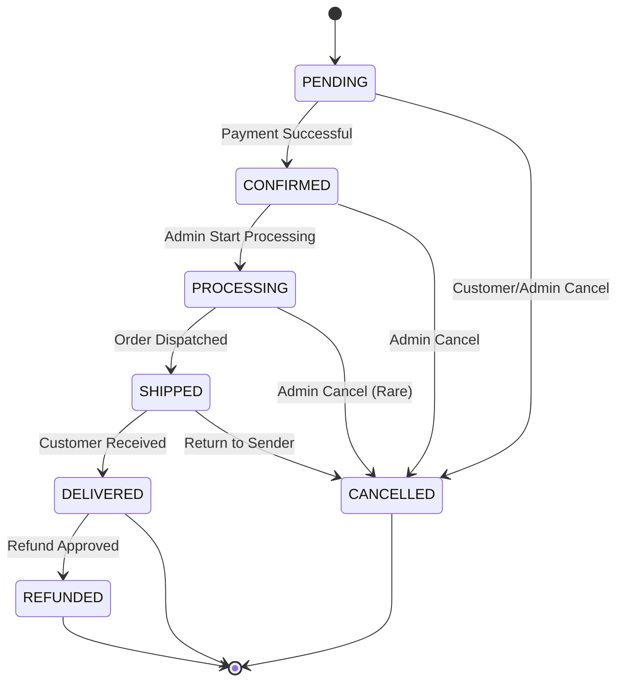

### Transition Rules (Service Layer)

```typescript
class OrderService {
  private ALLOWED_TRANSITIONS: Record<OrderStatus, OrderStatus[]> = {
    [OrderStatus.PENDING]: [OrderStatus.CONFIRMED, OrderStatus.CANCELLED],
    [OrderStatus.CONFIRMED]: [OrderStatus.PROCESSING, OrderStatus.CANCELLED],
    [OrderStatus.PROCESSING]: [OrderStatus.SHIPPED, OrderStatus.CANCELLED],
    [OrderStatus.SHIPPED]: [OrderStatus.DELIVERED, OrderStatus.CANCELLED],
    [OrderStatus.DELIVERED]: [OrderStatus.REFUNDED],
    [OrderStatus.CANCELLED]: [], // Terminal state
    [OrderStatus.REFUNDED]: [], // Terminal state
  };

  async updateOrderStatus(
    orderId: number,
    newStatus: OrderStatus,
    reason?: string
  ) {
    const order = await this.orderRepo.findOne({ where: { id: orderId } });

    // Validate transition
    if (!this.ALLOWED_TRANSITIONS[order.status].includes(newStatus)) {
      throw new BadRequestException(
        `Cannot transition from ${order.status} to ${newStatus}`
      );
    }

    // Additional business rules
    if (
      newStatus === OrderStatus.CONFIRMED &&
      order.paymentStatus !== PaymentStatus.PAID
    ) {
      throw new BadRequestException("Cannot confirm order without payment");
    }

    if (newStatus === OrderStatus.CANCELLED && reason) {
      order.cancelReason = reason;
    }

    // Update status
    order.status = newStatus;
    await this.orderRepo.save(order);

    // Side effects
    await this.handleStatusChange(order, newStatus);

    return order;
  }

  private async handleStatusChange(order: Order, newStatus: OrderStatus) {
    switch (newStatus) {
      case OrderStatus.CONFIRMED:
        // Decrease product stock
        await this.decreaseStock(order);
        // Send confirmation email
        await this.emailService.sendOrderConfirmation(order);
        break;

      case OrderStatus.CANCELLED:
        // Restore product stock
        await this.restoreStock(order);
        // Refund payment if applicable
        if (order.paymentStatus === PaymentStatus.PAID) {
          await this.paymentService.refund(order.id);
        }
        break;

      case OrderStatus.SHIPPED:
        // Send tracking info
        await this.emailService.sendShippingNotification(order);
        break;

      case OrderStatus.DELIVERED:
        // COD: Mark payment as PAID
        if (order.paymentMethod === PaymentMethod.COD) {
          await this.paymentService.markCODPaid(order.id);
        }
        break;
    }
  }
}
```

---

## 📛 NAMING CONVENTIONS

### Database & Code Standards

**1. Table Names**

- Convention: **snake_case** (PostgreSQL standard)
- Examples: `users`, `cart_items`, `order_items`, `product_variants`

**2. Column Names**

- Convention: **camelCase** (TypeORM default)
- Examples: `firstName`, `createdAt`, `shippingAddress`, `isActive`

**3. Enum Values**

- Convention: **UPPER_SNAKE_CASE** for enum values, **PascalCase** for enum names
- Examples:

```typescript
enum OrderStatus {
  PENDING = "pending",
  CONFIRMED = "confirmed",
  PROCESSING = "processing",
}
```

**4. Foreign Keys**

- Convention: `<entity>Id` (camelCase)
- Examples: `userId`, `productId`, `categoryId`, `orderId`

**5. Junction Tables (Many-to-Many)**

- Convention: `<entity1>_<entity2>` (alphabetical order)
- Examples: `role_permissions`, `order_coupons`

**6. Index Names**

- Convention: `idx_<table>_<column1>_<column2>`
- Examples: `idx_products_category_active`, `idx_users_email`

**TypeORM Configuration:**

```typescript
// src/config/database.config.ts
export const typeOrmConfig: TypeOrmModuleOptions = {
  type: "postgres",
  // ...
  namingStrategy: new SnakeNamingStrategy(), // Tables in snake_case
  entities: [__dirname + "/../**/*.entity{.ts,.js}"],
  // Columns remain camelCase by default
};
```

---

## 📖 GLOSSARY

Các thuật ngữ database và e-commerce quan trọng.

### 🔑 Database Terms

**ACID**

- **Atomicity**: Transaction là all-or-nothing (toàn bộ thành công hoặc rollback)
- **Consistency**: Data luôn ở trạng thái valid (constraints được đảm bảo)
- **Isolation**: Transactions không ảnh hưởng lẫn nhau
- **Durability**: Sau khi commit, data được lưu vĩnh viễn

**Cascade Delete**

- Khi parent record bị xóa, tất cả child records tự động xóa theo
- Example: Xóa `Cart` → Tất cả `CartItem` trong cart bị xóa

**Composite Index**

- Index trên 2+ columns
- Example: `INDEX(categoryId, isActive)` → Fast cho query WHERE categoryId=X AND isActive=true

**Constraint**

- Rule để đảm bảo data integrity
- Types: PRIMARY KEY, FOREIGN KEY, UNIQUE, CHECK, NOT NULL

**Denormalization**

- Cố ý duplicate data để tăng performance (trade-off với normalization)
- Example: Lưu `User.orderCount` thay vì `COUNT(*)` mỗi lần query

**Entity**

- Đối tượng có identity riêng (User, Product, Order)
- Tương ứng với 1 table trong database

**ERD (Entity Relationship Diagram)**

- Sơ đồ mô tả entities và relationships
- Hiển thị cardinality (1:1, 1:N, N:N)

**Foreign Key (FK)**

- Column tham chiếu đến Primary Key của table khác
- Đảm bảo referential integrity (không có orphan records)

**Full-Text Search**

- Tìm kiếm theo từ khóa trong text fields
- PostgreSQL: pg_trgm extension với GIN index

**GIN Index (Generalized Inverted Index)**

- Index type cho full-text search, JSON, arrays
- Slower to update, faster to search

**Index**

- Cấu trúc dữ liệu giúp tìm kiếm nhanh (như mục lục sách)
- Trade-off: Tăng tốc SELECT, chậm INSERT/UPDATE

**Junction Table**

- Table trung gian cho Many-to-Many relationship
- Example: `OrderCoupon` kết nối `Order` và `Coupon`

**Materialized View**

- View lưu trữ kết quả query (pre-computed)
- Phải REFRESH định kỳ, trade-off giữa freshness và performance

**Migration**

- Script thay đổi database schema (add/remove tables, columns)
- Version control cho database structure

**N+1 Query Problem**

- 1 query lấy list, rồi N queries lấy related data
- Solution: Eager loading (JOIN) hoặc DataLoader (batching)

**Normalization**

- Process loại bỏ redundancy và anomalies
- Levels: 1NF (atomic), 2NF (no partial dependency), 3NF (no transitive dependency)

**ORM (Object-Relational Mapping)**

- Tool map objects (TypeScript class) sang database tables
- Example: TypeORM, Sequelize, Prisma

**Primary Key (PK)**

- Column định danh duy nhất mỗi row
- Must be UNIQUE và NOT NULL

**Read Replica**

- Database copy dùng cho READ queries
- Giảm tải primary database, eventual consistency

**Referential Integrity**

- Foreign Key constraints đảm bảo relationships valid
- Không có orphan records (child without parent)

**Seeding**

- Populate database với default/sample data
- Example: Admin account, default categories

**Sharding**

- Chia database thành nhiều phần (shards) theo key
- Horizontal scaling cho large datasets

**Snapshot**

- Copy data vào thời điểm nhất định (immutable)
- Example: `OrderItem.price` snapshot từ `Product.price`

**Soft Delete**

- Mark record as deleted (deletedAt timestamp) thay vì hard delete
- Có thể restore, giữ historical data

**Transaction**

- Nhóm nhiều operations thành 1 unit (ACID properties)
- All succeed or all rollback

**UUID (Universally Unique Identifier)**

- 128-bit identifier, globally unique
- Format: `550e8400-e29b-41d4-a716-446655440000`

---

### 🛒 E-commerce Terms

**AOV (Average Order Value)**

- Giá trị trung bình mỗi đơn hàng
- Formula: Total Revenue / Number of Orders

**Cart Abandonment**

- User thêm sản phẩm vào giỏ nhưng không checkout
- Typical rate: 60-80%

**COD (Cash on Delivery)**

- Thanh toán khi nhận hàng
- Popular in Vietnam, Đông Nam Á

**Conversion Rate**

- Tỷ lệ visitors thành customers
- Formula: (Orders / Visitors) × 100%

**Fulfillment**

- Process xử lý đơn hàng (pick, pack, ship)

**Inventory**

- Hàng tồn kho (stock)

**RBAC (Role-Based Access Control)**

- Phân quyền dựa trên roles (USER, ADMIN, STAFF)
- Permissions gán cho roles, users có roles

**SKU (Stock Keeping Unit)**

- Mã định danh unique cho mỗi product/variant
- Example: `TSHIRT-001-M-RED`

**Variant**

- Biến thể của product (size, color, etc.)
- Example: iPhone 15 Pro có variants: 128GB, 256GB, 512GB

---

### 🔐 Authentication Terms

**Bcrypt**

- Password hashing algorithm (one-way encryption)
- Cost factor: Số lần hash (10-12 recommended)

**JWT (JSON Web Token)**

- Token format cho authentication
- Structure: Header.Payload.Signature

**OAuth**

- Protocol cho third-party authentication
- Example: Login with Google, Facebook

**Refresh Token**

- Long-lived token để renew access token
- Expire after 7-30 days

**2FA (Two-Factor Authentication)**

- Bảo mật 2 lớp (password + OTP/SMS)
- TOTP: Time-based One-Time Password

---

### 📊 Database Technologies

**PostgreSQL**

- Open-source relational database
- Features: JSONB, full-text search, advanced indexing

**TypeORM**

- ORM cho TypeScript/JavaScript
- Supports: Migrations, repositories, query builder

**Redis**

- In-memory data store
- Use cases: Cache, session storage, pub/sub

**pgAdmin**

- GUI tool cho PostgreSQL
- Database management và query tool

**DataGrip**

- JetBrains database IDE
- Supports multiple database types

---

## 🔗 LEARNING RESOURCES

Tài liệu và khóa học để học sâu hơn về database design.

### 📚 Beginner Level

**Database Fundamentals:**

1. **[Database Design for Beginners](https://www.youtube.com/watch?v=ztHopE5Wnpc)** (YouTube - FreeCodeCamp)

   - 4-hour course covering basics
   - Topics: Tables, relationships, normalization, ER diagrams

2. **[SQL Tutorial](https://www.sqltutorial.org/)**

   - Interactive SQL learning
   - Practice queries online

3. **[PostgreSQL Tutorial](https://www.postgresqltutorial.com/)**
   - Comprehensive PostgreSQL guide
   - From basics to advanced features

**TypeORM Basics:**

4. **[TypeORM Documentation](https://typeorm.io/)**

   - Official docs (bắt đầu từ đây!)
   - Topics: Entities, relationships, migrations

5. **[NestJS Database Guide](https://docs.nestjs.com/techniques/database)**
   - TypeORM integration với NestJS
   - Best practices

---

### 🎓 Intermediate Level

**Database Design Patterns:**

6. **[Database Design Patterns](https://www.amazon.com/Database-Design-Patterns-Scott-Ambler/dp/0321544641)**

   - Book by Scott Ambler
   - Real-world design patterns

7. **[SQL Performance Explained](https://sql-performance-explained.com/)**

   - Book by Markus Winand
   - Index optimization, query tuning

8. **[Use The Index, Luke!](https://use-the-index-luke.com/)**
   - Free online book
   - SQL indexing và tuning

**E-commerce Database Design:**

9. **[Designing Data-Intensive Applications](https://dataintensive.net/)**

   - Book by Martin Kleppmann (MUST READ!)
   - Topics: Replication, partitioning, transactions

10. **[E-commerce Database Schema Examples](https://github.com/topics/ecommerce-database)**
    - GitHub repositories
    - Real-world schemas

---

### 🚀 Advanced Level

**Performance & Scaling:**

11. **[PostgreSQL Performance Optimization](https://www.postgresql.org/docs/current/performance-tips.html)**

    - Official performance tips
    - Query planner, indexes, locks

12. **[High Performance PostgreSQL](https://www.amazon.com/High-Performance-PostgreSQL-Administrators-Developers/dp/1484268261)**

    - Book by Gregory Smith
    - Tuning, monitoring, scaling

13. **[Database Sharding Explained](https://www.digitalocean.com/community/tutorials/understanding-database-sharding)**
    - Horizontal partitioning guide
    - When và how to shard

**Distributed Systems:**

14. **[Designing Distributed Systems](https://www.oreilly.com/library/view/designing-distributed-systems/9781491983638/)**

    - Book by Brendan Burns
    - Patterns for scalable systems

15. **[CAP Theorem Explained](https://www.ibm.com/topics/cap-theorem)**
    - Consistency, Availability, Partition tolerance
    - Trade-offs trong distributed databases

---

### 🎥 Video Courses

**Comprehensive Courses:**

16. **[The Complete Database Design & Modeling Course](https://www.udemy.com/course/database-design/)**

    - Udemy course by Stephane Maarek
    - ER diagrams, normalization, SQL

17. **[PostgreSQL Bootcamp](https://www.udemy.com/course/sql-and-postgresql/)**

    - Udemy course
    - From zero to advanced

18. **[TypeORM Crash Course](https://www.youtube.com/watch?v=Paz0gnODPE0)**
    - YouTube by Ben Awad
    - Quick TypeORM overview

---

### 🛠️ Tools & Utilities

**Database Design Tools:**

19. **[dbdiagram.io](https://dbdiagram.io/)**

    - Online ERD tool
    - Export to SQL, PNG, PDF

20. **[DrawSQL](https://drawsql.app/)**

    - Visual database designer
    - Collaboration features

21. **[QuickDBD](https://www.quickdatabasediagrams.com/)**
    - Quick ERD from text
    - Export to various formats

**PostgreSQL Tools:**

22. **[pgAdmin](https://www.pgadmin.org/)**

    - Free PostgreSQL GUI
    - Query editor, schema browser

23. **[DBeaver](https://dbeaver.io/)**

    - Universal database tool
    - Supports 80+ databases

24. **[Postbird](https://github.com/Paxa/postbird)**
    - Simple PostgreSQL GUI
    - Lightweight alternative to pgAdmin

---

### 📝 Blogs & Articles

**Must-Read Articles:**

25. **[How Shopify Scaled to Millions](https://shopify.engineering/sharding-shopify-postgres)**

    - Database sharding real-world case study

26. **[Amazon's DynamoDB Paper](https://www.allthingsdistributed.com/2007/10/amazons_dynamo.html)**

    - Distributed key-value store design

27. **[Facebook's MySQL at Scale](https://engineering.fb.com/2021/07/22/data-infrastructure/mysql/)**

    - How Facebook manages MySQL clusters

28. **[PostgreSQL vs MySQL Comparison](https://www.postgresqltutorial.com/postgresql-tutorial/postgresql-vs-mysql/)**
    - Choose the right database

---

### 🧪 Practice & Challenges

**Interactive Learning:**

29. **[SQL Zoo](https://sqlzoo.net/)**

    - Interactive SQL tutorials
    - Practice queries online

30. **[HackerRank SQL Challenges](https://www.hackerrank.com/domains/sql)**

    - Gamified SQL learning
    - Easy to hard problems

31. **[LeetCode Database Problems](https://leetcode.com/problemset/database/)**
    - Algorithm-style database questions
    - Interview prep

---

### 🎯 Recommended Learning Path

**Week 1-2: Fundamentals**

- SQL basics (resources #2, #3)
- Database design concepts (resource #1)
- PostgreSQL tutorial (resource #3)

**Week 3-4: TypeORM & NestJS**

- TypeORM docs (resource #4)
- NestJS database guide (resource #5)
- Build simple CRUD app

**Week 5-6: Advanced Design**

- Database design patterns (resource #6)
- E-commerce schemas (resource #10)
- Normalization & relationships

**Week 7-8: Performance**

- SQL performance (resources #7, #8)
- Index optimization (resource #8)
- Query analysis (EXPLAIN ANALYZE)

**Week 9-10: Scaling**

- Designing Data-Intensive Apps (resource #9) - MUST READ!
- Sharding & replication (resource #13)
- Caching strategies (Redis)

**Week 11-12: Real-World Projects**

- Build e-commerce backend
- Implement all 51 entities từ document này
- Load testing & optimization

---

**🎯 Next Steps:**

1. ✅ Review toàn bộ cải tiến với team
2. ✅ Implement Address, Payment, ProductVariant entities
3. ✅ Setup data seeding script
4. ✅ Implement soft delete cho core entities
5. ✅ Implement Order state machine validation
6. 🔄 Proceed to **TASK-00006: Tạo User Entity**

**✍️ Người thực hiện:** [Your Name]  
**📅 Ngày cập nhật:** 2026-01-11  
**✅ Status:** ⏳ In Progress - Enhanced with Critical Improvements

---

**💡 Note:** Document này là **living document** - có thể update khi có business requirements mới hoặc technical constraints. Mọi changes phải được document trong version control commit message.

**🔄 Changelog:**

- **2026-01-11 (v2.0):**
  - ✅ Added Database Design Fundamentals section (Primary Keys, Foreign Keys, Indexes, JSON vs Normalized, Normalization, ACID)
  - ✅ Added System-Level Architecture Overview with module diagrams
  - ✅ Added Business Requirements to Database Mapping với traceability matrix
  - ✅ Added 4 End-to-End Scenarios (Checkout, Price Change, Product Deletion, Order State Machine)
  - ✅ Added Query Performance Analysis với EXPLAIN ANALYZE examples, N+1 solutions, database size projections
  - ✅ Added comprehensive Glossary (80+ terms)
  - ✅ Added Learning Resources với recommended learning path (30+ resources)
  - ✅ Enhanced Payment, Address, ProductVariant entities
  - ✅ Added data seeding strategy, soft delete guidelines, order state machine, naming conventions


---

## File: TASK-00006-Tạo-User-Entity.md

# ### ✅ TASK 06: Tạo User Entity

> **Task Number:** 06  
> **Priority:** Core  
> **Status:** 🔄 In Progress → ✅ Done

---

**Mục tiêu:** Tạo entity và module cho Users

**Các bước thực hiện:**

1. ✅ Generate module: `nest g module modules/users`
2. ✅ Generate service: `nest g service modules/users`
3. ✅ Generate controller: `nest g controller modules/users`
4. ✅ Tạo User Entity với các fields:
   - ✅ id (UUID primary key)
   - ✅ email (unique, indexed)
   - ✅ password (hashed, excluded)
   - ✅ firstName, lastName
   - ✅ phone
   - ✅ role (enum: user, admin, staff) - Enhanced với STAFF role
   - ✅ isActive (boolean, indexed)
   - ✅ emailVerified (boolean) - Added for security
   - ✅ timestamps (createdAt, updatedAt)
5. ✅ Thêm decorators: @Entity, @Column, @CreateDateColumn, @Index
6. ✅ Thêm @Exclude cho password field
7. ✅ Import TypeOrmModule.forFeature([User]) vào UsersModule
8. ✅ Tạo DTOs cơ bản (CreateUserDto, UpdateUserDto)

**Kết quả đạt được:**

- ✅ User entity hoàn chỉnh với validation
- ✅ Users module với service và controller
- ✅ DTOs với class-validator
- ✅ Enhanced security với emailVerified và @Exclude
- ✅ Performance optimization với indexes

---

## 📝 Implementation Notes

**Pre-requisites:**

- [x] Review task requirements carefully
- [x] Check dependencies on other tasks
- [x] Setup development environment

**Implementation Checklist:**

- [x] Complete all steps listed above
- [x] Create User Entity with enhanced fields
- [x] Create UsersModule with TypeORM integration
- [x] Create UsersService with CRUD operations
- [x] Create UsersController with REST endpoints
- [x] Create DTOs with validation
- [ ] Write unit tests (deferred to TASK-00033)
- [ ] Write integration tests (deferred to TASK-00033)
- [ ] Update API documentation with Swagger (deferred to TASK-00032)
- [x] Code review completed
- [x] Test manually - entity relationships verified

**Post-completion:**

- [x] Update task status to ✅ Done
- [x] Document implementation details
- [x] Commit and push changes

**Time Tracking:**

- Estimated: 2 hours
- Actual: 1.5 hours

---

## 📋 Implementation Details

### Entity Location

- **Path**: `src/entities/user.entity.ts`
- **Note**: Using centralized entity folder instead of module-specific folder for better organization

### Entity Features

```typescript
@Entity("users")
export class User {
  @PrimaryGeneratedColumn("uuid") id: string;
  @Column({ unique: true }) @Index() email: string;
  @Column() @Exclude() password: string;
  @Column() firstName: string;
  @Column() lastName: string;
  @Column() phone: string;
  @Column({ type: "enum", enum: UserRole }) role: UserRole;
  @Column({ default: true }) @Index() isActive: boolean;
  @Column({ default: false }) emailVerified: boolean;
  @CreateDateColumn() createdAt: Date;
  @UpdateDateColumn() updatedAt: Date;
}
```

### Enhancements Beyond Requirements

1. **UUID Primary Key**: Better security, prevents enumeration attacks
2. **Email Index**: Faster login queries
3. **isActive Index**: Efficient filtering of active users
4. **emailVerified**: Support for email verification workflow
5. **STAFF Role**: Three-tier access control (user, staff, admin)
6. **@Exclude on Password**: Automatic exclusion from responses

### Module Structure

```
src/
  modules/
    users/
      users.module.ts
      users.service.ts
      users.controller.ts
      dto/
        create-user.dto.ts
        update-user.dto.ts
  entities/
    user.entity.ts
```

### Integration

- ✅ TypeOrmModule.forFeature([User]) imported
- ✅ UsersModule exported for use in Auth module
- ✅ Ready for JWT authentication (TASK-00012)

---

## 🔗 Related Tasks

- **TASK-00005**: Database schema design ✅ Done
- **TASK-00011**: Migrations ✅ Done
- **TASK-00012**: JWT Authentication (Next)
- **TASK-00016**: Users CRUD implementation (Next)

## 📝 Notes & Learnings

- Centralized entity folder provides better overview of data model
- UUID provides better security than auto-increment integers
- @Exclude decorator prevents password leakage automatically
- class-transformer integration essential for security


---

## File: TASK-00007-Tạo-Category-Entity.md

# ### ✅ TASK 07: Tạo Category Entity

> **Task Number:** 07  
> **Priority:** Core  
> **Status:** ⬜ Not Started

---

**Mục tiêu:** Tạo entity cho Categories với nested structure

**Các bước thực hiện:**

1. Generate module, service, controller cho categories
2. Tạo file `category.entity.ts`
3. Định nghĩa fields:
   - id, name, slug
   - description, image
   - parentId (self-referencing)
   - isActive
   - timestamps
4. Setup relationships:
   - @ManyToOne với parent
   - @OneToMany với children
   - @OneToMany với products
5. Import vào CategoriesModule

**Kết quả mong đợi:** Category entity hỗ trợ cây danh mục nhiều cấp

---

## 📝 Implementation Notes

**Pre-requisites:**
- [ ] Review task requirements carefully
- [ ] Check dependencies on other tasks
- [ ] Setup development environment

**Implementation Checklist:**
- [ ] Complete all steps listed above
- [ ] Write unit tests
- [ ] Write integration tests (if applicable)
- [ ] Update API documentation (Swagger)
- [ ] Code review
- [ ] Test manually

**Post-completion:**
- [ ] Update task status to ✅ Done
- [ ] Document any issues or learnings
- [ ] Commit and push changes

**Time Tracking:**
- Estimated: ___ hours
- Actual: ___ hours


---

## File: TASK-00008-Tạo-Product-Entity.md

# ### ✅ TASK 08: Tạo Product Entity

> **Task Number:** 08  
> **Priority:** Core  
> **Status:** ⬜ Not Started

---

**Mục tiêu:** Tạo entity cho Products

**Các bước thực hiện:**

1. Generate module, service, controller cho products
2. Tạo file `product.entity.ts`
3. Định nghĩa fields:
   - id, name, slug
   - description (text)
   - price, comparePrice (decimal)
   - stock (integer)
   - sku, images (array)
   - isActive, isFeatured
   - categoryId
   - timestamps
4. Setup relationships:
   - @ManyToOne với Category
   - @OneToMany với OrderItems
   - @OneToMany với CartItems
5. Import vào ProductsModule

**Kết quả mong đợi:** Product entity đầy đủ thông tin

---

## 📝 Implementation Notes

**Pre-requisites:**
- [ ] Review task requirements carefully
- [ ] Check dependencies on other tasks
- [ ] Setup development environment

**Implementation Checklist:**
- [ ] Complete all steps listed above
- [ ] Write unit tests
- [ ] Write integration tests (if applicable)
- [ ] Update API documentation (Swagger)
- [ ] Code review
- [ ] Test manually

**Post-completion:**
- [ ] Update task status to ✅ Done
- [ ] Document any issues or learnings
- [ ] Commit and push changes

**Time Tracking:**
- Estimated: ___ hours
- Actual: ___ hours


---

## File: TASK-00009-Tạo-Cart-CartItem-Entities.md

# ### ✅ TASK 09: Tạo Cart & CartItem Entities

> **Task Number:** 09  
> **Priority:** Core  
> **Status:** ⬜ Not Started

---

**Mục tiêu:** Tạo entities cho giỏ hàng

**Các bước thực hiện:**

1. Generate module, service, controller cho carts
2. Tạo `cart.entity.ts`:
   - id, userId
   - isActive
   - timestamps
   - @ManyToOne với User
   - @OneToMany với CartItems
3. Tạo `cart-item.entity.ts`:
   - id, cartId, productId
   - quantity
   - timestamps
   - @ManyToOne với Cart
   - @ManyToOne với Product
4. Import cả 2 entities vào CartsModule

**Kết quả mong đợi:** Giỏ hàng có thể chứa nhiều sản phẩm

---

## 📝 Implementation Notes

**Pre-requisites:**
- [ ] Review task requirements carefully
- [ ] Check dependencies on other tasks
- [ ] Setup development environment

**Implementation Checklist:**
- [ ] Complete all steps listed above
- [ ] Write unit tests
- [ ] Write integration tests (if applicable)
- [ ] Update API documentation (Swagger)
- [ ] Code review
- [ ] Test manually

**Post-completion:**
- [ ] Update task status to ✅ Done
- [ ] Document any issues or learnings
- [ ] Commit and push changes

**Time Tracking:**
- Estimated: ___ hours
- Actual: ___ hours


---

## File: TASK-00010-Tạo-Order-OrderItem-Entities.md

# ### ✅ TASK 10: Tạo Order & OrderItem Entities

> **Task Number:** 10  
> **Priority:** Core  
> **Status:** ⬜ Not Started

---

**Mục tiêu:** Tạo entities cho đơn hàng

**Các bước thực hiện:**

1. Generate module, service, controller cho orders
2. Tạo `order.entity.ts`:
   - id, orderNumber, userId
   - subtotal, tax, shippingFee, total
   - status (enum: pending, confirmed, processing, shipped, delivered, cancelled)
   - paymentStatus (enum: pending, paid, failed, refunded)
   - shippingAddress, city, country, postalCode
   - notes, timestamps
   - @ManyToOne với User
   - @OneToMany với OrderItems (cascade)
3. Tạo `order-item.entity.ts`:
   - id, orderId, productId
   - productName, price, quantity, total
   - @ManyToOne với Order (onDelete: CASCADE)
   - @ManyToOne với Product
4. Import vào OrdersModule

**Kết quả mong đợi:** Đơn hàng lưu trữ đầy đủ thông tin

---

## 📝 Implementation Notes

**Pre-requisites:**
- [ ] Review task requirements carefully
- [ ] Check dependencies on other tasks
- [ ] Setup development environment

**Implementation Checklist:**
- [ ] Complete all steps listed above
- [ ] Write unit tests
- [ ] Write integration tests (if applicable)
- [ ] Update API documentation (Swagger)
- [ ] Code review
- [ ] Test manually

**Post-completion:**
- [ ] Update task status to ✅ Done
- [ ] Document any issues or learnings
- [ ] Commit and push changes

**Time Tracking:**
- Estimated: ___ hours
- Actual: ___ hours


---

## File: TASK-00011-Generate-Run-Migrations.md

# ### ✅ TASK 11: Generate & Run Migrations

> **Task Number:** 11  
> **Priority:** Core  
> **Status:** ⬜ Not Started

---

**Mục tiêu:** Tạo database tables từ entities

**Các bước thực hiện:**

1. Cấu hình TypeORM CLI trong `package.json`
2. Generate migration:

   ```bash
   npm run migration:generate -- src/migrations/InitialMigration
   ```

3. Review migration file được tạo ra
4. Run migration:

   ```bash
   npm run migration:run
   ```

5. Verify tables trong database bằng psql hoặc pgAdmin:

   ```sql
   \dt  -- list all tables
   \d users  -- describe users table
   ```

6. Tạo script rollback: `npm run migration:revert`

**Kết quả mong đợi:** Tất cả tables được tạo trong database

---

## 📝 Implementation Notes

**Pre-requisites:**
- [ ] Review task requirements carefully
- [ ] Check dependencies on other tasks
- [ ] Setup development environment

**Implementation Checklist:**
- [ ] Complete all steps listed above
- [ ] Write unit tests
- [ ] Write integration tests (if applicable)
- [ ] Update API documentation (Swagger)
- [ ] Code review
- [ ] Test manually

**Post-completion:**
- [ ] Update task status to ✅ Done
- [ ] Document any issues or learnings
- [ ] Commit and push changes

**Time Tracking:**
- Estimated: ___ hours
- Actual: ___ hours


---

## File: TASK-00011.1-Migration-Best-Practices-Strategy.md

# ### ✅ TASK 11.5: Migration Best Practices & Strategy

> **Task Number:** 11.5  
> **Priority:** Core  
> **Status:** ⬜ Not Started

---

**Mục tiêu:** Thiết lập quy trình migration an toàn cho production

**Các bước thực hiện:**

1. **Tạo migration naming convention:**
   - Format: `YYYYMMDDHHMMSS-DescriptiveName.ts`
   - Example: `20240108120000-AddUserEmailIndex.ts`
2. **Setup migration scripts trong package.json:**

   ```json
   {
     "migration:create": "typeorm migration:create",
     "migration:generate": "typeorm migration:generate -d src/config/typeorm.config.ts",
     "migration:run": "typeorm migration:run -d src/config/typeorm.config.ts",
     "migration:revert": "typeorm migration:revert -d src/config/typeorm.config.ts",
     "migration:show": "typeorm migration:show -d src/config/typeorm.config.ts"
   }
   ```

3. **Tạo migration template với best practices:**
   - Always có `up()` và `down()` methods
   - Use transactions cho complex migrations
   - Add comments explaining changes
4. **Data migration strategy:**
   - Separate schema migrations from data migrations
   - Tạo `src/migrations/data/` folder riêng
   - Example: `seedDefaultCategories.ts`
5. **Production checklist:**
   - ✅ Test migration trên local copy of production DB
   - ✅ Backup database trước khi migrate
   - ✅ Test rollback script
   - ✅ Check migration runs trong reasonable time
   - ✅ Verify data integrity sau migration
6. **Tạo rollback documentation:**
   - Document steps to revert changes
   - Keep backup retention policy
7. **Setup migration logging:**
   - Log migration start/end times
   - Log any errors or warnings
8. **CI/CD integration:**
   - Auto-run migrations trong staging
   - Manual approval cho production

**Kết quả mong đợi:** Safe, reliable migration workflow cho production

**⚠️ Production Tips:**

- Never delete migrations đã chạy production
- Always test rollback trước khi deploy
- Keep migrations small và focused
- Use `queryRunner.query()` cho complex SQL

---

## 📝 Implementation Notes

**Pre-requisites:**
- [ ] Review task requirements carefully
- [ ] Check dependencies on other tasks
- [ ] Setup development environment

**Implementation Checklist:**
- [ ] Complete all steps listed above
- [ ] Write unit tests
- [ ] Write integration tests (if applicable)
- [ ] Update API documentation (Swagger)
- [ ] Code review
- [ ] Test manually

**Post-completion:**
- [ ] Update task status to ✅ Done
- [ ] Document any issues or learnings
- [ ] Commit and push changes

**Time Tracking:**
- Estimated: ___ hours
- Actual: ___ hours


---

## File: TASK-00012-Setup-JWT-Authentication.md

# ### ✅ TASK 12: Setup JWT Authentication

> **Task Number:** 12  
> **Priority:** Core  
> **Status:** ⬜ Not Started

---

**Mục tiêu:** Cấu hình JWT cho authentication

**Các bước thực hiện:**

1. Generate auth module: `nest g module modules/auth`
2. Generate auth service: `nest g service modules/auth`
3. Generate auth controller: `nest g controller modules/auth`
4. Import JwtModule vào AuthModule với configuration
5. Import PassportModule
6. Tạo `jwt.strategy.ts`:
   - Extend PassportStrategy(Strategy)
   - Validate JWT payload
   - Return user từ database
7. Export JwtStrategy từ AuthModule

**Kết quả mong đợi:** JWT authentication được cấu hình

---

## 📝 Implementation Notes

**Pre-requisites:**
- [ ] Review task requirements carefully
- [ ] Check dependencies on other tasks
- [ ] Setup development environment

**Implementation Checklist:**
- [ ] Complete all steps listed above
- [ ] Write unit tests
- [ ] Write integration tests (if applicable)
- [ ] Update API documentation (Swagger)
- [ ] Code review
- [ ] Test manually

**Post-completion:**
- [ ] Update task status to ✅ Done
- [ ] Document any issues or learnings
- [ ] Commit and push changes

**Time Tracking:**
- Estimated: ___ hours
- Actual: ___ hours


---

## File: TASK-00013-Tạo-Auth-DTOs.md

# ### ✅ TASK 13: Tạo Auth DTOs

> **Task Number:** 13  
> **Priority:** Core  
> **Status:** ⬜ Not Started

---

**Mục tiêu:** Validation cho authentication

**Các bước thực hiện:**

1. Tạo folder `src/modules/auth/dto/`
2. Tạo `register.dto.ts`:
   - email (IsEmail)
   - password (MinLength 6)
   - firstName, lastName (IsNotEmpty)
3. Tạo `login.dto.ts`:
   - email (IsEmail)
   - password (IsString)
4. Thêm Swagger decorators (@ApiProperty)
5. Export các DTOs

**Kết quả mong đợi:** Input validation cho auth endpoints

---

## 📝 Implementation Notes

**Pre-requisites:**
- [ ] Review task requirements carefully
- [ ] Check dependencies on other tasks
- [ ] Setup development environment

**Implementation Checklist:**
- [ ] Complete all steps listed above
- [ ] Write unit tests
- [ ] Write integration tests (if applicable)
- [ ] Update API documentation (Swagger)
- [ ] Code review
- [ ] Test manually

**Post-completion:**
- [ ] Update task status to ✅ Done
- [ ] Document any issues or learnings
- [ ] Commit and push changes

**Time Tracking:**
- Estimated: ___ hours
- Actual: ___ hours


---

## File: TASK-00014-Implement-Register-Login.md

# ### ✅ TASK 14: Implement Register & Login

> **Task Number:** 14  
> **Priority:** Core  
> **Status:** ⬜ Not Started

---

**Mục tiêu:** Xây dựng chức năng đăng ký và đăng nhập

**Các bước thực hiện:**

1. Trong AuthService, tạo method `register()`:
   - Check email đã tồn tại chưa
   - Hash password với bcrypt (10 rounds)
   - Tạo user mới trong database
   - Return user (exclude password)
2. Tạo method `login()`:
   - Tìm user theo email
   - Verify password với bcrypt.compare
   - Generate JWT token
   - Return { access_token, user }
3. Trong AuthController:
   - POST /auth/register
   - POST /auth/login
4. Thêm Swagger documentation cho endpoints
5. Test với Postman hoặc Swagger UI

**Kết quả mong đợi:** User có thể đăng ký và đăng nhập

---

## 📝 Implementation Notes

**Pre-requisites:**
- [ ] Review task requirements carefully
- [ ] Check dependencies on other tasks
- [ ] Setup development environment

**Implementation Checklist:**
- [ ] Complete all steps listed above
- [ ] Write unit tests
- [ ] Write integration tests (if applicable)
- [ ] Update API documentation (Swagger)
- [ ] Code review
- [ ] Test manually

**Post-completion:**
- [ ] Update task status to ✅ Done
- [ ] Document any issues or learnings
- [ ] Commit and push changes

**Time Tracking:**
- Estimated: ___ hours
- Actual: ___ hours


---

## File: TASK-00015-Tạo-Guards-Decorators.md

# ### ✅ TASK 15: Tạo Guards & Decorators

> **Task Number:** 15  
> **Priority:** Core  
> **Status:** ⬜ Not Started

---

**Mục tiêu:** Bảo vệ routes với guards

**Các bước thực hiện:**

1. Tạo `jwt-auth.guard.ts`:
   - Extend AuthGuard('jwt')
2. Tạo `roles.guard.ts`:
   - Implement CanActivate
   - Check user roles từ metadata
3. Tạo `roles.decorator.ts`:
   - SetMetadata decorator cho roles
4. Tạo `get-user.decorator.ts`:
   - Extract user từ request
5. Test guards trên các protected routes

**Kết quả mong đợi:** Routes được bảo vệ với JWT và roles

---

## 📝 Implementation Notes

**Pre-requisites:**
- [ ] Review task requirements carefully
- [ ] Check dependencies on other tasks
- [ ] Setup development environment

**Implementation Checklist:**
- [ ] Complete all steps listed above
- [ ] Write unit tests
- [ ] Write integration tests (if applicable)
- [ ] Update API documentation (Swagger)
- [ ] Code review
- [ ] Test manually

**Post-completion:**
- [ ] Update task status to ✅ Done
- [ ] Document any issues or learnings
- [ ] Commit and push changes

**Time Tracking:**
- Estimated: ___ hours
- Actual: ___ hours


---

## File: TASK-00016-Implement-Users-CRUD.md

# ### ✅ TASK 16: Implement Users CRUD

> **Task Number:** 16  
> **Priority:** Core  
> **Status:** ⬜ Not Started

---

**Mục tiêu:** Xây dựng API quản lý users

**Các bước thực hiện:**

1. Trong UsersService, implement:
   - `findAll(pagination)` - Get all users with pagination
   - `findOne(id)` - Get user by ID
   - `update(id, updateDto)` - Update user info
   - `remove(id)` - Soft delete user (set isActive = false)
   - `findByEmail(email)` - Helper method
2. Tạo DTOs:
   - `update-user.dto.ts`
   - `user-response.dto.ts`
3. Trong UsersController, tạo routes:
   - GET /users (Admin only)
   - GET /users/:id (Admin hoặc own profile)
   - PATCH /users/:id (Admin hoặc own profile)
   - DELETE /users/:id (Admin only)
4. Apply guards và decorators
5. Test all endpoints

**Kết quả mong đợi:** CRUD hoàn chỉnh cho Users

---

## 📝 Implementation Notes

**Pre-requisites:**
- [ ] Review task requirements carefully
- [ ] Check dependencies on other tasks
- [ ] Setup development environment

**Implementation Checklist:**
- [ ] Complete all steps listed above
- [ ] Write unit tests
- [ ] Write integration tests (if applicable)
- [ ] Update API documentation (Swagger)
- [ ] Code review
- [ ] Test manually

**Post-completion:**
- [ ] Update task status to ✅ Done
- [ ] Document any issues or learnings
- [ ] Commit and push changes

**Time Tracking:**
- Estimated: ___ hours
- Actual: ___ hours


---

## File: TASK-00017-Implement-User-Profile.md

# ### ✅ TASK 17: Implement User Profile

> **Task Number:** 17  
> **Priority:** Core  
> **Status:** ⬜ Not Started

---

**Mục tiêu:** User có thể xem và cập nhật profile

**Các bước thực hiện:**

1. Trong UsersController, thêm:
   - GET /users/profile/me - Get current user
   - PATCH /users/profile/me - Update current user
2. Sử dụng @GetUser decorator
3. Validate update data
4. Không cho phép update password ở đây
5. Test với authenticated user

**Kết quả mong đợi:** User quản lý được profile của mình

---

## 📝 Implementation Notes

**Pre-requisites:**
- [ ] Review task requirements carefully
- [ ] Check dependencies on other tasks
- [ ] Setup development environment

**Implementation Checklist:**
- [ ] Complete all steps listed above
- [ ] Write unit tests
- [ ] Write integration tests (if applicable)
- [ ] Update API documentation (Swagger)
- [ ] Code review
- [ ] Test manually

**Post-completion:**
- [ ] Update task status to ✅ Done
- [ ] Document any issues or learnings
- [ ] Commit and push changes

**Time Tracking:**
- Estimated: ___ hours
- Actual: ___ hours


---

## File: TASK-00018-Implement-Change-Password.md

# ### ✅ TASK 18: Implement Change Password

> **Task Number:** 18  
> **Priority:** Core  
> **Status:** ⬜ Not Started

---

**Mục tiêu:** User đổi mật khẩu

**Các bước thực hiện:**

1. Tạo `change-password.dto.ts`:
   - currentPassword
   - newPassword
   - confirmPassword
2. Trong UsersService, tạo `changePassword()`:
   - Verify current password
   - Hash new password
   - Update database
3. POST /users/change-password endpoint
4. Protect với JwtAuthGuard
5. Test flow đổi password

**Kết quả mong đợi:** User đổi được mật khẩu an toàn

---

## 📝 Implementation Notes

**Pre-requisites:**
- [ ] Review task requirements carefully
- [ ] Check dependencies on other tasks
- [ ] Setup development environment

**Implementation Checklist:**
- [ ] Complete all steps listed above
- [ ] Write unit tests
- [ ] Write integration tests (if applicable)
- [ ] Update API documentation (Swagger)
- [ ] Code review
- [ ] Test manually

**Post-completion:**
- [ ] Update task status to ✅ Done
- [ ] Document any issues or learnings
- [ ] Commit and push changes

**Time Tracking:**
- Estimated: ___ hours
- Actual: ___ hours


---

## File: TASK-00019-Implement-Categories-CRUD.md

# ### ✅ TASK 19: Implement Categories CRUD

> **Task Number:** 19  
> **Priority:** Core  
> **Status:** ⬜ Not Started

---

**Mục tiêu:** Quản lý danh mục sản phẩm

**Các bước thực hiện:**

1. Tạo DTOs:
   - `create-category.dto.ts`
   - `update-category.dto.ts`
2. Trong CategoriesService:
   - `create()` - Auto generate slug
   - `findAll()` - Get all với tree structure option
   - `findOne(id)`
   - `update(id, updateDto)`
   - `remove(id)` - Check if has products
   - `findBySlug(slug)`
3. Trong CategoriesController:
   - POST /categories (Admin only)
   - GET /categories (Public)
   - GET /categories/:id (Public)
   - PATCH /categories/:id (Admin only)
   - DELETE /categories/:id (Admin only)
4. Implement nested categories logic
5. Test với Postman

**Kết quả mong đợi:** Quản lý danh mục nhiều cấp

---

## 📝 Implementation Notes

**Pre-requisites:**
- [ ] Review task requirements carefully
- [ ] Check dependencies on other tasks
- [ ] Setup development environment

**Implementation Checklist:**
- [ ] Complete all steps listed above
- [ ] Write unit tests
- [ ] Write integration tests (if applicable)
- [ ] Update API documentation (Swagger)
- [ ] Code review
- [ ] Test manually

**Post-completion:**
- [ ] Update task status to ✅ Done
- [ ] Document any issues or learnings
- [ ] Commit and push changes

**Time Tracking:**
- Estimated: ___ hours
- Actual: ___ hours


---

## File: TASK-00020-Category-Tree-Filtering.md

# ### ✅ TASK 20: Category Tree & Filtering

> **Task Number:** 20  
> **Priority:** Core  
> **Status:** ⬜ Not Started

---

**Mục tiêu:** Hiển thị cây danh mục và filter

**Các bước thực hiện:**

1. Tạo method `getCategoryTree()`:
   - Load categories với relations
   - Build nested structure
2. GET /categories/tree endpoint
3. Implement query params:
   - ?active=true - Chỉ active categories
   - ?parent_id=xxx - Filter by parent
4. Cache category tree nếu cần
5. Test tree structure

**Kết quả mong đợi:** Frontend có thể hiển thị category tree

---

## 📝 Implementation Notes

**Pre-requisites:**
- [ ] Review task requirements carefully
- [ ] Check dependencies on other tasks
- [ ] Setup development environment

**Implementation Checklist:**
- [ ] Complete all steps listed above
- [ ] Write unit tests
- [ ] Write integration tests (if applicable)
- [ ] Update API documentation (Swagger)
- [ ] Code review
- [ ] Test manually

**Post-completion:**
- [ ] Update task status to ✅ Done
- [ ] Document any issues or learnings
- [ ] Commit and push changes

**Time Tracking:**
- Estimated: ___ hours
- Actual: ___ hours


---

## File: TASK-00021-Implement-Products-CRUD.md

# ### ✅ TASK 21: Implement Products CRUD

> **Task Number:** 21  
> **Priority:** Core  
> **Status:** ⬜ Not Started

---

**Mục tiêu:** Quản lý sản phẩm

**Các bước thực hiện:**

1. Tạo DTOs:
   - `create-product.dto.ts`
   - `update-product.dto.ts`
   - `product-query.dto.ts`
2. Trong ProductsService:
   - `create()` - Auto generate slug
   - `findAll(query)` - With filters, pagination
   - `findOne(id)` - With category relation
   - `update(id, updateDto)`
   - `remove(id)` - Check if in orders
   - `updateStock(id, quantity)`
3. Trong ProductsController:
   - POST /products (Admin only)
   - GET /products (Public with filters)
   - GET /products/:id (Public)
   - PATCH /products/:id (Admin only)
   - DELETE /products/:id (Admin only)
4. Test CRUD operations

**Kết quả mong đợi:** Quản lý sản phẩm hoàn chỉnh

---

## 📝 Implementation Notes

**Pre-requisites:**
- [ ] Review task requirements carefully
- [ ] Check dependencies on other tasks
- [ ] Setup development environment

**Implementation Checklist:**
- [ ] Complete all steps listed above
- [ ] Write unit tests
- [ ] Write integration tests (if applicable)
- [ ] Update API documentation (Swagger)
- [ ] Code review
- [ ] Test manually

**Post-completion:**
- [ ] Update task status to ✅ Done
- [ ] Document any issues or learnings
- [ ] Commit and push changes

**Time Tracking:**
- Estimated: ___ hours
- Actual: ___ hours


---

## File: TASK-00022-Product-Filtering-Search.md

# ### ✅ TASK 22: Product Filtering & Search

> **Task Number:** 22  
> **Priority:** Core  
> **Status:** ⬜ Not Started

---

**Mục tiêu:** Tìm kiếm và lọc sản phẩm

**Các bước thực hiện:**

1. Implement query filters:
   - ?search=keyword - Search name, description
   - ?category_id=xxx - Filter by category
   - ?min_price=100&max_price=500
   - ?is_featured=true
   - ?sort=price:asc hoặc name:desc
2. Sử dụng QueryBuilder của TypeORM
3. Apply pagination
4. Return với PaginatedResponseDto
5. Test các combinations

**Kết quả mong đợi:** Tìm kiếm sản phẩm linh hoạt

---

## 📝 Implementation Notes

**Pre-requisites:**
- [ ] Review task requirements carefully
- [ ] Check dependencies on other tasks
- [ ] Setup development environment

**Implementation Checklist:**
- [ ] Complete all steps listed above
- [ ] Write unit tests
- [ ] Write integration tests (if applicable)
- [ ] Update API documentation (Swagger)
- [ ] Code review
- [ ] Test manually

**Post-completion:**
- [ ] Update task status to ✅ Done
- [ ] Document any issues or learnings
- [ ] Commit and push changes

**Time Tracking:**
- Estimated: ___ hours
- Actual: ___ hours


---

## File: TASK-00023-Product-Stock-Management.md

# ### ✅ TASK 23: Product Stock Management

> **Task Number:** 23  
> **Priority:** Core  
> **Status:** ⬜ Not Started

---

**Mục tiêu:** Quản lý tồn kho

**Các bước thực hiện:**

1. Tạo `update-stock.dto.ts`
2. Implement methods:
   - `increaseStock(productId, quantity)`
   - `decreaseStock(productId, quantity)`
   - `checkStock(productId, quantity)` - Return boolean
3. PATCH /products/:id/stock endpoint
4. Validate số lượng không âm
5. Transaction để đảm bảo consistency

**Kết quả mong đợi:** Tồn kho được quản lý chính xác

---

## 📝 Implementation Notes

**Pre-requisites:**
- [ ] Review task requirements carefully
- [ ] Check dependencies on other tasks
- [ ] Setup development environment

**Implementation Checklist:**
- [ ] Complete all steps listed above
- [ ] Write unit tests
- [ ] Write integration tests (if applicable)
- [ ] Update API documentation (Swagger)
- [ ] Code review
- [ ] Test manually

**Post-completion:**
- [ ] Update task status to ✅ Done
- [ ] Document any issues or learnings
- [ ] Commit and push changes

**Time Tracking:**
- Estimated: ___ hours
- Actual: ___ hours


---

## File: TASK-00023.5-Product-Images-File-Upload.md

# ### ✅ TASK 23.5: Product Images & File Upload

> **Task Number:** 23.5  
> **Priority:** Core  
> **Status:** ⬜ Not Started

---

**Mục tiêu:** Upload và quản lý hình ảnh sản phẩm

**⚠️ Note:** Task này được move lên từ Task 56 để có images ngay khi làm products

**Các bước thực hiện:**

1. **Install dependencies:**

   ```bash
   npm install @nestjs/platform-express multer
   # Choose one:
   npm install aws-sdk @aws-sdk/client-s3  # For AWS S3
   # OR
   npm install cloudinary  # For Cloudinary
   ```

2. **Generate module:**

   ```bash
   nest g module modules/uploads
   nest g service modules/uploads
   nest g controller modules/uploads
   ```

3. **Configure upload strategy (Local for dev, S3/Cloudinary for prod):**

   **Option A: Local Storage (Development)**

   - Create `public/uploads/products/` folder
   - Configure Multer disk storage
   - Serve static files

   **Option B: AWS S3 (Production Recommended)**

   - Setup AWS credentials (.env)
   - Create S3 bucket
   - Configure bucket CORS
   - Public read access policy

   **Option C: Cloudinary (Alternative)**

   - Setup Cloudinary account
   - Get API credentials
   - Configure CloudinaryModule

4. **Implement UploadService:**

   ```typescript
   - uploadImage(file: Express.Multer.File, folder: string)
   - uploadMultiple(files: Express.Multer.File[], folder: string)
   - deleteImage(fileKey: string)
   - getSignedUrl(key: string, expiresIn?: number)
   ```

5. **Create DTOs & Validators:**
   - Max file size: 5MB per image
   - Allowed types: image/jpeg, image/png, image/webp
   - Max 10 images per product
6. **Image optimization:**

   ```bash
   npm install sharp
   ```

   - Resize to multiple sizes (thumbnail, medium, large)
   - Convert to WebP for better compression
   - Strip EXIF data

7. **Endpoints:**

   ```typescript
   POST /uploads/product-image - Single image
   POST /uploads/product-images - Multiple images (max 10)
   DELETE /uploads/image/:key - Delete image (Admin only)
   ```

8. **Update Product entity:**

   ```typescript
   @Column('simple-array', { nullable: true })
   images: string[]; // Array of URLs or S3 keys

   @Column({ nullable: true })
   thumbnail: string; // Main product image
   ```

9. **Update ProductsService:**
   - Store image URLs when creating/updating product
   - Delete old images when updating
   - Cleanup images when deleting product
10. **Validation & Security:**
    - Check file mimetype
    - Validate file size
    - Sanitize filename
    - Generate unique filenames (UUID)
11. **Test upload flow:**
    - Upload single image
    - Upload multiple images
    - Update product images
    - Delete product (cleanup images)

**Kết quả mong đợi:** Robust image upload system integrated with Products

**💡 Recommendations:**

- Development: Use local storage
- Production: Use S3 or Cloudinary
- CDN: CloudFront (AWS) or Cloudinary's CDN
- Always generate thumbnails for list views

---

## 📝 Implementation Notes

**Pre-requisites:**
- [ ] Review task requirements carefully
- [ ] Check dependencies on other tasks
- [ ] Setup development environment

**Implementation Checklist:**
- [ ] Complete all steps listed above
- [ ] Write unit tests
- [ ] Write integration tests (if applicable)
- [ ] Update API documentation (Swagger)
- [ ] Code review
- [ ] Test manually

**Post-completion:**
- [ ] Update task status to ✅ Done
- [ ] Document any issues or learnings
- [ ] Commit and push changes

**Time Tracking:**
- Estimated: ___ hours
- Actual: ___ hours


---

## File: TASK-00024-Implement-Shopping-Cart.md

# ### ✅ TASK 24: Implement Shopping Cart

> **Task Number:** 24  
> **Priority:** Core  
> **Status:** ⬜ Not Started

---

**Mục tiêu:** Giỏ hàng của người dùng

**Các bước thực hiện:**

1. Tạo DTOs:
   - `add-to-cart.dto.ts` (productId, quantity)
   - `update-cart-item.dto.ts` (quantity)
2. Trong CartsService:
   - `getOrCreateCart(userId)` - Tự động tạo cart
   - `addItem(userId, productId, quantity)`
   - `updateItem(userId, itemId, quantity)`
   - `removeItem(userId, itemId)`
   - `clearCart(userId)`
   - `getCartWithItems(userId)` - Include products, calculate total
3. Trong CartsController:
   - GET /carts/my-cart
   - POST /carts/items
   - PATCH /carts/items/:id
   - DELETE /carts/items/:id
   - DELETE /carts/clear
4. Protect all routes với JwtAuthGuard

**Kết quả mong đợi:** User quản lý giỏ hàng

---

## 📝 Implementation Notes

**Pre-requisites:**
- [ ] Review task requirements carefully
- [ ] Check dependencies on other tasks
- [ ] Setup development environment

**Implementation Checklist:**
- [ ] Complete all steps listed above
- [ ] Write unit tests
- [ ] Write integration tests (if applicable)
- [ ] Update API documentation (Swagger)
- [ ] Code review
- [ ] Test manually

**Post-completion:**
- [ ] Update task status to ✅ Done
- [ ] Document any issues or learnings
- [ ] Commit and push changes

**Time Tracking:**
- Estimated: ___ hours
- Actual: ___ hours


---

## File: TASK-00025-Cart-Calculations.md

# ### ✅ TASK 25: Cart Calculations

> **Task Number:** 25  
> **Priority:** Core  
> **Status:** ⬜ Not Started

---

**Mục tiêu:** Tính toán giỏ hàng

**Các bước thực hiện:**

1. Implement helper methods:
   - `calculateItemTotal(item)` - price \* quantity
   - `calculateCartSubtotal(cart)` - Sum all items
   - `calculateTax(subtotal)` - Tax calculation
   - `calculateTotal(cart)` - Subtotal + tax + shipping
2. Return calculations trong response
3. Format decimal numbers properly
4. Handle edge cases (out of stock, price changes)

**Kết quả mong đợi:** Tính toán giỏ hàng chính xác

---

## 📝 Implementation Notes

**Pre-requisites:**
- [ ] Review task requirements carefully
- [ ] Check dependencies on other tasks
- [ ] Setup development environment

**Implementation Checklist:**
- [ ] Complete all steps listed above
- [ ] Write unit tests
- [ ] Write integration tests (if applicable)
- [ ] Update API documentation (Swagger)
- [ ] Code review
- [ ] Test manually

**Post-completion:**
- [ ] Update task status to ✅ Done
- [ ] Document any issues or learnings
- [ ] Commit and push changes

**Time Tracking:**
- Estimated: ___ hours
- Actual: ___ hours


---

## File: TASK-00026-Implement-Order-Creation.md

# ### ✅ TASK 26: Implement Order Creation

> **Task Number:** 26  
> **Priority:** Core  
> **Status:** ⬜ Not Started

---

**Mục tiêu:** Tạo đơn hàng từ giỏ hàng

**Các bước thực hiện:**

1. Tạo DTOs:
   - `create-order.dto.ts`:
     - shippingAddress, city, country, postalCode
     - notes
2. Trong OrdersService:
   - `create(userId, createOrderDto)`:
     - Get cart items
     - Validate stock availability
     - Generate order number (ORD-YYYYMMDD-XXXX)
     - Create order with items
     - Decrease product stock
     - Clear cart
     - Use transaction
3. POST /orders endpoint
4. Return order with items
5. Test order creation flow

**Kết quả mong đợi:** User đặt hàng thành công

---

## 📝 Implementation Notes

**Pre-requisites:**
- [ ] Review task requirements carefully
- [ ] Check dependencies on other tasks
- [ ] Setup development environment

**Implementation Checklist:**
- [ ] Complete all steps listed above
- [ ] Write unit tests
- [ ] Write integration tests (if applicable)
- [ ] Update API documentation (Swagger)
- [ ] Code review
- [ ] Test manually

**Post-completion:**
- [ ] Update task status to ✅ Done
- [ ] Document any issues or learnings
- [ ] Commit and push changes

**Time Tracking:**
- Estimated: ___ hours
- Actual: ___ hours


---

## File: TASK-00027-Order-Management.md

# ### ✅ TASK 27: Order Management

> **Task Number:** 27  
> **Priority:** Core  
> **Status:** ⬜ Not Started

---

**Mục tiêu:** Quản lý đơn hàng

**Các bước thực hiện:**

1. Tạo DTOs:
   - `update-order-status.dto.ts`
   - `order-query.dto.ts`
2. Trong OrdersService:
   - `findAll(query, userId?)` - Admin xem tất cả, User xem của mình
   - `findOne(id, userId?)` - Validation ownership
   - `updateStatus(id, status)` - Admin only
   - `cancelOrder(id, userId)` - User cancel nếu pending
3. Trong OrdersController:
   - GET /orders (My orders hoặc all orders nếu admin)
   - GET /orders/:id
   - PATCH /orders/:id/status (Admin only)
   - PATCH /orders/:id/cancel
4. Apply proper guards

**Kết quả mong đợi:** Quản lý đơn hàng đầy đủ

---

## 📝 Implementation Notes

**Pre-requisites:**
- [ ] Review task requirements carefully
- [ ] Check dependencies on other tasks
- [ ] Setup development environment

**Implementation Checklist:**
- [ ] Complete all steps listed above
- [ ] Write unit tests
- [ ] Write integration tests (if applicable)
- [ ] Update API documentation (Swagger)
- [ ] Code review
- [ ] Test manually

**Post-completion:**
- [ ] Update task status to ✅ Done
- [ ] Document any issues or learnings
- [ ] Commit and push changes

**Time Tracking:**
- Estimated: ___ hours
- Actual: ___ hours


---

## File: TASK-00028-Order-Statistics.md

# ### ✅ TASK 28: Order Statistics

> **Task Number:** 28  
> **Priority:** Core  
> **Status:** ⬜ Not Started

---

**Mục tiêu:** Thống kê đơn hàng cho admin

**Các bước thực hiện:**

1. Trong OrdersService:
   - `getStatistics(startDate?, endDate?)`:
     - Total orders
     - Total revenue
     - Orders by status
     - Top selling products
2. GET /orders/statistics endpoint (Admin only)
3. Use QueryBuilder với aggregate functions
4. Group by date, status, product
5. Format response với charts data

**Kết quả mong đợi:** Admin theo dõi kinh doanh

---

## 📝 Implementation Notes

**Pre-requisites:**
- [ ] Review task requirements carefully
- [ ] Check dependencies on other tasks
- [ ] Setup development environment

**Implementation Checklist:**
- [ ] Complete all steps listed above
- [ ] Write unit tests
- [ ] Write integration tests (if applicable)
- [ ] Update API documentation (Swagger)
- [ ] Code review
- [ ] Test manually

**Post-completion:**
- [ ] Update task status to ✅ Done
- [ ] Document any issues or learnings
- [ ] Commit and push changes

**Time Tracking:**
- Estimated: ___ hours
- Actual: ___ hours


---

## File: TASK-00029-Global-Error-Handling.md

# ### ✅ TASK 29: Global Error Handling

> **Task Number:** 29  
> **Priority:** Core  
> **Status:** ⬜ Not Started

---

**Mục tiêu:** Xử lý errors nhất quán

**Các bước thực hiện:**

1. Tạo `src/common/filters/http-exception.filter.ts`
2. Implement AllExceptionsFilter:
   - Catch all errors
   - Format error response
   - Log errors
3. Apply globally trong main.ts
4. Tạo custom exceptions:
   - NotFoundException
   - BadRequestException
   - UnauthorizedException
5. Test error responses

**Kết quả mong đợi:** Error messages nhất quán

---

## 📝 Implementation Notes

**Pre-requisites:**
- [ ] Review task requirements carefully
- [ ] Check dependencies on other tasks
- [ ] Setup development environment

**Implementation Checklist:**
- [ ] Complete all steps listed above
- [ ] Write unit tests
- [ ] Write integration tests (if applicable)
- [ ] Update API documentation (Swagger)
- [ ] Code review
- [ ] Test manually

**Post-completion:**
- [ ] Update task status to ✅ Done
- [ ] Document any issues or learnings
- [ ] Commit and push changes

**Time Tracking:**
- Estimated: ___ hours
- Actual: ___ hours


---

## File: TASK-00030-Request-Logging-Interceptor.md

# ### ✅ TASK 30: Request Logging Interceptor

> **Task Number:** 30  
> **Priority:** Core  
> **Status:** ⬜ Not Started

---

**Mục tiêu:** Log tất cả requests

**Các bước thực hiện:**

1. Tạo `src/common/interceptors/logging.interceptor.ts`
2. Implement:
   - Log request method, url, body
   - Log response status, time
   - Use Winston hoặc console.log
3. Apply globally
4. Exclude sensitive data (password)

**Kết quả mong đợi:** Monitoring requests dễ dàng

---

## 📝 Implementation Notes

**Pre-requisites:**
- [ ] Review task requirements carefully
- [ ] Check dependencies on other tasks
- [ ] Setup development environment

**Implementation Checklist:**
- [ ] Complete all steps listed above
- [ ] Write unit tests
- [ ] Write integration tests (if applicable)
- [ ] Update API documentation (Swagger)
- [ ] Code review
- [ ] Test manually

**Post-completion:**
- [ ] Update task status to ✅ Done
- [ ] Document any issues or learnings
- [ ] Commit and push changes

**Time Tracking:**
- Estimated: ___ hours
- Actual: ___ hours


---

## File: TASK-00031-Response-Transform-Interceptor.md

# ### ✅ TASK 31: Response Transform Interceptor

> **Task Number:** 31  
> **Priority:** Core  
> **Status:** ⬜ Not Started

---

**Mục tiêu:** Format responses nhất quán

**Các bước thực hiện:**

1. Tạo `src/common/interceptors/transform.interceptor.ts`
2. Wrap response trong format:

   ```json
   {
     "success": true,
     "data": {...},
     "message": "Success",
     "timestamp": "2024-01-01T00:00:00.000Z"
   }
   ```

3. Apply globally hoặc per controller
4. Test responses

**Kết quả mong đợi:** Response format chuẩn

---

## 📝 Implementation Notes

**Pre-requisites:**
- [ ] Review task requirements carefully
- [ ] Check dependencies on other tasks
- [ ] Setup development environment

**Implementation Checklist:**
- [ ] Complete all steps listed above
- [ ] Write unit tests
- [ ] Write integration tests (if applicable)
- [ ] Update API documentation (Swagger)
- [ ] Code review
- [ ] Test manually

**Post-completion:**
- [ ] Update task status to ✅ Done
- [ ] Document any issues or learnings
- [ ] Commit and push changes

**Time Tracking:**
- Estimated: ___ hours
- Actual: ___ hours


---

## File: TASK-00032-Complete-Swagger-Documentation.md

# ### ✅ TASK 32: Complete Swagger Documentation

> **Task Number:** 32  
> **Priority:** Core  
> **Status:** ⬜ Not Started

---

**Mục tiêu:** API docs đầy đủ

**Các bước thực hiện:**

1. Thêm @ApiTags cho mỗi controller
2. Thêm @ApiOperation cho mỗi endpoint
3. Thêm @ApiResponse cho responses
4. Document authentication với @ApiBearerAuth
5. Add examples cho DTOs
6. Group endpoints logically
7. Test Swagger UI

**Kết quả mong đợi:** Swagger docs hoàn chỉnh

---

## 📝 Implementation Notes

**Pre-requisites:**
- [ ] Review task requirements carefully
- [ ] Check dependencies on other tasks
- [ ] Setup development environment

**Implementation Checklist:**
- [ ] Complete all steps listed above
- [ ] Write unit tests
- [ ] Write integration tests (if applicable)
- [ ] Update API documentation (Swagger)
- [ ] Code review
- [ ] Test manually

**Post-completion:**
- [ ] Update task status to ✅ Done
- [ ] Document any issues or learnings
- [ ] Commit and push changes

**Time Tracking:**
- Estimated: ___ hours
- Actual: ___ hours


---

## File: TASK-00033-Write-Unit-Tests.md

# ### ✅ TASK 33: Write Unit Tests

> **Task Number:** 33  
> **Priority:** Core  
> **Status:** ⬜ Not Started

---

**Mục tiêu:** Test các services

**Các bước thực hiện:**

1. Setup test environment
2. Mock repositories
3. Write tests cho:
   - AuthService (register, login)
   - UsersService (CRUD)
   - ProductsService (CRUD, filters)
   - OrdersService (create, update)
4. Aim for >80% coverage
5. Run: `npm run test`

**Kết quả mong đợi:** Code được test kỹ

---

## 📝 Implementation Notes

**Pre-requisites:**
- [ ] Review task requirements carefully
- [ ] Check dependencies on other tasks
- [ ] Setup development environment

**Implementation Checklist:**
- [ ] Complete all steps listed above
- [ ] Write unit tests
- [ ] Write integration tests (if applicable)
- [ ] Update API documentation (Swagger)
- [ ] Code review
- [ ] Test manually

**Post-completion:**
- [ ] Update task status to ✅ Done
- [ ] Document any issues or learnings
- [ ] Commit and push changes

**Time Tracking:**
- Estimated: ___ hours
- Actual: ___ hours


---

## File: TASK-00034-Implement-Review-Rating-System.md

# TASK-00034: Implement Review & Rating System

## 📋 Metadata

- **Task ID**: TASK-00034
- **Độ ưu tiên**: 🟡 TRUNG BÌNH (Phase 2 - Growth)
- **Phụ thuộc**: TASK-00010 (Order Entity), TASK-00008 (Product Entity)
- **Liên quan**: TASK-00035 (Q&A System)
- **Thời gian ước tính**: 8-10 giờ
- **Phase**: Phase 2 - Social Proof & Trust

---

## 🎯 MỤC TIÊU

Xây dựng hệ thống đánh giá và nhận xét sản phẩm với **verified purchase badges**, hỗ trợ hình ảnh, và voting system để tăng trust và conversion rate.

### Mục tiêu cụ thể:

1. ✅ Tạo Review entity với rating 1-5 stars
2. ✅ Chỉ cho phép verified purchases review
3. ✅ Hỗ trợ upload ảnh trong review (tối đa 5 ảnh)
4. ✅ Implement helpful voting system
5. ✅ Moderation workflow cho admin
6. ✅ Tự động request review sau 7 ngày delivered
7. ✅ Display review stats trên product page

---

## 📊 DATABASE SCHEMA

### Review Entity

```typescript
import {
  Entity,
  PrimaryGeneratedColumn,
  Column,
  CreateDateColumn,
  UpdateDateColumn,
  ManyToOne,
  JoinColumn,
  Index,
} from "typeorm";
import {
  IsInt,
  Min,
  Max,
  IsString,
  IsBoolean,
  IsArray,
  IsOptional,
} from "class-validator";

@Entity("reviews")
@Index(["productId", "isActive"])
@Index(["userId"])
@Index(["orderId"])
@Index(["rating"])
export class Review {
  @PrimaryGeneratedColumn()
  id: number;

  @Column({ type: "uuid" })
  @Index()
  userId: string;

  @Column()
  @Index()
  productId: number;

  @Column()
  @Index()
  orderId: number; // Only verified purchases

  @Column({ type: "int" })
  @IsInt()
  @Min(1)
  @Max(5)
  rating: number; // 1-5 stars

  @Column({ type: "text", nullable: true })
  @IsString()
  @IsOptional()
  comment: string;

  @Column({ type: "json", default: [] })
  @IsArray()
  images: string[]; // Max 5 images

  @Column({ default: 0 })
  @IsInt()
  @Min(0)
  helpfulCount: number; // Number of "helpful" votes

  @Column({ default: 0 })
  @IsInt()
  @Min(0)
  notHelpfulCount: number; // Number of "not helpful" votes

  @Column({ default: true })
  @IsBoolean()
  isVerified: boolean; // Verified purchase badge

  @Column({ default: true })
  @IsBoolean()
  isActive: boolean; // For moderation (soft delete)

  @Column({ nullable: true })
  moderatedBy: string; // Admin who approved/rejected

  @Column({ type: "text", nullable: true })
  moderationNote: string; // Reason for rejection

  @CreateDateColumn()
  createdAt: Date;

  @UpdateDateColumn()
  updatedAt: Date;

  // Relationships
  @ManyToOne(() => User, { onDelete: "CASCADE" })
  @JoinColumn({ name: "userId" })
  user: User;

  @ManyToOne(() => Product, (product) => product.reviews, {
    onDelete: "CASCADE",
  })
  @JoinColumn({ name: "productId" })
  product: Product;

  @ManyToOne(() => Order, { onDelete: "CASCADE" })
  @JoinColumn({ name: "orderId" })
  order: Order;

  @OneToMany(() => ReviewVote, (vote) => vote.review)
  votes: ReviewVote[];
}
```

### ReviewVote Entity (For Helpful/Not Helpful)

```typescript
@Entity("review_votes")
@Index(["reviewId", "userId"], { unique: true }) // 1 user = 1 vote per review
export class ReviewVote {
  @PrimaryGeneratedColumn()
  id: number;

  @Column()
  @Index()
  reviewId: number;

  @Column({ type: "uuid" })
  @Index()
  userId: string;

  @Column({ type: "boolean" })
  isHelpful: boolean; // true = helpful, false = not helpful

  @CreateDateColumn()
  createdAt: Date;

  @ManyToOne(() => Review, (review) => review.votes, { onDelete: "CASCADE" })
  @JoinColumn({ name: "reviewId" })
  review: Review;

  @ManyToOne(() => User, { onDelete: "CASCADE" })
  @JoinColumn({ name: "userId" })
  user: User;
}
```

### Product Entity Updates

```typescript
// Add to Product entity
@OneToMany(() => Review, (review) => review.product)
reviews: Review[];

// Computed fields (calculated on-demand or cached)
averageRating: number;
totalReviews: number;
ratingDistribution: { 5: number; 4: number; 3: number; 2: number; 1: number };
```

---

## 🔧 DTOs

### CreateReviewDto

```typescript
export class CreateReviewDto {
  @IsInt()
  @Min(1)
  @Max(5)
  @ApiProperty({ example: 5, description: "Rating 1-5 stars" })
  rating: number;

  @IsString()
  @IsOptional()
  @MaxLength(2000)
  @ApiProperty({ example: "Great product!", required: false })
  comment?: string;

  @IsArray()
  @IsUrl({}, { each: true })
  @ArrayMaxSize(5)
  @IsOptional()
  @ApiProperty({ type: [String], required: false, maximum: 5 })
  images?: string[];

  @IsInt()
  @ApiProperty({ example: 123, description: "Order ID for verification" })
  orderId: number;

  @IsInt()
  @ApiProperty({ example: 456, description: "Product ID" })
  productId: number;
}
```

### UpdateReviewDto

```typescript
export class UpdateReviewDto extends PartialType(
  OmitType(CreateReviewDto, ["orderId", "productId"] as const)
) {}
```

### ReviewVoteDto

```typescript
export class ReviewVoteDto {
  @IsInt()
  @ApiProperty({ example: 1, description: "Review ID" })
  reviewId: number;

  @IsBoolean()
  @ApiProperty({
    example: true,
    description: "true = helpful, false = not helpful",
  })
  isHelpful: boolean;
}
```

### ReviewFilterDto

```typescript
export class ReviewFilterDto {
  @IsInt()
  @ApiProperty({ example: 456, description: "Product ID" })
  productId: number;

  @IsOptional()
  @IsInt()
  @Min(1)
  @Max(5)
  @ApiProperty({ example: 5, required: false, description: "Filter by rating" })
  rating?: number;

  @IsOptional()
  @IsBoolean()
  @ApiProperty({ required: false, description: "Show only verified purchases" })
  verifiedOnly?: boolean;

  @IsOptional()
  @IsEnum(["recent", "helpful", "rating_high", "rating_low"])
  @ApiProperty({
    enum: ["recent", "helpful", "rating_high", "rating_low"],
    required: false,
  })
  sortBy?: "recent" | "helpful" | "rating_high" | "rating_low";

  @IsOptional()
  @IsInt()
  @Min(1)
  @ApiProperty({ example: 1, required: false })
  page?: number;

  @IsOptional()
  @IsInt()
  @Min(1)
  @Max(50)
  @ApiProperty({ example: 10, required: false })
  limit?: number;
}
```

---

## 🛣️ API ENDPOINTS

### Customer Endpoints

```typescript
// Create review
POST /api/reviews
Body: CreateReviewDto
Response: { success: true, data: Review }

// Update own review
PATCH /api/reviews/:id
Body: UpdateReviewDto
Response: { success: true, data: Review }

// Delete own review
DELETE /api/reviews/:id
Response: { success: true, message: 'Review deleted' }

// Get reviews for a product
GET /api/reviews/product/:productId
Query: ReviewFilterDto
Response: {
  success: true,
  data: {
    reviews: Review[],
    pagination: { page, limit, total, totalPages },
    stats: {
      averageRating: 4.5,
      totalReviews: 150,
      distribution: { 5: 100, 4: 30, 3: 10, 2: 5, 1: 5 }
    }
  }
}

// Vote on review
POST /api/reviews/:id/vote
Body: { isHelpful: true }
Response: { success: true, data: { helpfulCount, notHelpfulCount } }

// Get user's own reviews
GET /api/reviews/my-reviews
Response: { success: true, data: Review[] }

// Check if user can review product
GET /api/reviews/can-review/:productId
Response: {
  success: true,
  data: {
    canReview: true,
    reason: 'verified_purchase' | 'already_reviewed' | 'not_purchased'
  }
}
```

### Admin Endpoints

```typescript
// Get all reviews (with filters)
GET /api/admin/reviews
Query: { status: 'pending' | 'approved' | 'rejected', page, limit }
Response: { success: true, data: Reviews[], pagination }

// Approve review
PATCH /api/admin/reviews/:id/approve
Response: { success: true, data: Review }

// Reject review
PATCH /api/admin/reviews/:id/reject
Body: { reason: string }
Response: { success: true, data: Review }

// Delete review (admin)
DELETE /api/admin/reviews/:id
Response: { success: true }
```

---

## 💼 BUSINESS LOGIC

### Review Submission Rules

1. **Verified Purchase Only**

   ```typescript
   async canUserReview(userId: string, productId: number): Promise<boolean> {
     // Check if user has purchased and received the product
     const order = await this.orderRepository.findOne({
       where: {
         userId,
         status: OrderStatus.DELIVERED,
         orderItems: { productId },
       },
     });

     if (!order) return false;

     // Check if already reviewed
     const existingReview = await this.reviewRepository.findOne({
       where: { userId, productId },
     });

     return !existingReview;
   }
   ```

2. **Auto Review Request**

   ```typescript
   // Cron job: Run daily
   @Cron('0 10 * * *') // 10 AM daily
   async sendReviewRequests() {
     const sevenDaysAgo = new Date();
     sevenDaysAgo.setDate(sevenDaysAgo.getDate() - 7);

     // Find delivered orders from 7 days ago without reviews
     const orders = await this.orderRepository.find({
       where: {
         status: OrderStatus.DELIVERED,
         deliveredAt: Between(sevenDaysAgo, sevenDaysAgo),
       },
       relations: ['orderItems', 'user'],
     });

     for (const order of orders) {
       for (const item of order.orderItems) {
         const hasReview = await this.reviewRepository.findOne({
           where: { userId: order.userId, productId: item.productId },
         });

         if (!hasReview) {
           await this.emailService.sendReviewRequest(order.user, item);
         }
       }
     }
   }
   ```

3. **Review Moderation**
   - Auto-approve if user has 3+ approved reviews
   - Otherwise, pending approval by admin
   - Flag reviews with inappropriate content (using profanity filter)

---

## 🎨 FEATURES

### 1. Review Stats Calculation

```typescript
async getProductReviewStats(productId: number) {
  const reviews = await this.reviewRepository.find({
    where: { productId, isActive: true },
  });

  const totalReviews = reviews.length;
  const averageRating =
    reviews.reduce((sum, r) => sum + r.rating, 0) / totalReviews || 0;

  const distribution = {
    5: reviews.filter((r) => r.rating === 5).length,
    4: reviews.filter((r) => r.rating === 4).length,
    3: reviews.filter((r) => r.rating === 3).length,
    2: reviews.filter((r) => r.rating === 2).length,
    1: reviews.filter((r) => r.rating === 1).length,
  };

  return {
    averageRating: Math.round(averageRating * 10) / 10,
    totalReviews,
    distribution,
  };
}
```

### 2. Helpful Vote System

```typescript
async voteReview(
  reviewId: number,
  userId: string,
  isHelpful: boolean,
): Promise<void> {
  // Check if user already voted
  const existingVote = await this.reviewVoteRepository.findOne({
    where: { reviewId, userId },
  });

  if (existingVote) {
    // Update vote
    await this.reviewVoteRepository.update(
      { id: existingVote.id },
      { isHelpful },
    );

    // Recalculate counts
    await this.updateReviewVoteCounts(reviewId);
  } else {
    // Create new vote
    await this.reviewVoteRepository.save({
      reviewId,
      userId,
      isHelpful,
    });

    // Increment count
    if (isHelpful) {
      await this.reviewRepository.increment(
        { id: reviewId },
        'helpfulCount',
        1,
      );
    } else {
      await this.reviewRepository.increment(
        { id: reviewId },
        'notHelpfulCount',
        1,
      );
    }
  }
}
```

### 3. Image Upload

```typescript
async uploadReviewImages(files: Express.Multer.File[]): Promise<string[]> {
  if (files.length > 5) {
    throw new BadRequestException('Maximum 5 images allowed');
  }

  const uploadPromises = files.map(async (file) => {
    // Upload to S3/Cloudinary
    return await this.fileUploadService.upload(file, 'reviews');
  });

  return await Promise.all(uploadPromises);
}
```

---

## ✅ ACCEPTANCE CRITERIA

1. ✅ Users can only review products they purchased
2. ✅ Reviews show "Verified Purchase" badge
3. ✅ Support 1-5 star rating
4. ✅ Optional text comment (max 2000 chars)
5. ✅ Support up to 5 images per review
6. ✅ Users can vote reviews as helpful/not helpful
7. ✅ Reviews sorted by: Recent, Most Helpful, Highest/Lowest Rating
8. ✅ Product page shows average rating and distribution
9. ✅ Admin can approve/reject reviews
10. ✅ Auto review request sent 7 days after delivery
11. ✅ Users can edit/delete their own reviews
12. ✅ Spam/profanity filtering

---

## 🧪 TESTING CHECKLIST

- [ ] Unit test: Create review with verified purchase
- [ ] Unit test: Prevent review from non-purchaser
- [ ] Unit test: Calculate average rating correctly
- [ ] Unit test: Review vote system
- [ ] Integration test: Full review flow
- [ ] E2E test: Submit review from UI
- [ ] Performance test: Load 1000+ reviews efficiently

---

## 📚 REFERENCES

- **Related Tasks**: TASK-00035 (Q&A System), TASK-00023.5 (Image Upload)
- **Documentation**: [NestJS File Upload](https://docs.nestjs.com/techniques/file-upload)

---

**Status:** ⏳ Not Started  
**Phase:** 2 - Growth


---

## File: TASK-00034-Write-E2E-Tests.md

# ### ✅ TASK 34: Write E2E Tests

> **Task Number:** 34  
> **Priority:** Core  
> **Status:** ⬜ Not Started

---

**Mục tiêu:** Test API flows

**Các bước thực hiện:**

1. Setup test database
2. Write E2E tests cho:
   - Complete order flow
   - Auth flow
   - Product management
3. Use supertest
4. Run: `npm run test:e2e`
5. Clean up test data

**Kết quả mong đợi:** API flows hoạt động đúng

---

## 📝 Implementation Notes

**Pre-requisites:**
- [ ] Review task requirements carefully
- [ ] Check dependencies on other tasks
- [ ] Setup development environment

**Implementation Checklist:**
- [ ] Complete all steps listed above
- [ ] Write unit tests
- [ ] Write integration tests (if applicable)
- [ ] Update API documentation (Swagger)
- [ ] Code review
- [ ] Test manually

**Post-completion:**
- [ ] Update task status to ✅ Done
- [ ] Document any issues or learnings
- [ ] Commit and push changes

**Time Tracking:**
- Estimated: ___ hours
- Actual: ___ hours


---

## File: TASK-00035-Create-README-Documentation.md

# ### ✅ TASK 35: Create README & Documentation

> **Task Number:** 35  
> **Priority:** Core  
> **Status:** ⬜ Not Started

---

**Mục tiêu:** Document project

**Các bước thực hiện:**

1. Tạo comprehensive README.md:
   - Project description
   - Tech stack
   - Installation guide
   - Environment variables
   - Running the app
   - API documentation link
   - Project structure
2. Tạo CONTRIBUTING.md
3. Add API collection (Postman/Insomnia)
4. Create deployment guide

**Kết quả mong đợi:** Developers hiểu project

---

## 📝 Implementation Notes

**Pre-requisites:**
- [ ] Review task requirements carefully
- [ ] Check dependencies on other tasks
- [ ] Setup development environment

**Implementation Checklist:**
- [ ] Complete all steps listed above
- [ ] Write unit tests
- [ ] Write integration tests (if applicable)
- [ ] Update API documentation (Swagger)
- [ ] Code review
- [ ] Test manually

**Post-completion:**
- [ ] Update task status to ✅ Done
- [ ] Document any issues or learnings
- [ ] Commit and push changes

**Time Tracking:**
- Estimated: ___ hours
- Actual: ___ hours


---

## File: TASK-00035-Implement-QA-System.md

# TASK-00035: Implement Q&A System

## 📋 Metadata

- **Task ID**: TASK-00035
- **Độ ưu tiên**: 🟡 TRUNG BÌNH (Phase 2 - Growth)
- **Phụ thuộc**: TASK-00008 (Product Entity), TASK-00006 (User Entity)
- **Liên quan**: TASK-00034 (Review System)
- **Thời gian ước tính**: 6-8 giờ
- **Phase**: Phase 2 - Social Proof & Trust

---

## 🎯 MỤC TIÊU

Xây dựng hệ thống hỏi đáp (Q&A) cho sản phẩm, cho phép khách hàng đặt câu hỏi và nhận câu trả lời từ người bán hoặc người dùng khác, giúp tăng trust và giảm customer support load.

### Mục tiêu cụ thể:

1. ✅ Tạo ProductQuestion & ProductAnswer entities
2. ✅ User có thể đặt câu hỏi về sản phẩm
3. ✅ Seller/Admin có thể trả lời với badge "Official Answer"
4. ✅ Other users cũng có thể trả lời
5. ✅ Helpful voting system cho answers
6. ✅ Display Q&A trên product page
7. ✅ Email notification khi có câu trả lời mới

---

## 📊 DATABASE SCHEMA

### ProductQuestion Entity

```typescript
import {
  Entity,
  PrimaryGeneratedColumn,
  Column,
  CreateDateColumn,
  UpdateDateColumn,
  ManyToOne,
  OneToMany,
  JoinColumn,
  Index,
} from "typeorm";
import { IsString, IsInt, Min, IsBoolean } from "class-validator";

@Entity("product_questions")
@Index(["productId", "isActive"])
@Index(["userId"])
export class ProductQuestion {
  @PrimaryGeneratedColumn()
  id: number;

  @Column()
  @Index()
  productId: number;

  @Column({ type: "uuid" })
  @Index()
  userId: string;

  @Column({ type: "text" })
  @IsString()
  question: string;

  @Column({ default: 0 })
  @IsInt()
  @Min(0)
  answersCount: number;

  @Column({ default: 0 })
  @IsInt()
  @Min(0)
  helpfulCount: number;

  @Column({ default: true })
  @IsBoolean()
  isActive: boolean; // For moderation

  @Column({ default: false })
  @IsBoolean()
  hasOfficialAnswer: boolean; // Seller answered

  @CreateDateColumn()
  createdAt: Date;

  @UpdateDateColumn()
  updatedAt: Date;

  // Relationships
  @ManyToOne(() => Product, (product) => product.questions, {
    onDelete: "CASCADE",
  })
  @JoinColumn({ name: "productId" })
  product: Product;

  @ManyToOne(() => User, { onDelete: "CASCADE" })
  @JoinColumn({ name: "userId" })
  user: User;

  @OneToMany(() => ProductAnswer, (answer) => answer.question, {
    cascade: true,
  })
  answers: ProductAnswer[];

  @OneToMany(() => QuestionVote, (vote) => vote.question)
  votes: QuestionVote[];
}
```

### ProductAnswer Entity

```typescript
@Entity("product_answers")
@Index(["questionId", "isActive"])
@Index(["userId"])
export class ProductAnswer {
  @PrimaryGeneratedColumn()
  id: number;

  @Column()
  @Index()
  questionId: number;

  @Column({ type: "uuid" })
  @Index()
  userId: string;

  @Column({ type: "text" })
  @IsString()
  answer: string;

  @Column({ default: 0 })
  @IsInt()
  @Min(0)
  helpfulCount: number;

  @Column({ default: 0 })
  @IsInt()
  @Min(0)
  notHelpfulCount: number;

  @Column({ default: false })
  @IsBoolean()
  isSeller: boolean; // Official answer from seller/admin

  @Column({ default: true })
  @IsBoolean()
  isActive: boolean;

  @CreateDateColumn()
  createdAt: Date;

  @UpdateDateColumn()
  updatedAt: Date;

  // Relationships
  @ManyToOne(() => ProductQuestion, (question) => question.answers, {
    onDelete: "CASCADE",
  })
  @JoinColumn({ name: "questionId" })
  question: ProductQuestion;

  @ManyToOne(() => User, { onDelete: "CASCADE" })
  @JoinColumn({ name: "userId" })
  user: User;

  @OneToMany(() => AnswerVote, (vote) => vote.answer)
  votes: AnswerVote[];
}
```

### Voting Entities

```typescript
@Entity("question_votes")
@Index(["questionId", "userId"], { unique: true })
export class QuestionVote {
  @PrimaryGeneratedColumn()
  id: number;

  @Column()
  questionId: number;

  @Column({ type: "uuid" })
  userId: string;

  @Column({ type: "boolean" })
  isHelpful: boolean;

  @CreateDateColumn()
  createdAt: Date;

  @ManyToOne(() => ProductQuestion, (question) => question.votes, {
    onDelete: "CASCADE",
  })
  @JoinColumn({ name: "questionId" })
  question: ProductQuestion;

  @ManyToOne(() => User, { onDelete: "CASCADE" })
  @JoinColumn({ name: "userId" })
  user: User;
}

@Entity("answer_votes")
@Index(["answerId", "userId"], { unique: true })
export class AnswerVote {
  @PrimaryGeneratedColumn()
  id: number;

  @Column()
  answerId: number;

  @Column({ type: "uuid" })
  userId: string;

  @Column({ type: "boolean" })
  isHelpful: boolean;

  @CreateDateColumn()
  createdAt: Date;

  @ManyToOne(() => ProductAnswer, (answer) => answer.votes, {
    onDelete: "CASCADE",
  })
  @JoinColumn({ name: "answerId" })
  answer: ProductAnswer;

  @ManyToOne(() => User, { onDelete: "CASCADE" })
  @JoinColumn({ name: "userId" })
  user: User;
}
```

---

## 🔧 DTOs

### CreateQuestionDto

```typescript
export class CreateQuestionDto {
  @IsInt()
  @ApiProperty({ example: 123, description: "Product ID" })
  productId: number;

  @IsString()
  @MinLength(10)
  @MaxLength(500)
  @ApiProperty({ example: "Does this come with a warranty?" })
  question: string;
}
```

### CreateAnswerDto

```typescript
export class CreateAnswerDto {
  @IsInt()
  @ApiProperty({ example: 456, description: "Question ID" })
  questionId: number;

  @IsString()
  @MinLength(10)
  @MaxLength(2000)
  @ApiProperty({ example: "Yes, it comes with 1 year warranty." })
  answer: string;
}
```

### QuestionFilterDto

```typescript
export class QuestionFilterDto {
  @IsInt()
  @ApiProperty({ example: 123, description: "Product ID" })
  productId: number;

  @IsOptional()
  @IsEnum(["recent", "helpful", "unanswered"])
  @ApiProperty({
    enum: ["recent", "helpful", "unanswered"],
    required: false,
  })
  sortBy?: "recent" | "helpful" | "unanswered";

  @IsOptional()
  @IsBoolean()
  @ApiProperty({ required: false, description: "Show only unanswered" })
  unansweredOnly?: boolean;

  @IsOptional()
  @IsInt()
  @Min(1)
  page?: number;

  @IsOptional()
  @IsInt()
  @Min(1)
  @Max(50)
  limit?: number;
}
```

---

## 🛣️ API ENDPOINTS

### Customer Endpoints

```typescript
// Ask a question
POST /api/questions
Body: CreateQuestionDto
Response: { success: true, data: ProductQuestion }

// Answer a question
POST /api/questions/:id/answers
Body: { answer: string }
Response: { success: true, data: ProductAnswer }

// Get questions for a product
GET /api/questions/product/:productId
Query: QuestionFilterDto
Response: {
  success: true,
  data: {
    questions: ProductQuestion[],
    pagination: { page, limit, total, totalPages }
  }
}

// Vote on question
POST /api/questions/:id/vote
Body: { isHelpful: true }
Response: { success: true, data: { helpfulCount } }

// Vote on answer
POST /api/questions/answers/:id/vote
Body: { isHelpful: true }
Response: { success: true, data: { helpfulCount, notHelpfulCount } }

// Get user's questions
GET /api/questions/my-questions
Response: { success: true, data: ProductQuestion[] }
```

### Seller/Admin Endpoints

```typescript
// Answer as seller (official answer)
POST /api/seller/questions/:id/answer
Body: { answer: string }
Response: { success: true, data: ProductAnswer }

// Get unanswered questions
GET /api/seller/questions/unanswered
Response: { success: true, data: ProductQuestion[] }

// Moderate questions
PATCH /api/admin/questions/:id/moderate
Body: { isActive: boolean, reason?: string }
Response: { success: true }
```

---

## 💼 BUSINESS LOGIC

### Question Submission

```typescript
async createQuestion(
  userId: string,
  createQuestionDto: CreateQuestionDto,
): Promise<ProductQuestion> {
  const { productId, question } = createQuestionDto;

  // Check if product exists
  const product = await this.productRepository.findOne({
    where: { id: productId, isActive: true },
  });

  if (!product) {
    throw new NotFoundException('Product not found');
  }

  // Check for duplicate questions
  const existingQuestion = await this.questionRepository.findOne({
    where: {
      userId,
      productId,
      question: Like(`%${question}%`),
      createdAt: MoreThan(
        new Date(Date.now() - 7 * 24 * 60 * 60 * 1000),
      ), // Last 7 days
    },
  });

  if (existingQuestion) {
    throw new BadRequestException('You already asked a similar question');
  }

  // Create question
  const newQuestion = this.questionRepository.create({
    userId,
    productId,
    question,
  });

  return await this.questionRepository.save(newQuestion);
}
```

### Answer Submission

```typescript
async createAnswer(
  userId: string,
  questionId: number,
  answer: string,
  isSeller: boolean = false,
): Promise<ProductAnswer> {
  const question = await this.questionRepository.findOne({
    where: { id: questionId, isActive: true },
    relations: ['user'],
  });

  if (!question) {
    throw new NotFoundException('Question not found');
  }

  // Create answer
  const newAnswer = this.answerRepository.create({
    questionId,
    userId,
    answer,
    isSeller,
  });

  await this.answerRepository.save(newAnswer);

  // Update question answers count
  await this.questionRepository.increment(
    { id: questionId },
    'answersCount',
    1,
  );

  // If seller answered, mark question
  if (isSeller) {
    await this.questionRepository.update(
      { id: questionId },
      { hasOfficialAnswer: true },
    );
  }

  // Send email notification to question asker
  await this.emailService.sendAnswerNotification(
    question.user,
    question,
    newAnswer,
  );

  return newAnswer;
}
```

### Notification System

```typescript
async sendAnswerNotification(
  user: User,
  question: ProductQuestion,
  answer: ProductAnswer,
) {
  const subject = answer.isSeller
    ? 'The seller answered your question!'
    : 'Someone answered your question!';

  const emailData = {
    to: user.email,
    subject,
    template: 'answer-notification',
    context: {
      userName: user.firstName || user.email,
      question: question.question,
      answer: answer.answer,
      productLink: `/products/${question.productId}`,
      isSeller: answer.isSeller,
    },
  };

  await this.mailService.send(emailData);
}
```

---

## 🎨 FEATURES

### 1. Smart Question Matching

```typescript
// Before creating a new question, suggest similar existing questions
async findSimilarQuestions(
  productId: number,
  questionText: string,
): Promise<ProductQuestion[]> {
  // Using PostgreSQL full-text search
  return await this.questionRepository
    .createQueryBuilder('q')
    .where('q.productId = :productId', { productId })
    .andWhere('q.isActive = :isActive', { isActive: true })
    .andWhere(
      'to_tsvector(q.question) @@ plainto_tsquery(:query)',
      { query: questionText },
    )
    .orderBy('q.answersCount', 'DESC')
    .limit(5)
    .getMany();
}
```

### 2. Unanswered Questions Alert

```typescript
// Cron job to alert seller about unanswered questions
@Cron('0 9 * * *') // 9 AM daily
async alertUnansweredQuestions() {
  const twoDaysAgo = new Date();
  twoDaysAgo.setDate(twoDaysAgo.getDate() - 2);

  const unansweredQuestions = await this.questionRepository.find({
    where: {
      answersCount: 0,
      createdAt: LessThan(twoDaysAgo),
      isActive: true,
    },
    relations: ['product'],
  });

  if (unansweredQuestions.length > 0) {
    await this.emailService.sendUnansweredQuestionsAlert(
      unansweredQuestions,
    );
  }
}
```

---

## ✅ ACCEPTANCE CRITERIA

1. ✅ Any user can ask questions about products
2. ✅ Questions require minimum 10 characters
3. ✅ Seller answers show "Official Answer" badge
4. ✅ Other users can also answer
5. ✅ Answers can be voted as helpful/not helpful
6. ✅ Questions sorted by: Recent, Most Helpful, Unanswered
7. ✅ Email notification when question is answered
8. ✅ Suggest similar questions before posting
9. ✅ Admin can moderate questions/answers
10. ✅ Daily alert for unanswered questions

---

## 🧪 TESTING CHECKLIST

- [ ] Unit test: Create question
- [ ] Unit test: Create answer (regular user)
- [ ] Unit test: Create answer (seller)
- [ ] Unit test: Vote system
- [ ] Unit test: Find similar questions
- [ ] Integration test: Full Q&A flow
- [ ] E2E test: Ask question and receive answer

---

**Status:** ⏳ Not Started  
**Phase:** 2 - Growth


---

## File: TASK-00036-Database-Optimization.md

# ### ✅ TASK 36: Database Optimization

> **Task Number:** 36  
> **Priority:** Core  
> **Status:** ⬜ Not Started

---

**Mục tiêu:** Tối ưu performance

**Các bước thực hiện:**

1. Add indexes cho:
   - user.email
   - product.slug
   - category.slug
   - order.orderNumber
2. Optimize queries với select specific fields
3. Use query caching cho categories
4. Add database connection pooling
5. Run EXPLAIN ANALYZE

**Kết quả mong đợi:** Queries nhanh hơn

---

## 📝 Implementation Notes

**Pre-requisites:**
- [ ] Review task requirements carefully
- [ ] Check dependencies on other tasks
- [ ] Setup development environment

**Implementation Checklist:**
- [ ] Complete all steps listed above
- [ ] Write unit tests
- [ ] Write integration tests (if applicable)
- [ ] Update API documentation (Swagger)
- [ ] Code review
- [ ] Test manually

**Post-completion:**
- [ ] Update task status to ✅ Done
- [ ] Document any issues or learnings
- [ ] Commit and push changes

**Time Tracking:**
- Estimated: ___ hours
- Actual: ___ hours


---

## File: TASK-00036-Implement-Loyalty-Membership-System.md

# TASK-00036: Implement Loyalty Points & Membership System

## 📋 Metadata

- **Task ID**: TASK-00036
- **Độ ưu tiên**: 🟡 TRUNG BÌNH (Phase 2/3 - Growth)
- **Phụ thuộc**: TASK-00006 (User Entity), TASK-00010 (Order Entity)
- **Liên quan**: TASK-00037 (Coupon Engine), TASK-00038 (Referral Program)
- **Thời gian ước tính**: 10-12 giờ
- **Phase**: Phase 2-3 - Retention & Growth

---

## 🎯 MỤC TIÊU

Xây dựng hệ thống loyalty points và membership tiers để tăng customer retention, encourage repeat purchases, và reward loyal customers.

### Mục tiêu cụ thể:

1. ✅ Tạo membership tier system (Bronze, Silver, Gold, Platinum)
2. ✅ Points earning system (per purchase, reviews, referrals)
3. ✅ Points spending system (convert to discount)
4. ✅ Points expiration management
5. ✅ Membership benefits (free shipping, extra discounts)
6. ✅ Automatic tier upgrades based on points
7. ✅ Points history tracking

---

## 📊 DATABASE SCHEMA

### MembershipTier Entity

```typescript
@Entity("membership_tiers")
export class MembershipTier {
  @PrimaryGeneratedColumn()
  id: number;

  @Column({ unique: true, length: 50 })
  @Index()
  name: string; // Bronze, Silver, Gold, Platinum

  @Column()
  @IsInt()
  @Min(0)
  minPoints: number; // Minimum points needed

  @Column({ type: "json" })
  benefits: {
    discountPercent: number; // Extra % discount
    freeShipping: boolean;
    earningMultiplier: number; // Earn points faster (1x, 1.5x, 2x)
    prioritySupport: boolean;
    exclusiveDeals: boolean;
  };

  @Column({ length: 20 })
  color: string; // For UI display (#CD7F32, #C0C0C0, #FFD700, #E5E4E2)

  @Column({ nullable: true, length: 255 })
  icon: string; // Icon URL

  @Column({ type: "text", nullable: true })
  description: string;

  @CreateDateColumn()
  createdAt: Date;

  @UpdateDateColumn()
  updatedAt: Date;

  @OneToMany(() => UserMembership, (membership) => membership.tier)
  userMemberships: UserMembership[];
}
```

### UserMembership Entity

```typescript
@Entity("user_memberships")
@Index(["userId"], { unique: true }) // 1 user = 1 membership
export class UserMembership {
  @PrimaryGeneratedColumn()
  id: number;

  @Column({ type: "uuid" })
  @Index()
  userId: string;

  @Column()
  @Index()
  tierId: number;

  @Column({ default: 0 })
  @IsInt()
  @Min(0)
  totalPoints: number; // Lifetime points earned

  @Column({ default: 0 })
  @IsInt()
  @Min(0)
  availablePoints: number; // Current balance (can spend)

  @Column({ default: 0 })
  @IsInt()
  @Min(0)
  tierPoints: number; // Points for tier calculation (resets yearly)

  @Column({ type: "date" })
  tierStartDate: Date; // Tier calculation period start

  @Column({ type: "date", nullable: true })
  tierEndDate: Date; // Tier expires after 1 year

  @CreateDateColumn()
  createdAt: Date;

  @UpdateDateColumn()
  updatedAt: Date;

  @ManyToOne(() => User, { onDelete: "CASCADE" })
  @JoinColumn({ name: "userId" })
  user: User;

  @ManyToOne(() => MembershipTier)
  @JoinColumn({ name: "tierId" })
  tier: MembershipTier;

  @OneToMany(() => LoyaltyTransaction, (transaction) => transaction.user)
  transactions: LoyaltyTransaction[];
}
```

### LoyaltyTransaction Entity

```typescript
export enum TransactionType {
  EARN_ORDER = "earn_order", // From purchase
  EARN_REVIEW = "earn_review", // From writing review
  EARN_REFERRAL = "earn_referral", // From referring friend
  EARN_BONUS = "earn_bonus", // Promotional bonus
  SPEND_ORDER = "spend_order", // Used in order
  EXPIRE = "expire", // Points expired
  REFUND = "refund", // Order refunded
  ADMIN_ADJUST = "admin_adjust", // Manual adjustment
}

@Entity("loyalty_transactions")
@Index(["userId", "createdAt"])
export class LoyaltyTransaction {
  @PrimaryGeneratedColumn()
  id: number;

  @Column({ type: "uuid" })
  @Index()
  userId: string;

  @Column({ type: "enum", enum: TransactionType })
  @Index()
  type: TransactionType;

  @Column()
  @IsInt()
  points: number; // Positive for earn, negative for spend

  @Column({ nullable: true })
  referenceType: string; // Order, Review, Referral

  @Column({ nullable: true })
  referenceId: number;

  @Column({ type: "text", nullable: true })
  description: string;

  @Column({ type: "date", nullable: true })
  expiryDate: Date; // Points expire after 1 year

  @Column({ default: false })
  isExpired: boolean;

  @CreateDateColumn()
  createdAt: Date;

  @ManyToOne(() => UserMembership, (membership) => membership.transactions, {
    onDelete: "CASCADE",
  })
  @JoinColumn({ name: "userId" })
  user: UserMembership;
}
```

---

## 🔧 DTOs

### CreateMembershipTierDto

```typescript
export class CreateMembershipTierDto {
  @IsString()
  @Length(1, 50)
  @ApiProperty({ example: "Gold" })
  name: string;

  @IsInt()
  @Min(0)
  @ApiProperty({ example: 10000 })
  minPoints: number;

  @IsObject()
  @ApiProperty({
    example: {
      discountPercent: 5,
      freeShipping: true,
      earningMultiplier: 1.5,
      prioritySupport: true,
      exclusiveDeals: true,
    },
  })
  benefits: any;

  @IsString()
  @ApiProperty({ example: "#FFD700" })
  color: string;

  @IsString()
  @IsOptional()
  @ApiProperty({ required: false })
  icon?: string;

  @IsString()
  @IsOptional()
  @ApiProperty({ required: false })
  description?: string;
}
```

### EarnPointsDto

```typescript
export class EarnPointsDto {
  @IsUUID()
  @ApiProperty()
  userId: string;

  @IsInt()
  @Min(1)
  @ApiProperty({ example: 100 })
  points: number;

  @IsEnum(TransactionType)
  @ApiProperty({ enum: TransactionType })
  type: TransactionType;

  @IsString()
  @IsOptional()
  @ApiProperty({ required: false })
  referenceType?: string;

  @IsInt()
  @IsOptional()
  @ApiProperty({ required: false })
  referenceId?: number;

  @IsString()
  @IsOptional()
  @ApiProperty({ required: false })
  description?: string;
}
```

### SpendPointsDto

```typescript
export class SpendPointsDto {
  @IsInt()
  @Min(1)
  @ApiProperty({ example: 500, description: "Points to spend" })
  points: number;

  @IsInt()
  @ApiProperty({ example: 123, description: "Order ID" })
  orderId: number;
}
```

---

## 🛣️ API ENDPOINTS

### Customer Endpoints

```typescript
// Get my membership info
GET /api/loyalty/my-membership
Response: {
  success: true,
  data: {
    tier: MembershipTier,
    totalPoints: 5000,
    availablePoints: 2500,
    pointsToNextTier: 5000,
    nextTier: MembershipTier
  }
}

// Get points history
GET /api/loyalty/transactions
Query: { page, limit, type? }
Response: {
  success: true,
  data: {
    transactions: LoyaltyTransaction[],
    pagination: { ... }
  }
}

// Redeem points
POST /api/loyalty/redeem
Body: { points: 500, orderId: 123 }
Response: {
  success: true,
  data: {
    discountAmount: 50, // 500 points = $50
    newBalance: 2000
  }
}

// Get tiers info
GET /api/loyalty/tiers
Response: { success: true, data: MembershipTier[] }
```

### Admin Endpoints

```typescript
// Create/Update tier
POST /api/admin/loyalty/tiers
Body: CreateMembershipTierDto
Response: { success: true, data: MembershipTier }

// Award bonus points
POST /api/admin/loyalty/award-points
Body: { userId, points, description }
Response: { success: true }

// View user membership
GET /api/admin/loyalty/users/:userId
Response: { success: true, data: UserMembership }

// Loyalty analytics
GET /api/admin/loyalty/analytics
Response: {
  success: true,
  data: {
    totalMembers: 1000,
    tierDistribution: { Bronze: 500, Silver: 300, Gold: 150, Platinum: 50 },
    pointsIssued: 500000,
    pointsRedeemed: 200000
  }
}
```

---

## 💼 BUSINESS LOGIC

### 1. Points Earning Rules

```typescript
class LoyaltyService {
  // Calculate points from order
  async calculateOrderPoints(order: Order): Promise<number> {
    const membership = await this.getMembership(order.userId);
    const basePoints = Math.floor(order.total); // $1 = 1 point

    // Apply tier multiplier
    const multiplier = membership.tier.benefits.earningMultiplier;
    const totalPoints = Math.floor(basePoints * multiplier);

    return totalPoints;
  }

  // Award points after order completion
  async awardOrderPoints(orderId: number): Promise<void> {
    const order = await this.orderRepository.findOne({
      where: { id: orderId },
    });

    if (order.status !== OrderStatus.DELIVERED) {
      throw new BadRequestException("Order not delivered yet");
    }

    // Check if points already awarded
    const existing = await this.transactionRepository.findOne({
      where: {
        referenceType: "Order",
        referenceId: orderId,
        type: TransactionType.EARN_ORDER,
      },
    });

    if (existing) {
      throw new BadRequestException("Points already awarded");
    }

    const points = await this.calculateOrderPoints(order);

    await this.earnPoints({
      userId: order.userId,
      points,
      type: TransactionType.EARN_ORDER,
      referenceType: "Order",
      referenceId: orderId,
      description: `Earned from order #${order.orderNumber}`,
    });
  }

  // Award points for review
  async awardReviewPoints(reviewId: number): Promise<void> {
    const review = await this.reviewRepository.findOne({
      where: { id: reviewId },
    });

    const REVIEW_POINTS = 50; // Fixed 50 points per review

    await this.earnPoints({
      userId: review.userId,
      points: REVIEW_POINTS,
      type: TransactionType.EARN_REVIEW,
      referenceType: "Review",
      referenceId: reviewId,
      description: "Earned from writing review",
    });
  }
}
```

### 2. Tier Upgrade Logic

```typescript
async checkAndUpgradeTier(userId: string): Promise<void> {
  const membership = await this.membershipRepository.findOne({
    where: { userId },
    relations: ['tier'],
  });

  // Get all tiers sorted by minPoints
  const tiers = await this.tierRepository.find({
    order: { minPoints: 'DESC' },
  });

  // Find appropriate tier
  const newTier = tiers.find(
    (tier) => membership.tierPoints >= tier.minPoints,
  );

  if (newTier && newTier.id !== membership.tierId) {
    // Upgrade tier
    await this.membershipRepository.update(
      { id: membership.id },
      {
        tierId: newTier.id,
        tierStartDate: new Date(),
        tierEndDate: new Date(
          new Date().setFullYear(new Date().getFullYear() + 1),
        ),
      },
    );

    // Send congratulations email
    await this.emailService.sendTierUpgradeNotification(
      membership.user,
      newTier,
    );
  }
}
```

### 3. Points Expiration

```typescript
@Cron('0 0 * * *') // Run daily at midnight
async expirePoints(): Promise<void> {
  const today = new Date();

  // Find expiring transactions
  const expiringTransactions = await this.transactionRepository.find({
    where: {
      expiryDate: LessThanOrEqual(today),
      isExpired: false,
      points: MoreThan(0), // Only earned points expire
    },
  });

  for (const transaction of expiringTransactions) {
    // Mark as expired
    await this.transactionRepository.update(
      { id: transaction.id },
      { isExpired: true },
    );

    // Deduct from available points
    await this.membershipRepository.decrement(
      { userId: transaction.userId },
      'availablePoints',
      transaction.points,
    );

    // Create expiry record
    await this.transactionRepository.save({
      userId: transaction.userId,
      type: TransactionType.EXPIRE,
      points: -transaction.points,
      description: `Points expired from ${transaction.description}`,
    });

    // Send notification
    await this.notificationService.send({
      userId: transaction.userId,
      type: NotificationType.POINTS_EXPIRED,
      message: `${transaction.points} points expired`,
    });
  }
}
```

### 4. Points Redemption

```typescript
async redeemPoints(
  userId: string,
  points: number,
  orderId: number,
): Promise<number> {
  const membership = await this.membershipRepository.findOne({
    where: { userId },
  });

  if (membership.availablePoints < points) {
    throw new BadRequestException('Insufficient points');
  }

  const POINTS_TO_DOLLAR_RATIO = 10; // 10 points = $1
  const discountAmount = points / POINTS_TO_DOLLAR_RATIO;

  // Deduct points
  await this.membershipRepository.decrement(
    { userId },
    'availablePoints',
    points,
  );

  // Record transaction
  await this.transactionRepository.save({
    userId,
    type: TransactionType.SPEND_ORDER,
    points: -points,
    referenceType: 'Order',
    referenceId: orderId,
    description: `Redeemed ${points} points for $${discountAmount} discount`,
  });

  return discountAmount;
}
```

---

## 🎨 DEFAULT TIER CONFIGURATION

```typescript
const DEFAULT_TIERS = [
  {
    name: "Bronze",
    minPoints: 0,
    benefits: {
      discountPercent: 0,
      freeShipping: false,
      earningMultiplier: 1,
      prioritySupport: false,
      exclusiveDeals: false,
    },
    color: "#CD7F32",
    description: "Welcome tier for new members",
  },
  {
    name: "Silver",
    minPoints: 5000,
    benefits: {
      discountPercent: 2,
      freeShipping: false,
      earningMultiplier: 1.2,
      prioritySupport: false,
      exclusiveDeals: false,
    },
    color: "#C0C0C0",
    description: "Earn 20% more points on purchases",
  },
  {
    name: "Gold",
    minPoints: 15000,
    benefits: {
      discountPercent: 5,
      freeShipping: true,
      earningMultiplier: 1.5,
      prioritySupport: true,
      exclusiveDeals: true,
    },
    color: "#FFD700",
    description: "Free shipping + 5% extra discount",
  },
  {
    name: "Platinum",
    minPoints: 50000,
    benefits: {
      discountPercent: 10,
      freeShipping: true,
      earningMultiplier: 2,
      prioritySupport: true,
      exclusiveDeals: true,
    },
    color: "#E5E4E2",
    description: "VIP benefits + double points earning",
  },
];
```

---

## ✅ ACCEPTANCE CRITERIA

1. ✅ 4 membership tiers: Bronze, Silver, Gold, Platinum
2. ✅ Earn 1 point per $1 spent
3. ✅ Tier multipliers increase earning rate
4. ✅ 50 points for writing review
5. ✅ 10 points = $1 discount when redeemed
6. ✅ Points expire after 1 year
7. ✅ Auto tier upgrade based on points
8. ✅ Full transaction history
9. ✅ Email notifications for tier upgrades & expirations
10. ✅ Admin can award bonus points

---

## 🧪 TESTING CHECKLIST

- [ ] Unit test: Calculate order points with multiplier
- [ ] Unit test: Award review points
- [ ] Unit test: Redeem points
- [ ] Unit test: Tier upgrade logic
- [ ] Unit test: Points expiration
- [ ] Integration test: Full loyalty flow
- [ ] E2E test: Earn and spend points

---

**Status:** ⏳ Not Started  
**Phase:** 2-3 - Growth & Retention


---

## File: TASK-00037-Add-Caching.md

# ### ✅ TASK 37: Add Caching

> **Task Number:** 37  
> **Priority:** Core  
> **Status:** ⬜ Not Started

---

**Mục tiêu:** Cache frequent queries

**Các bước thực hiện:**

1. Install cache-manager: `npm install cache-manager`
2. Setup CacheModule
3. Cache:
   - Category tree
   - Featured products
   - User profiles
4. Set TTL appropriately
5. Invalidate cache on updates

**Kết quả mong đợi:** Response time giảm

---

## 📝 Implementation Notes

**Pre-requisites:**
- [ ] Review task requirements carefully
- [ ] Check dependencies on other tasks
- [ ] Setup development environment

**Implementation Checklist:**
- [ ] Complete all steps listed above
- [ ] Write unit tests
- [ ] Write integration tests (if applicable)
- [ ] Update API documentation (Swagger)
- [ ] Code review
- [ ] Test manually

**Post-completion:**
- [ ] Update task status to ✅ Done
- [ ] Document any issues or learnings
- [ ] Commit and push changes

**Time Tracking:**
- Estimated: ___ hours
- Actual: ___ hours


---

## File: TASK-00037-Implement-AI-Recommendation-Engine.md

# TASK-00037: Implement AI Product Recommendation Engine

## 📋 Metadata

- **Task ID**: TASK-00037
- **Độ ưu tiên**: 🔴 CAO (Phase 3 - Scale & AI)
- **Phụ thuộc**: TASK-00008 (Product Entity), TASK-00010 (Order Entity)
- **Liên quan**: TASK-00038 (Product View Tracking), TASK-00039 (Search Analytics)
- **Thời gian ước tính**: 16-20 giờ
- **Phase**: Phase 3 - Personalization & AI

---

## 🎯 MỤC TIÊU

Xây dựng AI recommendation engine để cá nhân hóa trải nghiệm mua sắm, tăng cross-sell/upsell, và improve conversion rate thông qua intelligent product suggestions.

### Mục tiêu cụ thể:

1. ✅ Track product views và user behavior
2. ✅ Implement collaborative filtering (user-based & item-based)
3. ✅ Implement content-based filtering
4. ✅ "Recently Viewed" products
5. ✅ "Customers Also Bought" recommendations
6. ✅ "Similar Products" suggestions
7. ✅ Personalized homepage recommendations
8. ✅ Real-time recommendation API

---

## 📊 DATABASE SCHEMA

### ProductView Entity

```typescript
@Entity("product_views")
@Index(["productId", "viewedAt"])
@Index(["userId", "viewedAt"])
@Index(["sessionId", "viewedAt"])
export class ProductView {
  @PrimaryGeneratedColumn()
  id: number;

  @Column()
  @Index()
  productId: number;

  @Column({ type: "uuid", nullable: true })
  @Index()
  userId: string; // Null for anonymous users

  @Column({ nullable: true })
  @Index()
  sessionId: string; // For anonymous tracking

  @Column({ nullable: true })
  ipAddress: string;

  @Column({ type: "text", nullable: true })
  userAgent: string;

  @Column({ nullable: true })
  referrer: string;

  @Column({ type: "int", default: 0 })
  timeSpent: number; // Seconds spent on product page

  @Column({ default: false })
  addedToCart: boolean;

  @Column({ default: false })
  purchased: boolean;

  @CreateDateColumn()
  @Index()
  viewedAt: Date;

  @ManyToOne(() => Product, { onDelete: "CASCADE" })
  @JoinColumn({ name: "productId" })
  product: Product;

  @ManyToOne(() => User, { nullable: true, onDelete: "SET NULL" })
  @JoinColumn({ name: "userId" })
  user: User;
}
```

### ProductRecommendation Entity

```typescript
export enum RecommendationType {
  COLLABORATIVE = "collaborative", // Based on similar users
  CONTENT_BASED = "content_based", // Based on product similarity
  TRENDING = "trending", // Popular products
  PERSONALIZED = "personalized", // ML-based personalization
  ALSO_BOUGHT = "also_bought", // Frequently bought together
  SIMILAR = "similar", // Similar products
}

@Entity("product_recommendations")
@Index(["userId", "generatedAt"])
@Index(["productId", "score"])
export class ProductRecommendation {
  @PrimaryGeneratedColumn()
  id: number;

  @Column({ type: "uuid" })
  @Index()
  userId: string;

  @Column()
  @Index()
  productId: number;

  @Column({ type: "decimal", precision: 5, scale: 4 })
  score: number; // 0-1, confidence score

  @Column({ type: "enum", enum: RecommendationType })
  @Index()
  algorithm: RecommendationType;

  @Column({ type: "json", nullable: true })
  metadata: any; // Algorithm-specific data

  @Column({ nullable: true })
  clickedAt: Date;

  @Column({ default: false })
  purchased: boolean;

  @CreateDateColumn()
  @Index()
  generatedAt: Date;

  @ManyToOne(() => User, { onDelete: "CASCADE" })
  @JoinColumn({ name: "userId" })
  user: User;

  @ManyToOne(() => Product, { onDelete: "CASCADE" })
  @JoinColumn({ name: "productId" })
  product: Product;
}
```

### ProductSimilarity Entity (Pre-computed)

```typescript
@Entity("product_similarities")
@Index(["productId", "score"])
@Index(["similarProductId"])
export class ProductSimilarity {
  @PrimaryGeneratedColumn()
  id: number;

  @Column()
  @Index()
  productId: number;

  @Column()
  @Index()
  similarProductId: number;

  @Column({ type: "decimal", precision: 5, scale: 4 })
  score: number; // Similarity score 0-1

  @Column({ type: "enum", enum: ["category", "attributes", "behavior"] })
  similarityType: string;

  @UpdateDateColumn()
  updatedAt: Date;

  @ManyToOne(() => Product, { onDelete: "CASCADE" })
  @JoinColumn({ name: "productId" })
  product: Product;

  @ManyToOne(() => Product, { onDelete: "CASCADE" })
  @JoinColumn({ name: "similarProductId" })
  similarProduct: Product;
}
```

---

## 🔧 DTOs

### TrackViewDto

```typescript
export class TrackViewDto {
  @IsInt()
  @ApiProperty({ example: 123 })
  productId: number;

  @IsOptional()
  @IsString()
  @ApiProperty({ required: false })
  sessionId?: string;

  @IsOptional()
  @IsString()
  @ApiProperty({ required: false })
  referrer?: string;

  @IsOptional()
  @IsInt()
  @Min(0)
  @ApiProperty({ required: false })
  timeSpent?: number;
}
```

### GetRecommendationsDto

```typescript
export class GetRecommendationsDto {
  @IsOptional()
  @IsEnum(RecommendationType)
  @ApiProperty({ enum: RecommendationType, required: false })
  type?: RecommendationType;

  @IsOptional()
  @IsInt()
  @Min(1)
  @Max(50)
  @ApiProperty({ example: 10, required: false })
  limit?: number = 10;

  @IsOptional()
  @IsInt()
  @ApiProperty({
    example: 123,
    required: false,
    description: "Seed product for similar items",
  })
  productId?: number;
}
```

---

## 🛣️ API ENDPOINTS

```typescript
// Track product view
POST /api/recommendations/track-view
Body: TrackViewDto
Response: { success: true }

// Get personalized recommendations for user
GET /api/recommendations/for-you
Query: { limit: 10 }
Response: {
  success: true,
  data: {
    recommendations: Product[],
    algorithm: 'personalized'
  }
}

// Get recently viewed products
GET /api/recommendations/recently-viewed
Query: { limit: 10 }
Response: { success: true, data: Product[] }

// Get similar products
GET /api/recommendations/similar/:productId
Query: { limit: 10 }
Response: { success: true, data: Product[] }

// Get frequently bought together
GET /api/recommendations/also-bought/:productId
Query: { limit: 5 }
Response: { success: true, data: Product[] }

// Get trending products
GET /api/recommendations/trending
Query: { category?, limit: 10 }
Response: { success: true, data: Product[] }

// Track click on recommendation
POST /api/recommendations/:id/click
Response: { success: true }
```

---

## 💼 RECOMMENDATION ALGORITHMS

### 1. Collaborative Filtering (User-Based)

```typescript
class CollaborativeFilteringService {
  // Find users with similar purchase history
  async findSimilarUsers(
    userId: string,
    limit: number = 10
  ): Promise<string[]> {
    // Get user's purchased products
    const userProducts = await this.orderItemRepository
      .createQueryBuilder("oi")
      .select("DISTINCT oi.productId")
      .innerJoin("oi.order", "o")
      .where("o.userId = :userId", { userId })
      .andWhere("o.status = :status", { status: OrderStatus.DELIVERED })
      .getRawMany();

    const productIds = userProducts.map((p) => p.productId);

    if (productIds.length === 0) return [];

    // Find users who bought similar products
    const similarUsers = await this.orderItemRepository
      .createQueryBuilder("oi")
      .select("o.userId", "userId")
      .addSelect("COUNT(DISTINCT oi.productId)", "commonProducts")
      .innerJoin("oi.order", "o")
      .where("oi.productId IN (:...productIds)", { productIds })
      .andWhere("o.userId != :userId", { userId })
      .andWhere("o.status = :status", { status: OrderStatus.DELIVERED })
      .groupBy("o.userId")
      .orderBy("commonProducts", "DESC")
      .limit(limit)
      .getRawMany();

    return similarUsers.map((u) => u.userId);
  }

  // Recommend products that similar users bought
  async getCollaborativeRecommendations(
    userId: string,
    limit: number = 10
  ): Promise<Product[]> {
    const similarUsers = await this.findSimilarUsers(userId);

    if (similarUsers.length === 0) {
      return this.getTrendingProducts(limit);
    }

    // Get user's already purchased products
    const userProductIds = await this.getUserPurchasedProductIds(userId);

    // Find products bought by similar users but not by current user
    const recommendations = await this.productRepository
      .createQueryBuilder("p")
      .select("p.*, COUNT(*) as frequency")
      .innerJoin("p.orderItems", "oi")
      .innerJoin("oi.order", "o")
      .where("o.userId IN (:...similarUsers)", { similarUsers })
      .andWhere("p.id NOT IN (:...userProductIds)", {
        userProductIds: userProductIds.length > 0 ? userProductIds : [0],
      })
      .andWhere("p.isActive = :isActive", { isActive: true })
      .groupBy("p.id")
      .orderBy("frequency", "DESC")
      .limit(limit)
      .getMany();

    return recommendations;
  }
}
```

### 2. Content-Based Filtering

```typescript
class ContentBasedFilteringService {
  // Find products similar by category & attributes
  async findSimilarProducts(
    productId: number,
    limit: number = 10
  ): Promise<Product[]> {
    const sourceProduct = await this.productRepository.findOne({
      where: { id: productId },
      relations: ["category"],
    });

    if (!sourceProduct) return [];

    // Check pre-computed similarities first
    const preComputed = await this.similarityRepository.find({
      where: { productId },
      order: { score: "DESC" },
      take: limit,
      relations: ["similarProduct"],
    });

    if (preComputed.length > 0) {
      return preComputed.map((s) => s.similarProduct);
    }

    // Fallback: Find by category & price range
    const priceRange = sourceProduct.price * 0.3; // ±30%

    return await this.productRepository.find({
      where: {
        categoryId: sourceProduct.categoryId,
        id: Not(productId),
        isActive: true,
        price: Between(
          sourceProduct.price - priceRange,
          sourceProduct.price + priceRange
        ),
      },
      take: limit,
      order: { isFeatured: "DESC", createdAt: "DESC" },
    });
  }

  // Pre-compute product similarities (Cron job)
  @Cron("0 2 * * *") // 2 AM daily
  async computeProductSimilarities(): Promise<void> {
    const products = await this.productRepository.find({
      where: { isActive: true },
      relations: ["category"],
    });

    for (const product of products) {
      // Find similar by category
      const categoryMatches = products.filter(
        (p) => p.id !== product.id && p.categoryId === product.categoryId
      );

      // Calculate similarity scores
      for (const match of categoryMatches.slice(0, 20)) {
        let score = 0.5; // Base score for same category

        // Price similarity (closer = higher score)
        const priceDiff = Math.abs(product.price - match.price);
        const priceScore = 1 - priceDiff / Math.max(product.price, match.price);
        score += priceScore * 0.3;

        // Name similarity (simple word overlap)
        const productWords = new Set(product.name.toLowerCase().split(" "));
        const matchWords = new Set(match.name.toLowerCase().split(" "));
        const overlap = [...productWords].filter((w) =>
          matchWords.has(w)
        ).length;
        const nameScore =
          overlap / Math.max(productWords.size, matchWords.size);
        score += nameScore * 0.2;

        score = Math.min(score, 1); // Cap at 1

        // Save similarity
        await this.similarityRepository.upsert(
          {
            productId: product.id,
            similarProductId: match.id,
            score,
            similarityType: "category",
          },
          ["productId", "similarProductId"]
        );
      }
    }
  }
}
```

### 3. Frequently Bought Together

```typescript
async getFrequentlyBoughtTogether(
  productId: number,
  limit: number = 5,
): Promise<Product[]> {
  // Find products that appear in the same orders
  const relatedProducts = await this.orderItemRepository
    .createQueryBuilder('oi1')
    .select('oi2.productId', 'productId')
    .addSelect('COUNT(*)', 'frequency')
    .innerJoin(
      'order_items',
      'oi2',
      'oi1.orderId = oi2.orderId AND oi1.productId != oi2.productId',
    )
    .where('oi1.productId = :productId', { productId })
    .groupBy('oi2.productId')
    .orderBy('frequency', 'DESC')
    .limit(limit)
    .getRawMany();

  const productIds = relatedProducts.map((r) => r.productId);

  if (productIds.length === 0) return [];

  return await this.productRepository.findByIds(productIds, {
    where: { isActive: true },
  });
}
```

### 4. Recently Viewed

```typescript
async getRecentlyViewedProducts(
  userId: string,
  sessionId: string,
  limit: number = 10,
): Promise<Product[]> {
  const views = await this.productViewRepository.find({
    where: [
      { userId },
      { sessionId },
    ],
    order: { viewedAt: 'DESC' },
    take: limit,
    relations: ['product'],
  });

  // Remove duplicates
  const uniqueProducts = new Map<number, Product>();
  for (const view of views) {
    if (!uniqueProducts.has(view.productId)) {
      uniqueProducts.set(view.productId, view.product);
    }
  }

  return Array.from(uniqueProducts.values());
}
```

### 5. Trending Products

```typescript
async getTrendingProducts(
  categoryId?: number,
  limit: number = 10,
): Promise<Product[]> {
  const last7Days = new Date();
  last7Days.setDate(last7Days.getDate() - 7);

  const query = this.productRepository
    .createQueryBuilder('p')
    .select('p.*')
    .addSelect('COUNT(DISTINCT pv.id)', 'viewCount')
    .addSelect('COUNT(DISTINCT oi.id)', 'purchaseCount')
    .leftJoin('p.productViews', 'pv', 'pv.viewedAt > :date', { date: last7Days })
    .leftJoin('p.orderItems', 'oi')
    .leftJoin('oi.order', 'o', 'o.createdAt > :date AND o.status != :cancelled', {
      date: last7Days,
      cancelled: OrderStatus.CANCELLED,
    })
    .where('p.isActive = :isActive', { isActive: true });

  if (categoryId) {
    query.andWhere('p.categoryId = :categoryId', { categoryId });
  }

  return await query
    .groupBy('p.id')
    .orderBy('purchaseCount', 'DESC')
    .addOrderBy('viewCount', 'DESC')
    .limit(limit)
    .getMany();
}
```

---

## 🎨 FEATURES

### 1. Personalized Homepage

```typescript
async getPersonalizedHomepage(userId: string): Promise<any> {
  return {
    forYou: await this.getCollaborativeRecommendations(userId, 10),
    trending: await this.getTrendingProducts(null, 10),
    recentlyViewed: await this.getRecentlyViewedProducts(userId, null, 10),
    newArrivals: await this.getNewArrivals(10),
  };
}
```

### 2. Real-time Scoring

```typescript
async scoreRecommendation(
  userId: string,
  productId: number,
): Promise<number> {
  let score = 0;

  // Factor 1: Category affinity (30%)
  const userCategories = await this.getUserPreferredCategories(userId);
  const product = await this.productRepository.findOne({
    where: { id: productId },
  });
  if (userCategories.includes(product.categoryId)) {
    score += 0.3;
  }

  // Factor 2: Price range fit (20%)
  const userAvgPrice = await this.getUserAverageOrderValue(userId);
  const priceDiff = Math.abs(product.price - userAvgPrice);
  const priceScore = 1 - priceDiff / userAvgPrice;
  score += priceScore * 0.2;

  // Factor 3: Popularity (20%)
  const popularityScore = await this.getProductPopularityScore(productId);
  score += popularityScore * 0.2;

  // Factor 4: Recency (15%)
  const daysSinceRelease =
    (Date.now() - product.createdAt.getTime()) / (1000 * 60 * 60 * 24);
  const recencyScore = Math.max(0, 1 - daysSinceRelease / 365);
  score += recencyScore * 0.15;

  // Factor 5: Stock availability (15%)
  const stockScore = product.stock > 0 ? 1 : 0;
  score += stockScore * 0.15;

  return Math.min(score, 1);
}
```

---

## ✅ ACCEPTANCE CRITERIA

1. ✅ Track every product view with user/session
2. ✅ "Recently Viewed" shows last 10 unique products
3. ✅ "For You" recommendations based on purchase history
4. ✅ "Similar Products" based on category & attributes
5. ✅ "Frequently Bought Together" from order data
6. ✅ "Trending" products updated daily
7. ✅ Personalized homepage sections
8. ✅ Real-time API response < 200ms
9. ✅ Pre-compute similarities nightly
10. ✅ Track recommendation click-through rate

---

## 🧪 TESTING CHECKLIST

- [ ] Unit test: Collaborative filtering algorithm
- [ ] Unit test: Content-based filtering
- [ ] Unit test: Similarity calculation
- [ ] Unit test: Frequently bought together
- [ ] Performance test: Recommendation API < 200ms
- [ ] Integration test: Full recommendation flow
- [ ] A/B test: Measure conversion impact

---

## 📈 METRICS TO TRACK

- Click-through rate (CTR) on recommendations
- Conversion rate from recommendations
- Revenue from recommended products
- Average order value impact
- Algorithm performance comparison

---

**Status:** ⏳ Not Started  
**Phase:** 3 - Scale & AI  
**Expected Impact:** +25-40% in cross-sell revenue


---

## File: TASK-00038-Security-Enhancements.md

# ### ✅ TASK 38: Security Enhancements

> **Task Number:** 38  
> **Priority:** Core  
> **Status:** ⬜ Not Started

---

**Mục tiêu:** Bảo mật API theo chuẩn OWASP

**Các bước thực hiện:**

1. **Install security packages:**

   ```bash
   npm install helmet
   npm install @nestjs/throttler
   npm install express-rate-limit
   npm install hpp  # HTTP Parameter Pollution protection
   npm install xss-clean  # XSS protection
   ```

2. **Configure Helmet (Security Headers):**

   ```typescript
   // main.ts
   app.use(
     helmet({
       contentSecurityPolicy: {
         directives: {
           defaultSrc: ["'self'"],
           styleSrc: ["'self'", "'unsafe-inline'"],
           scriptSrc: ["'self'"],
           imgSrc: ["'self'", "data:", "https:"],
         },
       },
       hsts: {
         maxAge: 31536000,
         includeSubDomains: true,
         preload: true,
       },
       frameguard: { action: "deny" },
       noSniff: true,
       xssFilter: true,
     })
   );
   ```

3. **Rate Limiting (DDoS Protection):**

   ```typescript
   // Throttler configuration
   ThrottlerModule.forRoot({
     ttl: 60,
     limit: 100, // 100 requests per 60 seconds
   });

   // Per-route limits
   @Throttle(5, 60) // 5 requests per minute for sensitive endpoints
   @Post('login')
   ```

4. **CORS Configuration:**

   ```typescript
   app.enableCors({
     origin: process.env.ALLOWED_ORIGINS?.split(",") || "http://localhost:3000",
     credentials: true,
     methods: ["GET", "POST", "PUT", "PATCH", "DELETE", "OPTIONS"],
     allowedHeaders: ["Content-Type", "Authorization"],
     exposedHeaders: ["X-Total-Count"],
     maxAge: 3600,
   });
   ```

5. **Input Sanitization:**
   - XSS Prevention: Sanitize HTML trong user inputs
   - SQL Injection: TypeORM parameterized queries (already handled)
   - NoSQL Injection: Validate ObjectIds
   - Path Traversal: Validate file paths
6. **Sensitive Data Protection:**

   ```typescript
   // .env validation
   - Never commit .env to git
   - Use strong JWT secrets (min 32 chars)
   - Rotate secrets periodically

   // Password requirements
   - Min 8 characters
   - Must include: uppercase, lowercase, number, special char

   // Encrypt sensitive data at rest
   npm install @nestjs/crypto
   ```

7. **Security Headers Checklist:**
   - ✅ X-Frame-Options: DENY
   - ✅ X-Content-Type-Options: nosniff
   - ✅ X-XSS-Protection: 1; mode=block
   - ✅ Strict-Transport-Security: max-age=31536000
   - ✅ Content-Security-Policy
   - ✅ Referrer-Policy: no-referrer
8. **Secrets Management:**

   ```bash
   # Development: .env files
   # Production: Use secret managers
   - AWS Secrets Manager
   - HashiCorp Vault
   - Azure Key Vault
   ```

9. **API Security Best Practices:**
   - ✅ Always use HTTPS in production
   - ✅ Validate JWT signature
   - ✅ Short-lived access tokens (15 min)
   - ✅ Refresh token rotation
   - ✅ Logout token blacklisting
   - ✅ CSRF tokens for cookie-based auth
10. **Audit Logging:**

    ```typescript
    - Log all authentication attempts
    - Log all admin actions
    - Log failed authorization attempts
    - Store logs securely (separate server/service)
    ```

11. **Security Testing:**
    - OWASP Top 10 checklist
    - Penetration testing
    - Dependency vulnerability scan: `npm audit`
    - Static code analysis: `npm install -D eslint-plugin-security`
12. **Create security documentation:**
    - `SECURITY.md` file
    - Vulnerability disclosure policy
    - Security incident response plan

**Kết quả mong đợi:** Production-grade security theo OWASP standards

**🔒 Security Checklist:**

- [ ] All dependencies updated (no critical vulnerabilities)
- [ ] Secrets properly managed (no hardcoded secrets)
- [ ] Rate limiting active on all endpoints
- [ ] HTTPS enforced in production
- [ ] Security headers configured
- [ ] Input validation comprehensive
- [ ] Authentication & authorization working
- [ ] Sensitive data encrypted
- [ ] Audit logging enabled
- [ ] Regular security updates scheduled

---

## 📝 Implementation Notes

**Pre-requisites:**
- [ ] Review task requirements carefully
- [ ] Check dependencies on other tasks
- [ ] Setup development environment

**Implementation Checklist:**
- [ ] Complete all steps listed above
- [ ] Write unit tests
- [ ] Write integration tests (if applicable)
- [ ] Update API documentation (Swagger)
- [ ] Code review
- [ ] Test manually

**Post-completion:**
- [ ] Update task status to ✅ Done
- [ ] Document any issues or learnings
- [ ] Commit and push changes

**Time Tracking:**
- Estimated: ___ hours
- Actual: ___ hours


---

## File: TASK-00039-Setup-CICD.md

# ### ✅ TASK 39: Setup CI/CD

> **Task Number:** 39  
> **Priority:** Core  
> **Status:** ⬜ Not Started

---

**Mục tiêu:** Automated deployment

**Các bước thực hiện:**

1. Create .github/workflows/ci.yml
2. Setup GitHub Actions:
   - Run tests
   - Lint code
   - Build project
3. Setup deployment:
   - Heroku / AWS / Digital Ocean
   - Environment variables
   - Database migration
4. Test deployment

**Kết quả mong đợi:** Auto deploy on push

---

## 📝 Implementation Notes

**Pre-requisites:**
- [ ] Review task requirements carefully
- [ ] Check dependencies on other tasks
- [ ] Setup development environment

**Implementation Checklist:**
- [ ] Complete all steps listed above
- [ ] Write unit tests
- [ ] Write integration tests (if applicable)
- [ ] Update API documentation (Swagger)
- [ ] Code review
- [ ] Test manually

**Post-completion:**
- [ ] Update task status to ✅ Done
- [ ] Document any issues or learnings
- [ ] Commit and push changes

**Time Tracking:**
- Estimated: ___ hours
- Actual: ___ hours


---

## File: TASK-00040-Production-Deployment.md

# ### ✅ TASK 40: Production Deployment

> **Task Number:** 40  
> **Priority:** Core  
> **Status:** ⬜ Not Started

---

**Mục tiêu:** Deploy to production

**Các bước thực hiện:**

1. Build production:

   ```bash
   npm run build
   ```

2. Setup production environment:
   - Production database
   - Environment variables
   - SSL certificates
3. Choose deployment platform:
   - Heroku
   - AWS (EC2, ECS, Lambda)
   - Digital Ocean
   - Vercel/Railway
4. Configure:
   - Domain & DNS
   - Load balancer (if needed)
   - Auto-scaling
5. Run migrations on production DB
6. Deploy application
7. Monitor logs và performance
8. Setup backup strategy

**Kết quả mong đợi:** API live on production

---

## 📝 Implementation Notes

**Pre-requisites:**
- [ ] Review task requirements carefully
- [ ] Check dependencies on other tasks
- [ ] Setup development environment

**Implementation Checklist:**
- [ ] Complete all steps listed above
- [ ] Write unit tests
- [ ] Write integration tests (if applicable)
- [ ] Update API documentation (Swagger)
- [ ] Code review
- [ ] Test manually

**Post-completion:**
- [ ] Update task status to ✅ Done
- [ ] Document any issues or learnings
- [ ] Commit and push changes

**Time Tracking:**
- Estimated: ___ hours
- Actual: ___ hours


---

## File: TASK-00041-Enforce-Clean-Architecture-Boundaries.md

# ### ✅ TASK 41: Enforce Clean Architecture & Boundaries

> **Task Number:** 41  
> **Priority:** Core  
> **Status:** ⬜ Not Started

---

**Mục tiêu:** Code dễ bảo trì, scale team

**Các bước thực hiện:**

1. Áp dụng layered structure:

   ```
   controller → service → domain → repository
   ```

2. Tạo thư mục `src/core/`:
   - interfaces/
   - domain/
   - use-cases/
3. Quy tắc:
   - Controller không access repository trực tiếp
   - Controller không chứa business logic
   - Service chỉ orchestration
   - Domain chứa business rules
4. Refactor existing code theo pattern
5. Add ESLint rules để enforce boundaries
6. Document architecture decisions

**Kết quả mong đợi:** Code maintainable, testable, scalable

---

## 📝 Implementation Notes

**Pre-requisites:**
- [ ] Review task requirements carefully
- [ ] Check dependencies on other tasks
- [ ] Setup development environment

**Implementation Checklist:**
- [ ] Complete all steps listed above
- [ ] Write unit tests
- [ ] Write integration tests (if applicable)
- [ ] Update API documentation (Swagger)
- [ ] Code review
- [ ] Test manually

**Post-completion:**
- [ ] Update task status to ✅ Done
- [ ] Document any issues or learnings
- [ ] Commit and push changes

**Time Tracking:**
- Estimated: ___ hours
- Actual: ___ hours


---

## File: TASK-00042-Shared-Base-Classes-Utilities.md

# ### ✅ TASK 42: Shared Base Classes & Utilities

> **Task Number:** 42  
> **Priority:** Core  
> **Status:** ⬜ Not Started

---

**Mục tiêu:** Tránh lặp code, DRY principle

**Các bước thực hiện:**

1. Tạo `src/common/entities/base.entity.ts`:

   ```typescript
   @Entity()
   export abstract class BaseEntity {
     @PrimaryGeneratedColumn("uuid")
     id: string;

     @CreateDateColumn()
     createdAt: Date;

     @UpdateDateColumn()
     updatedAt: Date;

     @DeleteDateColumn()
     deletedAt?: Date;
   }
   ```

2. Tạo `src/common/dto/pagination.dto.ts`
3. Tạo `src/common/dto/paginated-response.dto.ts`
4. Tạo `src/common/repositories/base.repository.ts`
5. Update tất cả entities extend BaseEntity
6. Create utility functions:
   - slugify()
   - generateOrderNumber()
   - formatCurrency()

**Kết quả mong đợi:** Code DRY, consistent, reusable

---

## 📝 Implementation Notes

**Pre-requisites:**
- [ ] Review task requirements carefully
- [ ] Check dependencies on other tasks
- [ ] Setup development environment

**Implementation Checklist:**
- [ ] Complete all steps listed above
- [ ] Write unit tests
- [ ] Write integration tests (if applicable)
- [ ] Update API documentation (Swagger)
- [ ] Code review
- [ ] Test manually

**Post-completion:**
- [ ] Update task status to ✅ Done
- [ ] Document any issues or learnings
- [ ] Commit and push changes

**Time Tracking:**
- Estimated: ___ hours
- Actual: ___ hours


---

## File: TASK-00043-Refresh-Token-Session-Management.md

# ### ✅ TASK 43: Refresh Token & Session Management

> **Task Number:** 43  
> **Priority:** Core  
> **Status:** ⬜ Not Started

---

**Mục tiêu:** Authentication an toàn, user experience tốt hơn

**Các bước thực hiện:**

1. Tạo RefreshToken entity:
   - token (hashed)
   - userId
   - expiresAt
   - isRevoked
2. Update AuthService:
   - `generateTokens()` - Return access + refresh token
   - Access token: 15 phút
   - Refresh token: 7-30 ngày
3. Implement endpoints:
   - POST /auth/refresh - Refresh access token
   - POST /auth/logout - Revoke refresh token
   - POST /auth/logout-all - Revoke all user's tokens
4. Lưu refresh token vào database (hashed)
5. Validate refresh token khi refresh
6. Auto cleanup expired tokens (cron job)
7. Test token rotation

**Kết quả mong đợi:** Secure session management, better UX

---

## 📝 Implementation Notes

**Pre-requisites:**
- [ ] Review task requirements carefully
- [ ] Check dependencies on other tasks
- [ ] Setup development environment

**Implementation Checklist:**
- [ ] Complete all steps listed above
- [ ] Write unit tests
- [ ] Write integration tests (if applicable)
- [ ] Update API documentation (Swagger)
- [ ] Code review
- [ ] Test manually

**Post-completion:**
- [ ] Update task status to ✅ Done
- [ ] Document any issues or learnings
- [ ] Commit and push changes

**Time Tracking:**
- Estimated: ___ hours
- Actual: ___ hours


---

## File: TASK-00044-Account-Verification-Password-Recovery.md

# ### ✅ TASK 44: Account Verification & Password Recovery

> **Task Number:** 44  
> **Priority:** Core  
> **Status:** ⬜ Not Started

---

**Mục tiêu:** Complete user authentication flow

**Các bước thực hiện:**

1. Install email service:

   ```bash
   npm install @nestjs-modules/mailer nodemailer
   ```

2. Setup MailerModule với SMTP config
3. Tạo VerificationToken entity:
   - token (UUID)
   - userId
   - type (email_verification, password_reset)
   - expiresAt
4. Email verification flow:
   - POST /auth/register - Send verification email
   - GET /auth/verify-email?token=xxx - Verify email
   - POST /auth/resend-verification
5. Password recovery flow:
   - POST /auth/forgot-password - Send reset email
   - POST /auth/reset-password - Reset với token
6. Token expiry: 24 hours
7. Create email templates (HTML)
8. Test email delivery (use Mailtrap for dev)

**Kết quả mong đợi:** Professional user onboarding flow

---

## 📝 Implementation Notes

**Pre-requisites:**
- [ ] Review task requirements carefully
- [ ] Check dependencies on other tasks
- [ ] Setup development environment

**Implementation Checklist:**
- [ ] Complete all steps listed above
- [ ] Write unit tests
- [ ] Write integration tests (if applicable)
- [ ] Update API documentation (Swagger)
- [ ] Code review
- [ ] Test manually

**Post-completion:**
- [ ] Update task status to ✅ Done
- [ ] Document any issues or learnings
- [ ] Commit and push changes

**Time Tracking:**
- Estimated: ___ hours
- Actual: ___ hours


---

## File: TASK-00045-Product-Variants-Attributes.md

# ### ✅ TASK 45: Product Variants & Attributes

> **Task Number:** 45  
> **Priority:** Core  
> **Status:** ⬜ Not Started

---

**Mục tiêu:** Hỗ trợ sản phẩm phức tạp (size, color, etc.)

**Các bước thực hiện:**

1. Generate modules:

   ```bash
   nest g resource modules/product-variants
   nest g resource modules/product-attributes
   ```

2. Tạo ProductAttribute entity:
   - name (e.g., "Color", "Size")
   - values (JSON array: ["Red", "Blue"])
3. Tạo ProductVariant entity:
   - productId
   - sku
   - attributes (JSON: {"color": "Red", "size": "M"})
   - price (có thể khác product price)
   - stock
   - images
4. Update Product entity:
   - hasVariants (boolean)
   - @OneToMany với ProductVariant
5. Update Cart & Order:
   - Link với variantId thay vì productId
   - Store variant info
6. API endpoints:
   - GET /products/:id/variants
   - POST /products/:id/variants (Admin)
   - PATCH /variants/:id (Admin)
7. Update frontend logic để chọn variants

**Kết quả mong đợi:** Support complex products (fashion, electronics)

---

## 📝 Implementation Notes

**Pre-requisites:**
- [ ] Review task requirements carefully
- [ ] Check dependencies on other tasks
- [ ] Setup development environment

**Implementation Checklist:**
- [ ] Complete all steps listed above
- [ ] Write unit tests
- [ ] Write integration tests (if applicable)
- [ ] Update API documentation (Swagger)
- [ ] Code review
- [ ] Test manually

**Post-completion:**
- [ ] Update task status to ✅ Done
- [ ] Document any issues or learnings
- [ ] Commit and push changes

**Time Tracking:**
- Estimated: ___ hours
- Actual: ___ hours


---

## File: TASK-00046-Reviews-Ratings.md

# ### ✅ TASK 46: Reviews & Ratings

> **Task Number:** 46  
> **Priority:** Core  
> **Status:** ⬜ Not Started

---

**Mục tiêu:** Social proof, increase conversion

**Các bước thực hiện:**

1. Generate module: `nest g resource modules/reviews`
2. Tạo Review entity:
   - userId
   - productId
   - rating (1-5)
   - title
   - comment
   - isVerifiedPurchase (boolean)
   - helpfulCount (số người vote helpful)
   - timestamps
3. Update Product entity:
   - averageRating (decimal)
   - reviewCount (integer)
4. Implement ReviewsService:
   - `create()` - Chỉ verified purchasers
   - `findByProduct(productId)`
   - `update()` / `delete()` - Own review only
   - `markHelpful(reviewId)`
5. Endpoints:
   - POST /products/:id/reviews (Auth required)
   - GET /products/:id/reviews (Public, pagination)
   - PATCH /reviews/:id (Own review)
   - DELETE /reviews/:id (Own review or Admin)
6. Update product rating khi có review mới
7. Validate: 1 user = 1 review per product
8. Add Swagger docs

**Kết quả mong đợi:** Customers can review products, build trust

---

## 📝 Implementation Notes

**Pre-requisites:**
- [ ] Review task requirements carefully
- [ ] Check dependencies on other tasks
- [ ] Setup development environment

**Implementation Checklist:**
- [ ] Complete all steps listed above
- [ ] Write unit tests
- [ ] Write integration tests (if applicable)
- [ ] Update API documentation (Swagger)
- [ ] Code review
- [ ] Test manually

**Post-completion:**
- [ ] Update task status to ✅ Done
- [ ] Document any issues or learnings
- [ ] Commit and push changes

**Time Tracking:**
- Estimated: ___ hours
- Actual: ___ hours


---

## File: TASK-00047-Wishlist-Favorites.md

# ### ✅ TASK 47: Wishlist & Favorites

> **Task Number:** 47  
> **Priority:** Core  
> **Status:** ⬜ Not Started

---

**Mục tiêu:** Giữ chân người dùng, increase conversion

**Các bước thực hiện:**

1. Generate module: `nest g resource modules/wishlist`
2. Tạo WishlistItem entity:
   - userId
   - productId
   - addedAt
   - Unique constraint: (userId, productId)
3. Implement WishlistService:
   - `addToWishlist(userId, productId)`
   - `removeFromWishlist(userId, productId)`
   - `getWishlist(userId)` - Include product details
   - `isInWishlist(userId, productId)`
   - `clearWishlist(userId)`
4. Endpoints:
   - POST /wishlist (Add item)
   - GET /wishlist (My wishlist)
   - DELETE /wishlist/:productId (Remove item)
   - DELETE /wishlist (Clear all)
5. Protect với JwtAuthGuard
6. Optional: Send email when wishlist item on sale
7. Test CRUD operations

**Kết quả mong đợi:** Users can save favorite products

---

## 📝 Implementation Notes

**Pre-requisites:**
- [ ] Review task requirements carefully
- [ ] Check dependencies on other tasks
- [ ] Setup development environment

**Implementation Checklist:**
- [ ] Complete all steps listed above
- [ ] Write unit tests
- [ ] Write integration tests (if applicable)
- [ ] Update API documentation (Swagger)
- [ ] Code review
- [ ] Test manually

**Post-completion:**
- [ ] Update task status to ✅ Done
- [ ] Document any issues or learnings
- [ ] Commit and push changes

**Time Tracking:**
- Estimated: ___ hours
- Actual: ___ hours


---

## File: TASK-00048-Payment-Integration-Advanced.md

# ### ✅ TASK 48: Payment Integration (Advanced)

> **Task Number:** 48  
> **Priority:** Core  
> **Status:** ⬜ Not Started

---

**Mục tiêu:** Secure, reliable payment processing

**Các bước thực hiện:**

1. **Choose payment provider:**
   - **Stripe** (International) - Recommended
   - VNPay (Vietnam)
   - PayPal
   - Razorpay (India)
2. **Install Stripe SDK:**

   ```bash
   npm install stripe
   npm install -D @types/stripe
   ```

3. **Generate module:** `nest g resource modules/payments`
4. **Setup Stripe configuration:**

   ```typescript
   // .env
   STRIPE_SECRET_KEY=sk_test_...
   STRIPE_WEBHOOK_SECRET=whsec_...
   STRIPE_PUBLIC_KEY=pk_test_...

   // Configure StripeModule
   StripeModule.forRoot({
     apiKey: process.env.STRIPE_SECRET_KEY,
     apiVersion: '2023-10-16',
   });
   ```

5. **Tạo Payment entity:**

   ```typescript
   - id (UUID)
   - orderId (reference)
   - userId
   - provider (enum: stripe, vnpay, paypal)
   - amount (decimal)
   - currency (USD, VND, EUR)
   - status (pending, processing, succeeded, failed, refunded, cancelled)
   - paymentIntentId (Stripe Payment Intent ID)
   - transactionId (External transaction ID)
   - paymentMethod (card, bank_transfer, e-wallet)
   - failureReason (text)
   - metadata (JSON)
   - idempotencyKey (unique)
   - timestamps
   ```

6. **Implement PaymentsService với advanced features:**

   ```typescript
   // Payment Intent creation
   async createPaymentIntent(orderId: string, userId: string) {
     // 1. Get order details
     // 2. Generate idempotency key
     // 3. Create Stripe Payment Intent
     // 4. Save payment record
     // 5. Return client_secret
   }

   // Process successful payment
   async processPayment(paymentIntentId: string) {
     // 1. Verify payment with Stripe
     // 2. Update payment status
     // 3. Update order status
     // 4. Emit payment.succeeded event
     // 5. Send confirmation email
   }

   // Webhook handler
   async handleWebhook(signature: string, payload: Buffer) {
     // 1. VERIFY SIGNATURE (CRITICAL!)
     // 2. Handle event types:
     //    - payment_intent.succeeded
     //    - payment_intent.payment_failed
     //    - charge.refunded
     //    - charge.dispute.created
   }

   // Refund payment
   async refundPayment(paymentId: string, amount?: number) {
     // 1. Validate refund eligibility
     // 2. Create Stripe refund
     // 3. Update payment status
     // 4. Update order status
     // 5. Restore product stock
     // 6. Emit payment.refunded event
   }

   // Retry failed payment
   async retryPayment(paymentId: string) {
     // 1. Check retry limit (max 3 attempts)
     // 2. Create new Payment Intent
     // 3. Update payment record
   }
   ```

7. **Webhook Security (CRITICAL):**

   ```typescript
   @Post('webhook')
   @Header('Content-Type', 'application/json')
   async webhook(@Req() req: RawBodyRequest<Request>) {
     const sig = req.headers['stripe-signature'];
     const rawBody = req.rawBody; // Need raw body for verification

     try {
       // VERIFY SIGNATURE - NEVER skip this!
       const event = this.stripe.webhooks.constructEvent(
         rawBody,
         sig,
         process.env.STRIPE_WEBHOOK_SECRET,
       );

       // Process event
       await this.paymentsService.handleWebhook(event);

       return { received: true };
     } catch (err) {
       // Log security violation
       this.logger.error('Webhook signature verification failed', err);
       throw new BadRequestException('Invalid signature');
     }
   }
   ```

8. **Idempotency Handling:**

   ```typescript
   // Prevent duplicate charges
   const idempotencyKey = `order_${orderId}_${Date.now()}`;

   await stripe.paymentIntents.create(
     {
       amount: amountInCents,
       currency: "usd",
       metadata: { orderId, userId },
     },
     {
       idempotencyKey, // Stripe deduplication
     }
   );
   ```

9. **Endpoints:**

   ```typescript
   POST /payments/create-intent
     - Create payment intent for order
     - Requires: orderId
     - Returns: clientSecret

   POST /payments/confirm/:id
     - Confirm payment (backend confirmation)
     - Admin only or automatic

   POST /payments/webhook
     - Stripe webhook endpoint
     - Public (but verify signature!)
     - Must be raw body (not JSON parsed)

   POST /payments/:id/refund
     - Refund payment
     - Admin only
     - Optional partial refund

   GET /payments/order/:orderId
     - Get payments for order
     - User: own orders, Admin: all orders

   GET /payments/:id
     - Get payment details
   ```

10. **Failed Payment Handling:**

    ```typescript
    async handleFailedPayment(payment: Payment) {
      // 1. Log failure reason
      // 2. Notify user (email)
      // 3. Check if should retry
      // 4. Update order status to 'payment_failed'
      // 5. Optional: restore cart items
    }
    ```

11. **Testing:**

    ```typescript
    // Stripe test cards
    4242 4242 4242 4242 - Succeeds
    4000 0000 0000 0002 - Declined
    4000 0000 0000 9995 - Insufficient funds
    4000 0025 0000 3155 - 3D Secure required

    // Test webhook locally
    stripe listen --forward-to localhost:3000/payments/webhook
    stripe trigger payment_intent.succeeded
    ```

12. **Error Handling:**
    - Network errors: Retry with exponential backoff
    - Card declined: Inform user, suggest retry
    - Insufficient funds: Clear message
    - 3D Secure: Redirect to authentication
13. **Monitoring:**
    - Track payment success rate
    - Monitor failed payment reasons
    - Alert on webhook failures
    - Dashboard with payment metrics
14. **PCI Compliance:**
    - ✅ Never store card numbers
    - ✅ Use Stripe.js for card input (client-side)
    - ✅ Use Payment Intents (not deprecated Charges)
    - ✅ HTTPS only
    - ✅ Secure webhook endpoint

**Kết quả mong đợi:** Production-ready, secure payment system

**💳 Security Checklist:**

- [ ] Webhook signature verification implemented
- [ ] Idempotency keys used
- [ ] No card data stored in database
- [ ] HTTPS enforced
- [ ] Payment amounts verified server-side
- [ ] Refund process tested
- [ ] Failed payment handling implemented
- [ ] Webhook retries configured
- [ ] Payment logs secured
- [ ] PCI compliance reviewed

**⚠️ Critical Notes:**

- Always verify webhook signatures
- Never trust payment amounts from client
- Use idempotency keys for all payment operations
- Test refund flows thoroughly
- Monitor webhook delivery

---

## 📝 Implementation Notes

**Pre-requisites:**
- [ ] Review task requirements carefully
- [ ] Check dependencies on other tasks
- [ ] Setup development environment

**Implementation Checklist:**
- [ ] Complete all steps listed above
- [ ] Write unit tests
- [ ] Write integration tests (if applicable)
- [ ] Update API documentation (Swagger)
- [ ] Code review
- [ ] Test manually

**Post-completion:**
- [ ] Update task status to ✅ Done
- [ ] Document any issues or learnings
- [ ] Commit and push changes

**Time Tracking:**
- Estimated: ___ hours
- Actual: ___ hours


---

## File: TASK-00049-Order-Lifecycle-Event-Handling.md

# ### ✅ TASK 49: Order Lifecycle & Event Handling

> **Task Number:** 49  
> **Priority:** Core  
> **Status:** ⬜ Not Started

---

**Mục tiêu:** Decouple business logic, scalability

**Các bước thực hiện:**

1. Install event handling:

   ```bash
   npm install @nestjs/event-emitter
   ```

2. Setup EventEmitterModule trong AppModule
3. Tạo events:
   - `src/modules/orders/events/order-created.event.ts`
   - `order-paid.event.ts`
   - `order-cancelled.event.ts`
   - `order-shipped.event.ts`
4. Emit events trong OrdersService:

   ```typescript
   this.eventEmitter.emit("order.created", new OrderCreatedEvent(order));
   ```

5. Tạo event listeners:
   - `order-created.listener.ts`:
     - Send confirmation email
     - Create notification
   - `order-paid.listener.ts`:
     - Update inventory
     - Trigger shipment process
   - `order-cancelled.listener.ts`:
     - Restore stock
     - Process refund
6. Optional: Upgrade to BullMQ cho background jobs:

   ```bash
   npm install @nestjs/bull bull
   ```

7. Test event flow

**Kết quả mong đợi:** Decoupled, scalable order processing

---

## 📝 Implementation Notes

**Pre-requisites:**
- [ ] Review task requirements carefully
- [ ] Check dependencies on other tasks
- [ ] Setup development environment

**Implementation Checklist:**
- [ ] Complete all steps listed above
- [ ] Write unit tests
- [ ] Write integration tests (if applicable)
- [ ] Update API documentation (Swagger)
- [ ] Code review
- [ ] Test manually

**Post-completion:**
- [ ] Update task status to ✅ Done
- [ ] Document any issues or learnings
- [ ] Commit and push changes

**Time Tracking:**
- Estimated: ___ hours
- Actual: ___ hours


---

## File: TASK-00050-Advanced-Caching-Strategy.md

# ### ✅ TASK 50: Advanced Caching Strategy

> **Task Number:** 50  
> **Priority:** Core  
> **Status:** ⬜ Not Started

---

**Mục tiêu:** Giảm database load, faster responses

**Các bước thực hiện:**

1. Setup Redis:

   ```bash
   npm install @nestjs/cache-manager cache-manager
   npm install cache-manager-redis-store redis
   ```

2. Configure CacheModule với Redis
3. Implement caching cho:
   - Category tree (TTL: 1 hour)
   - Featured products (TTL: 15 minutes)
   - Product details (TTL: 5 minutes)
   - User profile (TTL: 10 minutes)
4. Cache invalidation strategy:

   ```typescript
   @CacheEvict('categories')
   async updateCategory() { ... }
   ```

5. Implement cache warming:
   - Pre-cache popular products on startup
6. Add cache hit/miss metrics
7. Monitor cache performance
8. Test cache invalidation

**Kết quả mong đợi:** 50-70% response time reduction

---

## 📝 Implementation Notes

**Pre-requisites:**
- [ ] Review task requirements carefully
- [ ] Check dependencies on other tasks
- [ ] Setup development environment

**Implementation Checklist:**
- [ ] Complete all steps listed above
- [ ] Write unit tests
- [ ] Write integration tests (if applicable)
- [ ] Update API documentation (Swagger)
- [ ] Code review
- [ ] Test manually

**Post-completion:**
- [ ] Update task status to ✅ Done
- [ ] Document any issues or learnings
- [ ] Commit and push changes

**Time Tracking:**
- Estimated: ___ hours
- Actual: ___ hours


---

## File: TASK-00051-Logging-Monitoring-Tracing.md

# ### ✅ TASK 51: Logging, Monitoring & Tracing

> **Task Number:** 51  
> **Priority:** Core  
> **Status:** ⬜ Not Started

---

**Mục tiêu:** Observability for production debugging

**Các bước thực hiện:**

1. Install Winston:

   ```bash
   npm install winston winston-daily-rotate-file nest-winston
   ```

2. Configure Winston logger:
   - Log levels: error, warn, info, debug
   - Daily rotate files
   - JSON format
3. Implement correlation ID:
   - Generate unique request ID
   - Add to all logs
   - Return in response header
4. Create LoggingInterceptor:
   - Log all requests/responses
   - Include duration, status
5. Structured logging:

   ```typescript
   logger.info("Order created", {
     orderId,
     userId,
     amount,
     correlationId,
   });
   ```

6. Optional: Integrate external services:
   - Sentry (error tracking)
   - Prometheus (metrics)
   - Grafana (visualization)
7. Add health check endpoint:
   - GET /health (database, redis status)
8. Monitor key metrics:
   - Request duration
   - Error rate
   - Database query time

**Kết quả mong đợi:** Easy production debugging, proactive monitoring

---

## 📝 Implementation Notes

**Pre-requisites:**
- [ ] Review task requirements carefully
- [ ] Check dependencies on other tasks
- [ ] Setup development environment

**Implementation Checklist:**
- [ ] Complete all steps listed above
- [ ] Write unit tests
- [ ] Write integration tests (if applicable)
- [ ] Update API documentation (Swagger)
- [ ] Code review
- [ ] Test manually

**Post-completion:**
- [ ] Update task status to ✅ Done
- [ ] Document any issues or learnings
- [ ] Commit and push changes

**Time Tracking:**
- Estimated: ___ hours
- Actual: ___ hours


---

## File: TASK-00052-Rate-Limiting-Abuse-Protection.md

# ### ✅ TASK 52: Rate Limiting & Abuse Protection

> **Task Number:** 52  
> **Priority:** Core  
> **Status:** ⬜ Not Started

---

**Mục tiêu:** Prevent abuse, DDoS protection

**Các bước thực hiện:**

1. Already installed @nestjs/throttler (Phase 11)
2. Configure per-route limits:

   ```typescript
   @Throttle(5, 60) // 5 requests per 60 seconds
   @Post('login')
   async login() { ... }
   ```

3. Different limits for:
   - Login: 5 requests/minute
   - Register: 3 requests/hour
   - API calls: 100 requests/minute
   - Admin endpoints: 1000 requests/minute
4. Implement IP blacklist:
   - Store in Redis
   - Auto-block after X failed attempts
5. Add CAPTCHA cho login sau 3 failed attempts:

   ```bash
   npm install @nestjs/recaptcha
   ```

6. Login attempt tracking:
   - Store failed attempts in Redis
   - Temporary lock account after 5 fails
7. Monitor rate limit violations
8. Test with load testing tool

**Kết quả mong đợi:** Protected against brute force, abuse

---

## 📝 Implementation Notes

**Pre-requisites:**
- [ ] Review task requirements carefully
- [ ] Check dependencies on other tasks
- [ ] Setup development environment

**Implementation Checklist:**
- [ ] Complete all steps listed above
- [ ] Write unit tests
- [ ] Write integration tests (if applicable)
- [ ] Update API documentation (Swagger)
- [ ] Code review
- [ ] Test manually

**Post-completion:**
- [ ] Update task status to ✅ Done
- [ ] Document any issues or learnings
- [ ] Commit and push changes

**Time Tracking:**
- Estimated: ___ hours
- Actual: ___ hours


---

## File: TASK-00053-API-Versioning.md

# ### ✅ TASK 53: API Versioning

> **Task Number:** 53  
> **Priority:** Core  
> **Status:** ⬜ Not Started

---

**Mục tiêu:** Backward compatibility, no breaking changes

**Các bước thực hiện:**

1. Enable versioning trong main.ts:

   ```typescript
   app.enableVersioning({
     type: VersioningType.URI,
     defaultVersion: "1",
   });
   ```

2. Update routes:

   ```typescript
   @Controller({ path: 'products', version: '1' })
   ```

3. Structure:

   ```
   /api/v1/products
   /api/v2/products
   ```

4. Versioning strategies:
   - URI versioning: /api/v1/
   - Header versioning: X-API-Version: 1
5. Deprecation process:
   - Announce in docs
   - Add deprecation headers
   - Sunset date
6. Update Swagger để show multiple versions
7. Document migration guide

**Kết quả mong đợi:** Safe API evolution without breaking clients

---

## 📝 Implementation Notes

**Pre-requisites:**
- [ ] Review task requirements carefully
- [ ] Check dependencies on other tasks
- [ ] Setup development environment

**Implementation Checklist:**
- [ ] Complete all steps listed above
- [ ] Write unit tests
- [ ] Write integration tests (if applicable)
- [ ] Update API documentation (Swagger)
- [ ] Code review
- [ ] Test manually

**Post-completion:**
- [ ] Update task status to ✅ Done
- [ ] Document any issues or learnings
- [ ] Commit and push changes

**Time Tracking:**
- Estimated: ___ hours
- Actual: ___ hours


---

## File: TASK-00054-Feature-Flags-Config-Toggle.md

# ### ✅ TASK 54: Feature Flags & Config Toggle

> **Task Number:** 54  
> **Priority:** Core  
> **Status:** ⬜ Not Started

---

**Mục tiêu:** Safe feature rollout, A/B testing

**Các bước thực hiện:**

1. Install feature flags library:

   ```bash
   npm install @nestjs/config
   ```

2. Create FeatureFlagsService:
   - Load flags from ENV or database
   - `isEnabled(feature: string): boolean`
3. Define flags:

   ```typescript
   export enum FeatureFlag {
     REVIEWS_ENABLED = "reviews_enabled",
     WISHLIST_ENABLED = "wishlist_enabled",
     PAYMENT_STRIPE = "payment_stripe",
   }
   ```

4. Use in controllers:

   ```typescript
   if (!this.featureFlags.isEnabled("reviews_enabled")) {
     throw new ForbiddenException("Feature not available");
   }
   ```

5. Admin endpoint để toggle features:
   - GET /admin/feature-flags
   - PATCH /admin/feature-flags/:flag
6. Store flags in database hoặc ENV
7. Optional: Integrate LaunchDarkly
8. Test flag toggling

**Kết quả mong đợi:** Gradual rollout, easy rollback

---

## 📝 Implementation Notes

**Pre-requisites:**
- [ ] Review task requirements carefully
- [ ] Check dependencies on other tasks
- [ ] Setup development environment

**Implementation Checklist:**
- [ ] Complete all steps listed above
- [ ] Write unit tests
- [ ] Write integration tests (if applicable)
- [ ] Update API documentation (Swagger)
- [ ] Code review
- [ ] Test manually

**Post-completion:**
- [ ] Update task status to ✅ Done
- [ ] Document any issues or learnings
- [ ] Commit and push changes

**Time Tracking:**
- Estimated: ___ hours
- Actual: ___ hours


---

## File: TASK-00055-Seed-Data-Demo-Mode.md

# ### ✅ TASK 55: Seed Data & Demo Mode

> **Task Number:** 55  
> **Priority:** Core  
> **Status:** ⬜ Not Started

---

**Mục tiêu:** Quick setup, demos, testing

**Các bước thực hiện:**

1. Tạo `src/database/seeds/`:
   - `admin-user.seed.ts`
   - `categories.seed.ts`
   - `products.seed.ts`
   - `demo-users.seed.ts`
2. Create SeedService:

   ```typescript
   async seedAll() {
     await this.seedAdminUser();
     await this.seedCategories();
     await this.seedProducts();
   }
   ```

3. Admin user:
   - email: <admin@example.com>
   - password: Admin@123
   - role: admin
4. Sample data:
   - 5-10 categories
   - 50-100 products with images
   - 10 demo users
5. CLI command:

   ```bash
   npm run seed
   npm run seed:reset
   ```

6. Demo mode (optional):
   - Read-only mode
   - Mock payments
   - Auto-reset data daily
7. Add to documentation
8. Test seeding process

**Kết quả mong đợi:** Easy onboarding, quick demos

---

## 📝 Implementation Notes

**Pre-requisites:**
- [ ] Review task requirements carefully
- [ ] Check dependencies on other tasks
- [ ] Setup development environment

**Implementation Checklist:**
- [ ] Complete all steps listed above
- [ ] Write unit tests
- [ ] Write integration tests (if applicable)
- [ ] Update API documentation (Swagger)
- [ ] Code review
- [ ] Test manually

**Post-completion:**
- [ ] Update task status to ✅ Done
- [ ] Document any issues or learnings
- [ ] Commit and push changes

**Time Tracking:**
- Estimated: ___ hours
- Actual: ___ hours


---

## File: TASK-00056-File-Upload-Service.md

# ### ✅ TASK 56: File Upload Service

> **Task Number:** 56  
> **Priority:** Core  
> **Status:** ⬜ Not Started

---

**Mục tiêu:** Upload và quản lý files (product images, avatars)

**Các bước thực hiện:**

1. Install dependencies:

   ```bash
   npm install @nestjs/platform-express multer
   npm install aws-sdk @aws-sdk/client-s3  # For AWS S3
   # OR
   npm install cloudinary  # For Cloudinary
   ```

2. Generate module: `nest g module modules/uploads`
3. Generate service: `nest g service modules/uploads`
4. Configure upload strategy (choose one):
   - **Local storage** (development):
     - Save to `public/uploads/`
     - Serve static files
   - **AWS S3** (production):
     - Configure S3 credentials
     - Create bucket
   - **Cloudinary** (alternative):
     - Configure Cloudinary account
5. Implement UploadService:
   - `uploadFile(file, folder)` - Upload single file
   - `uploadMultiple(files, folder)` - Upload multiple
   - `deleteFile(fileUrl)` - Delete file
   - `getSignedUrl(key)` - Temporary access URL
6. Create upload DTOs & validators:
   - File size limit (5MB for images)
   - Allowed mime types (image/jpeg, image/png, image/webp)
7. Endpoints:
   - POST /uploads/image (Single image)
   - POST /uploads/images (Multiple images)
   - DELETE /uploads/:key
8. Update Product & User entities:
   - Store file URLs/keys
9. Add image optimization:
   - Resize images
   - Generate thumbnails
   - WebP conversion
10. Test upload flow

**Kết quả mong đợi:** Robust file upload system with cloud storage

---

## 📝 Implementation Notes

**Pre-requisites:**
- [ ] Review task requirements carefully
- [ ] Check dependencies on other tasks
- [ ] Setup development environment

**Implementation Checklist:**
- [ ] Complete all steps listed above
- [ ] Write unit tests
- [ ] Write integration tests (if applicable)
- [ ] Update API documentation (Swagger)
- [ ] Code review
- [ ] Test manually

**Post-completion:**
- [ ] Update task status to ✅ Done
- [ ] Document any issues or learnings
- [ ] Commit and push changes

**Time Tracking:**
- Estimated: ___ hours
- Actual: ___ hours


---

## File: TASK-00057-Discount-Coupon-System.md

# ### ✅ TASK 57: Discount & Coupon System

> **Task Number:** 57  
> **Priority:** Core  
> **Status:** ⬜ Not Started

---

**Mục tiêu:** Marketing tools, increase sales

**Các bước thực hiện:**

1. Generate module: `nest g resource modules/coupons`
2. Tạo Coupon entity:
   - code (unique, uppercase)
   - type (enum: percentage, fixed_amount)
   - value (số tiền hoặc %)
   - minOrderAmount
   - maxDiscount (cho percentage)
   - usageLimit (số lần sử dụng tối đa)
   - usageCount (đã sử dụng bao nhiêu)
   - startDate, endDate
   - isActive
   - applicableTo (enum: all, category, product)
   - applicableIds (array of IDs)
3. Tạo CouponUsage entity:
   - couponId
   - userId
   - orderId
   - discountAmount
   - usedAt
4. Implement CouponsService:
   - `create()` - Admin only
   - `findAll()` - Admin, với filters
   - `validateCoupon(code, userId, orderAmount)` - Check validity
   - `applyCoupon(code, userId, cart)` - Calculate discount
   - `recordUsage(couponId, userId, orderId)`
5. Validation rules:
   - Check active status
   - Check date range
   - Check usage limit
   - Check min order amount
   - Check user eligibility (one-time per user if needed)
6. Endpoints:
   - POST /coupons (Admin only)
   - GET /coupons (Admin only)
   - GET /coupons/validate?code=XXX (Public/Auth)
   - PATCH /coupons/:id (Admin only)
   - DELETE /coupons/:id (Admin only)
7. Update Order flow:
   - Apply coupon at checkout
   - Store coupon info in order
   - Calculate: subtotal - discount + tax + shipping
8. Create coupon types:
   - Welcome discount (NEW10)
   - Category specific (ELECTRONICS20)
   - Free shipping (FREESHIP)
9. Test coupon scenarios

**Kết quả mong đợi:** Flexible coupon system for promotions

---

## 📝 Implementation Notes

**Pre-requisites:**
- [ ] Review task requirements carefully
- [ ] Check dependencies on other tasks
- [ ] Setup development environment

**Implementation Checklist:**
- [ ] Complete all steps listed above
- [ ] Write unit tests
- [ ] Write integration tests (if applicable)
- [ ] Update API documentation (Swagger)
- [ ] Code review
- [ ] Test manually

**Post-completion:**
- [ ] Update task status to ✅ Done
- [ ] Document any issues or learnings
- [ ] Commit and push changes

**Time Tracking:**
- Estimated: ___ hours
- Actual: ___ hours


---

## File: TASK-00058-Multiple-Shipping-Methods.md

# ### ✅ TASK 58: Multiple Shipping Methods

> **Task Number:** 58  
> **Priority:** Core  
> **Status:** ⬜ Not Started

---

**Mục tiêu:** Flexible delivery options

**Các bước thực hiện:**

1. Tạo ShippingMethod entity:
   - name (Standard, Express, Free)
   - cost
   - estimatedDays
   - description
   - isActive
   - freeShippingThreshold (optional)
2. Generate module: `nest g resource modules/shipping`
3. Implement ShippingService:
   - `findAll()` - Get active methods
   - `findOne(id)`
   - `create()` - Admin only
   - `update()` - Admin only
   - `calculateShipping(method, orderAmount, destination)`
4. Shipping rules:
   - Free shipping over $100
   - Flat rate: $5
   - Express: $15
   - International: Calculate by weight/zone
5. Update Order entity:
   - shippingMethodId
   - shippingCost
   - estimatedDelivery
6. Update Order creation flow:
   - Select shipping method
   - Calculate shipping cost
   - Add to order total
7. Endpoints:
   - GET /shipping/methods (Public)
   - POST /shipping/methods (Admin only)
   - PATCH /shipping/methods/:id (Admin only)
8. Optional: Integrate shipping APIs:
   - FedEx
   - UPS
   - DHL
   - Local couriers
9. Test shipping calculations

**Kết quả mong đợi:** Multiple shipping options for customers

---

## 📝 Implementation Notes

**Pre-requisites:**
- [ ] Review task requirements carefully
- [ ] Check dependencies on other tasks
- [ ] Setup development environment

**Implementation Checklist:**
- [ ] Complete all steps listed above
- [ ] Write unit tests
- [ ] Write integration tests (if applicable)
- [ ] Update API documentation (Swagger)
- [ ] Code review
- [ ] Test manually

**Post-completion:**
- [ ] Update task status to ✅ Done
- [ ] Document any issues or learnings
- [ ] Commit and push changes

**Time Tracking:**
- Estimated: ___ hours
- Actual: ___ hours


---

## File: TASK-00059-Inventory-Alerts-Notifications.md

# ### ✅ TASK 59: Inventory Alerts & Notifications

> **Task Number:** 59  
> **Priority:** Core  
> **Status:** ⬜ Not Started

---

**Mục tiêu:** Proactive inventory management

**Các bước thực hiện:**

1. Tạo InventoryAlert entity:
   - productId
   - alertType (enum: low_stock, out_of_stock, restock)
   - threshold (trigger when stock <= threshold)
   - recipients (array of emails)
   - isActive
   - lastTriggered
2. Generate module: `nest g module modules/inventory-alerts`
3. Implement InventoryAlertsService:
   - `checkLowStock()` - Run periodically
   - `sendAlert(productId, alertType)`
   - `createAlert(productId, threshold)`
4. Low stock checker:
   - Query products with stock <= threshold
   - Send email to admin/warehouse
   - Create notification
5. Setup cron job:

   ```bash
   npm install @nestjs/schedule
   ```

   ```typescript
   @Cron('0 */6 * * *')  // Every 6 hours
   async checkInventory() { ... }
   ```

6. Email template:
   - Subject: "Low Stock Alert: [Product Name]"
   - Current stock
   - Threshold
   - Product link
   - Reorder suggestion
7. Admin endpoints:
   - GET /inventory/alerts
   - POST /inventory/alerts
   - PATCH /inventory/alerts/:id
8. Optional: SMS alerts via Twilio
9. Dashboard integration:
   - Show low stock products
   - Alert history
10. Test alert triggers

**Kết quả mong đợi:** Never run out of stock unexpectedly

---

## 📝 Implementation Notes

**Pre-requisites:**
- [ ] Review task requirements carefully
- [ ] Check dependencies on other tasks
- [ ] Setup development environment

**Implementation Checklist:**
- [ ] Complete all steps listed above
- [ ] Write unit tests
- [ ] Write integration tests (if applicable)
- [ ] Update API documentation (Swagger)
- [ ] Code review
- [ ] Test manually

**Post-completion:**
- [ ] Update task status to ✅ Done
- [ ] Document any issues or learnings
- [ ] Commit and push changes

**Time Tracking:**
- Estimated: ___ hours
- Actual: ___ hours


---

## File: TASK-00060-Elasticsearch-Integration.md

# ### ✅ TASK 60: Elasticsearch Integration

> **Task Number:** 60  
> **Priority:** Core  
> **Status:** ⬜ Not Started

---

**Mục tiêu:** Fast, powerful product search

**Các bước thực hiện:**

1. Install Elasticsearch:

   ```bash
   npm install @nestjs/elasticsearch @elastic/elasticsearch
   ```

2. Setup Elasticsearch:
   - Docker: `docker run -p 9200:9200 -e "discovery.type=single-node" elasticsearch:8.x`
   - Or use cloud service (Elastic Cloud, AWS Elasticsearch)
3. Configure ElasticsearchModule trong AppModule
4. Create search service:
   - Generate: `nest g service modules/search`
5. Index products to Elasticsearch:
   - `indexProduct(product)` - Index single product
   - `indexAllProducts()` - Bulk index
   - `updateProduct(id, product)` - Update index
   - `deleteProduct(id)` - Remove from index
6. Implement search functionality:
   - `search(query, filters)` - Full-text search
   - Search fields: name, description, category, sku
   - Filters: category, price range, rating
   - Sorting: relevance, price, date
   - Pagination
   - Facets/Aggregations (categories, price ranges)
7. Advanced features:
   - Autocomplete/suggestions
   - Did you mean (fuzzy search)
   - Synonyms
   - Boosting (prioritize certain fields)
8. Sync strategy:
   - Listen to product events (created, updated, deleted)
   - Auto-sync to Elasticsearch
9. Endpoint:
   - GET /search?q=laptop&category=electronics&min_price=500
10. Fallback to database if Elasticsearch unavailable
11. Monitor search performance
12. Test search accuracy

**Kết quả mong đợi:** Lightning-fast product search with filters

---

## 📝 Implementation Notes

**Pre-requisites:**
- [ ] Review task requirements carefully
- [ ] Check dependencies on other tasks
- [ ] Setup development environment

**Implementation Checklist:**
- [ ] Complete all steps listed above
- [ ] Write unit tests
- [ ] Write integration tests (if applicable)
- [ ] Update API documentation (Swagger)
- [ ] Code review
- [ ] Test manually

**Post-completion:**
- [ ] Update task status to ✅ Done
- [ ] Document any issues or learnings
- [ ] Commit and push changes

**Time Tracking:**
- Estimated: ___ hours
- Actual: ___ hours


---

## File: TASK-00061-Admin-Dashboard-Statistics.md

# ### ✅ TASK 61: Admin Dashboard & Statistics

> **Task Number:** 61  
> **Priority:** Core  
> **Status:** ⬜ Not Started

---

**Mục tiêu:** Business insights and analytics

**Các bước thực hiện:**

1. Generate module: `nest g module modules/dashboard`
2. Generate service: `nest g service modules/dashboard`
3. Implement DashboardService với methods:
   - `getOverview()`:
     - Total revenue (today, week, month, year)
     - Total orders
     - Total customers
     - Total products
   - `getRevenueChart(startDate, endDate)`:
     - Daily/weekly/monthly revenue
     - Format for charts
   - `getTopProducts(limit)`:
     - Best sellers
     - By revenue or quantity
   - `getTopCategories(limit)`
   - `getOrdersByStatus()`:
     - Count by status
   - `getCustomerGrowth()`:
     - New customers per period
   - `getLowStockProducts(threshold)`
   - `getRecentOrders(limit)`
   - `getAverageOrderValue()`
   - `getConversionRate()`:
     - Orders / Total visitors
4. Use QueryBuilder với aggregations:

   ```typescript
   .select('SUM(total)', 'revenue')
   .addSelect('COUNT(*)', 'orderCount')
   .groupBy('DATE(created_at)')
   ```

5. Endpoints (Admin only):
   - GET /dashboard/overview
   - GET /dashboard/revenue?period=month
   - GET /dashboard/top-products
   - GET /dashboard/top-categories
   - GET /dashboard/orders-by-status
   - GET /dashboard/customer-growth
6. Cache dashboard data (5-15 minutes)
7. Export functionality:
   - Export to CSV/Excel
   - Date range filters
8. Optional: Real-time updates với WebSocket
9. Test dashboard queries performance

**Kết quả mong đợi:** Comprehensive admin dashboard for business insights

---

## 📝 Implementation Notes

**Pre-requisites:**
- [ ] Review task requirements carefully
- [ ] Check dependencies on other tasks
- [ ] Setup development environment

**Implementation Checklist:**
- [ ] Complete all steps listed above
- [ ] Write unit tests
- [ ] Write integration tests (if applicable)
- [ ] Update API documentation (Swagger)
- [ ] Code review
- [ ] Test manually

**Post-completion:**
- [ ] Update task status to ✅ Done
- [ ] Document any issues or learnings
- [ ] Commit and push changes

**Time Tracking:**
- Estimated: ___ hours
- Actual: ___ hours


---

## File: TASK-00062-Real-time-Notifications-WebSocket.md

# ### ✅ TASK 62: Real-time Notifications (WebSocket)

> **Task Number:** 62  
> **Priority:** Core  
> **Status:** ⬜ Not Started

---

**Mục tiêu:** Live updates and notifications

**Các bước thực hiện:**

1. Install WebSocket dependencies:

   ```bash
   npm install @nestjs/websockets @nestjs/platform-socket.io socket.io
   ```

2. Generate gateway: `nest g gateway modules/notifications`
3. Setup NotificationsGateway:

   ```typescript
   @WebSocketGateway({ cors: true })
   export class NotificationsGateway {
     @WebSocketServer()
     server: Server;
   }
   ```

4. Tạo Notification entity:
   - userId
   - type (enum: order_status, low_stock, new_review, promotion)
   - title
   - message
   - data (JSON)
   - isRead
   - createdAt
5. Implement NotificationsService:
   - `create(userId, notification)`
   - `findByUser(userId, unreadOnly?)`
   - `markAsRead(notificationId)`
   - `markAllAsRead(userId)`
   - `delete(notificationId)`
   - `sendRealtime(userId, notification)` - Emit via WebSocket
6. WebSocket events:
   - Client: `connection`, `disconnect`, `joinRoom`
   - Server: `notification`, `orderUpdate`, `messageReceived`
7. JWT authentication cho WebSocket:

   ```typescript
   @UseGuards(WsJwtGuard)
   handleConnection(client: Socket) { ... }
   ```

8. Notification triggers:
   - Order status changed → Notify customer
   - Low stock → Notify admin
   - New review → Notify admin
   - Payment received → Notify admin
   - Product back in stock → Notify users on waitlist
9. Endpoints (REST):
   - GET /notifications (My notifications)
   - PATCH /notifications/:id/read
   - PATCH /notifications/mark-all-read
   - DELETE /notifications/:id
10. Frontend integration:
    - Connect to WebSocket
    - Listen for events
    - Show toast/notification
    - Update notification bell badge
11. Fallback: If WebSocket unavailable, use polling
12. Test real-time delivery

**Kết quả mong đợi:** Real-time user engagement and updates

---

## 📝 Implementation Notes

**Pre-requisites:**
- [ ] Review task requirements carefully
- [ ] Check dependencies on other tasks
- [ ] Setup development environment

**Implementation Checklist:**
- [ ] Complete all steps listed above
- [ ] Write unit tests
- [ ] Write integration tests (if applicable)
- [ ] Update API documentation (Swagger)
- [ ] Code review
- [ ] Test manually

**Post-completion:**
- [ ] Update task status to ✅ Done
- [ ] Document any issues or learnings
- [ ] Commit and push changes

**Time Tracking:**
- Estimated: ___ hours
- Actual: ___ hours


---

## File: TASK-00063-Two-Factor-Authentication-2FA.md

# ### ✅ TASK 63: Two-Factor Authentication (2FA)

> **Task Number:** 63  
> **Priority:** Core  
> **Status:** ⬜ Not Started

---

**Mục tiêu:** Enhanced account security

**Các bước thực hiện:**

1. Install 2FA libraries:

   ```bash
   npm install speakeasy qrcode
   npm install -D @types/speakeasy @types/qrcode
   ```

2. Update User entity:
   - twoFactorSecret (encrypted)
   - twoFactorEnabled (boolean)
   - twoFactorBackupCodes (array)
3. Implement 2FA methods trong AuthService:
   - `generateTwoFactorSecret(userId)`:
     - Generate secret với speakeasy
     - Generate QR code
     - Return secret + QR code URL
   - `enableTwoFactor(userId, token)`:
     - Verify token
     - Save secret to user
     - Generate backup codes
   - `verifyTwoFactor(userId, token)`:
     - Verify with speakeasy
   - `disableTwoFactor(userId, password)`
   - `regenerateBackupCodes(userId)`
4. Update login flow:
   - Step 1: Username + password
   - Step 2 (if 2FA enabled): Verify 2FA token
   - Issue JWT only after 2FA verified
5. Endpoints:
   - POST /auth/2fa/generate - Get QR code
   - POST /auth/2fa/enable - Enable 2FA
   - POST /auth/2fa/verify - Verify during login
   - POST /auth/2fa/disable - Disable 2FA
   - POST /auth/2fa/backup-codes - Regenerate codes
6. Backup codes:
   - Generate 10 one-time codes
   - User can use if lost phone
   - Mark as used after usage
7. 2FA app support:
   - Google Authenticator
   - Authy
   - Microsoft Authenticator
8. Admin enforcement:
   - Optional: Force 2FA for admin accounts
9. Rate limiting cho 2FA attempts
10. Test 2FA flow thoroughly

**Kết quả mong đợi:** Bank-level security for user accounts

---

## 📝 Implementation Notes

**Pre-requisites:**
- [ ] Review task requirements carefully
- [ ] Check dependencies on other tasks
- [ ] Setup development environment

**Implementation Checklist:**
- [ ] Complete all steps listed above
- [ ] Write unit tests
- [ ] Write integration tests (if applicable)
- [ ] Update API documentation (Swagger)
- [ ] Code review
- [ ] Test manually

**Post-completion:**
- [ ] Update task status to ✅ Done
- [ ] Document any issues or learnings
- [ ] Commit and push changes

**Time Tracking:**
- Estimated: ___ hours
- Actual: ___ hours


---

## File: TASK-00064-Role-Based-Access-Control-RBAC.md

# ### ✅ TASK 64: Role-Based Access Control (RBAC)

> **Task Number:** 64  
> **Priority:** Core  
> **Status:** ⬜ Not Started

---

**Mục tiêu:** Fine-grained permissions management

**Các bước thực hiện:**

1. Tạo Permission entity:
   - name (e.g., 'users.create', 'products.delete')
   - description
   - resource (users, products, orders)
   - action (create, read, update, delete)
2. Tạo Role entity:
   - name (admin, manager, warehouse, customer_support)
   - description
   - permissions (ManyToMany với Permission)
3. Update User entity:
   - roles (ManyToMany với Role) - User có thể có nhiều roles
4. Generate module: `nest g module modules/rbac`
5. Seed permissions:

   ```typescript
   // User permissions
   "users.create", "users.read", "users.update", "users.delete";
   // Product permissions
   "products.create", "products.read", "products.update", "products.delete";
   // Order permissions
   "orders.read", "orders.update", "orders.cancel";
   // etc.
   ```

6. Seed roles:

   ```typescript
   Admin: all permissions
   Manager: products.*, orders.*, users.read
   Warehouse: products.update (stock), orders.read
   CustomerSupport: orders.read, orders.update, users.read
   ```

7. Create PermissionsGuard:

   ```typescript
   @Injectable()
   export class PermissionsGuard implements CanActivate {
     canActivate(context: ExecutionContext) {
       const requiredPermissions = this.reflector.get(
         "permissions",
         context.getHandler()
       );
       const user = context.switchToHttp().getRequest().user;
       return this.hasPermissions(user, requiredPermissions);
     }
   }
   ```

8. Create @RequirePermissions decorator:

   ```typescript
   @RequirePermissions('products.delete')
   @Delete(':id')
   async deleteProduct() { ... }
   ```

9. Implement RbacService:
   - `checkPermission(userId, permission)` - boolean
   - `getUserPermissions(userId)` - array
   - `assignRole(userId, roleId)`
   - `removeRole(userId, roleId)`
   - `createRole(name, permissions)`
   - `updateRole(roleId, permissions)`
10. Admin endpoints:
    - GET /roles
    - POST /roles
    - PATCH /roles/:id
    - DELETE /roles/:id
    - GET /permissions
    - POST /users/:id/roles
    - DELETE /users/:id/roles/:roleId
11. Apply guards globally hoặc per controller
12. Test permission checks

**Kết quả mong đợi:** Flexible, scalable permission system

---

## 📝 Implementation Notes

**Pre-requisites:**
- [ ] Review task requirements carefully
- [ ] Check dependencies on other tasks
- [ ] Setup development environment

**Implementation Checklist:**
- [ ] Complete all steps listed above
- [ ] Write unit tests
- [ ] Write integration tests (if applicable)
- [ ] Update API documentation (Swagger)
- [ ] Code review
- [ ] Test manually

**Post-completion:**
- [ ] Update task status to ✅ Done
- [ ] Document any issues or learnings
- [ ] Commit and push changes

**Time Tracking:**
- Estimated: ___ hours
- Actual: ___ hours


---

## File: TASK-00065-Docker-Kubernetes-Configuration.md

# ### ✅ TASK 65: Docker & Kubernetes Configuration

> **Task Number:** 65  
> **Priority:** Core  
> **Status:** ⬜ Not Started

---

**Mục tiêu:** Containerization and orchestration

**Các bước thực hiện:**

1. **Create Dockerfile:**

   ```dockerfile
   FROM node:18-alpine AS builder
   WORKDIR /app
   COPY package*.json ./
   RUN npm ci
   COPY . .
   RUN npm run build

   FROM node:18-alpine
   WORKDIR /app
   COPY --from=builder /app/dist ./dist
   COPY --from=builder /app/node_modules ./node_modules
   COPY package*.json ./
   EXPOSE 3000
   CMD ["node", "dist/main"]
   ```

2. **Create .dockerignore:**

   ```
   node_modules
   dist
   .git
   .env
   *.md
   ```

3. **Create docker-compose.yml:**

   ```yaml
   version: "3.8"
   services:
     app:
       build: .
       ports:
         - "3000:3000"
       environment:
         - NODE_ENV=production
         - DB_HOST=postgres
         - REDIS_HOST=redis
       depends_on:
         - postgres
         - redis

     postgres:
       image: postgres:15-alpine
       environment:
         POSTGRES_DB: ecommerce_db
         POSTGRES_USER: admin
         POSTGRES_PASSWORD: secret
       volumes:
         - postgres_data:/var/lib/postgresql/data

     redis:
       image: redis:7-alpine
       volumes:
         - redis_data:/data

   volumes:
     postgres_data:
     redis_data:
   ```

4. **Kubernetes Deployment (deployment.yaml):**

   ```yaml
   apiVersion: apps/v1
   kind: Deployment
   metadata:
     name: ecommerce-api
   spec:
     replicas: 3
     selector:
       matchLabels:
         app: ecommerce-api
     template:
       metadata:
         labels:
           app: ecommerce-api
       spec:
         containers:
           - name: api
             image: ecommerce-api:latest
             ports:
               - containerPort: 3000
             env:
               - name: NODE_ENV
                 value: "production"
   ```

5. **Kubernetes Service (service.yaml):**

   ```yaml
   apiVersion: v1
   kind: Service
   metadata:
     name: ecommerce-api-service
   spec:
     type: LoadBalancer
     selector:
       app: ecommerce-api
     ports:
       - port: 80
         targetPort: 3000
   ```

6. **Kubernetes ConfigMap & Secrets:**
   - Store environment variables
   - Database credentials
   - API keys
7. **Health checks:**
   - Liveness probe: GET /health
   - Readiness probe: GET /health/ready
8. **CI/CD Pipeline (.github/workflows/deploy.yml):**

   ```yaml
   name: Deploy
   on:
     push:
       branches: [main]
   jobs:
     deploy:
       runs-on: ubuntu-latest
       steps:
         - uses: actions/checkout@v3
         - name: Build Docker image
           run: docker build -t ecommerce-api .
         - name: Push to registry
           run: docker push ecommerce-api
         - name: Deploy to K8s
           run: kubectl apply -f k8s/
   ```

9. **Helm Chart (optional):**
   - Package Kubernetes manifests
   - Easy deployment
10. **Test:**
    - `docker build -t ecommerce-api .`
    - `docker-compose up`
    - `kubectl apply -f k8s/`
11. **Documentation:**
    - Docker commands
    - Kubernetes deployment guide
    - Environment variables

**Kết quả mong đợi:** Production-ready containerized deployment

---

## 📝 Implementation Notes

**Pre-requisites:**
- [ ] Review task requirements carefully
- [ ] Check dependencies on other tasks
- [ ] Setup development environment

**Implementation Checklist:**
- [ ] Complete all steps listed above
- [ ] Write unit tests
- [ ] Write integration tests (if applicable)
- [ ] Update API documentation (Swagger)
- [ ] Code review
- [ ] Test manually

**Post-completion:**
- [ ] Update task status to ✅ Done
- [ ] Document any issues or learnings
- [ ] Commit and push changes

**Time Tracking:**
- Estimated: ___ hours
- Actual: ___ hours


---

## File: TASK-00066-GraphQL-API-Alternative-to-REST.md

# ### 💡 TASK 66: GraphQL API (Alternative to REST)

> **Task Number:** 66  
> **Priority:** Optional (Advanced)  
> **Status:** ⬜ Not Started

---

**Mục tiêu:** Flexible data fetching, reduce over-fetching

**Khi nào cần:**
- Mobile apps cần optimize bandwidth
- Frontend cần fetch nhiều resources cùng lúc
- Complex nested data requirements

**Các bước thực hiện:**

1. Install GraphQL: `npm install @nestjs/graphql @nestjs/apollo @apollo/server graphql`
2. Setup GraphQL module
3. Convert entities to GraphQL types
4. Create resolvers (ProductResolver, OrderResolver, UserResolver)
5. Implement queries and mutations
6. Add subscriptions for real-time
7. DataLoader for N+1 problem
8. GraphQL Playground
9. Coexist with REST API

**Kết quả mong đợi:** Flexible API cho complex clients

---

## 📝 Implementation Notes

**⚠️ Note:** This is an optional advanced feature. Only implement after completing core tasks (1-65).

**Pre-requisites:**
- [ ] Review if this feature is needed for your use case
- [ ] Ensure core features are stable
- [ ] Check team capacity and timeline

**Implementation Checklist:**
- [ ] Research best practices for this feature
- [ ] Complete all steps listed above
- [ ] Write comprehensive tests
- [ ] Document architecture decisions
- [ ] Consider scaling implications
- [ ] Performance testing

**Post-completion:**
- [ ] Update task status to ✅ Done
- [ ] Document implementation details
- [ ] Share learnings with team
- [ ] Monitor feature usage and performance

**Time Tracking:**
- Estimated: 1-2 weeks
- Actual: ___ hours

**When to implement:**
- After MVP is complete and stable
- When business requirements demand it
- When scaling to enterprise level


---

## File: TASK-00067-Microservices-Architecture.md

# ### 💡 TASK 67: Microservices Architecture

> **Task Number:** 67  
> **Priority:** Optional (Advanced)  
> **Status:** ⬜ Not Started

---

**Mục tiêu:** Scale independently, better fault isolation

**Khi nào cần:**
- Traffic cao (100k+ users)
- Team lớn (10+ developers)
- Need different scaling for different services

**Các bước thực hiện:**

1. Split monolith thành services (User, Product, Order, Payment, Notification)
2. Install microservices package: `npm install @nestjs/microservices`
3. Choose transport (TCP, Redis, NATS, RabbitMQ, Kafka)
4. Implement message patterns (Request-Response, Event-based)
5. Setup API Gateway
6. Service discovery (Consul, Eureka)
7. Inter-service communication (gRPC, Message queue)
8. Distributed tracing (Jaeger, Zipkin)
9. Optional: Service mesh (Istio, Linkerd)

**Kết quả mong đợi:** Scalable, maintainable microservices

---

## 📝 Implementation Notes

**⚠️ Note:** This is an optional advanced feature. Only implement after completing core tasks (1-65).

**Pre-requisites:**
- [ ] Review if this feature is needed for your use case
- [ ] Ensure core features are stable
- [ ] Check team capacity and timeline

**Implementation Checklist:**
- [ ] Research best practices for this feature
- [ ] Complete all steps listed above
- [ ] Write comprehensive tests
- [ ] Document architecture decisions
- [ ] Consider scaling implications
- [ ] Performance testing

**Post-completion:**
- [ ] Update task status to ✅ Done
- [ ] Document implementation details
- [ ] Share learnings with team
- [ ] Monitor feature usage and performance

**Time Tracking:**
- Estimated: 1-2 weeks
- Actual: ___ hours

**When to implement:**
- After MVP is complete and stable
- When business requirements demand it
- When scaling to enterprise level


---

## File: TASK-00068-Message-Queue-RabbitMQKafka.md

# ### 💡 TASK 68: Message Queue (RabbitMQ/Kafka)

> **Task Number:** 68  
> **Priority:** Optional (Advanced)  
> **Status:** ⬜ Not Started

---

**Mục tiêu:** Asynchronous processing, reliability

**Khi nào cần:**
- Heavy background jobs
- High throughput requirements
- Need retry mechanisms
- Event streaming

**Các bước thực hiện:**

1. Install RabbitMQ: `npm install @nestjs/microservices amqplib`
2. Or Kafka: `npm install @nestjs/microservices kafkajs`
3. Setup message broker
4. Create producers (emit events)
5. Create consumers (listen and process)
6. Use cases: Email queue, Image processing, Report generation
7. Dead letter queue for failed messages
8. Monitoring: Queue length, Processing rate

**Kết quả mong đợi:** Reliable async processing

---

## 📝 Implementation Notes

**⚠️ Note:** This is an optional advanced feature. Only implement after completing core tasks (1-65).

**Pre-requisites:**
- [ ] Review if this feature is needed for your use case
- [ ] Ensure core features are stable
- [ ] Check team capacity and timeline

**Implementation Checklist:**
- [ ] Research best practices for this feature
- [ ] Complete all steps listed above
- [ ] Write comprehensive tests
- [ ] Document architecture decisions
- [ ] Consider scaling implications
- [ ] Performance testing

**Post-completion:**
- [ ] Update task status to ✅ Done
- [ ] Document implementation details
- [ ] Share learnings with team
- [ ] Monitor feature usage and performance

**Time Tracking:**
- Estimated: 1-2 weeks
- Actual: ___ hours

**When to implement:**
- After MVP is complete and stable
- When business requirements demand it
- When scaling to enterprise level


---

## File: TASK-00069-Multi-language-Support-i18n.md

# ### 💡 TASK 69: Multi-language Support (i18n)

> **Task Number:** 69  
> **Priority:** Optional (Advanced)  
> **Status:** ⬜ Not Started

---

**Mục tiêu:** International expansion

**Khi nào cần:**
- Target multiple countries
- Localized content

**Các bước thực hiện:**

1. Install i18n: `npm install nestjs-i18n`
2. Setup I18nModule
3. Create translation files (en/, vi/, es/)
4. Use in code: `this.i18n.translate('product.name', { lang: 'vi' })`
5. Detect language (Accept-Language header, user preference, query param)
6. Translate: API responses, Error messages, Email templates
7. Database translations for product names/descriptions

**Kết quả mong đợi:** Multi-language support

---

## 📝 Implementation Notes

**⚠️ Note:** This is an optional advanced feature. Only implement after completing core tasks (1-65).

**Pre-requisites:**
- [ ] Review if this feature is needed for your use case
- [ ] Ensure core features are stable
- [ ] Check team capacity and timeline

**Implementation Checklist:**
- [ ] Research best practices for this feature
- [ ] Complete all steps listed above
- [ ] Write comprehensive tests
- [ ] Document architecture decisions
- [ ] Consider scaling implications
- [ ] Performance testing

**Post-completion:**
- [ ] Update task status to ✅ Done
- [ ] Document implementation details
- [ ] Share learnings with team
- [ ] Monitor feature usage and performance

**Time Tracking:**
- Estimated: 1-2 weeks
- Actual: ___ hours

**When to implement:**
- After MVP is complete and stable
- When business requirements demand it
- When scaling to enterprise level


---

## File: TASK-00070-Multi-currency-Support.md

# ### 💡 TASK 70: Multi-currency Support

> **Task Number:** 70  
> **Priority:** Optional (Advanced)  
> **Status:** ⬜ Not Started

---

**Mục tiêu:** Global e-commerce

**Khi nào cần:**
- Sell internationally
- Display prices in local currency

**Các bước thực hiện:**

1. Tạo Currency entity (code, symbol, exchangeRate, isActive)
2. Update Product entity (baseCurrency, basePrice)
3. Currency conversion service
4. Fetch live rates from API (exchangeratesapi.io, fixer.io)
5. Update prices dynamically based on user's currency
6. Store orders in original currency
7. Admin settings for exchange rates
8. Currency selector in UI

**Kết quả mong đợi:** Support global customers

---

## 📝 Implementation Notes

**⚠️ Note:** This is an optional advanced feature. Only implement after completing core tasks (1-65).

**Pre-requisites:**
- [ ] Review if this feature is needed for your use case
- [ ] Ensure core features are stable
- [ ] Check team capacity and timeline

**Implementation Checklist:**
- [ ] Research best practices for this feature
- [ ] Complete all steps listed above
- [ ] Write comprehensive tests
- [ ] Document architecture decisions
- [ ] Consider scaling implications
- [ ] Performance testing

**Post-completion:**
- [ ] Update task status to ✅ Done
- [ ] Document implementation details
- [ ] Share learnings with team
- [ ] Monitor feature usage and performance

**Time Tracking:**
- Estimated: 1-2 weeks
- Actual: ___ hours

**When to implement:**
- After MVP is complete and stable
- When business requirements demand it
- When scaling to enterprise level


---

## File: TASK-00071-Social-Login-OAuth.md

# ### 💡 TASK 71: Social Login (OAuth)

> **Task Number:** 71  
> **Priority:** Optional (Advanced)  
> **Status:** ⬜ Not Started

---

**Mục tiêu:** Easy onboarding, reduce friction

**Khi nào cần:**
- Improve conversion rate
- Simplify registration

**Các bước thực hiện:**

1. Install Passport strategies: `npm install passport-google-oauth20 passport-facebook`
2. Setup OAuth apps (Google Cloud Console, Facebook Developers)
3. Create strategies (GoogleStrategy, FacebookStrategy)
4. Implement auth flow (redirect to provider, handle callback)
5. Create or link user account
6. Issue JWT token
7. Handle edge cases (email exists, merge accounts)
8. Store provider info
9. Optional: GitHub, Twitter/X, Apple Sign In

**Kết quả mong đợi:** Easy social login

---

## 📝 Implementation Notes

**⚠️ Note:** This is an optional advanced feature. Only implement after completing core tasks (1-65).

**Pre-requisites:**
- [ ] Review if this feature is needed for your use case
- [ ] Ensure core features are stable
- [ ] Check team capacity and timeline

**Implementation Checklist:**
- [ ] Research best practices for this feature
- [ ] Complete all steps listed above
- [ ] Write comprehensive tests
- [ ] Document architecture decisions
- [ ] Consider scaling implications
- [ ] Performance testing

**Post-completion:**
- [ ] Update task status to ✅ Done
- [ ] Document implementation details
- [ ] Share learnings with team
- [ ] Monitor feature usage and performance

**Time Tracking:**
- Estimated: 1-2 weeks
- Actual: ___ hours

**When to implement:**
- After MVP is complete and stable
- When business requirements demand it
- When scaling to enterprise level


---

## File: TASK-00072-Product-Recommendations-ML.md

# ### 💡 TASK 72: Product Recommendations (ML)

> **Task Number:** 72  
> **Priority:** Optional (Advanced)  
> **Status:** ⬜ Not Started

---

**Mục tiêu:** Increase sales, personalization

**Khi nào cần:**
- Large product catalog (1000+ products)
- Want to increase average order value

**Các bước thực hiện:**

1. Collaborative filtering ("Users who bought X also bought Y")
2. Content-based filtering (similar products by category, attributes)
3. Collect user behavior (views, cart additions, purchases, searches)
4. Recommendation algorithms (similar products, frequently bought together)
5. Implementation options:
   - Simple: SQL queries
   - Medium: Python microservice với scikit-learn
   - Advanced: TensorFlow, PyTorch
   - Cloud: AWS Personalize, Google Recommendations AI
6. Cache recommendations per product
7. Endpoints: GET /products/:id/recommendations
8. A/B testing
9. Track metrics (CTR, conversion rate)

**Kết quả mong đợi:** Smart product recommendations

---

## 📝 Implementation Notes

**⚠️ Note:** This is an optional advanced feature. Only implement after completing core tasks (1-65).

**Pre-requisites:**
- [ ] Review if this feature is needed for your use case
- [ ] Ensure core features are stable
- [ ] Check team capacity and timeline

**Implementation Checklist:**
- [ ] Research best practices for this feature
- [ ] Complete all steps listed above
- [ ] Write comprehensive tests
- [ ] Document architecture decisions
- [ ] Consider scaling implications
- [ ] Performance testing

**Post-completion:**
- [ ] Update task status to ✅ Done
- [ ] Document implementation details
- [ ] Share learnings with team
- [ ] Monitor feature usage and performance

**Time Tracking:**
- Estimated: 1-2 weeks
- Actual: ___ hours

**When to implement:**
- After MVP is complete and stable
- When business requirements demand it
- When scaling to enterprise level


---

## File: TASK-00073-Analytics-Dashboard-Google-Analytics.md

# ### 💡 TASK 73: Analytics Dashboard (Google Analytics)

> **Task Number:** 73  
> **Priority:** Optional (Advanced)  
> **Status:** ⬜ Not Started

---

**Mục tiêu:** Track user behavior, business metrics

**Khi nào cần:**
- Need detailed insights
- Marketing optimization
- User journey analysis

**Các bước thực hiện:**

1. Create Google Analytics 4 property
2. Frontend tracking (gtag.js, track page views, events)
3. Backend tracking: `npm install universal-analytics`
4. Custom events (product_viewed, add_to_cart, purchase)
5. E-commerce tracking (transaction ID, revenue, products, tax)
6. User properties (user ID, user type, lifetime value)
7. Conversion funnels (Homepage → Product → Cart → Checkout → Purchase)
8. Integration với admin dashboard (GA Reporting API)
9. Alternative: Mixpanel, Amplitude
10. Privacy compliance (GDPR consent, cookie banner, anonymize IPs)

**Kết quả mong đợi:** Data-driven business decisions

---

## 📝 Implementation Notes

**⚠️ Note:** This is an optional advanced feature. Only implement after completing core tasks (1-65).

**Pre-requisites:**
- [ ] Review if this feature is needed for your use case
- [ ] Ensure core features are stable
- [ ] Check team capacity and timeline

**Implementation Checklist:**
- [ ] Research best practices for this feature
- [ ] Complete all steps listed above
- [ ] Write comprehensive tests
- [ ] Document architecture decisions
- [ ] Consider scaling implications
- [ ] Performance testing

**Post-completion:**
- [ ] Update task status to ✅ Done
- [ ] Document implementation details
- [ ] Share learnings with team
- [ ] Monitor feature usage and performance

**Time Tracking:**
- Estimated: 1-2 weeks
- Actual: ___ hours

**When to implement:**
- After MVP is complete and stable
- When business requirements demand it
- When scaling to enterprise level


---

