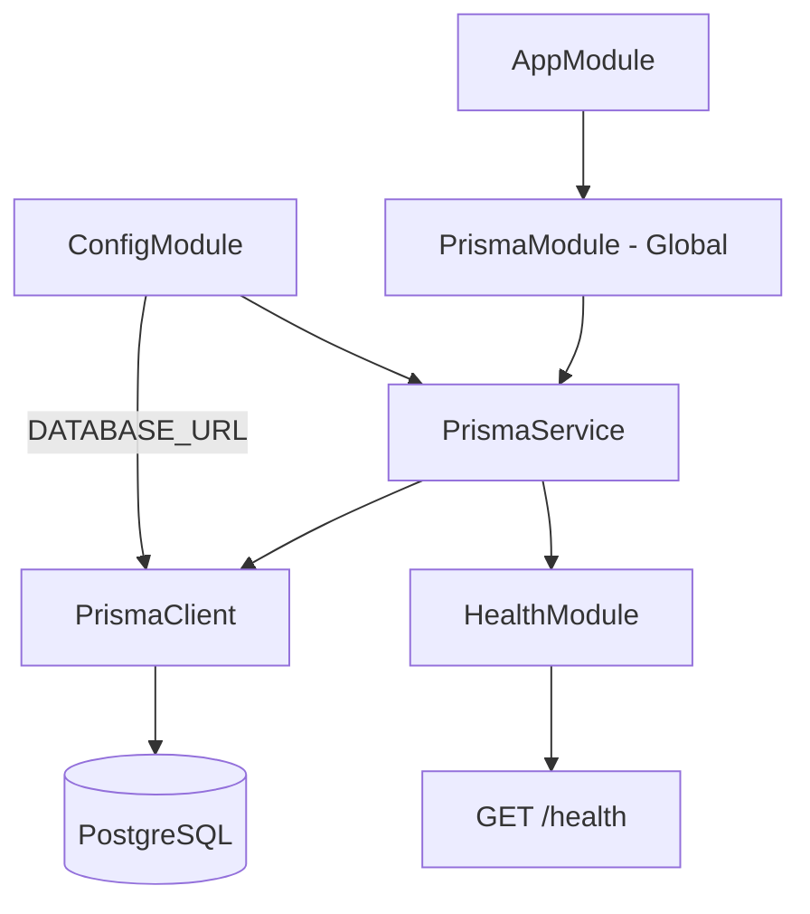

# TASK-104: Kết nối NestJS với PostgreSQL — Tích hợp Prisma & Database Lifecycle

## 📋 Metadata

- **Task ID**: TASK-104
- **Độ ưu tiên**: 🔴 CHÍ TRỌNG (Persistence Foundation)
- **Phụ thuộc**: TASK-103
- **Trạng thái**: ✅ Done

---

## 🎯 CHIẾN LƯỢC DỮ LIỆU (Data Persistence Strategy)

### 💡 Tại sao Task này quan trọng?

Không có kết nối database, mọi logic nghiệp vụ đều trở thành vô nghĩa. Task này thiết lập **lớp trung gian duy nhất** giữa NestJS và PostgreSQL — mọi module sau này (Auth, Products, Orders) đều phụ thuộc vào `PrismaService` được tạo ở đây.

- **Single Connection Point**: `PrismaService` là điểm kết nối duy nhất, tránh tạo nhiều connection pool độc lập gây lãng phí resource.
- **Lifecycle Management**: Kết nối phải mở khi app khởi động (`onModuleInit`) và đóng sạch khi app tắt (`onModuleDestroy`), ngăn connection leak.
- **Environment-aware Logging**: Chỉ bật Prisma query logging ở `development` — không bao giờ log raw queries ở production do rủi ro lộ dữ liệu nhạy cảm.

---

## 🏗️ KIẾN TRÚC KẾT NỐI (Connection Architecture)



---

## 🔧 CẤU TRÚC FILE (Logical File Structure)

```
src/
├── prisma/
│   ├── prisma.module.ts      # Global module export PrismaService
│   └── prisma.service.ts     # PrismaClient + lifecycle hooks
├── health/
│   ├── health.module.ts
│   └── health.controller.ts  # GET /health → kiểm tra DB ping
└── app.module.ts             # Import PrismaModule
```

---

## 📄 QUY TẮC VẬN HÀNH (Operational Rules)

### 1. PrismaService Lifecycle

- `onModuleInit()`: Gọi `$connect()` — NestJS gọi khi module ready.
- `onModuleDestroy()`: Gọi `$disconnect()` — NestJS gọi khi app shutdown.
- Không sử dụng `constructor` để kết nối — phải dùng lifecycle hooks để đảm bảo `ConfigService` đã resolve.

### 2. Global Module

- `PrismaModule` phải được đánh dấu `@Global()` để tất cả module khác inject `PrismaService` mà không cần re-import.

### 3. Health Check

- `GET /health` trả về `{ status: "ok", database: "connected" }` nếu DB ping thành công.
- Trả về HTTP 503 nếu DB không kết nối được — dùng để readiness probe trong production.

### 4. Logging Policy

```typescript
// Chỉ bật log khi NODE_ENV = development
log: process.env.NODE_ENV === 'development' ? ['query', 'warn', 'error'] : ['warn', 'error'];
```

---

## ✅ TIÊU CHUẨN THÀNH CÔNG (Definition of Success)

- [x] `PrismaService` inject được vào bất kỳ module nào mà không cần import `PrismaModule` lại
- [x] App khởi động thành công, log xác nhận database connected
- [x] `GET /health` trả về HTTP 200 khi DB online
- [x] `GET /health` trả về HTTP 503 khi DATABASE_URL sai hoặc DB offline
- [x] Không có connection leak khi restart app (kiểm tra connection count trong pgAdmin)
- [x] Prisma query log chỉ xuất hiện khi `NODE_ENV=development`

---

## 🧪 TDD SCENARIOS

| Kịch bản                                                                 | Mong đợi                                                 |
| :----------------------------------------------------------------------- | :------------------------------------------------------- |
| App khởi động với DATABASE_URL hợp lệ                                    | Log: "Database connected successfully", app ready        |
| App khởi động với DATABASE_URL sai (host không tồn tại)                  | App throw error, không start silently                    |
| `GET /health` khi DB đang online                                         | HTTP 200 `{ status: "ok", database: "connected" }`       |
| `GET /health` khi DB offline (dừng Docker container)                     | HTTP 503 `{ status: "error", database: "disconnected" }` |
| Inject `PrismaService` vào `UsersService` mà không import `PrismaModule` | Inject thành công (do Global module)                     |
| Restart app 10 lần liên tiếp                                             | PostgreSQL connection count không tăng dần (không leak)  |

---

## 📝 IMPLEMENTATION NOTES

**Pre-requisites:**

- [x] Review task requirements carefully
- [x] Check dependencies on TASK-103 (PostgreSQL running via Docker)
- [x] `DATABASE_URL` defined in `.env`

**Implementation Checklist:**

- [x] Tạo `PrismaService` extends `PrismaClient` với `onModuleInit` / `onModuleDestroy`
- [x] Tạo `PrismaModule` với `@Global()` decorator, export `PrismaService`
- [x] Import `PrismaModule` vào `AppModule`
- [x] Setup logging conditional theo `NODE_ENV`
- [x] Tạo `HealthController` với endpoint `GET /health`
- [x] Prisma schema và migration flow sẵn sàng cho entity modeling

**Completed:**

- ✅ PrismaModule global đã được setup trong app.module.ts
- ✅ ConfigService integration hoàn tất
- ✅ PrismaService đảm nhiệm kết nối database theo application lifecycle
- ✅ Health check endpoint tại /health
- ✅ Logging enabled cho development mode

**Time Tracking:**

- Estimated: 2 hours
- Actual: 1.5 hours
