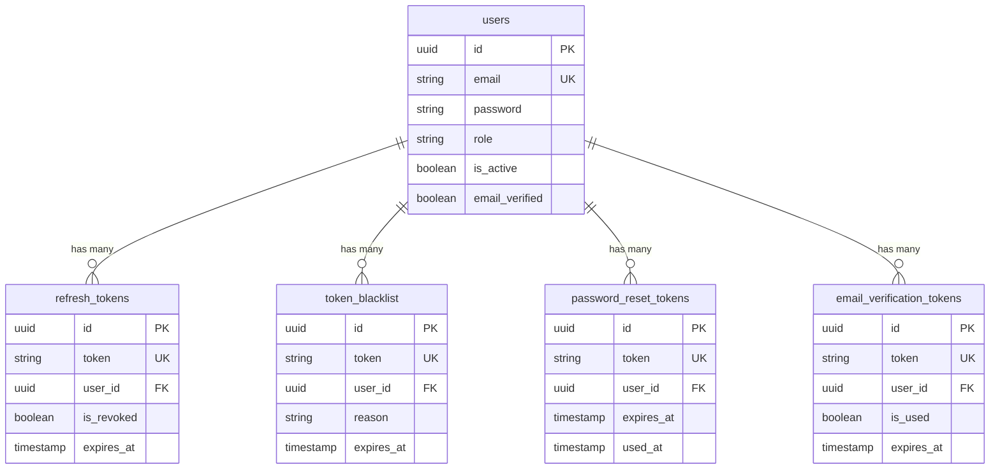
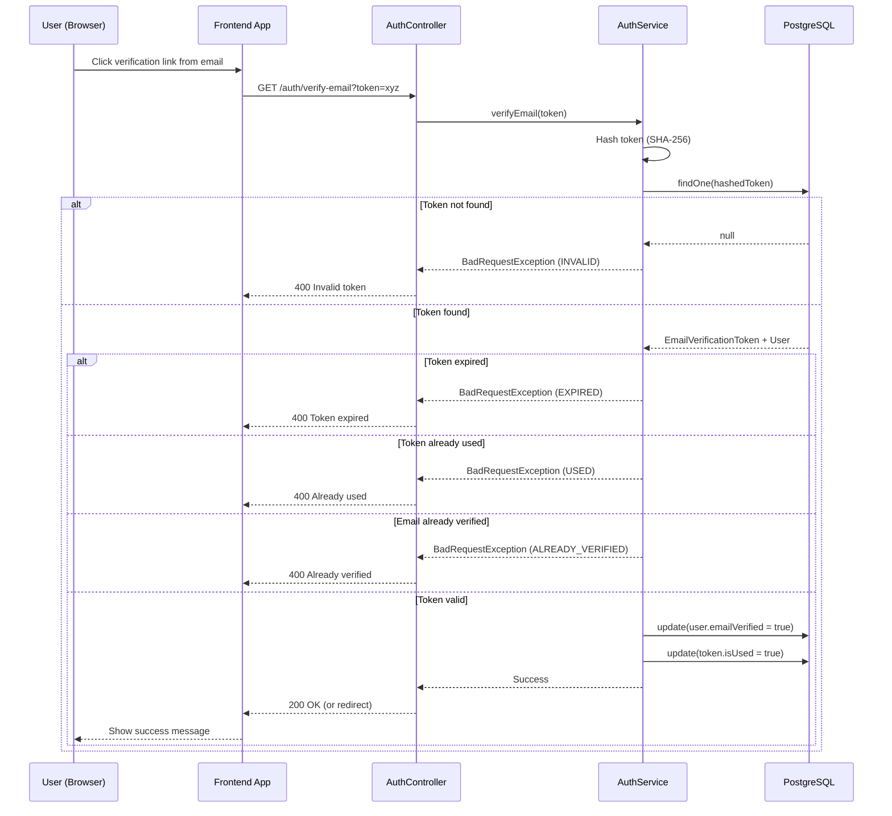
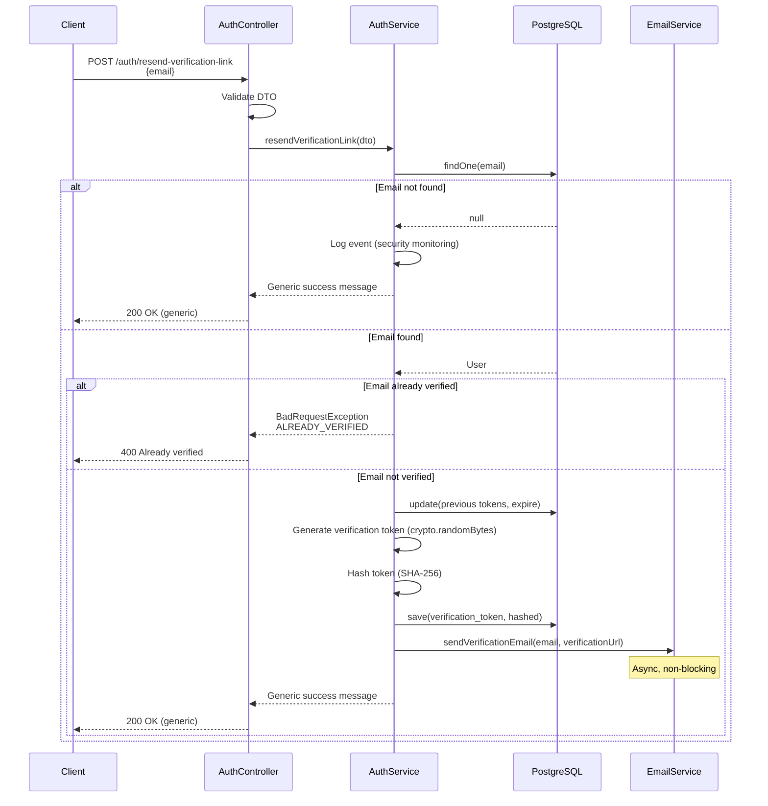
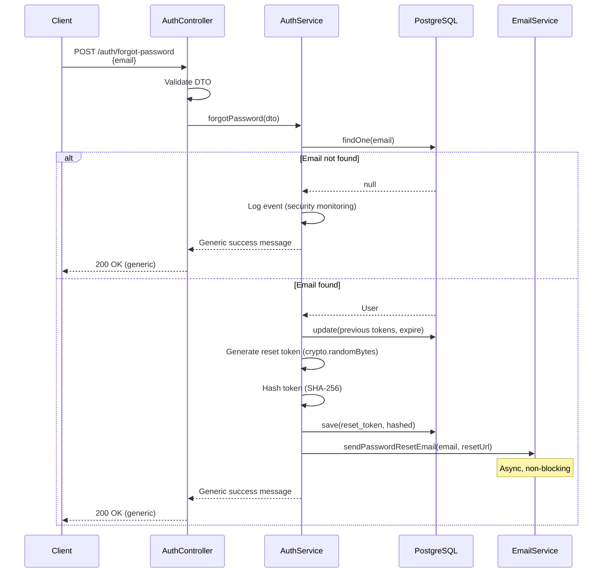
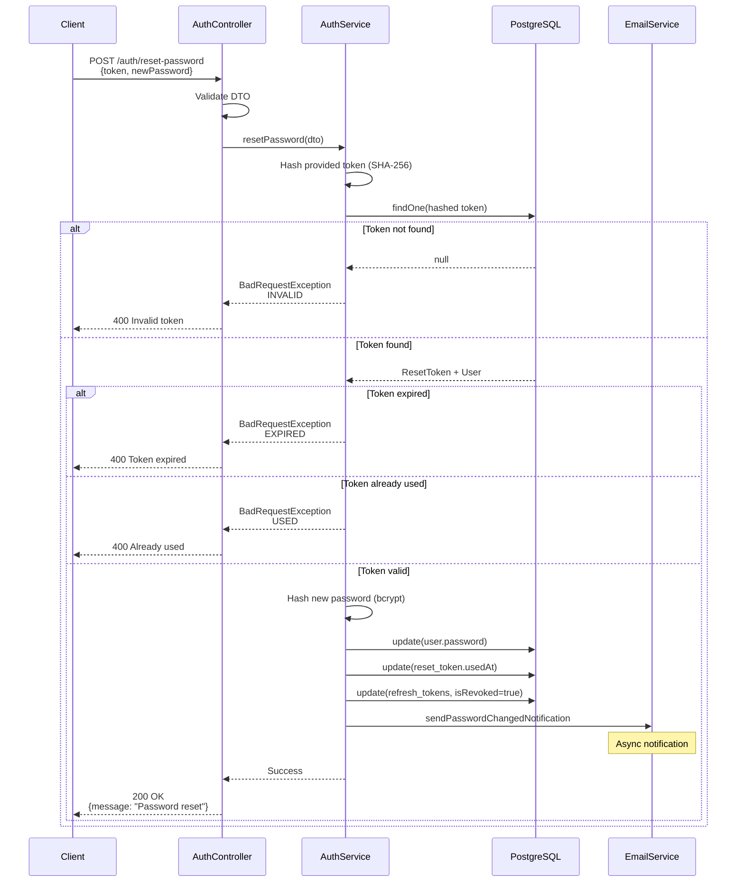
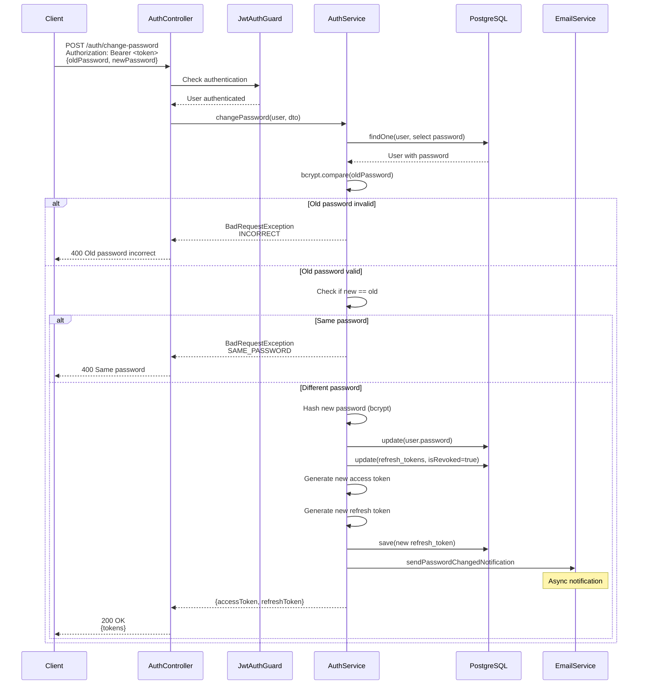
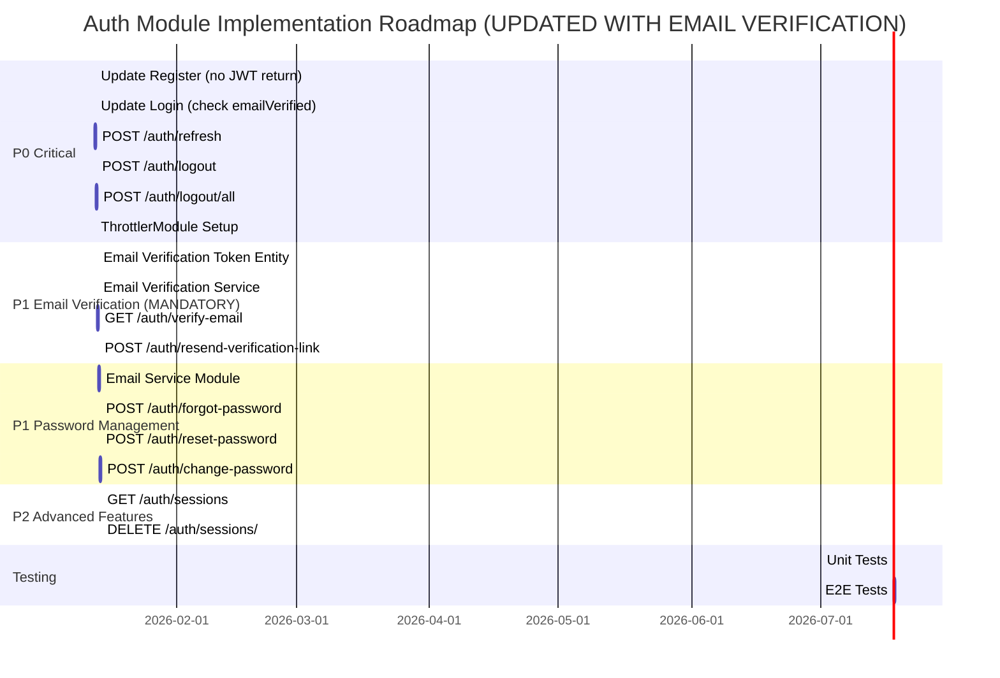

# 📘 AUTH MODULE – API SPECIFICATION & IMPLEMENTATION GUIDE

**Version:** 1.1  
**Last Updated:** January 13, 2026  
**Status:** Production-Ready Specification (Updated with 2026 Security Best Practices)

---

## 📋 TABLE OF CONTENTS

- [0. Module Overview](#0-module-overview)
- [1. API Priority Matrix](#1-api-priority-matrix)
- [2. Database Schema Design](#2-database-schema-design)
- [3. Standard Response Format](#3-standard-response-format)
- [4. Error Code Reference](#4-error-code-reference)
- [5. Security Rules Summary](#5-security-rules-summary)
- [6. API Specifications (P0-P3)](#6-api-specifications)
- [7. Implementation Checklist](#7-implementation-checklist)
- [8. Testing Strategy](#8-testing-strategy)
- [9. Rate Limiting Configuration](#9-rate-limiting-configuration)
- [10. Folder Structure & Naming Conventions](#10-folder-structure--naming-conventions)
- [11. Implementation Gap Analysis](#11-implementation-gap-analysis)

---

## 0️⃣ MODULE OVERVIEW

### 🎯 Purpose

The **Auth Module** handles all authentication and authorization concerns for the e-commerce API:

- User registration with **mandatory email verification via link**
- User login (requires verified email)
- Session management (JWT-based)
- Token lifecycle (access + refresh tokens)
- Password management with **reset link via email** (forgot/reset/change)
- Email verification via **verification link** (required for account activation)
- Role-based access control (RBAC)
- Security features (blacklist, rate limiting)
- OAuth integration (optional)

### 🧱 Architecture Overview

```
┌─────────────────────────────────────────────────────────────┐
│                        CLIENT LAYER                          │
│  (Web/Mobile App - stores access token in memory)           │
└────────────────────┬────────────────────────────────────────┘
                     │ HTTP Requests + JWT Token
                     ↓
┌─────────────────────────────────────────────────────────────┐
│                     CONTROLLER LAYER                         │
│  ✓ HTTP route handling                                       │
│  ✓ Request validation (class-validator)                     │
│  ✓ Swagger documentation                                     │
│  ✓ Guards (JwtAuthGuard, RolesGuard)                        │
└────────────────────┬────────────────────────────────────────┘
                     ↓
┌─────────────────────────────────────────────────────────────┐
│                      SERVICE LAYER                           │
│  ✓ Business logic                                            │
│  ✓ Password hashing (bcrypt)                                │
│  ✓ JWT generation/verification                              │
│  ✓ Token blacklist management                               │
│  ✓ Email service integration                                │
└────────────────────┬────────────────────────────────────────┘
                     ↓
┌─────────────────────────────────────────────────────────────┐
│                    REPOSITORY LAYER                          │
│  ✓ TypeORM repositories                                      │
│  ✓ Database queries                                          │
│  ✓ Transaction management                                    │
└────────────────────┬────────────────────────────────────────┘
                     ↓
┌─────────────────────────────────────────────────────────────┐
│                     DATABASE LAYER                           │
│  PostgreSQL: users, refresh_tokens, token_blacklist,        │
│             password_reset_tokens, email_verification_tokens│
└─────────────────────────────────────────────────────────────┘
```

### 🔑 Key Design Principles

| Principle                  | Implementation                                                                |
| -------------------------- | ----------------------------------------------------------------------------- |
| **Security First**         | bcrypt/argon2id hashing, JWT signing, token rotation, rate limiting           |
| **Stateless Auth**         | JWT-based (no server-side sessions for access tokens)                         |
| **Stateful Sessions**      | Refresh tokens stored in DB for revocation capability                         |
| **Generic Errors**         | No information leakage (same error for "email not found" vs "wrong password") |
| **Separation of Concerns** | Controller → Service → Repository layers                                      |
| **Guard-based Protection** | `@UseGuards(JwtAuthGuard)` for protected routes                               |
| **Decorator-based Config** | `@Public()` and `@Roles()` for fine-grained control                           |

---

### 🏗️ Service Architecture (2026 Best Practices)

**⚠️ Important:** Do NOT put all logic in a single `auth.service.ts` file. This becomes unmaintainable quickly.

**Recommended Service Separation:**

```
src/modules/auth/
├── services/
│   ├── auth.service.ts                    # High-level orchestration only
│   ├── password.service.ts                # Hash, compare, validate strength
│   ├── token.service.ts                   # Generate, sign, verify JWT tokens
│   ├── refresh-token.service.ts           # Refresh token lifecycle (DB)
│   ├── token-blacklist.service.ts         # Access token blacklist (DB/Redis)
│   ├── email-verification.service.ts      # Email verification token lifecycle
│   ├── password-reset.service.ts          # Password reset token lifecycle
│   └── session.service.ts                 # Device/session management (P2)
```

**Service Responsibilities:**

| Service                         | Responsibilities                                                        | Dependencies                        |
| ------------------------------- | ----------------------------------------------------------------------- | ----------------------------------- |
| `auth.service.ts`               | Orchestrate flows (register, login, refresh), coordinate other services | All other auth services             |
| `password.service.ts`           | Hash passwords, compare passwords, validate password strength           | bcrypt or argon2id                  |
| `token.service.ts`              | Generate JWT, sign JWT, verify JWT signature, decode payload            | @nestjs/jwt                         |
| `refresh-token.service.ts`      | Create/store refresh tokens, validate refresh tokens, revoke tokens     | TypeORM (refresh_tokens table)      |
| `token-blacklist.service.ts`    | Add to blacklist, check if blacklisted, cleanup expired entries         | TypeORM or Redis                    |
| `email-verification.service.ts` | Create verification tokens, validate tokens, mark as used, send emails  | TypeORM, email service              |
| `password-reset.service.ts`     | Create reset tokens, validate reset tokens, mark as used, send emails   | TypeORM, email service              |
| `session.service.ts`            | Track devices, list active sessions, revoke specific session            | TypeORM (refresh_tokens + metadata) |

**Why This Matters:**

- ✅ Single Responsibility Principle
- ✅ Easier to test (mock specific services)
- ✅ Easier to maintain (find bugs faster)
- ✅ Reusable (e.g., password.service can be used by users module)
- ✅ Scalable (add new auth methods without modifying existing code)

**Implementation Priority:**

- **P0:** auth.service, password.service, token.service, refresh-token.service, token-blacklist.service, email-verification.service
- **P1:** password-reset.service
- **P2:** session.service

---

### 📧 Email Link Response Strategy (2026 Recommendation)

**The Problem:**
Email links (verify-email, reset-password) can respond in two ways:

1. **JSON Response** - Return structured data, frontend handles redirect
2. **Direct Redirect** - Backend redirects to frontend page with query params

**⚠️ Decision: Use JSON-First Approach (API-First Architecture)**

| Aspect               | JSON Response (✅ Recommended)        | Redirect (⚠️ Legacy Pattern)           |
| -------------------- | ------------------------------------- | -------------------------------------- |
| **Frontend Control** | ✅ Full control over success/error UI | ❌ Limited to query params             |
| **Error Handling**   | ✅ Structured error codes & messages  | ❌ Must parse query params             |
| **Mobile Support**   | ✅ Works seamlessly with deep links   | ⚠️ Requires additional handling        |
| **API Consistency**  | ✅ All endpoints return JSON          | ❌ Breaks RESTful consistency          |
| **CORS Complexity**  | ✅ Simple (standard CORS)             | ⚠️ Must handle redirect CORS carefully |
| **Testing**          | ✅ Easy to test with Postman/curl     | ❌ Harder to test redirects            |
| **State Management** | ✅ Frontend manages state naturally   | ⚠️ State in URL (security concern)     |

**Implementation Strategy:**

**For Email Verification (`GET /auth/verify-email?token=xxx`):**

```typescript
// ✅ Recommended: Return JSON
@Get('verify-email')
async verifyEmail(@Query('token') token: string) {
  await this.authService.verifyEmail(token);
  return {
    statusCode: 200,
    message: 'Email verified successfully. You can now login.',
    data: { emailVerified: true }
  };
}

// Frontend handles redirect:
// User clicks link → Opens in browser → Shows success page → Redirects to login
```

**For Password Reset (`GET /auth/reset-password?token=xxx`):**

```typescript
// ✅ Recommended: Return JSON (or redirect to form page)
@Get('reset-password')
async validateResetToken(@Query('token') token: string) {
  const isValid = await this.authService.validateResetToken(token);

  if (!isValid) {
    throw new BadRequestException('Invalid or expired reset token');
  }

  // Option 1: Return JSON (frontend shows form)
  return {
    statusCode: 200,
    message: 'Token is valid. You can now reset your password.',
    data: { tokenValid: true }
  };

  // Option 2: Redirect to frontend reset form (acceptable for UX)
  return res.redirect(`${FRONTEND_URL}/reset-password?token=${token}`);
}

// Then POST /auth/reset-password with { token, newPassword }
```

**Migration Path (if you need redirects now):**

1. Implement JSON responses first (P0)
2. Add optional `?redirect=1` query param later
3. Frontend can choose behavior via link generation

**Why This Matters:**

- Modern SPAs (React/Vue/Angular) expect JSON
- Mobile apps cannot handle browser redirects easily
- Microservices architecture requires consistent API contracts
- 2026 best practice: API returns data, frontend handles presentation

---

## 1️⃣ API PRIORITY MATRIX

### 🎯 Implementation Order (DO NOT SKIP)

Implement APIs in **strict priority order**. Do not move to next priority until current priority is **100% complete** (code + tests + docs).

### 🔴 P0 – CRITICAL (Core Authentication + Email Verification)

**Deadline:** Week 1  
**Must Have:** These APIs are **mandatory** for any auth system to function. Email verification is now P0 because users cannot login without verified email.

| #   | Method | Endpoint                         | Purpose                  | Estimated Time |
| --- | ------ | -------------------------------- | ------------------------ | -------------- |
| 1   | POST   | `/auth/register`                 | Create new user account  | 4-6 hours      |
| 2   | GET    | `/auth/verify-email`             | Verify email with link   | 4-5 hours      |
| 3   | POST   | `/auth/resend-verification-link` | Resend verification link | 2-3 hours      |
| 4   | POST   | `/auth/login`                    | Authenticate user        | 3-4 hours      |
| 5   | POST   | `/auth/refresh`                  | Renew access token       | 4-5 hours      |
| 6   | POST   | `/auth/logout`                   | Logout current device    | 2-3 hours      |
| 7   | POST   | `/auth/logout/all`               | Logout all devices       | 2-3 hours      |

**Total P0 Time:** 21-30 hours (~3-4 days)

**⚠️ Implementation Order Critical Path:**

1. Register → Email Verification (API #1-3) must be implemented together
2. Only then can you test Login (API #4) successfully
3. Then implement token management (API #5-7)

---

### 🟡 P1 – HIGH (Password Management)

**Deadline:** Week 2  
**Should Have:** Critical for security and account recovery.

| #   | Method | Endpoint                | Purpose                         | Estimated Time |
| --- | ------ | ----------------------- | ------------------------------- | -------------- |
| 8   | POST   | `/auth/forgot-password` | Request password reset via link | 3-4 hours      |
| 9   | POST   | `/auth/reset-password`  | Reset password via token        | 3-4 hours      |
| 10  | POST   | `/auth/change-password` | Change password (authenticated) | 2-3 hours      |

**Total P1 Time:** 8-11 hours (~1-2 days)

---

### 🟢 P2 – MEDIUM (Advanced Features)

**Deadline:** Week 3  
**Nice to Have:** Enhanced user experience and account management.

| #   | Method | Endpoint             | Purpose                        | Estimated Time |
| --- | ------ | -------------------- | ------------------------------ | -------------- |
| 11  | GET    | `/auth/sessions`     | List active sessions (devices) | 3-4 hours      |
| 12  | DELETE | `/auth/sessions/:id` | Revoke specific session        | 2-3 hours      |

**Total P2 Time:** 5-7 hours (~1 day)

---

### 🔵 P3 – OPTIONAL (OAuth)

**Deadline:** Week 4 (if time permits)  
**Future Enhancement:** Can be added later without breaking existing functionality.

| #   | Method | Endpoint                | Purpose                      | Estimated Time |
| --- | ------ | ----------------------- | ---------------------------- | -------------- |
| 11  | GET    | `/auth/google`          | Initiate Google OAuth        | 3-4 hours      |
| 12  | GET    | `/auth/google/callback` | Handle Google OAuth callback | 2-3 hours      |

**Total P3 Time:** 5-7 hours (~1 day)

---

### 📊 Total Implementation Time

- **P0 (Critical + Email Verification):** 21-30 hours (~3-4 days)
- **P1 (Password Management):** 8-11 hours (~1-2 days)
- **P2 (Session Management):** 5-7 hours (~1 day)
- **P3 (OAuth - Optional):** 5-7 hours (~1 day)
- **Grand Total:** 39-55 hours (~5-7 working days)

**⚠️ Note:** Email Verification moved from P1 to P0 because it's a blocker for login functionality.

---

## 2️⃣ DATABASE SCHEMA DESIGN

### 📦 Table: `users`

**Purpose:** Store user accounts and credentials.

```sql
CREATE TABLE users (
  id UUID PRIMARY KEY DEFAULT gen_random_uuid(),
  email VARCHAR(255) UNIQUE NOT NULL,
  password VARCHAR(255), -- nullable for OAuth users
  first_name VARCHAR(100) NOT NULL,
  last_name VARCHAR(100) NOT NULL,
  role VARCHAR(20) NOT NULL DEFAULT 'USER', -- USER | ADMIN | SELLER
  is_active BOOLEAN NOT NULL DEFAULT true,
  email_verified BOOLEAN NOT NULL DEFAULT false,
  last_login_at TIMESTAMP,
  created_at TIMESTAMP NOT NULL DEFAULT NOW(),
  updated_at TIMESTAMP NOT NULL DEFAULT NOW()
);

-- Indexes for performance
CREATE INDEX idx_users_email ON users(email);
CREATE INDEX idx_users_role ON users(role);
CREATE INDEX idx_users_is_active ON users(is_active);
```

**TypeORM Entity:** `src/entities/user.entity.ts` ✅ (Already exists)

---

### 📦 Table: `refresh_tokens`

**Purpose:** Track active refresh tokens for session management and revocation.

```sql
CREATE TABLE refresh_tokens (
  id UUID PRIMARY KEY DEFAULT gen_random_uuid(),
  token VARCHAR(500) UNIQUE NOT NULL,
  user_id UUID NOT NULL REFERENCES users(id) ON DELETE CASCADE,
  token_family_id UUID NOT NULL, -- For refresh token reuse detection (2026 security)
  device_info VARCHAR(255), -- User-Agent for tracking
  ip_address VARCHAR(45), -- IPv6 support
  is_revoked BOOLEAN NOT NULL DEFAULT false,
  expires_at TIMESTAMP NOT NULL,
  created_at TIMESTAMP NOT NULL DEFAULT NOW()
);

-- Indexes for performance
CREATE INDEX idx_refresh_tokens_token ON refresh_tokens(token);
CREATE INDEX idx_refresh_tokens_user_id ON refresh_tokens(user_id);
CREATE INDEX idx_refresh_tokens_user_revoked ON refresh_tokens(user_id, is_revoked);
CREATE INDEX idx_refresh_tokens_expires_at ON refresh_tokens(expires_at);
CREATE INDEX idx_refresh_tokens_family_id ON refresh_tokens(token_family_id); -- New: for reuse detection
```

**TypeORM Entity:** `src/modules/auth/entities/refresh-token.entity.ts` ❌ (Needs to be created)

**🆕 Refresh Token Family (Reuse Detection - 2026 Security):**

When a refresh token is used:

1. Generate new refresh token with **same token_family_id**
2. Revoke old refresh token
3. If an **already-revoked token** from the same family is presented → **Revoke entire family**
4. This detects refresh token theft/replay attacks

**Example Attack Scenario:**

```
1. Attacker steals refresh_token_A (family_id: xxx)
2. Legitimate user uses refresh_token_A → Issues refresh_token_B (same family_id)
3. Attacker tries to use refresh_token_A again (already revoked)
4. System detects reuse → Revokes entire family (refresh_token_B + all future tokens)
5. Both attacker and user forced to re-login
6. User receives security alert email
```

**Cleanup Strategy:**

- Cron job: Delete expired tokens daily
- On refresh: Delete old token when issuing new one (token rotation)
- On reuse detection: Revoke all tokens in family immediately

---

### 📦 Table: `token_blacklist`

**Purpose:** Revoke access tokens before natural expiration (logout, security breach).

```sql
CREATE TABLE token_blacklist (
  id UUID PRIMARY KEY DEFAULT gen_random_uuid(),
  token VARCHAR(500) UNIQUE NOT NULL,
  user_id UUID NOT NULL REFERENCES users(id) ON DELETE CASCADE,
  reason VARCHAR(50) NOT NULL, -- LOGOUT | PASSWORD_RESET | SECURITY_BREACH
  expires_at TIMESTAMP NOT NULL, -- Same as original token expiry
  created_at TIMESTAMP NOT NULL DEFAULT NOW()
);

-- Indexes for performance
CREATE INDEX idx_token_blacklist_token ON token_blacklist(token);
CREATE INDEX idx_token_blacklist_user_id ON token_blacklist(user_id);
CREATE INDEX idx_token_blacklist_expires_at ON token_blacklist(expires_at);
```

**TypeORM Entity:** `src/modules/auth/entities/token-blacklist.entity.ts` ✅ (Already exists)

**Cleanup Strategy:**

- Cron job: Delete tokens where `expires_at < NOW()` daily
- Keep for audit: Optional retention for security analysis (7-30 days)

---

### 📦 Table: `password_reset_tokens`

**Purpose:** One-time tokens for password reset flow.

```sql
CREATE TABLE password_reset_tokens (
  id UUID PRIMARY KEY DEFAULT gen_random_uuid(),
  token VARCHAR(500) UNIQUE NOT NULL,
  user_id UUID NOT NULL REFERENCES users(id) ON DELETE CASCADE,
  expires_at TIMESTAMP NOT NULL, -- Typically 15 minutes
  used_at TIMESTAMP, -- Mark as used after successful reset
  created_at TIMESTAMP NOT NULL DEFAULT NOW()
);

-- Indexes for performance
CREATE INDEX idx_password_reset_tokens_token ON password_reset_tokens(token);
CREATE INDEX idx_password_reset_tokens_user_id ON password_reset_tokens(user_id);
CREATE INDEX idx_password_reset_tokens_expires_at ON password_reset_tokens(expires_at);
```

**TypeORM Entity:** `src/modules/auth/entities/reset-token.entity.ts` ✅ (Already exists)

**Security Rules:**

- Only 1 active token per user (invalidate previous on new request)
- Short expiration (10-15 minutes)
- Single use only (mark `used_at` after consumption)

---

### 📦 Table: `email_verification_tokens`

**Purpose:** Secure tokens for email verification via verification links.

```sql
CREATE TABLE email_verification_tokens (
  id UUID PRIMARY KEY DEFAULT gen_random_uuid(),
  token VARCHAR(500) UNIQUE NOT NULL, -- Hashed verification token
  user_id UUID NOT NULL REFERENCES users(id) ON DELETE CASCADE,
  is_used BOOLEAN NOT NULL DEFAULT false,
  expires_at TIMESTAMP NOT NULL, -- Typically 24 hours
  created_at TIMESTAMP NOT NULL DEFAULT NOW()
);

-- Indexes for performance
CREATE INDEX idx_email_verification_tokens_token ON email_verification_tokens(token);
CREATE INDEX idx_email_verification_tokens_user_id ON email_verification_tokens(user_id);
CREATE INDEX idx_email_verification_tokens_expires_at ON email_verification_tokens(expires_at);
```

**TypeORM Entity:** `src/modules/auth/entities/email-verification-token.entity.ts` ❌ (Needs to be created)

**Security Rules:**

- Rate limit verification link generation (3 requests per hour)
- Token is hashed before storage (SHA-256)
- Short expiration (24 hours)
- Only 1 active token per user (invalidate previous on new request)
- Single-use only (mark `is_used` after verification)

---

### 🔄 Database Relationships



---

## 3️⃣ STANDARD RESPONSE FORMAT

### ✅ Success Response Structure

All successful API responses follow this format:

```typescript
{
  "statusCode": 200,           // HTTP status code
  "success": true,              // Always true for successful responses
  "message": "Operation successful", // Human-readable message
  "data": {                     // Response payload (can be object, array, or null)
    // ... actual data here
  }
}
```

**Example: Login Success**

```json
{
  "statusCode": 200,
  "success": true,
  "message": "Login successful",
  "data": {
    "accessToken": "eyJhbGciOiJIUzI1NiIsInR5cCI6IkpXVCJ9...",
    "refreshToken": "eyJhbGciOiJIUzI1NiIsInR5cCI6IkpXVCJ9...",
    "user": {
      "id": "550e8400-e29b-41d4-a716-446655440000",
      "email": "user@example.com",
      "firstName": "John",
      "lastName": "Doe",
      "role": "USER",
      "emailVerified": true
    }
  }
}
```

---

### ❌ Error Response Structure

All error responses follow this format:

```typescript
{
  "statusCode": 400,            // HTTP status code (4xx or 5xx)
  "success": false,              // Always false for errors
  "message": "Error description", // Human-readable error message
  "errorCode": "ERROR_CODE",    // Machine-readable error code
  "errors": [],                 // Optional: Validation errors array
  "timestamp": "2026-01-12T10:30:00Z", // ISO 8601 timestamp
  "path": "/auth/login"         // Request path
}
```

**Example: Validation Error**

```json
{
  "statusCode": 400,
  "success": false,
  "message": "Validation failed",
  "errorCode": "VALIDATION_ERROR",
  "errors": [
    {
      "field": "email",
      "message": "Email must be a valid email address"
    },
    {
      "field": "password",
      "message": "Password must be at least 8 characters"
    }
  ],
  "timestamp": "2026-01-12T10:30:00Z",
  "path": "/auth/register"
}
```

**Example: Authentication Error**

```json
{
  "statusCode": 401,
  "success": false,
  "message": "Invalid credentials",
  "errorCode": "AUTH_INVALID_CREDENTIALS",
  "timestamp": "2026-01-12T10:30:00Z",
  "path": "/auth/login"
}
```

---

## 4️⃣ ERROR CODE REFERENCE

### 🚨 Authentication Errors (4xx)

| Error Code                      | HTTP Status | Description                     | When to Use                                        |
| ------------------------------- | ----------- | ------------------------------- | -------------------------------------------------- |
| `AUTH_INVALID_CREDENTIALS`      | 401         | Email or password is incorrect  | Login with wrong credentials                       |
| `AUTH_TOKEN_EXPIRED`            | 401         | Access token has expired        | Token expiration time reached                      |
| `AUTH_TOKEN_INVALID`            | 401         | Token signature is invalid      | Tampered or malformed token                        |
| `AUTH_TOKEN_REVOKED`            | 401         | Token has been revoked          | Token in blacklist (logout)                        |
| `AUTH_TOKEN_MISSING`            | 401         | Authorization header missing    | No token provided                                  |
| `AUTH_REFRESH_TOKEN_EXPIRED`    | 401         | Refresh token has expired       | Refresh token lifetime exceeded                    |
| `AUTH_REFRESH_TOKEN_INVALID`    | 401         | Refresh token is invalid        | Invalid refresh token signature                    |
| `AUTH_REFRESH_TOKEN_REVOKED`    | 401         | Refresh token has been revoked  | Token marked as revoked in DB                      |
| `AUTH_REFRESH_TOKEN_REUSED`     | 401         | 🆕 Refresh token reuse detected | Same token used twice (attack detected)            |
| `AUTH_TOKEN_FAMILY_REVOKED`     | 401         | 🆕 Token family revoked         | All tokens in family invalidated (security breach) |
| `AUTH_ACCOUNT_INACTIVE`         | 403         | User account is disabled        | `is_active = false`                                |
| `AUTH_EMAIL_NOT_VERIFIED`       | 403         | Email not verified              | `email_verified = false`                           |
| `AUTH_INSUFFICIENT_PERMISSIONS` | 403         | User lacks required role        | RolesGuard rejection                               |

**🆕 2026 Security Codes:**

- `AUTH_REFRESH_TOKEN_REUSED`: Detects when a revoked refresh token is used again (possible theft)
- `AUTH_TOKEN_FAMILY_REVOKED`: When reuse detected, entire token family is revoked (forces re-login for both attacker and legitimate user)

---

### 🚨 Registration & Validation Errors (4xx)

| Error Code           | HTTP Status | Description                        | When to Use                     |
| -------------------- | ----------- | ---------------------------------- | ------------------------------- |
| `AUTH_EMAIL_EXISTS`  | 409         | Email already registered           | Duplicate email on registration |
| `AUTH_WEAK_PASSWORD` | 400         | Password doesn't meet requirements | Password validation failed      |
| `VALIDATION_ERROR`   | 400         | Request validation failed          | Class-validator errors          |

---

### 🚨 Password Reset Errors (4xx)

| Error Code                    | HTTP Status | Description               | When to Use                |
| ----------------------------- | ----------- | ------------------------- | -------------------------- |
| `AUTH_RESET_TOKEN_INVALID`    | 400         | Reset token is invalid    | Token not found in DB      |
| `AUTH_RESET_TOKEN_EXPIRED`    | 400         | Reset token has expired   | Token `expires_at` passed  |
| `AUTH_RESET_TOKEN_USED`       | 400         | Reset token already used  | `used_at` is not null      |
| `AUTH_OLD_PASSWORD_INCORRECT` | 400         | Current password is wrong | Change password validation |

---

### 🚨 Email Verification Errors (4xx)

| Error Code                        | HTTP Status | Description                      | When to Use                 |
| --------------------------------- | ----------- | -------------------------------- | --------------------------- |
| `AUTH_EMAIL_NOT_VERIFIED`         | 401         | Email not verified, cannot login | Login attempt before verify |
| `AUTH_VERIFICATION_TOKEN_INVALID` | 400         | Verification token is invalid    | Token not found in database |
| `AUTH_VERIFICATION_TOKEN_EXPIRED` | 400         | Verification token has expired   | Token `expires_at` passed   |
| `AUTH_VERIFICATION_TOKEN_USED`    | 400         | Verification token already used  | Token `is_used = true`      |
| `AUTH_EMAIL_ALREADY_VERIFIED`     | 400         | Email already verified           | User `emailVerified = true` |

---

### 🚨 Rate Limiting Errors (4xx)

| Error Code            | HTTP Status | Description       | When to Use              |
| --------------------- | ----------- | ----------------- | ------------------------ |
| `RATE_LIMIT_EXCEEDED` | 429         | Too many requests | ThrottlerGuard rejection |

---

### 🚨 Session Management Errors (4xx) - P2

| Error Code                   | HTTP Status | Description                       | When to Use                     |
| ---------------------------- | ----------- | --------------------------------- | ------------------------------- |
| `AUTH_SESSION_NOT_FOUND`     | 404         | 🆕 Session ID not found           | Revoke specific session (P2)    |
| `AUTH_SESSION_LIMIT_REACHED` | 429         | 🆕 Too many active sessions       | Max concurrent devices exceeded |
| `AUTH_DEVICE_NOT_RECOGNIZED` | 403         | 🆕 Login from unrecognized device | Device fingerprinting (future)  |

**Note:** Session management error codes are for P2 features (device tracking, session listing).

---

### 🚨 Server Errors (5xx)

| Error Code              | HTTP Status | Description               | When to Use                |
| ----------------------- | ----------- | ------------------------- | -------------------------- |
| `INTERNAL_SERVER_ERROR` | 500         | Unexpected server error   | Uncaught exceptions        |
| `DATABASE_ERROR`        | 500         | Database operation failed | DB connection/query errors |
| `EMAIL_SERVICE_ERROR`   | 500         | Email sending failed      | SMTP/SendGrid errors       |

---

### 📝 Usage in Code

```typescript
// Bad: Generic error message
throw new UnauthorizedException('Login failed');

// Good: Specific error code
throw new UnauthorizedException({
  message: 'Invalid credentials',
  errorCode: 'AUTH_INVALID_CREDENTIALS',
});

// Best: Custom exception with error code
throw new InvalidCredentialsException(); // Extends UnauthorizedException
```

---

## 5️⃣ SECURITY RULES SUMMARY

### 🔐 Password Security

| Rule                   | Requirement                                             | Implementation                                         |
| ---------------------- | ------------------------------------------------------- | ------------------------------------------------------ |
| **Hashing Algorithm**  | Argon2id (recommended 2026) or bcrypt (min 12 rounds)   | `argon2.hash(password)` or `bcrypt.hash(password, 12)` |
| **Password Strength**  | Min 8 chars, uppercase, lowercase, number, special char | Custom validator decorator                             |
| **Password Storage**   | Never store plaintext                                   | Hash before saving to DB                               |
| **Password Exclusion** | Never return password in responses                      | TypeORM `@Column({ select: false })`                   |
| **Password Reset**     | Revoke all sessions on reset                            | Invalidate refresh tokens + blacklist access tokens    |

**🆕 2026 Recommendation:**

- **Preferred:** Argon2id (winner of Password Hashing Competition 2015, now standard 2026)
  - Better resistance to GPU/ASIC attacks
  - Memory-hard algorithm
  - Install: `npm install argon2`
  - Usage: `argon2.hash(password)` (defaults are secure)
- **Acceptable:** Bcrypt with **12-14 rounds** (NOT 10)
  - Original spec used 10 rounds (2020 standard)
  - 2026 hardware requires higher cost factor
  - Usage: `bcrypt.hash(password, 12)`

**Migration Strategy:**

1. Start with bcrypt (easier setup, no native dependencies)
2. Upgrade to Argon2id when you have time (one-way migration during login)

---

### 🔐 Token Security

| Rule                       | Requirement                              | Implementation                                           |
| -------------------------- | ---------------------------------------- | -------------------------------------------------------- |
| **Access Token Lifetime**  | 10-15 minutes (max 30 minutes)           | `JWT_EXPIRATION=10m` or `15m` (recommended)              |
| **Refresh Token Lifetime** | 7-14 days (max 30 days with device mgmt) | `JWT_REFRESH_EXPIRATION=7d` (default)                    |
| **Token Signing**          | Different secrets for access vs refresh  | `JWT_SECRET` vs `JWT_REFRESH_SECRET`                     |
| **Token Rotation**         | Issue new refresh token on each refresh  | Invalidate old, create new                               |
| **Token Revocation**       | Support immediate logout                 | Blacklist + database revocation                          |
| **Token Validation**       | Verify signature + expiry + blacklist    | JWT strategy + blacklist service                         |
| **Reuse Detection**        | Detect refresh token replay attacks      | Token family tracking (see Security Best Practices 2026) |

**⚠️ 2026 Security Update:** Access token lifetime reduced from 15-30m to 10-15m to minimize attack window if token is compromised. Refresh token should only exceed 7 days if device/session management (P2) is implemented.

---

### 🔐 API Security

| Rule                 | Requirement                 | Implementation                                       |
| -------------------- | --------------------------- | ---------------------------------------------------- |
| **Rate Limiting**    | Protect sensitive endpoints | `@nestjs/throttler` module                           |
| **Generic Errors**   | Don't leak user existence   | Same error for "email not found" vs "wrong password" |
| **HTTPS Only**       | Enforce TLS in production   | Reverse proxy (nginx) + HSTS headers                 |
| **CORS**             | Whitelist allowed origins   | `CORS_ORIGIN` environment variable                   |
| **Input Validation** | Validate all inputs         | `class-validator` + `ValidationPipe`                 |
| **SQL Injection**    | Use parameterized queries   | TypeORM (built-in protection)                        |
| **XSS Protection**   | Sanitize outputs            | Helmet middleware + CSP headers                      |

---

### 🔐 Session Management

| Rule                      | Requirement                       | Implementation                                |
| ------------------------- | --------------------------------- | --------------------------------------------- |
| **Device Tracking**       | Track refresh tokens per device   | Store `device_info` + `ip_address`            |
| **Logout Current Device** | Revoke only current refresh token | Blacklist access token + revoke refresh token |
| **Logout All Devices**    | Revoke all user's refresh tokens  | Bulk update `is_revoked = true`               |
| **Session Expiry**        | Enforce absolute timeout          | Refresh token `expires_at` check              |

---

### 🔐 Email & Verification Security

| Rule                            | Requirement                    | Implementation                           |
| ------------------------------- | ------------------------------ | ---------------------------------------- |
| **Verification Token Length**   | 32+ characters (crypto-secure) | `crypto.randomBytes(32).toString('hex')` |
| **Token Hashing**               | SHA-256 hash before storage    | Store hashed token in database           |
| **Verification Token Lifetime** | 24 hours                       | `expires_at` timestamp                   |
| **Token Rate Limit**            | 3 link requests per hour       | ThrottlerGuard on resend endpoint        |
| **Single Use**                  | One-time use only              | Mark `is_used = true` after verification |
| **Reset Token Length**          | 32+ characters (crypto-secure) | `crypto.randomBytes(32).toString('hex')` |
| **Reset Token Lifetime**        | 10-15 minutes                  | `expires_at` timestamp                   |

---

### 🔐 Error Handling Security

| Rule                       | Requirement                                | Example                                       |
| -------------------------- | ------------------------------------------ | --------------------------------------------- |
| **Generic Login Errors**   | Same message for all failures              | "Invalid credentials" (not "Email not found") |
| **Generic Password Reset** | Same message regardless of email existence | "If your email exists, you'll receive a link" |
| **No Stack Traces**        | Hide implementation details                | Only in development mode                      |
| **Audit Logging**          | Log security events                        | Failed logins, password changes, etc.         |

---

## 6️⃣ API SPECIFICATIONS

> **Implementation Note:** APIs are documented in **strict priority order (P0 → P1 → P2 → P3)**.  
> Do not skip to lower priority APIs until the current priority group is **100% complete** (implemented + tested + documented).

---

### 🔴 P0 APIs - CORE AUTHENTICATION

#### ✅ P0 APIs Already Documented Above

The following P0 (Critical) APIs have been fully specified with implementation steps, sequence diagrams, and testing checklists:

1. **POST /auth/register** - Create new user account (sends verification email with link)
2. **POST /auth/login** - Authenticate user (requires verified email)
3. **POST /auth/refresh** - Renew access token
4. **POST /auth/logout** - Logout current device
5. **POST /auth/logout/all** - Logout all devices

**Status:** ✅ All P0 APIs are documented and ready for implementation.

**⚠️ Important Notes:**

- Register sends verification link via email but does NOT return JWT token
- Users must verify email before they can login
- Login endpoint checks `emailVerified = true` before issuing tokens

**Next Step:** Implement all P0 APIs, then immediately implement P1 Email Verification endpoints (API #6-7) before testing login flow.

---

### 🟡 P1 APIs - EMAIL VERIFICATION & PASSWORD MANAGEMENT

**⚠️ IMPORTANT:** Email Verification endpoints (API #6-7) must be implemented immediately after P0 APIs because:

- Register sends verification email but does NOT issue JWT tokens
- Login requires `emailVerified = true` before issuing tokens
- Users cannot access the system without verifying their email first

---

## 🟡 P1 API #6: VERIFY EMAIL

### Basic Information

| Property           | Value                                                            |
| ------------------ | ---------------------------------------------------------------- |
| **Endpoint**       | `GET /auth/verify-email?token=<verification-token>`              |
| **Authentication** | ❌ Not required (uses verification token from email link)        |
| **Rate Limit**     | 10 requests per hour per IP                                      |
| **Purpose**        | Verify user email address using verification link sent via email |

---

### Request Specification

**Query Parameters:**

```
GET /auth/verify-email?token=a1b2c3d4e5f6...
```

**Token Format:**

- 64-character hex string (32 bytes)
- Sent via email link: `https://app.com/verify-email?token=...`

---

### Response Specification

**Success Response (200 OK):**

```json
{
  "statusCode": 200,
  "success": true,
  "message": "Email verified successfully. You can now login.",
  "data": {
    "emailVerified": true
  }
}
```

**Error Responses:**

| Status Code | Error Code                        | Description                 |
| ----------- | --------------------------------- | --------------------------- |
| 400         | `AUTH_VERIFICATION_TOKEN_INVALID` | Token not found in database |
| 400         | `AUTH_VERIFICATION_TOKEN_EXPIRED` | Token has expired           |
| 400         | `AUTH_VERIFICATION_TOKEN_USED`    | Token already used          |
| 400         | `AUTH_EMAIL_ALREADY_VERIFIED`     | Email already verified      |

---

### Implementation Steps

#### Step 1: Extract Token from Query Parameter

```typescript
@Get('verify-email')
async verifyEmail(@Query('token') token: string) {
  if (!token) {
    throw new BadRequestException({
      message: 'Verification token is required',
      errorCode: 'AUTH_VERIFICATION_TOKEN_INVALID',
    });
  }

  // Continue to Step 2
}
```

#### Step 2: Hash Provided Token

```typescript
import * as crypto from 'node:crypto';

const hashedToken = crypto.createHash('sha256').update(token).digest('hex');
```

**Security Note:** Token trong database được lưu dưới dạng hash, nên phải hash token từ query parameter trước khi tìm kiếm.

#### Step 3: Find Verification Token in Database

```typescript
const verificationToken = await this.emailVerificationTokenRepository.findOne({
  where: { token: hashedToken },
  relations: ['user'],
});

if (!verificationToken) {
  throw new BadRequestException({
    message: 'Invalid or expired verification token',
    errorCode: 'AUTH_VERIFICATION_TOKEN_INVALID',
  });
}
```

#### Step 4: Validate Token Status

```typescript
// Check if expired
if (verificationToken.expiresAt < new Date()) {
  throw new BadRequestException({
    message: 'Verification token has expired',
    errorCode: 'AUTH_VERIFICATION_TOKEN_EXPIRED',
  });
}

// Check if already used
if (verificationToken.isUsed) {
  throw new BadRequestException({
    message: 'Verification token already used',
    errorCode: 'AUTH_VERIFICATION_TOKEN_USED',
  });
}

// Check if email already verified
if (verificationToken.user.emailVerified) {
  throw new BadRequestException({
    message: 'Email already verified',
    errorCode: 'AUTH_EMAIL_ALREADY_VERIFIED',
  });
}
```

#### Step 5: Mark Email as Verified

```typescript
await this.userRepository.update(verificationToken.userId, {
  emailVerified: true,
  updatedAt: new Date(),
});
```

#### Step 6: Mark Token as Used

```typescript
await this.emailVerificationTokenRepository.update(verificationToken.id, {
  isUsed: true,
});
```

#### Step 7: (Optional) Redirect to Frontend

```typescript
// Option 1: Return JSON response
return {
  message: 'Email verified successfully. You can now login.',
  emailVerified: true,
};

// Option 2: Redirect to frontend success page
return res.redirect(`${this.configService.get('FRONTEND_URL')}/email-verified?success=true`);
```

---

### Sequence Diagram



---

### Security Considerations

| Concern               | Mitigation                                            |
| --------------------- | ----------------------------------------------------- |
| **Token Security**    | Tokens are hashed in database, single-use only        |
| **Token Expiry**      | Short expiration (24 hours)                           |
| **Token Reuse**       | Mark token as used after successful verification      |
| **Email Enumeration** | Generic error messages (don't reveal if email exists) |
| **Rate Limiting**     | Limit verification attempts per IP                    |

---

### Testing Checklist

- [ ] **Happy Path:** Verify with valid token returns 200
- [ ] **Invalid Token:** Verify with non-existent token returns 400
- [ ] **Expired Token:** Verify with expired token returns 400 with specific error code
- [ ] **Used Token:** Verify with already-used token returns 400
- [ ] **Already Verified:** Verify already-verified email returns 400
- [ ] **Email Updated:** Verify `emailVerified` is set to `true` in database
- [ ] **Token Marked Used:** Verify `isUsed` is set to `true`
- [ ] **Missing Token:** Request without token returns 400
- [ ] **Rate Limiting:** Excessive verification attempts return 429
- [ ] **Can Login:** After verification, user can successfully login

---

## 🟡 P1 API #7: RESEND VERIFICATION LINK

### Basic Information

| Property           | Value                                               |
| ------------------ | --------------------------------------------------- |
| **Endpoint**       | `POST /auth/resend-verification-link`               |
| **Authentication** | ⚠️ Optional (can be authenticated or provide email) |
| **Rate Limit**     | 3 requests per hour per user                        |
| **Purpose**        | Resend email verification link                      |

---

### Request Specification

**Headers:**

```
Content-Type: application/json
Authorization: Bearer <access-token>  // Optional
```

**Request Body (ResendVerificationLinkDto):**

```typescript
{
  "email": "user@example.com"  // Required if not authenticated
}
```

**Validation Rules:**

```typescript
export class ResendVerificationLinkDto {
  @IsEmail({}, { message: 'Email must be a valid email address' })
  @IsNotEmpty({ message: 'Email is required' })
  email: string;
}
```

---

### Response Specification

**Success Response (200 OK):**

```json
{
  "statusCode": 200,
  "success": true,
  "message": "If your email is registered, you will receive a verification link",
  "data": null
}
```

**⚠️ Security Note:** Response is **ALWAYS the same** whether email exists or not. This prevents email enumeration attacks.

**Error Responses:**

| Status Code | Error Code                    | Description            |
| ----------- | ----------------------------- | ---------------------- |
| 400         | `VALIDATION_ERROR`            | Invalid email format   |
| 400         | `AUTH_EMAIL_ALREADY_VERIFIED` | Email already verified |
| 429         | `RATE_LIMIT_EXCEEDED`         | Too many requests      |

---

### Implementation Steps

#### Step 1: Get User (from token or email)

```typescript
let user: User;

if (req.user) {
  // User is authenticated
  user = req.user;
} else {
  // Find user by email
  user = await this.userRepository.findOne({
    where: { email: resendVerificationLinkDto.email },
  });

  if (!user) {
    // Generic response (don't reveal if email exists)
    this.logger.warn(`Verification link requested for non-existent email: ${resendVerificationLinkDto.email}`);
    return {
      message: 'If your email is registered, you will receive a verification link',
    };
  }
}
```

#### Step 2: Check if Already Verified

```typescript
if (user.emailVerified) {
  throw new BadRequestException({
    message: 'Email already verified',
    errorCode: 'AUTH_EMAIL_ALREADY_VERIFIED',
  });
}
```

#### Step 3: Invalidate Previous Verification Tokens

```typescript
// Delete or expire any existing unused verification tokens for this user
await this.emailVerificationTokenRepository.update(
  { userId: user.id, isUsed: false },
  { expiresAt: new Date() }, // Expire immediately
);
```

#### Step 4: Generate Secure Verification Token

```typescript
import * as crypto from 'node:crypto';

const verificationToken = crypto.randomBytes(32).toString('hex'); // 64-character hex string
const hashedToken = crypto.createHash('sha256').update(verificationToken).digest('hex');

// Store hashed token in database (never store plaintext)
await this.emailVerificationTokenRepository.save({
  token: hashedToken, // Store hashed version
  userId: user.id,
  expiresAt: new Date(Date.now() + 24 * 60 * 60 * 1000), // 24 hours
  isUsed: false,
});
```

**Security Note:** Store hashed token in DB to prevent token theft from database breach.

#### Step 5: Send Verification Email

```typescript
const verificationUrl = `${this.configService.get('FRONTEND_URL')}/verify-email?token=${verificationToken}`;

await this.emailService.sendVerificationEmail({
  to: user.email,
  name: user.firstName,
  verificationUrl,
  expiresInHours: 24,
});
```

**Email Template Example:**

```html
Subject: Verify Your Email Address Hi {{name}}, Please verify your email address by clicking the link below:
{{verificationUrl}} This link expires in 24 hours. If you didn't create an account, please ignore this email.
```

#### Step 6: Return Generic Response

```typescript
return {
  message: 'If your email is registered, you will receive a verification link',
};
```

---

### Sequence Diagram



---

### Security Considerations

| Concern               | Mitigation                                           |
| --------------------- | ---------------------------------------------------- |
| **Email Enumeration** | Always return same generic message                   |
| **Token Security**    | Store hashed tokens, not plaintext                   |
| **Token Reuse**       | Invalidate previous tokens before generating new one |
| **Rate Limiting**     | Strict limit: 3 requests per hour per user           |
| **Token Expiry**      | Long expiration (24 hours) for better UX             |

---

### Testing Checklist

- [ ] **Happy Path:** Request with valid email returns 200 (even if email doesn't exist)
- [ ] **Email Found:** Verify verification token is saved in database (hashed)
- [ ] **Email Not Found:** Same response as email found (generic message)
- [ ] **Email Sent:** Verify email is sent with correct verification URL
- [ ] **Token Format:** Verify token is 64-character hex string (32 bytes)
- [ ] **Token Expiry:** Verify `expiresAt` is set to 24 hours from now
- [ ] **Previous Tokens:** Verify old unused tokens are invalidated
- [ ] **Rate Limiting:** 4th request within 1 hour returns 429
- [ ] **Invalid Email:** Malformed email returns 400 validation error
- [ ] **Already Verified:** Request for verified email returns 400
- [ ] **Timing:** Response time similar for existing vs non-existing emails

---

## 🟡 P1 API #8: FORGOT PASSWORD

### Basic Information

| Property           | Value                                                                 |
| ------------------ | --------------------------------------------------------------------- |
| **Endpoint**       | `POST /auth/forgot-password`                                          |
| **Authentication** | ❌ Not required (public endpoint)                                     |
| **Rate Limit**     | 3 requests per hour per IP                                            |
| **Purpose**        | Request password reset link via email (generic response for security) |

---

### Request Specification

**Headers:**

```
Content-Type: application/json
```

**Request Body (ForgotPasswordDto):**

```typescript
{
  "email": "user@example.com"  // Required, valid email format
}
```

**Validation Rules:**

```typescript
export class ForgotPasswordDto {
  @IsEmail({}, { message: 'Email must be a valid email address' })
  @IsNotEmpty({ message: 'Email is required' })
  email: string;
}
```

---

### Response Specification

**Success Response (200 OK):**

```json
{
  "statusCode": 200,
  "success": true,
  "message": "If your email is registered, you will receive a password reset link",
  "data": null
}
```

**⚠️ Security Note:** Response is **ALWAYS the same** whether email exists or not. This prevents email enumeration attacks.

**Error Responses:**

| Status Code | Error Code            | Description             | Example Response                                                                                                             |
| ----------- | --------------------- | ----------------------- | ---------------------------------------------------------------------------------------------------------------------------- |
| 400         | `VALIDATION_ERROR`    | Invalid email format    | `{ "statusCode": 400, "success": false, "message": "Email must be a valid email address", "errorCode": "VALIDATION_ERROR" }` |
| 429         | `RATE_LIMIT_EXCEEDED` | Too many reset requests | `{ "statusCode": 429, "success": false, "message": "Too many requests", "errorCode": "RATE_LIMIT_EXCEEDED" }`                |

---

### Implementation Steps

#### Step 1: Validate Request Body

```typescript
// ✅ Automatically handled by ValidationPipe
```

#### Step 2: Find User by Email (Silently)

```typescript
const user = await this.userRepository.findOne({
  where: { email: forgotPasswordDto.email },
});

// ⚠️ SECURITY: Do NOT throw error if user not found
// Continue with generic response
if (!user) {
  // Log for security monitoring
  this.logger.warn(`Password reset requested for non-existent email: ${forgotPasswordDto.email}`);

  // Return success anyway (generic response)
  return {
    message: 'If your email is registered, you will receive a password reset link',
  };
}
```

#### Step 3: Invalidate Previous Reset Tokens

```typescript
// Delete or expire any existing unused reset tokens for this user
await this.resetTokenRepository.update(
  { userId: user.id, usedAt: IsNull() },
  { expiresAt: new Date() }, // Expire immediately
);
```

#### Step 4: Generate Secure Reset Token

```typescript
import * as crypto from 'crypto';

const resetToken = crypto.randomBytes(32).toString('hex'); // 64-character hex string
const hashedToken = crypto.createHash('sha256').update(resetToken).digest('hex');

// Store hashed token in database (never store plaintext)
await this.resetTokenRepository.save({
  token: hashedToken, // Store hashed version
  userId: user.id,
  expiresAt: new Date(Date.now() + 15 * 60 * 1000), // 15 minutes
});
```

**Security Note:** Store hashed token in DB to prevent token theft from database breach.

#### Step 5: Send Reset Email

```typescript
const resetUrl = `${this.configService.get('FRONTEND_URL')}/reset-password?token=${resetToken}`;

await this.emailService.sendPasswordResetEmail({
  to: user.email,
  name: user.firstName,
  resetUrl,
  expiresInMinutes: 15,
});
```

**Email Template Example:**

```html
Subject: Reset Your Password Hi {{name}}, You requested to reset your password. Click the link below: {{resetUrl}} This
link expires in 15 minutes. If you didn't request this, ignore this email.
```

#### Step 6: Return Generic Response

```typescript
return {
  message: 'If your email is registered, you will receive a password reset link',
};
```

---

### Sequence Diagram



---

### Security Considerations

| Concern               | Mitigation                                                    |
| --------------------- | ------------------------------------------------------------- |
| **Email Enumeration** | Always return same generic message                            |
| **Token Security**    | Store hashed tokens, not plaintext                            |
| **Token Reuse**       | Invalidate previous tokens before generating new one          |
| **Rate Limiting**     | Strict limit: 3 requests per hour per IP                      |
| **Timing Attack**     | Add artificial delay if user not found to match DB query time |
| **Token Expiry**      | Short expiration (10-15 minutes)                              |

---

### Testing Checklist

- [ ] **Happy Path:** Request with valid email returns 200 (even if email doesn't exist)
- [ ] **Email Found:** Verify reset token is saved in database (hashed)
- [ ] **Email Not Found:** Same response as email found (generic message)
- [ ] **Email Sent:** Verify email is sent with correct reset URL
- [ ] **Token Format:** Verify token is 64-character hex string (32 bytes)
- [ ] **Token Expiry:** Verify `expiresAt` is set to 15 minutes from now
- [ ] **Previous Tokens:** Verify old unused tokens are invalidated
- [ ] **Rate Limiting:** 4th request within 1 hour returns 429
- [ ] **Invalid Email:** Malformed email returns 400 validation error
- [ ] **Timing:** Response time similar for existing vs non-existing emails

---

## 🟡 P1 API #7: RESET PASSWORD

### Basic Information

| Property           | Value                                             |
| ------------------ | ------------------------------------------------- |
| **Endpoint**       | `POST /auth/reset-password`                       |
| **Authentication** | ❌ Not required (uses reset token)                |
| **Rate Limit**     | 5 requests per hour per IP                        |
| **Purpose**        | Reset password using valid reset token from email |

---

### Request Specification

**Headers:**

```
Content-Type: application/json
```

**Request Body (ResetPasswordDto):**

```typescript
{
  "token": "a1b2c3d4...",           // Required, 64-char hex string
  "newPassword": "NewSecurePass123!" // Required, must meet password requirements
}
```

**Validation Rules:**

```typescript
export class ResetPasswordDto {
  @IsString()
  @IsNotEmpty({ message: 'Token is required' })
  @Length(64, 64, { message: 'Invalid token format' })
  token: string;

  @IsString()
  @MinLength(8, { message: 'Password must be at least 8 characters' })
  @Matches(/^(?=.*[a-z])(?=.*[A-Z])(?=.*\d)(?=.*[@$!%*?&])[A-Za-z\d@$!%*?&]/, {
    message: 'Password must contain uppercase, lowercase, number and special character',
  })
  newPassword: string;
}
```

---

### Response Specification

**Success Response (200 OK):**

```json
{
  "statusCode": 200,
  "success": true,
  "message": "Password reset successfully",
  "data": null
}
```

**Error Responses:**

| Status Code | Error Code                 | Description                      | Example Response                                                                                                                |
| ----------- | -------------------------- | -------------------------------- | ------------------------------------------------------------------------------------------------------------------------------- |
| 400         | `VALIDATION_ERROR`         | Invalid token or password format | `{ "statusCode": 400, "success": false, "message": "Password must be at least 8 characters", "errorCode": "VALIDATION_ERROR" }` |
| 400         | `AUTH_RESET_TOKEN_INVALID` | Token not found in database      | `{ "statusCode": 400, "success": false, "message": "Invalid or expired reset token", "errorCode": "AUTH_RESET_TOKEN_INVALID" }` |
| 400         | `AUTH_RESET_TOKEN_EXPIRED` | Token has expired                | `{ "statusCode": 400, "success": false, "message": "Reset token has expired", "errorCode": "AUTH_RESET_TOKEN_EXPIRED" }`        |
| 400         | `AUTH_RESET_TOKEN_USED`    | Token already used               | `{ "statusCode": 400, "success": false, "message": "Reset token already used", "errorCode": "AUTH_RESET_TOKEN_USED" }`          |
| 429         | `RATE_LIMIT_EXCEEDED`      | Too many reset attempts          | `{ "statusCode": 429, "success": false, "message": "Too many requests", "errorCode": "RATE_LIMIT_EXCEEDED" }`                   |

---

### Implementation Steps

#### Step 1: Hash Provided Token

```typescript
import * as crypto from 'crypto';

const hashedToken = crypto.createHash('sha256').update(resetPasswordDto.token).digest('hex');
```

#### Step 2: Find Reset Token in Database

```typescript
const resetToken = await this.resetTokenRepository.findOne({
  where: { token: hashedToken },
  relations: ['user'],
});

if (!resetToken) {
  throw new BadRequestException({
    message: 'Invalid or expired reset token',
    errorCode: 'AUTH_RESET_TOKEN_INVALID',
  });
}
```

#### Step 3: Validate Token Status

```typescript
// Check if expired
if (resetToken.expiresAt < new Date()) {
  throw new BadRequestException({
    message: 'Reset token has expired',
    errorCode: 'AUTH_RESET_TOKEN_EXPIRED',
  });
}

// Check if already used
if (resetToken.usedAt) {
  throw new BadRequestException({
    message: 'Reset token already used',
    errorCode: 'AUTH_RESET_TOKEN_USED',
  });
}
```

#### Step 4: Hash New Password

```typescript
const hashedPassword = await bcrypt.hash(resetPasswordDto.newPassword, 10);
```

#### Step 5: Update User Password

```typescript
await this.userRepository.update(resetToken.userId, {
  password: hashedPassword,
  updatedAt: new Date(),
});
```

#### Step 6: Mark Token as Used

```typescript
await this.resetTokenRepository.update(resetToken.id, {
  usedAt: new Date(),
});
```

#### Step 7: Revoke All Refresh Tokens (Security)

```typescript
// Force re-login on all devices
await this.refreshTokenRepository.update({ userId: resetToken.userId, isRevoked: false }, { isRevoked: true });
```

#### Step 8: (Optional) Send Confirmation Email

```typescript
await this.emailService.sendPasswordChangedNotification({
  to: resetToken.user.email,
  name: resetToken.user.firstName,
  timestamp: new Date(),
});
```

#### Step 9: Return Success Response

```typescript
return {
  message: 'Password reset successfully',
};
```

---

### Sequence Diagram



---

### Security Considerations

| Concern               | Mitigation                                     |
| --------------------- | ---------------------------------------------- |
| **Token Theft**       | Tokens are hashed in database, single-use only |
| **Session Hijacking** | All refresh tokens revoked on password reset   |
| **Brute Force**       | Rate limit: 5 attempts per hour per IP         |
| **Token Reuse**       | Mark token as used after successful reset      |
| **Password Leak**     | New password must meet strength requirements   |
| **User Notification** | Send email confirmation for audit trail        |

---

### Testing Checklist

- [ ] **Happy Path:** Reset with valid token and strong password returns 200
- [ ] **Invalid Token:** Reset with non-existent token returns 400
- [ ] **Expired Token:** Reset with expired token returns 400 with specific error code
- [ ] **Used Token:** Reset with already-used token returns 400
- [ ] **Weak Password:** Reset with weak password returns 400 validation error
- [ ] **Password Hashed:** Verify new password is hashed in database
- [ ] **Token Marked Used:** Verify `usedAt` is set after successful reset
- [ ] **Sessions Revoked:** Verify all refresh tokens marked as revoked
- [ ] **Confirmation Email:** Verify password changed notification is sent
- [ ] **Re-login Required:** User must login again after password reset
- [ ] **Rate Limiting:** 6th request within 1 hour returns 429

---

## 🟡 P1 API #8: CHANGE PASSWORD

### Basic Information

| Property           | Value                                                                       |
| ------------------ | --------------------------------------------------------------------------- |
| **Endpoint**       | `POST /auth/change-password`                                                |
| **Authentication** | ✅ Access token required (Bearer token)                                     |
| **Rate Limit**     | 10 requests per hour per user                                               |
| **Purpose**        | Change password for authenticated user (requires old password verification) |

---

### Request Specification

**Headers:**

```
Authorization: Bearer <access-token>
Content-Type: application/json
```

**Request Body (ChangePasswordDto):**

```typescript
{
  "oldPassword": "OldPass123!",      // Required
  "newPassword": "NewSecurePass123!" // Required, different from old password
}
```

**Validation Rules:**

```typescript
export class ChangePasswordDto {
  @IsString()
  @IsNotEmpty({ message: 'Current password is required' })
  oldPassword: string;

  @IsString()
  @MinLength(8, { message: 'New password must be at least 8 characters' })
  @Matches(/^(?=.*[a-z])(?=.*[A-Z])(?=.*\d)(?=.*[@$!%*?&])[A-Za-z\d@$!%*?&]/, {
    message: 'New password must contain uppercase, lowercase, number and special character',
  })
  newPassword: string;
}
```

---

### Response Specification

**Success Response (200 OK):**

```json
{
  "statusCode": 200,
  "success": true,
  "message": "Password changed successfully",
  "data": {
    "accessToken": "eyJhbGciOiJIUzI1NiIsInR5cCI6IkpXVCJ9...", // New access token
    "refreshToken": "eyJhbGciOiJIUzI1NiIsInR5cCI6IkpXVCJ9..." // New refresh token
  }
}
```

**Error Responses:**

| Status Code | Error Code                    | Description                | Example Response                                                                                                                            |
| ----------- | ----------------------------- | -------------------------- | ------------------------------------------------------------------------------------------------------------------------------------------- |
| 400         | `VALIDATION_ERROR`            | Invalid password format    | `{ "statusCode": 400, "success": false, "message": "New password must be at least 8 characters", "errorCode": "VALIDATION_ERROR" }`         |
| 400         | `AUTH_OLD_PASSWORD_INCORRECT` | Old password doesn't match | `{ "statusCode": 400, "success": false, "message": "Current password is incorrect", "errorCode": "AUTH_OLD_PASSWORD_INCORRECT" }`           |
| 400         | `AUTH_SAME_PASSWORD`          | New password same as old   | `{ "statusCode": 400, "success": false, "message": "New password must be different from old password", "errorCode": "AUTH_SAME_PASSWORD" }` |
| 401         | `AUTH_TOKEN_MISSING`          | No authorization header    | `{ "statusCode": 401, "success": false, "message": "Authorization token missing", "errorCode": "AUTH_TOKEN_MISSING" }`                      |
| 429         | `RATE_LIMIT_EXCEEDED`         | Too many change attempts   | `{ "statusCode": 429, "success": false, "message": "Too many requests", "errorCode": "RATE_LIMIT_EXCEEDED" }`                               |

---

### Implementation Steps

#### Step 1: Get Authenticated User

```typescript
// ✅ User automatically extracted by JwtAuthGuard
// Available via @GetUser() decorator
```

#### Step 2: Load User with Password

```typescript
const user = await this.userRepository.findOne({
  where: { id: userId },
  select: ['id', 'email', 'password', 'firstName', 'lastName', 'role'],
});
```

#### Step 3: Verify Old Password

```typescript
const isOldPasswordValid = await bcrypt.compare(changePasswordDto.oldPassword, user.password);

if (!isOldPasswordValid) {
  throw new BadRequestException({
    message: 'Current password is incorrect',
    errorCode: 'AUTH_OLD_PASSWORD_INCORRECT',
  });
}
```

#### Step 4: Check New Password is Different

```typescript
const isSamePassword = await bcrypt.compare(changePasswordDto.newPassword, user.password);

if (isSamePassword) {
  throw new BadRequestException({
    message: 'New password must be different from old password',
    errorCode: 'AUTH_SAME_PASSWORD',
  });
}
```

#### Step 5: Hash New Password

```typescript
const hashedPassword = await bcrypt.hash(changePasswordDto.newPassword, 10);
```

#### Step 6: Update Password

```typescript
await this.userRepository.update(user.id, {
  password: hashedPassword,
  updatedAt: new Date(),
});
```

#### Step 7: Revoke All Other Sessions

```typescript
// Revoke all refresh tokens except current device (optional behavior)
// Or revoke all tokens to force re-login everywhere (more secure)

await this.refreshTokenRepository.update({ userId: user.id, isRevoked: false }, { isRevoked: true });
```

#### Step 8: Generate New Tokens

```typescript
const accessToken = this.jwtService.sign(
  { sub: user.id, email: user.email, role: user.role },
  { secret: this.configService.get('JWT_SECRET'), expiresIn: '15m' },
);

const refreshToken = this.jwtService.sign(
  { sub: user.id, type: 'refresh' },
  { secret: this.configService.get('JWT_REFRESH_SECRET'), expiresIn: '7d' },
);

// Save new refresh token
await this.refreshTokenRepository.save({
  token: refreshToken,
  userId: user.id,
  expiresAt: new Date(Date.now() + 7 * 24 * 60 * 60 * 1000),
  deviceInfo: req.headers['user-agent'],
  ipAddress: req.ip,
});
```

#### Step 9: (Optional) Send Notification Email

```typescript
await this.emailService.sendPasswordChangedNotification({
  to: user.email,
  name: user.firstName,
  timestamp: new Date(),
});
```

#### Step 10: Return New Tokens

```typescript
return {
  message: 'Password changed successfully',
  accessToken,
  refreshToken,
};
```

---

### Sequence Diagram



---

### Security Considerations

| Concern                       | Mitigation                                      |
| ----------------------------- | ----------------------------------------------- |
| **Old Password Verification** | Must verify old password before allowing change |
| **Password Reuse**            | Prevent user from setting same password         |
| **Session Security**          | Revoke all old sessions, issue new tokens       |
| **Rate Limiting**             | Prevent brute force of old password             |
| **User Notification**         | Email confirmation for audit trail              |
| **Token Refresh**             | Return new tokens immediately (no logout)       |

---

### Testing Checklist

- [ ] **Happy Path:** Change with correct old password returns 200 + new tokens
- [ ] **Wrong Old Password:** Change with incorrect old password returns 400
- [ ] **Same Password:** Change to same password returns 400 with specific error code
- [ ] **Weak New Password:** Change to weak password returns 400 validation error
- [ ] **Password Updated:** Verify new password is hashed and stored in database
- [ ] **Old Sessions Revoked:** Verify all old refresh tokens are revoked
- [ ] **New Tokens Issued:** Verify new access and refresh tokens are generated
- [ ] **Tokens Valid:** Verify new tokens can access protected endpoints
- [ ] **Notification Sent:** Verify password changed email is sent
- [ ] **Rate Limiting:** 11th request within 1 hour returns 429
- [ ] **Unauthenticated:** Request without token returns 401

---

### 🟢 P2 APIs - EMAIL VERIFICATION

---

## 🟢 P2 API #9: VERIFY EMAIL

### Basic Information

| Property           | Value                                                            |
| ------------------ | ---------------------------------------------------------------- |
| **Endpoint**       | `GET /auth/verify-email?token=<verification-token>`              |
| **Authentication** | ❌ Not required (uses verification token from email link)        |
| **Rate Limit**     | 10 requests per hour per IP                                      |
| **Purpose**        | Verify user email address using verification link sent via email |

---

### Request Specification

**Query Parameters:**

```
GET /auth/verify-email?token=a1b2c3d4e5f6...
```

**Token Format:**

- 64-character hex string (32 bytes)
- Sent via email link: `https://app.com/verify-email?token=...`

---

### Response Specification

**Success Response (200 OK):**

```json
{
  "statusCode": 200,
  "success": true,
  "message": "Email verified successfully",
  "data": {
    "emailVerified": true
  }
}
```

**Error Responses:**

| Status Code | Error Code                        | Description                 |
| ----------- | --------------------------------- | --------------------------- |
| 400         | `AUTH_VERIFICATION_TOKEN_INVALID` | Token not found in database |
| 400         | `AUTH_VERIFICATION_TOKEN_EXPIRED` | Token has expired           |
| 400         | `AUTH_VERIFICATION_TOKEN_USED`    | Token already used          |
| 400         | `AUTH_EMAIL_ALREADY_VERIFIED`     | Email already verified      |

---

### Implementation Steps

#### Step 1: Extract Token from Query Parameter

```typescript
@Get('verify-email')
async verifyEmail(@Query('token') token: string) {
  if (!token) {
    throw new BadRequestException({
      message: 'Verification token is required',
      errorCode: 'AUTH_VERIFICATION_TOKEN_INVALID',
    });
  }

  // Continue to Step 2
}
```

#### Step 2: Hash Provided Token

```typescript
import * as crypto from 'crypto';

const hashedToken = crypto.createHash('sha256').update(token).digest('hex');
```

**Security Note:** Token trong database được lưu dưới dạng hash, nên phải hash token từ query parameter trước khi tìm kiếm.

#### Step 3: Find Verification Token in Database

```typescript
const verificationToken = await this.emailVerificationTokenRepository.findOne({
  where: { token: hashedToken },
  relations: ['user'],
});

if (!verificationToken) {
  throw new BadRequestException({
    message: 'Invalid or expired verification token',
    errorCode: 'AUTH_VERIFICATION_TOKEN_INVALID',
  });
}
```

#### Step 4: Validate Token Status

```typescript
// Check if expired
if (verificationToken.expiresAt < new Date()) {
  throw new BadRequestException({
    message: 'Verification token has expired',
    errorCode: 'AUTH_VERIFICATION_TOKEN_EXPIRED',
  });
}

// Check if already used
if (verificationToken.isUsed) {
  throw new BadRequestException({
    message: 'Verification token already used',
    errorCode: 'AUTH_VERIFICATION_TOKEN_USED',
  });
}

// Check if email already verified
if (verificationToken.user.emailVerified) {
  throw new BadRequestException({
    message: 'Email already verified',
    errorCode: 'AUTH_EMAIL_ALREADY_VERIFIED',
  });
}
```

#### Step 5: Mark Email as Verified

```typescript
await this.userRepository.update(verificationToken.userId, {
  emailVerified: true,
  updatedAt: new Date(),
});
```

#### Step 6: Mark Token as Used

```typescript
await this.emailVerificationTokenRepository.update(verificationToken.id, {
  isUsed: true,
});
```

#### Step 7: (Optional) Redirect to Frontend

```typescript
// Option 1: Return JSON response
return {
  message: 'Email verified successfully',
  emailVerified: true,
};

// Option 2: Redirect to frontend success page
return res.redirect(`${this.configService.get('FRONTEND_URL')}/email-verified?success=true`);
```

---

### Sequence Diagram


---

### Security Considerations

| Concern               | Mitigation                                            |
| --------------------- | ----------------------------------------------------- |
| **Token Security**    | Tokens are hashed in database, single-use only        |
| **Token Expiry**      | Short expiration (24 hours)                           |
| **Token Reuse**       | Mark token as used after successful verification      |
| **Email Enumeration** | Generic error messages (don't reveal if email exists) |
| **Rate Limiting**     | Limit verification attempts per IP                    |

---

### Testing Checklist

- [ ] **Happy Path:** Verify with valid token returns 200
- [ ] **Invalid Token:** Verify with non-existent token returns 400
- [ ] **Expired Token:** Verify with expired token returns 400 with specific error code
- [ ] **Used Token:** Verify with already-used token returns 400
- [ ] **Already Verified:** Verify already-verified email returns 400
- [ ] **Email Updated:** Verify `emailVerified` is set to `true` in database
- [ ] **Token Marked Used:** Verify `isUsed` is set to `true`
- [ ] **Missing Token:** Request without token returns 400
- [ ] **Rate Limiting:** Excessive verification attempts return 429

---

## 🟢 P2 API #10: RESEND VERIFICATION LINK

### Basic Information

| Property           | Value                                               |
| ------------------ | --------------------------------------------------- |
| **Endpoint**       | `POST /auth/resend-verification-link`               |
| **Authentication** | ⚠️ Optional (can be authenticated or provide email) |
| **Rate Limit**     | 3 requests per hour per user                        |
| **Purpose**        | Resend email verification link                      |

---

### Request Specification

**Headers:**

```
Content-Type: application/json
Authorization: Bearer <access-token>  // Optional
```

**Request Body (ResendVerificationLinkDto):**

```typescript
{
  "email": "user@example.com"  // Required if not authenticated
}
```

**Validation Rules:**

```typescript
export class ResendVerificationLinkDto {
  @IsEmail({}, { message: 'Email must be a valid email address' })
  @IsNotEmpty({ message: 'Email is required' })
  email: string;
}
```

---

### Response Specification

**Success Response (200 OK):**

```json
{
  "statusCode": 200,
  "success": true,
  "message": "If your email is registered, you will receive a verification link",
  "data": null
}
```

**⚠️ Security Note:** Response is **ALWAYS the same** whether email exists or not. This prevents email enumeration attacks.

**Error Responses:**

| Status Code | Error Code                    | Description            |
| ----------- | ----------------------------- | ---------------------- |
| 400         | `VALIDATION_ERROR`            | Invalid email format   |
| 400         | `AUTH_EMAIL_ALREADY_VERIFIED` | Email already verified |
| 429         | `RATE_LIMIT_EXCEEDED`         | Too many requests      |

---

### Implementation Steps

#### Step 1: Get User (from token or email)

```typescript
let user: User;

if (req.user) {
  // User is authenticated
  user = req.user;
} else {
  // Find user by email
  user = await this.userRepository.findOne({
    where: { email: resendVerificationLinkDto.email },
  });

  if (!user) {
    // Generic response (don't reveal if email exists)
    this.logger.warn(`Verification link requested for non-existent email: ${resendVerificationLinkDto.email}`);
    return {
      message: 'If your email is registered, you will receive a verification link',
    };
  }
}
```

#### Step 2: Check if Already Verified

```typescript
if (user.emailVerified) {
  throw new BadRequestException({
    message: 'Email already verified',
    errorCode: 'AUTH_EMAIL_ALREADY_VERIFIED',
  });
}
```

#### Step 3: Invalidate Previous Verification Tokens

```typescript
// Delete or expire any existing unused verification tokens for this user
await this.emailVerificationTokenRepository.update(
  { userId: user.id, isUsed: false },
  { expiresAt: new Date() }, // Expire immediately
);
```

#### Step 4: Generate Secure Verification Token

```typescript
import * as crypto from 'crypto';

const verificationToken = crypto.randomBytes(32).toString('hex'); // 64-character hex string
const hashedToken = crypto.createHash('sha256').update(verificationToken).digest('hex');

// Store hashed token in database (never store plaintext)
await this.emailVerificationTokenRepository.save({
  token: hashedToken, // Store hashed version
  userId: user.id,
  expiresAt: new Date(Date.now() + 24 * 60 * 60 * 1000), // 24 hours
  isUsed: false,
});
```

**Security Note:** Store hashed token in DB to prevent token theft from database breach.

#### Step 5: Send Verification Email

```typescript
const verificationUrl = `${this.configService.get('FRONTEND_URL')}/verify-email?token=${verificationToken}`;

await this.emailService.sendVerificationEmail({
  to: user.email,
  name: user.firstName,
  verificationUrl,
  expiresInHours: 24,
});
```

**Email Template Example:**

```html
Subject: Verify Your Email Address Hi {{name}}, Please verify your email address by clicking the link below:
{{verificationUrl}} This link expires in 24 hours. If you didn't create an account, please ignore this email.
```

#### Step 6: Return Generic Response

```typescript
return {
  message: 'If your email is registered, you will receive a verification link',
};
```

---

### Sequence Diagram


---

### Security Considerations

| Concern               | Mitigation                                           |
| --------------------- | ---------------------------------------------------- |
| **Email Enumeration** | Always return same generic message                   |
| **Token Security**    | Store hashed tokens, not plaintext                   |
| **Token Reuse**       | Invalidate previous tokens before generating new one |
| **Rate Limiting**     | Strict limit: 3 requests per hour per user           |
| **Token Expiry**      | Long expiration (24 hours) for better UX             |

---

### Testing Checklist

- [ ] **Happy Path:** Request with valid email returns 200 (even if email doesn't exist)
- [ ] **Email Found:** Verify verification token is saved in database (hashed)
- [ ] **Email Not Found:** Same response as email found (generic message)
- [ ] **Email Sent:** Verify email is sent with correct verification URL
- [ ] **Token Format:** Verify token is 64-character hex string (32 bytes)
- [ ] **Token Expiry:** Verify `expiresAt` is set to 24 hours from now
- [ ] **Previous Tokens:** Verify old unused tokens are invalidated
- [ ] **Rate Limiting:** 4th request within 1 hour returns 429
- [ ] **Invalid Email:** Malformed email returns 400 validation error
- [ ] **Already Verified:** Request for verified email returns 400
- [ ] **Timing:** Response time similar for existing vs non-existing emails

---

### 🔵 P3 APIs - OAUTH (OPTIONAL)

---

## 🔵 P3 API #11-12: GOOGLE OAUTH

### Basic Information

| Property           | Value                                                                    |
| ------------------ | ------------------------------------------------------------------------ |
| **Endpoints**      | `GET /auth/google` (initiate)<br/>`GET /auth/google/callback` (callback) |
| **Authentication** | ❌ Not required (OAuth flow)                                             |
| **Purpose**        | Allow users to register/login using Google account                       |

---

### Implementation Overview

```typescript
// Strategy configuration
@Injectable()
export class GoogleStrategy extends PassportStrategy(Strategy, 'google') {
  constructor(private configService: ConfigService) {
    super({
      clientID: configService.get('GOOGLE_CLIENT_ID'),
      clientSecret: configService.get('GOOGLE_CLIENT_SECRET'),
      callbackURL: `${configService.get('API_URL')}/auth/google/callback`,
      scope: ['email', 'profile'],
    });
  }

  async validate(accessToken: string, refreshToken: string, profile: any): Promise<any> {
    const { id, name, emails, photos } = profile;

    return {
      googleId: id,
      email: emails[0].value,
      firstName: name.givenName,
      lastName: name.familyName,
      picture: photos[0].value,
    };
  }
}
```

---

### Environment Variables Required

```env
GOOGLE_CLIENT_ID=your-client-id.apps.googleusercontent.com
GOOGLE_CLIENT_SECRET=your-client-secret
GOOGLE_CALLBACK_URL=http://localhost:3000/auth/google/callback
```

---

### Testing Checklist

- [ ] **Google Login:** Redirect to Google OAuth page
- [ ] **New User:** Create account on first Google login
- [ ] **Existing User:** Login existing user with Google
- [ ] **Email Verified:** Mark email as verified automatically
- [ ] **Token Generation:** Return access + refresh tokens
- [ ] **Profile Sync:** Store Google profile data
- [ ] **Error Handling:** Handle OAuth errors gracefully

---

## 7️⃣ IMPLEMENTATION CHECKLIST

### 📋 Implementation Order (Strict)

```
┌─────────────────────────────────────────────────────────────┐
│                   IMPLEMENTATION FLOW                        │
└─────────────────────────────────────────────────────────────┘

Step 1: Database Setup
  ├── Create/Update entities
  ├── Generate migrations
  └── Run migrations

Step 2: DTOs & Validation
  ├── Create request DTOs
  ├── Add validation decorators
  └── Create response DTOs

Step 3: Services (Business Logic)
  ├── Implement service methods
  ├── Add error handling
  └── Write unit tests

Step 4: Controllers (HTTP Layer)
  ├── Create controller endpoints
  ├── Add guards & decorators
  └── Add Swagger documentation

Step 5: Integration
  ├── Wire up modules
  ├── Configure guards globally
  └── Test end-to-end

Step 6: Testing
  ├── Unit tests (services)
  ├── Integration tests (controllers)
  └── E2E tests (full flows)
```

---

### ✅ Per-API Implementation Checklist

Use this checklist for **each API** you implement:

#### 1️⃣ **Entity & Database**

- [ ] Entity created/updated (`*.entity.ts`)
- [ ] Relationships defined (TypeORM decorators)
- [ ] Indexes added for performance
- [ ] Migration generated (`npm run migration:generate`)
- [ ] Migration run (`npm run migration:run`)

#### 2️⃣ **DTO & Validation**

- [ ] Request DTO created (`*.dto.ts`)
- [ ] Validation decorators added (`@IsEmail`, `@MinLength`, etc.)
- [ ] Response DTO created (if needed)
- [ ] Custom validators created (if needed, e.g., `@IsStrongPassword`)

#### 3️⃣ **Service Implementation**

- [ ] Service method implemented
- [ ] Error handling added (throw specific exceptions)
- [ ] Business logic validated
- [ ] Database queries optimized (select only needed fields)
- [ ] Transactions used where needed
- [ ] Async operations handled properly

#### 4️⃣ **Controller Implementation**

- [ ] Controller endpoint created
- [ ] HTTP method correct (`@Post`, `@Get`, etc.)
- [ ] HTTP status code correct (`@HttpCode(200)`)
- [ ] Guards applied (`@UseGuards(JwtAuthGuard)`)
- [ ] Decorators applied (`@Public()`, `@Roles()`)
- [ ] Request body validated (`@Body()` with DTO)
- [ ] User extracted (`@GetUser()` decorator)

#### 5️⃣ **Swagger Documentation**

- [ ] `@ApiOperation()` added (summary + description)
- [ ] `@ApiTags()` added to controller
- [ ] Success response decorator added (`@RegisterResponse`)
- [ ] Error response decorators added (`@BadRequestResponse`, etc.)
- [ ] Example responses documented

#### 6️⃣ **Security**

- [ ] Rate limiting configured (`@Throttle()`)
- [ ] Input validation complete
- [ ] Output sanitization (no password in responses)
- [ ] Error messages generic (no information leakage)
- [ ] Audit logging added (security events)

#### 7️⃣ **Testing**

- [ ] Unit tests written (service methods)
- [ ] Integration tests written (controller endpoints)
- [ ] E2E test added (full user flow)
- [ ] Edge cases covered
- [ ] Error cases tested
- [ ] Mocks configured properly

#### 8️⃣ **Code Quality**

- [ ] Code linted (`npm run lint`)
- [ ] Code formatted (`npm run format`)
- [ ] No TypeScript errors
- [ ] No console.logs (use logger)
- [ ] Comments added for complex logic
- [ ] Code reviewed (self or peer)

---

### 🎯 Daily Implementation Velocity

**Recommended pace:** 1-2 APIs per day

| Day       | APIs                                            | Total Hours | Cumulative |
| --------- | ----------------------------------------------- | ----------- | ---------- |
| **Day 1** | Register + Login                                | 7-10 hours  | 2 APIs ✅  |
| **Day 2** | Refresh + Logout + Logout All                   | 8-11 hours  | 5 APIs ✅  |
| **Day 3** | Forgot Password + Reset Password                | 6-8 hours   | 7 APIs ✅  |
| **Day 4** | Change Password + Verify Email                  | 6-8 hours   | 9 APIs ✅  |
| **Day 5** | Resend Verification Link + Testing & Refinement | 6-8 hours   | 10 APIs ✅ |
| **Day 6** | (Optional) Google OAuth                         | 5-7 hours   | 12 APIs ✅ |

**Total:** 5-6 working days for complete auth system

---

## 8️⃣ TESTING STRATEGY

### 🧪 Testing Pyramid

```
        /\
       /  \
      / E2E \          ← Few, high-value tests (full user flows)
     /------\
    /        \
   /  Integ.  \       ← Medium coverage (controller + service)
  /------------\
 /              \
/   Unit Tests   \    ← High coverage (service logic, utilities)
------------------
```

---

### 🧪 Unit Testing (Services)

**Coverage Target:** ≥ 80% line coverage

#### Example: `auth.service.spec.ts`

```typescript
describe('AuthService', () => {
  let service: AuthService;
  let userRepository: MockType<Repository<User>>;
  let jwtService: MockType<JwtService>;

  beforeEach(async () => {
    const module: TestingModule = await Test.createTestingModule({
      providers: [
        AuthService,
        {
          provide: getRepositoryToken(User),
          useFactory: repositoryMockFactory,
        },
        {
          provide: JwtService,
          useFactory: jwtServiceMockFactory,
        },
      ],
    }).compile();

    service = module.get<AuthService>(AuthService);
    userRepository = module.get(getRepositoryToken(User));
    jwtService = module.get(JwtService);
  });

  describe('register', () => {
    it('should create a new user with hashed password', async () => {
      // Arrange
      const registerDto: RegisterDto = {
        email: 'test@example.com',
        password: 'SecurePass123!',
        firstName: 'John',
        lastName: 'Doe',
      };

      userRepository.findOne.mockResolvedValue(null); // Email doesn't exist
      userRepository.create.mockReturnValue({ id: '123', ...registerDto });
      userRepository.save.mockResolvedValue({ id: '123', ...registerDto });
      jwtService.sign.mockReturnValue('mock-token');

      // Act
      const result = await service.register(registerDto);

      // Assert
      expect(result).toHaveProperty('accessToken');
      expect(result).toHaveProperty('refreshToken');
      expect(result).toHaveProperty('user');
      expect(result.user.password).toBeUndefined(); // Password excluded
      expect(userRepository.save).toHaveBeenCalled();
    });

    it('should throw ConflictException if email exists', async () => {
      // Arrange
      userRepository.findOne.mockResolvedValue({ id: '123' });

      // Act & Assert
      await expect(service.register(registerDto)).rejects.toThrow(ConflictException);
    });
  });

  describe('login', () => {
    it('should return tokens for valid credentials', async () => {
      // Test implementation
    });

    it('should throw UnauthorizedException for invalid email', async () => {
      // Test implementation
    });

    it('should throw UnauthorizedException for invalid password', async () => {
      // Test implementation
    });
  });
});
```

---

### 🧪 Integration Testing (Controllers)

**Coverage Target:** All endpoints tested

#### Example: `auth.controller.spec.ts`

```typescript
describe('AuthController', () => {
  let app: INestApplication;

  beforeAll(async () => {
    const moduleFixture: TestingModule = await Test.createTestingModule({
      imports: [AppModule],
    }).compile();

    app = moduleFixture.createNestApplication();
    app.useGlobalPipes(new ValidationPipe());
    await app.init();
  });

  afterAll(async () => {
    await app.close();
  });

  describe('POST /auth/register', () => {
    it('should register a new user', () => {
      return request(app.getHttpServer())
        .post('/auth/register')
        .send({
          email: 'test@example.com',
          password: 'SecurePass123!',
          firstName: 'John',
          lastName: 'Doe',
        })
        .expect(201)
        .expect((res) => {
          expect(res.body.data).toHaveProperty('accessToken');
          expect(res.body.data).toHaveProperty('refreshToken');
          expect(res.body.data.user).not.toHaveProperty('password');
        });
    });

    it('should return 409 for duplicate email', () => {
      // Test implementation
    });

    it('should return 400 for invalid email', () => {
      // Test implementation
    });
  });
});
```

---

### 🧪 E2E Testing (Full Flows)

**Coverage Target:** All critical user journeys

#### Example: `auth.e2e-spec.ts`

```typescript
describe('Auth E2E Flows', () => {
  let app: INestApplication;
  let accessToken: string;
  let refreshToken: string;

  beforeAll(async () => {
    // Setup test app
  });

  it('Complete Auth Flow: Register → Login → Refresh → Logout', async () => {
    // Step 1: Register
    const registerResponse = await request(app.getHttpServer())
      .post('/auth/register')
      .send({
        email: 'e2e@example.com',
        password: 'SecurePass123!',
        firstName: 'E2E',
        lastName: 'Test',
      })
      .expect(201);

    accessToken = registerResponse.body.data.accessToken;
    refreshToken = registerResponse.body.data.refreshToken;

    // Step 2: Access protected route
    await request(app.getHttpServer()).get('/users/profile').set('Authorization', `Bearer ${accessToken}`).expect(200);

    // Step 3: Refresh token
    const refreshResponse = await request(app.getHttpServer()).post('/auth/refresh').send({ refreshToken }).expect(200);

    const newAccessToken = refreshResponse.body.data.accessToken;

    // Step 4: Logout
    await request(app.getHttpServer())
      .post('/auth/logout')
      .set('Authorization', `Bearer ${newAccessToken}`)
      .expect(200);

    // Step 5: Verify token is blacklisted
    await request(app.getHttpServer())
      .get('/users/profile')
      .set('Authorization', `Bearer ${newAccessToken}`)
      .expect(401);
  });

  it('Password Reset Flow: Forgot → Reset → Login', async () => {
    // Test implementation
  });
});
```

---

### 🧪 Test Data Factories

Create factories for test data generation:

```typescript
// test/factories/user.factory.ts
export class UserFactory {
  static create(overrides?: Partial<User>): User {
    return {
      id: faker.datatype.uuid(),
      email: faker.internet.email(),
      password: bcrypt.hashSync('Password123!', 10),
      firstName: faker.name.firstName(),
      lastName: faker.name.lastName(),
      role: UserRole.USER,
      isActive: true,
      emailVerified: false,
      createdAt: new Date(),
      updatedAt: new Date(),
      ...overrides,
    };
  }
}
```

---

## 9️⃣ RATE LIMITING CONFIGURATION

### 📊 Rate Limit Strategy (2026 Security-Hardened)

| Endpoint                              | Limit       | Window    | Reason                        | 2026 Update        |
| ------------------------------------- | ----------- | --------- | ----------------------------- | ------------------ |
| `POST /auth/register`                 | 3 requests  | 5 minutes | Prevent mass account creation | ⬇️ Stricter        |
| `POST /auth/login`                    | 5 requests  | 5 minutes | Prevent brute force attacks   | 🔄 Extended window |
| `POST /auth/forgot-password`          | 3 requests  | 1 hour    | Prevent email flooding        | ✅ Unchanged       |
| `POST /auth/reset-password`           | 3 requests  | 1 hour    | Prevent token brute force     | ⬇️ Reduced from 5  |
| `POST /auth/change-password`          | 5 requests  | 1 hour    | Prevent password brute force  | ⬇️ Reduced from 10 |
| `POST /auth/refresh`                  | 10 requests | 1 minute  | Normal refresh rate           | ✅ Unchanged       |
| `POST /auth/logout`                   | 10 requests | 1 minute  | Normal logout rate            | ✅ Unchanged       |
| `POST /auth/logout/all`               | 3 requests  | 5 minutes | Prevent abuse                 | ⬇️ Stricter        |
| `GET /auth/verify-email`              | 10 requests | 1 hour    | Prevent token brute force     | ✅ Unchanged       |
| `POST /auth/resend-verification-link` | 3 requests  | 1 hour    | Prevent email flooding        | ✅ Unchanged       |

**⚠️ 2026 Changes Rationale:**

- Register: Reduced from 5/min to 3/5min (legitimate users rarely register multiple times)
- Login: Increased window from 1min to 5min (prevents rapid retry attacks)
- Reset Password: Reduced from 5 to 3 attempts per hour (token should work first try)
- Change Password: Reduced from 10 to 5 per hour (legitimate users rarely change password multiple times)
- Logout All: Stricter limit (5min window instead of 1min) to prevent abuse

**Production Recommendation:**

- Use **Redis-backed storage** for distributed rate limiting across multiple server instances
- Monitor rate limit hits and adjust based on real traffic patterns
- Consider IP-based + user-based rate limiting combined

---

### ⚙️ ThrottlerModule Setup

#### 1️⃣ Install Dependencies

```bash
npm install @nestjs/throttler
```

#### 2️⃣ Configure in `app.module.ts`

```typescript
import { ThrottlerModule, ThrottlerGuard } from '@nestjs/throttler';
import { APP_GUARD } from '@nestjs/core';

@Module({
  imports: [
    ThrottlerModule.forRoot({
      ttl: 60, // Time window in seconds
      limit: 10, // Default max requests per window
      // Optional: Use Redis storage for distributed rate limiting
      // storage: new ThrottlerStorageRedisService(redisClient),
    }),
    // ... other modules
  ],
  providers: [
    {
      provide: APP_GUARD,
      useClass: ThrottlerGuard, // Apply globally
    },
  ],
})
export class AppModule {}
```

#### 3️⃣ Custom Rate Limits per Endpoint (2026 Configuration)

```typescript
import { Throttle } from '@nestjs/throttler';

@Controller('auth')
export class AuthController {
  @Post('register')
  @Throttle(3, 300) // 3 requests per 5 minutes (300 seconds)
  async register(@Body() dto: RegisterDto) {
    // Implementation
  }

  @Post('login')
  @Throttle(5, 300) // 5 requests per 5 minutes
  async login(@Body() dto: LoginDto) {
    // Implementation
  }

  @Post('forgot-password')
  @Throttle(3, 3600) // 3 requests per hour
  async forgotPassword(@Body() dto: ForgotPasswordDto) {
    // Implementation
  }

  @Post('reset-password')
  @Throttle(3, 3600) // 3 requests per hour
  async resetPassword(@Body() dto: ResetPasswordDto) {
    // Implementation
  }

  @Post('change-password')
  @Throttle(5, 3600) // 5 requests per hour
  async changePassword(@Body() dto: ChangePasswordDto) {
    // Implementation
  }

  @Post('logout/all')
  @Throttle(3, 300) // 3 requests per 5 minutes
  async logoutAll() {
    // Implementation
  }
}
```

#### 4️⃣ Redis Storage (Production)

```typescript
// redis.config.ts
import { ThrottlerStorageRedisService } from 'nestjs-throttler-storage-redis';
import Redis from 'ioredis';

export const redisClient = new Redis({
  host: process.env.REDIS_HOST,
  port: parseInt(process.env.REDIS_PORT),
  password: process.env.REDIS_PASSWORD,
});

// app.module.ts
ThrottlerModule.forRoot({
  ttl: 60,
  limit: 10,
  storage: new ThrottlerStorageRedisService(redisClient),
});
```

---

### 🔓 Skip Rate Limiting (Internal Services)

```typescript
import { SkipThrottle } from '@nestjs/throttler';

@Controller('internal')
@SkipThrottle() // Skip rate limiting for entire controller
export class InternalController {
  @Get('health')
  getHealth() {
    return { status: 'ok' };
  }

  @Post('sync')
  @SkipThrottle(false) // Override: apply rate limiting to this endpoint
  async syncData() {
    // Implementation
  }
}
```

---

## 🔟 FOLDER STRUCTURE & NAMING CONVENTIONS

### 📁 Current Structure (Refactored)

```
src/modules/auth/
├── auth.controller.ts          # Controller xử lý HTTP requests
├── auth.module.ts              # Module configuration
├── auth.service.ts             # Main service (register, login, logout)
├── AUTH_API_SPEC.md           # API documentation
│
├── decorators/                 # Custom decorators
│   ├── get-user.decorator.ts
│   ├── public.decorator.ts
│   └── roles.decorator.ts
│
├── docs/                       # Swagger documentation
│   └── auth.responses.ts
│
├── dto/                        # Data Transfer Objects
│   ├── auth-response.dto.ts
│   ├── change-password.dto.ts
│   ├── forgot-password.dto.ts
│   ├── login.dto.ts
│   ├── refresh-token.dto.ts
│   ├── register.dto.ts
│   ├── resend-verification-link.dto.ts
│   ├── reset-password.dto.ts
│
├── entities/                   # Database entities
│   ├── refresh-token.entity.ts
│   ├── reset-token.entity.ts
│   └── token-blacklist.entity.ts
│
├── guards/                     # Authentication & Authorization guards
│   ├── jwt-auth.guard.ts
│   └── roles.guard.ts
│
├── interfaces/                 # TypeScript interfaces
│   └── jwt-payload.interface.ts
│
├── services/                   # ✅ Tất cả services tập trung ở đây
│   ├── refresh-token.service.ts
│   └── token-blacklist.service.ts  # ✅ Đã di chuyển vào đây
│
└── strategies/                 # Passport strategies
    ├── google.strategy.ts
    ├── jwt.strategy.ts
    └── refresh.strategy.ts
```

---

### 📖 Chi Tiết Cấu Trúc & Cách Hoạt Động

#### 🎯 Root Files (Files ở thư mục gốc)

##### `auth.module.ts`

**Mục đích:** File cấu hình module chính của Auth module.

**Chức năng:**

- Đăng ký tất cả providers (services, guards, strategies)
- Import các module cần thiết (TypeORM, JWT, Passport)
- Export các services và guards để modules khác sử dụng
- Cấu hình JWT module với secret và expiration từ environment variables

**Cách hoạt động:**

```typescript
@Module({
  imports: [
    TypeOrmModule.forFeature([User, TokenBlacklist, ResetToken, RefreshToken]),
    PassportModule.register({ defaultStrategy: 'jwt' }),
    JwtModule.registerAsync({ ... }) // Cấu hình JWT động từ .env
  ],
  controllers: [AuthController],
  providers: [AuthService, JwtStrategy, ...],
  exports: [AuthService, JwtAuthGuard, ...] // Cho phép modules khác dùng
})
```

**Dependencies:**

- `AuthController` - Xử lý HTTP requests
- `AuthService` - Business logic chính
- `JwtStrategy`, `RefreshStrategy` - Passport strategies
- `JwtAuthGuard`, `RolesGuard` - Route protection
- `TokenBlacklistService`, `RefreshTokenService` - Token management

---

##### `auth.controller.ts`

**Mục đích:** Xử lý tất cả HTTP requests liên quan đến authentication.

**Chức năng:**

- Định nghĩa các endpoints (POST /auth/register, POST /auth/login, ...)
- Validate request body sử dụng DTOs và ValidationPipe
- Gọi AuthService để xử lý business logic
- Trả về response theo format chuẩn
- Thêm Swagger documentation cho API

**Các endpoints:**

- `POST /auth/register` - Đăng ký user mới
- `POST /auth/login` - Đăng nhập
- `POST /auth/refresh` - Làm mới access token
- `POST /auth/logout` - Đăng xuất thiết bị hiện tại
- `POST /auth/logout/all` - Đăng xuất tất cả thiết bị
- `POST /auth/forgot-password` - Yêu cầu reset password
- `POST /auth/reset-password` - Reset password với token
- `POST /auth/change-password` - Đổi password (cần authentication)

**Cách hoạt động:**

```typescript
@Controller('auth')
export class AuthController {
  constructor(private authService: AuthService) {}

  @Post('register')
  async register(@Body() dto: RegisterDto) {
    return await this.authService.register(dto);
  }
}
```

**Guards sử dụng:**

- `@UseGuards(JwtAuthGuard)` - Yêu cầu authentication
- `@Public()` - Bỏ qua authentication (cho public endpoints)

---

##### `auth.service.ts`

**Mục đích:** Chứa toàn bộ business logic của authentication.

**Chức năng:**

- **Register:** Tạo user mới, hash password, generate JWT tokens
- **Login:** Xác thực credentials, generate tokens, update lastLoginAt
- **Refresh Token:** Validate refresh token, issue new tokens (token rotation)
- **Logout:** Revoke refresh token, blacklist access token
- **Logout All:** Revoke tất cả refresh tokens của user
- **Forgot Password:** Generate reset token, gửi email
- **Reset Password:** Validate reset token, update password, revoke sessions
- **Change Password:** Verify old password, update password, issue new tokens

**Cách hoạt động:**

```typescript
@Injectable()
export class AuthService {
  constructor(
    @InjectRepository(User) private userRepository: Repository<User>,
    private jwtService: JwtService,
    private refreshTokenService: RefreshTokenService,
    private tokenBlacklistService: TokenBlacklistService,
  ) {}

  async register(dto: RegisterDto): Promise<AuthResponseDto> {
    // 1. Check email exists
    // 2. Hash password
    // 3. Create user
    // 4. Generate tokens
    // 5. Return response
  }
}
```

**Dependencies:**

- `User` repository - Quản lý user data
- `JwtService` - Generate và verify JWT tokens
- `RefreshTokenService` - Quản lý refresh tokens
- `TokenBlacklistService` - Quản lý blacklisted tokens

---

#### 📁 `services/` - Tất Cả Services Tập Trung

##### `services/refresh-token.service.ts`

**Mục đích:** Quản lý vòng đời của refresh tokens.

**Chức năng:**

- `createRefreshToken()` - Tạo và lưu refresh token mới vào database
- `validateRefreshToken()` - Kiểm tra token có hợp lệ, chưa expired, chưa revoked
- `revokeToken()` - Đánh dấu token là revoked (logout)
- `revokeAllUserTokens()` - Revoke tất cả tokens của một user
- `deleteToken()` - Xóa token khỏi database (token rotation)
- `cleanupExpiredTokens()` - Xóa các token đã expired (cron job)
- `getUserActiveTokens()` - Lấy danh sách active tokens của user

**Cách hoạt động:**

```typescript
@Injectable()
export class RefreshTokenService {
  constructor(
    @InjectRepository(RefreshToken)
    private refreshTokenRepository: Repository<RefreshToken>,
  ) {}

  async validateRefreshToken(token: string): Promise<RefreshToken | null> {
    const refreshToken = await this.findByToken(token);
    if (!refreshToken || refreshToken.isRevoked || refreshToken.expiresAt < new Date()) {
      return null; // Invalid
    }
    return refreshToken; // Valid
  }
}
```

**Database Entity:** `RefreshToken` - Lưu thông tin token, userId, expiresAt, isRevoked

---

##### `services/token-blacklist.service.ts`

**Mục đích:** Quản lý danh sách các access tokens bị thu hồi (blacklist).

**Chức năng:**

- `addToBlacklist()` - Thêm token vào blacklist (khi logout)
- `isBlacklisted()` - Kiểm tra token có trong blacklist không
- `cleanupExpiredTokens()` - Xóa các token đã expired khỏi blacklist
- `revokeUserTokens()` - Revoke tất cả tokens của user (future enhancement)

**Cách hoạt động:**

```typescript
@Injectable()
export class TokenBlacklistService {
  constructor(
    @InjectRepository(TokenBlacklist)
    private tokenBlacklistRepository: Repository<TokenBlacklist>,
  ) {}

  async isBlacklisted(token: string): Promise<boolean> {
    const found = await this.tokenBlacklistRepository.findOne({ where: { token } });
    return !!found; // true nếu token bị blacklist
  }
}
```

**Khi nào sử dụng:**

- Khi user logout → Blacklist access token hiện tại
- Khi password reset → Blacklist tất cả access tokens
- Khi phát hiện security breach → Blacklist tokens của user

**Database Entity:** `TokenBlacklist` - Lưu token, userId, reason, expiresAt

---

#### 📁 `decorators/` - Custom Decorators

##### `decorators/get-user.decorator.ts`

**Mục đích:** Extract user object từ request (sau khi JWT guard validate).

**Cách sử dụng:**

```typescript
@Get('profile')
@UseGuards(JwtAuthGuard)
getProfile(@GetUser() user: User) {
  return user; // User đã được extract từ JWT token
}
```

**Cách hoạt động:**

- JwtAuthGuard validate token và attach user vào `request.user`
- Decorator này lấy `request.user` và return về

---

##### `decorators/public.decorator.ts`

**Mục đích:** Đánh dấu endpoint là public (không cần authentication).

**Cách sử dụng:**

```typescript
@Post('register')
@Public() // Bỏ qua JwtAuthGuard
async register(@Body() dto: RegisterDto) {
  return await this.authService.register(dto);
}
```

**Cách hoạt động:**

- Set metadata `isPublic = true`
- JwtAuthGuard check metadata này và skip authentication nếu `isPublic = true`

---

##### `decorators/roles.decorator.ts`

**Mục đích:** Đánh dấu endpoint yêu cầu role cụ thể.

**Cách sử dụng:**

```typescript
@Delete('users/:id')
@Roles(UserRole.ADMIN) // Chỉ ADMIN mới được truy cập
@UseGuards(JwtAuthGuard, RolesGuard)
async deleteUser(@Param('id') id: string) {
  // ...
}
```

**Cách hoạt động:**

- Set metadata với roles required
- RolesGuard check user.role có match với roles required không

---

#### 📁 `dto/` - Data Transfer Objects

**Mục đích:** Định nghĩa cấu trúc dữ liệu cho request/response và validation rules.

**Các DTOs:**

##### `dto/register.dto.ts`

- `email` - Email address (required, valid email format)
- `password` - Password (required, min 8 chars, strong password)
- `firstName` - First name (required)
- `lastName` - Last name (required)

##### `dto/login.dto.ts`

- `email` - Email address (required)
- `password` - Password (required)

##### `dto/refresh-token.dto.ts`

- `refreshToken` - Refresh token string (required)

##### `dto/forgot-password.dto.ts`

- `email` - Email address (required)

##### `dto/reset-password.dto.ts`

- `token` - Reset token từ email (required, 64 chars)
- `newPassword` - New password (required, strong password)

##### `dto/change-password.dto.ts`

- `oldPassword` - Current password (required)
- `newPassword` - New password (required, different from old)

##### `dto/resend-verification-link.dto.ts`

- `email` - Email address (required if not authenticated)

##### `dto/auth-response.dto.ts`

- `accessToken` - JWT access token
- `refreshToken` - JWT refresh token
- `user` - User object (password excluded)

**Cách hoạt động:**

- ValidationPipe tự động validate DTOs dựa trên decorators
- Nếu validation fail → Trả về 400 Bad Request với error details

---

#### 📁 `entities/` - Database Entities

**Mục đích:** Định nghĩa cấu trúc database tables sử dụng TypeORM.

##### `entities/refresh-token.entity.ts`

**Table:** `refresh_tokens`

**Fields:**

- `id` - UUID primary key
- `token` - Refresh token string (unique)
- `userId` - Foreign key to users table
- `deviceInfo` - User-Agent string
- `ipAddress` - IP address
- `isRevoked` - Boolean (default: false)
- `expiresAt` - Expiration timestamp
- `createdAt` - Creation timestamp

**Relationships:**

- `@ManyToOne(() => User)` - Một user có nhiều refresh tokens

---

##### `entities/reset-token.entity.ts`

**Table:** `password_reset_tokens`

**Fields:**

- `id` - UUID primary key
- `token` - Reset token (hashed, unique)
- `userId` - Foreign key to users table
- `expiresAt` - Expiration timestamp (15 minutes)
- `usedAt` - Timestamp when token was used (null = unused)
- `createdAt` - Creation timestamp

**Relationships:**

- `@ManyToOne(() => User)` - Một user có nhiều reset tokens

**Security:**

- Token được hash (SHA-256) trước khi lưu vào database
- Single-use only (usedAt được set sau khi sử dụng)

---

##### `entities/token-blacklist.entity.ts`

**Table:** `token_blacklist`

**Fields:**

- `id` - UUID primary key
- `token` - Access token string (unique)
- `userId` - Foreign key to users table
- `reason` - Reason for blacklist: LOGOUT | PASSWORD_RESET | SECURITY_BREACH
- `expiresAt` - Expiration timestamp (same as original token)
- `createdAt` - Creation timestamp

**Relationships:**

- `@ManyToOne(() => User)` - Một user có nhiều blacklisted tokens

**Cleanup:**

- Cron job xóa tokens đã expired hàng ngày

---

#### 📁 `guards/` - Route Guards

##### `guards/jwt-auth.guard.ts`

**Mục đích:** Bảo vệ routes yêu cầu authentication.

**Cách hoạt động:**

1. Extract JWT token từ `Authorization: Bearer <token>` header
2. Verify token signature và expiration
3. Check token có trong blacklist không
4. Load user từ database
5. Attach user vào `request.user`
6. Allow request nếu tất cả checks pass
7. Throw `UnauthorizedException` nếu fail

**Cách sử dụng:**

```typescript
@Get('profile')
@UseGuards(JwtAuthGuard) // Yêu cầu authentication
getProfile(@GetUser() user: User) {
  return user;
}
```

**Dependencies:**

- `JwtStrategy` - Validate JWT token
- `TokenBlacklistService` - Check blacklist

---

##### `guards/roles.guard.ts`

**Mục đích:** Kiểm tra user có đủ quyền (role) để truy cập endpoint.

**Cách hoạt động:**

1. Lấy required roles từ `@Roles()` decorator metadata
2. Lấy user từ `request.user` (sau khi JwtAuthGuard validate)
3. Check `user.role` có trong required roles không
4. Allow nếu có quyền, throw `ForbiddenException` nếu không

**Cách sử dụng:**

```typescript
@Delete('users/:id')
@Roles(UserRole.ADMIN) // Yêu cầu ADMIN role
@UseGuards(JwtAuthGuard, RolesGuard) // Phải có cả 2 guards
async deleteUser(@Param('id') id: string) {
  // ...
}
```

**Dependencies:**

- `JwtAuthGuard` - Phải được apply trước (để có user trong request)

---

#### 📁 `interfaces/` - TypeScript Interfaces

##### `interfaces/jwt-payload.interface.ts`

**Mục đích:** Định nghĩa cấu trúc JWT payload.

**Interface:**

```typescript
export interface JwtPayload {
  sub: string; // User ID
  email: string; // User email
  role: UserRole; // User role
  iat?: number; // Issued at (auto)
  exp?: number; // Expiration (auto)
}
```

**Cách sử dụng:**

- Khi generate JWT token → Sign với payload này
- Khi verify JWT token → Decode về JwtPayload interface

---

#### 📁 `strategies/` - Passport Strategies

##### `strategies/jwt.strategy.ts`

**Mục đích:** Passport strategy để validate JWT access tokens.

**Cách hoạt động:**

1. Extract token từ `Authorization: Bearer <token>` header
2. Verify token signature với `JWT_SECRET`
3. Check token expiration
4. Check token có trong blacklist không
5. Load user từ database
6. Return user object (attached to `request.user`)

**Cấu hình:**

```typescript
@Injectable()
export class JwtStrategy extends PassportStrategy(Strategy) {
  constructor(
    private configService: ConfigService,
    private authService: AuthService,
    private tokenBlacklistService: TokenBlacklistService,
  ) {
    super({
      jwtFromRequest: ExtractJwt.fromAuthHeaderAsBearerToken(),
      secretOrKey: configService.get('JWT_SECRET'),
    });
  }

  async validate(payload: JwtPayload): Promise<User> {
    // Validate và return user
  }
}
```

**Dependencies:**

- `JWT_SECRET` - Secret key để verify token
- `AuthService` - Load user từ database
- `TokenBlacklistService` - Check blacklist

---

##### `strategies/refresh.strategy.ts`

**Mục đích:** Passport strategy để validate JWT refresh tokens.

**Cách hoạt động:**

- Tương tự JwtStrategy nhưng:
  - Sử dụng `JWT_REFRESH_SECRET` thay vì `JWT_SECRET`
  - Extract token từ request body (không phải header)
  - Validate token có trong database (refresh_tokens table)

**Cấu hình:**

```typescript
@Injectable()
export class RefreshStrategy extends PassportStrategy(Strategy, 'refresh') {
  constructor(
    private configService: ConfigService,
    private refreshTokenService: RefreshTokenService,
  ) {
    super({
      jwtFromRequest: ExtractJwt.fromBodyField('refreshToken'),
      secretOrKey: configService.get('JWT_REFRESH_SECRET'),
    });
  }
}
```

---

##### `strategies/google.strategy.ts`

**Mục đích:** Passport strategy cho Google OAuth (optional, P3).

**Cách hoạt động:**

1. Redirect user đến Google OAuth page
2. User authorize → Google redirect về callback URL với code
3. Exchange code lấy access token
4. Get user profile từ Google API
5. Create/login user trong database
6. Generate JWT tokens và return

**Dependencies:**

- `GOOGLE_CLIENT_ID` - Google OAuth client ID
- `GOOGLE_CLIENT_SECRET` - Google OAuth client secret

---

#### 📁 `docs/` - Swagger Documentation

##### `docs/auth.responses.ts`

**Mục đích:** Định nghĩa Swagger response decorators cho API documentation.

**Các decorators:**

- `@RegisterResponse()` - Success response cho register endpoint
- `@LoginResponse()` - Success response cho login endpoint
- `@BadRequestResponse()` - 400 error response
- `@UnauthorizedResponse()` - 401 error response
- `@ConflictResponse()` - 409 error response (duplicate email)

**Cách sử dụng:**

```typescript
@Post('register')
@RegisterResponse()      // Swagger: 201 success response
@BadRequestResponse()    // Swagger: 400 error response
@ConflictResponse()      // Swagger: 409 error response
async register(@Body() dto: RegisterDto) {
  // ...
}
```

**Kết quả:** Tự động generate Swagger UI documentation tại `/api`

---

### 🔄 Luồng Hoạt Động Tổng Quan

#### 1. Register Flow (WITH Email Verification Required)

```
Client → AuthController.register()
  → ValidationPipe validates RegisterDto
  → AuthService.register()
    → Check email exists
    → Hash password (bcrypt)
    → Create user in database (emailVerified = false)
    → Generate email verification token (crypto.randomBytes)
    → Hash and save verification token to database
    → Send verification email with link (async)
  → Return success message (NO JWT tokens)
  → User receives email
  → User clicks verification link
  → GET /auth/verify-email?token=xxx
  → Mark emailVerified = true
  → User can now login
```

**⚠️ IMPORTANT CHANGES:**

- ✅ Register NO LONGER returns JWT tokens
- ✅ User must verify email before login
- ✅ Login endpoint checks `emailVerified = true`
- ✅ Verification email sent automatically on register
- ✅ User can resend verification link via `/auth/resend-verification-link`

**Success Response (Register):**

```json
{
  "statusCode": 201,
  "success": true,
  "message": "Registration successful. Please check your email to verify your account.",
  "data": {
    "email": "user@example.com",
    "message": "A verification link has been sent to your email address."
  }
}
```

#### 2. Login Flow (WITH Email Verification Check)

```
Client → AuthController.login()
  → ValidationPipe validates LoginDto
  → AuthService.login()
    → Find user by email
    → Verify password (bcrypt.compare)
    → Check user is active
    → ✅ Check emailVerified = true (NEW!)
      → If false: Throw UnauthorizedException
      → Message: "Please verify your email before logging in"
    → Update lastLoginAt
    → Generate JWT tokens (access + refresh)
    → Save refresh token to database
  → Return AuthResponseDto (tokens + user)
```

**⚠️ IMPORTANT CHANGES:**

- ✅ Login requires `emailVerified = true`
- ✅ Unverified users get clear error message
- ✅ Error includes resend verification link instruction

**Error Response (Unverified Email):**

```json
{
  "statusCode": 401,
  "success": false,
  "message": "Please verify your email before logging in. Check your inbox or request a new verification link.",
  "errorCode": "AUTH_EMAIL_NOT_VERIFIED"
}
```

#### 3. Protected Route Flow

```
Client → GET /users/profile
  → JwtAuthGuard intercepts
    → Extract token from Authorization header
    → JwtStrategy.validate()
      → Verify token signature
      → Check blacklist
      → Load user from database
      → Attach user to request.user
  → Controller method executes
    → @GetUser() decorator extracts user
    → Return user data
```

#### 4. Refresh Token Flow

```
Client → AuthController.refreshToken()
  → ValidationPipe validates RefreshTokenDto
  → AuthService.refreshToken()
    → Verify refresh token signature
    → Validate token in database (not revoked, not expired)
    → Delete old refresh token (token rotation)
    → Generate new access + refresh tokens
    → Save new refresh token to database
  → Return new tokens
```

#### 5. Logout Flow

```
Client → AuthController.logout()
  → JwtAuthGuard validates token
  → AuthService.logout()
    → Revoke refresh token (set isRevoked = true)
    → Add access token to blacklist
  → Return success message
```

---

### 📊 Dependency Graph

```
AuthModule
  ├── AuthController
  │     └── AuthService
  │           ├── User Repository
  │           ├── JwtService
  │           ├── RefreshTokenService
  │           │     └── RefreshToken Repository
  │           └── TokenBlacklistService
  │                 └── TokenBlacklist Repository
  │
  ├── JwtAuthGuard
  │     ├── JwtStrategy
  │     │     ├── AuthService (validateUser)
  │     │     └── TokenBlacklistService
  │     └── PassportModule
  │
  ├── RolesGuard
  │     └── Reflector (get metadata)
  │
  └── RefreshStrategy
        └── RefreshTokenService
```

---

### ✅ Recommended Structure (Production-Ready)

```
src/modules/auth/
├── auth.module.ts
├── auth.controller.ts
├── auth.service.ts
│
├── services/                   📁 Additional services
│   ├── token.service.ts        (JWT token generation/verification)
│   ├── token-blacklist.service.ts
│   ├── password.service.ts     (Password hashing/validation)
│   └── email-verification.service.ts  (Verification token generation/validation)
│
├── decorators/
│   ├── get-user.decorator.ts
│   ├── public.decorator.ts
│   └── roles.decorator.ts
│
├── dto/
│   ├── requests/               📁 Request DTOs
│   │   ├── register.dto.ts
│   │   ├── login.dto.ts
│   │   ├── refresh-token.dto.ts
│   │   ├── forgot-password.dto.ts
│   │   ├── reset-password.dto.ts
│   │   ├── change-password.dto.ts
│   │   └── resend-verification-link.dto.ts
│   │
│   └── responses/              📁 Response DTOs
│       ├── auth-response.dto.ts
│       ├── token-response.dto.ts
│       └── verify-response.dto.ts
│
├── entities/
│   ├── refresh-token.entity.ts ✅ Needs creation
│   ├── token-blacklist.entity.ts
│   ├── password-reset-token.entity.ts
│   └── email-verification-token.entity.ts  ✅ Needs creation
│
├── guards/
│   ├── jwt-auth.guard.ts
│   ├── jwt-refresh.guard.ts    ✅ Needs creation
│   └── roles.guard.ts
│
├── strategies/
│   ├── jwt.strategy.ts
│   ├── jwt-refresh.strategy.ts ✅ Needs implementation
│   └── google.strategy.ts      (optional)
│
├── interfaces/
│   ├── jwt-payload.interface.ts
│   ├── refresh-payload.interface.ts
│   └── google-profile.interface.ts
│
├── exceptions/                 📁 Custom exceptions
│   ├── invalid-credentials.exception.ts
│   ├── token-expired.exception.ts
│   └── email-not-verified.exception.ts
│
├── constants/                  📁 Constants
│   ├── auth.constants.ts
│   └── error-codes.constants.ts
│
└── docs/                       📁 Documentation
    ├── auth.responses.ts       (Swagger decorators)
    ├── AUTH_API_SPEC.md        ✅ This file
    └── README.md               (Quick start guide)
```

---

### 📝 Naming Conventions

#### Files

| Type            | Pattern           | Example                                         |
| --------------- | ----------------- | ----------------------------------------------- |
| **Module**      | `*.module.ts`     | `auth.module.ts`                                |
| **Controller**  | `*.controller.ts` | `auth.controller.ts`                            |
| **Service**     | `*.service.ts`    | `auth.service.ts`, `token-blacklist.service.ts` |
| **Entity**      | `*.entity.ts`     | `refresh-token.entity.ts`                       |
| **DTO**         | `*.dto.ts`        | `register.dto.ts`, `auth-response.dto.ts`       |
| **Guard**       | `*.guard.ts`      | `jwt-auth.guard.ts`                             |
| **Decorator**   | `*.decorator.ts`  | `get-user.decorator.ts`                         |
| **Strategy**    | `*.strategy.ts`   | `jwt.strategy.ts`                               |
| **Interface**   | `*.interface.ts`  | `jwt-payload.interface.ts`                      |
| **Exception**   | `*.exception.ts`  | `invalid-credentials.exception.ts`              |
| **Constant**    | `*.constants.ts`  | `auth.constants.ts`                             |
| **Spec (Test)** | `*.spec.ts`       | `auth.service.spec.ts`                          |
| **E2E Test**    | `*.e2e-spec.ts`   | `auth.e2e-spec.ts`                              |

#### Classes

| Type           | Pattern                     | Example                                |
| -------------- | --------------------------- | -------------------------------------- |
| **Module**     | `PascalCase` + `Module`     | `AuthModule`                           |
| **Controller** | `PascalCase` + `Controller` | `AuthController`                       |
| **Service**    | `PascalCase` + `Service`    | `AuthService`, `TokenBlacklistService` |
| **Entity**     | `PascalCase`                | `RefreshToken`, `User`                 |
| **DTO**        | `PascalCase` + `Dto`        | `RegisterDto`, `AuthResponseDto`       |
| **Guard**      | `PascalCase` + `Guard`      | `JwtAuthGuard`, `RolesGuard`           |
| **Decorator**  | `camelCase` (function)      | `GetUser`, `Public`, `Roles`           |
| **Strategy**   | `PascalCase` + `Strategy`   | `JwtStrategy`, `GoogleStrategy`        |
| **Interface**  | `PascalCase`                | `JwtPayload`, `GoogleProfile`          |
| **Exception**  | `PascalCase` + `Exception`  | `InvalidCredentialsException`          |
| **Enum**       | `PascalCase`                | `UserRole`, `BlacklistReason`          |

#### Methods

| Type           | Pattern            | Example                                    |
| -------------- | ------------------ | ------------------------------------------ |
| **Service**    | `camelCase` (verb) | `register()`, `login()`, `generateToken()` |
| **Controller** | `camelCase` (verb) | `register()`, `login()`, `logout()`        |
| **Repository** | `camelCase`        | `findByEmail()`, `findActiveUsers()`       |

---

## 1️⃣1️⃣ IMPLEMENTATION GAP ANALYSIS

### 🔍 Current Status vs. Required

#### ✅ Completed Components

1. **DTOs (100%)** - All 8 DTOs created with validation
2. **Guards (100%)** - JwtAuthGuard and RolesGuard fully implemented
3. **Decorators (100%)** - @Public, @Roles, @GetUser implemented
4. **Entities (50%)** - 2/4 entities created
5. **Strategies (33%)** - 1/3 strategies fully implemented
6. **Services (40%)** - Core service exists, needs expansion
7. **Controllers (30%)** - 3/10 endpoints implemented

---

### 🔴 CRITICAL ISSUES & REQUIRED FIXES (January 13, 2026)

This section documents issues discovered during code review that require immediate attention.

#### 🐛 **ESLint Errors (Must Fix)**

| Location                   | Issue                                         | Priority  | Fix                                                          |
| -------------------------- | --------------------------------------------- | --------- | ------------------------------------------------------------ |
| `auth.controller.ts:23`    | `authService` not marked as `readonly`        | 🔴 High   | Add `readonly` modifier to constructor parameter             |
| `auth.service.ts:10`       | Using `crypto` instead of `node:crypto`       | 🔴 High   | Change import to `import * as cryptoNode from 'node:crypto'` |
| `auth.service.ts:197, 219` | Using `parseInt` instead of `Number.parseInt` | 🟡 Medium | Replace with `Number.parseInt(...)`                          |
| `auth.service.ts:285`      | Empty catch block - error not handled         | 🔴 High   | Add `this.logger.error()` in catch block                     |
| `auth.service.ts:263`      | TODO comment - email not implemented          | 🟡 Medium | Track in backlog, not a blocker                              |

#### 🔒 **Security Issues (Critical)**

| Issue                                     | Current Behavior                                                     | Security Risk                                                                                 | Required Fix                                                                                                                                                                  | Priority    |
| ----------------------------------------- | -------------------------------------------------------------------- | --------------------------------------------------------------------------------------------- | ----------------------------------------------------------------------------------------------------------------------------------------------------------------------------- | ----------- |
| **JWT Refresh Secret Not Separated**      | Refresh tokens use same `JWT_SECRET` as access tokens                | 🔴 **High Risk** - If access token secret is compromised, refresh tokens are also compromised | 1. Add `JWT_REFRESH_SECRET` to `.env`<br>2. Update `auth.service.ts` to use separate secret for refresh tokens<br>3. Update `refresh.strategy.ts` to use `JWT_REFRESH_SECRET` | 🔴 Critical |
| **Forgot Password Leaks Email Existence** | `forgotPassword()` throws `NotFoundException` if email doesn't exist | 🟡 **Medium Risk** - Attackers can enumerate valid emails                                     | Return success response regardless of email existence (silent fail)                                                                                                           | 🔴 Critical |
| **No Rate Limiting**                      | Login, register, forgot-password endpoints unprotected               | 🔴 **High Risk** - Vulnerable to brute force attacks                                          | Add `@Throttle()` decorator and install `@nestjs/throttler`                                                                                                                   | 🟡 High     |
| **Bcrypt Blocking Operations**            | `bcrypt.compare()` blocks event loop                                 | 🟢 **Low Risk** - Performance issue at scale                                                  | Consider worker threads or async queue for production                                                                                                                         | 🔵 Low      |

#### 🏗️ **Architecture Issues**

| Issue                            | Impact                                             | Recommendation                                      | Priority  |
| -------------------------------- | -------------------------------------------------- | --------------------------------------------------- | --------- |
| **No Token Cleanup Cron Job**    | Database fills with expired tokens                 | Implement scheduled cleanup with `@nestjs/schedule` | 🟡 High   |
| **N+1 Query on Token Blacklist** | Every request checks DB for blacklisted token      | Add Redis cache layer for blacklist lookups         | 🟢 Medium |
| **Missing Device Tracking**      | `register()` and `login()` don't track device info | Add `@Headers('user-agent')` and `@Ip()` parameters | 🟢 Medium |
| **No Email Verification Flow**   | Users can register without email verification      | Implement P2 email verification endpoints           | 🔵 Low    |

#### 📝 **Missing Implementations**

| Feature                     | Status                              | Effort  | Priority |
| --------------------------- | ----------------------------------- | ------- | -------- |
| **Reset Password Endpoint** | DTOs exist but no endpoint          | 2 hours | 🟡 High  |
| **Email Service**           | Console logging only                | 4 hours | 🟡 High  |
| **Session Management UI**   | No endpoint to list/revoke devices  | 3 hours | 🔵 Low   |
| **Account Lockout**         | No protection after N failed logins | 3 hours | 🔵 Low   |
| **2FA/MFA**                 | Not implemented                     | 8 hours | 🔵 Low   |

#### 🎯 **Action Plan (Priority Order)**

**Phase 1: Critical Fixes (Today)**

```bash
1. ✅ Fix ESLint errors (readonly, node:crypto, Number.parseInt, error handling)
2. ✅ Add JWT_REFRESH_SECRET to environment and code
3. ✅ Fix forgot password security issue (silent fail)
4. ✅ Update env.validation.ts with JWT_REFRESH_SECRET
```

**Phase 2: High Priority (This Week)**

```bash
5. ⚠️ Add rate limiting with @nestjs/throttler
6. ⚠️ Implement reset password endpoint
7. ⚠️ Setup email service (SendGrid/AWS SES)
8. ⚠️ Add device tracking to register/login
9. ⚠️ Implement token cleanup cron job
```

**Phase 3: Medium Priority (Next Sprint)**

```bash
10. 🔄 Add Redis cache for blacklist
11. 🔄 Implement email verification flow
12. 🔄 Add session management endpoints
```

**Phase 4: Nice to Have (Backlog)**

```bash
13. 💡 Account lockout mechanism
14. 💡 2FA/MFA support
15. 💡 OAuth improvements
```

---

### ❌ Missing Components (Priority Order)

#### 🔴 **P0 - Critical (Must Have)**

| Component                           | Status     | Effort  | Dependencies          |
| ----------------------------------- | ---------- | ------- | --------------------- |
| **RefreshToken Entity**             | ❌ Missing | 2 hours | None                  |
| **Refresh Token Service**           | ❌ Missing | 3 hours | RefreshToken Entity   |
| **POST /auth/refresh**              | ❌ Missing | 4 hours | Refresh Token Service |
| **POST /auth/logout**               | ❌ Missing | 2 hours | TokenBlacklistService |
| **POST /auth/logout/all**           | ❌ Missing | 2 hours | RefreshToken Entity   |
| **JWT_REFRESH_SECRET**              | ❌ Missing | 5 min   | Environment config    |
| **Refresh Strategy Implementation** | ⚠️ Partial | 2 hours | RefreshToken Entity   |

**Total P0 Effort:** ~15 hours

---

#### 🟡 **P1 - High (Should Have)**

| Component                      | Status     | Effort  | Dependencies           |
| ------------------------------ | ---------- | ------- | ---------------------- |
| **POST /auth/reset-password**  | ⚠️ 70%     | 2 hours | Email service          |
| **POST /auth/change-password** | ❌ Missing | 2 hours | None                   |
| **Email Service Module**       | ❌ Missing | 4 hours | @nestjs-modules/mailer |
| **Email Templates**            | ❌ Missing | 2 hours | Email Service          |
| **Password Service**           | ❌ Missing | 2 hours | None (bcrypt wrapper)  |

**Total P1 Effort:** ~18 hours (~2-3 days)

**⚠️ CRITICAL:** Email Verification (API #6-7) moved from P2 to P1 because it's now **mandatory** for the authentication flow.

---

#### 🟢 **P2 - Medium (Advanced Features)**

| Component                      | Status     | Effort  | Dependencies       |
| ------------------------------ | ---------- | ------- | ------------------ |
| **GET /auth/sessions**         | ❌ Missing | 3 hours | RefreshToken table |
| **DELETE /auth/sessions/:id**  | ❌ Missing | 2 hours | RefreshToken table |
| **Session Management UI Data** | ❌ Missing | 2 hours | None               |

**Total P2 Effort:** ~7 hours (~1 day)

---

#### 🔵 **P3 - Low (Optional)**

| Component                          | Status     | Effort  | Dependencies             |
| ---------------------------------- | ---------- | ------- | ------------------------ |
| **Google Strategy Implementation** | ⚠️ Partial | 3 hours | Google OAuth credentials |
| **GET /auth/google**               | ❌ Missing | 2 hours | Google Strategy          |
| **GET /auth/google/callback**      | ❌ Missing | 2 hours | Google Strategy          |
| **OAuth User Linking**             | ❌ Missing | 3 hours | User Service             |

**Total P3 Effort:** ~10 hours

---

### 📊 Infrastructure & Configuration Gaps

| Component                             | Status             | Priority    | Effort  |
| ------------------------------------- | ------------------ | ----------- | ------- |
| **ThrottlerModule**                   | ❌ Not installed   | 🔴 Critical | 1 hour  |
| **Redis (for rate limiting)**         | ❌ Not configured  | 🟡 High     | 2 hours |
| **Email Provider (SendGrid/AWS SES)** | ❌ Not configured  | 🟡 High     | 2 hours |
| **Cron Jobs (cleanup)**               | ❌ Not implemented | 🟢 Medium   | 3 hours |
| **Global JwtAuthGuard**               | ❌ Not applied     | 🔴 Critical | 30 min  |
| **Custom Exception Filters**          | ⚠️ Basic           | 🟢 Medium   | 2 hours |

---

### 🧪 Testing Gaps

| Component                             | Status  | Priority    | Effort  |
| ------------------------------------- | ------- | ----------- | ------- |
| **Auth Service Unit Tests**           | ❌ None | 🔴 Critical | 6 hours |
| **Auth Controller Integration Tests** | ❌ None | 🔴 Critical | 4 hours |
| **E2E Auth Flow Tests**               | ❌ None | 🟡 High     | 4 hours |
| **Security Tests**                    | ❌ None | 🟢 Medium   | 3 hours |
| **Load Tests (k6/Artillery)**         | ❌ None | 🔵 Low      | 3 hours |

---

### 📈 Implementation Roadmap



---

### 🎯 Summary

**Total Implementation Time Remaining (UPDATED):**

- **P0 (Critical - Register/Login/Tokens):** 12 hours (~1.5 days)
- **P1 (High - Email Verification):** 10 hours (~1.5 days) **← NOW MANDATORY**
- **P1 (High - Password Management):** 12 hours (~1.5 days)
- **P2 (Medium - Advanced):** 7 hours (~1 day)
- **P3 (Optional - OAuth):** 10 hours (~1.5 days)
- **Testing:** 17 hours (~2 days)
- **Infrastructure:** 10 hours (~1.5 days)

**Grand Total:** 78 hours (~10 working days for complete system)

**⚠️ CRITICAL PATH:** P0 → P1 Email Verification → P1 Password Management → P2 → P3

**New Implementation Order:**

1. **Day 1-2:** Implement P0 APIs (Register/Login/Tokens) **WITH** email verification integration
2. **Day 2-3:** Implement P1 Email Verification (MUST complete before testing login)
3. **Day 3-4:** Implement P1 Password Management
4. **Day 5:** Implement P2 Advanced Features
5. **Day 6-7:** Testing & Refinement

---

## 🎉 CONCLUSION

This document provides a **complete, production-ready specification** for implementing an authentication system in NestJS. Follow the implementation order strictly (P0 → P1 → P2 → P3) to ensure a stable, secure, and scalable authentication module.

### 📚 Quick Links

- [Priority Matrix](#1-api-priority-matrix)
- [Database Schema](#2-database-schema-design)
- [Error Codes](#4-error-code-reference)
- [Security Rules](#5-security-rules-summary)
- [API Specifications](#6-api-specifications)
- [Implementation Checklist](#7-implementation-checklist)
- [Testing Strategy](#8-testing-strategy)
- [Rate Limiting](#9-rate-limiting-configuration)
- [Folder Structure](#10-folder-structure--naming-conventions)
- [Gap Analysis](#11-implementation-gap-analysis)

### 🚀 Next Steps

1. **Review this specification** with your team
2. **Set up development environment** (PostgreSQL, Redis, Email provider)
3. **Create missing entities** (RefreshToken, EmailVerificationToken)
4. **Start with P0 APIs** (Register, Login, Refresh, Logout)
5. **Write tests as you go** (TDD approach recommended)
6. **Deploy to staging** after P0+P1 complete
7. **Add P2-P3 features** in subsequent iterations

---

**Document Version:** 1.0  
**Last Updated:** January 12, 2026  
**Maintained By:** Development Team  
**Status:** ✅ Ready for Implementation

---
